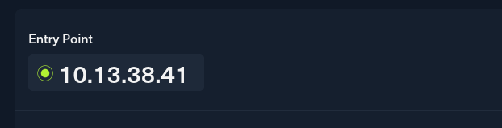
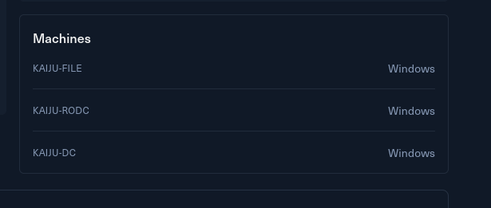

# Introduction

You are tasked with performing a red team engagement on Kaiju Inc. Your goal is to assess the security posture of the environment by attempting to gain access to the internal network and escalate privileges within the domain.

Kaiju is a small Active Directory scenario that provides hands-on experience with common Active Directory vulnerabilities and misconfigurations, demonstrating how attackers can pivot between services and retrieve sensitive data to move laterally and escalate privileges.

Kaiju is designed for penetration testers and red teamers in search of a quick and challenging lab. It is well-suited for those seeking to understand real-world misconfigurations and Active Directory attacks.

This **Red Team Operator I** lab will expose players to:

- Active Directory enumeration and attacks
- Abusing misconfigurations in common services
- DLL injections
- Network Pivoting
- Local privilege escalation
- Common Active Directory Certificate Services attacks

&nbsp;

# Entry Point

The challenge involves only one IP as the entry point:  

And I can also get a glimpse of the tech stack used by the challenge:

Now, without further do, I will move om to the entry point machine.