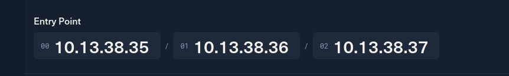
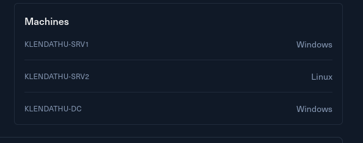

# Introduction

You are tasked with performing a penetration test on Klendathu, involving a mixed Active Directory environment.

Klendathu is a small Active Directory scenario that involves typical vulnerabilities found in real world company environments.

Klendathu is designed for penetration testers and red teamers in search of a quick and challenging lab.

This **Red Team Operator I** lab will expose players to:

- Enumeration
- Active Directory enumeration and attacks
- Mixed Kerberos Stacks
- Lateral movement
- Local privilege escalation
- Situational awareness

&nbsp;

# Entry Point

The challenge provides the following IPs as entry point:

Plus it shows also some insight of which machine pool I will be finding in the challenge:

Without further do I will start digging into machines.