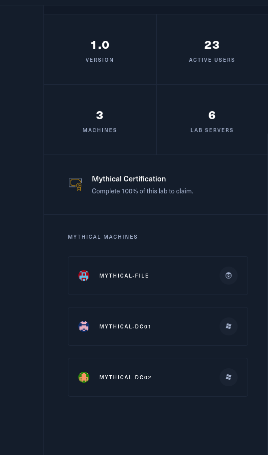

You are tasked with performing a red team engagement on Mythical Inc. The company does not allow data leaving the internal network, so a c2 server has been set up internally and an employee executed a payload in order to simulate a successful social engineering attack. Use the following credentials to login into the web interface of the Mythic c2 server on port 7443: mythic_admin:wG4jmjNcEcfmzv3QbEcJdSVTDEjCnX

Mythical is a small active directory scenario in which you start with an already running Mythic C2 beacon on an internal system. It is designed to practice operating through a C2 framework in a modern, challenging windows environment.

Mythical is designed for penetration testers and red teamers in search of a quick and challenging lab that has c2 infrastructure already set up in order to practice c2 operations.

This **Red Team Operator I** lab will expose players to:

- Enumeration
- Active Directory enumeration and attacks
- Active Directory Certificate Services
- Lateral movement
- Local privilege escalation
- Situational awareness
- MSSQL attacks
- C2 Operations

# Scoping

The customer("HTB") gives you the following IP as entry point **10.13.38.32** and from the challenge I expect finding 4 flags and only 3 machines in the rooster:

&nbsp;

But the challenge says 6 machines in total? And only 3 physical which means I expect finding:

- 3 VM(docker or similar)
- 3 physical servers