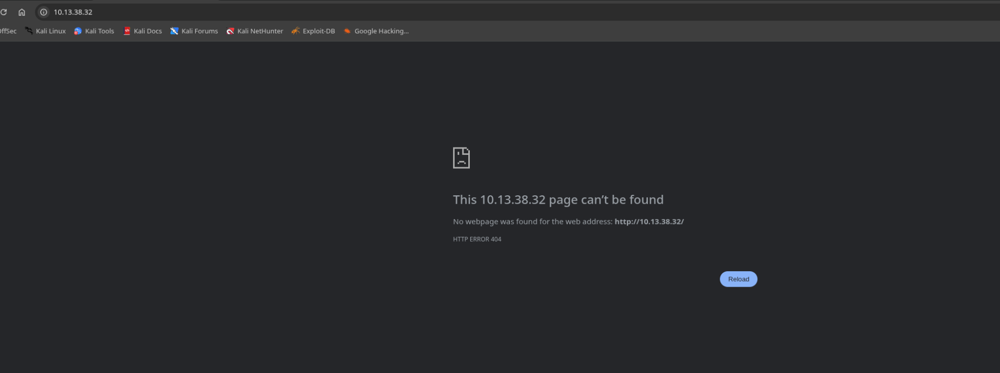
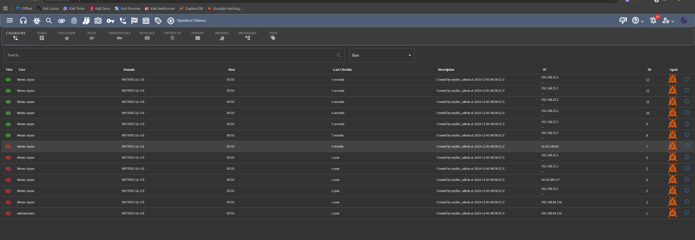
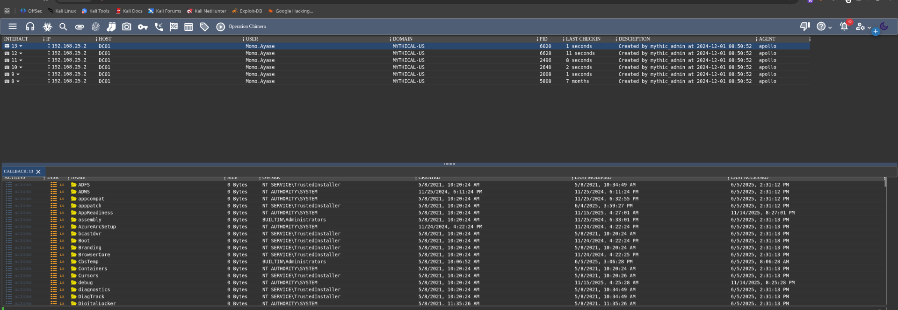
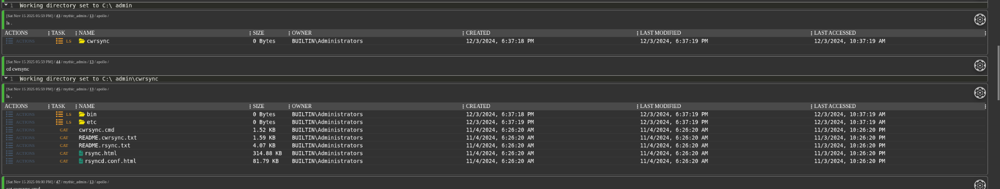
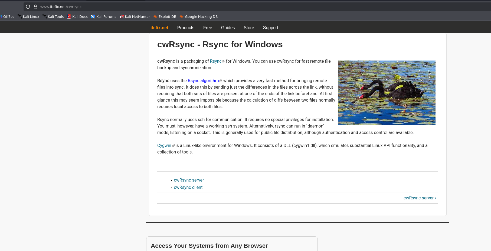
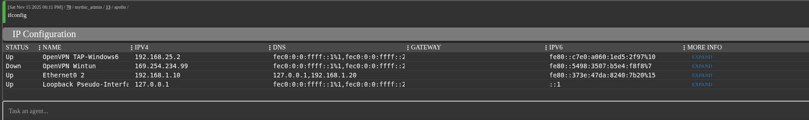

Now from the introduction I know that my entry point is in a beacon connection that gives me a entry point in the system but I will perform a scan anyway, just in case...

```bash
PORT     STATE SERVICE  REASON         VERSION
22/tcp   open  ssh      syn-ack ttl 63 OpenSSH 8.9p1 Ubuntu 3ubuntu0.11 (Ubuntu Linux; protocol 2.0)
| ssh-hostkey: 
|   256 bc:72:4a:3b:63:c7:d1:38:91:bb:2f:de:09:33:22:aa (ECDSA)
| ecdsa-sha2-nistp256 AAAAE2VjZHNhLXNoYTItbmlzdHAyNTYAAAAIbmlzdHAyNTYAAABBBIRS86V00IiW4/4aXm9Wi2SjXQrjJOrdGQnqnoum6KP4yYJouy2O6aqS8DeWtKp4VgCKfeK5Ep0G0I8v6mEJITg=
|   256 70:d1:de:e0:b6:a4:87:2f:01:6f:ac:91:4d:c8:67:0b (ED25519)
|_ssh-ed25519 AAAAC3NzaC1lZDI1NTE5AAAAICtRe2Yyy96OvhRjKNjzfPpCnggLy+kjO7JEeudd3evK
80/tcp   open  http     syn-ack ttl 63 Golang net/http server
| http-methods: 
|_  Supported Methods: GET POST
|_http-title: Site doesn't have a title (application/javascript; charset=utf-8).
|_http-server-header: NetDNA-cache/2.2
| fingerprint-strings: 
|   FourOhFourRequest, GetRequest: 
|     HTTP/1.0 404 Not Found
|     Cache-Control: max-age=0, no-cache
|     Content-Length: 0
|     Content-Type: application/javascript; charset=utf-8
|     Date: Sat, 15 Nov 2025 16:44:02 GMT
|     Pragma: no-cache
|     Server: NetDNA-cache/2.2
|   GenericLines, Help, LPDString, RTSPRequest, SIPOptions, SSLSessionReq, Socks5: 
|     HTTP/1.1 400 Bad Request
|     Content-Type: text/plain; charset=utf-8
|     Connection: close
|     Request
|   HTTPOptions: 
|     HTTP/1.0 405 Method Not Allowed
|     Allow: GET, POST
|     Content-Type: text/plain
|     Date: Sat, 15 Nov 2025 16:44:02 GMT
|     Content-Length: 22
|     method not allowed
|   OfficeScan: 
|     HTTP/1.1 400 Bad Request: missing required Host header
|     Content-Type: text/plain; charset=utf-8
|     Connection: close
|_    Request: missing required Host header
7443/tcp open  ssl/http syn-ack ttl 62 nginx 1.25.5
| http-title: 400 The plain HTTP request was sent to HTTPS port
|_Requested resource was /new/login
|_http-server-header: nginx/1.25.5
| http-methods: 
|_  Supported Methods: GET HEAD POST OPTIONS
| ssl-cert: Subject: organizationName=Mythic
| Issuer: organizationName=Mythic
| Public Key type: ec
| Public Key bits: 384
| Signature Algorithm: ecdsa-with-SHA384
| Not valid before: 2024-11-24T15:26:17
| Not valid after:  2025-11-24T15:26:17
| MD5:   bc51:3614:2940:10c1:3fc7:fb2b:f260:7b09
| SHA-1: a844:a1a0:9f51:4d03:6d59:00cd:3fe4:2811:d1ec:d967
| -----BEGIN CERTIFICATE-----
| MIIBkjCCARigAwIBAgIQa1OQHkerPRA7O0btJeXmaDAKBggqhkjOPQQDAzARMQ8w
| DQYDVQQKEwZNeXRoaWMwHhcNMjQxMTI0MTUyNjE3WhcNMjUxMTI0MTUyNjE3WjAR
| MQ8wDQYDVQQKEwZNeXRoaWMwdjAQBgcqhkjOPQIBBgUrgQQAIgNiAAQy+jz6IYVo
| VQhvSHqFHYsh7cDroduFFTCMfDgiB1fLP/15bbEoagcQGePBUxQ4lgJH4b/f3SpP
| m6qPI+T9f4RJL0g9LeW0DbzIGOn+q+bZoOxcME7EsRRLadWcpDgpsKmjNTAzMA4G
| A1UdDwEB/wQEAwIFoDATBgNVHSUEDDAKBggrBgEFBQcDATAMBgNVHRMBAf8EAjAA
| MAoGCCqGSM49BAMDA2gAMGUCMQCDvLavX0iChKtDmg9HSGr2Q7TAbbw5XW1GEtTz
| /Ho6HgWJwKXxEhYUQXORNDtkHZcCMFSqaj7Izqv+e23A0igygoSUXkefeNhlSFS9
| zSijYk/+cx/vPcvlYtacVUusXgcaPw==
|_-----END CERTIFICATE-----
1 service unrecognized despite returning data. If you know the service/version, please submit the following fingerprint at https://nmap.org/cgi-bin/submit.cgi?new-service :
SF-Port80-TCP:V=7.95%I=7%D=11/15%Time=6918ADD1%P=x86_64-pc-linux-gnu%r(Get
SF:Request,D7,"HTTP/1\.0\x20404\x20Not\x20Found\r\nCache-Control:\x20max-a
SF:ge=0,\x20no-cache\r\nContent-Length:\x200\r\nContent-Type:\x20applicati
SF:on/javascript;\x20charset=utf-8\r\nDate:\x20Sat,\x2015\x20Nov\x202025\x
SF:2016:44:02\x20GMT\r\nPragma:\x20no-cache\r\nServer:\x20NetDNA-cache/2\.
SF:2\r\n\r\n")%r(HTTPOptions,9E,"HTTP/1\.0\x20405\x20Method\x20Not\x20Allo
SF:wed\r\nAllow:\x20GET,\x20POST\r\nContent-Type:\x20text/plain\r\nDate:\x
SF:20Sat,\x2015\x20Nov\x202025\x2016:44:02\x20GMT\r\nContent-Length:\x2022
SF:\r\n\r\n405\x20method\x20not\x20allowed")%r(RTSPRequest,67,"HTTP/1\.1\x
SF:20400\x20Bad\x20Request\r\nContent-Type:\x20text/plain;\x20charset=utf-
SF:8\r\nConnection:\x20close\r\n\r\n400\x20Bad\x20Request")%r(FourOhFourRe
SF:quest,D7,"HTTP/1\.0\x20404\x20Not\x20Found\r\nCache-Control:\x20max-age
SF:=0,\x20no-cache\r\nContent-Length:\x200\r\nContent-Type:\x20application
SF:/javascript;\x20charset=utf-8\r\nDate:\x20Sat,\x2015\x20Nov\x202025\x20
SF:16:44:02\x20GMT\r\nPragma:\x20no-cache\r\nServer:\x20NetDNA-cache/2\.2\
SF:r\n\r\n")%r(GenericLines,67,"HTTP/1\.1\x20400\x20Bad\x20Request\r\nCont
SF:ent-Type:\x20text/plain;\x20charset=utf-8\r\nConnection:\x20close\r\n\r
SF:\n400\x20Bad\x20Request")%r(Help,67,"HTTP/1\.1\x20400\x20Bad\x20Request
SF:\r\nContent-Type:\x20text/plain;\x20charset=utf-8\r\nConnection:\x20clo
SF:se\r\n\r\n400\x20Bad\x20Request")%r(SSLSessionReq,67,"HTTP/1\.1\x20400\
SF:x20Bad\x20Request\r\nContent-Type:\x20text/plain;\x20charset=utf-8\r\nC
SF:onnection:\x20close\r\n\r\n400\x20Bad\x20Request")%r(LPDString,67,"HTTP
SF:/1\.1\x20400\x20Bad\x20Request\r\nContent-Type:\x20text/plain;\x20chars
SF:et=utf-8\r\nConnection:\x20close\r\n\r\n400\x20Bad\x20Request")%r(SIPOp
SF:tions,67,"HTTP/1\.1\x20400\x20Bad\x20Request\r\nContent-Type:\x20text/p
SF:lain;\x20charset=utf-8\r\nConnection:\x20close\r\n\r\n400\x20Bad\x20Req
SF:uest")%r(Socks5,67,"HTTP/1\.1\x20400\x20Bad\x20Request\r\nContent-Type:
SF:\x20text/plain;\x20charset=utf-8\r\nConnection:\x20close\r\n\r\n400\x20
SF:Bad\x20Request")%r(OfficeScan,A3,"HTTP/1\.1\x20400\x20Bad\x20Request:\x
SF:20missing\x20required\x20Host\x20header\r\nContent-Type:\x20text/plain;
SF:\x20charset=utf-8\r\nConnection:\x20close\r\n\r\n400\x20Bad\x20Request:
SF:\x20missing\x20required\x20Host\x20header");
Warning: OSScan results may be unreliable because we could not find at least 1 open and 1 closed port
Device type: general purpose|router
Running: Linux 4.X|5.X, MikroTik RouterOS 7.X
OS CPE: cpe:/o:linux:linux_kernel:4 cpe:/o:linux:linux_kernel:5 cpe:/o:mikrotik:routeros:7 cpe:/o:linux:linux_kernel:5.6.3
OS details: Linux 4.15 - 5.19, Linux 5.0 - 5.14, MikroTik RouterOS 7.2 - 7.5 (Linux 5.6.3)
TCP/IP fingerprint:
OS:SCAN(V=7.95%E=4%D=11/15%OT=22%CT=%CU=38005%PV=Y%DS=2%DC=T%G=N%TM=6918ADE
OS:A%P=x86_64-pc-linux-gnu)SEQ(SP=103%GCD=1%ISR=10C%TI=Z%CI=Z%II=I%TS=A)OPS
OS:(O1=M552ST11NW7%O2=M552ST11NW7%O3=M552NNT11NW7%O4=M552ST11NW7%O5=M552ST1
OS:1NW7%O6=M552ST11)WIN(W1=FE88%W2=FE88%W3=FE88%W4=FE88%W5=FE88%W6=FE88)ECN
OS:(R=Y%DF=Y%T=40%W=FAF0%O=M552NNSNW7%CC=Y%Q=)T1(R=Y%DF=Y%T=40%S=O%A=S+%F=A
OS:S%RD=0%Q=)T2(R=N)T3(R=N)T4(R=Y%DF=Y%T=40%W=0%S=A%A=Z%F=R%O=%RD=0%Q=)T5(R
OS:=Y%DF=Y%T=40%W=0%S=Z%A=S+%F=AR%O=%RD=0%Q=)T6(R=Y%DF=Y%T=40%W=0%S=A%A=Z%F
OS:=R%O=%RD=0%Q=)U1(R=Y%DF=N%T=40%IPL=164%UN=0%RIPL=G%RID=G%RIPCK=G%RUCK=G%
OS:RUD=G)IE(R=Y%DFI=N%T=40%CD=S)

Uptime guess: 4.997 days (since Mon Nov 10 17:49:28 2025)
Network Distance: 2 hops
TCP Sequence Prediction: Difficulty=259 (Good luck!)
IP ID Sequence Generation: All zeros
Service Info: OS: Linux; CPE: cpe:/o:linux:linux_kernel

TRACEROUTE (using port 443/tcp)
HOP RTT      ADDRESS
1   40.66 ms 10.10.14.1
2   40.72 ms 10.13.38.32

```

# HTTP

Now the default port HTTP seems not working, or at least it is not hosting anything on the root folder:



I think this must be the connection used by C2 to get back the connection from the beacons. And in case I tried to do some easy fuzzing and indeed nothing is connected so far:

```bash
└─$ dirsearch -u "http://10.13.38.32/" --crawl 
/usr/lib/python3/dist-packages/dirsearch/dirsearch.py:23: DeprecationWarning: pkg_resources is deprecated as an API. See https://setuptools.pypa.io/en/latest/pkg_resources.html
  from pkg_resources import DistributionNotFound, VersionConflict

  _|. _ _  _  _  _ _|_    v0.4.3
 (_||| _) (/_(_|| (_| )

Extensions: php, aspx, jsp, html, js | HTTP method: GET | Threads: 25 | Wordlist size: 11460

Output File: /home/millycash/reports/http_10.13.38.32/__25-11-15_17-49-09.txt

Target: http://10.13.38.32/

[17:49:09] Starting: 

Task Completed

```

# Port 7443

Now I will use the provided credentials to login to the C2 management portal and see what can I see so far.

And I see only the DC01 but seems like the server has some different IP from the same server? This might be ietherold callbacks most likely...  Now I will take one of the agents and check what can i do here.



Now I do expect  to see a rsync?



Now this looks like a Rsync implementation for Windows:  


Now i can do some shell commands to get a info about the Domain and so on...

```bash
Host Name:                 DC01
OS Name:                   Microsoft Windows Server 2022 Datacenter
OS Version:                10.0.20348 N/A Build 20348
OS Manufacturer:           Microsoft Corporation
OS Configuration:          Primary Domain Controller
OS Build Type:             Multiprocessor Free
Registered Owner:          Windows User
Registered Organization:   
Product ID:                00454-70295-72962-AA278
Original Install Date:     11/24/2024, 7:07:20 AM
System Boot Time:          11/14/2025, 7:24:46 PM
System Manufacturer:       VMware, Inc.
System Model:              VMware20,1
System Type:               x64-based PC
Processor(s):              2 Processor(s) Installed.
                           [01]: AMD64 Family 25 Model 1 Stepping 1 AuthenticAMD ~2445 Mhz
                           [02]: AMD64 Family 25 Model 1 Stepping 1 AuthenticAMD ~2445 Mhz
BIOS Version:              VMware, Inc. VMW201.00V.24504846.B64.2501180339, 1/18/2025
Windows Directory:         C:\Windows
System Directory:          C:\Windows\system32
Boot Device:               \Device\HarddiskVolume2
System Locale:             en-us;English (United States)
Input Locale:              en-us;English (United States)
Time Zone:                 (UTC-08:00) Pacific Time (US & Canada)
Total Physical Memory:     4,095 MB
Available Physical Memory: 2,683 MB
Virtual Memory: Max Size:  5,503 MB
Virtual Memory: Available: 3,934 MB
Virtual Memory: In Use:    1,569 MB
Page File Location(s):     C:\pagefile.sys
Domain:                    mythical-us.vl
Logon Server:              \\DC01
Hotfix(s):                 N/A
Network Card(s):           4 NIC(s) Installed.
                           [01]: Wintun Userspace Tunnel
                                 Connection Name: OpenVPN Wintun
                                 Status:          Media disconnected
                           [02]: TAP-Windows Adapter V9
                                 Connection Name: OpenVPN TAP-Windows6
                                 DHCP Enabled:    Yes
                                 DHCP Server:     192.168.25.0
                                 IP address(es)
                                 [01]: 192.168.25.2
                                 [02]: fe80::c7e0:a060:1ed5:2f97
                           [03]: OpenVPN Data Channel Offload
                                 Connection Name: OpenVPN Data Channel Offload
                                 Status:          Hardware not present
                           [04]: vmxnet3 Ethernet Adapter
                                 Connection Name: Ethernet0 2
                                 DHCP Enabled:    No
                                 IP address(es)
                                 [01]: 192.168.1.10
                                 [02]: fe80::373e:47da:8240:7b20
Hyper-V Requirements:      A hypervisor has been detected. Features required for Hyper-V will not be displayed.

```

Now the goal here is to upload sharphound and check what the hell I can see. But I can also see that there is another subnet here(192.168.1.10)?  


Ok I will move on to the specific server DC01.