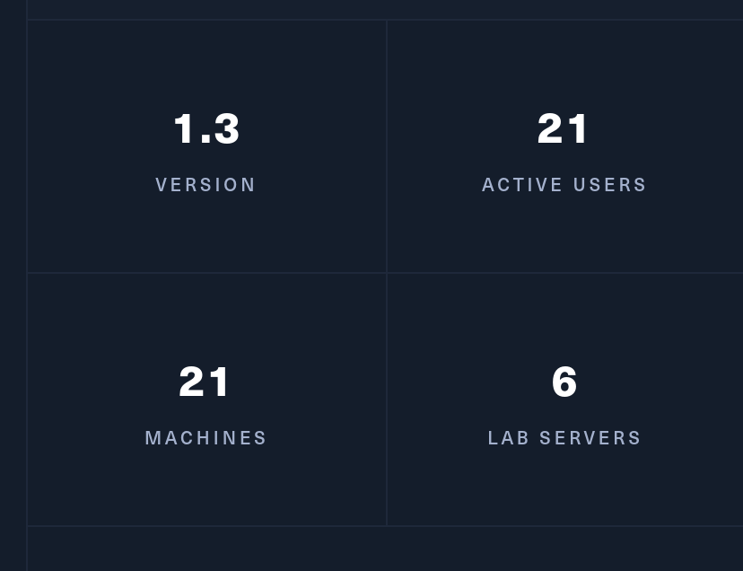
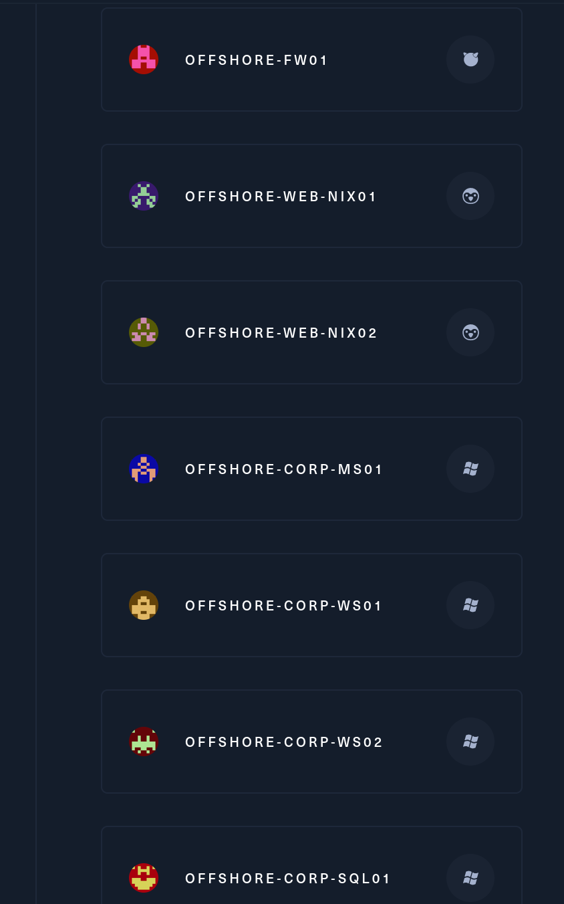
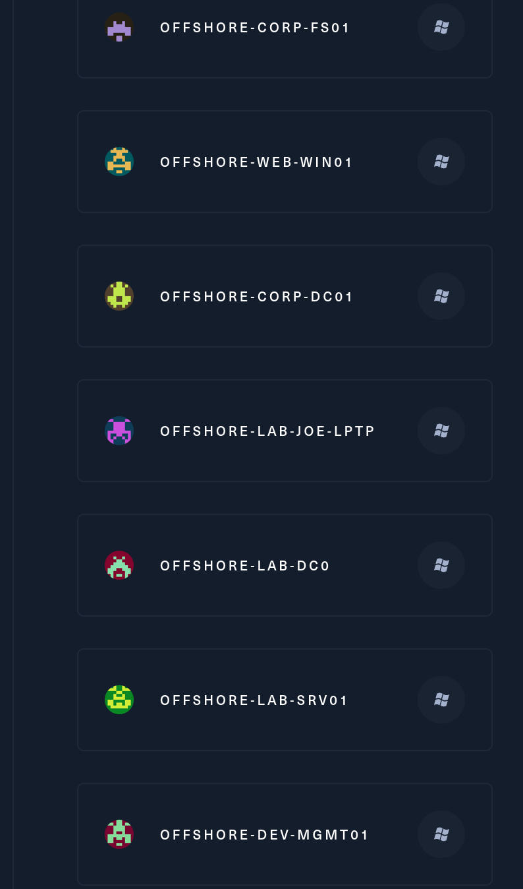
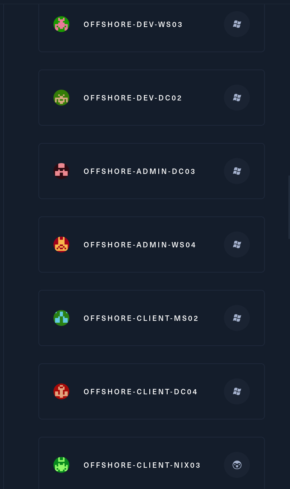

Offshore is a real-world enterprise environment that features a wide range of modern Active Directory flaws and misconfigurations. Offshore Corp is mandated to have quarterly penetration tests per financial regulatory body compliance requirements, and are focused on patching. The company has completed several acquisitions, with the acquired entities being "plugged in" by means of domain trusts.

If you are able to breach the perimeter and gain a foothold, you are tasked to explore the corporate environment, pivot across trust boundaries, and ultimately attempt to compromise all Offshore Corp entities.

Offshore will test your understanding of Active Directory enumeration, exploitation, and post-exploitation as well as lateral movement, pivoting, and modern web application attacks. Some flags are required to advance through the lab, while others are side-quests that reinforce enumeration and post-exploitation skills. Players can submit flags to earn their place in the Offshore Hall of Fame, and collect badges along the way at certain checkpoints.

This **Penetration Tester Level II** lab will expose players to:

- Enumeration
- Evading endpoint protections
- Exploitation of a wide range of real-world Active Directory flaws
- Lateral movement and crossing trust boundaries
- Privilege escalation
- Web application attacks

&nbsp;

# Scoping

So far we are getting a /24 subnet as entry point: **10.10.110.0/24**.

And we know that it is supposedly being mostly Windows based servers with some sprinkles of Unix; I don´t get a denied  list of machines that I am not allowed to "touch" but my guessing is that FW and other sensitive devices are out of scope!

I know there should be 21 virtual servers and several networks:

And we can see as well the name/OS of those.

Damn that is a respecably big environment, but without further do I will strart by enumeating the DMZ perimetral network.