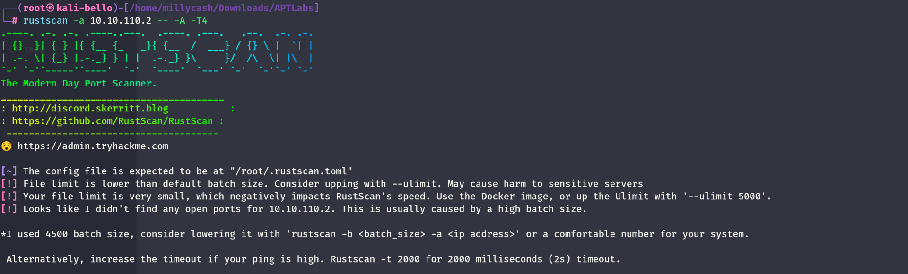

I will start by checking the 65k(ish) services that are alive on the TCP protocoll. But I see it is getting stuck in the WAF somewhere which makes me wonder if this machine is out of scope?



And will do same for the first 1k(ish) services running on the UDP as well.

```
┌──(root㉿kali-bello)-[/home/millycash/Downloads/APTLabs]
└─# nmap -F -sU 10.10.110.2
Starting Nmap 7.94SVN ( https://nmap.org ) at 2024-06-30 13:09 CEST
Nmap scan report for 10.10.110.2
Host is up (0.027s latency).
All 100 scanned ports on 10.10.110.2 are in ignored states.
Not shown: 100 open|filtered udp ports (no-response)

Nmap done: 1 IP address (1 host up) scanned in 3.98 seconds
```

Same story here I guess we can move on so far, this must be used by the backend network and it should be out of scope.