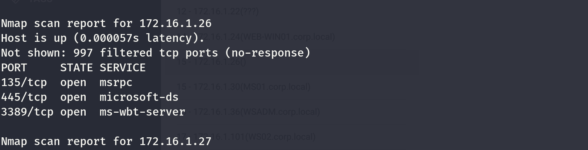

I will start again by using FPING to check all the alive hosts on the network:

```
┌──(root㉿kali-bello)-[/home/millycash/Downloads/OffShore]
└─# fping -asgq 172.16.1.0/24
172.16.1.5
172.16.1.24
172.16.1.15
172.16.1.22
172.16.1.23
172.16.1.30
172.16.1.36
172.16.1.101
172.16.1.201
172.16.1.200
172.16.1.220
172.16.1.200 : duplicate for [0], 64 bytes, 75.8 ms
172.16.1.201 : duplicate for [0], 64 bytes, 62.1 ms

     254 targets
      11 alive
     243 unreachable
       0 unknown addresses

     974 timeouts (waiting for response)
     985 ICMP Echos sent
      13 ICMP Echo Replies received
       0 other ICMP received

 55.3 ms (min round trip time)
 193 ms (avg round trip time)
 549 ms (max round trip time)
        9.605 sec (elapsed real time)
```

Nice I see 10(we need to remove the .23 which is NIX01) hosts alive, I will do same but this time with NMAP to check for all the hosts alive as well and compare the results but I see a lot of false positives.

So I will perform a ping sweep scan from Linux instead.

```
root@NIX01:/tmp# for i in {1..254} ;do (ping 172.16.1.$i -c 1 -w 5  >/dev/null && echo "172.16.1.$i" &) ;done
172.16.1.5
172.16.1.15
172.16.1.22
172.16.1.23
172.16.1.24
172.16.1.30
172.16.1.36
172.16.1.101
172.16.1.200
172.16.1.201
172.16.1.220
```

I see the same shit, I feel comfortable we can move on.

&nbsp;

# EDIT

Apparently here I missed another machine:

