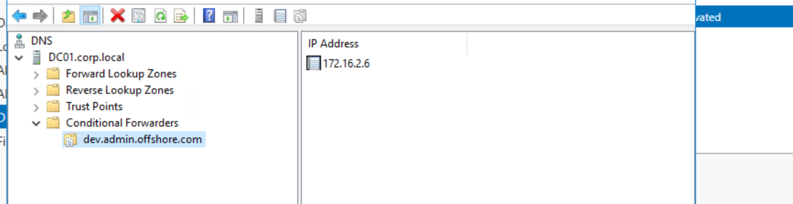

Checking on the DC01 we can see that the server is indeed trusted with another domain:

```
┌──(root㉿kali-bello)-[/home/millycash/Downloads/OffShore/lab.offshore.local]
└─# NetExec ldap 172.16.1.5 -u 'Administrator' -H 0109d7e72fcfe404186c4079ba6cf79c -M enum_trusts
SMB         172.16.1.5      445    DC01             [*] Windows Server 2016 Standard 14393 x64 (name:DC01) (domain:corp.local) (signing:True) (SMBv1:True)
LDAP        172.16.1.5      389    DC01             [+] corp.local\Administrator:0109d7e72fcfe404186c4079ba6cf79c (Pwn3d!)
ENUM_TRUSTS 172.16.1.5      389    DC01             [+] Found the following trust relationships:
ENUM_TRUSTS 172.16.1.5      389    DC01             dev.ADMIN.OFFSHORE.COM -> Bidirectional -> Quarantined Domain
```

And checking on the DC01 on the DNS we can see it possible ip:



Without further do I will connect a new Ligolo and start the enumeration.

```
┌──(root㉿kali-bello)-[/home/millycash/Downloads/OffShore]
└─# fping -asgq 172.16.2.0/24                                              
172.16.2.6
172.16.2.102

     254 targets
       2 alive
     252 unreachable
       0 unknown addresses

    1008 timeouts (waiting for response)
    1010 ICMP Echos sent
       2 ICMP Echo Replies received
       0 other ICMP received

 31.3 ms (min round trip time)
 34.4 ms (avg round trip time)
 37.5 ms (max round trip time)
        9.550 sec (elapsed real time)
```

Only 2 so let's try to use NMAP as well but I see same shit.

&nbsp;

&nbsp;