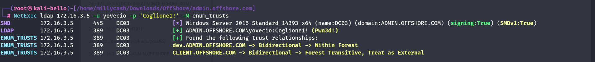
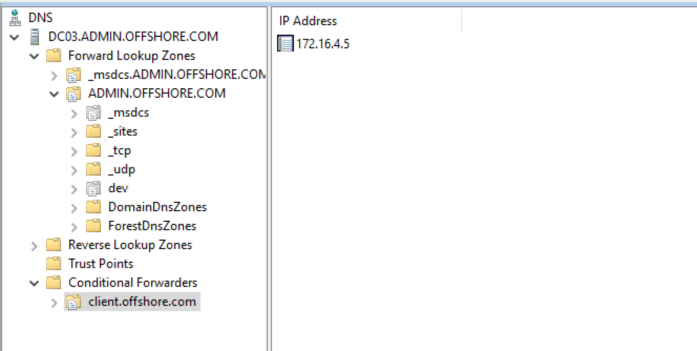
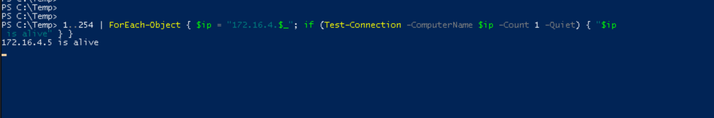

We know so far that the `DC03` can talk to another domain at `client.offshore.com`.





Can we see something again by using our credentials from the ADMIN domain? So again setting up the connection and we can start with FPING to check all the available hosts on the new network:

```
┌──(root㉿kali-bello)-[/home/millycash/Downloads/OffShore/admin.offshore.com]
└─# fping -asgq 172.16.4.0/24
172.16.4.5
172.16.4.31

     254 targets
       2 alive
     252 unreachable
       0 unknown addresses

    1008 timeouts (waiting for response)
    1010 ICMP Echos sent
       2 ICMP Echo Replies received
       0 other ICMP received

 44.1 ms (min round trip time)
 61.0 ms (avg round trip time)
 78.0 ms (max round trip time)
        9.808 sec (elapsed real time)
```

I see only 2 on the meantime I will launch a similar command but natively in powershell:



&nbsp;

&nbsp;