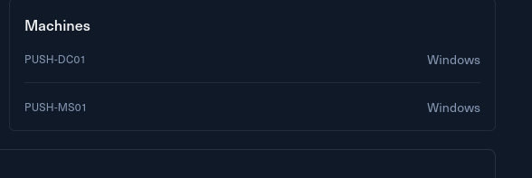

# Introduction

You are tasked with performing a penetration test on Push, a small Windows Active Directory environment. You will be required to exploit real-world applications and chain attack techniques using common services and management applications found in enterprise environments.

Push is a small Windows Active Directory lab featuring a one domain controller and one member server. The lab focuses on advanced attack techniques including ClickOnce application exploitation, SCCM coercion, and ADCS exploitation via Golden Certificate attacks.

Push is designed for advanced penetration testers and red teamers seeking to practice advanced Windows AD attack techniques including certificate-based attacks and application deployment abuse.

**This Red Team Operator Level 1** lab will expose players to key techniques for attacking Active Directory environments, including:

- Crafting malicious ClickOnce deployments
- Coercing NTLM authentication with SCCM
- ADCS Golden Certificate attacks
- Advanced lateral movement techniques in Windows environments
- Active Directory misconfigurations

# Entry Point

Same here I can see a quick glimpse of the tech-stack used by the challlenge.

And I can also see entry points IP used by the challenge, but without furher do I will move on with the enumeration of the machines.

