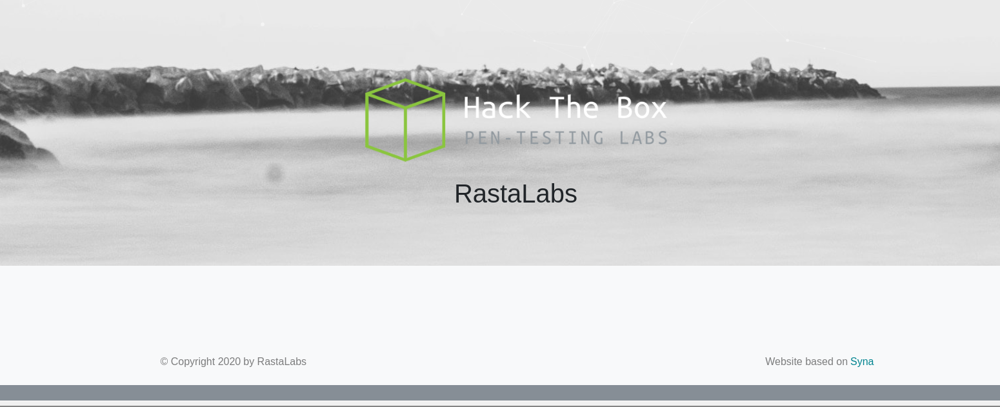
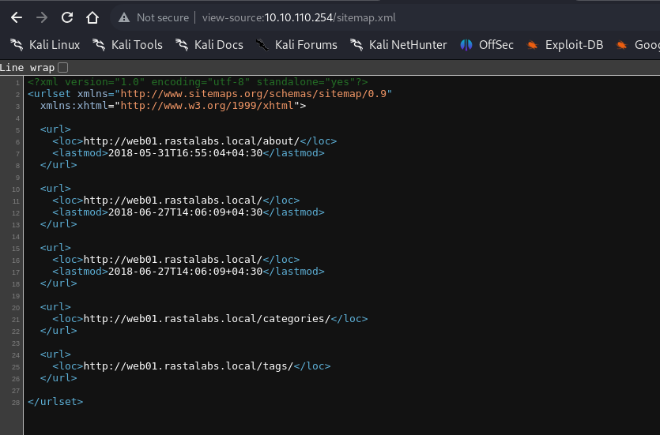
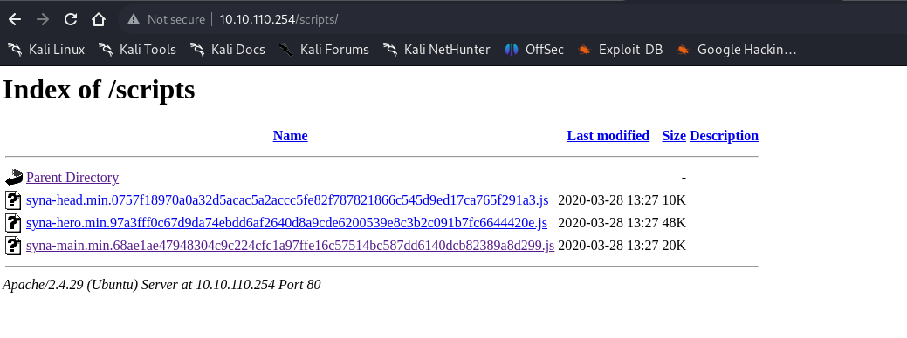
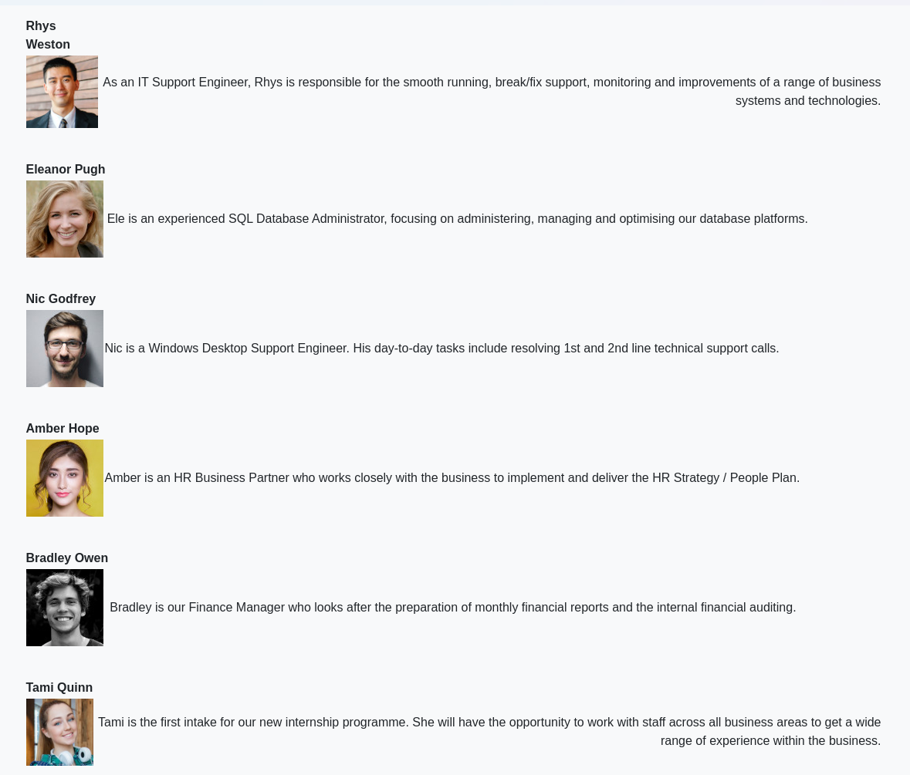
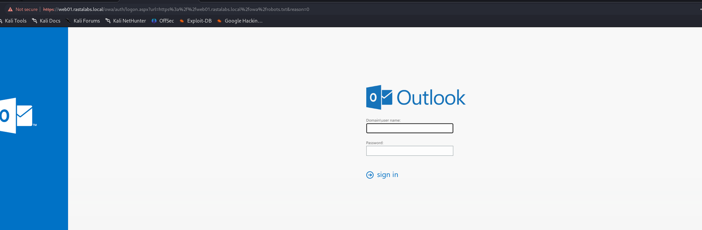
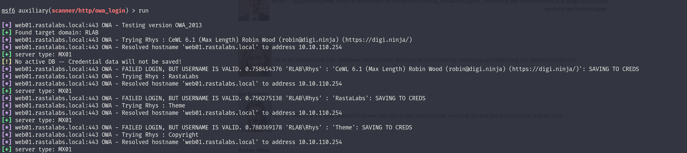

We can start by checking for possible running services on the TCP vector:

```
┌──(root㉿DESKTOP-1KSM320)-[/home/aleksandar/Downloads/RASTALABS]
└─# nmap -p- -A -T4 10.10.110.254
Starting Nmap 7.94 ( https://nmap.org ) at 2023-09-20 14:23 CEST
Stats: 0:00:21 elapsed; 0 hosts completed (1 up), 1 undergoing SYN Stealth Scan
Nmap scan report for 10.10.110.254
Host is up (0.039s latency).
Not shown: 65533 filtered tcp ports (no-response)
PORT    STATE SERVICE  VERSION
80/tcp  open  http     Apache httpd 2.4.29 ((Ubuntu))
|_http-generator: Hugo 0.68.3
|_http-server-header: Apache/2.4.29 (Ubuntu)
|_http-title: RastaLabs
443/tcp open  ssl/http Microsoft IIS httpd 10.0
|_http-server-header: Microsoft-IIS/10.0
| http-title: Outlook
|_Requested resource was https://10.10.110.254/owa/auth/logon.aspx?url=https%3a%2f%2f10.10.110.254%2fowa%2f&reason=0
| ssl-cert: Subject: commonName=mx01
| Subject Alternative Name: DNS:mx01, DNS:mx01.rastalabs.local
| Not valid before: 2017-10-15T14:05:13
|_Not valid after:  2022-10-15T14:05:13
|_ssl-date: 2023-09-20T12:26:14+00:00; +1s from scanner time.
| tls-alpn: 
|   h2
|_  http/1.1
Warning: OSScan results may be unreliable because we could not find at least 1 open and 1 closed port
OS fingerprint not ideal because: Missing a closed TCP port so results incomplete
No OS matches for host
Network Distance: 2 hops
Service Info: OS: Windows; CPE: cpe:/o:microsoft:windows
```

We can see that this webserver is hosting a OWA email link. I will run a scan on the UDP ports and check what exactly can i find on the other side.

```
┌──(root㉿DESKTOP-1KSM320)-[/home/aleksandar/Downloads/RASTALABS]
└─# nmap -sU -F 10.10.110.254
Starting Nmap 7.94 ( https://nmap.org ) at 2023-09-20 14:28 CEST
Stats: 0:00:02 elapsed; 0 hosts completed (1 up), 1 undergoing UDP Scan
UDP Scan Timing: About 5.00% done; ETC: 14:29 (0:00:19 remaining)
Nmap scan report for 10.10.110.254
Host is up (0.031s latency).
All 100 scanned ports on 10.10.110.254 are in ignored states.
Not shown: 100 open|filtered udp ports (no-response)

Nmap done: 1 IP address (1 host up) scanned in 32.20 seconds
```

&nbsp;I will move to singular services now.

* * *

## HTTP:

Surfing manually to the website we are in front of a company webpage:



I will start by fuzzing for possible hidden web directories on the host:

```
┌──(root㉿DESKTOP-1KSM320)-[/home/aleksandar/Downloads/RASTALABS]
└─# dirsearch -u "http://10.10.110.254/"

  _|. _ _  _  _  _ _|_    v0.4.3.post1
 (_||| _) (/_(_|| (_| )

Extensions: php, aspx, jsp, html, js | HTTP method: GET | Threads: 25 | Wordlist size: 11460

Output File: /home/aleksandar/Downloads/RASTALABS/reports/http_10.10.110.254/__23-09-20_14-33-08.txt

Target: http://10.10.110.254/

[14:33:08] Starting: 
[14:33:14] 403 -  278B  - /.ht_wsr.txt                                      
[14:33:14] 403 -  278B  - /.htaccess.bak1                                   
[14:33:14] 403 -  278B  - /.htaccess_extra                                  
[14:33:14] 403 -  278B  - /.htaccess.orig                                   
[14:33:14] 403 -  278B  - /.htaccess_orig
[14:33:14] 403 -  278B  - /.htaccessOLD
[14:33:14] 403 -  278B  - /.htaccess_sc
[14:33:14] 403 -  278B  - /.htaccess.sample                                 
[14:33:14] 403 -  278B  - /.htm                                             
[14:33:14] 403 -  278B  - /.htaccessOLD2
[14:33:14] 403 -  278B  - /.htaccessBAK
[14:33:14] 403 -  278B  - /.html
[14:33:14] 403 -  278B  - /.htpasswd_test                                   
[14:33:14] 403 -  278B  - /.htpasswds
[14:33:14] 403 -  278B  - /.htaccess.save                                   
[14:33:14] 403 -  278B  - /.httr-oauth
[14:33:24] 200 -    3KB - /404.html                                         
[14:33:28] 301 -  314B  - /about  ->  http://10.10.110.254/about/           
[14:34:04] 301 -  319B  - /categories  ->  http://10.10.110.254/categories/ 
[14:34:26] 200 -   15KB - /favicon.ico                                      
[14:34:28] 301 -  314B  - /fonts  ->  http://10.10.110.254/fonts/           
[14:34:35] 301 -  315B  - /images  ->  http://10.10.110.254/images/         
[14:34:35] 200 -  528B  - /images/
[14:35:14] 301 -  316B  - /scripts  ->  http://10.10.110.254/scripts/       
[14:35:14] 200 -  636B  - /scripts/                                         
[14:35:14] 403 -  278B  - /server-status                                    
[14:35:14] 403 -  278B  - /server-status/                                   
[14:35:17] 200 -  258B  - /sitemap.xml                                      
[14:35:21] 301 -  313B  - /tags  ->  http://10.10.110.254/tags/
```

Umh stripped pretty much, but that sitemap and script folder seems interesting. Starting by sitemap.xml:



Nice we can identify this as web01.rastalabs.local, that might be good to add since it can show other interesting parts of the website that could be hidden if not accessed with FQDN.

Next checking the /script folder shows what seems JS scripts used by the backend theme/engine:



Lastly checking under /about we can see a list of the members where we could use to generate a list of usernames for future use and possible password spray lists.



I will add the host and check again on the website if something other arises. But even re-running Dirsearch web directories fuzzing with FQDN in the URL isn't showing more interesting stuff so I'm starting to wonder if there are any other VHOST(aka subdomains hosted on this machine)?

```
┌──(root㉿DESKTOP-1KSM320)-[/home/aleksandar/Downloads]
└─# ffuf -w /usr/share/seclists/Discovery/DNS/subdomains-top1million-20000.txt -u http://rastalabs.local/ -H "Host:FUZZ.rastalabs.local" -fl 496                                                                                                             

        /'___\  /'___\           /'___\       
       /\ \__/ /\ \__/  __  __  /\ \__/       
       \ \ ,__\\ \ ,__\/\ \/\ \ \ \ ,__\      
        \ \ \_/ \ \ \_/\ \ \_\ \ \ \ \_/      
         \ \_\   \ \_\  \ \____/  \ \_\       
          \/_/    \/_/   \/___/    \/_/       

       v2.0.0-dev
________________________________________________

 :: Method           : GET
 :: URL              : http://rastalabs.local/
 :: Wordlist         : FUZZ: /usr/share/seclists/Discovery/DNS/subdomains-top1million-20000.txt
 :: Header           : Host: FUZZ.rastalabs.local
 :: Follow redirects : false
 :: Calibration      : false
 :: Timeout          : 10
 :: Threads          : 40
 :: Matcher          : Response status: 200,204,301,302,307,401,403,405,500
 :: Filter           : Response lines: 496
________________________________________________

:: Progress: [19966/19966] :: Job [1/1] :: 732 req/sec :: Duration: [0:00:27] :: Errors: 0 ::
```

* * *

## Attacking OWA

We know froom our inital scan that HTTPS service running on the default port 443:



Now the only remaining thing is to check for password bruteforce and I will try to explort a list of passwords from /about with cewl:

```
┌──(root㉿DESKTOP-1KSM320)-[/home/aleksandar/Downloads/RASTALABS]
└─# cewl -m 5 http://web01.rastalabs.local/about/ > cewl.txt
```

and I will export the userlist, here we must understand if is used name or name.surname or similar...



From a short test seems like the domain identified is RLAB and the username is just the NAME of the user. Now most likely we need to mangle thru the list and add some simbols so the password matches some complexity(I filtered all the words longer that 5 chars in prior, but that might not be enough).

&nbsp;

&nbsp;

&nbsp;