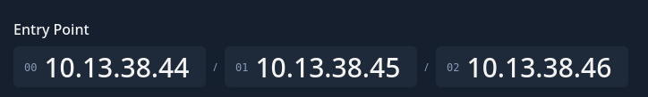
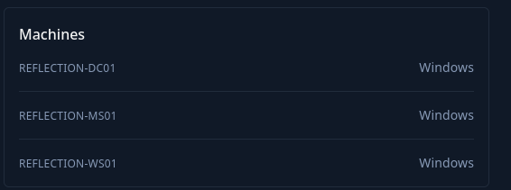

# Introduction

You are tasked with performing a penetration test on Reflection, an Active Directory environment that simulates a realistic multi-host Windows infrastructure.

Reflection is a medium-difficulty Active Directory scenario that simulates a vulnerable enterprise environment and challenges users to progress from limited access to Domain Administrator.

Reflection is designed for penetration testers and red teamers looking to deepen their understanding of enterprise Active Directory environments. It is well-suited for those who want to practice chaining multiple weaknesses across services and identity infrastructure to achieve full domain compromise.

This Red Team Operator Level 1 lab will expose players to:

- MSSQL enumeration and credential discovery
- NTLM hash relay attacks
- Active Directory enumeration with BloodHound
- Local Administrator Password Solution (LAPS) abuse
- Resource-Based Constrained Delegation (RBCD)
- Credential harvesting and lateral movement

# Entry Points

And I have 3 private IPs as entry points:

And I can also get a quick glimpse of what OS will be in this challenge, but without further do I will move on to the specifi IP pages.

