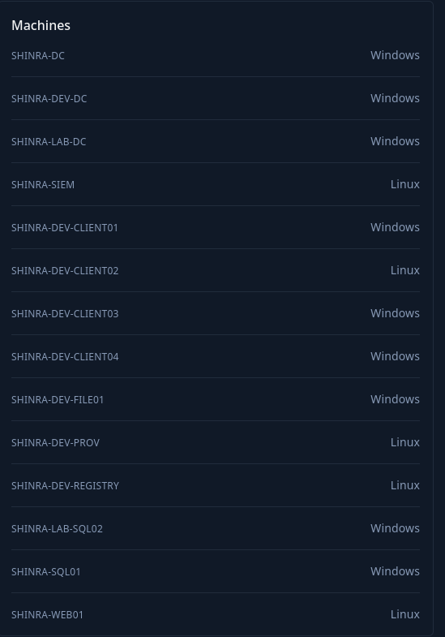

# Introduction

Shinra is a electric power company with a fairly good security stance. Your mission is to infiltrate the company from the perspective of an external attacker in form of a red team engagement. Shinra is running a 24/7 SOC and has an EDR running on all endpoints. The company provided you with a read-only account on the SOC on http://siem.shinra.vl (10.10.110.25) so you can get real-time feedback on your actions. You can login using viewer : 1895f70ea4 credentials. The SOC itself is not in scope of this engagement.

Shinra is a typical real world environment, designed to put your red team skills to the test. This lab is focused on operating covertly without triggering detection mechanisms. You will be able to see detections in near real time and be able to tune your actions accordingly.

Shinra is for people who already have basic knowledge in AD topics and pentesting and want to dive into red teaming.

This Red Team Operator Level 1 lab will expose players to:

- Network & Active Directory Enumeration
- Active Directory & Custom Exploitation
- Active Directory Certificate Services
- Lateral Movement across multiple Forests
- Phishing Attacks
- Attacking CI/CD Infrastructure
- Bypassing EDR Solutions
- Backdooring Applications
- Relay Attacks
- Operating covertly

&nbsp;

# Entry Points

I am provided a whole /24 subnet as entry point for this challenge.


But I am also aware of the whole tech-stack that the challenge is involving with a mixed pool of majority of Windows based with a sprinkle of Linux here and there.



# Initial Enumeration

I will perform a quick ping scan in order to identify all the machines that are alive on this challenge(so far I know the .25 is the SIEM).

```bash
└─$ fping -asqg 10.10.110.0/24
10.10.110.2
10.10.110.20
10.10.110.25

     254 targets
       3 alive
     251 unreachable
       0 unknown addresses

    1004 timeouts (waiting for response)
    1007 ICMP Echos sent
       3 ICMP Echo Replies received
      11 other ICMP received

 73.6 ms (min round trip time)
 74.6 ms (avg round trip time)
 76.5 ms (max round trip time)
        9.661 sec (elapsed real time)


```

Umh that's sad, not much but it might mean that I will need to pivot somehow? I will move on to the specific pages.

&nbsp;

&nbsp;