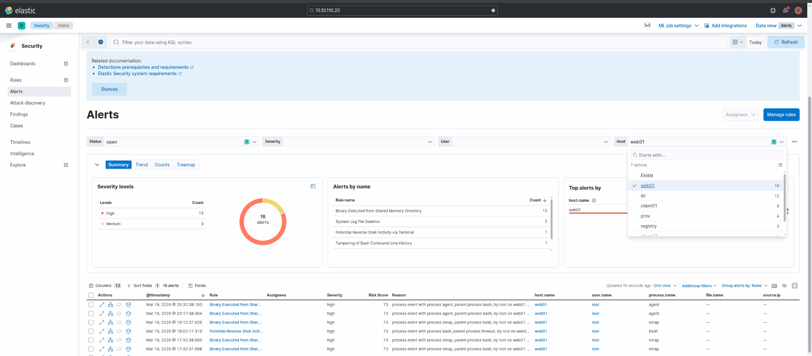

Again here not much on the TCP stack, I suspect this is only for the SIEM team use.

```bash
PORT   STATE SERVICE REASON         VERSION
22/tcp open  ssh     syn-ack ttl 63 OpenSSH 8.9p1 Ubuntu 3ubuntu0.13 (Ubuntu Linux; protocol 2.0)
| ssh-hostkey: 
|   256 a8:93:f2:10:03:d3:19:42:71:c2:44:3f:41:76:99:ba (ECDSA)
| ecdsa-sha2-nistp256 AAAAE2VjZHNhLXNoYTItbmlzdHAyNTYAAAAIbmlzdHAyNTYAAABBBNnG7Khva7qv0IRbEUqqAnsWPQsph53reinVWcWcnwvRRCsq9VuYkxz7+c1igeDdhWqDkD/NKrBbULtSe2eSe/c=
|   256 4e:1d:98:bd:66:ff:8e:59:e8:d1:1e:fc:c5:d0:d7:84 (ED25519)
|_ssh-ed25519 AAAAC3NzaC1lZDI1NTE5AAAAICETM6OFLzCweVOaDNv3kCdEvmcBExuIxA56QJZ+YfWP
80/tcp open  http    syn-ack ttl 63 nginx 1.18.0 (Ubuntu)
|_http-trane-info: Problem with XML parsing of /evox/about
| http-methods: 
|_  Supported Methods: GET HEAD POST OPTIONS
|_http-server-header: nginx/1.18.0 (Ubuntu)
| http-title: Elastic
|_Requested resource was /login?next=%2F
|_http-favicon: Unknown favicon MD5: 692D7AC0F545D91A498B970108195F41
Warning: OSScan results may be unreliable because we could not find at least 1 open and 1 closed port
Device type: general purpose|router
Running: Linux 4.X|5.X, MikroTik RouterOS 7.X
OS CPE: cpe:/o:linux:linux_kernel:4 cpe:/o:linux:linux_kernel:5 cpe:/o:mikrotik:routeros:7 cpe:/o:linux:linux_kernel:5.6.3
OS details: Linux 4.15 - 5.19, Linux 5.0 - 5.14, MikroTik RouterOS 7.2 - 7.5 (Linux 5.6.3)
TCP/IP fingerprint:
OS:SCAN(V=7.98%E=4%D=3/19%OT=22%CT=%CU=32184%PV=Y%DS=2%DC=T%G=N%TM=69BC4177
OS:%P=x86_64-pc-linux-gnu)SEQ(SP=106%GCD=1%ISR=10C%TI=Z%CI=Z%II=I%TS=A)OPS(
OS:O1=M552ST11NW7%O2=M552ST11NW7%O3=M552NNT11NW7%O4=M552ST11NW7%O5=M552ST11
OS:NW7%O6=M552ST11)WIN(W1=FE88%W2=FE88%W3=FE88%W4=FE88%W5=FE88%W6=FE88)ECN(
OS:R=Y%DF=Y%T=40%W=FAF0%O=M552NNSNW7%CC=Y%Q=)T1(R=Y%DF=Y%T=40%S=O%A=S+%F=AS
OS:%RD=0%Q=)T2(R=N)T3(R=N)T4(R=Y%DF=Y%T=40%W=0%S=A%A=Z%F=R%O=%RD=0%Q=)T5(R=
OS:Y%DF=Y%T=40%W=0%S=Z%A=S+%F=AR%O=%RD=0%Q=)T6(R=Y%DF=Y%T=40%W=0%S=A%A=Z%F=
OS:R%O=%RD=0%Q=)U1(R=Y%DF=N%T=40%IPL=164%UN=0%RIPL=G%RID=G%RIPCK=G%RUCK=G%R
OS:UD=G)IE(R=Y%DFI=N%T=40%CD=S)

Uptime guess: 5.359 days (since Sat Mar 14 10:56:33 2026)
Network Distance: 2 hops
TCP Sequence Prediction: Difficulty=262 (Good luck!)
IP ID Sequence Generation: All zeros
Service Info: OS: Linux; CPE: cpe:/o:linux:linux_kernel

TRACEROUTE (using port 443/tcp)
HOP RTT      ADDRESS
1   79.18 ms 10.10.14.1
2   79.25 ms siem.shinra.vl (10.10.110.25)

```

# SIEM

Here is possible to check all the logs of the errors as stated by the challenge introduction.

