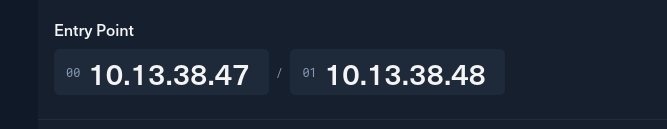
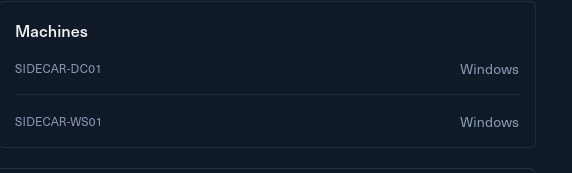

# Introduction

You are tasked with performing a penetration test on Sidecar, involving a Windows only Active Directory environment.

Sidecar is a small Active Directory chain that contains 2 Windows machines, however, attacks are not for beginners on Active Directory Pentesting.

Sidecar is designed for penetration testers and red teamers in search of an advanced lab.

**This Red Team Operator Level 1** lab will expose players to:

- Active Directory attacks
- Shadow Credential attacks
- Kerberos attacks
- Abusing SeTcbPrivilege privilege
- .lnk file abuses.

&nbsp;

# Entry Point

As usual I am also provided 2 private IPs as entry points for this challenge:

And I can get a quick glimpse of what is the tech stack used by the challenge as well.

Without further due, I will move on to the IPs for further analysis.

&nbsp;