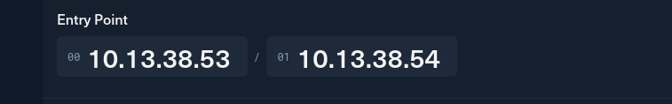
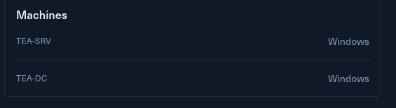

# Introduction

You are tasked with performing a red team engagement on Tea Inc. You are provided access to the internal network with no credentials, and your goal is to assess the security posture of the AD environment.

Tea is a small Active Directory scenario that provides hands-on experience with common Active Directory and DevOps vulnerabilities and misconfigurations, demonstrating how attackers can pivot between services and retrieve sensitive data to move laterally and escalate privileges.

Tea is designed for penetration testers and red teamers in search of a quick and challenging lab. It is well-suited for those seeking to understand real-world misconfigurations, DevOps and Active Directory attacks.

This **Red Team Operator I** lab will expose players to:

- Active Directory enumeration and attacks
- Abusing misconfigurations in common services
- Gitea Actions
- Windows technologies like LAPS and WSUS

&nbsp;

# Entry Points

The challenge provides 2 private IPs as entry point related to this challenge:

Plus I can also get an insight of what the tech stack looks like:

Without further do I will move to the specific host pages.