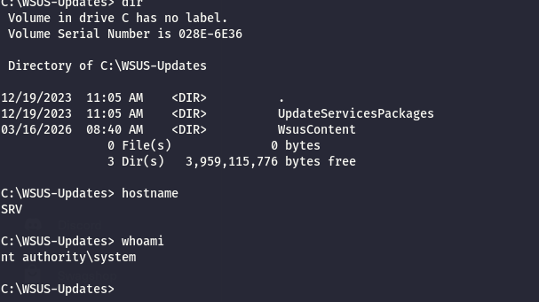
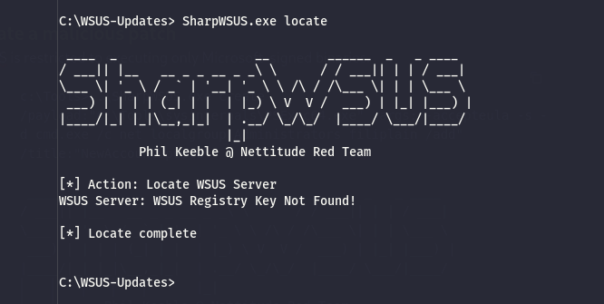
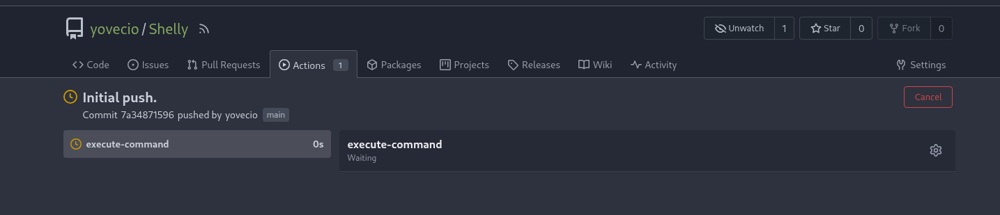

As usual I always start by checking presence of common UDP services:

```bash
└─$ nmap -F -sU 10.13.38.53                      
Starting Nmap 7.98 ( https://nmap.org ) at 2026-03-16 15:15 +0100
Nmap scan report for 10.13.38.53
Host is up (0.026s latency).
Not shown: 97 open|filtered udp ports (no-response)
PORT    STATE SERVICE
53/udp  open  domain
88/udp  open  kerberos-sec
123/udp open  ntp

Nmap done: 1 IP address (1 host up) scanned in 2.72 seconds

```

Nothing interesting so far, but what about the TCP counterparts instead? From here I can understand that this the DC server:

```bash
PORT      STATE SERVICE       REASON          VERSION
53/tcp    open  domain        syn-ack ttl 127 Simple DNS Plus
88/tcp    open  kerberos-sec  syn-ack ttl 127 Microsoft Windows Kerberos (server time: 2026-03-16 14:23:53Z)
135/tcp   open  msrpc         syn-ack ttl 127 Microsoft Windows RPC
139/tcp   open  netbios-ssn   syn-ack ttl 127 Microsoft Windows netbios-ssn
389/tcp   open  ldap          syn-ack ttl 127 Microsoft Windows Active Directory LDAP (Domain: tea.vl, Site: Default-First-Site-Name)
445/tcp   open  microsoft-ds? syn-ack ttl 127
464/tcp   open  kpasswd5?     syn-ack ttl 127
593/tcp   open  ncacn_http    syn-ack ttl 127 Microsoft Windows RPC over HTTP 1.0
636/tcp   open  tcpwrapped    syn-ack ttl 127
3268/tcp  open  ldap          syn-ack ttl 127 Microsoft Windows Active Directory LDAP (Domain: tea.vl, Site: Default-First-Site-Name)
3269/tcp  open  tcpwrapped    syn-ack ttl 127
3389/tcp  open  ms-wbt-server syn-ack ttl 127 Microsoft Terminal Services
|_ssl-date: 2026-03-16T14:25:26+00:00; 0s from scanner time.
| rdp-ntlm-info: 
|   Target_Name: TEA
|   NetBIOS_Domain_Name: TEA
|   NetBIOS_Computer_Name: DC
|   DNS_Domain_Name: tea.vl
|   DNS_Computer_Name: DC.tea.vl
|   Product_Version: 10.0.20348
|_  System_Time: 2026-03-16T14:24:47+00:00
| ssl-cert: Subject: commonName=DC.tea.vl
| Issuer: commonName=DC.tea.vl
| Public Key type: rsa
| Public Key bits: 2048
| Signature Algorithm: sha256WithRSAEncryption
| Not valid before: 2026-03-15T03:38:48
| Not valid after:  2026-09-14T03:38:48
| MD5:     d9ce 2c85 4196 8f9a da88 7de5 ce8f e119
| SHA-1:   76fb d54d 81f2 b128 cfb2 6dae f954 c1ba 5bc7 6cbb
| SHA-256: d275 402b 6b4c 7f1d c534 79d3 88cf cadc 9e19 a9bf abb6 a68b 481a bb2d 9557 44f1
| -----BEGIN CERTIFICATE-----
| MIIC1jCCAb6gAwIBAgIQF9kx39rGHqBMEG5vIXJrCTANBgkqhkiG9w0BAQsFADAU
| MRIwEAYDVQQDEwlEQy50ZWEudmwwHhcNMjYwMzE1MDMzODQ4WhcNMjYwOTE0MDMz
| ODQ4WjAUMRIwEAYDVQQDEwlEQy50ZWEudmwwggEiMA0GCSqGSIb3DQEBAQUAA4IB
| DwAwggEKAoIBAQD0Snat0LCGU2lD/bOJ35Ct4uRHGn4W16LFhXvzSfeM4eBqb7qz
| DiaU6KReaJQJTT9DMjqNPH8+Td4lkDz7K6NLlIjKRlbofiBXIn8r9nOZC7rza8aK
| HGG1KHWdoRfMPaR04u+6MefE83x8jj3shynAXfPWrvd+wTDxu9eBHblX/87wCugS
| EAReaN+lADDaSLE/AeY8oMtgnvrmfQu9jfQpgcPTtWg764dbWbKzfrLHSRJZjRwq
| 6FHeVoBtM1NVLhefs6DSMH1VVNqQjH7IAzurII6Ack3budJrBqzKkZhl5d3CW75R
| iANj1iAf8+SGBifabAxVPjlzwGIOYQKhOjyNAgMBAAGjJDAiMBMGA1UdJQQMMAoG
| CCsGAQUFBwMBMAsGA1UdDwQEAwIEMDANBgkqhkiG9w0BAQsFAAOCAQEAKwsCGxBn
| GqVG9gZxwkXH5wrlesKpnmiVNGJUL5dVdVot97IQj8M3o81VyD7u2WgUTYGJDKAk
| dkTerHP66kNjEgpmKQUqxkamqwtT6HAoiLvSQ+jmO7Ld6ognHwPnyH8H+B1VFJgd
| V+Le6vW6eLZADsYLIxijvoVRhkEzS+yWXmZhXArd0+6AZYIsmZ9ntlws8LABsAtz
| 1ahn0YWC5apqe4k6t4zXHQ9GPkfZHEUfMGjElfNBjZF/3j4udR6gnc9A3cQ18pwq
| P8s+pPpDEbtq1ymK0oCRcZACuB8UL1rtR43xbAO09GQfQY2hqfz2YibIxRD16joD
| 02683GB00Podcg==
|_-----END CERTIFICATE-----
9389/tcp  open  mc-nmf        syn-ack ttl 127 .NET Message Framing
49664/tcp open  msrpc         syn-ack ttl 127 Microsoft Windows RPC
49668/tcp open  msrpc         syn-ack ttl 127 Microsoft Windows RPC
49669/tcp open  ncacn_http    syn-ack ttl 127 Microsoft Windows RPC over HTTP 1.0
61329/tcp open  msrpc         syn-ack ttl 127 Microsoft Windows RPC
61332/tcp open  msrpc         syn-ack ttl 127 Microsoft Windows RPC
61340/tcp open  msrpc         syn-ack ttl 127 Microsoft Windows RPC
61352/tcp open  msrpc         syn-ack ttl 127 Microsoft Windows RPC
Warning: OSScan results may be unreliable because we could not find at least 1 open and 1 closed port
Device type: general purpose
Running (JUST GUESSING): Microsoft Windows 2022 (88%)
OS CPE: cpe:/o:microsoft:windows_server_2022
OS fingerprint not ideal because: Missing a closed TCP port so results incomplete
Aggressive OS guesses: Microsoft Windows Server 2022 (88%)
No exact OS matches for host (test conditions non-ideal).
TCP/IP fingerprint:
SCAN(V=7.98%E=4%D=3/16%OT=53%CT=%CU=%PV=Y%DS=2%DC=T%G=N%TM=69B812D7%P=x86_64-pc-linux-gnu)
SEQ(SP=103%GCD=1%ISR=10D%II=I%TS=A)
SEQ(SP=109%GCD=1%ISR=10C%II=I%TS=A)
OPS(O1=M552NW8ST11%O2=M552NW8ST11%O3=M552NW8NNT11%O4=M552NW8ST11%O5=M552NW8ST11%O6=M552ST11)
WIN(W1=FFFF%W2=FFFF%W3=FFFF%W4=FFFF%W5=FFFF%W6=FFDC)
ECN(R=Y%DF=Y%TG=80%W=FFFF%O=M552NW8NNS%CC=Y%Q=)
T1(R=Y%DF=Y%TG=80%S=O%A=S+%F=AS%RD=0%Q=)
T2(R=N)
T3(R=N)
T4(R=N)
U1(R=N)
IE(R=Y%DFI=N%TG=80%CD=Z)

Uptime guess: 0.450 days (since Mon Mar 16 04:37:03 2026)
Network Distance: 2 hops
TCP Sequence Prediction: Difficulty=259 (Good luck!)
IP ID Sequence Generation: Busy server or unknown class
Service Info: Host: DC; OS: Windows; CPE: cpe:/o:microsoft:windows

Host script results:
| smb2-security-mode: 
|   3.1.1: 
|_    Message signing enabled and required
|_clock-skew: mean: 0s, deviation: 0s, median: 0s
| p2p-conficker: 
|   Checking for Conficker.C or higher...
|   Check 1 (port 46645/tcp): CLEAN (Timeout)
|   Check 2 (port 30488/tcp): CLEAN (Timeout)
|   Check 3 (port 62523/udp): CLEAN (Timeout)
|   Check 4 (port 40972/udp): CLEAN (Timeout)
|_  0/4 checks are positive: Host is CLEAN or ports are blocked
| smb2-time: 
|   date: 2026-03-16T14:24:49
|_  start_date: N/A

TRACEROUTE (using port 445/tcp)
HOP RTT      ADDRESS
1   22.52 ms 10.10.14.1
2   22.70 ms 10.13.38.53

```

# DNS

Now since I suspect the server is running some kind of custom webapp I will fuzz the DNS and bruteforce for possible hidden vhosts withotu showing anything interesting:

```bash
─$ dnsenum --dnsserver 10.13.38.53 --enum -p 0 -s 0 -o subdomains.txt -f /usr/share/seclists/Discovery/DNS/subdomains-top1million-20000.txt tea.vl   
dnsenum VERSION:1.3.1

-----   tea.vl   -----


Host's addresses:
__________________

tea.vl.                                  600      IN    A        10.13.38.53


Name Servers:
______________

dc.tea.vl.                               3600     IN    A        10.13.38.53


Mail (MX) Servers:
___________________


Trying Zone Transfers and getting Bind Versions:
_________________________________________________

unresolvable name: dc.tea.vl at /usr/bin/dnsenum line 892 thread 1.

Trying Zone Transfer for tea.vl on dc.tea.vl ... 
AXFR record query failed: no nameservers


Brute forcing with /usr/share/seclists/Discovery/DNS/subdomains-top1million-20000.txt:
_______________________________________________________________________________________

dc.tea.vl.                               3600     IN    A        10.13.38.53
srv.tea.vl.                              1200     IN    A        10.13.38.54
gc._msdcs.tea.vl.                        600      IN    A        10.13.38.53
domaindnszones.tea.vl.                   600      IN    A        10.13.38.53
forestdnszones.tea.vl.                   600      IN    A        10.13.38.53


Launching Whois Queries:
_________________________


tea.vl______


Performing reverse lookup on 0 ip addresses:
_____________________________________________


0 results out of 0 IP addresses.


tea.vl ip blocks:
__________________


done.

```

Now at this point I suspect I need to move on to the application server.

# The last stretch

Now judging by the page on the SRV server and since I am Administrator I suspect the next step involves working with WUSUS in order to obtain a shell?



Now for some damn reason it is not finding the WSUS settings?  


Which might means that the WSUS is installed in DC?

# The next day

Now the next day clerarly the machine is broken as the runner is being stuck att executing code, for this reason I will skip this challenge.

