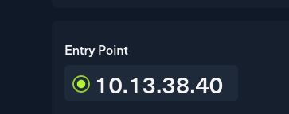
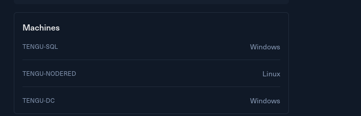

# Introduction

You are tasked with performing a penetration test on Tengu, involving a mixed Active Directory environment.

Tengu is a small Active Directory scenario that involves typical vulnerabilities found in real world company environments.

Tengu is designed for penetration testers and red teamers in search of a quick and challenging lab.

This **Red Team Operator I** lab will expose players to:

- Active Directory attacks
- Pivoting into internal networks
- MSSQL attacks
- Kerberos attacks
- DPAPI operations

&nbsp;

# Entry Point

As usual I am provided of a single IP as entry point in this challenge:

And I can see a glimpse of the tech-stack used by this challenge as well:  

Without furhter do, I will move on to the next page.

&nbsp;